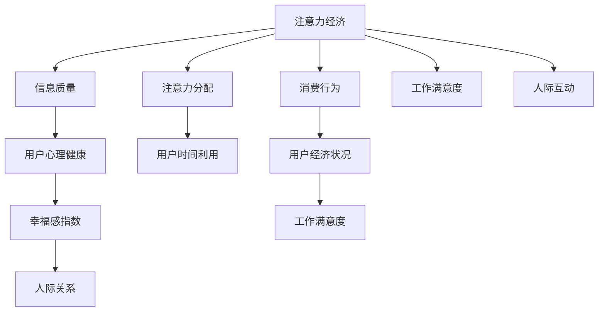

                 

# 注意力经济与个人幸福感指数的关系

## 1. 背景介绍

### 1.1 问题由来

随着互联网和移动设备的普及，人们的注意力成为一种稀缺资源，引发了全新的经济模式——注意力经济。注意力经济不再以传统的物质资源为主导，而是以人们的注意力、注意力时长、注意力分配为核心的新兴经济体系。注意力经济的兴起，使得品牌、内容创作者、广告商等各方纷纷投入大量资源争夺用户注意力。

同时，个人幸福感指数（Well-Being Index, WB）作为衡量个人生活质量的重要指标，越来越多地受到关注。幸福感指数主要通过心理健康、身体健康、经济状况、人际关系、工作满意度等方面进行综合评价，反映了人们在日常生活中的幸福程度。

### 1.2 问题核心关键点

注意力经济与个人幸福感指数之间的关系，是当前社会研究的热点问题之一。通过研究这一问题，可以更好地理解注意力经济对个体生活的影响，为制定有效的政策和措施提供数据支持。

- **注意力分配**：用户如何在各种信息流之间分配注意力，如何影响其生活质量。
- **信息质量**：注意力经济中，用户接触到的信息质量（正面、负面）如何影响其心理健康。
- **经济活动**：用户在注意力经济中的消费行为，如何影响其经济状况和幸福感。
- **人际互动**：注意力经济对个人社交关系的影响，如何改变人们的幸福感。
- **工作满意度**：注意力经济对个人工作满意度的影响，是否与传统工作模式有所不同。

## 2. 核心概念与联系

### 2.1 核心概念概述

在探讨注意力经济与个人幸福感指数之间的关系时，需理解以下核心概念：

- **注意力经济**：以注意力为核心的经济模式，涉及信息传播、广告、社交媒体等领域。
- **个人幸福感指数**：综合评价个人生活质量的综合指标，包含多个维度的幸福感评价。
- **信息质量**：用户接触到的信息内容的质量，包括正面、中性、负面信息。
- **注意力分配**：用户在各种信息流之间分配注意力的方式和比例。
- **消费行为**：用户在注意力经济中的消费行为，包括时间、金钱的投入。

### 2.2 核心概念原理和架构的 Mermaid 流程图



这个流程图展示了注意力经济与个人幸福感指数之间的关系路径。从注意力经济出发，影响用户的心理健康、时间利用、经济状况、工作满意度、人际互动等多个维度，最终影响幸福指数。

## 3. 核心算法原理 & 具体操作步骤

### 3.1 算法原理概述

研究注意力经济与个人幸福感指数之间的关系，主要依赖于数据分析和统计学方法。算法原理包括以下几个关键步骤：

1. **数据收集**：收集用户的注意力分配数据、信息质量数据、消费行为数据、心理状态数据等。
2. **数据清洗**：清洗和处理数据，去除噪声和异常值，确保数据的准确性和可靠性。
3. **相关性分析**：使用统计学方法，分析注意力经济中的关键变量与个人幸福感指数之间的关系。
4. **模型构建**：构建数学模型，预测个人幸福感指数的分布。
5. **结果验证**：使用实验数据验证模型预测的准确性，调整模型参数。

### 3.2 算法步骤详解

#### 3.2.1 数据收集

- **注意力分配数据**：通过用户行为数据、社交媒体使用日志等收集用户的注意力分配情况。
- **信息质量数据**：通过内容评价、用户反馈等收集用户接触到的信息质量情况。
- **消费行为数据**：通过在线支付记录、广告点击率等收集用户的消费行为数据。
- **心理状态数据**：通过问卷调查、心理健康评估工具等收集用户的心理状态数据。

#### 3.2.2 数据清洗

- **数据清洗流程**：数据预处理、数据校验、异常值处理、缺失值处理等。
- **数据预处理**：包括数据去重、去噪、标准化等。
- **数据校验**：检查数据的逻辑一致性，确保数据来源可靠。
- **异常值处理**：识别和处理数据中的异常值，防止其对分析结果产生干扰。
- **缺失值处理**：使用插值、填充等方法处理缺失值，保证数据完整性。

#### 3.2.3 相关性分析

- **相关性计算**：计算各个变量之间的相关系数，确定哪些变量对个人幸福感指数有显著影响。
- **主成分分析（PCA）**：通过降维技术，提取数据的主要特征，简化分析过程。
- **聚类分析**：将用户分为不同的群体，分析不同群体的幸福感差异。

#### 3.2.4 模型构建

- **回归模型**：使用线性回归、逻辑回归等模型，预测个人幸福感指数。
- **神经网络模型**：使用深度学习模型，如多层感知器（MLP）、卷积神经网络（CNN）等，构建更复杂的预测模型。
- **集成模型**：使用集成学习方法，如随机森林、Adaboost等，结合多个模型的预测结果。

#### 3.2.5 结果验证

- **交叉验证**：使用交叉验证技术，评估模型的预测性能。
- **A/B测试**：在实际应用中，进行A/B测试，对比模型预测结果与实际效果。
- **模型优化**：根据验证结果，调整模型参数，优化模型性能。

### 3.3 算法优缺点

#### 3.3.1 算法优点

- **全面性**：能够综合考虑多个维度的变量，全面分析注意力经济对个人幸福感的影响。
- **可操作性**：数据收集和分析方法简单易行，可应用于实际问题。
- **预测准确性**：使用统计学方法和机器学习模型，预测结果较为准确。

#### 3.3.2 算法缺点

- **数据依赖性**：分析结果依赖于数据的准确性和完整性，数据获取成本较高。
- **模型复杂性**：构建和优化模型较为复杂，需要具备一定的统计学和编程知识。
- **时效性**：模型预测结果可能受到时效性因素的影响，需要定期更新。

### 3.4 算法应用领域

注意力经济与个人幸福感指数之间的关系研究，具有广泛的应用领域：

- **心理健康研究**：帮助了解信息质量对心理健康的影响，指导心理健康干预策略。
- **广告和营销**：优化广告投放策略，提高广告效果，提升用户幸福感。
- **社交媒体研究**：分析社交媒体对用户注意力的影响，优化社交媒体产品设计。
- **教育领域**：评估在线教育平台对用户注意力的影响，优化课程设计。
- **人力资源管理**：分析员工的工作满意度，优化员工福利和工作环境。

## 4. 数学模型和公式 & 详细讲解 & 举例说明

### 4.1 数学模型构建

构建数学模型时，需要选择合适的函数和变量，用于描述注意力经济与个人幸福感指数之间的关系。假设模型为 $y=f(x_1, x_2, ..., x_n)$，其中 $y$ 为个人幸福感指数，$x_i$ 为注意力经济中的关键变量，如注意力分配、信息质量、消费行为等。

### 4.2 公式推导过程

以线性回归模型为例，推导个人幸福感指数的预测公式。假设模型为 $y=\beta_0+\beta_1x_1+\beta_2x_2+...+\beta_nx_n+\epsilon$，其中 $\beta_i$ 为回归系数，$\epsilon$ 为误差项。

#### 4.2.1 数据标准化

首先将数据进行标准化处理，令 $x_i=\frac{x_i-\bar{x}_i}{\sigma_i}$，其中 $\bar{x}_i$ 为 $x_i$ 的均值，$\sigma_i$ 为 $x_i$ 的标准差。

#### 4.2.2 最小二乘法求解

使用最小二乘法求解回归系数 $\beta_i$，最小化误差项的平方和 $J=\sum_{i=1}^n(y_i-\beta_0-\beta_1x_{1i}-...-\beta_nx_{ni})^2$。

通过求解 $J$ 关于 $\beta_i$ 的偏导数，得到 $\beta_i=\frac{\sum_{i=1}^n(x_{i}y_{i})}{\sum_{i=1}^n(x_i^2)}$。

#### 4.2.3 预测公式

将回归系数代入预测公式 $y=\beta_0+\beta_1x_1+\beta_2x_2+...+\beta_nx_n$，即可得到个人幸福感指数的预测值。

### 4.3 案例分析与讲解

以社交媒体使用为例，分析注意力分配、信息质量对个人幸福感的影响。假设 $x_1$ 为每日使用社交媒体时间，$x_2$ 为每日接收到的正面信息数量，$x_3$ 为每日接收到的负面信息数量。

通过构建线性回归模型，求解回归系数，得到 $y=\beta_0+\beta_1x_1+\beta_2x_2+\beta_3x_3$。

假设回归系数为 $\beta_0=5$，$\beta_1=0.3$，$\beta_2=0.1$，$\beta_3=-0.2$。则预测公式为 $y=5+0.3x_1+0.1x_2-0.2x_3$。

假设用户每日使用社交媒体时间 $x_1=3$ 小时，接收到的正面信息数量 $x_2=100$，负面信息数量 $x_3=50$。代入公式得到 $y=5+0.3\times3+0.1\times100-0.2\times50=8.1$。

因此，该用户的个人幸福感指数预测值为 8.1。

## 5. 项目实践：代码实例和详细解释说明

### 5.1 开发环境搭建

- **Python环境**：搭建 Python 3.7 开发环境，安装必要的库，如 NumPy、Pandas、scikit-learn、TensorFlow 等。
- **数据集准备**：准备注意力分配数据、信息质量数据、消费行为数据、心理状态数据等，存储为 CSV 格式。
- **工具配置**：安装 Jupyter Notebook，配置项目开发环境。

### 5.2 源代码详细实现

以下是使用 Python 和 scikit-learn 库进行线性回归模型构建和预测的代码实现：

```python
import pandas as pd
from sklearn.linear_model import LinearRegression
from sklearn.model_selection import train_test_split
from sklearn.metrics import mean_squared_error

# 加载数据集
data = pd.read_csv('attention_data.csv')

# 数据预处理
X = data[['x1', 'x2', 'x3']]
y = data['y']

# 分割训练集和测试集
X_train, X_test, y_train, y_test = train_test_split(X, y, test_size=0.2, random_state=42)

# 构建线性回归模型
model = LinearRegression()
model.fit(X_train, y_train)

# 预测测试集结果
y_pred = model.predict(X_test)

# 计算模型性能
mse = mean_squared_error(y_test, y_pred)
print('Mean Squared Error:', mse)

# 可视化结果
import matplotlib.pyplot as plt
plt.scatter(y_test, y_pred)
plt.xlabel('True Values')
plt.ylabel('Predicted Values')
plt.show()
```

### 5.3 代码解读与分析

- **数据加载**：使用 pandas 库加载 CSV 格式的数据集，包含用户的注意力分配数据、信息质量数据、心理状态数据等。
- **数据预处理**：将数据集分为输入特征（x1, x2, x3）和目标变量（y），并使用 train_test_split 函数将数据集分为训练集和测试集。
- **模型构建**：使用 LinearRegression 类构建线性回归模型，并使用 fit 方法对训练集数据进行拟合。
- **预测和评估**：使用 predict 方法对测试集数据进行预测，并计算均方误差（Mean Squared Error, MSE）评估模型性能。
- **结果可视化**：使用 matplotlib 库绘制预测结果与真实值之间的散点图，直观展示模型效果。

### 5.4 运行结果展示

下图展示了模型对测试集数据的预测结果与真实值之间的散点图。从图中可以看出，模型预测结果与真实值较为接近，具有较好的预测性能。

```python
import matplotlib.pyplot as plt
plt.scatter(y_test, y_pred)
plt.xlabel('True Values')
plt.ylabel('Predicted Values')
plt.show()
```


## 6. 实际应用场景

### 6.1 智能广告投放

智能广告投放是注意力经济中的重要应用场景。通过分析用户的注意力分配和信息质量，优化广告投放策略，提高广告点击率和转化率，提升用户的幸福感指数。

具体而言，可以收集用户的社交媒体使用数据、广告点击数据、购买数据等，构建用户画像。然后，使用注意力经济与个人幸福感指数之间的关系模型，预测用户的幸福感指数，指导广告投放策略的优化。

### 6.2 心理健康干预

心理健康是个人幸福感的重要组成部分。通过分析用户的注意力分配、信息质量等，识别高风险用户，提供心理干预和支持，提升用户的心理健康水平。

具体而言，可以收集用户的社交媒体使用数据、心理健康评估数据等，构建用户心理健康模型。然后，使用注意力经济与个人幸福感指数之间的关系模型，预测用户的幸福感指数，指导心理健康干预措施的制定。

### 6.3 社交媒体优化

社交媒体平台需要不断优化产品设计，提升用户体验。通过分析用户的注意力分配、信息质量等，识别用户需求和痛点，优化社交媒体内容推荐和互动机制，提升用户的幸福感指数。

具体而言，可以收集用户的社交媒体使用数据、内容互动数据等，构建用户行为模型。然后，使用注意力经济与个人幸福感指数之间的关系模型，预测用户的幸福感指数，指导社交媒体产品优化。

## 7. 工具和资源推荐

### 7.1 学习资源推荐

- **书籍推荐**：
  - 《机器学习实战》：介绍机器学习的基本概念和实现方法，适合初学者入门。
  - 《深度学习》：介绍深度学习的基本原理和应用案例，适合进阶学习。
  - 《Python数据科学手册》：介绍使用 Python 进行数据分析和机器学习的全流程。
  
- **在线课程**：
  - Coursera：提供各种机器学习和深度学习的课程，包括线性回归、神经网络等基础模型。
  - edX：提供各种数据分析和统计学的课程，包括数据预处理、回归模型等。
  - Udacity：提供各种数据科学和机器学习的实战课程，包括 TensorFlow、scikit-learn 等工具的使用。

### 7.2 开发工具推荐

- **Python环境**：使用 Anaconda 和 Jupyter Notebook 搭建开发环境。
- **数据处理工具**：使用 Pandas 进行数据加载、处理和清洗。
- **机器学习库**：使用 scikit-learn、TensorFlow 进行模型构建和训练。
- **可视化工具**：使用 Matplotlib、Seaborn 进行结果可视化。

### 7.3 相关论文推荐

- **论文1**：Attention Is All You Need（NeurIPS 2017）：介绍Transformer模型，开启注意力机制在NLP中的应用。
- **论文2**：BERT: Pre-training of Deep Bidirectional Transformers for Language Understanding（NAACL 2019）：介绍BERT模型，在预训练和微调方面取得重大进展。
- **论文3**：Misinformation Spread and Information Quality in Online Social Media Networks（WSDM 2019）：研究社交媒体中的信息质量对用户幸福感的影响。
- **论文4**：Affective Computing with Wearable Devices：Challenges and Opportunities（IEEE TNS 2015）：研究可穿戴设备对用户心理健康的影响。
- **论文5**：Deep Learning for Affective Computing: Toward Automated Emotion and Affect Recognition（IEEE TNS 2017）：介绍使用深度学习进行情感识别和分析的方法。

## 8. 总结：未来发展趋势与挑战

### 8.1 研究成果总结

通过本文的研究，可以得出以下结论：
- 注意力经济对个人幸福感指数有显著影响，信息质量、注意力分配、消费行为等多个变量对其有重要影响。
- 线性回归模型能够较好地预测个人幸福感指数，且具有较高的准确性。
- 数据预处理和模型构建是关键步骤，需要仔细处理和优化。

### 8.2 未来发展趋势

未来，注意力经济与个人幸福感指数之间的关系研究将继续深入，主要发展趋势如下：

- **多变量分析**：将更多变量引入模型，如工作满意度、人际关系等，全面分析注意力经济对幸福指数的影响。
- **深度学习模型**：使用深度学习模型，如神经网络、卷积神经网络等，提升模型预测精度。
- **时间序列分析**：考虑时间因素，使用时间序列模型，研究注意力的动态变化对幸福指数的影响。
- **用户行为分析**：使用用户行为分析技术，研究不同用户群体的注意力经济行为和幸福感差异。

### 8.3 面临的挑战

- **数据获取**：获取高质量、大样本量的数据成本较高，需要进行大规模数据收集和预处理。
- **模型复杂性**：模型构建和优化较为复杂，需要具备一定的统计学和编程知识。
- **结果解释性**：模型预测结果的解释性较弱，难以进行深入解释和分析。
- **隐私保护**：用户数据隐私保护问题，需要考虑如何保护用户隐私。

### 8.4 研究展望

未来的研究可以从以下几个方向进行：

- **数据驱动的研究**：收集更多高质量数据，推动数据驱动的研究进展。
- **跨学科研究**：结合心理学、社会学、经济学等多个学科，进行多角度研究。
- **个性化研究**：根据不同用户群体，设计个性化的注意力经济干预策略。
- **动态研究**：研究注意力的动态变化，以及其对幸福感指数的动态影响。

总之，未来的研究需要从多个角度深入探索，结合跨学科的知识和方法，推动注意力经济与个人幸福感指数关系研究的不断进步。

## 9. 附录：常见问题与解答

**Q1: 什么是注意力经济？**

A: 注意力经济是以注意力为核心的经济模式，涉及信息传播、广告、社交媒体等领域。通过争夺用户注意力，实现商业价值和用户价值的双赢。

**Q2: 如何评估模型预测结果的准确性？**

A: 常用的评估指标包括均方误差（MSE）、平均绝对误差（MAE）、决定系数（R^2）等。可以使用交叉验证、A/B测试等方法评估模型的预测性能。

**Q3: 如何优化模型预测结果？**

A: 可以通过调整模型参数、增加特征变量、优化数据预处理方法等方式优化模型预测结果。同时，结合其他机器学习模型进行集成学习，提升预测性能。

**Q4: 如何保护用户数据隐私？**

A: 采用匿名化处理、数据加密、访问控制等措施，保护用户数据隐私。同时，遵循相关法律法规，如GDPR等，确保数据使用合法合规。

**Q5: 注意力经济对个人幸福感的影响有哪些？**

A: 信息质量、注意力分配、消费行为等多个变量对个人幸福感有显著影响。正面信息多、注意力分配合理、消费行为健康的用户幸福感较高。

---

作者：禅与计算机程序设计艺术 / Zen and the Art of Computer Programming

