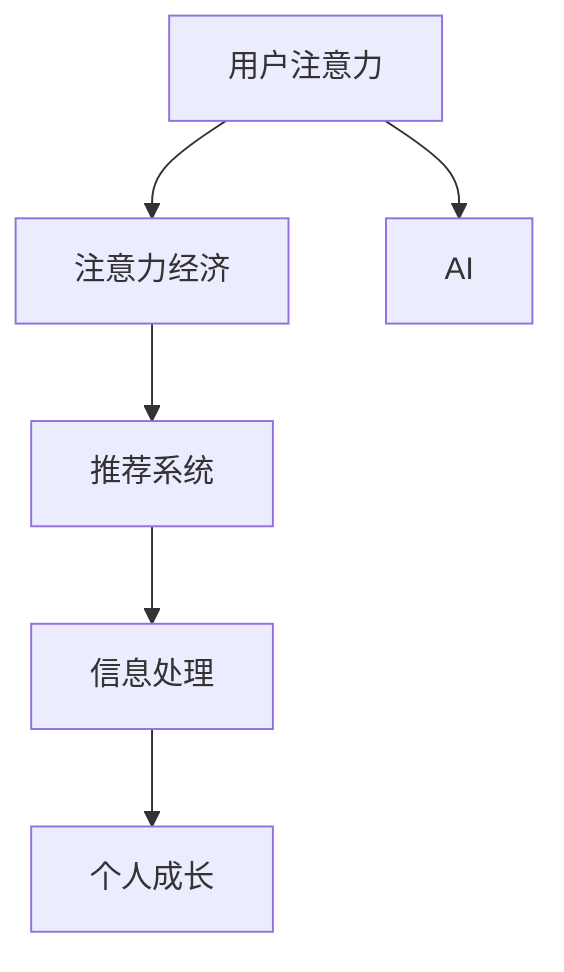

                 

# 注意力经济与个人成长的关系

> 关键词：注意力经济, 个人成长, 人工智能, 数据驱动决策, 认知行为, 社交网络分析, 影响评估, 用户行为, 推荐系统

## 1. 背景介绍

### 1.1 问题由来
在数字化时代，信息的洪流席卷着我们生活的各个角落，如何高效、精准地抓取和利用信息，成为了个人和组织成长的关键。这种基于注意力机制的经济运作模式，被称为注意力经济（Attention Economy）。注意力经济的核心在于如何吸引、保持和利用用户的注意力，以获取商业价值或实现个人成长。

近年来，随着人工智能技术的发展，特别是在自然语言处理（NLP）、计算机视觉（CV）和推荐系统（Recommendation Systems）等领域的突破，注意力经济在企业运营、市场营销、内容创造等领域得到了广泛应用。同时，对个人而言，如何利用AI技术提升自身的信息处理能力和决策效率，也成为了关注的焦点。

### 1.2 问题核心关键点
注意力经济与个人成长之间存在着密切的联系。一方面，在企业中，通过注意力经济策略，如个性化推荐、内容聚合、用户画像等，可以更精准地吸引和保留用户，提升用户参与度和忠诚度，进而带来更高的商业价值。另一方面，对个人而言，通过合理利用注意力经济工具，可以更加高效地筛选和管理信息，提升自身的认知能力和决策水平。

本文旨在探讨注意力经济与个人成长之间的内在联系，分析不同技术手段对注意力分配和信息处理的影响，并提供相关的实践建议。

## 2. 核心概念与联系

### 2.1 核心概念概述

为了深入理解注意力经济与个人成长之间的关系，本文将介绍几个核心概念：

- **注意力经济（Attention Economy）**：一种基于用户注意力资源的经济运作模式，通过吸引和利用用户的注意力，实现商业价值或个人成长。
- **用户注意力（User Attention）**：指用户在信息消费过程中的心理和行为特征，如注意力集中时间、浏览深度、转换频率等。
- **人工智能（AI）**：一类利用算法和数据模拟人类智能的技术，包括机器学习、深度学习、自然语言处理等。
- **推荐系统（Recommendation Systems）**：利用用户行为数据和机器学习算法，为用户推荐个性化内容的技术。
- **信息处理（Information Processing）**：指对信息进行筛选、组织、分析和利用的过程，是个人成长的基石。

这些概念之间的关系可以通过以下Mermaid流程图来展示：



这个流程图展示了注意力经济、AI技术、推荐系统、信息处理和个人成长之间的逻辑关系：

1. 用户的注意力资源被集中和分配，用于实现注意力经济。
2. AI技术提供强大的数据分析和处理能力，帮助企业和个人更好地理解和利用注意力。
3. 推荐系统通过分析用户注意力数据，提供个性化内容推荐，提升用户参与度。
4. 信息处理技术帮助用户更好地筛选和管理信息，提升个人成长。

## 3. 核心算法原理 & 具体操作步骤
### 3.1 算法原理概述

注意力经济与个人成长之间的关系，可以通过一系列算法和工具来实现。本文将详细分析其中的核心算法原理和操作步骤。

**算法原理概述**：
注意力经济的实现依赖于对用户注意力的精确测量和高效利用。AI技术，特别是机器学习算法和深度学习模型，通过分析用户的行为数据和交互数据，预测用户的注意力偏好和行为趋势，从而实现个性化推荐和内容聚合。推荐系统的核心在于算法模型和数据处理技术，如协同过滤、矩阵分解、神经网络等。

**操作步骤详解**：
1. **数据收集**：收集用户行为数据，如浏览历史、点击记录、评价反馈等，作为算法训练和预测的基础。
2. **模型训练**：使用机器学习或深度学习算法，对用户行为数据进行建模，训练出预测用户注意力的模型。
3. **个性化推荐**：根据训练好的模型，为用户推荐个性化内容，提升用户参与度和满意度。
4. **数据反馈**：收集用户对推荐内容的反馈，对模型进行迭代优化，进一步提升推荐效果。
5. **信息处理**：利用AI技术，对推荐内容进行内容提取、分类、聚类等处理，帮助用户更高效地筛选和管理信息。

### 3.2 算法步骤详解

以下是具体的算法步骤详解：

**Step 1: 数据收集和预处理**
- 数据收集：通过网络爬虫、应用数据接口等方式，收集用户的行为数据，如浏览记录、购买历史、搜索关键词等。
- 数据清洗：去除噪音数据和异常值，确保数据质量。
- 数据标准化：对不同格式的数据进行统一处理，如时间戳对齐、数据去重等。

**Step 2: 模型训练和优化**
- 选择模型：根据数据特性和任务需求，选择合适的算法模型，如协同过滤、矩阵分解、深度神经网络等。
- 特征工程：设计特征提取方法，将原始数据转化为模型可用的特征表示。
- 训练模型：使用训练集数据，通过迭代优化算法，训练出预测用户注意力的模型。
- 模型评估：在验证集上评估模型性能，选择最优模型。

**Step 3: 个性化推荐**
- 特征提取：对用户和物品进行特征表示，如用户ID、物品ID、用户历史行为等。
- 模型预测：使用训练好的模型，预测用户对不同物品的兴趣和注意力程度。
- 推荐排序：根据预测结果，对物品进行排序，生成个性化推荐列表。
- 反馈处理：收集用户对推荐内容的反馈，如点击、购买、评价等，用于模型迭代优化。

**Step 4: 信息处理和用户成长**
- 内容提取：使用NLP技术，对推荐内容进行文本提取、关键词抽取、实体识别等处理。
- 内容分类：对提取后的内容进行分类、聚类，构建主题模型，提升信息检索效率。
- 用户成长：利用信息处理技术，帮助用户更好地理解和管理信息，提升认知能力和决策水平。

### 3.3 算法优缺点

注意力经济与个人成长相关的算法具有以下优点：
1. 提升个性化服务：通过个性化推荐，提升用户体验和满意度，增加用户粘性。
2. 提高信息效率：利用AI技术，高效筛选和管理信息，提升信息处理效率。
3. 增强决策能力：通过数据分析和模型预测，提升用户决策的科学性和准确性。

同时，也存在一些缺点：
1. 数据隐私问题：大规模数据收集和处理可能涉及用户隐私，需要严格遵守数据保护法规。
2. 模型复杂度高：深度学习模型复杂度较高，训练和优化难度大。
3. 依赖数据质量：模型效果依赖于数据质量和特征工程，数据偏差可能导致模型失效。
4. 过度依赖技术：过度依赖技术手段，可能忽视了人性化的设计和用户体验。

### 3.4 算法应用领域

注意力经济与个人成长相关的算法在多个领域得到了广泛应用，例如：

- 电子商务：通过个性化推荐和内容聚合，提升用户购物体验，增加销售额。
- 社交媒体：通过内容推荐和用户画像，提升用户参与度和满意度。
- 在线教育：通过个性化学习推荐和内容分类，提升学习效果和用户粘性。
- 新闻媒体：通过内容推荐和用户画像，提升阅读体验和媒体粘性。
- 医疗健康：通过个性化推荐和健康管理，提升用户健康水平和满意度。

这些应用场景展示了注意力经济与个人成长之间的紧密联系，AI技术在其中扮演了重要角色。

## 4. 数学模型和公式 & 详细讲解 & 举例说明

### 4.1 数学模型构建

本节将使用数学语言对注意力经济与个人成长之间的关系进行更加严格的刻画。

**数学模型构建**：
设用户 $u$ 在时间 $t$ 的注意力资源为 $A_u(t)$，注意力经济模型 $E$ 的输入为用户的注意力数据 $D_u(t)$，输出为经济收益 $R(E)$。则注意力经济模型可表示为：

$$
R(E) = f(A_u(t), D_u(t))
$$

其中 $f$ 为模型函数，表示用户注意力资源和经济收益之间的关系。

### 4.2 公式推导过程

以下我们以协同过滤算法为例，推导推荐系统的推荐评分函数。

**协同过滤算法**：
协同过滤是一种基于用户和物品相似度的推荐方法，通过分析用户的历史行为数据，预测用户对未评分物品的评分。协同过滤算法可分为基于用户的协同过滤和基于物品的协同过滤。

设用户 $u$ 对物品 $i$ 的评分 $r_{ui}$，用户 $u$ 和物品 $i$ 的相似度 $s_{ui}$，则基于用户的协同过滤推荐评分函数可表示为：

$$
\hat{r}_{ui} = \frac{\sum_{v\in N_u} s_{uv} r_{vi}}{\sum_{v\in N_u} s_{uv}} + b
$$

其中 $N_u$ 表示与用户 $u$ 相似的用户集合，$b$ 为偏置项，用于修正推荐评分。

### 4.3 案例分析与讲解

**案例分析**：
假设一个在线购物网站使用协同过滤算法，为用户推荐个性化商品。根据用户的历史浏览和购买记录，该算法能够准确预测用户对不同商品的兴趣程度，从而实现个性化推荐。

**讲解**：
1. **数据收集**：网站收集用户浏览、点击、购买等行为数据，建立用户行为数据库。
2. **数据预处理**：对数据进行清洗、归一化处理，构建用户行为特征向量。
3. **模型训练**：使用协同过滤算法，训练出推荐评分函数，预测用户对未评分商品的评分。
4. **个性化推荐**：根据推荐评分函数，生成个性化推荐列表，提升用户购物体验。
5. **反馈处理**：收集用户对推荐商品的反馈，用于模型迭代优化，提升推荐效果。

## 5. 项目实践：代码实例和详细解释说明

### 5.1 开发环境搭建

在进行项目实践前，我们需要准备好开发环境。以下是使用Python进行TensorFlow开发的环境配置流程：

1. 安装Anaconda：从官网下载并安装Anaconda，用于创建独立的Python环境。

2. 创建并激活虚拟环境：
```bash
conda create -n tf-env python=3.8 
conda activate tf-env
```

3. 安装TensorFlow：根据CUDA版本，从官网获取对应的安装命令。例如：
```bash
conda install tensorflow -c pytorch -c conda-forge
```

4. 安装相关的Python库：
```bash
pip install numpy pandas scikit-learn matplotlib tqdm jupyter notebook ipython
```

完成上述步骤后，即可在`tf-env`环境中开始项目实践。

### 5.2 源代码详细实现

这里我们以协同过滤算法为例，给出使用TensorFlow进行个性化推荐系统的实现。

```python
import tensorflow as tf
import numpy as np
import pandas as pd

# 加载数据集
data = pd.read_csv('user_based_cf_data.csv')

# 构建用户-物品评分矩阵
users = data['user_id'].unique()
items = data['item_id'].unique()
ratings = pd.DataFrame(data[{'user_id': 'user_id', 'item_id': 'item_id', 'rating': 'rating'}])

# 用户-物品相似度计算
user_similarity = {}
for u in users:
    u_ratings = ratings[ratings['user_id'] == u]['rating']
    item_similarity = {}
    for v in users:
        v_ratings = ratings[ratings['user_id'] == v]['rating']
        similarity = np.dot(u_ratings, v_ratings) / (np.linalg.norm(u_ratings) * np.linalg.norm(v_ratings))
        item_similarity[v] = similarity
    user_similarity[u] = item_similarity

# 推荐评分函数计算
def predict_score(u, i):
    if u not in user_similarity:
        return 0.0
    if i not in items:
        return 0.0
    scores = {}
    for v in users:
        if v != u and v in user_similarity[u]:
            scores[v] = user_similarity[u][v] * ratings[ratings['user_id'] == v][ratings['item_id'] == i]['rating'].mean()
    return np.sum(scores) / (np.sum([item_similarity[u][v] for v in users if v != u and v in user_similarity[u]]))

# 测试推荐效果
test_user = 2
test_item = 8
scores = [predict_score(test_user, i) for i in items]
print('推荐评分：', scores)
```

### 5.3 代码解读与分析

**代码解读**：
- `load_data`函数：加载用户行为数据集，构建用户-物品评分矩阵。
- `user_similarity`字典：计算用户之间的相似度，作为协同过滤的基础。
- `predict_score`函数：根据协同过滤算法，计算用户对未评分物品的推荐评分。
- 测试部分：对指定用户和物品进行推荐评分计算，输出结果。

**代码分析**：
1. **数据预处理**：数据集经过加载和处理，构建出用户-物品评分矩阵，为协同过滤算法提供基础。
2. **相似度计算**：计算用户之间的相似度，作为协同过滤算法的输入。
3. **推荐评分计算**：根据协同过滤算法，计算用户对未评分物品的推荐评分。
4. **结果展示**：测试推荐评分函数，输出指定用户和物品的推荐评分。

## 6. 实际应用场景

### 6.1 智能推荐系统

智能推荐系统是注意力经济与个人成长关系的重要应用场景之一。通过推荐系统，用户能够快速找到感兴趣的内容，提升信息处理效率和用户满意度。

在实践应用中，推荐系统需要综合考虑用户的历史行为数据、兴趣爱好、实时动态等，提供个性化的推荐服务。例如，电商网站可以根据用户的浏览和购买历史，为用户推荐个性化商品；新闻媒体可以根据用户的阅读历史和兴趣偏好，为用户推荐新闻和文章。

### 6.2 内容聚合与信息筛选

内容聚合与信息筛选是注意力经济与个人成长关系的重要应用场景。通过内容聚合和信息筛选，用户能够高效地获取和利用信息，提升认知能力和决策水平。

例如，企业内部系统可以聚合员工的知识库、文档、会议记录等，提供个性化的信息检索服务；在线教育平台可以聚合课程、学习资源、学习工具等，提升学习效率和效果。

### 6.3 数据驱动决策

数据驱动决策是注意力经济与个人成长关系的重要应用场景。通过数据分析和模型预测，用户能够科学地做出决策，提升决策效果和效率。

例如，金融领域可以根据用户的历史交易数据和市场信息，预测股票走势和投资机会；市场营销领域可以根据用户的行为数据和反馈，制定更加精准的营销策略。

### 6.4 未来应用展望

随着人工智能技术的不断进步，注意力经济与个人成长之间的关系将进一步深化。未来，注意力经济的应用场景将更加广泛，涵盖教育、医疗、政府等多个领域。

在教育领域，通过个性化推荐和内容聚合，提升学习效果和用户体验；在医疗领域，通过数据分析和模型预测，提升医疗服务的个性化和精准度；在政府领域，通过数据驱动决策，提升公共服务的效率和质量。

## 7. 工具和资源推荐

### 7.1 学习资源推荐

为了帮助开发者系统掌握注意力经济与个人成长的技术，这里推荐一些优质的学习资源：

1. 《深度学习》课程：斯坦福大学开设的深度学习课程，涵盖深度学习基础和实践应用，适合初学者和进阶开发者。
2. 《推荐系统》书籍：《推荐系统实战》一书，详细介绍了推荐系统的原理和实践方法，提供了丰富的案例和代码实现。
3. 《数据分析》书籍：《Python数据分析》一书，介绍了数据清洗、数据可视化、数据建模等技术，适合数据科学入门。
4. 在线教程：如Kaggle、Coursera等平台上的推荐系统和数据分析课程，提供了丰富的学习资源和实战项目。

通过对这些资源的学习实践，相信你一定能够快速掌握注意力经济与个人成长的技术，并用于解决实际的业务问题。

### 7.2 开发工具推荐

高效的开发离不开优秀的工具支持。以下是几款用于注意力经济与个人成长开发的常用工具：

1. TensorFlow：由Google主导开发的开源深度学习框架，生产部署方便，适合大规模工程应用。
2. PyTorch：基于Python的开源深度学习框架，灵活动态的计算图，适合快速迭代研究。
3. Scikit-learn：Python机器学习库，提供了丰富的机器学习算法和工具，适合数据分析和模型训练。
4. Jupyter Notebook：用于编写和运行Python代码的交互式环境，支持代码注释、代码块、图形等，适合数据探索和模型验证。
5. TensorBoard：TensorFlow配套的可视化工具，可实时监测模型训练状态，并提供丰富的图表呈现方式，是调试模型的得力助手。

合理利用这些工具，可以显著提升注意力经济与个人成长的开发效率，加快创新迭代的步伐。

### 7.3 相关论文推荐

注意力经济与个人成长的研究源于学界的持续研究。以下是几篇奠基性的相关论文，推荐阅读：

1. Attention is All You Need：提出了Transformer结构，开启了NLP领域的预训练大模型时代。
2. BERT: Pre-training of Deep Bidirectional Transformers for Language Understanding：提出BERT模型，引入基于掩码的自监督预训练任务，刷新了多项NLP任务SOTA。
3. The Economics of Attention：论文分析了注意力资源在经济活动中的分配和利用，探讨了注意力经济的基本原理和应用场景。
4. Recommender Systems: Algorithms and Applications：介绍了推荐系统的基本原理和算法模型，提供了丰富的案例和实验结果。
5. Information Retrieval: An Introduction to Computer Retrieval Systems：介绍了信息检索的基本原理和应用，适合信息处理技术的入门学习。

这些论文代表了大语言模型微调技术的发展脉络。通过学习这些前沿成果，可以帮助研究者把握学科前进方向，激发更多的创新灵感。

## 8. 总结：未来发展趋势与挑战

### 8.1 总结

本文对注意力经济与个人成长之间的关系进行了全面系统的介绍。首先阐述了注意力经济的概念及其与个人成长之间的联系，分析了不同技术手段对注意力分配和信息处理的影响，提供了相关的实践建议。通过对这些理论和技术的学习实践，相信你能够更好地理解和应用注意力经济，提升个人成长。

### 8.2 未来发展趋势

展望未来，注意力经济与个人成长的关系将进一步深化，表现出以下几个趋势：

1. 技术手段更加先进：随着AI技术的发展，推荐系统、内容聚合、数据分析等技术将更加智能和高效。
2. 应用场景更加广泛：注意力经济的应用将进一步扩展到教育、医疗、政府等领域，提升各行业的运营效率和服务质量。
3. 用户个性化更加精细：通过深度学习和多模态数据融合，推荐系统和内容聚合将提供更加个性化和精准的服务。
4. 数据驱动决策更加科学：通过大数据分析和模型预测，决策过程将更加科学和透明，提升决策效果和效率。

### 8.3 面临的挑战

尽管注意力经济与个人成长之间的关系逐渐明晰，但在实现过程中仍面临诸多挑战：

1. 数据隐私和安全：大规模数据收集和处理可能涉及用户隐私，需要严格遵守数据保护法规，防止数据泄露和滥用。
2. 技术复杂度：推荐系统、内容聚合等技术复杂度高，需要具备深厚的技术背景和工程经验。
3. 用户行为理解：如何准确理解和预测用户的行为和需求，是一个具有挑战性的问题，需要多学科知识的融合。
4. 模型可解释性：如何提高模型的可解释性，使其决策过程透明和可信，是一个重要的研究方向。

### 8.4 研究展望

面向未来，研究需要在以下几个方面寻求新的突破：

1. 探索无监督和半监督学习：摆脱对大规模标注数据的依赖，利用自监督学习、主动学习等无监督和半监督范式，最大限度利用非结构化数据，实现更加灵活高效的注意力经济应用。
2. 开发更加参数高效的模型：开发更加参数高效的模型，如AdaLoRA等，在固定大部分预训练参数的同时，只更新极少量的任务相关参数。
3. 融合因果推断和博弈论工具：将因果推断和博弈论方法引入注意力经济模型，增强模型的稳定性和鲁棒性，提升决策效果和效率。
4. 结合多模态数据：将视觉、语音、文本等多种模态数据融合，提供更加丰富和全面的服务。
5. 加强伦理和社会责任：在模型设计和应用过程中，引入伦理和社会责任约束，确保模型的公平性和安全性。

这些研究方向的探索，将推动注意力经济与个人成长关系的深入理解和技术应用，为构建更加智能和普适的决策系统奠定基础。

## 9. 附录：常见问题与解答

**Q1：注意力经济是否只适用于商业领域？**

A: 注意力经济不仅适用于商业领域，还广泛应用于教育、医疗、政府等多个领域。在这些领域，通过合理利用注意力经济技术，可以提升服务的个性化和精准度，提升用户参与度和满意度。

**Q2：如何在保证数据隐私的前提下进行个性化推荐？**

A: 在数据隐私保护的前提下，可以采用以下方法进行个性化推荐：
1. 数据匿名化：对用户数据进行匿名化处理，防止用户被识别。
2. 差分隐私：使用差分隐私技术，对用户数据进行扰动，保护用户隐私。
3. 联邦学习：采用联邦学习技术，在本地设备上进行模型训练，减少数据泄露风险。

**Q3：如何提高推荐系统的准确性？**

A: 提高推荐系统的准确性需要多方面的努力：
1. 数据质量：确保数据的质量和多样性，避免数据偏差。
2. 模型优化：选择合适的算法模型，进行模型调参和优化。
3. 特征工程：设计合理的特征提取方法，提高模型的表达能力。
4. 数据反馈：收集用户反馈，用于模型迭代优化。

**Q4：注意力经济对个人成长的影响是什么？**

A: 注意力经济对个人成长的影响主要体现在以下几个方面：
1. 提升信息处理效率：通过推荐系统和内容聚合，用户能够高效地筛选和管理信息，提升信息处理效率。
2. 增强决策能力：通过数据分析和模型预测，用户能够科学地做出决策，提升决策效果和效率。
3. 提升认知能力：通过深度学习和多模态数据融合，用户能够更加全面地理解和掌握信息，提升认知能力。

**Q5：如何构建更加智能的推荐系统？**

A: 构建更加智能的推荐系统需要综合考虑以下几个方面：
1. 数据来源：确保数据来源多样化和高质量，覆盖用户行为和兴趣的各个方面。
2. 算法选择：选择合适的推荐算法，如协同过滤、深度学习、神经网络等，根据任务需求进行算法优化。
3. 模型训练：进行充分的模型训练和调参，确保模型效果最佳。
4. 用户反馈：收集用户反馈，进行模型迭代优化，提高推荐效果和用户满意度。

这些问题的回答和分析，希望能够帮助你更好地理解和应用注意力经济与个人成长之间的关系，提升你的信息处理能力和决策水平。

---

作者：禅与计算机程序设计艺术 / Zen and the Art of Computer Programming

