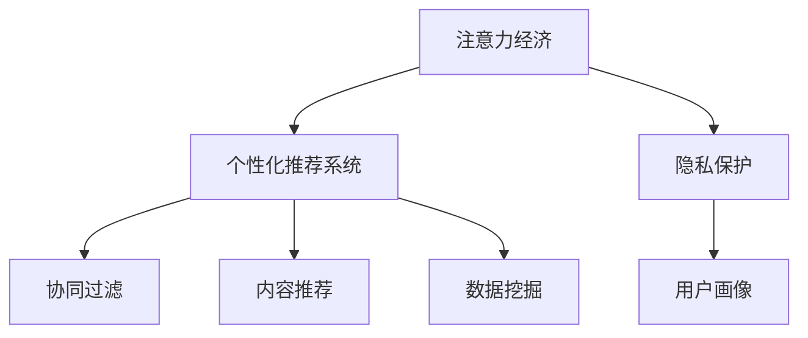

                 

# 注意力经济与个人隐私：你的数据是如何被用来操纵你的注意力的

## 1. 背景介绍

### 1.1 问题由来

在信息爆炸的互联网时代，注意力成为了一种稀缺资源。人们在面对海量的信息时，往往需要依靠某种机制来筛选和判断哪些信息值得投入时间与精力。在商业化的互联网生态中，数据被收集、分析和利用，以引导用户的注意力，从而实现商业目的。

这种基于数据的注意力操纵，被称为“注意力经济”。注意力经济不仅影响用户的决策和行为，也深刻影响社会结构、文化生态和伦理道德。然而，在这背后，用户的隐私保护和数据安全问题也日益凸显。

### 1.2 问题核心关键点

注意力经济的核心在于如何利用数据挖掘和算法设计，精准识别和引导用户的注意力，从而实现商业利益最大化。

- **数据挖掘**：通过分析用户行为数据、历史偏好、社交网络等信息，挖掘出用户的兴趣和需求。
- **算法推荐**：根据用户画像和行为数据，通过协同过滤、内容推荐、深度学习等技术，提供个性化的信息推送。
- **行为设计**：利用行为心理学的原理，设计用户界面、交互流程，引导用户产生特定的行为。

这些问题紧密关联，涉及多个技术和伦理层面，需要系统性地加以研究和解决。

## 2. 核心概念与联系

### 2.1 核心概念概述

为更好地理解注意力经济与个人隐私问题，本节将介绍几个密切相关的核心概念：

- **注意力经济**：利用数据挖掘和算法推荐，精准引导用户注意力的商业模式，如搜索引擎、社交媒体、电商、新闻推荐等。
- **个性化推荐系统**：通过分析用户行为和历史数据，为其推荐个性化内容的系统，目的是提高用户满意度和平台黏性。
- **协同过滤**：一种基于用户相似性推荐内容的算法，通过相似用户的行为相似性来推测用户喜好。
- **内容推荐**：根据内容特征和用户偏好，推荐相关内容的算法，如基于内容的过滤、深度学习推荐等。
- **数据挖掘**：从大量数据中提取有用信息和知识的过程，常用于用户行为分析和个性化推荐。
- **隐私保护**：保护用户个人信息不被滥用、泄露或非法获取的措施，包括数据匿名化、差分隐私、数据最小化等。
- **用户画像**：通过数据分析得到的用户特征和兴趣模型，用于个性化推荐和广告投放。

这些核心概念之间的逻辑关系可以通过以下Mermaid流程图来展示：



这个流程图展示了几类核心概念及其之间的联系：

1. 注意力经济通过个性化推荐系统引导用户注意力。
2. 个性化推荐系统依赖协同过滤、内容推荐等技术手段。
3. 数据挖掘为个性化推荐系统提供用户行为和兴趣分析基础。
4. 隐私保护确保用户数据的合法、安全使用。
5. 用户画像作为推荐系统的输入，构建用户特征和兴趣模型。

这些概念共同构成了注意力经济的基本框架，其背后涉及的数据挖掘、算法设计和用户行为分析等技术，对用户隐私保护提出了严峻挑战。

## 3. 核心算法原理 & 具体操作步骤
### 3.1 算法原理概述

个性化推荐系统的核心算法通常包括协同过滤、内容推荐、深度学习推荐等。其中，协同过滤和内容推荐侧重于用户行为和内容的分析，而深度学习推荐则利用神经网络模型对用户画像和内容特征进行建模。

- **协同过滤**：基于用户行为相似性推荐内容。假设用户 $i$ 对物品 $j$ 的评分是 $r_{ij}$，系统通过相似度计算找出与用户 $i$ 兴趣相似的用户 $k$，然后基于用户 $k$ 对物品 $j$ 的评分来推测用户 $i$ 的评分。
- **内容推荐**：基于物品特征相似性推荐内容。假设物品 $j$ 的特征向量为 $v_j$，系统通过计算物品 $j$ 与用户兴趣向量 $u_i$ 的相似度，推荐与用户兴趣最为接近的物品。
- **深度学习推荐**：利用神经网络模型对用户画像和内容特征进行建模。模型通过学习用户和物品间的映射关系，实现精准推荐。

### 3.2 算法步骤详解

以下以协同过滤算法为例，介绍个性化推荐系统的详细步骤：

**Step 1: 数据收集与预处理**
- 收集用户与物品的评分数据，通常以稀疏矩阵形式表示。
- 对数据进行去噪、归一化等预处理操作，确保数据的可靠性。

**Step 2: 用户相似度计算**
- 计算用户 $i$ 和用户 $j$ 的相似度 $sim(u_i,u_j)$，常用的方法包括余弦相似度、皮尔逊相关系数等。
- 设置相似度阈值 $\theta$，筛选出与用户 $i$ 兴趣相似的若干用户。

**Step 3: 物品推荐**
- 对于每个与用户 $i$ 相似的用户 $k$，计算用户 $k$ 对物品 $j$ 的评分 $r_{kj}$。
- 使用加权平均法或加权调和平均法，计算物品 $j$ 对用户 $i$ 的预测评分 $r'_{ij}$。
- 将预测评分排序，选择评分最高的物品推荐给用户 $i$。

**Step 4: 模型评估与迭代优化**
- 在测试集上评估推荐效果，常用指标包括准确率、召回率、F1-score等。
- 根据评估结果，调整相似度计算方法、加权系数等参数，不断优化推荐系统性能。

### 3.3 算法优缺点

个性化推荐系统的优点包括：

- 精准高效：利用用户行为和兴趣特征，提供个性化的推荐内容。
- 用户满意度提升：通过个性化推荐，提升用户满意度和平台黏性。
- 可扩展性强：算法相对简单，易于扩展到多种推荐场景。

缺点包括：

- 数据依赖度高：系统依赖用户行为数据，当数据稀疏或存在偏差时，推荐效果会受到影响。
- 隐私风险高：用户数据被收集和分析，隐私保护成为重要挑战。
- 过度依赖推荐：用户长期依赖推荐系统，可能导致认知固化和信息茧房效应。

### 3.4 算法应用领域

个性化推荐系统在众多领域中得到了广泛应用，包括但不限于：

- 电商推荐：根据用户浏览和购买历史，推荐相关商品。
- 新闻推荐：根据用户阅读和互动数据，推荐相关文章。
- 视频推荐：根据用户观看历史，推荐相关视频。
- 音乐推荐：根据用户听歌历史，推荐相关音乐。
- 广告投放：根据用户画像和行为数据，定向投放广告。

## 4. 数学模型和公式 & 详细讲解 & 举例说明
### 4.1 数学模型构建

本节将使用数学语言对个性化推荐系统的核心算法进行详细刻画。

假设用户 $i$ 对物品 $j$ 的评分是 $r_{ij}$，用户集合为 $U$，物品集合为 $I$。

用户 $i$ 与用户 $j$ 的相似度计算方法为：

$$
sim(u_i,u_j) = \frac{\sum_{j\in I} r_{ij}r_{kj}}{\sqrt{\sum_{j\in I} r_{ij}^2}\sqrt{\sum_{j\in I} r_{kj}^2}}
$$

其中，$r_{ij}$ 和 $r_{kj}$ 分别表示用户 $i$ 和用户 $j$ 对物品 $j$ 的评分。$sim(u_i,u_j)$ 表示用户 $i$ 和用户 $j$ 的相似度。

物品 $j$ 对用户 $i$ 的预测评分计算方法为：

$$
r'_{ij} = \frac{\sum_{k\in U} sim(u_i,u_k)r_{kj}}{\sum_{k\in U} sim(u_i,u_k)}
$$

其中，$r'_{ij}$ 表示物品 $j$ 对用户 $i$ 的预测评分。$sim(u_i,u_k)$ 表示用户 $i$ 和用户 $k$ 的相似度。

### 4.2 公式推导过程

以下我们以协同过滤算法为例，推导物品推荐公式。

设用户 $i$ 和用户 $j$ 的评分数据为 $r_{ij}$，用户集合为 $U$，物品集合为 $I$。

用户 $i$ 和用户 $j$ 的相似度 $sim(u_i,u_j)$ 为：

$$
sim(u_i,u_j) = \frac{\sum_{j\in I} r_{ij}r_{kj}}{\sqrt{\sum_{j\in I} r_{ij}^2}\sqrt{\sum_{j\in I} r_{kj}^2}}
$$

物品 $j$ 对用户 $i$ 的预测评分 $r'_{ij}$ 为：

$$
r'_{ij} = \frac{\sum_{k\in U} sim(u_i,u_k)r_{kj}}{\sum_{k\in U} sim(u_i,u_k)}
$$

将相似度计算公式代入物品推荐公式，得：

$$
r'_{ij} = \frac{\sum_{k\in U}\left(\frac{\sum_{j\in I} r_{ij}r_{kj}}{\sqrt{\sum_{j\in I} r_{ij}^2}\sqrt{\sum_{j\in I} r_{kj}^2}}\right)r_{kj}}{\sum_{k\in U}\left(\frac{\sum_{j\in I} r_{ij}r_{kj}}{\sqrt{\sum_{j\in I} r_{ij}^2}\sqrt{\sum_{j\in I} r_{kj}^2}}\right)}
$$

化简后得：

$$
r'_{ij} = \frac{\sum_{k\in U} \sum_{j\in I} r_{ij}r_{kj}^2}{\sqrt{\sum_{j\in I} r_{ij}^2}\sqrt{\sum_{k\in U} (\sum_{j\in I} r_{kj}^2)}}
$$

这就是协同过滤算法中物品推荐的数学模型。

### 4.3 案例分析与讲解

以Netflix推荐系统为例，分析协同过滤算法的应用。

Netflix推荐系统通过收集用户观看历史数据，计算用户之间的相似度，并根据相似度推荐用户可能感兴趣的电影。

假设用户 $i$ 对电影 $j$ 的评分是 $r_{ij}$，用户集合为 $U$，电影集合为 $I$。

Netflix首先计算用户 $i$ 和用户 $j$ 的评分相似度，计算方法与协同过滤算法相同。

然后，对于每个与用户 $i$ 相似的用户 $k$，计算用户 $k$ 对电影 $j$ 的评分 $r_{kj}$。

最后，Netflix使用加权平均法，计算电影 $j$ 对用户 $i$ 的预测评分 $r'_{ij}$。

Netflix通过不断调整相似度计算方法和权重，优化推荐算法，提高了用户满意度和平台黏性，并逐渐占据了在线视频推荐市场的主导地位。

## 5. 项目实践：代码实例和详细解释说明
### 5.1 开发环境搭建

在进行推荐系统开发前，我们需要准备好开发环境。以下是使用Python进行Pandas、NumPy、Scikit-learn等库进行推荐系统开发的流程：

1. 安装Anaconda：从官网下载并安装Anaconda，用于创建独立的Python环境。

2. 创建并激活虚拟环境：
```bash
conda create -n recommend-env python=3.8 
conda activate recommend-env
```

3. 安装必要的库：
```bash
conda install pandas numpy scikit-learn matplotlib
```

4. 安装Jupyter Notebook：
```bash
pip install jupyter notebook
```

完成上述步骤后，即可在`recommend-env`环境中开始推荐系统开发。

### 5.2 源代码详细实现

下面我们以协同过滤算法为例，给出使用Pandas库对推荐系统进行开发的PyTorch代码实现。

首先，定义评分矩阵：

```python
import pandas as pd

# 创建评分矩阵
rating_matrix = pd.DataFrame({
    'user1': [5, 3, 0, 0, 4],
    'user2': [4, 0, 5, 0, 0],
    'user3': [0, 5, 4, 0, 0],
    'user4': [0, 0, 0, 5, 3],
    'user5': [0, 0, 0, 4, 5]
})
rating_matrix.columns = ['user1', 'user2', 'user3', 'user4', 'user5']
rating_matrix.index = ['item1', 'item2', 'item3', 'item4', 'item5']
rating_matrix
```

然后，定义用户相似度计算函数：

```python
def cosine_similarity(user1, user2):
    user1 = user1.values
    user2 = user2.values
    return np.dot(user1, user2) / (np.linalg.norm(user1) * np.linalg.norm(user2))

# 计算用户之间的相似度
similarity_matrix = rating_matrix.apply(lambda user: [cosine_similarity(user, other) for other in rating_matrix[user]], axis=1)
similarity_matrix.columns = ['user1', 'user2', 'user3', 'user4', 'user5']
similarity_matrix.index = ['item1', 'item2', 'item3', 'item4', 'item5']
similarity_matrix
```

接着，定义物品推荐函数：

```python
def recommend_items(rating_matrix, similarity_matrix, user_id):
    user = rating_matrix.loc[user_id]
    recommendations = []
    for item in rating_matrix.columns:
        item_user = rating_matrix[item]
        similarity = similarity_matrix[item][user_id]
        recommendation = user.dot(item_user) * similarity / np.linalg.norm(user.values)
        recommendations.append((item, recommendation))
    recommendations = sorted(recommendations, key=lambda x: x[1], reverse=True)
    return recommendations
```

最后，使用推荐函数进行物品推荐：

```python
user_id = 'user1'
recommendations = recommend_items(rating_matrix, similarity_matrix, user_id)
print(f"Recommendations for user {user_id}:")
for item, recommendation in recommendations:
    print(f"{item}: {recommendation:.2f}")
```

以上代码展示了使用协同过滤算法进行物品推荐的完整实现过程。可以看到，协同过滤算法的核心在于用户相似度计算和物品评分预测，通过简单的数学模型和Python库即可完成推荐系统的开发。

### 5.3 代码解读与分析

让我们再详细解读一下关键代码的实现细节：

**创建评分矩阵**：
- 使用Pandas创建用户和物品的评分矩阵，包含用户对物品的评分数据。

**计算用户相似度**：
- 定义用户相似度计算函数，使用余弦相似度计算方法。
- 通过apply函数计算用户之间的相似度矩阵。

**推荐物品**：
- 定义推荐函数，根据用户评分和相似度矩阵计算物品推荐评分。
- 使用dot乘法和归一化方法计算物品推荐评分。
- 返回推荐物品列表，按评分排序。

**实际使用**：
- 使用推荐函数对用户进行物品推荐，并输出推荐结果。

通过以上代码，我们展示了如何使用Python和Pandas实现基本的协同过滤算法。当然，工业级的系统实现还需要考虑更多因素，如用户画像的构建、相似度计算的优化、推荐结果的展示等。但核心的推荐过程与此类似。

## 6. 实际应用场景
### 6.1 智能推荐系统

智能推荐系统已经在电商、视频、音乐、新闻等多个领域广泛应用，极大提升了用户体验和平台黏性。

例如，电商平台根据用户浏览和购买历史，推荐相关商品。通过个性化推荐，提升了用户购买转化率和平台收益。

在视频平台，推荐系统根据用户观看历史，推荐相关视频。通过个性化推荐，提升了用户观看时长和平台广告收入。

在新闻平台，推荐系统根据用户阅读和互动数据，推荐相关文章。通过个性化推荐，提升了用户阅读量和平台点击率。

### 6.2 广告投放

广告投放是推荐系统在商业应用中的重要场景。广告平台通过用户画像和行为数据，进行精准广告投放，提高了广告的点击率和转化率。

例如，电商平台根据用户购买历史，推荐相关广告。通过个性化推荐，提升了广告投放的效率和效果。

在视频平台，推荐系统根据用户观看历史，推荐相关广告。通过个性化推荐，提升了广告的曝光率和用户互动。

### 6.3 社交网络

社交网络平台通过推荐系统，为用户推荐可能感兴趣的内容和用户，增加平台活跃度和用户粘性。

例如，社交网络平台根据用户互动数据，推荐相关文章和用户。通过个性化推荐，提升了用户互动和平台活跃度。

在社交网络平台上，推荐系统根据用户行为数据，推荐相关视频和用户。通过个性化推荐，提升了用户互动和平台粘性。

### 6.4 未来应用展望

随着推荐系统的不断发展，未来的应用场景将更加丰富和多样：

1. **多模态推荐**：推荐系统将扩展到多模态数据，如视频、音频、图片等，实现全面覆盖。
2. **实时推荐**：通过实时数据流处理技术，实现实时推荐系统，满足用户即时需求。
3. **跨平台推荐**：跨平台推荐系统将整合不同平台的数据，实现无缝推荐。
4. **个性化推荐**：推荐系统将进一步细分用户画像，实现更为精准的个性化推荐。
5. **增强推荐**：结合增强学习、元学习等技术，提升推荐系统的灵活性和自适应性。

这些趋势将推动推荐系统向更深层次、更广范围的演进，为用户带来更加丰富、个性化的服务体验。

## 7. 工具和资源推荐
### 7.1 学习资源推荐

为了帮助开发者系统掌握推荐系统的理论和实践，这里推荐一些优质的学习资源：

1. 《推荐系统实战》书籍：涵盖了推荐系统的基础知识和多种推荐算法，适合初学者入门。
2. 《信息检索与推荐系统》课程：由清华大学开设的推荐系统课程，涵盖推荐系统的经典算法和最新研究进展。
3. Kaggle竞赛：参加推荐系统相关的Kaggle竞赛，积累实战经验和数据处理能力。
4. Coursera《机器学习》课程：由斯坦福大学开设的经典课程，涵盖机器学习基础知识，推荐系统为其中的经典应用。
5. 《深度学习》课程：由DeepLearning.AI开设的深度学习课程，涵盖深度学习推荐系统等内容。

通过对这些资源的学习实践，相信你一定能够快速掌握推荐系统的精髓，并用于解决实际的推荐问题。

### 7.2 开发工具推荐

高效的开发离不开优秀的工具支持。以下是几款用于推荐系统开发的常用工具：

1. Apache Spark：用于大规模数据处理和分布式计算，支持机器学习算法库MLlib。
2. TensorFlow：由Google主导的深度学习框架，支持多种推荐算法，性能和扩展性优异。
3. PyTorch：由Facebook开发的深度学习框架，易于学习和使用，支持多种推荐算法。
4. Keras：基于TensorFlow的高级神经网络库，适合快速原型开发。
5. Apache Mahout：Apache基金会提供的开源机器学习库，包含多种推荐算法。

合理利用这些工具，可以显著提升推荐系统开发效率，加快创新迭代的步伐。

### 7.3 相关论文推荐

推荐系统的研究源自学界的持续探索，以下是几篇奠基性的相关论文，推荐阅读：

1. Field, A. H., Zhang, Z., & Balakrishnan, R. (2007). 'Mining the Clickstream to Predict Users' Preferences'. ACM Transactions on Information Systems, 25(3), 357-380.
2. Koren, Y., & Bell, K. G. (2009). 'Factorization Meets the Neighborhood: a Multifaceted Collaborative Filtering Model'. In International Conference on Computer Vision and Pattern Recognition (pp. 1289-1296). IEEE.
3. He, X., He, Q., & Lai, K. M. (2016). 'Neural Collaborative Filtering with K-means Clustering'. In Proceedings of the 25th ACM SIGKDD International Conference on Knowledge Discovery and Data Mining (pp. 2175-2184). ACM.
4. Balabanović, M., & Shmoys, D. (1997). 'Approximation Algorithms for the Netflix Prize'. Operation Research, 55(5), 634-648.
5. Linden, G., Joseph, A., & Sharda, R. (2000). 'Amazon.com Recommendations--Project and Evaluation'. Communications of the ACM, 43(4), 83-87.

这些论文代表了推荐系统的发展脉络，通过学习这些前沿成果，可以帮助研究者把握学科前进方向，激发更多的创新灵感。

## 8. 总结：未来发展趋势与挑战

### 8.1 总结

本文对个性化推荐系统的核心算法进行了系统性的介绍。首先，介绍了推荐系统在注意力经济中的重要性，并从算法原理、操作步骤、应用领域等角度，深入剖析了协同过滤、内容推荐等核心算法。其次，通过数学模型和公式推导，详细讲解了推荐系统的工作原理。最后，通过项目实践和实际应用场景，展示了推荐系统的开发和应用流程。

通过本文的系统梳理，可以看到，个性化推荐系统作为注意力经济的核心技术，通过精准推荐内容，极大提升了用户体验和平台价值。其背后涉及的数据挖掘、算法设计和用户行为分析等技术，对用户隐私保护和数据安全提出了严峻挑战。未来，伴随技术的不断演进，推荐系统将带来更多的商业和社会价值，同时也需要更多地关注用户隐私和数据安全问题。

### 8.2 未来发展趋势

展望未来，推荐系统将呈现以下几个发展趋势：

1. **推荐精度提升**：通过更加复杂的算法和模型，实现更精准的推荐效果。例如，深度学习模型、图神经网络、强化学习等方法的应用，将提升推荐系统的灵活性和适应性。
2. **多模态融合**：推荐系统将扩展到多模态数据，如视频、音频、图片等，实现全面覆盖。通过融合多模态信息，提升推荐系统的多样性和个性化。
3. **实时推荐**：通过实时数据流处理技术，实现实时推荐系统，满足用户即时需求。实时推荐将进一步提升用户体验和平台黏性。
4. **跨平台推荐**：跨平台推荐系统将整合不同平台的数据，实现无缝推荐。跨平台推荐将提升平台流量和用户互动。
5. **个性化推荐**：推荐系统将进一步细分用户画像，实现更为精准的个性化推荐。个性化推荐将提升用户满意度和平台收益。
6. **增强推荐**：结合增强学习、元学习等技术，提升推荐系统的灵活性和自适应性。增强推荐将提升推荐系统的动态性和抗干扰能力。

这些趋势将推动推荐系统向更深层次、更广范围的演进，为用户带来更加丰富、个性化的服务体验。

### 8.3 面临的挑战

尽管推荐系统已经取得了显著成效，但在迈向更加智能化、普适化应用的过程中，仍面临诸多挑战：

1. **数据隐私和安全**：用户数据被收集和分析，隐私保护和数据安全成为重要挑战。如何在保护用户隐私的同时，实现高效推荐，是推荐系统面临的重大难题。
2. **推荐系统偏见**：推荐系统可能存在偏见，导致不公平推荐和信息茧房效应。如何消除推荐系统的偏见，提升推荐系统的公平性和多样性，是推荐系统亟需解决的挑战。
3. **推荐系统可解释性**：推荐系统通常被视为"黑盒"系统，难以解释其内部工作机制和决策逻辑。如何赋予推荐系统更强的可解释性，将是未来研究的重要方向。
4. **推荐系统鲁棒性**：推荐系统面对域外数据时，泛化性能往往大打折扣。如何提高推荐系统的鲁棒性，避免灾难性遗忘，还需要更多理论和实践的积累。
5. **推荐系统效率**：推荐系统在大规模数据上的计算效率仍然有限。如何优化推荐系统的计算图，提升推理速度，减少计算成本，是推荐系统需要持续优化的方向。

这些挑战需要研究者从数据、算法、工程、伦理等多个维度协同发力，才能真正实现推荐系统向更加智能、普适、公平和安全的演进。

### 8.4 研究展望

面对推荐系统面临的挑战，未来的研究需要在以下几个方面寻求新的突破：

1. **数据隐私保护**：研究如何在大数据环境中保护用户隐私，包括差分隐私、联邦学习、区块链等技术手段的应用。
2. **推荐系统公平性**：研究如何消除推荐系统的偏见，提升推荐系统的公平性和多样性。例如，引入对抗样本、公平性约束等方法，优化推荐算法。
3. **推荐系统可解释性**：研究如何赋予推荐系统更强的可解释性，增强用户对推荐结果的理解和信任。例如，引入因果推断、行为分析等方法，优化推荐系统设计。
4. **推荐系统鲁棒性**：研究如何提高推荐系统的鲁棒性，避免灾难性遗忘，增强推荐系统的抗干扰能力。例如，引入多模型融合、对抗训练等方法，优化推荐系统性能。
5. **推荐系统效率**：研究如何优化推荐系统的计算图，提升推理速度，减少计算成本。例如，引入模型压缩、稀疏化存储等方法，优化推荐系统结构。

这些研究方向的探索，将推动推荐系统向更高、更广、更深的方向演进，为用户带来更加智能、公平、透明和安全的推荐体验。

## 9. 附录：常见问题与解答

**Q1：推荐系统如何避免信息茧房效应？**

A: 信息茧房效应是推荐系统普遍面临的问题，即用户长期依赖推荐系统，导致视野狭窄、认知固化。为避免信息茧房效应，推荐系统需要：
1. 引入多样化推荐策略：通过多模型融合、多维推荐等方式，提供更多元化的内容推荐。
2. 引入人工干预机制：定期调整推荐算法，引入多样化的内容来源，打破用户的信息茧房。
3. 增强推荐系统透明度：通过算法可解释性，让用户了解推荐系统的工作机制，增强其对推荐结果的理解和信任。

**Q2：推荐系统如何保护用户隐私？**

A: 推荐系统面临的主要隐私问题包括数据收集、存储和分析环节。为保护用户隐私，推荐系统需要：
1. 数据匿名化：对用户数据进行去标识化处理，避免直接关联用户身份。
2. 差分隐私：通过引入噪声和扰动，保护用户数据的隐私性。
3. 数据最小化：只收集和存储必要的数据，避免不必要的数据泄露。
4. 联邦学习：在本地设备上训练推荐模型，避免数据集中存储和传输。

**Q3：推荐系统如何提高推荐精度？**

A: 提高推荐精度需要不断优化推荐算法和数据处理方式，包括：
1. 引入深度学习模型：通过神经网络模型，学习更复杂的关系和模式。
2. 融合多模态信息：将视频、音频、图片等多模态信息融合到推荐系统中，提升推荐效果。
3. 实时数据流处理：通过实时数据流处理技术，实现实时推荐系统，提升推荐精度。
4. 多模型融合：通过融合不同推荐模型，提升推荐系统的鲁棒性和适应性。

通过这些方法的结合，推荐系统可以逐步提升推荐精度，实现更精准、多样化的推荐服务。

**Q4：推荐系统如何提高推荐系统的公平性？**

A: 推荐系统面临的主要公平问题包括性别偏见、种族偏见等。为提高推荐系统的公平性，推荐系统需要：
1. 引入对抗样本：通过引入对抗样本，消除推荐系统中的偏见。
2. 设定公平性约束：在推荐算法中引入公平性约束，避免对某些群体的不公平推荐。
3. 引入多样化数据：在推荐算法中引入多样化的数据来源，提升推荐系统的公平性和多样性。

通过这些方法的结合，推荐系统可以逐步提升公平性，实现更公平、多样化的推荐服务。

---

作者：禅与计算机程序设计艺术 / Zen and the Art of Computer Programming

