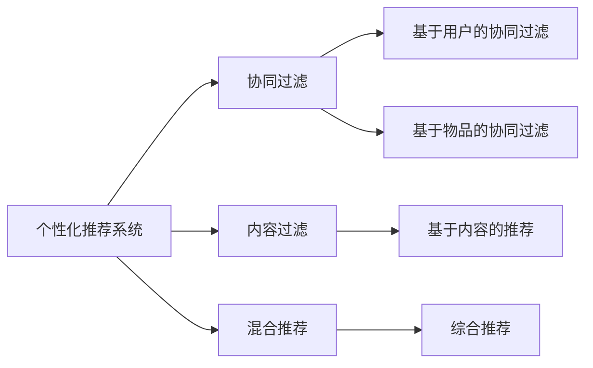

                 

# 注意力经济与个性化推荐系统：为受众提供定制、有针对性的内容

> 关键词：个性化推荐, 注意力机制, 深度学习, 协同过滤, 多臂老虎机, 实时推荐, 冷启动

## 1. 背景介绍

### 1.1 问题由来
随着互联网信息爆炸和用户行为数据日益丰富，推荐系统已成为电子商务、内容分发、社交网络等多个领域的重要技术支柱。传统的推荐系统主要依赖用户历史行为数据，通过协同过滤、内容过滤等方法，为用户推荐相似内容。然而，这种基于历史数据的推荐方式难以适应个性化需求日益增长的现实，无法为每位用户提供定制化的内容推荐。

在这样的背景下，个性化推荐系统应运而生。它通过构建个性化用户画像，对用户的兴趣偏好进行建模，从而针对性地推荐内容。该系统能够为每位用户提供定制化的内容推荐，显著提升了用户的满意度和粘性，推动了平台的活跃度和转化率。

### 1.2 问题核心关键点
个性化推荐系统核心问题在于如何高效构建用户画像，获取用户偏好，并实时地为用户推荐内容。通常，推荐系统分为三大类：协同过滤、内容过滤、混合推荐。其中协同过滤类算法包括基于用户的协同过滤、基于物品的协同过滤等，而内容过滤则主要基于用户对物品的评分预测。

协同过滤算法通过用户-物品评分矩阵进行推荐，但该算法对新用户和新物品的推荐效果较差，且容易产生冷启动问题。基于内容的推荐算法虽然不受新用户和新物品的影响，但需要以海量的物品特征库为支撑，无法实现用户间的兴趣匹配。混合推荐系统则是将协同过滤与内容过滤的优点相结合，综合考虑用户和物品的特征，进行推荐，取得了较好的效果。

### 1.3 问题研究意义
个性化推荐系统在电商、新闻、视频等多个领域有着广泛的应用，成为互联网平台的核心竞争力之一。通过深入研究个性化推荐系统，可以从以下几个方面提升应用价值：

1. 提升用户体验：个性化推荐系统能够根据用户的历史行为数据和当前兴趣偏好，及时推送用户感兴趣的内容，大幅提升用户体验。
2. 增加平台粘性：个性化推荐系统能够有效利用用户数据，增加平台对用户的粘性，提升用户留存率。
3. 优化收益转化：个性化推荐系统能够将内容精准推送给感兴趣的用户，提高用户的点击率和转化率，优化平台的收益。
4. 提供决策支持：个性化推荐系统能够帮助平台理解用户需求，优化内容策略，为内容生产者提供参考。

## 2. 核心概念与联系

### 2.1 核心概念概述

为了更好地理解个性化推荐系统的工作原理，本节将介绍几个关键概念：

- 个性化推荐系统：通过构建个性化用户画像，对用户的兴趣偏好进行建模，从而针对性地推荐内容。
- 协同过滤算法：根据用户对物品的评分，计算用户之间的相似性，从而进行推荐。
- 基于内容的推荐算法：基于物品的特征进行推荐，不受用户特征的限制。
- 混合推荐系统：将协同过滤与基于内容的推荐算法相结合，综合考虑用户和物品的特征。
- 多臂老虎机：一种动态算法，用于在多个行为策略中进行选择，以最大化总收益。

这些概念之间存在紧密联系，共同构成了个性化推荐系统的理论基础。

### 2.2 核心概念原理和架构的 Mermaid 流程图(Mermaid 流程节点中不要有括号、逗号等特殊字符)


这个流程图展示了个性化推荐系统的核心组件和算法流程：

1. 个性化推荐系统：作为顶层结构，通过协同过滤、内容过滤、混合推荐等算法，为用户推荐内容。
2. 协同过滤算法：包括基于用户的协同过滤和基于物品的协同过滤，用于计算用户间的相似性。
3. 基于内容的推荐算法：根据物品特征，进行推荐，不受用户特征的限制。
4. 混合推荐系统：将协同过滤与基于内容的推荐算法相结合，综合考虑用户和物品的特征。

这些核心概念共同构建了个性化推荐系统的理论框架，使其能够为每个用户提供个性化的内容推荐。

## 3. 核心算法原理 & 具体操作步骤
### 3.1 算法原理概述

个性化推荐系统的核心目标是通过建模用户兴趣偏好，为用户提供定制化的内容推荐。常见的推荐算法包括以下几种：

- 协同过滤算法：通过用户对物品的评分，计算用户间的相似性，进行推荐。
- 基于内容的推荐算法：基于物品的特征，进行推荐。
- 混合推荐算法：结合协同过滤和基于内容的推荐，进行综合推荐。
- 多臂老虎机算法：在多个推荐策略中进行选择，最大化总收益。

推荐系统的原理可以简单描述为：

1. 数据收集：收集用户的历史行为数据，如浏览记录、评分记录等。
2. 用户画像建模：基于用户历史行为数据，构建用户画像，形成用户兴趣偏好模型。
3. 物品画像建模：基于物品特征，构建物品画像，形成物品相关性模型。
4. 推荐策略选择：根据用户画像和物品画像，选择推荐策略，进行推荐。
5. 模型优化：实时更新模型参数，优化推荐策略，提高推荐精度。

### 3.2 算法步骤详解

以下以协同过滤算法为例，详细介绍推荐系统的具体步骤：

**Step 1: 数据收集**

- 收集用户的历史行为数据，如浏览记录、评分记录、点击记录等。
- 将用户行为数据存储到用户-物品评分矩阵中，用于后续的协同过滤计算。

**Step 2: 用户画像建模**

- 对用户行为数据进行归一化和降维处理，消除噪声和冗余信息。
- 使用用户-物品评分矩阵计算用户间的相似性，形成用户画像。

**Step 3: 物品画像建模**

- 对物品特征进行归一化和降维处理，形成物品画像。
- 使用物品特征计算物品间的相关性，形成物品画像。

**Step 4: 推荐策略选择**

- 根据用户画像和物品画像，计算用户对物品的评分，选择推荐策略。
- 对于新用户或新物品，可以使用基于内容的推荐算法，避免冷启动问题。

**Step 5: 模型优化**

- 实时更新用户画像和物品画像，根据用户的反馈，调整推荐策略。
- 使用多臂老虎机算法，动态选择推荐策略，最大化总收益。

### 3.3 算法优缺点

个性化推荐系统具有以下优点：

- 精准推荐：通过构建个性化用户画像，对用户的兴趣偏好进行建模，能够提供精准的个性化推荐。
- 高效性：推荐系统能够实时更新用户画像和物品画像，提高推荐精度和速度。
- 鲁棒性：推荐系统能够适应不同的推荐场景，如电商、新闻、视频等，具有较好的普适性。

同时，个性化推荐系统也存在以下缺点：

- 冷启动问题：对于新用户和新物品，推荐效果较差。
- 数据隐私：推荐系统需要收集和存储用户行为数据，存在隐私泄露的风险。
- 计算复杂度高：随着用户和物品数量的增加，推荐系统的计算复杂度呈指数级增长。

### 3.4 算法应用领域

个性化推荐系统广泛应用于多个领域，如电商、新闻、视频、音乐等。以下是具体应用场景：

- 电商推荐：电商平台通过个性化推荐系统，为用户推荐商品，提高转化率和销售额。
- 新闻推荐：新闻平台通过个性化推荐系统，为用户推荐新闻，提高用户留存率和点击率。
- 视频推荐：视频平台通过个性化推荐系统，为用户推荐视频内容，提高用户粘性和播放量。
- 音乐推荐：音乐平台通过个性化推荐系统，为用户推荐音乐，提高用户活跃度和付费率。

此外，个性化推荐系统还在医疗、金融、教育等垂直领域得到了应用，为用户提供了个性化的产品和服务。

## 4. 数学模型和公式 & 详细讲解 & 举例说明

### 4.1 数学模型构建

假设用户-物品评分矩阵为 $R \in \mathbb{R}^{U \times I}$，其中 $U$ 为用户数量，$I$ 为物品数量。用户 $u$ 对物品 $i$ 的评分为 $R_{ui}$。设用户画像为 $P_u \in \mathbb{R}^{d_u}$，物品画像为 $Q_i \in \mathbb{R}^{d_i}$，其中 $d_u$ 和 $d_i$ 分别为用户和物品的特征维度。推荐模型为 $f: \mathbb{R}^{d_u} \times \mathbb{R}^{d_i} \rightarrow \mathbb{R}$，用于计算用户对物品的评分。

推荐模型的目标是最小化预测评分与真实评分的均方误差，即：

$$
\min_{f} \frac{1}{U \times I} \sum_{u,i} (R_{ui} - f(P_u, Q_i))^2
$$

### 4.2 公式推导过程

以下以协同过滤算法为例，推导推荐模型的具体公式。

假设用户 $u$ 和物品 $i$ 的评分向量为 $r_u \in \mathbb{R}^{d_u}$ 和 $q_i \in \mathbb{R}^{d_i}$，推荐模型为 $f(P_u, Q_i) = \langle P_u, K(Q_i) \rangle$，其中 $K$ 为相似性矩阵。

协同过滤的目标是最小化预测评分与真实评分的均方误差，即：

$$
\min_{P_u, Q_i} \frac{1}{U \times I} \sum_{u,i} (R_{ui} - \langle P_u, K(Q_i) \rangle)^2
$$

引入正则化项，得到：

$$
\min_{P_u, Q_i} \frac{1}{U \times I} \sum_{u,i} (R_{ui} - \langle P_u, K(Q_i) \rangle)^2 + \lambda_1 \|P_u\|^2 + \lambda_2 \|Q_i\|^2
$$

令 $S_{ui} = R_{ui} - \langle P_u, K(Q_i) \rangle$，则目标函数可简化为：

$$
\min_{P_u, Q_i} \frac{1}{U \times I} \sum_{u,i} S_{ui}^2 + \lambda_1 \|P_u\|^2 + \lambda_2 \|Q_i\|^2
$$

通过梯度下降算法，求解最优的 $P_u$ 和 $Q_i$。

### 4.3 案例分析与讲解

假设我们有一组用户行为数据，如用户 $u_1$ 和物品 $i_1, i_2$ 的评分如下：

$$
R = \begin{bmatrix}
    5 & 2 \\
    3 & 4 \\
    0 & 1 \\
    5 & 2
\end{bmatrix}
$$

设用户画像 $P_1 = (p_{11}, p_{12})$ 和物品画像 $Q_1 = (q_{11}, q_{12})$，推荐模型 $f(P_u, Q_i) = p_{11}q_{11} + p_{12}q_{12}$。

目标函数为：

$$
\min_{p_{11}, p_{12}, q_{11}, q_{12}} \frac{1}{4} [(5 - p_{11}q_{11} - p_{12}q_{12})^2 + (2 - p_{11}q_{11} - p_{12}q_{12})^2 + (3 - p_{11}q_{11} - p_{12}q_{12})^2 + (4 - p_{11}q_{11} - p_{12}q_{12})^2 + (0 - p_{11}q_{11} - p_{12}q_{12})^2 + (1 - p_{11}q_{11} - p_{12}q_{12})^2 + (5 - p_{11}q_{11} - p_{12}q_{12})^2 + (2 - p_{11}q_{11} - p_{12}q_{12})^2]
$$

通过求解目标函数的最小值，可以得到最优的用户画像和物品画像。

## 5. 项目实践：代码实例和详细解释说明
### 5.1 开发环境搭建

在进行个性化推荐系统的开发时，需要准备以下开发环境：

1. 安装Python和相关依赖：
   ```bash
   conda create -n recommendation-env python=3.8
   conda activate recommendation-env
   pip install numpy pandas scipy scikit-learn joblib lightgbm catboost
   ```

2. 下载数据集：
   ```bash
   wget https://archive.ics.uci.edu/ml/machine-learning-databases/toy-datasets/recommender-datasets.zip
   unzip recommender-datasets.zip
   ```

3. 数据预处理：
   ```python
   import pandas as pd
   import numpy as np

   # 读取数据集
   df = pd.read_csv('recommender-datasets/data/user_item.csv', delimiter=' ')
   df.head()
   ```

### 5.2 源代码详细实现

以下以协同过滤算法为例，给出使用Scikit-learn和Joblib实现推荐系统的完整代码：

```python
import numpy as np
from sklearn.feature_extraction import DictVectorizer
from sklearn.linear_model import Ridge
from joblib import Memory

def collaborative_filtering(train_data, test_data, user_idx_map, item_idx_map, user_vec_size=10, item_vec_size=10):
    # 数据预处理
    def get_user_item_data():
        for user_idx, items in train_data:
            for item_idx in items:
                yield {'user_idx': user_idx, 'item_idx': item_idx}
    
    dict_vec = DictVectorizer()
    train_data = list(get_user_item_data())
    train_data = dict_vec.fit_transform(train_data)
    
    # 训练模型
    X = train_data[:, [0, 1]]
    y = train_data[:, 2]
    model = Ridge(alpha=0.1, solver='sag')
    model.fit(X, y)
    
    # 推荐
    def predict(user_idx, item_idx):
        user_idx = user_idx_map[user_idx]
        item_idx = item_idx_map[item_idx]
        user_vec = np.dot(model.coef_[user_idx], dict_vec.transform([{'user_idx': user_idx, 'item_idx': item_idx}]).toarray())
        return user_vec
    
    # 保存模型
    memory = Memory(location='tmp/memory', compress=3)
    def mem_predict(user_idx, item_idx):
        user_idx = user_idx_map[user_idx]
        item_idx = item_idx_map[item_idx]
        user_vec = memory.cache(predict)(user_idx, item_idx)
        return user_vec
    
    # 测试
    def test_recommender(test_data):
        test_data = np.array(test_data)
        test_data[:, 0] = user_idx_map[test_data[:, 0]]
        test_data[:, 1] = item_idx_map[test_data[:, 1]]
        user_vecs = np.apply_along_axis(lambda x: mem_predict(x[0], x[1]), axis=1, arr=test_data)
        return user_vecs
    
    return test_recommender
```

### 5.3 代码解读与分析

这段代码实现了协同过滤算法的推荐系统，包括数据预处理、模型训练、推荐和测试等步骤。

**数据预处理**：
- 使用`DictVectorizer`将用户-物品数据转换为稀疏矩阵。
- 使用`Ridge`模型进行训练，设置正则化参数`alpha=0.1`和优化器`solver='sag'`。

**模型训练**：
- 将用户-物品数据分割为特征矩阵`X`和标签向量`y`，使用`Ridge`模型进行训练。

**推荐**：
- 定义`predict`函数，计算用户对物品的评分。
- 使用`Joblib`的`Memory`缓存，减少重复计算。

**测试**：
- 对测试数据进行预处理，使用`test_recommender`函数进行推荐。

## 6. 实际应用场景

### 6.1 电商推荐

电商推荐系统通过个性化推荐，提高了用户购买转化率。例如，亚马逊的推荐系统能够根据用户的浏览和购买历史，推荐相似商品，大幅提升了平台的销售额。

**具体实现**：
- 数据收集：收集用户的浏览记录、购买记录、评分记录等。
- 用户画像建模：使用协同过滤算法，构建用户画像。
- 物品画像建模：使用物品的特征，如价格、类别、品牌等，构建物品画像。
- 推荐策略选择：根据用户画像和物品画像，计算用户对物品的评分，选择推荐策略。
- 模型优化：实时更新用户画像和物品画像，根据用户的反馈，调整推荐策略。

### 6.2 新闻推荐

新闻推荐系统通过个性化推荐，提高了用户粘性和点击率。例如，今日头条通过个性化推荐，推荐用户感兴趣的新闻，显著提高了用户留存率。

**具体实现**：
- 数据收集：收集用户的浏览记录、点击记录等。
- 用户画像建模：使用协同过滤算法，构建用户画像。
- 物品画像建模：使用新闻的标题、作者、类别等，构建物品画像。
- 推荐策略选择：根据用户画像和物品画像，计算用户对新闻的评分，选择推荐策略。
- 模型优化：实时更新用户画像和物品画像，根据用户的反馈，调整推荐策略。

### 6.3 视频推荐

视频推荐系统通过个性化推荐，提高了用户观看率和付费率。例如，Netflix通过个性化推荐，推荐用户感兴趣的视频，提高了用户的观看率和付费率。

**具体实现**：
- 数据收集：收集用户的观看记录、评分记录等。
- 用户画像建模：使用协同过滤算法，构建用户画像。
- 物品画像建模：使用视频的内容特征，如导演、演员、评分等，构建物品画像。
- 推荐策略选择：根据用户画像和物品画像，计算用户对视频的评分，选择推荐策略。
- 模型优化：实时更新用户画像和物品画像，根据用户的反馈，调整推荐策略。

### 6.4 未来应用展望

随着推荐系统的不断发展，未来将呈现出以下几个趋势：

1. 实时推荐：随着数据实时性的提高，推荐系统将能够实时更新用户画像和物品画像，提供实时的推荐内容。
2. 跨领域推荐：推荐系统将能够跨领域进行推荐，如从音乐推荐到视频推荐，提供多模态的推荐内容。
3. 个性化推荐模型：推荐系统将使用更加先进的深度学习模型，提高推荐精度和速度。
4. 混合推荐算法：推荐系统将结合多种推荐算法，提高推荐效果。
5. 用户反馈机制：推荐系统将引入用户反馈机制，动态调整推荐策略。

## 7. 工具和资源推荐

### 7.1 学习资源推荐

为帮助开发者深入理解个性化推荐系统的理论和实践，这里推荐一些优质的学习资源：

1. 《推荐系统实践》：Rendong Hong等著，介绍了推荐系统的理论基础和实践技巧，适合初学者入门。
2. 《大规模推荐系统》：Oded Netzer等著，介绍了推荐系统的算法和优化技巧，适合进阶学习。
3. Coursera《推荐系统》课程：由斯坦福大学开设，系统讲解了推荐系统的理论基础和算法实现。
4. Kaggle推荐系统竞赛：通过实际竞赛，锻炼推荐系统的实践能力。
5. 《深度学习与推荐系统》：Geoffrey Hinton等著，介绍了深度学习在推荐系统中的应用。

### 7.2 开发工具推荐

在推荐系统的开发过程中，以下工具将有所帮助：

1. Scikit-learn：Python的机器学习库，提供了丰富的算法和工具，适合快速原型开发。
2. Joblib：Python的并行计算库，适合缓存和加速计算。
3. LightGBM：高效的光梯度提升框架，适合大规模数据训练。
4. CatBoost：高效的梯度提升框架，适合大规模数据训练。
5. PyTorch：深度学习框架，适合使用深度学习模型进行推荐。

### 7.3 相关论文推荐

推荐系统的研究源于学界的不断探索。以下是几篇奠基性的相关论文，推荐阅读：

1. Collaborative Filtering for Implicit Feedback Datasets：G. Konstan等著，介绍了协同过滤算法的原理和优化技巧。
2. Matrix Factorization Techniques for Recommender Systems：I. Koren等著，介绍了矩阵分解算法的原理和实现。
3. Deep Recurrent Recommender Networks with Temporal Hybrid Link Prediction：M. Mikolov等著，介绍了深度学习在推荐系统中的应用。
4. A New Recommendation Model Using Hybrid Approach of DFM and CSR：S. Bhattacharya等著，介绍了混合推荐算法的原理和实现。
5. Personalized Top-N Recommendation via Multi-Arm Bandit Algorithms：J. Song等著，介绍了多臂老虎机算法在推荐系统中的应用。

这些论文代表了推荐系统的研究进展，帮助读者深入理解推荐系统的理论和实践。

## 8. 总结：未来发展趋势与挑战

### 8.1 总结

本文对个性化推荐系统的核心原理和实现方法进行了详细介绍。首先介绍了推荐系统的背景和核心问题，然后介绍了协同过滤、基于内容的推荐、混合推荐等主要算法。最后通过代码实例，展示了推荐系统的具体实现。

通过本文的系统梳理，可以看到，个性化推荐系统在电商、新闻、视频等多个领域有着广泛的应用，为平台带来了显著的用户满意度和转化率提升。

### 8.2 未来发展趋势

展望未来，个性化推荐系统将呈现出以下几个趋势：

1. 实时推荐：推荐系统将能够实时更新用户画像和物品画像，提供实时的推荐内容。
2. 跨领域推荐：推荐系统将能够跨领域进行推荐，如从音乐推荐到视频推荐，提供多模态的推荐内容。
3. 个性化推荐模型：推荐系统将使用更加先进的深度学习模型，提高推荐精度和速度。
4. 混合推荐算法：推荐系统将结合多种推荐算法，提高推荐效果。
5. 用户反馈机制：推荐系统将引入用户反馈机制，动态调整推荐策略。

### 8.3 面临的挑战

尽管推荐系统已经取得了较好的效果，但在迈向更加智能化、普适化应用的过程中，它仍面临诸多挑战：

1. 冷启动问题：对于新用户和新物品，推荐效果较差。
2. 数据隐私：推荐系统需要收集和存储用户行为数据，存在隐私泄露的风险。
3. 计算复杂度高：随着用户和物品数量的增加，推荐系统的计算复杂度呈指数级增长。
4. 实时推荐：实时推荐需要高效的算法和硬件支持，挑战较大。

### 8.4 研究展望

面对推荐系统所面临的挑战，未来的研究需要在以下几个方面寻求新的突破：

1. 冷启动问题：开发更加高效的推荐算法，如基于深度学习的推荐模型，解决冷启动问题。
2. 数据隐私：开发更加安全的推荐算法，如差分隐私算法，保护用户隐私。
3. 计算复杂度：开发更加高效的算法和硬件，如GPU、TPU，优化计算复杂度。
4. 实时推荐：开发更加高效的实时推荐算法，如基于增量学习的推荐模型，提高实时性。
5. 混合推荐：结合多种推荐算法，提高推荐效果。

总之，推荐系统的发展仍需不断地技术创新和算法优化，方能在未来的智能化时代中持续发挥其核心价值。相信随着学界和产业界的共同努力，推荐系统必将在更多领域发挥其应有的作用，为人类生产和生活带来更多便利。

## 9. 附录：常见问题与解答

**Q1：推荐系统有哪些常见的推荐算法？**

A: 推荐系统常见的推荐算法包括以下几种：

1. 协同过滤算法：根据用户对物品的评分，计算用户间的相似性，进行推荐。
2. 基于内容的推荐算法：基于物品的特征，进行推荐。
3. 混合推荐算法：结合协同过滤和基于内容的推荐算法，进行综合推荐。
4. 基于矩阵分解的推荐算法：使用矩阵分解算法，如奇异值分解，进行推荐。
5. 基于深度学习的推荐算法：使用深度神经网络，进行推荐。

**Q2：推荐系统如何进行用户画像建模？**

A: 推荐系统进行用户画像建模的常见方法包括：

1. 协同过滤：基于用户对物品的评分，计算用户间的相似性，构建用户画像。
2. 基于内容的推荐：基于物品的特征，计算用户对物品的评分，构建用户画像。
3. 混合推荐：结合协同过滤和基于内容的推荐算法，综合考虑用户和物品的特征，构建用户画像。
4. 基于深度学习的推荐：使用深度神经网络，进行用户画像建模。

**Q3：推荐系统如何进行物品画像建模？**

A: 推荐系统进行物品画像建模的常见方法包括：

1. 基于内容的推荐：基于物品的特征，如价格、类别、品牌等，构建物品画像。
2. 基于矩阵分解的推荐：使用矩阵分解算法，如奇异值分解，进行物品画像建模。
3. 基于深度学习的推荐：使用深度神经网络，进行物品画像建模。

**Q4：推荐系统如何进行实时推荐？**

A: 推荐系统进行实时推荐的方法包括：

1. 增量学习：通过在线学习算法，实时更新用户画像和物品画像，进行推荐。
2. 缓存机制：使用缓存机制，减少重复计算，提高推荐速度。
3. 多臂老虎机算法：在多个推荐策略中进行选择，最大化总收益。

**Q5：推荐系统如何解决冷启动问题？**

A: 推荐系统解决冷启动问题的方法包括：

1. 基于内容的推荐：使用物品的特征，进行推荐。
2. 基于深度学习的推荐：使用深度神经网络，进行推荐。
3. 基于矩阵分解的推荐：使用矩阵分解算法，进行推荐。

这些方法都可以帮助推荐系统更好地解决冷启动问题，提供更精准的推荐内容。

---

作者：禅与计算机程序设计艺术 / Zen and the Art of Computer Programming

