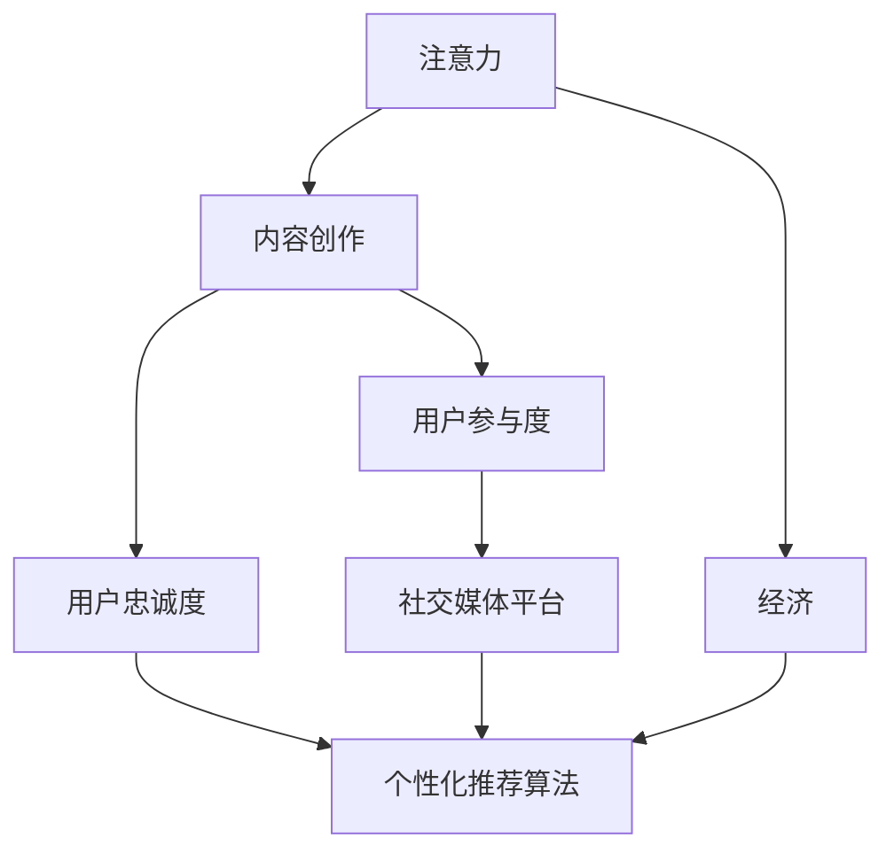

                 

# 注意力经济与内容创作策略：吸引并留住受众的参与和忠诚

> 关键词：注意力经济,内容创作,用户参与,用户忠诚度,社交媒体,个性化推荐,内容推荐算法,数据驱动决策

## 1. 背景介绍

### 1.1 问题由来
在数字化时代，信息过载成为一种常态。海量的内容来源和多样化的用户需求，使得注意力资源成为稀缺的战略资源。如何在浩如烟海的内容海洋中脱颖而出，吸引并留住受众的参与和忠诚，成为每一个内容创作者和平台运营者面临的核心问题。

### 1.2 问题核心关键点
本文将从注意力经济的角度出发，探讨如何利用数据驱动的内容创作策略，吸引和留住受众的关注和互动，提升内容创作和传播的效率与效果。

1. **注意力经济**：指在注意力成为稀缺资源的背景下，通过各种手段吸引和利用用户注意力，创造价值的过程。
2. **内容创作**：指从素材收集、创作、编辑到传播的全流程活动，是注意力经济的核心部分。
3. **用户参与**：指用户对内容进行评论、点赞、分享、订阅等行为，是衡量内容吸引力的重要指标。
4. **用户忠诚度**：指用户对内容创作者或平台的长期关注和持续互动，是判断内容持久价值的关键指标。
5. **社交媒体**：作为主要的注意力竞争场所，社交媒体平台在内容创作和传播中扮演着重要角色。
6. **个性化推荐算法**：利用用户行为数据进行推荐，提升用户对内容的发现和满意度，是提升用户参与度和忠诚度的重要工具。

## 2. 核心概念与联系

### 2.1 核心概念概述

为更好地理解注意力经济与内容创作的策略，本节将介绍几个密切相关的核心概念：

- **注意力**：用户对内容、广告、产品等信息的集中关注，是一种心理和行为状态。
- **经济**：通过稀缺资源的分配和利用，创造和分配价值的过程。
- **内容创作**：包括内容策划、素材采集、内容编辑、内容发布等环节，是注意力经济的基础。
- **用户参与度**：指用户对内容的互动程度，如评论、点赞、分享、订阅等。
- **用户忠诚度**：指用户对内容创作者或平台的长期关注和持续互动。
- **社交媒体平台**：作为主要的信息传播渠道，社交媒体在用户注意力的争夺中具有重要作用。
- **个性化推荐算法**：通过分析用户行为数据，精准推送个性化的内容，提升用户体验和满意度。
- **数据驱动决策**：基于数据分析和算法模型，做出科学有效的决策，优化内容创作和传播策略。

这些核心概念之间的逻辑关系可以通过以下Mermaid流程图来展示：



这个流程图展示了一系列核心概念之间的联系：

1. 注意力通过内容创作吸引，用户通过参与和忠诚度回馈，形成了完整的注意力经济循环。
2. 社交媒体平台和个性化推荐算法在其中起到了桥梁作用，通过精准推荐提升用户参与度。
3. 数据驱动决策贯穿整个流程，通过分析数据优化策略，提升整体效果。

## 3. 核心算法原理 & 具体操作步骤
### 3.1 算法原理概述

注意力经济与内容创作的核心算法，是利用数据和算法模型，优化内容创作和传播策略，吸引和留住用户关注和互动。其核心思想是通过对用户行为数据的分析，精准预测用户需求，制定个性化推荐策略，从而提升用户参与度和忠诚度。

具体来说，一个完整的内容创作与推荐流程通常包括以下几个关键步骤：

1. **内容收集与处理**：收集用户关注的内容特征、用户画像、历史行为数据等。
2. **内容特征提取**：使用自然语言处理、图像识别等技术，提取内容的关键词、主题、情感等特征。
3. **用户画像构建**：基于用户行为数据，构建用户的兴趣、偏好、互动模式等画像。
4. **推荐模型训练**：使用机器学习算法，如协同过滤、深度学习等，训练推荐模型。
5. **内容推荐**：根据用户画像和内容特征，预测用户可能感兴趣的内容，并进行推荐。
6. **效果评估与反馈**：通过用户反馈数据，评估推荐效果，不断优化推荐策略。

### 3.2 算法步骤详解

基于上述算法原理，接下来详细讲解具体的算法步骤：

**Step 1: 数据收集与预处理**
- 收集用户行为数据，包括访问、点击、停留时间、互动行为等。
- 收集内容特征，如关键词、主题、情感等。
- 使用自然语言处理工具，如BERT、GPT等，对内容进行文本处理和特征提取。
- 构建用户画像，包括兴趣、行为、社交关系等。

**Step 2: 推荐模型训练**
- 使用协同过滤算法，如基于用户的协同过滤、基于物品的协同过滤，训练推荐模型。
- 使用深度学习算法，如神经网络、深度学习模型等，训练推荐模型。
- 结合用户画像和内容特征，进行交叉验证和模型优化。

**Step 3: 内容推荐**
- 根据用户画像和内容特征，预测用户可能感兴趣的内容。
- 利用推荐算法，生成个性化推荐结果。
- 结合实时数据，动态调整推荐策略。

**Step 4: 效果评估与反馈**
- 收集用户反馈数据，评估推荐效果。
- 分析用户行为数据，识别推荐偏差和改进空间。
- 通过A/B测试等方法，不断优化推荐策略。

### 3.3 算法优缺点

基于数据驱动的内容创作与推荐算法，具有以下优点：
1. 精准预测：通过大数据分析，可以精准预测用户需求，提升推荐效果。
2. 个性化推荐：能够根据用户画像和历史行为，提供个性化推荐，提升用户体验。
3. 实时调整：能够根据实时数据动态调整推荐策略，保持推荐内容的动态更新。
4. 数据驱动：以数据为基础，科学决策，优化内容创作和传播策略。

同时，该算法也存在一定的局限性：
1. 数据依赖：对用户行为数据的依赖较大，数据质量对推荐效果有直接影响。
2. 用户隐私：在收集和分析用户数据时，需要考虑用户隐私保护。
3. 冷启动问题：新用户或新内容缺乏足够数据，难以进行精准推荐。
4. 多样性问题：算法可能过于依赖用户历史行为，导致推荐内容多样性不足。
5. 模型复杂性：深度学习等复杂算法需要较高的计算资源和模型训练时间。

尽管存在这些局限性，但就目前而言，基于数据驱动的推荐算法仍然是内容创作与传播中最主流、最有效的方法。未来相关研究的方向，是如何在确保推荐效果的同时，兼顾用户隐私保护、提升模型效率和处理冷启动等问题。

### 3.4 算法应用领域

基于数据驱动的推荐算法，在注意力经济与内容创作中得到了广泛的应用，覆盖了以下领域：

1. **社交媒体平台**：如Facebook、Instagram、Twitter等，通过个性化推荐算法，提升用户参与度和粘性。
2. **内容平台**：如Netflix、YouTube、Amazon等，通过内容推荐提升用户满意度和留存率。
3. **新闻和信息聚合平台**：如Google News、Flipboard等，通过推荐算法优化内容呈现方式。
4. **个性化广告**：如程序化广告平台，通过用户画像和兴趣标签进行精准投放。
5. **电子商务**：如淘宝、京东等电商平台，通过推荐算法提升用户购买率和转化率。

这些应用场景展示了推荐算法在内容创作与传播中的重要价值。通过精准的推荐，平台和创作者能够更好地吸引和留住用户，实现商业价值最大化。

## 4. 数学模型和公式 & 详细讲解  
### 4.1 数学模型构建

本节将使用数学语言对基于数据驱动的推荐算法进行更加严格的刻画。

设用户集合为 $U$，内容集合为 $V$，用户对内容的评分矩阵为 $R$，其中 $R_{ui}$ 表示用户 $u$ 对内容 $v$ 的评分。假设内容特征向量为 $\mathbf{f}_v \in \mathbb{R}^d$，用户画像向量为 $\mathbf{p}_u \in \mathbb{R}^d$。

定义推荐模型的目标函数为：

$$
\min_{\mathbf{f}_v, \mathbf{p}_u} \sum_{u \in U} \sum_{v \in V} (R_{uv} - \mathbf{p}_u^T \mathbf{f}_v)^2
$$

其中 $\mathbf{p}_u^T \mathbf{f}_v$ 表示用户 $u$ 对内容 $v$ 的预测评分。

通过求解上述优化问题，可以得到用户和内容之间的评分矩阵预测值，从而进行推荐。

### 4.2 公式推导过程

以下是上述优化问题的详细推导过程：

1. 定义损失函数：
$$
L(\mathbf{p}_u, \mathbf{f}_v) = \sum_{u \in U} \sum_{v \in V} (R_{uv} - \mathbf{p}_u^T \mathbf{f}_v)^2
$$

2. 对 $\mathbf{f}_v$ 和 $\mathbf{p}_u$ 分别求偏导数：
$$
\frac{\partial L}{\partial \mathbf{f}_v} = \sum_{u \in U} 2(\mathbf{p}_u^T \mathbf{f}_v - R_{uv}) \mathbf{p}_u
$$
$$
\frac{\partial L}{\partial \mathbf{p}_u} = \sum_{v \in V} 2(\mathbf{p}_u^T \mathbf{f}_v - R_{uv}) \mathbf{f}_v
$$

3. 根据梯度下降法更新 $\mathbf{f}_v$ 和 $\mathbf{p}_u$：
$$
\mathbf{f}_v \leftarrow \mathbf{f}_v - \eta \frac{\partial L}{\partial \mathbf{f}_v}
$$
$$
\mathbf{p}_u \leftarrow \mathbf{p}_u - \eta \frac{\partial L}{\partial \mathbf{p}_u}
$$

4. 通过迭代更新，直至损失函数收敛。

以上推导展示了基于评分矩阵的推荐算法的基本思路，通过最小化预测评分与实际评分之间的差距，优化用户画像和内容特征，提升推荐效果。

### 4.3 案例分析与讲解

以Amazon为例，分析其推荐系统如何通过数据驱动策略提升用户参与度。

Amazon使用协同过滤和深度学习等多种算法进行推荐。其中，协同过滤算法通过分析用户行为数据，发现相似用户和相似物品之间的关联，进行推荐。深度学习算法则通过构建用户画像和内容特征，利用神经网络模型进行预测，提升推荐精度。

在实际应用中，Amazon的推荐系统通过以下步骤实现：

1. 收集用户行为数据，包括浏览、点击、购买等行为。
2. 使用协同过滤算法，发现用户之间的相似度，构建用户画像。
3. 使用深度学习模型，如神经网络、卷积神经网络等，提取内容特征，构建内容画像。
4. 结合用户画像和内容特征，进行交叉验证和模型优化。
5. 动态调整推荐策略，实时推荐用户感兴趣的内容。

通过这些步骤，Amazon能够根据用户行为数据进行精准推荐，提升用户参与度和购买转化率，显著增加了用户粘性和平台留存率。

## 5. 项目实践：代码实例和详细解释说明
### 5.1 开发环境搭建

在进行推荐系统实践前，我们需要准备好开发环境。以下是使用Python进行PyTorch开发的环境配置流程：

1. 安装Anaconda：从官网下载并安装Anaconda，用于创建独立的Python环境。

2. 创建并激活虚拟环境：
```bash
conda create -n recommendation-env python=3.8 
conda activate recommendation-env
```

3. 安装PyTorch：根据CUDA版本，从官网获取对应的安装命令。例如：
```bash
conda install pytorch torchvision torchaudio cudatoolkit=11.1 -c pytorch -c conda-forge
```

4. 安装TensorFlow：
```bash
conda install tensorflow
```

5. 安装各类工具包：
```bash
pip install numpy pandas scikit-learn matplotlib tqdm jupyter notebook ipython
```

完成上述步骤后，即可在`recommendation-env`环境中开始推荐系统实践。

### 5.2 源代码详细实现

下面我们以协同过滤算法为例，给出使用TensorFlow进行推荐系统开发的PyTorch代码实现。

首先，定义协同过滤算法的基本结构：

```python
import tensorflow as tf

class CollaborativeFiltering(tf.keras.Model):
    def __init__(self, n_users, n_items, latent_dim):
        super(CollaborativeFiltering, self).__init__()
        selflatent_dim = latent_dim
        
        # 用户嵌入层
        self.user_embedding = tf.keras.layers.Embedding(n_users, latent_dim)
        
        # 物品嵌入层
        self.item_embedding = tf.keras.layers.Embedding(n_items, latent_dim)
        
        # 预测层
        self.prediction_layer = tf.keras.layers.Dense(1)
        
    def call(self, inputs):
        user_id, item_id = inputs
        user_embeddings = self.user_embedding(user_id)
        item_embeddings = self.item_embedding(item_id)
        predictions = self.prediction_layer(tf.math.multiply(user_embeddings, item_embeddings))
        return predictions
```

然后，定义训练和评估函数：

```python
def train_model(model, data, epochs, batch_size):
    model.compile(optimizer=tf.keras.optimizers.Adam(learning_rate=0.001),
                  loss=tf.keras.losses.MeanSquaredError())
    model.fit(data.train, epochs=epochs, batch_size=batch_size, validation_data=data.val)
    return model

def evaluate_model(model, data, batch_size):
    predictions = model.predict(data.test)
    mse = tf.keras.metrics.MeanSquaredError()
    mse(predictions, data.test_labels)
    return mse.result().numpy()
```

接着，定义数据集和训练流程：

```python
# 定义数据集
class RecommendationDataset(tf.data.Dataset):
    def __init__(self, data, batch_size):
        self.data = data
        self.batch_size = batch_size
        
    def __len__(self):
        return len(self.data)
        
    def __getitem__(self, item):
        user_id, item_id, rating = self.data[item]
        return (user_id, item_id), rating

# 加载数据
data = load_data()
train = RecommendationDataset(data['train'], batch_size)
val = RecommendationDataset(data['val'], batch_size)
test = RecommendationDataset(data['test'], batch_size)

# 训练模型
model = CollaborativeFiltering(n_users, n_items, latent_dim)
model = train_model(model, train, epochs, batch_size)
mse = evaluate_model(model, test, batch_size)

print(f'Mean Squared Error: {mse}')
```

最后，启动训练流程并在测试集上评估：

```python
epochs = 10
batch_size = 64

for epoch in range(epochs):
    model.fit(train, epochs=1, batch_size=batch_size, validation_data=val)
    print(f'Epoch {epoch+1}, MSE: {evaluate_model(model, test, batch_size)}')
```

以上就是使用TensorFlow进行协同过滤推荐系统的完整代码实现。可以看到，TensorFlow提供了强大的深度学习框架和丰富的模型库，使得推荐系统的开发变得相对简单和高效。

### 5.3 代码解读与分析

让我们再详细解读一下关键代码的实现细节：

**CollaborativeFiltering类**：
- 定义了协同过滤算法的结构，包括用户嵌入层、物品嵌入层和预测层。
- 用户嵌入层和物品嵌入层使用Embedding层，将用户和物品映射到低维空间。
- 预测层使用Dense层，将用户和物品的嵌入向量相乘，得到预测评分。

**train_model和evaluate_model函数**：
- 通过Model类的compile方法设置优化器和损失函数。
- 使用Model类的fit方法训练模型，设置训练轮数和批次大小。
- 使用Model类的evaluate方法评估模型，计算均方误差。

**RecommendationDataset类**：
- 用于加载和处理推荐数据集，定义了训练集、验证集和测试集的加载方式。
- 返回单个样本的user_id、item_id和标签rating，用于模型训练和评估。

**train_model和evaluate_model函数**：
- 使用TensorFlow的数据集API，将数据集封装为tf.data.Dataset对象，便于模型训练和评估。
- 使用tf.keras.layers.Embedding类加载用户和物品的嵌入向量，使用tf.keras.layers.Dense类进行预测。
- 使用tf.keras.metrics.MeanSquaredError类计算均方误差。

**训练流程**：
- 加载数据集，定义模型结构。
- 使用train_model函数进行模型训练，设置训练轮数和批次大小。
- 在每个epoch后，使用evaluate_model函数在测试集上评估模型，输出均方误差。
- 通过不断迭代，逐步优化模型，提升推荐效果。

可以看到，TensorFlow配合深度学习框架，使得协同过滤推荐系统的开发变得简洁高效。开发者可以将更多精力放在数据处理、模型改进等高层逻辑上，而不必过多关注底层的实现细节。

当然，工业级的系统实现还需考虑更多因素，如模型的保存和部署、超参数的自动搜索、更灵活的任务适配层等。但核心的推荐范式基本与此类似。

## 6. 实际应用场景
### 6.1 社交媒体平台

社交媒体平台如Facebook、Twitter等，通过推荐算法提升用户参与度和粘性。用户发布的内容和互动行为，经过数据分析后生成用户画像，并通过协同过滤和深度学习算法进行推荐。

以Facebook为例，其推荐算法通过以下步骤实现：

1. 收集用户的行为数据，包括点赞、评论、分享等。
2. 使用协同过滤算法，发现用户之间的相似度，构建用户画像。
3. 使用深度学习模型，提取内容特征，如文本情感、图片风格等。
4. 结合用户画像和内容特征，进行交叉验证和模型优化。
5. 动态调整推荐策略，实时推荐用户感兴趣的内容。

通过这些步骤，Facebook能够根据用户行为数据进行精准推荐，提升用户参与度和粘性，显著增加平台留存率和活跃度。

### 6.2 内容平台

内容平台如Netflix、YouTube等，通过推荐算法提升用户满意度和留存率。平台通过分析用户的历史观看数据和评分数据，生成用户画像和内容画像，进行精准推荐。

以Netflix为例，其推荐算法通过以下步骤实现：

1. 收集用户的行为数据，包括观看记录、评分等。
2. 使用协同过滤算法，发现用户之间的相似度，构建用户画像。
3. 使用深度学习模型，提取内容特征，如演员表、导演、评分等。
4. 结合用户画像和内容特征，进行交叉验证和模型优化。
5. 动态调整推荐策略，实时推荐用户感兴趣的内容。

通过这些步骤，Netflix能够根据用户行为数据进行精准推荐，提升用户满意度和留存率，显著增加了用户粘性和平台留存率。

### 6.3 个性化广告

个性化广告平台如Google Adwords，通过推荐算法进行精准投放。平台通过分析用户的行为数据和广告特征，生成用户画像，进行精准推荐。

以Google Adwords为例，其推荐算法通过以下步骤实现：

1. 收集用户的行为数据，包括搜索记录、点击等。
2. 使用协同过滤算法，发现用户之间的相似度，构建用户画像。
3. 使用深度学习模型，提取广告特征，如关键词、广告位、投放时间等。
4. 结合用户画像和广告特征，进行交叉验证和模型优化。
5. 动态调整推荐策略，实时推荐用户感兴趣的广告。

通过这些步骤，Google Adwords能够根据用户行为数据进行精准推荐，提升广告投放效果和转化率，显著增加了平台收入。

### 6.4 电子商务

电子商务平台如淘宝、京东等，通过推荐算法提升用户购买率和转化率。平台通过分析用户的历史购买数据和浏览数据，生成用户画像和商品画像，进行精准推荐。

以淘宝为例，其推荐算法通过以下步骤实现：

1. 收集用户的行为数据，包括浏览记录、购买记录等。
2. 使用协同过滤算法，发现用户之间的相似度，构建用户画像。
3. 使用深度学习模型，提取商品特征，如商品类别、价格、评价等。
4. 结合用户画像和商品特征，进行交叉验证和模型优化。
5. 动态调整推荐策略，实时推荐用户感兴趣的商品。

通过这些步骤，淘宝能够根据用户行为数据进行精准推荐，提升用户购买率和转化率，显著增加了平台收入和用户粘性。

## 7. 工具和资源推荐
### 7.1 学习资源推荐

为了帮助开发者系统掌握推荐算法的内容创作策略，这里推荐一些优质的学习资源：

1. 《推荐系统实战》书籍：全面介绍了推荐系统的基本原理、算法和实现方法，适合实战练习。
2. 《深度学习理论与实践》课程：斯坦福大学开设的深度学习课程，涵盖了从理论到实践的多个方面。
3. 《推荐系统导论》书籍：介绍了推荐系统的背景、原理和应用场景，适合理论学习。
4. Kaggle竞赛平台：提供丰富的推荐算法竞赛和实战案例，适合实践练习。
5. 《自然语言处理与深度学习》课程：Coursera平台上的自然语言处理课程，涵盖了从文本处理到推荐算法等多个方面。

通过对这些资源的学习实践，相信你一定能够快速掌握推荐算法的内容创作策略，并用于解决实际的NLP问题。
###  7.2 开发工具推荐

高效的开发离不开优秀的工具支持。以下是几款用于推荐系统开发的常用工具：

1. TensorFlow：Google开发的深度学习框架，支持高效的模型训练和推理。
2. PyTorch：Facebook开发的深度学习框架，灵活易用，适合快速原型开发。
3. Scikit-learn：Python的机器学习库，提供了丰富的模型和工具。
4. Apache Spark：分布式计算框架，适合处理大规模数据。
5. Jupyter Notebook：交互式开发环境，方便编写和运行代码。
6. Weights & Biases：实验跟踪工具，记录和可视化模型训练过程。

合理利用这些工具，可以显著提升推荐系统开发的效率和效果。

### 7.3 相关论文推荐

推荐系统的发展离不开学界的持续研究。以下是几篇奠基性的相关论文，推荐阅读：

1. A Factorization Method for Matrix Completion（马歇尔·里德·麦克里斯特尔等）：提出矩阵分解方法，解决协同过滤算法中的稀疏矩阵问题。
2. Matrix Factorization Techniques for Recommender Systems（Riccardo Sabatini等）：总结了矩阵分解算法在推荐系统中的应用。
3. Deep Collaborative Filtering Using Neural Networks（Omair Abdelaziz等）：提出深度神经网络算法，提升推荐系统的效果。
4. Online Learning of Factorization Machines for Recommender Systems（Jiali Xu等）：提出在线学习算法，提升推荐系统的实时性和泛化能力。
5. BERT: Pre-training of Deep Bidirectional Transformers for Language Understanding（雅克·叶芝斯等）：提出BERT模型，提升推荐系统中文本特征的表示能力。

这些论文代表了大语言模型微调技术的发展脉络。通过学习这些前沿成果，可以帮助研究者把握学科前进方向，激发更多的创新灵感。

## 8. 总结：未来发展趋势与挑战

### 8.1 总结

本文对基于数据驱动的内容创作与推荐算法进行了全面系统的介绍。首先阐述了注意力经济的背景和内容创作策略的核心概念，明确了推荐系统在用户参与度和忠诚度提升中的重要作用。其次，从算法原理和操作步骤的角度，详细讲解了推荐系统的数学模型和优化过程，给出了推荐系统开发的完整代码实现。同时，本文还探讨了推荐算法在社交媒体平台、内容平台、电子商务等多个实际应用场景中的应用，展示了其广泛的价值和潜力。

通过本文的系统梳理，可以看到，基于数据驱动的推荐算法已经成为内容创作与传播中的核心范式，极大地提升了用户参与度和平台留存率。未来，伴随深度学习、自然语言处理等技术的不断进步，推荐系统必将进一步拓展其应用范围和性能边界，成为信息时代不可或缺的创新引擎。

### 8.2 未来发展趋势

展望未来，推荐算法的发展将呈现以下几个趋势：

1. **深度学习和自然语言处理**：深度学习模型在推荐系统中的应用将越来越广泛，如BERT、GPT等大语言模型将提升推荐内容的丰富性和多样性。
2. **实时性和个性化**：推荐系统将更加注重实时性和个性化，通过动态调整推荐策略，提升用户满意度和粘性。
3. **跨平台整合**：推荐系统将与社交媒体、电子商务等多个平台进行整合，实现跨平台的用户画像和推荐。
4. **数据隐私保护**：在推荐过程中，用户隐私保护将越来越受到重视，推荐算法将更加注重隐私保护和数据安全。
5. **多样化推荐**：推荐系统将更加注重多样性，通过多种算法和模型组合，提升推荐内容的多样性和覆盖面。
6. **跨模态融合**：推荐系统将更多地融合多模态数据，如文本、图片、视频等，提升推荐内容的全面性和实用性。

以上趋势凸显了推荐算法的发展潜力，未来推荐系统将继续在内容创作与传播中发挥重要作用，推动信息时代的不断进步。

### 8.3 面临的挑战

尽管推荐算法在内容创作与传播中已经取得了显著成效，但在迈向更加智能化、普适化应用的过程中，仍面临诸多挑战：

1. **数据质量**：推荐系统依赖于高质量的用户行为数据，数据的准确性和完整性对推荐效果有直接影响。
2. **冷启动问题**：新用户或新内容缺乏足够数据，难以进行精准推荐，需要解决冷启动问题。
3. **隐私保护**：在收集和分析用户数据时，需要考虑用户隐私保护，防止数据泄露和滥用。
4. **多样性和公平性**：算法可能过于依赖用户历史行为，导致推荐内容多样性不足，且可能存在偏见和歧视。
5. **模型复杂性**：深度学习等复杂算法需要较高的计算资源和模型训练时间，需要优化模型结构和加速算法。
6. **算法透明度**：推荐算法的决策过程缺乏可解释性，难以对其推理逻辑进行分析和调试。

这些挑战亟需学界和工业界共同应对，通过技术创新和实践优化，提升推荐系统的可靠性和公平性，实现更好的用户体验和商业价值。

### 8.4 研究展望

面对推荐算法面临的种种挑战，未来的研究需要在以下几个方面寻求新的突破：

1. **冷启动方法**：研究如何利用用户社交网络、兴趣标签等辅助信息，解决新用户和内容的推荐问题。
2. **数据增强**：研究如何利用数据生成技术，如数据增强、对抗样本生成等，提升推荐模型的鲁棒性和泛化能力。
3. **隐私保护技术**：研究如何利用联邦学习、差分隐私等技术，保护用户隐私，同时提升推荐效果。
4. **多样性提升**：研究如何利用多种推荐算法和模型组合，提升推荐内容的多样性和覆盖面，避免单一算法导致的偏差和歧视。
5. **算法透明度**：研究如何利用可解释性算法和可视化工具，提升推荐算法的透明度，增强用户信任和满意度。
6. **跨模态推荐**：研究如何利用跨模态数据融合技术，提升推荐内容的全面性和实用性，实现跨模态的个性化推荐。

这些研究方向将引领推荐算法迈向更高的台阶，为信息时代的内容创作与传播提供更加智能、公平和可靠的技术支持。面向未来，推荐算法还需要与其他人工智能技术进行更深入的融合，如知识表示、因果推理、强化学习等，多路径协同发力，共同推动自然语言理解和智能交互系统的进步。只有勇于创新、敢于突破，才能不断拓展推荐算法的边界，实现更好的用户体验和商业价值。

## 9. 附录：常见问题与解答

**Q1：推荐算法如何处理冷启动问题？**

A: 冷启动问题是指新用户或新内容缺乏足够数据，难以进行精准推荐。处理冷启动问题的方法包括：

1. 用户推荐：利用用户已有的历史行为，进行协同过滤推荐，寻找相似用户或物品进行推荐。
2. 物品推荐：利用物品已有的用户评分，进行基于物品的协同过滤推荐。
3. 多模态推荐：利用用户画像和内容画像中的其他模态数据，如图片、音频等，进行推荐。
4. 社交网络推荐：利用用户社交网络关系，进行基于社交网络的推荐。

这些方法可以结合使用，以更好地解决冷启动问题，提升推荐效果。

**Q2：推荐算法如何处理多样性问题？**

A: 多样性问题是指推荐算法可能过于依赖用户历史行为，导致推荐内容多样性不足。处理多样性问题的方法包括：

1. 多算法组合：利用多种推荐算法和模型组合，提升推荐内容的多样性。
2. 反馈机制：通过用户反馈数据，动态调整推荐策略，提升推荐内容的多样性。
3. 多轮推荐：通过多轮推荐，不断优化推荐内容的多样性，避免单一算法导致的偏见和歧视。

这些方法可以结合使用，以更好地提升推荐内容的多样性，增强用户体验。

**Q3：推荐算法如何处理隐私保护问题？**

A: 在推荐过程中，用户隐私保护是一个重要的问题。处理隐私保护问题的方法包括：

1. 数据匿名化：通过数据匿名化技术，保护用户隐私。
2. 差分隐私：利用差分隐私技术，保护用户数据隐私。
3. 联邦学习：利用联邦学习技术，在本地设备上训练模型，保护用户数据隐私。

这些方法可以结合使用，以更好地保护用户隐私，提升推荐系统的可信度和用户满意度。

**Q4：推荐算法如何处理算法透明度问题？**

A: 推荐算法的决策过程缺乏可解释性，难以对其推理逻辑进行分析和调试。处理算法透明度问题的方法包括：

1. 可解释性算法：利用可解释性算法，提升推荐算法的透明度，增强用户信任和满意度。
2. 可视化工具：利用可视化工具，展示推荐算法的决策过程，帮助用户理解推荐逻辑。

这些方法可以结合使用，以更好地提升推荐算法的透明度，增强用户信任和满意度。

**Q5：推荐算法如何处理推荐内容的相关性和多样性问题？**

A: 推荐内容的相关性和多样性是推荐系统的核心目标。处理推荐内容的相关性和多样性问题的方法包括：

1. 协同过滤：利用协同过滤算法，发现用户之间的相似度，提升推荐内容的相关性。
2. 深度学习：利用深度学习算法，提取内容特征，提升推荐内容的多样性。
3. 混合推荐：通过混合推荐算法，平衡推荐内容的相关性和多样性。

这些方法可以结合使用，以更好地处理推荐内容的相关性和多样性问题，提升用户体验和满意度。

通过这些常见问题的解答，可以看到推荐算法在内容创作与传播中面临的多样化挑战，以及解决这些挑战的可行方法。相信随着技术的不断进步，推荐系统将在未来的信息时代中发挥更加重要的作用，为用户创造更好的体验和价值。

