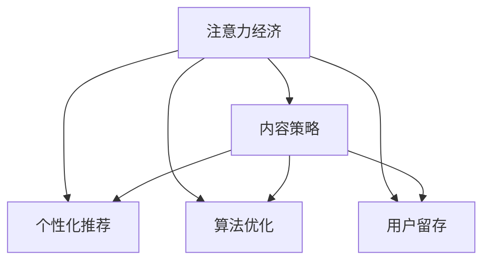

                 

# 注意力经济与内容策略规划与实施：吸引并留住受众

## 1. 背景介绍

### 1.1 问题由来
互联网时代的到来，使得信息传播的速度和范围达到了前所未有的高度。然而，海量信息的涌现也给用户带来了信息过载的问题。如何吸引并留住受众，成为互联网企业亟需解决的问题。注意力经济理论应运而生，将用户注意力视为一种稀缺资源，指导企业制定更精准的内容策略。

### 1.2 问题核心关键点
注意力经济的核心是关注用户如何分配其注意力资源，并指导企业制定吸引和留存用户的内容策略。具体来说，注意力经济的关注点包括：

- **用户注意力分配**：用户在线时间、使用时长、活跃度等。
- **内容类型偏好**：不同用户群体对视频、文章、图片、音频等内容的偏好差异。
- **内容质量评价**：用户对内容的满意度、分享度、互动性等。
- **内容推送机制**：个性化推荐、算法优化、用户体验等。
- **用户留存策略**：激励机制、奖励体系、互动平台等。

通过科学分析用户注意力分布和行为规律，企业可以制定出更具吸引力和影响力的内容策略，最大化用户黏性，提升商业价值。

### 1.3 问题研究意义
在数字化转型背景下，注意力经济理论与企业内容策略规划的结合，对于提升用户参与度和企业营收至关重要。具体意义体现在：

- **精准营销**：通过深度了解用户注意力分配和行为模式，制定更具针对性和个性化内容的策略。
- **内容优化**：利用注意力经济理论，指导内容团队不断优化内容质量和分发策略，提高用户满意度和品牌忠诚度。
- **收益增长**：企业通过提升用户留存率和互动频率，增加用户生命周期价值，实现商业收益的持续增长。

## 2. 核心概念与联系

### 2.1 核心概念概述

为了深入理解注意力经济和内容策略规划的联系，本节将介绍几个核心概念：

- **注意力经济**：基于用户注意力资源分配理论，指导企业制定内容策略。将用户注意力视为一种稀缺资源，吸引和留住用户是企业竞争的核心。
- **内容策略**：企业制定和实施的各类内容生产、发布和推广策略，旨在提升用户参与度和品牌影响力。
- **个性化推荐**：通过用户行为分析，推荐最符合用户兴趣和需求的内容，提升用户满意度和留存率。
- **算法优化**：利用数据科学和机器学习技术，优化内容推送算法，提高内容相关性和用户互动性。
- **用户留存**：通过激励机制、社区建设等方式，增加用户黏性，延长用户生命周期。

这些核心概念之间的逻辑关系可以通过以下Mermaid流程图来展示：



这个流程图展示了注意力经济与内容策略规划的关键联系：

1. 注意力经济理论指导企业制定内容策略。
2. 内容策略涵盖个性化推荐、算法优化、用户留存等多个方面。
3. 每个环节相互关联，共同作用于提升用户注意力和参与度。

## 3. 核心算法原理 & 具体操作步骤
### 3.1 算法原理概述

注意力经济与内容策略规划的本质，是利用用户注意力资源分配理论，通过数据驱动的方式，制定和优化内容策略。

在实际应用中，注意力经济的核心算法包括：

- **用户行为分析**：通过数据分析，理解用户在不同平台、不同时间段的注意力分布和行为模式。
- **内容推荐算法**：基于用户历史行为数据，利用协同过滤、深度学习等技术，推荐最符合用户兴趣的内容。
- **算法优化模型**：利用机器学习模型优化内容分发算法，提高相关性和用户满意度。
- **用户留存模型**：通过用户行为数据，预测用户流失风险，并制定针对性的留存策略。

这些算法的核心思想是利用数据科学和机器学习技术，深度分析用户行为和偏好，制定精准的内容策略，以吸引和留住受众。

### 3.2 算法步骤详解

以下是注意力经济与内容策略规划的具体操作步骤：

**Step 1: 数据收集与预处理**
- 收集用户行为数据，如点击次数、浏览时间、互动频率等。
- 清洗和整理数据，去除异常值和噪声，保证数据质量。

**Step 2: 用户行为分析**
- 分析用户在不同平台、不同时间段的活动分布，绘制用户注意力曲线。
- 识别高活跃用户群体，理解其兴趣偏好和行为特征。

**Step 3: 内容推荐算法**
- 利用协同过滤、深度学习等技术，构建推荐模型。
- 输入用户历史行为数据，输出推荐内容列表。

**Step 4: 算法优化模型**
- 构建机器学习模型，如线性回归、决策树、随机森林等。
- 输入用户行为数据和内容特征，预测用户满意度。
- 不断优化模型，提高预测准确度。

**Step 5: 用户留存模型**
- 收集用户流失数据，构建流失预测模型。
- 根据模型预测结果，制定针对性留存策略，如奖励体系、社区建设等。

**Step 6: 实施与评估**
- 将推荐算法应用于实际内容分发，监控用户行为和反馈。
- 定期评估内容策略效果，优化算法和策略。

### 3.3 算法优缺点

注意力经济与内容策略规划的算法具有以下优点：

- **精准推荐**：通过深度分析用户行为，提供精准内容推荐，提升用户满意度。
- **提高参与度**：优化内容分发算法，提高内容相关性和用户互动频率。
- **增加留存率**：通过用户留存模型，预测流失风险，制定针对性策略，延长用户生命周期。

同时，该算法也存在以下局限性：

- **数据依赖性强**：依赖于高质量的用户行为数据，数据获取和处理成本较高。
- **算法复杂度较高**：算法设计复杂，需要专业团队进行开发和维护。
- **模型风险**：模型预测准确度受限于数据质量和算法优化程度，存在误判风险。

尽管存在这些局限性，但就目前而言，注意力经济与内容策略规划的算法仍是提升用户参与度和企业营收的重要手段。未来相关研究的重点在于如何进一步降低算法对数据和算力的依赖，提高推荐精度和用户留存率。

### 3.4 算法应用领域

注意力经济与内容策略规划的算法在多个领域得到了广泛应用，例如：

- 社交媒体平台：如微信、微博、抖音等，通过个性化推荐和用户留存策略，提升用户活跃度和黏性。
- 新闻网站和媒体：如今日头条、腾讯新闻等，利用内容推荐算法，增加用户停留时间和点击率。
- 电子商务平台：如京东、阿里巴巴等，通过用户行为分析，优化推荐系统，提高用户购买转化率。
- 在线视频平台：如腾讯视频、优酷等，利用推荐算法和内容优化，提升用户观影体验和留存率。
- 在线教育平台：如Coursera、Udacity等，通过个性化推荐和互动机制，增加用户学习黏性和参与度。

此外，在广告投放、医疗健康、金融服务等多个领域，注意力经济与内容策略规划的应用也在不断拓展，为各行各业带来了新的机遇和挑战。

## 4. 数学模型和公式 & 详细讲解
### 4.1 数学模型构建

为了更好地理解注意力经济与内容策略规划的算法原理，本节将介绍几个常用的数学模型：

- **协同过滤算法**：利用用户-物品评分矩阵，推荐最相似用户喜欢的物品。
- **深度学习推荐模型**：如基于神经网络的序列模型（如RNN、LSTM）和协同注意力模型。
- **用户行为分析模型**：如线性回归、决策树、随机森林等。
- **用户流失预测模型**：如逻辑回归、支持向量机、梯度提升树等。

这些模型通过数学公式和算法框架，实现了对用户行为和兴趣的深度分析与预测。

### 4.2 公式推导过程

以下是几个常用模型的公式推导过程：

#### 协同过滤算法

协同过滤算法基于用户-物品评分矩阵 $R$，通过计算用户 $u$ 和物品 $i$ 的相似度，推荐物品列表。公式如下：

$$
\hat{y}_{ui} = \text{cosine}(R_u, R_i)
$$

其中 $R_u$ 和 $R_i$ 分别为用户 $u$ 和物品 $i$ 的评分向量，$\text{cosine}$ 为余弦相似度函数。

#### 深度学习推荐模型

以基于神经网络的序列推荐模型为例，其核心公式为：

$$
\hat{y}_{ui} = \sigma(W_i^T [h_1^T \odot h_{i-1}] + b_i)
$$

其中 $h_i$ 为模型在时间步 $i$ 的隐藏状态，$W_i$ 和 $b_i$ 为模型参数。$\odot$ 表示向量点乘。$\sigma$ 为激活函数，如Sigmoid、ReLU等。

#### 用户行为分析模型

以线性回归模型为例，其公式为：

$$
y = W^T x + b
$$

其中 $y$ 为目标变量，$x$ 为输入特征，$W$ 和 $b$ 为模型参数。

#### 用户流失预测模型

以逻辑回归模型为例，其公式为：

$$
P(y_i=1|x_i) = \frac{1}{1 + \exp(-W^T x_i - b)}
$$

其中 $y_i$ 为流失预测结果，$x_i$ 为输入特征，$W$ 和 $b$ 为模型参数。$\exp$ 为指数函数。

### 4.3 案例分析与讲解

#### 案例1：协同过滤算法

某电子商务平台希望通过协同过滤算法，为用户推荐个性化商品。数据集包含用户对商品的评分记录。通过余弦相似度计算，推荐用户可能喜欢的商品。

#### 案例2：深度学习推荐模型

某视频平台希望提高用户观看时长，利用深度学习模型推荐高质量视频。通过输入用户行为数据，模型学习用户兴趣，输出相关视频推荐列表。

#### 案例3：用户行为分析模型

某新闻网站希望提升用户点击率，利用线性回归模型预测用户点击概率。输入用户行为数据，输出预测点击率。

#### 案例4：用户流失预测模型

某在线教育平台希望减少用户流失，利用逻辑回归模型预测用户流失概率。输入用户行为数据，输出预测流失概率。

## 5. 项目实践：代码实例和详细解释说明
### 5.1 开发环境搭建

在进行注意力经济与内容策略规划的实践前，我们需要准备好开发环境。以下是使用Python进行机器学习开发的环境配置流程：

1. 安装Anaconda：从官网下载并安装Anaconda，用于创建独立的Python环境。

2. 创建并激活虚拟环境：
```bash
conda create -n ml-env python=3.8 
conda activate ml-env
```

3. 安装Python依赖包：
```bash
pip install numpy pandas scikit-learn transformers
```

4. 安装TensorFlow和Keras：
```bash
pip install tensorflow keras
```

5. 安装PyTorch：
```bash
pip install torch torchvision torchaudio
```

完成上述步骤后，即可在`ml-env`环境中开始注意力经济与内容策略规划的实践。

### 5.2 源代码详细实现

下面我们以一个推荐系统的案例，给出使用PyTorch和Keras进行协同过滤和深度学习模型开发的代码实现。

**协同过滤模型**

首先，定义协同过滤模型：

```python
import numpy as np
from sklearn.metrics import mean_squared_error

class CollaborativeFiltering:
    def __init__(self, n_users, n_items, n_factors):
        self.n_users = n_users
        self.n_items = n_items
        self.n_factors = n_factors
        self.U = np.random.randn(n_users, n_factors)
        self.V = np.random.randn(n_items, n_factors)
        self biases = np.zeros(n_items)
        
    def predict(self, user, item):
        user_vector = self.U[user,:]
        item_vector = self.V[item,:]
        biases_term = self.biases[item]
        prediction = np.dot(user_vector, item_vector) + biases_term
        return prediction
    
    def train(self, data, epochs=100, learning_rate=0.01):
        for epoch in range(epochs):
            for user, item, rating in data:
                prediction = self.predict(user, item)
                error = prediction - rating
                self.U[user,:] -= learning_rate * np.dot(self.V[item,:], error)
                self.V[item,:] -= learning_rate * np.dot(user_vector, error)
                self.biases[item] -= learning_rate * error
```

**深度学习推荐模型**

接下来，定义深度学习推荐模型：

```python
from tensorflow.keras.models import Sequential
from tensorflow.keras.layers import Embedding, LSTM, Dense

class DeepRecommender:
    def __init__(self, n_users, n_items, n_factors):
        self.model = Sequential()
        self.model.add(Embedding(n_users, n_factors))
        self.model.add(LSTM(n_factors))
        self.model.add(Dense(1, activation='sigmoid'))
        
    def compile(self):
        self.model.compile(loss='binary_crossentropy', optimizer='adam', metrics=['accuracy'])
        
    def fit(self, X_train, y_train, X_test, y_test, epochs=100, batch_size=64):
        self.model.fit(X_train, y_train, epochs=epochs, batch_size=batch_size, validation_data=(X_test, y_test))
        
    def predict(self, X):
        return self.model.predict(X)
```

**用户行为分析模型**

定义线性回归模型：

```python
from sklearn.linear_model import LinearRegression

class LinearRegressionModel:
    def __init__(self, n_features):
        self.model = LinearRegression()
        self.n_features = n_features
        
    def fit(self, X, y):
        self.model.fit(X, y)
        
    def predict(self, X):
        return self.model.predict(X)
```

**用户流失预测模型**

定义逻辑回归模型：

```python
from sklearn.linear_model import LogisticRegression

class LogisticRegressionModel:
    def __init__(self, n_features):
        self.model = LogisticRegression()
        self.n_features = n_features
        
    def fit(self, X, y):
        self.model.fit(X, y)
        
    def predict(self, X):
        return self.model.predict_proba(X)[:, 1]
```

### 5.3 代码解读与分析

让我们再详细解读一下关键代码的实现细节：

**协同过滤模型**

- `__init__`方法：初始化协同过滤模型的用户数、物品数、因子数，生成用户和物品的向量。
- `predict`方法：计算用户和物品的向量点乘，并加上物品偏置，得到预测评分。
- `train`方法：对每个样本进行训练，调整用户和物品的向量，更新物品偏置。

**深度学习推荐模型**

- `__init__`方法：初始化深度学习模型的嵌入层、LSTM层和输出层。
- `compile`方法：编译模型，设置损失函数、优化器和评价指标。
- `fit`方法：对模型进行训练，输入数据和标签，设定训练轮数和批大小。
- `predict`方法：对输入数据进行预测，返回预测结果。

**用户行为分析模型**

- `__init__`方法：初始化线性回归模型的特征数。
- `fit`方法：使用训练数据拟合模型。
- `predict`方法：对测试数据进行预测，返回预测结果。

**用户流失预测模型**

- `__init__`方法：初始化逻辑回归模型的特征数。
- `fit`方法：使用训练数据拟合模型。
- `predict`方法：对测试数据进行预测，返回预测概率。

## 6. 实际应用场景

### 6.1 社交媒体平台

社交媒体平台如微信、微博、抖音等，通过个性化推荐和用户留存策略，显著提升了用户活跃度和黏性。具体应用场景包括：

- **内容推荐**：根据用户兴趣和行为数据，推荐个性化内容，增加用户点击和互动。
- **用户留存**：通过社交功能、激励机制等，增加用户停留时间和使用频率。

### 6.2 新闻网站和媒体

新闻网站如今日头条、腾讯新闻等，利用推荐算法优化内容分发，提高了用户点击率和停留时间。具体应用场景包括：

- **标题优化**：通过分析用户点击行为，优化文章标题和摘要，吸引更多点击。
- **内容推荐**：根据用户兴趣，推荐相关新闻和文章，提高用户满意度。

### 6.3 电子商务平台

电子商务平台如京东、阿里巴巴等，通过用户行为分析，优化推荐系统，提升了用户购买转化率和复购率。具体应用场景包括：

- **商品推荐**：根据用户浏览和购买历史，推荐相关商品，增加购买转化率。
- **优惠券发放**：通过分析用户行为，精准发放优惠券，提升用户购买频率。

### 6.4 在线视频平台

在线视频平台如腾讯视频、优酷等，利用推荐算法和内容优化，提升了用户观影体验和留存率。具体应用场景包括：

- **视频推荐**：根据用户观看历史，推荐相关视频，提高用户观影时长。
- **个性化播放**：根据用户兴趣，调整视频播放列表，提升用户体验。

### 6.5 在线教育平台

在线教育平台如Coursera、Udacity等，通过个性化推荐和互动机制，增加了用户学习黏性和参与度。具体应用场景包括：

- **课程推荐**：根据用户学习历史，推荐相关课程，提高学习效率。
- **互动学习**：通过社区讨论、问答等机制，增加用户互动，提升学习效果。

## 7. 工具和资源推荐

### 7.1 学习资源推荐

为了帮助开发者系统掌握注意力经济与内容策略规划的理论基础和实践技巧，这里推荐一些优质的学习资源：

1. **《深度学习与推荐系统》**：讲解推荐系统原理和推荐算法，涵盖了协同过滤、深度学习等核心技术。
2. **《用户行为分析与预测》**：介绍用户行为分析理论和技术，如点击率预测、流失预测等。
3. **《内容推荐系统》**：详细介绍内容推荐系统的设计和优化方法，涵盖推荐算法、数据处理、评估指标等。
4. **《推荐系统实战》**：结合实际案例，讲解推荐系统的开发和优化，提供了丰富的代码实现和案例分析。
5. **《机器学习实战》**：介绍机器学习核心算法和技术，结合实际应用场景，讲解代码实现和案例分析。

通过学习这些资源，相信你一定能够快速掌握注意力经济与内容策略规划的精髓，并用于解决实际的推荐问题。

### 7.2 开发工具推荐

高效的开发离不开优秀的工具支持。以下是几款用于注意力经济与内容策略规划开发的常用工具：

1. **Anaconda**：Python环境管理工具，提供了虚拟环境、包管理、数据分析等功能。
2. **Jupyter Notebook**：Python开发和数据分析工具，支持交互式代码编写和数据可视化。
3. **TensorFlow**：深度学习框架，提供了强大的模型训练和优化能力。
4. **Keras**：深度学习库，提供了简单易用的API，适合快速原型开发。
5. **Scikit-learn**：机器学习库，提供了丰富的算法实现和数据处理工具。
6. **Pandas**：数据处理库，支持大规模数据集的处理和分析。

合理利用这些工具，可以显著提升注意力经济与内容策略规划的开发效率，加快创新迭代的步伐。

### 7.3 相关论文推荐

注意力经济与内容策略规划的研究源于学界的持续研究。以下是几篇奠基性的相关论文，推荐阅读：

1. **《协同过滤推荐算法》**：介绍了协同过滤算法的基本原理和实现方法。
2. **《深度学习推荐系统》**：讲解了深度学习在推荐系统中的应用，展示了深度模型在推荐系统中的优势。
3. **《用户行为分析与预测》**：研究了用户行为分析的理论和技术，如点击率预测、流失预测等。
4. **《内容推荐系统》**：介绍了内容推荐系统的设计和优化方法，涵盖了推荐算法、数据处理、评估指标等。
5. **《推荐系统实证分析》**：结合实际案例，分析了推荐系统的性能和优化方法。

这些论文代表了大语言模型微调技术的发展脉络。通过学习这些前沿成果，可以帮助研究者把握学科前进方向，激发更多的创新灵感。

## 8. 总结：未来发展趋势与挑战

### 8.1 总结

本文对注意力经济与内容策略规划进行了全面系统的介绍。首先阐述了注意力经济理论在NLP中的应用背景和意义，明确了内容策略规划在提升用户参与度和企业营收方面的独特价值。其次，从原理到实践，详细讲解了注意力经济与内容策略规划的数学模型和关键步骤，给出了推荐系统开发的完整代码实例。同时，本文还广泛探讨了注意力经济与内容策略规划在社交媒体、新闻媒体、电子商务、在线视频、在线教育等多个领域的应用前景，展示了其巨大的潜力和广泛的应用空间。

通过本文的系统梳理，可以看到，注意力经济与内容策略规划在提升用户参与度和企业营收方面具有重要意义。未来，伴随数据科学和机器学习技术的不断进步，这一技术必将在更多领域得到应用，为数字化转型和智能化发展注入新的动力。

### 8.2 未来发展趋势

展望未来，注意力经济与内容策略规划将呈现以下几个发展趋势：

1. **数据驱动智能化**：利用大数据和AI技术，实时分析用户行为和偏好，制定动态化的内容策略。
2. **多模态融合**：融合文本、图像、音频等多模态信息，构建更加全面、准确的用户画像。
3. **个性化推荐**：利用深度学习技术，提高个性化推荐的精准度和覆盖面。
4. **用户留存优化**：引入激励机制、互动平台等，增加用户黏性和生命周期价值。
5. **算法优化**：利用强化学习、因果推断等技术，优化推荐算法，提高推荐效果。

以上趋势凸显了注意力经济与内容策略规划的广阔前景。这些方向的探索发展，必将进一步提升内容策略的精准性和用户参与度，推动企业商业价值的最大化。

### 8.3 面临的挑战

尽管注意力经济与内容策略规划已经取得了显著成效，但在迈向更加智能化、普适化应用的过程中，它仍面临诸多挑战：

1. **数据获取成本高**：高质量用户行为数据的获取和处理成本较高，成为内容策略制定的瓶颈。
2. **算法复杂度大**：推荐算法设计复杂，需要专业团队进行开发和维护。
3. **推荐精度受限**：推荐精度受限于数据质量和算法优化程度，存在误判风险。
4. **用户隐私问题**：用户行为数据的收集和使用涉及隐私保护，需要严格遵守相关法律法规。

尽管存在这些挑战，但通过不断技术创新和优化，相信注意力经济与内容策略规划技术将逐渐克服这些难题，进一步提升企业的内容策略制定能力和用户参与度。

### 8.4 研究展望

面对注意力经济与内容策略规划所面临的种种挑战，未来的研究需要在以下几个方面寻求新的突破：

1. **无监督学习与少样本学习**：探索无监督和少样本学习技术，降低数据依赖，提高内容策略的普适性和鲁棒性。
2. **跨领域知识融合**：融合领域知识和规则，优化推荐算法，提升推荐效果和用户满意度。
3. **多模态数据处理**：利用深度学习技术，处理多模态数据，提升用户画像的全面性和准确性。
4. **强化学习与因果推断**：引入强化学习、因果推断等技术，优化推荐算法，提升推荐效果。
5. **隐私保护与伦理约束**：建立隐私保护机制，确保用户数据的安全和合法使用，遵守伦理约束。

这些研究方向将引领注意力经济与内容策略规划技术迈向更高的台阶，为构建更加智能化、普适化的内容策略提供新的思路和方法。

## 9. 附录：常见问题与解答

**Q1：如何设计有效的用户行为分析模型？**

A: 设计有效的用户行为分析模型需要综合考虑以下几个方面：

1. **特征选择**：选择与用户行为相关的关键特征，如点击次数、浏览时间、购买频率等。
2. **模型选择**：根据具体任务选择合适的模型，如线性回归、决策树、随机森林等。
3. **模型优化**：通过交叉验证等技术，优化模型参数，提高预测精度。
4. **模型评估**：使用各种评估指标，如均方误差、准确率、召回率等，评估模型效果。

通过合理的特征选择和模型设计，可以设计出效果显著的用户行为分析模型。

**Q2：如何进行个性化推荐？**

A: 个性化推荐的关键在于推荐模型的设计。以下步骤供参考：

1. **数据准备**：收集用户行为数据，如点击记录、购买记录等。
2. **特征工程**：对用户和物品特征进行工程处理，提取关键特征。
3. **模型选择**：选择合适的推荐模型，如协同过滤、深度学习等。
4. **模型训练**：利用用户行为数据，训练推荐模型。
5. **模型评估**：使用各种评估指标，如准确率、召回率、F1-score等，评估模型效果。
6. **模型优化**：通过超参数调优、模型集成等方法，优化推荐模型。

通过合理的模型设计和优化，可以设计出高效、精准的个性化推荐系统。

**Q3：如何确保推荐系统公平性？**

A: 推荐系统的公平性设计需要考虑以下几个方面：

1. **多样性**：确保推荐结果中包含多种类型和长尾内容，避免内容偏颇。
2. **用户隐私**：确保用户数据的使用符合隐私保护政策，不泄露用户敏感信息。
3. **算法透明**：保证推荐算法的透明度，让用户理解推荐逻辑和依据。
4. **反馈机制**：建立用户反馈机制，让用户参与推荐结果的优化。

通过综合考虑以上因素，可以设计出公平、透明、用户友好的推荐系统。

**Q4：如何衡量推荐系统的效果？**

A: 推荐系统效果的衡量主要依赖于各种评估指标：

1. **准确率**：推荐结果与真实结果的匹配程度，衡量推荐精度。
2. **召回率**：推荐结果中包含真实结果的比例，衡量推荐覆盖面。
3. **F1-score**：综合考虑准确率和召回率，衡量推荐效果。
4. **NDCG**：推荐结果与真实结果的顺序匹配程度，衡量推荐相关性。
5. **HDCG**：衡量推荐结果的覆盖面和相关性。

通过选择合适的评估指标，可以全面评估推荐系统的性能和效果。

**Q5：如何平衡推荐效果和计算成本？**

A: 平衡推荐效果和计算成本是推荐系统设计的重要考量：

1. **模型简化**：简化模型结构，减少计算复杂度，提高推理效率。
2. **分布式计算**：利用分布式计算框架，如Hadoop、Spark等，加速模型训练和推理。
3. **算法优化**：优化推荐算法，减少计算资源消耗，提高效率。
4. **数据预处理**：对数据进行预处理，减少数据量，提高计算速度。

通过合理的优化设计和资源配置，可以平衡推荐效果和计算成本，提高系统的实用性和可扩展性。

通过这些问题的详细解答，相信你能够更好地理解注意力经济与内容策略规划的核心思想和实践方法，为实际应用提供有力的技术支持。

---

作者：禅与计算机程序设计艺术 / Zen and the Art of Computer Programming

