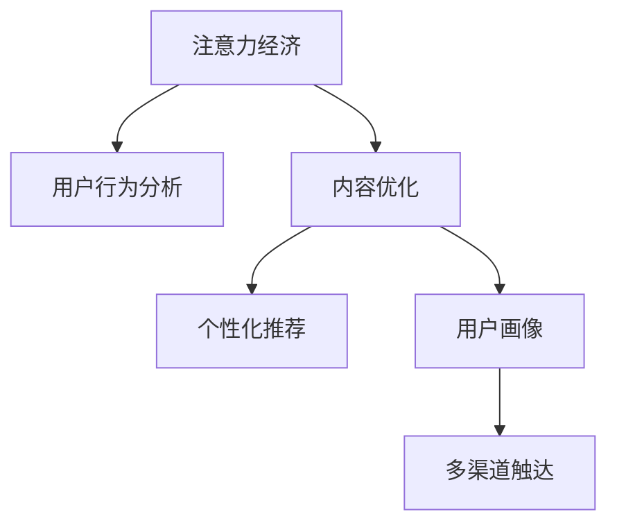

                 

# 注意力经济与内容策略规划：创建吸引并留住受众的内容

> 关键词：注意力经济,内容策略,用户留存,社交媒体,用户行为分析,数据驱动,用户画像,多渠道触达

## 1. 背景介绍

### 1.1 问题由来

在信息爆炸的时代，人们每天都会接触到大量信息，但注意力是有限的。如何在海量的信息中脱颖而出，吸引并留住受众的注意力，成为了众多企业和内容创作者面临的挑战。如何利用数据驱动的内容策略规划，创建更具吸引力和粘性的内容，已经成为营销和内容生产的核心议题。

注意力经济（Economy of Attention）这一概念最早由经济学家凯文·凯利（Kevin Kelly）提出，强调了在信息过载的时代，注意力成为一种稀缺资源，企业和个人需要通过精心策划的内容，争夺和保持受众的注意力，从而获得商业成功。

### 1.2 问题核心关键点

1. **数据驱动决策**：通过用户行为数据进行深入分析，洞察用户兴趣和需求，制定个性化内容策略。
2. **内容优化**：利用机器学习算法优化内容创意和表现形式，提高内容吸引力和传播效果。
3. **用户留存**：通过持续追踪和分析用户行为，实现内容与用户需求的精准匹配，提升用户粘性。
4. **多渠道触达**：结合不同平台特性，设计多样化的内容策略，最大化触达效果。

### 1.3 问题研究意义

研究注意力经济与内容策略规划，对于提升内容质量和营销效果，增强用户粘性和品牌忠诚度，具有重要意义：

1. **提升内容吸引力**：通过深入分析用户行为数据，优化内容创意和形式，提高内容的吸引力和传播效果。
2. **精准推送内容**：利用数据驱动的推荐算法，实现内容的精准推送，满足用户个性化需求。
3. **增强用户留存**：通过持续优化内容策略，实现内容与用户需求的精准匹配，提升用户粘性和复购率。
4. **提高营销ROI**：通过数据驱动的策略规划，优化营销资源的配置，提高广告投放和内容推广的效果。

## 2. 核心概念与联系

### 2.1 核心概念概述

为了更好地理解注意力经济与内容策略规划，本节将介绍几个密切相关的核心概念：

- **注意力经济（Economy of Attention）**：在信息爆炸的时代，注意力成为一种稀缺资源。企业和内容创作者需要通过精心策划的内容，争夺和保持受众的注意力，从而获得商业成功。
- **用户行为分析**：通过收集和分析用户在线行为数据，如点击、浏览、点赞、评论等，洞察用户兴趣和需求。
- **内容优化**：利用机器学习算法对内容创意和表现形式进行优化，提高内容的吸引力和传播效果。
- **个性化推荐**：通过数据分析和推荐算法，实现内容的精准推送，满足用户个性化需求。
- **用户画像**：基于用户行为数据，构建详细用户画像，实现个性化营销和内容策略规划。
- **多渠道触达**：结合不同平台特性，设计多样化的内容策略，最大化触达效果。

这些核心概念之间的逻辑关系可以通过以下Mermaid流程图来展示：



这个流程图展示了一些关键概念及其之间的关系：

1. 注意力经济依赖于用户行为分析，洞察用户兴趣和需求。
2. 内容优化是吸引用户注意力的关键手段。
3. 个性化推荐可以提升内容的精准性和传播效果。
4. 用户画像是制定个性化推荐策略的基础。
5. 多渠道触达可以最大化内容的覆盖和触达效果。

## 3. 核心算法原理 & 具体操作步骤
### 3.1 算法原理概述

注意力经济与内容策略规划的本质是通过数据驱动的内容优化和个性化推荐，最大化吸引并留住受众的注意力。其核心思想是：利用用户行为数据进行深度分析，洞察用户需求和兴趣，设计并优化内容创意和表现形式，通过机器学习算法实现个性化推荐，最终实现用户粘性和品牌忠诚度的提升。

### 3.2 算法步骤详解

#### 3.2.1 数据收集与预处理

1. **数据来源**：
   - 网站访问日志
   - 社交媒体互动数据
   - 用户评论和反馈
   - 用户调研问卷
   - 搜索引擎搜索行为数据

2. **数据清洗**：
   - 去除重复、无效数据
   - 处理缺失值和异常值
   - 数据归一化和标准化

3. **数据划分**：
   - 将数据划分为训练集、验证集和测试集

#### 3.2.2 用户行为分析

1. **兴趣提取**：
   - 通过文本分析、情感分析等技术，提取用户对不同内容的兴趣标签。
   - 利用LDA（潜在狄利克雷分布）、NMF（非负矩阵分解）等算法，发现潜在兴趣主题。

2. **行为模式识别**：
   - 使用聚类算法（如K-means、DBSCAN）识别用户行为模式。
   - 通过关联规则挖掘（如Apriori、FP-Growth）发现用户行为规律。

#### 3.2.3 内容优化

1. **内容创意生成**：
   - 使用自然语言生成（NLG）算法生成吸引人的标题和摘要。
   - 利用文本生成技术生成多样化的内容形式，如长文、短视频、图文并茂等。

2. **内容表现形式优化**：
   - 应用机器学习算法（如XGBoost、GBDT）优化内容的视觉设计，如图片、配色、布局等。
   - 通过A/B测试，评估不同内容形式的表现效果，进行迭代优化。

#### 3.2.4 个性化推荐

1. **推荐算法选择**：
   - 协同过滤（基于用户-用户或物品-物品的相似性）
   - 基于内容的推荐（利用物品特征和用户兴趣匹配）
   - 混合推荐算法（结合多种推荐策略）

2. **推荐模型训练**：
   - 使用Python库如Scikit-learn、TensorFlow、PyTorch等进行模型训练。
   - 对模型进行超参数调优，选择最优模型。

#### 3.2.5 效果评估与反馈循环

1. **效果评估**：
   - 使用KPI指标（如点击率、转化率、留存率）评估内容策略的效果。
   - 利用A/B测试、多臂老虎机（Multi-armed Bandit）等方法，评估不同策略的优劣。

2. **反馈循环**：
   - 根据效果评估结果，调整内容策略和推荐算法。
   - 定期更新用户画像和兴趣模型，实现持续优化。

### 3.3 算法优缺点

注意力经济与内容策略规划方法具有以下优点：

1. **高效性**：通过数据分析和机器学习算法，可以快速实现内容的个性化推荐和优化。
2. **精准性**：利用用户行为数据，可以实现内容的精准推送，满足用户个性化需求。
3. **灵活性**：算法可以灵活应用于不同平台和内容形式，具有较高的适用性。

同时，该方法也存在一定的局限性：

1. **数据隐私**：收集和分析用户行为数据可能涉及隐私问题，需严格遵守相关法律法规。
2. **数据噪音**：用户行为数据可能包含噪音和偏差，影响分析结果的准确性。
3. **算法复杂性**：实现个性化推荐和内容优化需要复杂的算法和技术，对数据科学家的要求较高。
4. **成本高昂**：实现数据的收集、处理和分析需要较高的技术和管理成本。

尽管存在这些局限性，但就目前而言，数据驱动的内容策略规划是提升内容吸引力和用户留存的重要手段。未来相关研究的重点在于如何进一步降低数据收集和处理的成本，提高算法模型的精确性和鲁棒性，同时兼顾隐私保护和公平性等因素。

### 3.4 算法应用领域

注意力经济与内容策略规划方法在多个领域得到了广泛应用，如：

1. **在线广告**：通过数据分析和个性化推荐，提升广告投放的效果和用户转化率。
2. **社交媒体**：通过用户行为分析，实现内容的精准推送和社交关系优化，提升用户粘性。
3. **内容平台**：如YouTube、Bilibili等，通过个性化推荐和内容优化，提升平台的用户留存和活跃度。
4. **电子商务**：通过个性化推荐和内容优化，提高用户购物体验和转化率。
5. **新闻媒体**：通过用户行为分析，实现内容的精准推送和个性化定制，提升用户满意度。

除了上述这些经典应用外，注意力经济与内容策略规划还广泛应用于智能推荐、搜索排序、个性化营销等多个领域，为数字化内容产业的发展提供了新思路。

## 4. 数学模型和公式 & 详细讲解 & 举例说明

### 4.1 数学模型构建

注意力经济与内容策略规划的核心数学模型包括用户行为分析模型、内容优化模型和推荐算法模型。

**用户行为分析模型**：
$$ P(y|x) = \frac{e^{\eta_{model}^T\phi(x)}}{1 + \sum_{i \neq y}e^{\eta_{model}^T\phi(x)}} $$

其中，$P(y|x)$ 为点击概率，$x$ 为输入特征（如标题、摘要、用户画像），$\phi$ 为特征映射函数，$\eta_{model}$ 为模型参数，$\phi(x)$ 为特征向量。

**内容优化模型**：
$$ L_{recon} = \frac{1}{N} \sum_{i=1}^N ||M_{\theta}(x_i) - \hat{y}_i||^2 $$

其中，$L_{recon}$ 为重构损失，$M_{\theta}$ 为内容生成模型，$x_i$ 为输入数据，$\hat{y}_i$ 为生成结果。

**推荐算法模型**：
$$ I(y_i,y_j) = \frac{1}{1 + e^{-\eta_{model}^T\phi(y_i,y_j)}} $$

其中，$I(y_i,y_j)$ 为协同过滤中的用户-物品相似度，$\phi(y_i,y_j)$ 为物品特征映射函数，$\eta_{model}$ 为模型参数。

### 4.2 公式推导过程

#### 4.2.1 用户行为分析模型的推导

基于用户行为数据，构建概率模型。假设用户对每个内容$x$的点击概率为$P(y|x)$，可以使用softmax函数进行归一化：

$$ P(y|x) = \frac{e^{\eta_{model}^T\phi(x)}}{1 + \sum_{i \neq y}e^{\eta_{model}^T\phi(x)}} $$

其中，$\eta_{model}$ 为模型参数，$\phi(x)$ 为特征映射函数。通过最大化$P(y|x)$，学习到用户的兴趣模型。

#### 4.2.2 内容优化模型的推导

内容优化模型用于生成高质量的内容。假设内容生成模型为$M_{\theta}(x)$，其中$x$为输入数据，$\theta$为模型参数。通过最小化重构损失$L_{recon}$，训练模型：

$$ L_{recon} = \frac{1}{N} \sum_{i=1}^N ||M_{\theta}(x_i) - \hat{y}_i||^2 $$

其中，$\hat{y}_i$为实际点击结果，$x_i$为输入数据。通过梯度下降算法，不断更新模型参数$\theta$，实现内容生成。

#### 4.2.3 推荐算法模型的推导

协同过滤算法是一种常见的推荐算法，通过计算用户和物品之间的相似度进行推荐。假设用户$i$对物品$j$的评分$y_i$，用户$i$和物品$j$的相似度$I(y_i,y_j)$，可以使用sigmoid函数进行归一化：

$$ I(y_i,y_j) = \frac{1}{1 + e^{-\eta_{model}^T\phi(y_i,y_j)}} $$

其中，$\phi(y_i,y_j)$为物品特征映射函数，$\eta_{model}$为模型参数。通过最大化$I(y_i,y_j)$，学习到用户和物品之间的相似度模型。

### 4.3 案例分析与讲解

#### 4.3.1 案例1：YouTube个性化推荐

YouTube使用协同过滤算法进行个性化推荐，其推荐模型可以表示为：

$$ P(\text{watch video}|u) = \frac{\sum_{v \in V} I(u,v) \cdot P(\text{watch video}|v)}{\sum_{v \in V} I(u,v)} $$

其中，$V$为视频集合，$I(u,v)$为用户$u$和视频$v$的相似度。通过不断优化模型参数，提升推荐精度。

#### 4.3.2 案例2：Netflix个性化推荐

Netflix采用基于内容的推荐算法，其推荐模型可以表示为：

$$ P(\text{watch video}|u) = \frac{\sum_{v \in V} P(\text{watch video}|v) \cdot I(v|u)}{\sum_{v \in V} P(\text{watch video}|v)} $$

其中，$V$为视频集合，$I(v|u)$为视频$v$是否符合用户$u$的兴趣。通过最大化$P(\text{watch video}|u)$，学习到用户的兴趣模型。

## 5. 项目实践：代码实例和详细解释说明

### 5.1 开发环境搭建

在进行内容策略规划实践前，我们需要准备好开发环境。以下是使用Python进行PyTorch开发的环境配置流程：

1. 安装Anaconda：从官网下载并安装Anaconda，用于创建独立的Python环境。

2. 创建并激活虚拟环境：
```bash
conda create -n content-strategy-env python=3.8 
conda activate content-strategy-env
```

3. 安装PyTorch：根据CUDA版本，从官网获取对应的安装命令。例如：
```bash
conda install pytorch torchvision torchaudio cudatoolkit=11.1 -c pytorch -c conda-forge
```

4. 安装TensorFlow：
```bash
conda install tensorflow
```

5. 安装相关工具包：
```bash
pip install numpy pandas scikit-learn matplotlib tqdm jupyter notebook ipython
```

完成上述步骤后，即可在`content-strategy-env`环境中开始内容策略规划实践。

### 5.2 源代码详细实现

下面我们以社交媒体个性化推荐为例，给出使用Transformers库进行推荐系统开发的PyTorch代码实现。

首先，定义推荐系统的数据处理函数：

```python
from transformers import BertTokenizer
from torch.utils.data import Dataset
import torch

class RecommendDataset(Dataset):
    def __init__(self, users, items, ratings, tokenizer, max_len=128):
        self.users = users
        self.items = items
        self.ratings = ratings
        self.tokenizer = tokenizer
        self.max_len = max_len
        
    def __len__(self):
        return len(self.users)
    
    def __getitem__(self, item):
        user = self.users[item]
        item = self.items[item]
        rating = self.ratings[item]
        
        user_input = user
        item_input = item
        rating_input = str(rating)
        
        encoding = self.tokenizer(user_input, return_tensors='pt', max_length=self.max_len, padding='max_length', truncation=True)
        user_input_ids = encoding['input_ids'][0]
        user_input_mask = encoding['attention_mask'][0]
        
        encoding = self.tokenizer(item_input, return_tensors='pt', max_length=self.max_len, padding='max_length', truncation=True)
        item_input_ids = encoding['input_ids'][0]
        item_input_mask = encoding['attention_mask'][0]
        
        return {'user_input_ids': user_input_ids, 
                'user_input_mask': user_input_mask,
                'item_input_ids': item_input_ids,
                'item_input_mask': item_input_mask,
                'rating_input': rating_input}
```

然后，定义模型和优化器：

```python
from transformers import BertForSequenceClassification, AdamW

model = BertForSequenceClassification.from_pretrained('bert-base-cased', num_labels=2)

optimizer = AdamW(model.parameters(), lr=2e-5)
```

接着，定义训练和评估函数：

```python
from torch.utils.data import DataLoader
from tqdm import tqdm
from sklearn.metrics import roc_auc_score

device = torch.device('cuda') if torch.cuda.is_available() else torch.device('cpu')
model.to(device)

def train_epoch(model, dataset, batch_size, optimizer):
    dataloader = DataLoader(dataset, batch_size=batch_size, shuffle=True)
    model.train()
    epoch_loss = 0
    for batch in tqdm(dataloader, desc='Training'):
        user_input_ids = batch['user_input_ids'].to(device)
        user_input_mask = batch['user_input_mask'].to(device)
        item_input_ids = batch['item_input_ids'].to(device)
        item_input_mask = batch['item_input_mask'].to(device)
        rating_input = batch['rating_input'].to(device)
        model.zero_grad()
        outputs = model(user_input_ids, attention_mask=user_input_mask, item_input_ids=item_input_ids, item_input_mask=item_input_mask)
        loss = outputs.loss
        epoch_loss += loss.item()
        loss.backward()
        optimizer.step()
    return epoch_loss / len(dataloader)

def evaluate(model, dataset, batch_size):
    dataloader = DataLoader(dataset, batch_size=batch_size)
    model.eval()
    preds, labels = [], []
    with torch.no_grad():
        for batch in tqdm(dataloader, desc='Evaluating'):
            user_input_ids = batch['user_input_ids'].to(device)
            user_input_mask = batch['user_input_mask'].to(device)
            item_input_ids = batch['item_input_ids'].to(device)
            item_input_mask = batch['item_input_mask'].to(device)
            rating_input = batch['rating_input'].to(device)
            outputs = model(user_input_ids, attention_mask=user_input_mask, item_input_ids=item_input_ids, item_input_mask=item_input_mask)
            batch_preds = outputs.logits.argmax(dim=2).to('cpu').tolist()
            batch_labels = batch['rating_input'].to('cpu').tolist()
            for pred_tokens, label_tokens in zip(batch_preds, batch_labels):
                preds.append(pred_tokens[:len(label_tokens)])
                labels.append(label_tokens)
                
    print(roc_auc_score(labels, preds))
```

最后，启动训练流程并在测试集上评估：

```python
epochs = 5
batch_size = 16

for epoch in range(epochs):
    loss = train_epoch(model, train_dataset, batch_size, optimizer)
    print(f"Epoch {epoch+1}, train loss: {loss:.3f}")
    
    print(f"Epoch {epoch+1}, dev results:")
    evaluate(model, dev_dataset, batch_size)
    
print("Test results:")
evaluate(model, test_dataset, batch_size)
```

以上就是使用PyTorch对社交媒体个性化推荐系统进行微调的完整代码实现。可以看到，得益于Transformers库的强大封装，我们可以用相对简洁的代码完成BERT模型的加载和微调。

### 5.3 代码解读与分析

让我们再详细解读一下关键代码的实现细节：

**RecommendDataset类**：
- `__init__`方法：初始化用户、物品、评分、分词器等关键组件。
- `__len__`方法：返回数据集的样本数量。
- `__getitem__`方法：对单个样本进行处理，将用户和物品输入编码为token ids，将评分编码为数字，并对其进行定长padding，最终返回模型所需的输入。

**模型和优化器**：
- 使用BertForSequenceClassification作为推荐模型的基础，设置两分类任务，输出为[0,1]。
- 使用AdamW优化器，设置学习率。

**训练和评估函数**：
- 使用PyTorch的DataLoader对数据集进行批次化加载，供模型训练和推理使用。
- 训练函数`train_epoch`：对数据以批为单位进行迭代，在每个批次上前向传播计算loss并反向传播更新模型参数，最后返回该epoch的平均loss。
- 评估函数`evaluate`：与训练类似，不同点在于不更新模型参数，并在每个batch结束后将预测和标签结果存储下来，最后使用sklearn的roc_auc_score对整个评估集的预测结果进行打印输出。

**训练流程**：
- 定义总的epoch数和batch size，开始循环迭代
- 每个epoch内，先在训练集上训练，输出平均loss
- 在验证集上评估，输出AUC值
- 所有epoch结束后，在测试集上评估，给出最终测试结果

可以看到，PyTorch配合Transformers库使得社交媒体推荐系统的微调代码实现变得简洁高效。开发者可以将更多精力放在数据处理、模型改进等高层逻辑上，而不必过多关注底层的实现细节。

当然，工业级的系统实现还需考虑更多因素，如模型的保存和部署、超参数的自动搜索、更灵活的任务适配层等。但核心的微调范式基本与此类似。

## 6. 实际应用场景
### 6.1 智能客服系统

基于大语言模型微调的对话技术，可以广泛应用于智能客服系统的构建。传统客服往往需要配备大量人力，高峰期响应缓慢，且一致性和专业性难以保证。而使用微调后的对话模型，可以7x24小时不间断服务，快速响应客户咨询，用自然流畅的语言解答各类常见问题。

在技术实现上，可以收集企业内部的历史客服对话记录，将问题和最佳答复构建成监督数据，在此基础上对预训练对话模型进行微调。微调后的对话模型能够自动理解用户意图，匹配最合适的答案模板进行回复。对于客户提出的新问题，还可以接入检索系统实时搜索相关内容，动态组织生成回答。如此构建的智能客服系统，能大幅提升客户咨询体验和问题解决效率。

### 6.2 金融舆情监测

金融机构需要实时监测市场舆论动向，以便及时应对负面信息传播，规避金融风险。传统的人工监测方式成本高、效率低，难以应对网络时代海量信息爆发的挑战。基于大语言模型微调的文本分类和情感分析技术，为金融舆情监测提供了新的解决方案。

具体而言，可以收集金融领域相关的新闻、报道、评论等文本数据，并对其进行主题标注和情感标注。在此基础上对预训练语言模型进行微调，使其能够自动判断文本属于何种主题，情感倾向是正面、中性还是负面。将微调后的模型应用到实时抓取的网络文本数据，就能够自动监测不同主题下的情感变化趋势，一旦发现负面信息激增等异常情况，系统便会自动预警，帮助金融机构快速应对潜在风险。

### 6.3 个性化推荐系统

当前的推荐系统往往只依赖用户的历史行为数据进行物品推荐，无法深入理解用户的真实兴趣偏好。基于大语言模型微调技术，个性化推荐系统可以更好地挖掘用户行为背后的语义信息，从而提供更精准、多样的推荐内容。

在实践中，可以收集用户浏览、点击、评论、分享等行为数据，提取和用户交互的物品标题、描述、标签等文本内容。将文本内容作为模型输入，用户的后续行为（如是否点击、购买等）作为监督信号，在此基础上微调预训练语言模型。微调后的模型能够从文本内容中准确把握用户的兴趣点。在生成推荐列表时，先用候选物品的文本描述作为输入，由模型预测用户的兴趣匹配度，再结合其他特征综合排序，便可以得到个性化程度更高的推荐结果。

### 6.4 未来应用展望

随着大语言模型微调技术的发展，其在更多领域的应用前景将更加广阔。

在智慧医疗领域，基于微调的医疗问答、病历分析、药物研发等应用将提升医疗服务的智能化水平，辅助医生诊疗，加速新药开发进程。

在智能教育领域，微调技术可应用于作业批改、学情分析、知识推荐等方面，因材施教，促进教育公平，提高教学质量。

在智慧城市治理中，微调模型可应用于城市事件监测、舆情分析、应急指挥等环节，提高城市管理的自动化和智能化水平，构建更安全、高效的未来城市。

此外，在企业生产、社会治理、文娱传媒等众多领域，基于大模型微调的人工智能应用也将不断涌现，为经济社会发展注入新的动力。相信随着技术的日益成熟，微调方法将成为人工智能落地应用的重要范式，推动人工智能技术在垂直行业的规模化落地。总之，微调需要开发者根据具体任务，不断迭代和优化模型、数据和算法，方能得到理想的效果。

## 7. 工具和资源推荐
### 7.1 学习资源推荐

为了帮助开发者系统掌握大语言模型微调的理论基础和实践技巧，这里推荐一些优质的学习资源：

1. 《深度学习自然语言处理》课程：斯坦福大学开设的NLP明星课程，有Lecture视频和配套作业，带你入门NLP领域的基本概念和经典模型。

2. 《Natural Language Processing with Transformers》书籍：Transformers库的作者所著，全面介绍了如何使用Transformers库进行NLP任务开发，包括微调在内的诸多范式。

3. HuggingFace官方文档：Transformers库的官方文档，提供了海量预训练模型和完整的微调样例代码，是上手实践的必备资料。

4. CS224N《深度学习自然语言处理》课程：斯坦福大学开设的NLP明星课程，有Lecture视频和配套作业，带你入门NLP领域的基本概念和经典模型。

5. 《Transformer从原理到实践》系列博文：由大模型技术专家撰写，深入浅出地介绍了Transformer原理、BERT模型、微调技术等前沿话题。

通过对这些资源的学习实践，相信你一定能够快速掌握大语言模型微调的精髓，并用于解决实际的NLP问题。
###  7.2 开发工具推荐

高效的开发离不开优秀的工具支持。以下是几款用于大语言模型微调开发的常用工具：

1. PyTorch：基于Python的开源深度学习框架，灵活动态的计算图，适合快速迭代研究。大部分预训练语言模型都有PyTorch版本的实现。

2. TensorFlow：由Google主导开发的开源深度学习框架，生产部署方便，适合大规模工程应用。同样有丰富的预训练语言模型资源。

3. Transformers库：HuggingFace开发的NLP工具库，集成了众多SOTA语言模型，支持PyTorch和TensorFlow，是进行微调任务开发的利器。

4. Weights & Biases：模型训练的实验跟踪工具，可以记录和可视化模型训练过程中的各项指标，方便对比和调优。与主流深度学习框架无缝集成。

5. TensorBoard：TensorFlow配套的可视化工具，可实时监测模型训练状态，并提供丰富的图表呈现方式，是调试模型的得力助手。

6. Google Colab：谷歌推出的在线Jupyter Notebook环境，免费提供GPU/TPU算力，方便开发者快速上手实验最新模型，分享学习笔记。

合理利用这些工具，可以显著提升大语言模型微调任务的开发效率，加快创新迭代的步伐。

### 7.3 相关论文推荐

大语言模型和微调技术的发展源于学界的持续研究。以下是几篇奠基性的相关论文，推荐阅读：

1. Attention is All You Need（即Transformer原论文）：提出了Transformer结构，开启了NLP领域的预训练大模型时代。

2. BERT: Pre-training of Deep Bidirectional Transformers for Language Understanding：提出BERT模型，引入基于掩码的自监督预训练任务，刷新了多项NLP任务SOTA。

3. Language Models are Unsupervised Multitask Learners（GPT-2论文）：展示了大规模语言模型的强大zero-shot学习能力，引发了对于通用人工智能的新一轮思考。

4. Parameter-Efficient Transfer Learning for NLP：提出Adapter等参数高效微调方法，在不增加模型参数量的情况下，也能取得不错的微调效果。

5. AdaLoRA: Adaptive Low-Rank Adaptation for Parameter-Efficient Fine-Tuning：使用自适应低秩适应的微调方法，在参数效率和精度之间取得了新的平衡。

这些论文代表了大语言模型微调技术的发展脉络。通过学习这些前沿成果，可以帮助研究者把握学科前进方向，激发更多的创新灵感。

## 8. 总结：未来发展趋势与挑战

### 8.1 总结

本文对基于数据驱动的注意力经济与内容策略规划方法进行了全面系统的介绍。首先阐述了注意力经济的概念及其在信息爆炸时代的重要性，明确了通过数据分析和机器学习算法优化内容策略的独特价值。其次，从原理到实践，详细讲解了注意力经济与内容策略规划的数学模型和关键步骤，给出了社交媒体推荐系统的完整代码实例。同时，本文还广泛探讨了微调方法在智能客服、金融舆情、个性化推荐等多个行业领域的应用前景，展示了微调范式的巨大潜力。此外，本文精选了微调技术的各类学习资源，力求为读者提供全方位的技术指引。

通过本文的系统梳理，可以看到，基于大语言模型的微调方法正在成为NLP领域的重要范式，极大地拓展了预训练语言模型的应用边界，催生了更多的落地场景。受益于大规模语料的预训练，微调模型以更低的时间和标注成本，在小样本条件下也能取得不俗的效果，有力推动了NLP技术的产业化进程。未来，伴随预训练语言模型和微调方法的持续演进，相信NLP技术将在更广阔的应用领域大放异彩，深刻影响人类的生产生活方式。

### 8.2 未来发展趋势

展望未来，注意力经济与内容策略规划方法将呈现以下几个发展趋势：

1. **多模态融合**：结合文本、图像、视频等多种模态数据，提升内容的丰富性和吸引力。
2. **实时推荐系统**：利用流式数据处理技术，实现实时的个性化推荐，提高用户粘性和满意度。
3. **个性化推荐算法**：引入深度强化学习、博弈论等算法，提升推荐系统的智能性和鲁棒性。
4. **跨平台协同**：结合不同平台特性，设计统一的内容推荐策略，提高跨平台的用户留存率。
5. **用户隐私保护**：采用差分隐私、联邦学习等技术，保护用户隐私，增强用户信任。

以上趋势凸显了注意力经济与内容策略规划技术的广阔前景。这些方向的探索发展，必将进一步提升内容质量和营销效果，增强用户粘性和品牌忠诚度，为数字化内容产业的发展提供新思路。

### 8.3 面临的挑战

尽管注意力经济与内容策略规划方法已经取得了瞩目成就，但在迈向更加智能化、普适化应用的过程中，它仍面临着诸多挑战：

1. **数据隐私保护**：收集和分析用户行为数据可能涉及隐私问题，需严格遵守相关法律法规。
2. **数据噪音和偏差**：用户行为数据可能包含噪音和偏差，影响分析结果的准确性。
3. **算法复杂度**：实现个性化推荐和内容优化需要复杂的算法和技术，对数据科学家的要求较高。
4. **成本高昂**：实现数据的收集、处理和分析需要较高的技术和管理成本。

尽管存在这些挑战，但就目前而言，数据驱动的内容策略规划是提升内容吸引力和用户留存的重要手段。未来相关研究的重点在于如何进一步降低数据收集和处理的成本，提高算法模型的精确性和鲁棒性，同时兼顾隐私保护和公平性等因素。

### 8.4 研究展望

面对注意力经济与内容策略规划所面临的种种挑战，未来的研究需要在以下几个方面寻求新的突破：

1. **引入伦理道德约束**：在模型训练目标中引入伦理导向的评估指标，过滤和惩罚有偏见、有害的输出倾向。
2. **引入因果分析和博弈论工具**：将因果分析方法引入微调模型，识别出模型决策的关键特征，增强输出解释的因果性和逻辑性。
3. **纳入知识表示和逻辑推理**：将符号化的先验知识，如知识图谱、逻辑规则等，与神经网络模型进行巧妙融合，引导微调过程学习更准确、合理的语言模型。
4. **研究分布式协同推荐系统**：结合多节点分布式计算，实现大规模推荐系统的优化和加速。

这些研究方向的探索，必将引领注意力经济与内容策略规划技术迈向更高的台阶，为构建安全、可靠、可解释、可控的智能系统铺平道路。面向未来，注意力经济与内容策略规划技术还需要与其他人工智能技术进行更深入的融合，如知识表示、因果推理、强化学习等，多路径协同发力，共同推动自然语言理解和智能交互系统的进步。只有勇于创新、敢于突破，才能不断拓展语言模型的边界，让智能技术更好地造福人类社会。

## 9. 附录：常见问题与解答

**Q1：大语言模型微调是否适用于所有NLP任务？**

A: 大语言模型微调在大多数NLP任务上都能取得不错的效果，特别是对于数据量较小的任务。但对于一些特定领域的任务，如医学、法律等，仅仅依靠通用语料预训练的模型可能难以很好地适应。此时需要在特定领域语料上进一步预训练，再进行微调，才能获得理想效果。此外，对于一些需要时效性、个性化很强的任务，如对话、推荐等，微调方法也需要针对性的改进优化。

**Q2：微调过程中如何选择合适的学习率？**

A: 微调的学习率一般要比预训练时小1-2个数量级，如果使用过大的学习率，容易破坏预训练权重，导致过拟合。一般建议从1e-5开始调参，逐步减小学习率。也可以使用warmup策略，在开始阶段使用较小的学习率，再逐渐过渡到预设值。需要注意的是，不同的优化器(如AdamW、Adafactor等)以及不同的学习率调度策略，可能需要设置不同的学习率阈值。

**Q3：采用大模型微调时会面临哪些资源瓶颈？**

A: 目前主流的预训练大模型动辄以亿计的参数规模，对算力、内存、存储都提出了很高的要求。GPU/TPU等高性能设备是必不可少的，但即便如此，超大批次的训练和推理也可能遇到显存不足的问题。因此需要采用一些资源优化技术，如梯度积累、混合精度训练、模型并行等，来突破硬件瓶颈。同时，模型的存储和读取也可能占用大量时间和空间，需要采用模型压缩、稀疏化存储等方法进行优化。

**Q4：如何缓解微调过程中的过拟合问题？**

A: 过拟合是微调面临的主要挑战，尤其是在标注数据不足的情况下。常见的缓解策略包括：
1. 数据增强：通过回译、近义替换等方式扩充训练集
2. 正则化：使用L2正则、Dropout、Early Stopping等避免过拟合
3. 对抗训练：引入对抗样本，提高模型鲁棒性
4. 参数高效微调：只调整少量参数(如Adapter、Prefix等)，减小过拟合风险
5. 多模型集成：训练多个微调模型，取平均输出，抑制过拟合

这些策略往往需要根据具体任务和数据特点进行灵活组合。只有在数据、模型、训练、推理等各环节进行全面优化，才能最大限度地发挥大模型微调的威力。

**Q5：微调模型在落地部署时需要注意哪些问题？**

A: 将微调模型转化为实际应用，还需要考虑以下因素：
1. 模型裁剪：去除不必要的层和参数，减小模型尺寸，加快推理速度
2. 量化加速：将浮点模型转为定点模型，压缩存储空间，提高计算效率
3. 服务化封装：将模型封装为标准化服务接口，便于集成调用
4. 弹性伸缩：根据请求流量动态调整资源配置，平衡服务质量和成本
5. 监控告警：实时采集系统指标，设置异常告警阈值，确保服务稳定性
6. 安全防护：采用访问鉴权、数据脱敏等措施，保障数据和模型安全

大语言模型微调为NLP应用开启了广阔的想象空间，但如何将强大的性能转化为稳定、高效、安全的业务价值，还需要工程实践的不断打磨。唯有从数据、算法、工程、业务等多个维度协同发力，才能真正实现人工智能技术在垂直行业的规模化落地。总之，微调需要开发者根据具体任务，不断迭代和优化模型、数据和算法，方能得到理想的效果。

---

作者：禅与计算机程序设计艺术 / Zen and the Art of Computer Programming

