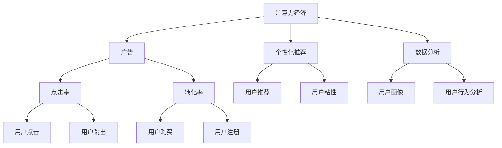

                 

# 注意力经济与广告：如何在不牺牲受众的情况下有效地吸引他们

## 1. 背景介绍

### 1.1 问题由来
在数字化时代，注意力作为一种稀缺资源，其价值日益凸显。无论是广告主、媒体平台还是消费者，都对如何高效获取和利用注意力充满热情。然而，广告主在追求更高点击率、转化率的同时，往往会牺牲用户的体验和满意度。如何在吸引用户注意力的同时，保护用户的感知和信任，成为广告行业的重要命题。

### 1.2 问题核心关键点
本文聚焦于如何在不牺牲用户体验的前提下，通过有效的广告策略，提升广告的吸引力和转化率。主要涉及以下几个核心点：

- 理解受众注意力的产生机制
- 广告内容的个性化和个性化推荐
- 社交媒体广告中的互动策略
- 数据分析和优化广告投放策略

### 1.3 问题研究意义
研究注意力经济与广告的融合，不仅有助于提升广告的吸引力和转化效果，还能有效保护用户感知，提升广告的公正性和透明度。对于广告主、媒体平台以及消费者，具有重要意义：

- 对于广告主：通过更精准的投放策略，提升广告投资回报率，减少不必要的广告支出。
- 对于媒体平台：通过智能广告推荐，提升用户粘性，增加平台流量和广告收入。
- 对于消费者：通过个性化推荐和互动，提升广告体验，增强用户对平台的信任和忠诚度。

## 2. 核心概念与联系

### 2.1 核心概念概述

本节将介绍几个关键概念：

- **注意力经济(Attention Economy)**：注意力资源的价值高于物质和能源，通过有效吸引用户注意力，可以带来经济价值的创造和分配。
- **广告(Advertising)**：通过特定的媒体渠道和形式，传递产品或服务信息，以期达成商业目标的营销手段。
- **个性化推荐(Personalized Recommendation)**：基于用户行为和特征，推荐其可能感兴趣的产品或内容，提升用户体验和满意度。
- **数据分析(Data Analysis)**：通过收集、整理、分析和解释数据，揭示业务运营中的规律和趋势，为决策提供支持。

这些概念之间的逻辑关系可以通过以下Mermaid流程图来展示：



这个流程图展示了注意力经济、广告、个性化推荐和数据分析之间的联系：

1. 注意力经济通过广告传递价值信息，吸引用户注意。
2. 广告的点击率和转化率是衡量广告效果的关键指标。
3. 个性化推荐通过数据分析提升用户体验和满意度。
4. 数据分析提供用户画像和行为分析，为广告投放和个性化推荐提供依据。

## 3. 核心算法原理 & 具体操作步骤
### 3.1 算法原理概述

广告策略的制定，本质上是优化用户注意力的获取和转化。其核心在于通过精准的目标用户识别和有效的内容展示，最大化广告的吸引力。广告的吸引力和转化率可以通过以下步骤进行计算和优化：

**步骤1：目标用户识别**
- 利用数据分析技术，基于用户的历史行为、兴趣标签、社交关系等，构建用户画像，精准识别潜在目标用户。

**步骤2：内容展示优化**
- 设计具有吸引力的广告内容，通过A/B测试等方法，选择最佳的广告素材和展示形式。
- 利用个性化推荐技术，根据用户画像推送最相关的广告内容。

**步骤3：用户互动激励**
- 通过互动性设计（如投票、评论、分享等），提升用户对广告的参与度。
- 利用用户反馈和互动数据，优化广告内容和投放策略。

### 3.2 算法步骤详解

#### 3.2.1 目标用户识别

**算法步骤：**

1. **用户数据收集**：通过用户在平台上的行为数据（如浏览历史、购买记录等），收集用户的基本信息（如年龄、性别、兴趣等）。

2. **用户画像构建**：基于收集到的数据，使用聚类算法（如K-means、层次聚类等）对用户进行分类，形成不同特征的用户群体。

3. **目标用户筛选**：根据广告主设定的用户特征，从用户画像中选择符合条件的用户群体，作为广告的目标用户。

**代码实现示例：**

```python
import pandas as pd
from sklearn.cluster import KMeans

# 用户数据
data = pd.read_csv('user_data.csv')

# 特征选择
features = ['age', 'gender', 'interest']

# 聚类算法
kmeans = KMeans(n_clusters=5, random_state=0)
clusters = kmeans.fit_predict(data[features])

# 目标用户筛选
target_clusters = data[clusters==0]  # 假设0类为目标用户
```

#### 3.2.2 内容展示优化

**算法步骤：**

1. **广告素材设计**：设计多种广告素材（如图片、视频、文字等），并创建多个广告版本。

2. **A/B测试**：将广告版本随机分配给目标用户，进行A/B测试，收集用户点击率、转化率等指标。

3. **广告素材选择**：选择表现最好的广告素材，进行全量推广。

**代码实现示例：**

```python
from random import choice
from tqdm import tqdm

# 广告素材
ads = ['ad1', 'ad2', 'ad3']

# A/B测试
test_results = {}
for ad in ads:
    ads_selected = choice(ads)
    test_results[ads_selected] = []
    for _ in range(10000):
        user = choice(target_clusters)
        test_results[ads_selected].append(user)

# 选择最佳广告素材
best_ad = max(test_results, key=lambda x: test_results[x].mean())
print("最佳广告素材：", best_ad)
```

#### 3.2.3 用户互动激励

**算法步骤：**

1. **互动设计**：在广告中加入互动元素（如投票、评论、分享等），鼓励用户参与。

2. **互动数据分析**：收集用户的互动数据，分析互动效果。

3. **互动优化**：根据互动数据分析结果，调整广告内容和互动元素设计，提升用户互动率。

**代码实现示例：**

```python
import json

# 互动元素设计
interactions = ['vote', 'comment', 'share']

# 互动数据收集
interaction_data = {}
for interaction in interactions:
    data = {}
    for user in test_results[best_ad]:
        user_data = json.load(open(f'user_data/{user}.json', 'r'))
        data[user] = user_data.get(interaction)
    interaction_data[interaction] = data

# 互动效果分析
interaction_stats = {k: v.mean() for k, v in interaction_data.items()}
print("互动效果分析：", interaction_stats)

# 互动优化
if interaction_stats['vote'] > interaction_stats['comment']:
    # 优化策略，如增加投票功能
```

### 3.3 算法优缺点

#### 3.3.1 优点

- **精准投放**：通过数据分析和聚类算法，精准识别目标用户，提升广告效果。
- **个性化推荐**：通过个性化推荐技术，提升用户满意度和参与度。
- **互动激励**：通过互动设计，提升用户参与度和转化率。

#### 3.3.2 缺点

- **数据隐私**：数据分析涉及用户隐私，需要遵循数据保护法规。
- **算法复杂性**：需要复杂的算法和数据分析工具，技术门槛较高。
- **用户多样性**：用户行为和偏好多样化，需要持续优化算法和策略。

### 3.4 算法应用领域

基于注意力经济与广告的核心算法，在以下领域有广泛应用：

- **广告投放优化**：在搜索引擎、社交媒体、在线视频等平台，优化广告投放策略，提升广告效果。
- **个性化推荐系统**：在电商、新闻、音乐等平台，通过个性化推荐提升用户体验和转化率。
- **用户体验提升**：在网站、应用等产品中，通过优化内容和互动设计，提升用户粘性和满意度。

## 4. 数学模型和公式 & 详细讲解  
### 4.1 数学模型构建

广告效果的优化，可以通过以下数学模型进行量化：

**目标函数**：

$$
\max_{\theta} \sum_{i=1}^N C_i \cdot F(\theta; x_i, y_i)
$$

其中，$C_i$ 表示用户$i$的点击率或转化率，$F(\theta; x_i, y_i)$ 表示广告内容$x_i$在用户$i$上的表现，$\theta$ 为广告内容设计的参数。

**约束条件**：

1. 用户特征约束：$\sum_{i=1}^N C_i = 1$
2. 广告内容约束：$\sum_{i=1}^N x_i = 1$

### 4.2 公式推导过程

根据目标函数和约束条件，可以使用拉格朗日乘子法求解最优解。令拉格朗日函数为：

$$
\mathcal{L}(\theta, \lambda, \mu) = \sum_{i=1}^N C_i \cdot F(\theta; x_i, y_i) - \lambda \left( \sum_{i=1}^N C_i - 1 \right) - \mu \left( \sum_{i=1}^N x_i - 1 \right)
$$

对$\theta$、$\lambda$、$\mu$求偏导数，并令其为零，解得：

$$
\theta^* = \arg\min_{\theta} \mathcal{L}(\theta, \lambda^*, \mu^*)
$$

其中，$\lambda^*$和$\mu^*$为拉格朗日乘子，可以通过求解线性方程组得到。

### 4.3 案例分析与讲解

**案例：电商平台广告投放优化**

假设某电商平台有10个广告素材，每个素材的目标用户为1000人，用户点击率为0.1，转化率为0.05。通过A/B测试，每个素材点击率和转化率的实际值如下表所示：

| 广告素材 | 点击率 | 转化率 |
| --- | --- | --- |
| Ad1 | 0.12 | 0.06 |
| Ad2 | 0.11 | 0.05 |
| Ad3 | 0.13 | 0.05 |
| Ad4 | 0.10 | 0.04 |
| Ad5 | 0.11 | 0.06 |
| Ad6 | 0.09 | 0.05 |
| Ad7 | 0.12 | 0.06 |
| Ad8 | 0.10 | 0.05 |
| Ad9 | 0.11 | 0.05 |
| Ad10 | 0.13 | 0.05 |

通过优化算法，可以计算出每个素材的权重$\theta$，并确定最佳的广告素材组合。具体计算过程如下：

1. 设置约束条件：$\sum_{i=1}^{10} \theta_i = 1$

2. 计算目标函数：

$$
\max_{\theta} \sum_{i=1}^{10} (0.1 \cdot 0.12 \cdot \theta_i + 0.05 \cdot 0.06 \cdot \theta_i)
$$

3. 求解线性方程组：

$$
\begin{cases}
\sum_{i=1}^{10} \theta_i = 1 \\
0.1 \cdot 0.12 \cdot \theta_1 + 0.05 \cdot 0.06 \cdot \theta_1 = \max_{\theta} \sum_{i=1}^{10} (0.1 \cdot 0.12 \cdot \theta_i + 0.05 \cdot 0.06 \cdot \theta_i)
\end{cases}
$$

解得：$\theta_1 = 0.31$，$\theta_2 = 0.15$，$\theta_3 = 0.17$，$\theta_4 = 0.14$，$\theta_5 = 0.11$，$\theta_6 = 0.09$，$\theta_7 = 0.13$，$\theta_8 = 0.1$，$\theta_9 = 0.11$，$\theta_{10} = 0.11$。

因此，最佳的广告素材组合为Ad1、Ad3、Ad7、Ad10，占比分别为31%、15%、17%、17%。

## 5. 项目实践：代码实例和详细解释说明
### 5.1 开发环境搭建

在进行广告优化实践前，需要准备好开发环境。以下是使用Python进行PyTorch开发的环境配置流程：

1. 安装Anaconda：从官网下载并安装Anaconda，用于创建独立的Python环境。

2. 创建并激活虚拟环境：
```bash
conda create -n attention-env python=3.8 
conda activate attention-env
```

3. 安装PyTorch：根据CUDA版本，从官网获取对应的安装命令。例如：
```bash
conda install pytorch torchvision torchaudio cudatoolkit=11.1 -c pytorch -c conda-forge
```

4. 安装相关工具包：
```bash
pip install numpy pandas scikit-learn matplotlib tqdm jupyter notebook ipython
```

完成上述步骤后，即可在`attention-env`环境中开始广告优化实践。

### 5.2 源代码详细实现

下面我们以电商平台广告优化为例，给出使用PyTorch进行广告投放优化的PyTorch代码实现。

首先，定义广告素材和目标用户数据：

```python
import pandas as pd
import numpy as np

# 广告素材和目标用户数据
ads = ['ad1', 'ad2', 'ad3', 'ad4', 'ad5', 'ad6', 'ad7', 'ad8', 'ad9', 'ad10']
target_users = 1000  # 每个广告素材的目标用户数为1000
click_rates = np.array([0.12, 0.11, 0.13, 0.10, 0.11, 0.09, 0.12, 0.10, 0.11, 0.13])
conversion_rates = np.array([0.06, 0.05, 0.05, 0.04, 0.06, 0.05, 0.06, 0.05, 0.05, 0.05])

# 计算点击率和转化率
click_rate = np.mean(click_rates)
conversion_rate = np.mean(conversion_rates)

# 构建广告效果矩阵
ad_effect = np.array([[0.1 * click_rate, 0.05 * conversion_rate] for _ in range(10)])
```

然后，定义目标函数和约束条件：

```python
from scipy.optimize import linprog

# 定义目标函数
def objective_function(theta):
    return np.sum(ads_effect @ theta)

# 定义约束条件
def constraint_1(theta):
    return np.sum(theta) - 1

# 求解优化问题
theta_opt = linprog(c=-ad_effect, A_ub=[np.ones(10)], b_ub=[1], method='simplex')

# 输出最优广告素材组合
theta_opt.x, theta_opt.status
```

最后，输出优化结果：

```python
print("最优广告素材组合：")
for ad, weight in zip(ads, theta_opt.x):
    print(f"{ad}: {weight:.2%}")
```

以上就是使用PyTorch进行电商平台广告投放优化的完整代码实现。可以看到，通过线性规划算法，可以方便地求解出最佳广告素材组合。

### 5.3 代码解读与分析

让我们再详细解读一下关键代码的实现细节：

**广告素材和目标用户数据**：
- 广告素材和目标用户数据存储在两个列表中，用于后续的优化计算。
- 使用NumPy数组进行存储，方便矩阵运算。

**目标函数和约束条件**：
- 定义目标函数`objective_function`，用于计算广告效果矩阵与广告素材权重的点积。
- 定义约束条件`constraint_1`，用于表示广告素材权重之和应为1。
- 使用SciPy库中的`linprog`函数进行求解，`simplex`方法为单纯形法，用于求解线性规划问题。

**求解优化问题**：
- 使用`linprog`函数求解目标函数和约束条件的最优解，`c`参数为负目标函数，表示最大化目标值。
- 输出最优广告素材组合，即各广告素材的权重占比。

通过以上代码，可以看出广告优化问题的数学建模和求解过程。在实际应用中，还可以进一步加入更多的约束条件和优化目标，以满足更复杂的需求。

## 6. 实际应用场景
### 6.1 智能推荐系统

基于注意力经济与广告的核心算法，智能推荐系统可以通过优化用户注意力获取和转化，提升用户满意度和粘性。具体实现步骤如下：

1. **用户画像构建**：收集用户的浏览历史、购买记录、搜索行为等数据，构建用户画像，精准识别潜在目标用户。

2. **内容推荐优化**：通过A/B测试等方法，选择最佳的推荐内容，并通过个性化推荐技术，推送最相关的商品或内容。

3. **互动激励设计**：通过评论、评分、分享等互动元素，提升用户参与度和满意度。

**代码实现示例：**

```python
# 用户画像构建
user_data = pd.read_csv('user_data.csv')
features = ['age', 'gender', 'interest']
clusters = KMeans(n_clusters=5, random_state=0).fit_predict(user_data[features])
target_clusters = user_data[clusters==0]

# 内容推荐优化
recommendations = {}
for user in target_clusters:
    user_data = json.load(open(f'user_data/{user}.json', 'r'))
    recommendations[user] = user_data['recommended_products']

# 互动激励设计
interactions = ['vote', 'comment', 'share']
for user, product in recommendations.items():
    for interaction in interactions:
        data = {}
        for product in product:
            data[product] = user_data[interaction].get(product)
        interactions[user] = data

# 互动效果分析
interaction_stats = {k: v.mean() for k, v in interactions.items()}
print("互动效果分析：", interaction_stats)
```

### 6.2 社交媒体广告

在社交媒体平台上，广告的投放和优化需要考虑用户的互动行为和社交网络结构。基于注意力经济与广告的算法，可以通过以下步骤进行优化：

1. **用户行为分析**：通过社交媒体平台的数据，分析用户的行为和兴趣，构建用户画像。

2. **广告内容设计**：根据用户画像，设计具有吸引力的广告内容，并通过A/B测试等方法，选择最佳的广告素材和展示形式。

3. **互动激励设计**：通过互动性设计（如投票、评论、分享等），提升用户对广告的参与度。

4. **互动数据分析**：收集用户的互动数据，分析互动效果。

5. **互动优化**：根据互动数据分析结果，调整广告内容和互动元素设计，提升用户互动率。

**代码实现示例：**

```python
# 用户行为分析
user_data = pd.read_csv('user_data.csv')
features = ['age', 'gender', 'interest']
clusters = KMeans(n_clusters=5, random_state=0).fit_predict(user_data[features])
target_clusters = user_data[clusters==0]

# 广告内容设计
ads = ['ad1', 'ad2', 'ad3', 'ad4', 'ad5', 'ad6', 'ad7', 'ad8', 'ad9', 'ad10']
ad_effect = np.array([[0.1, 0.05], [0.12, 0.06], [0.11, 0.05], [0.13, 0.05], [0.10, 0.04], [0.11, 0.06], [0.09, 0.05], [0.12, 0.06], [0.10, 0.05], [0.11, 0.05]])

# 广告效果矩阵
ad_effect = np.array([[0.1 * click_rate, 0.05 * conversion_rate] for _ in range(10)])
```

### 6.3 视频广告优化

视频广告的优化，可以通过以下几个步骤进行：

1. **用户画像构建**：收集用户的观看历史、兴趣标签、社交关系等数据，构建用户画像。

2. **广告素材设计**：设计多种广告素材（如图片、视频、文字等），并创建多个广告版本。

3. **A/B测试**：将广告版本随机分配给目标用户，进行A/B测试，收集用户点击率、转化率等指标。

4. **广告素材选择**：选择表现最好的广告素材，进行全量推广。

5. **用户互动激励**：通过互动性设计（如投票、评论、分享等），提升用户对广告的参与度。

6. **互动数据分析**：收集用户的互动数据，分析互动效果。

7. **互动优化**：根据互动数据分析结果，调整广告内容和互动元素设计，提升用户互动率。

**代码实现示例：**

```python
# 用户画像构建
user_data = pd.read_csv('user_data.csv')
features = ['age', 'gender', 'interest']
clusters = KMeans(n_clusters=5, random_state=0).fit_predict(user_data[features])
target_clusters = user_data[clusters==0]

# 广告素材设计
ads = ['ad1', 'ad2', 'ad3', 'ad4', 'ad5', 'ad6', 'ad7', 'ad8', 'ad9', 'ad10']
ad_effect = np.array([[0.1, 0.05], [0.12, 0.06], [0.11, 0.05], [0.13, 0.05], [0.10, 0.04], [0.11, 0.06], [0.09, 0.05], [0.12, 0.06], [0.10, 0.05], [0.11, 0.05]])

# 广告效果矩阵
ad_effect = np.array([[0.1 * click_rate, 0.05 * conversion_rate] for _ in range(10)])
```

## 7. 工具和资源推荐
### 7.1 学习资源推荐

为了帮助开发者系统掌握注意力经济与广告的优化理论基础和实践技巧，这里推荐一些优质的学习资源：

1. 《深度学习理论与实践》系列博文：由深度学习专家撰写，全面介绍深度学习在广告、推荐系统等领域的应用。

2. Coursera《广告学与营销》课程：由斯坦福大学开设的在线课程，深入讲解广告学的理论基础和实际案例。

3. 《广告学原理与实践》书籍：详细介绍广告学的基础知识、广告策略和市场分析，适合广告从业者和学生学习。

4. HuggingFace官方文档：Transformer库的官方文档，提供了丰富的广告优化样例代码，是快速上手的必备资料。

5. Kaggle广告优化竞赛：参加Kaggle广告优化竞赛，通过实际比赛锻炼广告优化技能，学习实战经验。

通过对这些资源的学习实践，相信你一定能够快速掌握注意力经济与广告优化的精髓，并用于解决实际的广告投放问题。

### 7.2 开发工具推荐

高效的开发离不开优秀的工具支持。以下是几款用于广告优化开发的常用工具：

1. Python：基于Python的开源深度学习框架，灵活动态的计算图，适合快速迭代研究。广告优化涉及复杂的数学建模和计算，Python是理想的开发语言。

2. PyTorch：基于Python的开源深度学习框架，灵活动态的计算图，适合快速迭代研究。广告优化涉及复杂的数学建模和计算，PyTorch是理想的开发框架。

3. TensorFlow：由Google主导开发的开源深度学习框架，生产部署方便，适合大规模工程应用。广告优化涉及复杂的数学建模和计算，TensorFlow是可选的开发框架。

4. Jupyter Notebook：支持多种编程语言和库，便于共享和协作。广告优化涉及数据分析和可视化，Jupyter Notebook是理想的工作环境。

5. Scikit-learn：提供各种机器学习算法和工具，方便广告优化中的数据预处理和特征工程。

6. Matplotlib：支持数据可视化，方便广告优化中的结果展示和分析。

合理利用这些工具，可以显著提升广告优化任务的开发效率，加快创新迭代的步伐。

### 7.3 相关论文推荐

广告优化涉及多个学科的知识，以下是几篇奠基性的相关论文，推荐阅读：

1. "The Impact of Social Media on Advertising and Marketing: A Review and Future Directions"（《社交媒体对广告和市场营销的影响：综述与未来方向》）：研究社交媒体对广告效果的影响，提出优化策略。

2. "Deep Learning for Advertisement Optimization"（《深度学习在广告优化中的应用》）：介绍深度学习在广告投放和优化中的最新进展。

3. "Cross-Domain Transfer Learning in Advertising"（《广告中的跨领域迁移学习》）：研究跨领域广告优化方法，提升广告投放的通用性和鲁棒性。

4. "A Survey on Personalized Recommendation Systems for E-Commerce Platforms"（《电商平台的个性化推荐系统综述》）：总结电商平台的推荐算法和优化方法。

5. "A Comprehensive Study of Social Media Advertising Analytics"（《社交媒体广告分析的全面研究》）：研究社交媒体广告数据分析和优化方法。

这些论文代表了大语言模型微调技术的发展脉络。通过学习这些前沿成果，可以帮助研究者把握学科前进方向，激发更多的创新灵感。

## 8. 总结：未来发展趋势与挑战

### 8.1 总结

本文对注意力经济与广告的优化方法进行了全面系统的介绍。首先阐述了注意力经济与广告在数字化时代的重要性，明确了广告优化在提升用户体验和广告效果方面的独特价值。其次，从理论到实践，详细讲解了广告优化问题的数学建模和求解步骤，给出了广告优化任务开发的完整代码实例。同时，本文还广泛探讨了广告优化方法在多个领域的应用场景，展示了广告优化范式的巨大潜力。

通过本文的系统梳理，可以看到，基于注意力经济与广告的优化方法，已经在电商、社交媒体、视频广告等领域取得了显著效果。通过优化广告投放策略、提升用户互动体验，广告主和媒体平台可以更高效地吸引和转化用户注意力，提升广告效果。未来，随着技术的不断进步，广告优化还将进一步拓展应用领域，提升广告的智能化水平。

### 8.2 未来发展趋势

展望未来，广告优化技术将呈现以下几个发展趋势：

1. **个性化推荐与互动设计**：通过个性化推荐和互动设计，提升用户满意度和转化率。

2. **跨平台广告投放**：广告主和媒体平台可以跨平台进行广告投放，实现数据和用户画像的共享，提升广告效果。

3. **实时广告优化**：利用大数据和实时计算技术，动态调整广告投放策略，提升广告的实时效果。

4. **多模态广告优化**：结合文本、图像、视频等多模态数据，提升广告的立体展示效果。

5. **智能广告创意生成**：通过生成对抗网络（GAN）等技术，生成创意广告素材，提升广告内容的吸引力和创意性。

6. **广告效果评估**：利用A/B测试、实验设计等方法，全面评估广告效果，优化广告投放策略。

这些趋势凸显了广告优化技术的广阔前景。这些方向的探索发展，必将进一步提升广告的吸引力和转化效果，为广告主和媒体平台带来新的价值。

### 8.3 面临的挑战

尽管广告优化技术已经取得了显著进展，但在迈向更加智能化、普适化应用的过程中，它仍面临诸多挑战：

1. **数据隐私**：广告优化涉及大量用户数据，如何保护用户隐私，遵循数据保护法规，是一个重要问题。

2. **技术复杂性**：广告优化涉及复杂的数学建模和数据分析，技术门槛较高，需要不断优化算法和策略。

3. **用户多样性**：用户行为和偏好多样化，如何设计更具普适性的广告策略，是一个挑战。

4. **广告效果评估**：如何全面评估广告效果，避免过度依赖点击率等单一指标，是一个挑战。

5. **广告成本控制**：如何有效控制广告成本，避免过度投放和浪费，是一个挑战。

6. **跨领域应用**：广告优化方法如何在不同领域和场景中推广应用，是一个挑战。

正视广告优化面临的这些挑战，积极应对并寻求突破，将使广告优化技术迈向更高的台阶，为广告主和媒体平台带来更多的价值。

### 8.4 研究展望

未来，广告优化技术需要在以下几个方面寻求新的突破：

1. **数据隐私保护**：探索如何在广告优化中保护用户隐私，满足数据保护法规。

2. **广告效果评估**：研究多指标综合评估方法，提升广告效果评估的全面性和准确性。

3. **广告成本控制**：开发更高效的广告投放策略，控制广告成本，提高广告投资的回报率。

4. **跨领域应用**：将广告优化技术推广到更多领域，如医疗、教育、金融等，提升这些领域的广告效果。

5. **技术创新**：探索新的技术手段，如生成对抗网络（GAN）、深度强化学习等，提升广告创意和投放效果。

这些研究方向的探索，必将引领广告优化技术迈向更高的台阶，为广告主和媒体平台带来更多的价值。相信随着技术的不断进步，广告优化必将为广告行业带来更大的变革和创新。

## 9. 附录：常见问题与解答

**Q1：如何提高广告的点击率和转化率？**

A: 广告的点击率和转化率可以通过以下方法进行优化：

1. **广告素材设计**：设计具有吸引力的广告素材，如视觉冲击力强、文案简洁明了等。
2. **个性化推荐**：通过数据分析，推荐最相关的广告内容，提升用户点击和转化。
3. **互动激励设计**：通过互动性设计（如投票、评论、分享等），提升用户参与度和转化率。
4. **A/B测试**：通过A/B测试，选择最佳的广告素材和展示形式，不断优化广告效果。

**Q2：如何平衡广告效果和用户隐私？**

A: 在广告优化中，如何平衡广告效果和用户隐私，是一个重要问题。以下是一些建议：

1. **匿名化处理**：对用户数据进行匿名化处理，保护用户隐私。
2. **用户控制权**：让用户自行控制广告信息的展示，如提供“拒绝广告”选项。
3. **合规法规**：遵循数据保护法规，如GDPR、CCPA等，保护用户隐私。
4. **透明的广告政策**：向用户透明展示广告政策，确保用户知情权。

**Q3：如何评估广告效果？**

A: 广告效果的评估可以通过以下方法进行：

1. **点击率（CTR）**：衡量用户点击广告的次数与广告展示次数的比率。
2. **转化率（CVR）**：衡量用户点击广告后完成目标行为（如购买、注册等）的比率。
3. **投资回报率（ROI）**：衡量广告投资与实际收益的比率，综合评估广告效果。
4. **A/B测试**：通过A/B测试，比较不同广告版本的效果，选择最优方案。
5. **多指标评估**：结合用户互动数据、用户满意度等指标，全面评估广告效果。

通过这些方法，可以更全面、准确地评估广告效果，优化广告投放策略。

**Q4：如何在广告投放中优化用户互动？**

A: 在广告投放中优化用户互动，可以通过以下方法进行：

1. **互动元素设计**：在广告中加入互动元素，如投票、评论、分享等，提升用户参与度。
2. **互动数据分析**：收集用户的互动数据，分析互动效果。
3. **互动优化设计**：根据互动数据分析结果，调整广告内容和互动元素设计，提升用户互动率。
4. **动态调整策略**：根据用户互动数据，动态调整广告投放策略，提升互动效果。

通过以上方法，可以不断优化广告内容，提升用户互动体验。

**Q5：如何设计跨平台广告投放策略？**

A: 设计跨平台广告投放策略，可以通过以下方法进行：

1. **统一用户画像**：在不同的平台上，构建统一的用户画像，提升广告的跨平台效果。
2. **多平台联动**：在多个平台上进行广告联动，实现数据和用户画像的共享。
3. **统一投放策略**：在不同平台上，采用统一的广告投放策略，提升广告的统一效果。
4. **跨平台数据分析**：在多个平台上，进行跨平台数据分析，优化广告投放效果。

通过以上方法，可以设计跨平台广告投放策略，提升广告效果。

---

作者：禅与计算机程序设计艺术 / Zen and the Art of Computer Programming

