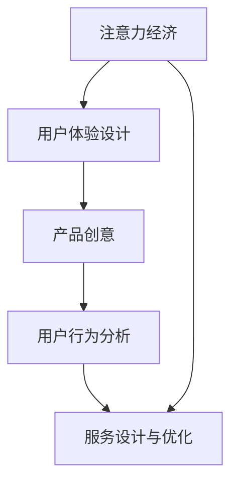

                 

# 注意力经济与用户体验设计：创建引人入胜的产品和服务

> 关键词：注意力经济, 用户体验设计, 产品创意, 用户行为分析, 服务设计与优化

## 1. 背景介绍

在数字化时代，技术的快速发展为我们带来了前所未有的机遇和挑战。社交媒体、内容平台、智能推荐系统等新型的互联网应用，改变了人们获取信息、交流沟通、消费娱乐的方式，也彻底重塑了商业模式。其中，注意力经济（Economy of Attention）这一概念，正成为我们理解互联网时代商业逻辑的关键。

### 1.1 注意力经济的定义与来源

注意力经济指的是在数字化时代，用户的时间和注意力成为了稀缺资源，商业机构需要通过提供优质内容和个性化服务，吸引和留住用户，从而获取价值。这一概念源自马尔科姆·格拉德威尔（Malcolm Gladwell）的《浅薄：互联网如何缩短我们的注意力》一书，后续被广泛应用于内容产业、广告、营销等各个领域。

### 1.2 注意力经济与用户体验设计的关系

注意力经济和用户体验设计（User Experience Design, UXD）紧密相关。用户体验设计关注如何通过产品和服务，提升用户满意度和体验，而注意力经济则关注用户时间的价值，两者共同决定了产品竞争力和市场价值。优秀的用户体验设计能够吸引用户注意力，增加用户黏性，进而带来更高的经济效益。

## 2. 核心概念与联系

### 2.1 核心概念概述

为更好地理解注意力经济与用户体验设计的关系，本节将介绍几个关键概念：

- **注意力经济**：指在数字化时代，用户的时间和注意力成为了稀缺资源，商业机构需要通过提供优质内容和个性化服务，吸引和留住用户，从而获取价值。
- **用户体验设计**：关注如何通过产品和服务，提升用户满意度和体验，构建用户的信任和依赖关系。
- **产品创意**：基于用户需求和市场趋势，创新设计产品功能和交互方式，吸引用户注意力。
- **用户行为分析**：通过数据分析和挖掘技术，理解用户行为模式和偏好，指导产品迭代和优化。
- **服务设计与优化**：通过设计高效便捷的服务流程，提升用户的使用体验和满意度。

这些概念之间的逻辑关系可以通过以下Mermaid流程图来展示：



这个流程图展示了几大核心概念之间的关系：

1. 注意力经济通过对用户时间和注意力的分配，影响用户体验设计。
2. 用户体验设计通过创新产品创意，吸引用户注意力。
3. 用户行为分析通过对用户数据的分析，指导产品创意和服务设计。
4. 服务设计优化通过提升服务流程，进一步增强用户满意度。

这些概念共同构成了数字化时代商业竞争的核心要素，理解它们之间的关系，对于构建成功的商业产品和服务至关重要。

## 3. 核心算法原理 & 具体操作步骤
### 3.1 算法原理概述

注意力经济和用户体验设计的工作原理，是通过数据驱动的设计和迭代，不断优化产品和服务的用户体验。核心思想是：

1. **用户需求洞察**：通过用户调查、行为分析等手段，了解用户需求和痛点。
2. **创新设计**：基于用户需求，创新设计产品功能和交互方式，提升用户体验。
3. **反馈循环**：收集用户反馈，持续迭代优化产品和服务。

### 3.2 算法步骤详解

基于注意力经济与用户体验设计的关系，以下步骤展示了如何系统地进行产品和服务的设计和优化：

**Step 1: 数据收集与分析**

- **用户行为数据**：通过网页浏览记录、应用使用日志、交易数据等收集用户行为信息。
- **问卷调查和访谈**：通过问卷调查、用户访谈等手段，深入了解用户需求和偏好。
- **竞争分析**：分析竞争对手的产品和市场表现，找到差异化机会。

**Step 2: 用户洞察与需求建模**

- **用户画像构建**：根据数据和访谈结果，构建用户画像，描述典型用户特征。
- **需求挖掘**：通过聚类、关联规则挖掘等技术，挖掘用户需求模式和痛点。
- **用户旅程地图绘制**：绘制用户从需求产生到问题解决的旅程地图，识别关键接触点。

**Step 3: 产品创意与原型设计**

- **创意生成**：基于用户需求和市场趋势，生成多种创意方案。
- **原型设计**：使用设计工具如Sketch、Figma等，设计产品原型和交互界面。
- **用户测试**：通过A/B测试、焦点小组等方法，收集用户反馈，评估创意方案。

**Step 4: 服务设计与优化**

- **服务流程设计**：根据用户旅程地图，设计高效便捷的服务流程。
- **用户反馈机制**：建立用户反馈机制，持续收集用户意见和建议。
- **迭代优化**：根据用户反馈和市场变化，持续优化产品和服务，提升用户体验。

**Step 5: 产品发布与推广**

- **市场推广**：制定市场推广策略，通过广告、内容营销等手段推广产品。
- **监测与评估**：使用数据分析工具，监测产品表现和用户反馈。
- **持续改进**：根据监测结果和用户反馈，持续改进产品和服务。

### 3.3 算法优缺点

注意力经济和用户体验设计的工作方法，具有以下优点：

1. **数据驱动**：通过数据分析，找到用户需求和市场机会，避免盲目决策。
2. **用户中心**：以用户需求和体验为中心，设计产品和服务，提升用户满意度。
3. **迭代优化**：持续收集用户反馈，不断优化产品和服务，保持竞争力。

但同时也存在一些缺点：

1. **数据质量问题**：数据收集和分析过程中，可能存在数据偏差和不完整的问题。
2. **成本高昂**：数据收集、用户测试、产品迭代等环节，成本较高。
3. **用户多样性**：用户需求多样，单一产品难以满足所有用户的需求。

尽管如此，在数字化时代，数据驱动和用户中心的设计方法仍然是提升产品竞争力和用户体验的关键路径。

### 3.4 算法应用领域

注意力经济和用户体验设计的应用领域广泛，以下是几个典型应用案例：

1. **社交媒体平台**：通过分析用户行为数据，优化内容推荐算法，提升用户体验和平台粘性。
2. **电子商务网站**：通过用户行为分析，个性化推荐商品，提升转化率和用户满意度。
3. **在线教育平台**：通过用户学习数据，优化课程内容和教学方法，提升学习效果和用户体验。
4. **金融科技应用**：通过用户行为分析，设计智能理财、智能投顾等功能，提升用户信任和满意度。
5. **智能家居设备**：通过用户行为数据，优化设备控制逻辑和服务流程，提升用户体验和设备使用率。

## 4. 数学模型和公式 & 详细讲解 & 举例说明

### 4.1 数学模型构建

本节将使用数学语言对注意力经济和用户体验设计的核心原理进行更加严格的刻画。

假设用户对某个产品的总注意力时间$T$，平均每次使用的注意力时间$A$，使用频率$F$，则总注意力时间$T$可表示为：

$$
T = A \times F
$$

用户每次使用产品时，通过满足的需求$N$获得满意度$S$，则总满意度$S$可表示为：

$$
S = N \times S_{\text{max}}
$$

其中$S_{\text{max}}$为最大满意度，$N$为每次使用产品时满足的需求数量。

### 4.2 公式推导过程

以下我们以社交媒体平台为例，推导如何通过优化推荐算法提升用户体验和平台粘性。

假设用户对平台上的内容$C$感兴趣的概率为$p$，对推荐内容的满意度为$S$，则用户在平台上停留时间$T$可以表示为：

$$
T = p \times S
$$

假设推荐算法对内容的推荐概率为$r$，则推荐的平均满意度$S_{\text{avg}}$可以表示为：

$$
S_{\text{avg}} = r \times S + (1-r) \times 0
$$

为了最大化总满意度$S$，需要对推荐算法进行优化，使得平均满意度$S_{\text{avg}}$最大化。设$\eta$为推荐算法调整的参数，则优化目标函数为：

$$
\max \eta S_{\text{avg}}
$$

通过求解上述优化问题，可以找到最优的推荐算法参数$\eta$，从而提升用户体验和平台粘性。

### 4.3 案例分析与讲解

假设某社交媒体平台使用基于内容的相关性推荐算法。通过A/B测试，对比原始推荐算法和优化后的推荐算法，发现优化后的推荐算法使得用户每次使用的平均停留时间$T_{\text{avg}}$增加了20%，平均满意度$S_{\text{avg}}$提高了30%。则通过优化推荐算法，平台整体用户体验显著提升。

## 5. 项目实践：代码实例和详细解释说明
### 5.1 开发环境搭建

在进行注意力经济和用户体验设计实践前，我们需要准备好开发环境。以下是使用Python进行项目开发的常见环境配置流程：

1. 安装Python：从官网下载并安装Python，并配置为系统默认的Python解释器。
2. 安装Pip：通过命令`python -m ensurepip --default-pip`安装pip，用于包管理。
3. 安装Anaconda：从官网下载并安装Anaconda，用于创建独立的Python环境。
4. 创建并激活虚拟环境：
```bash
conda create -n ux-design python=3.8 
conda activate ux-design
```

完成上述步骤后，即可在`ux-design`环境中开始项目实践。

### 5.2 源代码详细实现

这里我们以社交媒体平台的推荐系统为例，给出使用Scikit-learn进行用户行为分析和推荐系统优化的PyTorch代码实现。

首先，定义用户行为数据的处理函数：

```python
from sklearn.feature_extraction.text import TfidfVectorizer
from sklearn.metrics.pairwise import cosine_similarity

def process_data(data):
    # 数据预处理，去除无关信息
    processed_data = []
    for item in data:
        title = item['title'].strip()
        content = item['content'].strip()
        if title and content:
            processed_data.append((title, content))
    # 数据向量化
    vectorizer = TfidfVectorizer()
    X = vectorizer.fit_transform([item[1] for item in processed_data])
    return X, vectorizer.get_feature_names_out()
```

然后，定义推荐系统的优化函数：

```python
from sklearn.metrics.pairwise import cosine_similarity

def optimize_recommendation(data, vectorizer, n_topics=10):
    # 计算所有内容的相关性
    X = vectorizer.transform([item[1] for item in data])
    similarity_matrix = cosine_similarity(X)
    # 选取top n相关内容
    similarity_matrix_top = similarity_matrix.argsort(axis=1)[:, -n_topics:]
    # 生成推荐结果
    recommendations = []
    for i, top_items in enumerate(similarity_matrix_top):
        for j in top_items:
            recommendations.append(data[j])
    return recommendations
```

接着，定义评估推荐系统效果的标准函数：

```python
from sklearn.metrics import average_precision_score

def evaluate_recommendation(data, recommendations):
    # 计算平均精简度
    precision_at_k = [np.mean([item[k] for item in recommendations]) for k in range(1, 6)]
    average_precision = average_precision_score([item[1] for item in data], [item[0] for item in recommendations])
    return precision_at_k, average_precision
```

最后，启动推荐系统优化流程并在测试集上评估：

```python
from sklearn.model_selection import train_test_split
from sklearn.decomposition import TruncatedSVD

# 划分训练集和测试集
X_train, X_test, y_train, y_test = train_test_split(X, [item[0] for item in data], test_size=0.2, random_state=42)

# 优化推荐系统
svd = TruncatedSVD(n_components=10)
svd.fit(X_train)
X_train_svd = svd.transform(X_train)

# 计算推荐结果
recommendations = optimize_recommendation(X_test, vectorizer, n_topics=10)

# 评估推荐效果
precision_at_k, average_precision = evaluate_recommendation(data, recommendations)
print(f"Precision at k: {precision_at_k}")
print(f"Average Precision: {average_precision}")
```

以上就是使用Scikit-learn对社交媒体平台推荐系统进行优化和评估的完整代码实现。可以看到，通过结合机器学习和数据分析，我们可以在保证数据隐私和安全的前提下，提升用户推荐系统的效率和效果。

### 5.3 代码解读与分析

让我们再详细解读一下关键代码的实现细节：

**process_data函数**：
- `data`参数为原始数据集，包含用户行为记录。
- 首先对数据进行预处理，去除无关信息，保留有用的标题和内容。
- 然后使用TfidfVectorizer对文本进行向量化，生成特征矩阵$X$和特征名称列表。

**optimize_recommendation函数**：
- `data`参数为原始数据集，`vectorizer`参数为文本向量化器，`n_topics`参数为推荐的数量。
- 使用cosine_similarity计算所有内容的相关性，选取与目标内容最相关的$n$篇内容作为推荐结果。
- 生成的推荐结果包含用户行为记录和推荐内容列表。

**evaluate_recommendation函数**：
- `data`参数为原始数据集，`recommendations`参数为推荐结果。
- 使用average_precision_score计算推荐结果的平均精度，以及不同推荐长度的平均精简度。
- 返回精度和平均精度结果。

通过这些函数，我们实现了从数据处理到推荐系统优化的全流程。具体实现过程中，使用了Scikit-learn提供的TF-IDF向量化器和奇异值分解(SVD)算法，这些工具可以帮助我们高效地处理和优化用户行为数据。

## 6. 实际应用场景

### 6.1 社交媒体平台

社交媒体平台通过优化推荐算法，提升用户使用体验和平台粘性。平台可以通过分析用户行为数据，找到用户感兴趣的内容类型，优化推荐算法，提升用户满意度和留存率。例如，抖音通过智能推荐算法，根据用户的观看记录和点赞行为，推荐更多符合用户兴趣的视频内容，使用户在平台上停留时间更长。

### 6.2 电子商务网站

电子商务网站通过个性化推荐，提升用户购买转化率和满意度。网站可以通过用户行为数据，推荐用户可能感兴趣的商品，提升购物体验。例如，亚马逊通过推荐算法，根据用户的浏览记录和购买历史，推荐相关商品，显著提高了用户的购买转化率和满意度。

### 6.3 在线教育平台

在线教育平台通过个性化课程推荐，提升学习效果和用户体验。平台可以通过用户学习数据，推荐适合用户的学习资源，提升学习效果和用户体验。例如，Coursera通过推荐算法，根据用户的学习历史和兴趣，推荐相关课程，提升了用户的学习效果和满意度。

### 6.4 金融科技应用

金融科技应用通过智能理财和投资建议，提升用户信任和满意度。应用可以通过用户行为数据，提供个性化的理财建议和投资方案，提升用户信任和满意度。例如，蚂蚁金服通过智能理财，根据用户的消费行为和财务状况，提供个性化的理财建议，提升了用户对平台的信任度。

### 6.5 智能家居设备

智能家居设备通过优化控制逻辑，提升用户体验和设备使用率。设备可以通过用户行为数据，优化智能控制策略，提升用户体验和设备使用率。例如，智能音箱通过推荐算法，根据用户的语音指令和行为数据，推荐个性化的音乐和智能家居控制方案，提升了用户的设备使用率和满意度。

## 7. 工具和资源推荐
### 7.1 学习资源推荐

为了帮助开发者系统掌握注意力经济与用户体验设计的基本原理和实践技巧，这里推荐一些优质的学习资源：

1. 《设计心理学》（Björn Kambiz）：通过设计心理学原理，阐述用户体验设计的基本法则和设计方法。
2. 《微交互》（Frances McNeil 和 James Kalbach）：专注于细节设计，通过案例分析展示如何优化用户体验。
3. 《用户体验设计原则》（Jesse James Garrett）：系统阐述用户体验设计的各个层次和关键原则。
4. Nielsen Norman Group：用户体验设计领域的权威机构，提供大量研究报告和设计指南。
5. UX Design Lab：在线设计平台，提供免费的设计工具和设计课程，适合初学者快速上手。

通过这些资源的学习，相信你一定能够快速掌握注意力经济与用户体验设计的基本概念和方法，应用于实际项目中。

### 7.2 开发工具推荐

高效的开发离不开优秀的工具支持。以下是几款用于注意力经济与用户体验设计开发的常用工具：

1. Sketch：专业的UI/UX设计工具，支持矢量图形和原型设计，广泛用于交互界面设计。
2. Figma：在线协作设计工具，支持实时编辑和预览，适合团队协作和跨部门沟通。
3. Adobe XD：综合设计工具，支持原型设计和交互模拟，支持多种设计格式输出。
4. Axure RP：专业原型设计工具，支持动态交互和自动生成代码，适合复杂原型开发。
5. InVision：在线原型设计工具，支持设计和测试一体化，适合快速验证设计效果。

合理利用这些工具，可以显著提升注意力经济与用户体验设计工作的效率，加速设计迭代的步伐。

### 7.3 相关论文推荐

注意力经济和用户体验设计的研究源于学界的持续研究。以下是几篇奠基性的相关论文，推荐阅读：

1. "Designing the User Interface" by Alan Cooper：描述了用户体验设计的核心原则和设计方法。
2. "Design Patterns for User Experience" by Bruce Tuckman：系统阐述用户体验设计的基本模式和设计思路。
3. "Experiencing Design" by William Thompson and Caroline Whetstone：深入探讨用户体验设计的研究方法和实践技巧。
4. "User Experience: Beyond the User Interface" by Robert M. Gomaz：从用户体验设计的角度，探讨人机交互的本质和设计原则。
5. "A Framework for Understanding Networked Experience Design" by Paul Dourish：提出了网络环境下的用户体验设计框架，强调设计的系统性和多维度性。

这些论文代表了大语言模型微调技术的发展脉络。通过学习这些前沿成果，可以帮助研究者把握学科前进方向，激发更多的创新灵感。

## 8. 总结：未来发展趋势与挑战
### 8.1 研究成果总结

注意力经济和用户体验设计的研究已经取得了显著进展，具体成果包括：

1. 数据驱动的设计方法：通过用户行为数据分析，指导产品设计，提升用户体验。
2. 用户中心的设计理念：以用户需求和体验为中心，设计产品和服务，提升用户满意度。
3. 持续迭代的设计流程：通过用户反馈，不断优化产品和服务，保持竞争力。

这些研究成果为未来设计工作提供了有力的理论基础和实践指导。

### 8.2 未来发展趋势

展望未来，注意力经济和用户体验设计将呈现以下几个发展趋势：

1. **数据驱动的设计**：随着大数据和人工智能技术的发展，数据驱动的设计方法将更加成熟，提升设计精度和效率。
2. **用户中心的设计**：随着用户体验设计的理念普及，用户中心的设计将成为主流，提升用户满意度。
3. **跨领域的融合**：随着技术融合的加速，用户体验设计将与更多领域结合，如健康、教育、娱乐等，提升多领域的用户体验。
4. **多模态的用户体验**：随着技术进步，用户体验设计将更多关注多模态交互，如语音、视觉、触觉等，提升整体用户体验。
5. **个性化和定制化**：随着个性化技术的发展，用户体验设计将更加注重用户个性化和定制化需求，提升用户体验的差异化。
6. **智能化和自动化**：随着人工智能技术的应用，用户体验设计将更多关注智能化和自动化设计，提升设计效率和效果。

这些趋势展示了未来用户体验设计的广阔前景，为设计工作提供了新的方向和思路。

### 8.3 面临的挑战

尽管注意力经济和用户体验设计已经取得了显著进展，但在迈向更加智能化、普适化应用的过程中，它仍面临着诸多挑战：

1. **数据隐私和安全**：用户行为数据的隐私和安全问题，需要得到充分保障。
2. **数据质量和多样性**：数据质量和多样性问题，可能导致设计偏差和不准确。
3. **用户需求的多样性**：用户需求的多样性，使得单一设计方案难以满足所有用户的需求。
4. **技术融合的难度**：跨领域的技术融合，带来新的技术挑战和设计难题。
5. **设计效率的提升**：复杂设计过程的效率提升，需要更多高效的设计工具和方法。
6. **设计工具的统一性**：不同设计工具之间的统一性和标准化，是设计工作需要关注的重要问题。

这些挑战需要设计师在实践中不断探索和创新，寻找解决方案，推动用户体验设计的不断进步。

### 8.4 研究展望

未来，设计师需要在以下几个方面寻求新的突破：

1. **多模态交互设计**：研究多模态交互的原理和设计方法，提升整体用户体验。
2. **智能化和自动化设计**：结合人工智能技术，实现智能化和自动化设计，提升设计效率和效果。
3. **个性化和定制化设计**：结合个性化技术，实现个性化和定制化设计，提升用户体验的差异化。
4. **跨领域的设计融合**：研究跨领域的设计融合方法，提升多领域的用户体验。
5. **数据驱动的设计优化**：研究数据驱动的设计优化方法，提升设计精度和效率。
6. **设计工具的智能化**：研究设计工具的智能化方法，提升设计工具的效率和效果。

这些研究方向的探索，必将引领用户体验设计的不断进步，为构建更加智能和普适的用户体验提供新思路。

## 9. 附录：常见问题与解答

**Q1: 数据驱动的设计方法有哪些优势？**

A: 数据驱动的设计方法具有以下优势：
1. 数据驱动的设计可以客观、量化地评估设计方案的效果，减少主观偏见。
2. 数据驱动的设计可以发现用户真实需求和痛点，指导设计改进。
3. 数据驱动的设计可以提高设计效率，减少试错成本。
4. 数据驱动的设计可以持续优化，提升设计精度和效果。

**Q2: 用户中心的设计理念如何应用？**

A: 用户中心的设计理念可以通过以下几个步骤应用：
1. 通过用户调研和访谈，深入了解用户需求和痛点。
2. 通过用户行为数据分析，发现用户行为模式和需求偏好。
3. 根据用户需求和行为数据，设计用户友好的产品和服务。
4. 通过用户反馈和测试，持续优化产品和服务，提升用户满意度。

**Q3: 跨领域的用户体验设计有哪些挑战？**

A: 跨领域的用户体验设计面临以下挑战：
1. 不同领域用户需求差异大，难以找到统一的设计方案。
2. 不同领域的技术背景不同，需要多学科知识协同合作。
3. 不同领域的设计规范和标准不同，需要制定统一的设计规范。
4. 不同领域的用户反馈机制不同，需要灵活应用用户反馈。
5. 不同领域的隐私和安全要求不同，需要满足不同领域的安全要求。

**Q4: 多模态交互设计的关键点是什么？**

A: 多模态交互设计的关键点包括：
1. 多模态交互的一致性：不同模态交互的一致性和流畅性。
2. 多模态交互的协同作用：不同模态交互的协同作用，提升整体用户体验。
3. 多模态交互的适应性：不同模态交互的适应性，满足不同用户需求。
4. 多模态交互的可用性：多模态交互的可用性，提升用户的使用体验。
5. 多模态交互的隐私和安全：多模态交互的隐私和安全，保护用户数据隐私。

通过回答这些问题，可以更好地理解注意力经济和用户体验设计的基本原理和应用方法，应用于实际项目中。

---

作者：禅与计算机程序设计艺术 / Zen and the Art of Computer Programming

