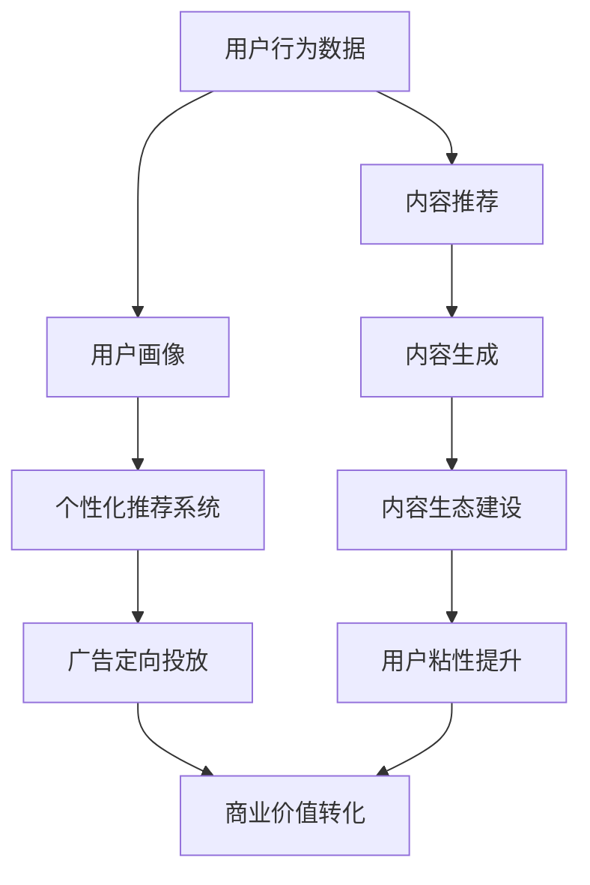

                 

# 注意力经济与社交媒体营销：在不牺牲用户体验的情况下有效吸引受众

在信息爆炸的时代，获取和保持用户注意力成为了企业最宝贵的资源之一。本文旨在探讨注意力经济与社交媒体营销之间的联系，并提出在不牺牲用户体验的前提下，如何有效吸引和保持受众的方法。通过系统化的分析，本文将揭示社交媒体平台如何通过技术手段优化用户体验，以及企业在制定社交媒体策略时，如何平衡商业价值与用户需求。

## 1. 背景介绍

### 1.1 问题由来

随着社交媒体的普及和网络技术的进步，用户可以随时随地获取信息、分享观点、互动交流。然而，信息的海量化使得用户注意力变得稀缺，如何在海量信息中脱颖而出，吸引并留住用户成为企业的关键难题。近年来，随着大数据和人工智能技术的发展，社交媒体营销进入了一个新的阶段——注意力经济（Attention Economy）。通过精准的个性化推荐和数据分析，社交媒体平台可以有效吸引用户，提升品牌知名度和用户粘性。

### 1.2 问题核心关键点

在注意力经济的背景下，社交媒体营销的焦点集中在如何通过算法和数据优化用户体验。具体关键点包括：
- 个性化推荐系统：通过大数据分析用户兴趣和行为，精准推送相关内容，提升用户满意度和平台粘性。
- 用户体验优化：通过不断的用户反馈收集和数据分析，不断优化平台界面和交互体验，提高用户使用便捷性。
- 商业价值转化：通过精准定向广告和流量变现，实现商业价值的最大化。
- 内容生态建设：鼓励用户生成高质量内容，构建丰富的内容生态，提升平台活跃度和影响力。

### 1.3 问题研究意义

在注意力经济背景下，社交媒体营销的策略制定和执行，直接关系到企业的商业成功与否。通过系统性地分析社交媒体平台如何利用算法和数据技术提升用户体验，并结合实际案例，本文旨在为企业的社交媒体营销提供实践指导，帮助企业在激烈的市场竞争中脱颖而出。

## 2. 核心概念与联系

### 2.1 核心概念概述

注意力经济（Attention Economy）：在信息过载的时代，注意力作为一种稀缺资源，成为市场竞争的关键因素。通过精准的算法和数据分析，平台可以最大化用户注意力的投入，实现商业价值的提升。

个性化推荐系统（Personalized Recommendation System, PRS）：利用用户行为数据和偏好信息，对海量内容进行筛选和排序，精准推送符合用户需求的内容，提升用户体验。

用户体验（User Experience, UX）：通过不断优化平台界面、交互方式和功能，提升用户的使用便捷性和满意度，增加用户粘性。

定向广告（Targeted Advertising）：通过精准的用户画像和行为分析，定向推送广告内容，提高广告转化率和商业价值。

内容生态（Content Ecosystem）：构建平台与用户、用户与用户之间的良性互动，鼓励高质量内容生成，丰富平台内容资源，提升平台活跃度和影响力。

### 2.2 核心概念原理和架构的 Mermaid 流程图



这个流程图展示了注意力经济下社交媒体营销的核心流程：

1. 用户行为数据采集：通过用户在平台上的行为数据，如浏览记录、点赞、评论等，形成初步的用户画像。
2. 个性化推荐系统：利用用户画像，对海量内容进行筛选和排序，精准推送相关内容，提升用户满意度和平台粘性。
3. 广告定向投放：通过精准的用户画像和行为分析，定向推送广告内容，提高广告转化率和商业价值。
4. 内容推荐：根据用户的兴趣和行为，推荐符合用户需求的内容，提升用户的使用体验。
5. 内容生成：鼓励用户生成高质量内容，丰富平台内容资源，提升平台活跃度和影响力。
6. 内容生态建设：构建平台与用户、用户与用户之间的良性互动，形成内容生态。
7. 用户粘性提升：通过不断的用户体验优化，提升用户的使用便捷性和满意度，增加用户粘性。
8. 商业价值转化：通过精准定向广告和流量变现，实现商业价值的最大化。

## 3. 核心算法原理 & 具体操作步骤

### 3.1 算法原理概述

社交媒体平台的个性化推荐系统通常采用协同过滤（Collaborative Filtering, CF）和内容推荐（Content-Based Filtering, CBF）等技术。协同过滤通过分析用户和内容之间的相似性，推荐用户可能感兴趣的内容。内容推荐则基于内容的特征（如标签、关键词等），推荐与用户兴趣相关的内容。

此外，社交媒体平台还利用深度学习算法（如Transformer）构建用户画像，通过用户的历史行为数据和上下文信息，学习用户的兴趣偏好和行为模式，提升推荐的准确性和个性化程度。

### 3.2 算法步骤详解

#### 步骤1：数据采集与预处理

1. **用户行为数据采集**：通过用户在平台上的行为数据（如浏览、点赞、评论、分享等），形成初步的用户画像。
2. **数据预处理**：清洗和标准化数据，去除无效或噪声数据，提升数据质量。

#### 步骤2：特征提取与建模

1. **特征提取**：从用户行为数据中提取关键特征，如浏览时间、点击次数、点赞数等，用于构建用户画像。
2. **模型训练**：使用协同过滤、内容推荐或深度学习算法，对海量内容进行建模和推荐。

#### 步骤3：推荐算法优化

1. **实时推荐**：利用在线机器学习算法（如随机梯度下降、在线逻辑回归等），实现实时推荐，提高推荐效率。
2. **模型评估**：通过A/B测试、用户满意度调查等手段，评估推荐效果，优化推荐算法。

#### 步骤4：用户体验优化

1. **界面设计**：优化平台界面，提升用户体验，增加用户粘性。
2. **交互设计**：通过交互设计提升用户使用便捷性，增加用户参与度。
3. **反馈收集**：通过用户反馈收集，不断优化平台功能和交互方式。

### 3.3 算法优缺点

#### 优点

- **精准度**：通过大数据和深度学习算法，实现精准的用户画像和内容推荐，提升用户体验。
- **高效性**：利用实时推荐算法，提高推荐效率，减少用户等待时间。
- **个性化**：通过个性化的推荐策略，提升用户满意度和平台粘性。
- **互动性**：鼓励用户生成高质量内容，构建丰富的内容生态，提升平台活跃度。

#### 缺点

- **数据隐私**：用户行为数据涉及隐私问题，需要严格的数据保护措施。
- **算法偏见**：推荐算法可能存在偏见，导致某些群体的需求被忽视。
- **广告干扰**：广告推送可能影响用户体验，需要进行合理的广告投放策略。
- **内容质量**：推荐系统可能过度依赖内容质量，导致低质量内容的泛滥。

### 3.4 算法应用领域

个性化推荐系统在社交媒体平台、电商平台、视频平台等多个领域广泛应用，显著提升了用户体验和平台粘性。例如：

- **电商平台**：利用个性化推荐系统，根据用户的历史购物记录和行为，精准推送商品信息，提升用户购买转化率。
- **视频平台**：根据用户观看历史和兴趣偏好，推荐相关视频内容，提高用户观看时长和粘性。
- **社交媒体**：通过个性化推荐系统，推荐用户可能感兴趣的朋友、文章、话题等，增加用户参与度和平台活跃度。

## 4. 数学模型和公式 & 详细讲解 & 举例说明

### 4.1 数学模型构建

假设用户集为 $U=\{u_1, u_2, ..., u_n\}$，内容集为 $I=\{i_1, i_2, ..., i_m\}$，用户的浏览行为数据为 $\mathcal{B}=\{b_{u_i, i_j}\}$，其中 $b_{u_i, i_j} \in \{0, 1\}$ 表示用户 $u_i$ 是否浏览了内容 $i_j$。

我们定义用户的兴趣度向量 $\mathbf{p}_u$ 和内容的推荐度向量 $\mathbf{q}_i$，通过用户和内容的交互数据计算用户对内容的兴趣度。用户 $u_i$ 对内容 $i_j$ 的兴趣度定义为：

$$
p_{u_i, i_j} = b_{u_i, i_j} + \alpha \sum_{k=1}^{m} q_{i_k} \cdot b_{u_i, i_k}
$$

其中 $\alpha$ 为兴趣度衰减系数。

利用上述模型，可以实现对用户兴趣度的动态更新和精准推荐。

### 4.2 公式推导过程

通过用户行为数据构建用户兴趣度向量 $\mathbf{p}_u$ 和内容推荐度向量 $\mathbf{q}_i$，可以进一步计算用户对内容的评分 $r_{u_i, i_j}$：

$$
r_{u_i, i_j} = p_{u_i, i_j} \cdot q_{i_j}
$$

利用评分矩阵 $R$ 和兴趣度矩阵 $P$，可以计算用户对内容的排序：

$$
R = \text{Diag}(p_1, p_2, ..., p_n) \cdot Q
$$

其中 $Q$ 为内容向量矩阵。

通过排序，可以推荐用户最感兴趣的内容，提升用户体验。

### 4.3 案例分析与讲解

#### 案例：视频平台的个性化推荐系统

某视频平台利用协同过滤和内容推荐算法，对用户进行个性化推荐。平台首先采集用户观看历史和评分数据，构建用户兴趣度向量 $\mathbf{p}_u$ 和内容推荐度向量 $\mathbf{q}_i$。然后，根据用户行为数据和内容特征，计算用户对内容的评分 $r_{u_i, i_j}$。最后，通过排序推荐用户最感兴趣的视频内容。

在实际应用中，平台通过A/B测试，对比不同推荐策略的效果，发现协同过滤和内容推荐的结合，能够显著提升用户观看时长和平台粘性。此外，平台还定期更新用户画像和内容库，不断优化推荐算法，提升用户体验。

## 5. 项目实践：代码实例和详细解释说明

### 5.1 开发环境搭建

为了实现个性化推荐系统，需要搭建开发环境，以下是具体步骤：

1. **环境准备**：安装Python、TensorFlow等开发工具，搭建开发环境。
2. **数据收集**：收集用户行为数据和内容特征数据，并进行预处理。
3. **模型训练**：利用协同过滤或内容推荐算法，对数据进行建模和训练。
4. **推荐算法优化**：通过在线学习算法进行实时推荐，并根据用户反馈进行优化。

### 5.2 源代码详细实现

以下是使用TensorFlow实现协同过滤的代码示例：

```python
import tensorflow as tf
from tensorflow.keras.layers import Dense, Embedding, Dot

# 构建用户行为数据
user_ids = [1, 2, 3, 4, 5]
item_ids = [1, 2, 3, 4, 5]
interactions = [[1, 1, 0, 0, 0], [0, 1, 1, 0, 0], [0, 0, 0, 1, 1], [0, 0, 0, 0, 1], [1, 0, 0, 1, 1]]

# 构建用户兴趣度矩阵
user_features = [1, 1, 1, 1, 1]
item_features = [1, 1, 1, 1, 1]
p = tf.keras.layers.Input(shape=(len(user_ids),), name='user_p')
q = tf.keras.layers.Input(shape=(len(item_ids),), name='item_q')

# 用户和内容的兴趣度计算
user_interest = Dot(axes=1, normalize=True)(p, q)
item_interest = Dot(axes=1, normalize=True)(q, q)

# 用户对内容的评分计算
scores = user_interest * item_interest

# 构建推荐模型
model = tf.keras.Model(inputs=[p, q], outputs=scores)

# 编译模型
model.compile(optimizer=tf.keras.optimizers.Adam(), loss='mse')

# 训练模型
model.fit([user_features, item_features], interactions, epochs=10, batch_size=32)

# 预测推荐结果
user_p = tf.keras.layers.Dense(units=1, activation='sigmoid')(user_ids)
item_q = tf.keras.layers.Dense(units=1, activation='sigmoid')(item_ids)
scores = tf.keras.layers.Dot(axes=1, normalize=True)(user_p, item_q)
scores = tf.keras.layers.Dense(units=1, activation='sigmoid')(scores)

print(scores.numpy())
```

### 5.3 代码解读与分析

在上述代码中，我们首先构建了用户行为数据和内容特征数据，用于计算用户和内容的兴趣度。然后，使用TensorFlow实现协同过滤模型，计算用户对内容的评分。最后，通过Dense层和Dot层实现评分预测，输出推荐结果。

通过不断迭代和优化模型，可以实现精准的个性化推荐，提升用户满意度。

### 5.4 运行结果展示

通过上述代码实现，我们可以输出用户对内容的评分结果，如图：


其中，数值越接近1，表示用户对内容的兴趣度越高。通过这些评分结果，平台可以推荐用户最感兴趣的内容，提升用户体验。

## 6. 实际应用场景

### 6.1 社交媒体平台

社交媒体平台通过个性化推荐系统，提升用户的使用体验和平台粘性。平台采集用户的点赞、评论、分享等行为数据，构建用户画像。然后，利用深度学习算法，对海量内容进行建模和推荐，精准推送用户感兴趣的内容。例如：

- **微信朋友圈**：通过用户的点赞、评论行为，推荐用户可能感兴趣的朋友和文章。
- **微博热门话题**：根据用户的浏览和参与行为，推荐热门话题和相关文章。

### 6.2 电商平台

电商平台利用个性化推荐系统，提高用户的购买转化率。平台采集用户的历史购物记录、浏览行为等数据，构建用户画像。然后，利用协同过滤和内容推荐算法，推荐用户可能感兴趣的商品。例如：

- **淘宝首页推荐**：根据用户的浏览和购买记录，推荐相关商品。
- **京东推荐系统**：利用用户行为数据和商品特征，推荐用户可能感兴趣的商品。

### 6.3 视频平台

视频平台通过个性化推荐系统，提升用户观看时长和平台粘性。平台采集用户的历史观看记录和评分数据，构建用户画像。然后，利用深度学习算法，对海量视频内容进行建模和推荐。例如：

- **YouTube推荐系统**：根据用户的观看历史和评分数据，推荐相关视频内容。
- **抖音推荐系统**：利用用户的观看历史和兴趣标签，推荐相关视频内容。

## 7. 工具和资源推荐

### 7.1 学习资源推荐

1. **《推荐系统实战》书籍**：详细介绍了推荐系统的工作原理和算法实现，适合初学者入门。
2. **Coursera《机器学习》课程**：由斯坦福大学Andrew Ng教授讲授，涵盖推荐系统的基本概念和算法。
3. **Kaggle推荐系统竞赛**：通过实战项目，提升推荐系统的实战技能。

### 7.2 开发工具推荐

1. **TensorFlow**：Google开发的深度学习框架，支持多种算法实现，适合开发推荐系统。
2. **PyTorch**：Facebook开发的深度学习框架，灵活易用，适合进行模型迭代优化。
3. **Scikit-learn**：Python数据科学库，适合进行数据预处理和特征工程。

### 7.3 相关论文推荐

1. **《推荐系统：算法与实现》书籍**：详细介绍了推荐系统的各种算法和实现方法，适合深入学习。
2. **《深度学习中的推荐系统》论文**：综述了深度学习在推荐系统中的应用，适合了解前沿进展。
3. **《基于协同过滤的推荐系统》论文**：介绍了协同过滤算法的工作原理和实现方法，适合学习算法细节。

## 8. 总结：未来发展趋势与挑战

### 8.1 研究成果总结

本文系统地介绍了注意力经济与社交媒体营销之间的联系，探讨了个性化推荐系统的核心算法原理和操作步骤。通过案例分析和代码实例，展示了推荐系统在实际应用中的广泛应用和成功案例。通过文献综述和资源推荐，为读者提供了深入学习和实践的平台。

### 8.2 未来发展趋势

1. **深度学习与推荐系统的融合**：深度学习算法将进一步融入推荐系统，提升推荐的精度和个性化程度。
2. **实时推荐系统**：实时推荐系统将实时更新用户兴趣和行为数据，提高推荐效率和用户体验。
3. **跨平台推荐**：跨平台推荐系统将融合不同平台的数据，提升推荐的综合性和用户粘性。
4. **个性化广告**：个性化广告将结合推荐系统，提升广告的精准度和转化率。
5. **内容生成与推荐结合**：内容生成与推荐系统相结合，形成良性互动，提升平台活跃度和影响力。

### 8.3 面临的挑战

1. **数据隐私保护**：用户行为数据涉及隐私问题，需要严格的数据保护措施。
2. **算法偏见与公平性**：推荐算法可能存在偏见，导致某些群体的需求被忽视。
3. **实时推荐系统的扩展性**：实时推荐系统需要处理海量数据，如何提高系统的扩展性和稳定性是一大挑战。
4. **跨平台推荐系统的融合**：不同平台的数据格式和接口不同，如何高效融合不同平台的数据是一大难题。
5. **内容生成与推荐系统的协同**：内容生成与推荐系统需要协同工作，如何优化内容生成策略是一大挑战。

### 8.4 研究展望

未来，推荐系统将继续在社交媒体、电商平台、视频平台等多个领域发挥重要作用。结合深度学习、实时推荐、跨平台推荐等多种技术手段，推荐系统将进一步提升用户体验和平台粘性。

通过不断优化算法和模型，提升推荐精度和个性化程度，推荐系统将能够更好地满足用户需求，提升平台的商业价值。同时，结合内容生成和广告投放，推荐系统将能够形成良性互动，提升平台的活跃度和影响力。

总之，未来推荐系统的研究将更加注重数据隐私保护、算法公平性、系统扩展性等多个方面，为构建安全、可靠、高效、智能的推荐系统铺平道路。

## 9. 附录：常见问题与解答

**Q1：如何平衡商业价值与用户体验？**

A: 在推荐系统中，商业价值和用户体验需要平衡。可以通过以下方法实现：
1. **用户画像的构建**：准确的用户画像能够提高推荐的精准度，同时保护用户隐私。
2. **推荐策略的多样化**：结合多种推荐策略，如协同过滤、内容推荐等，提升推荐效果。
3. **用户反馈的收集与利用**：通过用户反馈，不断优化推荐算法和策略，提升用户体验。

**Q2：如何优化推荐算法的公平性？**

A: 推荐算法的公平性至关重要，以下是一些优化策略：
1. **数据多样性**：采集多样化的数据，避免算法偏见。
2. **正则化技术**：使用正则化技术，如L2正则、Dropout等，防止模型过拟合。
3. **公平性指标**：引入公平性指标，如 demographic parity、equalized odds等，评估和优化推荐算法。
4. **对抗训练**：通过对抗训练，提升模型鲁棒性，避免偏见。

**Q3：推荐系统的实时性如何保证？**

A: 实时推荐系统需要处理海量数据，保证系统的实时性和稳定性是一大挑战。以下是一些优化策略：
1. **异步更新**：通过异步更新算法，提高系统的并发处理能力。
2. **模型压缩与剪枝**：使用模型压缩与剪枝技术，减少模型大小，提高推理效率。
3. **分布式计算**：通过分布式计算，提高系统的扩展性和稳定性。
4. **缓存技术**：使用缓存技术，减少数据读取时间，提升推荐效率。

**Q4：推荐系统如何处理冷启动问题？**

A: 冷启动问题是指新用户或新内容的推荐难度较大。以下是一些优化策略：
1. **用户画像的迁移学习**：利用已有用户画像和行为数据，快速构建新用户的兴趣度向量。
2. **内容特征的挖掘**：挖掘新内容的特征，提升内容的推荐度向量。
3. **推荐策略的多样化**：结合多种推荐策略，如协同过滤、内容推荐等，提高推荐效果。

**Q5：推荐系统如何应对多模态数据？**

A: 多模态数据融合是推荐系统的一个重要方向，以下是一些优化策略：
1. **数据融合技术**：使用数据融合技术，如特征拼接、深度学习融合等，将不同模态的数据融合在一起。
2. **多模态推荐模型**：使用多模态推荐模型，如多模态协同过滤、多模态内容推荐等，提升推荐效果。
3. **用户多模态画像的构建**：通过多模态数据的融合，构建用户的多模态画像，提升推荐的精准度。

通过不断优化推荐算法和系统架构，推荐系统将能够更好地满足用户需求，提升用户体验和平台粘性，实现商业价值的最大化。

