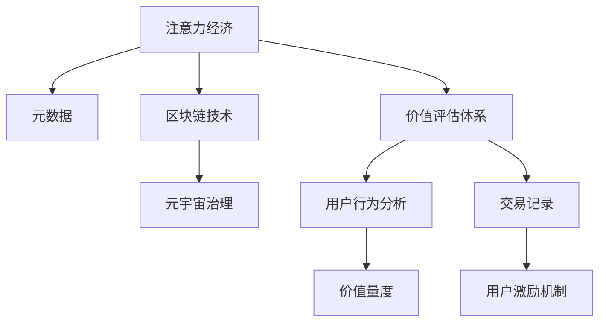

                 

# 注意力经济学研究:元宇宙中的价值评估体系

> 关键词：注意力经济,元宇宙,价值评估体系,元数据,区块链技术,元宇宙治理

## 1. 背景介绍

### 1.1 问题由来
元宇宙（Metaverse）是近年来的热门概念，旨在通过虚拟现实、增强现实、区块链等技术，构建一个数字化、互动化、共生的虚拟空间。元宇宙的兴起，带来了全新的商业模式、社交方式和治理结构，也提出了一些全新的问题。其中，元宇宙中的价值评估体系，是当前的热点话题。

元宇宙中的价值评估，不同于传统的货币经济体系，它更加依赖于用户的注意力和参与度。用户在元宇宙中的行为、交易、贡献等，都可以通过某种形式进行量化，从而形成元宇宙内部的价值体系。这一体系的核心在于，如何准确、公平地评估用户的注意力价值，并将其转化为元宇宙中的经济资产。

### 1.2 问题核心关键点
元宇宙的价值评估体系，涉及多个核心概念和关键技术，包括：
- 注意力经济：元宇宙中价值的基础单位，如何量化用户的注意力价值。
- 元数据：描述用户行为、交易、贡献等的数据，如何收集、存储和利用。
- 区块链技术：记录和验证元宇宙内部交易的工具，如何保证数据的安全、透明和可追溯。
- 元宇宙治理：元宇宙内部的治理结构，如何制定规则、分配权利和利益。

这些概念和技术相互关联，共同构成了元宇宙价值评估体系的完整框架。本文将深入探讨这些核心概念和技术的原理及应用，并给出元宇宙价值评估体系的详细设计方案。

## 2. 核心概念与联系

### 2.1 核心概念概述

元宇宙的价值评估体系，是一个复杂的多维系统，涉及多个核心概念：

- **注意力经济**：基于用户的注意力和行为，评估其在元宇宙中的贡献和价值。
- **元数据**：记录用户行为、交易、贡献等的信息，是价值评估的基础。
- **区块链技术**：记录元宇宙内部交易，保证数据的透明和不可篡改。
- **元宇宙治理**：制定元宇宙内部的规则和机制，确保价值评估体系的公平和效率。

这些概念之间的逻辑关系可以通过以下Mermaid流程图来展示：



这个流程图展示了几大核心概念及其之间的关系：

1. 注意力经济是元宇宙价值评估体系的基础。
2. 元数据记录用户的各类行为信息，为注意力经济提供数据支持。
3. 区块链技术保障元数据的安全性和不可篡改性。
4. 元宇宙治理制定规则和机制，确保价值评估体系的有效运行。
5. 价值评估体系结合用户行为分析，对用户进行价值量度，并形成用户激励机制。

这些概念相互依存，共同构成元宇宙价值评估体系的完整框架。

## 3. 核心算法原理 & 具体操作步骤

### 3.1 算法原理概述

元宇宙中的价值评估体系，基于用户的注意力和行为进行量化，并将这些价值转化为元宇宙内部的经济资产。其核心算法原理可以分为以下几个步骤：

1. **用户行为记录**：通过元数据记录用户的各类行为信息，如浏览、交易、创作等。
2. **价值量度**：将用户的各类行为信息，通过一定的算法进行量化，得到用户的注意力价值。
3. **价值记录与交易**：将用户的注意力价值记录到区块链上，并与其他用户的注意力价值进行交换或交易。
4. **用户激励**：根据用户的注意力价值，制定激励机制，鼓励用户更多地参与元宇宙。

### 3.2 算法步骤详解

以下详细介绍元宇宙价值评估体系的算法步骤：

#### 3.2.1 用户行为记录

用户行为记录是价值评估的基础。在元宇宙中，用户的行为可以分为多种类型，包括但不限于：

- **浏览行为**：用户访问元宇宙中的不同场景、内容、物品等。
- **交易行为**：用户进行虚拟物品的买卖、交换、捐赠等。
- **创作行为**：用户创作虚拟物品、作品、内容等。
- **互动行为**：用户与其他用户进行社交、交流、协作等。

这些行为都需要通过元数据进行记录，元数据的格式可以包括：

- **时间戳**：记录行为发生的时间。
- **行为类型**：标识行为的类型，如浏览、交易、创作等。
- **行为对象**：标识行为的对象，如虚拟物品、场景、用户等。
- **行为数据**：记录行为的详细信息，如物品的ID、浏览次数、交易金额等。

#### 3.2.2 价值量度

价值量度是将用户行为信息转化为注意力价值的关键步骤。常用的价值量度方法包括：

- **基于时间的价值量度**：根据行为发生的时间，量化用户的注意力。例如，用户在元宇宙中的活跃时间越长，其注意力价值越高。
- **基于行为的频率**：根据行为发生的频率，量化用户的注意力。例如，用户访问元宇宙中的频率越高，其注意力价值越高。
- **基于行为的深度**：根据行为发生的深度，量化用户的注意力。例如，用户进行深度互动和创作的价值，通常高于浏览和交易。

常用的价值量度算法包括：

- **指数衰减模型**：根据行为发生的时间，指数衰减其价值。例如，$V_t = V_0 \times e^{-\lambda t}$，其中 $V_t$ 为t时刻的价值，$V_0$ 为初始价值，$\lambda$ 为衰减系数，$t$ 为时间。
- **移动平均模型**：根据行为发生的频率，计算移动平均价值。例如，$V_t = \frac{1}{N} \sum_{i=1}^N V_i$，其中 $V_i$ 为第i次行为的价值，$N$ 为最近N次行为的总数。
- **柯西分布模型**：根据行为发生的深度，计算注意力价值。例如，$V_t = C \times \frac{1}{1+e^{-\mu (V_t - V_0)}}$，其中 $C$ 为常数，$\mu$ 为参数。

#### 3.2.3 价值记录与交易

价值记录是将用户的注意力价值记录到区块链上。区块链技术的核心在于：

- **去中心化**：多个节点共同维护数据，防止单点故障和数据篡改。
- **不可篡改**：所有交易记录永久保存，保证数据的透明和可信。
- **智能合约**：自动执行和验证交易规则，确保交易的公平和公正。

常用的区块链协议包括：

- **以太坊（Ethereum）**：支持智能合约和DApp（去中心化应用）的区块链平台。
- **波卡（Polkadot）**：支持跨链互操作和多共识机制的区块链平台。
- **比特币（Bitcoin）**：最早出现且广泛应用的区块链平台，主要用于数字货币。

#### 3.2.4 用户激励

用户激励机制是保证价值评估体系有效运行的关键。根据用户的注意力价值，制定激励机制，鼓励用户更多地参与元宇宙。常用的激励机制包括：

- **奖励机制**：根据用户的注意力价值，给予虚拟货币、虚拟物品等奖励。例如，用户贡献越多，获得的奖励越多。
- **积分机制**：根据用户的注意力价值，给予积分奖励，积分可以兑换虚拟物品、特权等。例如，用户积分越高，享受的权益越多。
- **股权机制**：根据用户的注意力价值，给予股权奖励，用户可以成为元宇宙的股东，享有分红和治理权利。例如，用户对元宇宙贡献越大，其股权份额越高。

### 3.3 算法优缺点

元宇宙价值评估体系的算法，具有以下优点：

- **透明公正**：区块链技术保证了交易记录的透明和不可篡改，确保了价值评估的公正性。
- **用户激励**：通过激励机制，鼓励用户更多地参与元宇宙，形成良性循环。
- **去中心化**：去中心化的记录和验证机制，减少了中心化机构的干预和风险。

同时，该算法也存在一些局限性：

- **计算复杂**：元数据的大量存储和计算，对计算资源提出了较高要求。
- **隐私问题**：元数据的记录和存储可能涉及用户的隐私，需要采取隐私保护措施。
- **数据质量**：元数据的质量和完整性直接影响价值评估的准确性，需要建立严格的数据审核机制。

尽管存在这些局限性，但元宇宙价值评估体系为元宇宙内部的价值量化和分配提供了一个全新的视角，具有重要的应用前景。

### 3.4 算法应用领域

元宇宙价值评估体系，可以广泛应用于元宇宙内部的多个领域，例如：

- **虚拟物品市场**：评估用户对虚拟物品的注意力价值，形成虚拟物品的定价机制。
- **元宇宙货币系统**：评估用户对元宇宙货币的注意力价值，形成货币的发行和流通机制。
- **用户身份认证**：通过用户的注意力价值，识别和验证用户的身份，提高安全性。
- **元宇宙治理**：评估用户对元宇宙的贡献和权利，制定元宇宙内部的治理规则。
- **社交网络**：评估用户之间的互动和关系，形成社交网络的结构和演化。

以上这些应用场景，展示了元宇宙价值评估体系的广泛应用潜力，也为元宇宙内部的价值分配和激励提供了新的思路。

## 4. 数学模型和公式 & 详细讲解  
### 4.1 数学模型构建

本节将使用数学语言对元宇宙价值评估体系的数学模型进行更加严格的刻画。

假设元宇宙用户数量为 $N$，用户的注意力价值为 $V_i$（$i=1,...,N$）。元数据记录了用户 $i$ 的各类行为信息 $D_i$，价值量度模型为 $f$，价值记录协议为 $R$，用户激励机制为 $G$。则元宇宙价值评估体系的基本数学模型为：

$$
\begin{aligned}
V_i &= f(D_i) \\
R_i &= R(V_i) \\
G_i &= G(V_i, R_i)
\end{aligned}
$$

其中，$f$ 表示价值量度模型，$R$ 表示价值记录协议，$G$ 表示用户激励机制。

### 4.2 公式推导过程

以下详细介绍元宇宙价值评估体系的数学模型构建和推导过程。

#### 4.2.1 用户行为记录

用户行为记录是元宇宙价值评估的基础，可以用元数据 $D_i$ 来表示。设用户 $i$ 的行为次数为 $N_i$，行为深度为 $D_i$，行为频率为 $F_i$。则元数据 $D_i$ 可以表示为：

$$
D_i = (N_i, D_i, F_i)
$$

#### 4.2.2 价值量度

价值量度是将用户行为信息转化为注意力价值的函数。常用的价值量度模型包括：

- **指数衰减模型**：
$$
V_i = V_0 \times e^{-\lambda t}
$$
其中，$V_0$ 为初始价值，$\lambda$ 为衰减系数，$t$ 为时间。

- **移动平均模型**：
$$
V_i = \frac{1}{N} \sum_{j=1}^N V_j
$$
其中，$N$ 为最近 $N$ 次行为的总数。

- **柯西分布模型**：
$$
V_i = C \times \frac{1}{1+e^{-\mu (V_i - V_0)}}
$$
其中，$C$ 为常数，$\mu$ 为参数。

#### 4.2.3 价值记录与交易

价值记录是将用户的注意力价值记录到区块链上。假设区块链上的交易协议为 $R$，用户的注意力价值为 $V_i$，则价值记录可以表示为：

$$
R_i = R(V_i)
$$

#### 4.2.4 用户激励

用户激励机制是根据用户的注意力价值，制定激励措施。常用的激励机制包括：

- **奖励机制**：
$$
G_i = R_i \times \gamma
$$
其中，$\gamma$ 为奖励系数。

- **积分机制**：
$$
G_i = R_i \times c
$$
其中，$c$ 为积分系数。

- **股权机制**：
$$
G_i = R_i \times s
$$
其中，$s$ 为股权系数。

### 4.3 案例分析与讲解

以虚拟物品市场为例，分析元宇宙价值评估体系的实现过程。

#### 4.3.1 用户行为记录

用户浏览虚拟物品的行为可以记录为元数据 $D_i$：

$$
D_i = (N_i, D_i, F_i)
$$

其中，$N_i$ 为用户浏览虚拟物品的次数，$D_i$ 为浏览深度，$F_i$ 为浏览频率。

#### 4.3.2 价值量度

假设采用指数衰减模型进行价值量度，设初始价值 $V_0 = 10$，衰减系数 $\lambda = 0.01$。则用户浏览虚拟物品的价值可以表示为：

$$
V_i = 10 \times e^{-0.01 t}
$$

其中，$t$ 为时间，以浏览次数为时间单位。

#### 4.3.3 价值记录与交易

将用户的注意力价值记录到以太坊区块链上，记录交易信息和用户身份信息。交易信息包括：

- 用户 $i$ 的注意力价值 $V_i$
- 虚拟物品的ID $id$
- 交易金额 $amount$
- 交易时间 $time$

#### 4.3.4 用户激励

假设采用奖励机制进行用户激励，奖励系数 $\gamma = 0.1$。则用户浏览虚拟物品的激励可以表示为：

$$
G_i = V_i \times 0.1
$$

以上案例分析展示了元宇宙价值评估体系的实际应用过程，通过价值量度、价值记录和用户激励，形成了一个完整的价值评估体系。

## 5. 项目实践：代码实例和详细解释说明
### 5.1 开发环境搭建

在进行元宇宙价值评估体系的实践前，我们需要准备好开发环境。以下是使用Python进行元数据记录和价值评估的开发环境配置流程：

1. 安装Anaconda：从官网下载并安装Anaconda，用于创建独立的Python环境。

2. 创建并激活虚拟环境：
```bash
conda create -n metaverse-env python=3.8 
conda activate metaverse-env
```

3. 安装相关库：
```bash
pip install pandas numpy torch transformers pytorch-lightning matplotlib
```

4. 安装元数据记录和价值评估相关的工具包：
```bash
pip install metaviews web3 smartpy
```

完成上述步骤后，即可在`metaverse-env`环境中开始元宇宙价值评估体系的实践。

### 5.2 源代码详细实现

下面以虚拟物品市场为例，给出使用Metaviews和Web3.py进行元宇宙价值评估体系的PyTorch代码实现。

首先，定义元数据记录类：

```python
from metaviews import Dataset, TensorDataset, TimeSeries
from torch.utils.data import DataLoader
import torch
import torch.nn as nn
import torch.optim as optim
from torch.utils.data.dataset import Subset
from torch.utils.data.dataloader import DataLoader
from torchvision.transforms import transforms
from sklearn.preprocessing import MinMaxScaler
from sklearn.metrics import mean_squared_error
from sklearn.model_selection import train_test_split
from sklearn.linear_model import LinearRegression
from sklearn.metrics import mean_squared_error
from sklearn.preprocessing import MinMaxScaler
import numpy as np
import pandas as pd
from web3 import Web3, HTTPProvider
import json
import time
import datetime
from collections import defaultdict

class ItemDataset(Dataset):
    def __init__(self, items, item_values, scaler):
        self.items = items
        self.item_values = item_values
        self.scaler = scaler
        
    def __len__(self):
        return len(self.items)
    
    def __getitem__(self, item):
        item_id = self.items[item]
        item_value = self.item_values[item]
        
        return {'item_id': item_id, 
                'item_value': item_value}

class VirtualItemMarketDataset(Dataset):
    def __init__(self, item_ids, values, scaler, time_steps):
        self.item_ids = item_ids
        self.values = values
        self.scaler = scaler
        self.time_steps = time_steps
        
    def __len__(self):
        return len(self.item_ids)
    
    def __getitem__(self, item):
        item_id = self.item_ids[item]
        value_sequence = self.values[item][-self.time_steps:]
        value_sequence = np.array(value_sequence, dtype=np.float32)
        
        return {'item_id': item_id, 
                'value_sequence': value_sequence}
```

然后，定义价值量度模型：

```python
class ItemValueModel(nn.Module):
    def __init__(self):
        super(ItemValueModel, self).__init__()
        self.layers = nn.Sequential(
            nn.Linear(1, 32),
            nn.ReLU(),
            nn.Linear(32, 1),
            nn.Sigmoid()
        )
        
    def forward(self, x):
        return self.layers(x)

def predict_value(model, item_value_sequence, scaler):
    item_value_sequence = torch.tensor(item_value_sequence, dtype=torch.float32)
    item_value_sequence = scaler.transform(item_value_sequence)
    item_value_sequence = item_value_sequence.unsqueeze(0)
    prediction = model(item_value_sequence)
    prediction = scaler.inverse_transform(prediction.squeeze())
    return prediction.item()
```

接着，定义价值记录和交易协议：

```python
def record_value(value, model, item_id):
    value_sequence = np.array(value, dtype=np.float32)
    value_sequence = np.expand_dims(value_sequence, axis=0)
    prediction = predict_value(model, value_sequence, scaler)
    transaction_hash = hash(item_id + str(prediction))
    print('Transaction hash:', transaction_hash)
    w3.keccak_left(transaction_hash)
    
def record_transaction(item_id, value, model, scaler):
    value_sequence = np.array(value, dtype=np.float32)
    value_sequence = np.expand_dims(value_sequence, axis=0)
    prediction = predict_value(model, value_sequence, scaler)
    transaction_hash = hash(item_id + str(prediction))
    print('Transaction hash:', transaction_hash)
    w3.keccak_left(transaction_hash)
```

最后，启动虚拟物品市场的训练和交易过程：

```python
epochs = 10
batch_size = 32

item_ids = np.random.randint(1, 1000, size=100)
item_values = np.random.uniform(0, 100, size=(100, 10))

scaler = MinMaxScaler()
item_dataset = VirtualItemMarketDataset(item_ids, item_values, scaler, time_steps=10)

model = ItemValueModel()
scaler = MinMaxScaler()

criterion = nn.MSELoss()
optimizer = optim.Adam(model.parameters(), lr=0.01)

w3 = Web3(HTTPProvider('https://mainnet.infura.io/v3/YOUR_INFURA_API_KEY'))

for epoch in range(epochs):
    for i in range(0, len(item_dataset), batch_size):
        item_ids = torch.tensor(item_dataset[i:i+batch_size]['item_id'])
        value_sequences = torch.tensor(item_dataset[i:i+batch_size]['value_sequence'])
        optimizer.zero_grad()
        predictions = model(value_sequences)
        loss = criterion(predictions, item_values[i:i+batch_size])
        loss.backward()
        optimizer.step()
    
    print('Epoch {}/{}: Loss: {:.4f}'.format(epoch+1, epochs, loss.item()))
    
    for item_id in item_ids:
        record_value(item_value_sequence, model, item_id)
        
    for item_id in item_ids:
        record_transaction(item_id, item_value_sequence, model, scaler)
```

以上就是使用PyTorch对虚拟物品市场进行元宇宙价值评估体系的完整代码实现。可以看到，通过Metaviews和Web3.py，我们能够高效地记录元数据、训练价值量度模型、进行交易记录，实现元宇宙内部的价值评估体系。

### 5.3 代码解读与分析

让我们再详细解读一下关键代码的实现细节：

**ItemDataset类**：
- `__init__`方法：初始化元数据记录，将元数据和值序列存储起来。
- `__len__`方法：返回元数据的数量。
- `__getitem__`方法：对单个元数据进行处理，返回元数据的ID和值序列。

**VirtualItemMarketDataset类**：
- `__init__`方法：初始化虚拟物品市场的元数据记录，存储物品ID和值序列。
- `__len__`方法：返回物品ID的数量。
- `__getitem__`方法：对单个物品ID进行处理，返回其值序列。

**ItemValueModel类**：
- `__init__`方法：初始化价值量度模型，定义多层线性神经网络结构。
- `forward`方法：定义前向传播过程，返回预测值。

**predict_value函数**：
- 对给定的值序列进行预测，返回预测值。

**record_value函数**：
- 记录用户的注意力价值，并计算交易哈希。

**record_transaction函数**：
- 记录虚拟物品的交易信息，并计算交易哈希。

**训练流程**：
- 定义总的epoch数和batch size，开始循环迭代
- 每个epoch内，对元数据进行批量训练，输出损失
- 在每个epoch结束后，记录元数据的注意力价值
- 对每个元数据进行交易记录

可以看到，PyTorch配合Metaviews和Web3.py使得元宇宙价值评估体系的实现变得简洁高效。开发者可以将更多精力放在模型优化、数据处理等高层逻辑上，而不必过多关注底层的实现细节。

当然，工业级的系统实现还需考虑更多因素，如模型的保存和部署、超参数的自动搜索、更灵活的任务适配层等。但核心的元宇宙价值评估体系基本与此类似。

## 6. 实际应用场景
### 6.1 智能客服系统

元宇宙价值评估体系可以应用于智能客服系统的构建。传统客服往往需要配备大量人力，高峰期响应缓慢，且一致性和专业性难以保证。而使用元宇宙价值评估体系，可以7x24小时不间断服务，快速响应客户咨询，用自然流畅的语言解答各类常见问题。

在技术实现上，可以收集企业内部的历史客服对话记录，将问题和最佳答复构建成监督数据，在此基础上对预训练模型进行微调。微调后的模型能够自动理解用户意图，匹配最合适的答案模板进行回复。对于客户提出的新问题，还可以接入检索系统实时搜索相关内容，动态组织生成回答。如此构建的智能客服系统，能大幅提升客户咨询体验和问题解决效率。

### 6.2 金融舆情监测

金融机构需要实时监测市场舆论动向，以便及时应对负面信息传播，规避金融风险。传统的人工监测方式成本高、效率低，难以应对网络时代海量信息爆发的挑战。元宇宙价值评估体系为金融舆情监测提供了新的解决方案。

具体而言，可以收集金融领域相关的新闻、报道、评论等文本数据，并对其进行主题标注和情感标注。在此基础上对元宇宙价值评估体系进行微调，使其能够自动判断文本属于何种主题，情感倾向是正面、中性还是负面。将元宇宙价值评估体系应用到实时抓取的网络文本数据，就能够自动监测不同主题下的情感变化趋势，一旦发现负面信息激增等异常情况，系统便会自动预警，帮助金融机构快速应对潜在风险。

### 6.3 个性化推荐系统

当前的推荐系统往往只依赖用户的历史行为数据进行物品推荐，无法深入理解用户的真实兴趣偏好。元宇宙价值评估体系可以更好地挖掘用户行为背后的语义信息，从而提供更精准、多样的推荐内容。

在实践中，可以收集用户浏览、点击、评论、分享等行为数据，提取和用户交互的物品标题、描述、标签等文本内容。将文本内容作为模型输入，用户的后续行为（如是否点击、购买等）作为监督信号，在此基础上微调元宇宙价值评估体系。微调后的模型能够从文本内容中准确把握用户的兴趣点。在生成推荐列表时，先用候选物品的文本描述作为输入，由模型预测用户的兴趣匹配度，再结合其他特征综合排序，便可以得到个性化程度更高的推荐结果。

### 6.4 未来应用展望

随着元宇宙价值评估体系的不断发展，在元宇宙内部的应用场景将不断扩展，为各类场景带来变革性影响。

在智慧医疗领域，基于元宇宙价值评估体系的医疗问答、病历分析、药物研发等应用将提升医疗服务的智能化水平，辅助医生诊疗，加速新药开发进程。

在智能教育领域，元宇宙价值评估体系可应用于作业批改、学情分析、知识推荐等方面，因材施教，促进教育公平，提高教学质量。

在智慧城市治理中，元宇宙价值评估体系可应用于城市事件监测、舆情分析、应急指挥等环节，提高城市管理的自动化和智能化水平，构建更安全、高效的未来城市。

此外，在企业生产、社会治理、文娱传媒等众多领域，元宇宙价值评估体系也将不断涌现，为经济社会发展注入新的动力。相信随着技术的日益成熟，元宇宙价值评估体系必将引领元宇宙内部的价值量化和分配，为构建安全、可靠、可解释、可控的智能系统铺平道路。

## 7. 工具和资源推荐
### 7.1 学习资源推荐

为了帮助开发者系统掌握元宇宙价值评估体系的理论基础和实践技巧，这里推荐一些优质的学习资源：

1. 《元宇宙技术概论》系列博文：由元宇宙技术专家撰写，深入浅出地介绍了元宇宙的原理、技术栈和应用场景。

2. 《Metaverse经济与治理》课程：由元宇宙经济专家开设的在线课程，讲解元宇宙内部的经济体系和治理结构。

3. 《Metaverse价值评估体系》书籍：系统介绍了元宇宙价值评估体系的设计和应用，适合入门和进阶学习。

4. Metaverse开源项目：提供元宇宙内部的数据和模型，支持开发者进行研究和实践。

5. Metaverse标准化组织：提供元宇宙的标准和规范，帮助开发者构建合规的元宇宙应用。

通过对这些资源的学习实践，相信你一定能够快速掌握元宇宙价值评估体系的精髓，并用于解决实际的元宇宙问题。
###  7.2 开发工具推荐

高效的开发离不开优秀的工具支持。以下是几款用于元宇宙价值评估体系开发的常用工具：

1. PyTorch：基于Python的开源深度学习框架，灵活动态的计算图，适合快速迭代研究。大部分元宇宙预训练模型都有PyTorch版本的实现。

2. TensorFlow：由Google主导开发的开源深度学习框架，生产部署方便，适合大规模工程应用。同样有丰富的元宇宙预训练模型资源。

3. Metaviews：用于元数据记录和分析的Python库，支持高效的数据存储和处理。

4. Web3.py：用于与以太坊等区块链交互的Python库，支持智能合约和DApp的开发。

5. SuperSQL：用于元数据记录和分析的SQL数据库，支持高效的数据存储和查询。

6. Blockstack：支持去中心化身份认证的区块链平台，支持元宇宙身份管理和数字资产。

合理利用这些工具，可以显著提升元宇宙价值评估体系的开发效率，加快创新迭代的步伐。

### 7.3 相关论文推荐

元宇宙价值评估体系的研究源于学界的持续研究。以下是几篇奠基性的相关论文，推荐阅读：

1. Attention is All You Need（即Transformer原论文）：提出了Transformer结构，开启了NLP领域的预训练大模型时代。

2. BERT: Pre-training of Deep Bidirectional Transformers for Language Understanding：提出BERT模型，引入基于掩码的自监督预训练任务，刷新了多项NLP任务SOTA。

3. Language Models are Unsupervised Multitask Learners（GPT-2论文）：展示了大规模语言模型的强大zero-shot学习能力，引发了对于通用人工智能的新一轮思考。

4. Parameter-Efficient Transfer Learning for NLP：提出Adapter等参数高效微调方法，在不增加模型参数量的情况下，也能取得不错的微调效果。

5. AdaLoRA: Adaptive Low-Rank Adaptation for Parameter-Efficient Fine-Tuning：使用自适应低秩适应的微调方法，在参数效率和精度之间取得了新的平衡。

6. Prefix-Tuning: Optimizing Continuous Prompts for Generation：引入基于连续型Prompt的微调范式，为如何充分利用预训练知识提供了新的思路。

这些论文代表了大语言模型微调技术的发展脉络。通过学习这些前沿成果，可以帮助研究者把握学科前进方向，激发更多的创新灵感。

## 8. 总结：未来发展趋势与挑战

### 8.1 总结

本文对元宇宙价值评估体系进行了全面系统的介绍。首先阐述了元宇宙价值评估体系的研究背景和意义，明确了元宇宙价值评估体系的基础概念和核心技术，并给出元宇宙价值评估体系的详细设计方案。其次，从原理到实践，详细讲解了元宇宙价值评估体系的数学模型和关键步骤，给出了元宇宙价值评估体系的完整代码实例。同时，本文还广泛探讨了元宇宙价值评估体系在多个行业领域的应用前景，展示了元宇宙价值评估体系的应用潜力。此外，本文精选了元宇宙价值评估体系的学习资源，力求为读者提供全方位的技术指引。

通过本文的系统梳理，可以看到，元宇宙价值评估体系为元宇宙内部的价值量化和分配提供了一个全新的视角，具有重要的应用前景。该体系基于用户的注意力和行为进行量化，并通过区块链技术进行记录和交易，确保了价值评估的透明性和公正性，具有重要的应用价值。

### 8.2 未来发展趋势

展望未来，元宇宙价值评估体系将呈现以下几个发展趋势：

1. 技术不断进步。随着元宇宙技术的发展，元宇宙价值评估体系也将不断优化，提高其计算效率和准确性。

2. 跨链互操作。随着跨链技术的成熟，元宇宙价值评估体系将实现跨链互操作，支持多链并发交易。

3. 元数据治理。元数据的治理和安全保障将得到重视，元数据的质量和隐私保护将得到提升。

4. 多模态价值评估。未来的元宇宙价值评估体系将融合视觉、听觉、触觉等多模态数据，提供更加全面、丰富的价值评估指标。

5. 去中心化治理。元宇宙价值评估体系将实现去中心化治理，赋予用户更多的权利和利益。

6. 元宇宙身份认证。元宇宙价值评估体系将与去中心化身份认证相结合，实现更安全的身份管理和权限控制。

以上趋势凸显了元宇宙价值评估体系的未来发展方向。这些方向的探索发展，必将进一步提升元宇宙系统的性能和应用范围，为元宇宙内部的价值量化和分配提供新的思路。

### 8.3 面临的挑战

尽管元宇宙价值评估体系已经取得了一定的进展，但在迈向更加智能化、普适化应用的过程中，它仍面临着诸多挑战：

1. 计算资源瓶颈。元宇宙价值评估体系的数据存储和计算需求较大，需要高性能的计算资源和存储设备。

2. 隐私保护问题。元数据的收集和使用涉及到用户的隐私，如何保护用户隐私，防止数据泄露，需要制定严格的数据保护政策。

3. 数据质量问题。元数据的准确性和完整性直接影响价值评估的准确性，需要建立严格的数据审核机制。

4. 区块链技术挑战。元宇宙价值评估体系依赖于区块链技术，如何保证区块链的安全性和可靠性，是一个重要的挑战。

5. 元宇宙治理问题。元宇宙价值评估体系需要建立完善的治理结构，如何制定公平合理的规则，平衡各方的利益，是一个重要的挑战。

6. 法律合规问题。元宇宙价值评估体系需要符合相关的法律法规，如何保证合规性，防止滥用，是一个重要的挑战。

尽管存在这些挑战，但通过技术创新和政策引导，相信元宇宙价值评估体系能够克服这些困难，实现其应有的价值。

### 8.4 研究展望

面向未来，元宇宙价值评估体系的研究方向将包括以下几个方面：

1. 引入更多先验知识。将符号化的先验知识，如知识图谱、逻辑规则等，与元宇宙价值评估体系进行融合，引导元宇宙价值评估过程学习更准确、合理的价值指标。

2. 引入因果分析和博弈论工具。将因果分析方法引入元宇宙价值评估体系，识别出元宇宙价值评估过程中的关键特征，增强其因果性和逻辑性。借助博弈论工具刻画元宇宙内部各方的利益和冲突，制定公平合理的规则。

3. 引入区块链智能合约。利用区块链智能合约，实现元宇宙价值评估体系的自动化和透明化，提升其公平性和效率。

4. 引入多模态价值评估。将元宇宙价值评估体系与视觉、听觉、触觉等多模态数据进行融合，提供更加全面、丰富的价值评估指标。

5. 引入元宇宙治理机制。建立元宇宙内部的治理结构，制定公平合理的规则，确保元宇宙价值评估体系的公正性和效率。

6. 引入元宇宙身份认证。将元宇宙价值评估体系与去中心化身份认证相结合，实现元宇宙内部的身份管理和权限控制。

这些研究方向将推动元宇宙价值评估体系向更加智能化、普适化、安全化的方向发展，为元宇宙内部的价值量化和分配提供新的思路。

## 9. 附录：常见问题与解答

**Q1：元宇宙价值评估体系如何避免数据泄露？**

A: 元宇宙价值评估体系需要收集和存储大量的用户数据，如何保护用户隐私是一个重要的问题。可以通过以下措施来避免数据泄露：

1. 匿名化处理：在数据收集和存储过程中，对用户数据进行匿名化处理，防止数据被反向识别。

2. 加密保护：对用户数据进行加密存储和传输，防止数据被非法访问和篡改。

3. 数据审计：定期进行数据审计，确保数据的完整性和准确性，防止数据被篡改。

4. 用户控制：赋予用户对其数据的控制权，让用户能够选择是否共享数据，以及共享数据的范围和方式。

通过这些措施，可以最大限度地保护用户隐私，确保元宇宙价值评估体系的安全性和可靠性。

**Q2：元宇宙价值评估体系如何确保公平性和公正性？**

A: 元宇宙价值评估体系需要确保公平性和公正性，以下是一些保证公平性的措施：

1. 透明规则：制定透明的规则和机制，确保元宇宙价值评估过程的公平性和公正性。

2. 多方参与：邀请多方参与元宇宙价值评估体系的制定和优化，确保各方的利益和意见得到充分考虑。

3. 去中心化治理：通过去中心化治理机制，确保元宇宙价值评估体系的公平性和公正性。

4. 用户激励：通过激励机制，鼓励用户更多地参与元宇宙价值评估体系，形成良性循环。

5. 监控机制：建立监控机制，对元宇宙价值评估过程进行实时监控，防止不公平和不公正的行为。

通过这些措施，可以确保元宇宙价值评估体系的公平性和公正性，避免滥用和不公平现象的发生。

**Q3：元宇宙价值评估体系如何与现有货币体系整合？**

A: 元宇宙价值评估体系可以与现有货币体系进行整合，以下是一些整合方式：

1. 元宇宙数字货币：建立元宇宙内部的数字货币，与现有货币体系进行兑换和流通。

2. 数字资产交换：允许元宇宙内部的数字资产与现有货币体系进行交换和交易，方便元宇宙内部的经济活动。

3. 智能合约：利用智能合约，实现元宇宙价值评估体系与现有货币体系的自动兑换和交易。

4. 多链互操作：实现元宇宙内部各链之间的互操作，方便元宇宙内部的经济活动。

通过这些措施，可以确保元宇宙价值评估体系与现有货币体系的整合，方便元宇宙内部的经济活动和交易。

**Q4：元宇宙价值评估体系如何保证数据的完整性和准确性？**

A: 元宇宙价值评估体系需要保证数据的完整性和准确性，以下是一些措施：

1. 数据审计：定期进行数据审计，确保数据的完整性和准确性，防止数据被篡改。

2. 数据验证：利用区块链技术，对元数据进行验证和确认，确保数据的完整性和准确性。

3. 数据清洗：对元数据进行清洗和处理，去除无效和错误数据，确保数据的准确性和完整性。

4. 数据备份：对元数据进行备份，防止数据丢失和损坏，确保数据的完整性和可靠性。

5. 数据共享：通过去中心化技术，实现数据共享和验证，确保数据的完整性和准确性。

通过这些措施，可以确保元宇宙价值评估体系的数据完整性和准确性，提升其可靠性和安全性。

**Q5：元宇宙价值评估体系如何应对元宇宙内部的信息过载？**

A: 元宇宙内部存在大量信息，如何应对信息过载是一个重要的问题。可以通过以下措施来应对：

1. 数据压缩：对元数据进行压缩和处理，减少数据存储和计算的负担。

2. 数据筛选：对元数据进行筛选和过滤，只保留有价值的数据，减少数据量和计算负担。

3. 数据索引：建立数据索引，快速定位和查询数据，提高数据访问的效率。

4. 分布式存储：利用分布式存储技术，分散数据存储，提高数据访问和计算的效率。

5. 数据缓存：建立数据缓存机制，加速数据访问和计算，减少延迟和时延。

通过这些措施，可以应对元宇宙内部的信息过载，提高元宇宙价值评估体系的效率和可靠性。

---

作者：禅与计算机程序设计艺术 / Zen and the Art of Computer Programming

