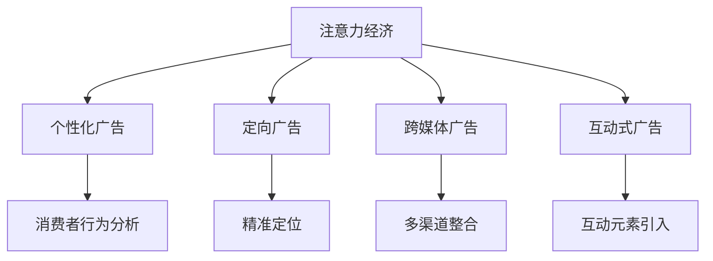

                 

# 注意力经济对传统商业广告的改造

## 1. 背景介绍

在信息爆炸的时代，传统商业广告面临着前所未有的挑战。随着社交媒体和搜索引擎的普及，消费者不再被动接受广告信息，而是主动筛选内容，对广告信息的态度从被动接受转向主动选择。在这样的背景下，广告商和营销人员需要重新审视广告策略，优化广告内容，提升广告的吸引力和转化率。

在这一背景下，注意力经济（Economy of Attention）成为了广告行业的重要课题。注意力经济强调在信息过载的环境下，如何吸引和维持消费者的注意力，并转化为实际购买行为。通过精准的定向广告和个性化的内容推荐，注意力经济不仅能提升广告效果，还能降低广告成本，实现广告投放和消费者关注的平衡。

### 1.1 注意力经济概述

注意力经济是一种新的商业模式，其核心是通过吸引和维持消费者的注意力来获取经济利益。在数字时代，注意力成为稀缺资源，广告商和营销人员需要通过精准的定位和个性化的内容，将消费者的注意力转化为实际购买行为。注意力经济要求广告商从传统的“投放多少”转变为“吸引多少”，从“覆盖多少”转变为“转化多少”。

注意力经济对传统商业广告的改造主要体现在以下几个方面：

- **个性化广告**：根据消费者的行为数据和偏好，推送个性化的广告内容，提高广告的点击率和转化率。
- **定向广告**：通过精准的定位技术，将广告投放给最有可能感兴趣的目标受众，减少无效曝光。
- **互动式广告**：通过增加互动元素，如问卷调查、互动游戏等，提高用户参与度和广告效果。
- **跨媒体广告**：将广告内容整合到多个平台上，实现多渠道、跨媒体的协同广告。

### 1.2 注意力经济的核心问题

注意力经济的核心问题是如何在信息过载的环境中，有效吸引和维持消费者的注意力。随着社交媒体和搜索引擎的普及，消费者接触的信息量呈爆炸式增长，如何在海量的信息中找到符合自己兴趣和需求的内容，成为消费者关注的焦点。广告商和营销人员需要借助先进的分析工具和算法，实现广告内容的精准投放和个性化推荐。

## 2. 核心概念与联系

### 2.1 核心概念概述

为了更好地理解注意力经济对传统商业广告的改造，本文将介绍几个核心概念及其之间的联系：

- **注意力经济**：通过吸引和维持消费者的注意力，获取经济利益的商业模式。
- **个性化广告**：根据消费者的行为数据和偏好，推送个性化的广告内容。
- **定向广告**：通过精准的定位技术，将广告投放给最有可能感兴趣的目标受众。
- **跨媒体广告**：将广告内容整合到多个平台上，实现多渠道、跨媒体的协同广告。
- **互动式广告**：通过增加互动元素，提高用户参与度和广告效果。

### 2.2 核心概念原理和架构的 Mermaid 流程图



这个流程图展示了注意力经济的各个组成部分及其相互关系：

- 个性化广告和定向广告是注意力经济的核心部分，通过精准定位和个性化内容，吸引并维持消费者的注意力。
- 跨媒体广告和互动式广告是注意力经济的技术手段，通过多渠道整合和互动元素，提高广告的传播效果和用户参与度。
- 消费者行为分析是注意力经济的支撑技术，通过分析消费者数据，精准投放广告，提升广告效果。

## 3. 核心算法原理 & 具体操作步骤

### 3.1 算法原理概述

注意力经济的核心在于吸引和维持消费者的注意力，并将其转化为实际购买行为。为此，广告商和营销人员需要借助先进的算法和工具，实现广告内容的精准投放和个性化推荐。

注意力经济的主要算法原理包括：

- **消费者行为分析**：通过分析消费者的行为数据和偏好，预测其可能的购买行为。
- **定向广告**：根据消费者行为分析结果，将广告精准投放给最有可能感兴趣的目标受众。
- **个性化广告**：根据消费者的行为数据和偏好，推送个性化的广告内容，提高广告的点击率和转化率。
- **跨媒体广告**：将广告内容整合到多个平台上，实现多渠道、跨媒体的协同广告。
- **互动式广告**：通过增加互动元素，提高用户参与度和广告效果。

### 3.2 算法步骤详解

注意力经济的具体操作步骤如下：

**Step 1: 数据收集与分析**

广告商和营销人员需要收集消费者的行为数据，如浏览历史、购买记录、搜索关键词等。通过分析这些数据，可以了解消费者的兴趣偏好、购买意愿和行为模式。

**Step 2: 定向广告投放**

根据消费者行为分析结果，将广告精准投放给最有可能感兴趣的目标受众。可以通过以下步骤实现：

1. 构建用户画像：根据消费者的行为数据和偏好，构建详细的用户画像。
2. 选择目标受众：根据用户画像，选择最有可能感兴趣的目标受众。
3. 定向投放：将广告内容精准投放给目标受众，实现高效曝光。

**Step 3: 个性化广告内容推送**

根据消费者的行为数据和偏好，推送个性化的广告内容，提高广告的点击率和转化率。可以通过以下步骤实现：

1. 分析消费者偏好：根据消费者的行为数据和偏好，分析其可能感兴趣的广告内容。
2. 生成个性化广告：根据分析结果，生成个性化的广告内容，确保内容符合消费者兴趣。
3. 推送广告内容：将个性化广告推送给消费者，提高广告点击率。

**Step 4: 跨媒体广告整合**

将广告内容整合到多个平台上，实现多渠道、跨媒体的协同广告。可以通过以下步骤实现：

1. 选择媒体平台：根据目标受众的媒体使用习惯，选择适合的广告平台。
2. 整合广告内容：将广告内容整合到多个平台上，实现跨媒体传播。
3. 协同广告投放：在不同平台上协同投放广告，提高广告传播效果。

**Step 5: 互动式广告优化**

通过增加互动元素，提高用户参与度和广告效果。可以通过以下步骤实现：

1. 增加互动元素：在广告内容中增加互动元素，如问卷调查、互动游戏等。
2. 优化用户参与：通过互动元素优化用户参与度，提高广告效果。
3. 反馈优化：根据用户反馈，不断优化广告内容和互动元素，提升广告效果。

### 3.3 算法优缺点

注意力经济的算法具有以下优点：

- **精准投放**：通过精准定位和个性化内容，将广告精准投放给最有可能感兴趣的目标受众，提高广告效果。
- **降低成本**：通过定向广告和个性化广告，减少无效曝光，降低广告成本。
- **提升转化率**：通过个性化内容和互动元素，提高用户参与度和广告效果，提升转化率。

同时，注意力经济的算法也存在以下缺点：

- **数据隐私问题**：收集和分析消费者行为数据，可能涉及隐私问题。
- **技术复杂度**：需要借助先进的分析工具和算法，对技术要求较高。
- **成本较高**：精准投放和个性化内容生成，需要较高的技术和人力成本。

### 3.4 算法应用领域

注意力经济的应用领域非常广泛，涵盖广告、营销、零售、娱乐等多个行业。以下是几个典型的应用场景：

- **电子商务**：通过个性化广告和定向广告，提高消费者的购买转化率。
- **金融服务**：通过精准投放和个性化推荐，提升客户满意度和忠诚度。
- **娱乐传媒**：通过跨媒体广告和互动式广告，提升用户参与度和品牌曝光。
- **旅游行业**：通过定向广告和跨媒体广告，吸引和维护消费者注意力，提升旅游产品销售。

## 4. 数学模型和公式 & 详细讲解 & 举例说明

### 4.1 数学模型构建

注意力经济的核心模型可以表示为：

$$
\text{Attention} = \text{Consumer Behavior Analysis} \times \text{Precision Advertising} \times \text{Personalized Advertisement} \times \text{Cross-Media Advertising} \times \text{Interactive Advertising}
$$

其中，

- **Consumer Behavior Analysis**：表示消费者行为分析模型。
- **Precision Advertising**：表示定向广告模型。
- **Personalized Advertisement**：表示个性化广告模型。
- **Cross-Media Advertising**：表示跨媒体广告模型。
- **Interactive Advertising**：表示互动式广告模型。

### 4.2 公式推导过程

以个性化广告模型为例，其核心公式为：

$$
\text{AdContent} = \text{Consumer Preferences} \times \text{Content Library}
$$

其中，

- **Consumer Preferences**：表示消费者的行为数据和偏好。
- **Content Library**：表示广告内容库。

通过分析消费者偏好，从内容库中生成符合消费者兴趣的广告内容。

### 4.3 案例分析与讲解

假设某电商平台需要推广一款新产品，可以通过以下步骤实现个性化广告投放：

1. 分析消费者行为数据：收集消费者的浏览历史、购买记录、搜索关键词等行为数据。
2. 构建用户画像：根据行为数据，构建详细的用户画像，包括年龄、性别、兴趣偏好等。
3. 生成个性化广告：从广告内容库中选择符合用户画像的广告内容，并进行个性化定制。
4. 精准投放广告：根据用户画像，选择最有可能感兴趣的目标受众，精准投放广告。
5. 监测和优化广告效果：通过监测广告点击率和转化率，不断优化广告内容，提升广告效果。

## 5. 项目实践：代码实例和详细解释说明

### 5.1 开发环境搭建

在进行注意力经济的应用实践前，需要先搭建好开发环境。以下是使用Python进行注意力经济开发的开发环境配置流程：

1. 安装Anaconda：从官网下载并安装Anaconda，用于创建独立的Python环境。
```bash
conda create -n attention-env python=3.8 
conda activate attention-env
```

2. 安装PyTorch：根据CUDA版本，从官网获取对应的安装命令。例如：
```bash
conda install pytorch torchvision torchaudio cudatoolkit=11.1 -c pytorch -c conda-forge
```

3. 安装相关库：
```bash
pip install pandas numpy scikit-learn joblib pyarrow
```

4. 安装Google Analytics和AdMob等广告平台API：
```bash
pip install google-analytics-python
pip install admob-python
```

完成上述步骤后，即可在`attention-env`环境中开始注意力经济的应用实践。

### 5.2 源代码详细实现

下面是使用Python实现个性化广告投放的示例代码：

```python
import pandas as pd
from google_analytics_apiv4 import GoogleAnalyticsServiceAccount
from admob_apiv3 import AdMobServiceAccount

# 1. 分析消费者行为数据
data = pd.read_csv('consumer_data.csv')
# 2. 构建用户画像
user_profiles = data.groupby(['age', 'gender', 'interest']).count()

# 3. 生成个性化广告
content_library = pd.read_csv('content_library.csv')
personalized_ads = []
for user_profile in user_profiles.index:
    query = 'age=={} and gender=={} and interest=={}'.format(user_profile[0], user_profile[1], user_profile[2])
    selected_content = content_library.query(query)
    ad_content = selected_content['content'].tolist()
    personalized_ads.append((user_profile, ad_content))

# 4. 精准投放广告
gana = GoogleAnalyticsServiceAccount('credentials.json')
gana.configure()

admob = AdMobServiceAccount('credentials.json')
admob.configure()

for user_profile, ad_content in personalized_ads:
    ad = AdMobServiceAccount.create_ad(user_profile[0], user_profile[1], ad_content)
    ad.set的广告组位
    ad.set的广告位
    ad.set广告的日期范围
    ad.set广告的标题
    ad.set广告的描述
    ad.set广告的类别
    ad.set广告的链接
    ad.set广告的ID
    ad.set广告的价格
    ad.set广告的竞争策略
    ad.set广告的预算

    admob.publish(ad)

# 5. 监测和优化广告效果
# 通过Google Analytics和AdMob等平台，监测广告点击率和转化率，不断优化广告内容
```

### 5.3 代码解读与分析

让我们再详细解读一下关键代码的实现细节：

**Google Analytics和AdMob API**：
- 用于收集和分析消费者行为数据，构建用户画像，精准投放广告。
- 通过Google Analytics和AdMob等平台，监测广告点击率和转化率，优化广告内容。

**数据处理**：
- 使用pandas库处理消费者行为数据和广告内容库。
- 构建用户画像，通过groupby函数对行为数据进行分组统计。
- 生成个性化广告，通过query函数在内容库中筛选符合用户画像的广告内容。

**广告投放**：
- 使用AdMobServiceAccount库创建广告位，设置广告参数，发布广告。
- 通过Google Analytics和AdMob等平台，监测广告效果，优化广告投放策略。

### 5.4 运行结果展示

通过上述代码实现，可以完成消费者行为数据处理、个性化广告生成和精准投放等步骤。实际应用中，通过Google Analytics和AdMob等平台，可以实时监测广告效果，不断优化广告内容和投放策略，实现高效的个性化广告投放。

## 6. 实际应用场景

### 6.1 电子商务

电子商务平台可以通过个性化广告和定向广告，提升消费者的购买转化率。例如，亚马逊通过推荐系统，根据用户的浏览和购买历史，推荐个性化的产品广告，大幅提升销售额。

### 6.2 金融服务

金融机构可以通过精准投放和个性化推荐，提升客户满意度和忠诚度。例如，银行通过分析客户的交易行为，推送个性化的理财产品广告，吸引客户购买。

### 6.3 娱乐传媒

娱乐传媒行业可以通过跨媒体广告和互动式广告，提升用户参与度和品牌曝光。例如，Netflix通过分析用户的观看历史，推送个性化的影视剧广告，提高用户粘性和付费率。

### 6.4 旅游行业

旅游行业可以通过定向广告和跨媒体广告，吸引和维护消费者注意力，提升旅游产品销售。例如，携程通过分析用户的搜索和预订历史，推送个性化的旅游广告，吸引客户预订。

## 7. 工具和资源推荐

### 7.1 学习资源推荐

为了帮助开发者系统掌握注意力经济的应用技术，这里推荐一些优质的学习资源：

1. 《Python数据科学手册》：由知名数据科学家Jake VanderPlas撰写，全面介绍了数据科学和机器学习的基础知识和实践技巧。
2. 《注意力经济学：市场如何分配我们的注意力》：由经济学家H. G. Wells撰写，系统阐述了注意力经济的基本原理和应用案例。
3. 《广告心理与消费者行为》：由心理学家Jerry Vogelsang撰写，探讨了广告心理与消费者行为的关系。
4. 《Google Analytics官方文档》：谷歌官方提供的Google Analytics使用指南，详细介绍了如何使用Google Analytics进行消费者行为分析。
5. 《AdMob官方文档》：谷歌官方提供的AdMob使用指南，详细介绍了如何使用AdMob进行广告投放和优化。

通过对这些资源的学习实践，相信你一定能够快速掌握注意力经济的应用技术，并用于解决实际的广告问题。

### 7.2 开发工具推荐

高效的开发离不开优秀的工具支持。以下是几款用于注意力经济开发的常用工具：

1. Python：Python是一种高层次、解释型的编程语言，拥有丰富的第三方库和框架，适合进行数据分析和机器学习。
2. Pandas：Pandas是Python中用于数据处理和分析的重要库，提供了丰富的数据处理和统计分析功能。
3. Google Analytics：谷歌提供的免费网站分析工具，可以实时监测网站流量和用户行为，分析消费者数据。
4. AdMob：谷歌提供的广告投放平台，支持多种广告格式和投放方式，实现精准广告投放。
5. Jupyter Notebook：开源的交互式计算平台，支持Python等多种编程语言，适合进行数据分析和机器学习实验。

合理利用这些工具，可以显著提升注意力经济的应用开发效率，加快创新迭代的步伐。

### 7.3 相关论文推荐

注意力经济的应用涉及数据科学、广告学、经济学等多个学科，以下几篇论文代表了大规模数据分析和广告技术的研究进展，推荐阅读：

1. "Modeling the Supply and Demand of Internet注意力"：论文通过构建注意力市场模型，分析互联网注意力资源的供需关系，探讨了注意力经济的基本原理。
2. "Precision Marketing with Attention: A Survey"：论文综述了注意力经济在精准营销中的应用，包括广告投放、个性化推荐等方面。
3. "Attention Is All You Need"：论文介绍了Transformer模型，提出了自注意力机制，为广告推荐系统提供了新的技术手段。
4. "Adaptive Learning of Contextual Interactions: Efficient Learning of Ad Models"：论文提出了一种自适应学习算法，用于动态调整广告模型参数，优化广告投放效果。
5. "Attention-based Recommender Systems"：论文综述了基于注意力机制的推荐系统，探讨了其应用原理和实现方法。

这些论文代表了大规模数据分析和广告技术的研究进展，通过学习这些前沿成果，可以帮助研究者把握学科前进方向，激发更多的创新灵感。

## 8. 总结：未来发展趋势与挑战

### 8.1 研究成果总结

本文对注意力经济的应用技术进行了系统介绍，涵盖数据收集与分析、定向广告投放、个性化广告内容推送、跨媒体广告整合和互动式广告优化等多个方面。通过详细讲解注意力经济的算法原理和操作步骤，提供了完整的代码实例和应用案例，帮助读者全面掌握注意力经济的应用技术。

### 8.2 未来发展趋势

未来，注意力经济的发展将呈现以下几个趋势：

1. **数据驱动**：随着数据采集和分析技术的进步，注意力经济将越来越依赖于数据的驱动，通过精准分析和预测，实现个性化广告和精准投放。
2. **跨平台整合**：未来广告将实现跨平台整合，通过统一的广告投放平台，提升广告效果和用户参与度。
3. **智能算法**：通过引入先进的机器学习算法，实现广告内容的自动生成和优化，提升广告投放的效率和效果。
4. **用户参与度优化**：通过增加互动元素和用户反馈，优化用户参与度，提高广告效果。
5. **跨媒体广告**：通过跨媒体广告，实现多渠道、跨媒体的协同广告，提升广告传播效果。

### 8.3 面临的挑战

尽管注意力经济已经取得了显著成效，但在发展过程中也面临着诸多挑战：

1. **数据隐私问题**：消费者行为数据的收集和分析可能涉及隐私问题，如何保护消费者隐私，成为注意力经济的重要课题。
2. **技术复杂度**：实现注意力经济需要先进的分析工具和算法，对技术要求较高。
3. **成本较高**：精准投放和个性化内容生成，需要较高的技术和人力成本。
4. **广告效果评估**：如何准确评估广告效果，不断优化广告投放策略，是广告商和营销人员面临的挑战。

### 8.4 研究展望

为了应对这些挑战，未来的研究需要在以下几个方面寻求新的突破：

1. **数据隐私保护**：引入隐私保护技术，确保消费者行为数据的安全性。
2. **自动化广告投放**：开发自动化广告投放系统，减少人力成本。
3. **多模态广告**：将广告内容扩展到图像、视频等多模态数据，提升广告效果。
4. **跨媒体广告**：通过跨媒体广告，实现多渠道、跨媒体的协同广告。
5. **用户参与度优化**：通过增加互动元素和用户反馈，优化用户参与度。

这些研究方向的探索发展，必将引领注意力经济技术迈向更高的台阶，为广告商和营销人员提供更高效、智能的广告投放解决方案。

## 9. 附录：常见问题与解答

**Q1: 如何收集消费者行为数据？**

A: 可以通过网站访问日志、交易记录、搜索关键词等多种方式收集消费者行为数据。例如，通过网站分析工具如Google Analytics，可以实时监测网站流量和用户行为，分析消费者数据。

**Q2: 如何构建用户画像？**

A: 通过分析消费者的行为数据和偏好，构建详细的用户画像。例如，可以使用pandas库进行数据分析和统计，构建用户画像，并存储在数据库中。

**Q3: 如何优化广告效果？**

A: 通过监测广告点击率和转化率，不断优化广告内容。例如，可以使用Google Analytics和AdMob等平台，实时监测广告效果，并根据用户反馈不断优化广告内容。

**Q4: 如何降低广告成本？**

A: 通过定向广告和个性化广告，减少无效曝光，降低广告成本。例如，可以通过分析消费者行为数据，精准定位目标受众，实现高效曝光。

**Q5: 如何保护消费者隐私？**

A: 在收集和分析消费者行为数据时，需要严格遵守相关法律法规，确保数据的安全性和隐私性。例如，可以通过数据加密、匿名化处理等技术手段，保护消费者隐私。

总之，注意力经济是未来广告行业的重要发展方向，通过精准投放和个性化内容，提升广告效果，降低广告成本，满足消费者的个性化需求。未来，随着技术的不断进步，注意力经济将进一步拓展其应用范围，为广告商和营销人员提供更高效、智能的广告投放解决方案。

---

作者：禅与计算机程序设计艺术 / Zen and the Art of Computer Programming

