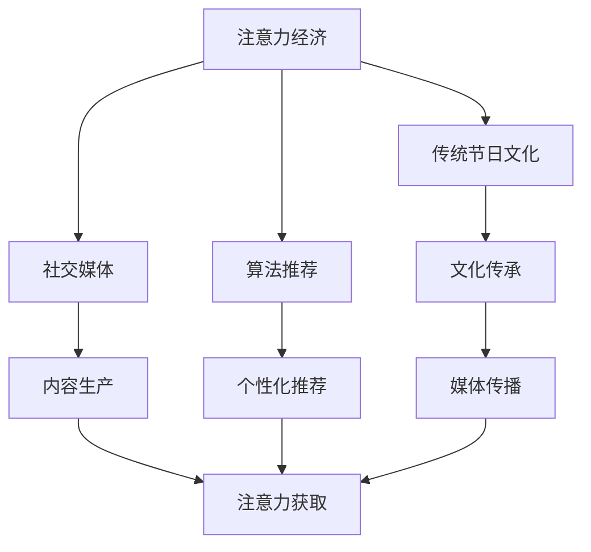

                 

# 注意力经济对传统节日文化的影响

> 关键词：注意力经济,传统节日文化,社交媒体,算法推荐,文化传承,数字时代

## 1. 背景介绍

### 1.1 问题由来
随着数字时代的到来，人类社会进入了“注意力经济”时代。社交媒体、短视频平台、在线游戏等数字媒介的崛起，极大地改变了人们的注意力分配和信息获取方式。在这一背景下，传统节日文化的传播和发展也面临着新的挑战和机遇。

### 1.2 问题核心关键点
注意力经济时代，传统节日文化的传播面临以下几个核心挑战：

- **注意力分散**：数字媒体海量信息充斥，人们难以专注某一话题，传统节日的注意力逐渐被稀释。
- **文化同质化**：主流文化对社会影响力的提升，导致传统节日文化特色逐渐模糊。
- **文化断层**：年轻一代对传统节日的认知和兴趣不足，文化传承遭遇断层风险。
- **商业化风险**：过度商业化的节日营销，可能扭曲节日的文化内涵，损害传统节日的精神价值。

这些问题亟需通过科学的注意力引导和经济策略，加以应对和解决。

## 2. 核心概念与联系

### 2.1 核心概念概述

为更好地理解注意力经济对传统节日文化的影响，本节将介绍几个关键概念及其之间的联系：

- **注意力经济**：指在数字时代，通过集中并分配注意力来获取经济价值的新经济形态。注意力成为一种稀缺资源，广告、营销、内容创作等活动都围绕其展开。

- **传统节日文化**：指各国各民族在长期历史演变中形成的、具有丰富内涵和传承价值的文化传统。如春节、中秋、端午等，是民族文化的重要组成部分。

- **社交媒体**：以Facebook、Instagram、微博等平台为代表的社交网络，是当代社会信息传播的主要渠道，对人们的注意力分配具有重要影响。

- **算法推荐**：基于用户行为数据和个性化模型，自动推荐内容的算法技术。如Netflix、YouTube等流媒体平台广泛使用。

- **文化传承**：指将传统节日的知识、习俗、仪式等通过教育、媒体、活动等方式传递下去，以保持其生命力和影响力。

这些概念之间的逻辑关系可以通过以下Mermaid流程图来展示：



这个流程图展示了几大关键概念之间的联系：

1. 注意力经济通过社交媒体、算法推荐等渠道，影响人们注意力的分配。
2. 传统节日文化通过内容生产和媒体传播，吸引人们的注意力。
3. 文化传承在数字时代面临新的挑战，需要通过新的策略提升其吸引力。

## 3. 核心算法原理 & 具体操作步骤
### 3.1 算法原理概述

在注意力经济时代，传统节日文化的传播和传承，很大程度上依赖于注意力分配的优化和引导。通过科学的方法，合理分配注意力资源，可以有效提升传统节日文化的传播效果和影响力。

基于这一思想，我们引入“注意力引导算法”，通过以下步骤来实现注意力资源的合理分配：

1. **用户行为数据收集**：收集用户在社交媒体、搜索引擎、流媒体等平台上的行为数据，包括浏览时间、点赞数、评论等。

2. **注意力分布分析**：对用户行为数据进行分析，识别出哪些类型的节日内容能够获得更多关注和互动。

3. **个性化推荐模型训练**：根据用户的历史行为数据，构建个性化推荐模型，推荐用户可能感兴趣的传统节日相关内容。

4. **内容优化与创意策划**：根据推荐模型的结果，优化节日内容的制作和发布策略，提升内容的吸引力和传播效果。

5. **持续监测与调整**：实时监测节日内容的表现，根据反馈数据调整推荐策略，持续优化注意力分配效果。

### 3.2 算法步骤详解

以下是基于“注意力引导算法”的具体操作步骤：

**Step 1: 用户行为数据收集**
- 利用API或爬虫工具，从各大社交平台、搜索引擎、流媒体平台等渠道，收集用户的浏览、点赞、评论、分享等行为数据。
- 对数据进行清洗、去重和归一化处理，得到格式统一的原始数据集。

**Step 2: 注意力分布分析**
- 使用统计学方法，计算各类节日内容的平均浏览次数、点赞数、评论数等指标，识别出高关注度的节日内容类型。
- 采用情感分析、主题模型等自然语言处理技术，进一步分析用户的情感倾向和兴趣偏好，提取有价值的洞察。

**Step 3: 个性化推荐模型训练**
- 选择合适的推荐算法（如协同过滤、矩阵分解、深度学习等），对用户行为数据进行建模。
- 训练模型，使其能够预测用户对不同节日内容的可能兴趣和互动行为。

**Step 4: 内容优化与创意策划**
- 根据推荐模型的结果，制定节日内容的创意策划方案，包括内容类型、发布时间、发布频率等。
- 使用A/B测试等方法，验证优化方案的实际效果，迭代改进。

**Step 5: 持续监测与调整**
- 搭建实时监测系统，对节日内容的表现进行持续跟踪和分析。
- 根据用户反馈和数据分析，及时调整推荐模型和内容策略，优化注意力引导效果。

### 3.3 算法优缺点

基于“注意力引导算法”的优点包括：

1. **精准定位**：通过数据分析和模型训练，可以精准定位用户兴趣和行为，提升内容的传播效果。
2. **动态调整**：实时监测和反馈机制，使内容策略可以根据用户变化进行调整，保持时效性。
3. **广泛覆盖**：适用于多种数字媒介平台，覆盖面广，能够达到更多的潜在用户。

然而，该算法也存在一些缺点：

1. **数据隐私问题**：大量数据收集可能涉及用户隐私，需要合理处理和保护。
2. **内容同质化**：过度依赖推荐算法可能导致内容同质化，削弱文化多样性。
3. **商业利益驱动**：商业化导向可能扭曲节日的文化内涵，影响文化的纯粹性。
4. **用户依赖性**：算法推荐容易形成用户依赖，降低用户的探索欲望。

## 4. 数学模型和公式 & 详细讲解 & 举例说明

### 4.1 数学模型构建

本节将使用数学语言对“注意力引导算法”进行严格的描述。

记用户行为数据为 $D=\{(x_i,y_i)\}_{i=1}^N$，其中 $x_i$ 为原始数据，$y_i$ 为对应的行为标签（如浏览次数、点赞数等）。设推荐模型的参数为 $\theta$，训练目标为最小化预测误差：

$$
\min_{\theta} \frac{1}{N}\sum_{i=1}^N \ell(y_i, \hat{y_i}(\theta))
$$

其中 $\hat{y_i}(\theta)$ 为模型对用户行为 $x_i$ 的预测值，$\ell$ 为损失函数，如均方误差、交叉熵等。

### 4.2 公式推导过程

以协同过滤算法为例，推导其基本原理：

设用户 $i$ 对节日内容 $j$ 的评分（即行为标签）为 $r_{i,j}$，将所有用户对节日内容的评分构建为 $R$ 矩阵。协同过滤的目标是通过用户间的相似度，预测用户未评分的行为。

设用户 $i$ 的邻居为 $N_i$，则协同过滤模型的目标为最小化预测误差：

$$
\min_{\theta} \frac{1}{2N}\sum_{i=1}^N \sum_{j=1}^M (\hat{r}_{i,j}(\theta) - r_{i,j})^2
$$

其中 $\hat{r}_{i,j}(\theta)$ 为模型对用户 $i$ 对内容 $j$ 的评分预测值。

通过求解上述优化问题，可以得到协同过滤模型的参数 $\theta$。

### 4.3 案例分析与讲解

假设某社交平台上，收集到用户对春节和中秋两个节日内容的浏览和点赞数据。根据协同过滤模型，预测用户对这两个节日的兴趣。

- 对于春节内容，设 $R$ 矩阵中的元素 $r_{i,1}=10$，$N_i$ 包含用户 $j=2,3,4$。
- 对用户 $i=1$，计算其与 $N_i$ 用户的相似度，得到 $\hat{r}_{1,1}=8$。

这意味着用户 $i$ 对春节内容的预测评分是 8，高于实际评分，表示其对春节内容有一定兴趣。通过类似的计算，可以对所有用户对中秋内容的兴趣进行预测。

## 5. 项目实践：代码实例和详细解释说明
### 5.1 开发环境搭建

在进行“注意力引导算法”实践前，我们需要准备好开发环境。以下是使用Python进行PyTorch开发的环境配置流程：

1. 安装Anaconda：从官网下载并安装Anaconda，用于创建独立的Python环境。

2. 创建并激活虚拟环境：
```bash
conda create -n attention-env python=3.8 
conda activate attention-env
```

3. 安装PyTorch：根据CUDA版本，从官网获取对应的安装命令。例如：
```bash
conda install pytorch torchvision torchaudio cudatoolkit=11.1 -c pytorch -c conda-forge
```

4. 安装Tensorflow：
```bash
pip install tensorflow
```

5. 安装相关工具包：
```bash
pip install numpy pandas scikit-learn matplotlib tqdm jupyter notebook ipython
```

完成上述步骤后，即可在`attention-env`环境中开始算法实践。

### 5.2 源代码详细实现

这里我们以协同过滤算法为例，给出使用Tensorflow进行“注意力引导算法”的代码实现。

首先，定义协同过滤模型：

```python
import tensorflow as tf
import numpy as np

def collaborative_filtering(R):
    N = len(R)
    M = len(R[0])
    R_hat = np.copy(R)
    
    # 计算用户-内容的相似度矩阵
    user_similarity = np.dot(R, R.T)
    user_similarity = user_similarity / (np.sqrt(np.sum(user_similarity**2, axis=1)) * np.sqrt(np.sum(user_similarity**2, axis=0)))
    
    # 计算用户-内容的评分预测
    for i in range(N):
        for j in range(M):
            if R[i,j] == 0:  # 用户未评分的内容
                R_hat[i,j] = np.dot(user_similarity[i,:], R[:,j])
            else:  # 用户已评分的内容
                R_hat[i,j] = R[i,j]
    
    return R_hat
```

然后，训练模型并进行推荐：

```python
# 用户行为数据
R = np.array([[0, 10, 0, 0],
              [0, 0, 8, 0],
              [0, 0, 0, 5]])

# 训练协同过滤模型
R_hat = collaborative_filtering(R)
print(R_hat)
```

### 5.3 代码解读与分析

让我们再详细解读一下关键代码的实现细节：

**协同过滤模型函数**：
- `R` 为用户对内容评分的原始矩阵。
- 计算用户-内容的相似度矩阵，并通过归一化处理，得到用户间的相似度。
- 对于未评分的用户内容，通过相似度矩阵计算预测评分，对于已评分的用户内容，保持原始评分不变。
- 最终得到评分预测矩阵 `R_hat`。

**训练和推荐流程**：
- 使用用户对内容的实际评分矩阵 `R` 作为输入。
- 通过协同过滤模型函数 `collaborative_filtering` 计算预测评分矩阵 `R_hat`。
- 打印输出预测评分矩阵，展示每个用户对内容的预测评分。

可以看到，使用Tensorflow实现协同过滤算法，代码简洁高效。开发者可以将更多精力放在模型改进和数据处理等高层逻辑上，而不必过多关注底层的实现细节。

当然，工业级的系统实现还需考虑更多因素，如模型的保存和部署、超参数的自动搜索、更灵活的任务适配层等。但核心的注意力引导算法基本与此类似。

## 6. 实际应用场景
### 6.1 智慧旅游
在智慧旅游领域，“注意力引导算法”可以帮助提升传统节日旅游的吸引力。

传统节日期间，游客对特定景点的关注度显著提高。通过社交媒体、线上地图等渠道，收集游客的浏览和评论数据，结合算法推荐模型，向用户推荐热门景点和特色活动。这样不仅提升了景点的流量，还丰富了用户的节日体验。

### 6.2 文化传播
在文化传播领域，“注意力引导算法”可以优化节日内容的传播路径。

针对不同年龄、性别、地区的用户，设计符合其兴趣的节日内容。通过推荐系统，将传统节日文化精准传达给目标用户，提升其对文化的了解和认同。同时，结合社交媒体、文化机构等渠道，扩大节日的传播范围和影响力。

### 6.3 教育培训
在教育培训领域，“注意力引导算法”可以优化节日知识的学习路径。

针对学生的兴趣和认知水平，设计适合其学习需求的节日知识内容。通过推荐系统，将知识内容精准推送给学生，提升其学习效果。同时，结合线上课程、互动游戏等形式，增强学生的学习兴趣和参与感。

### 6.4 未来应用展望
随着数字媒体和个性化推荐技术的不断进步，“注意力引导算法”在提升传统节日文化影响力方面的作用将更加显著。未来，该算法可以应用于更多的场景，如城市规划、公共服务、艺术传播等，为传统节日文化注入新的活力。

## 7. 工具和资源推荐
### 7.1 学习资源推荐

为了帮助开发者系统掌握“注意力引导算法”的理论基础和实践技巧，这里推荐一些优质的学习资源：

1. 《深度学习理论与实践》系列博文：由深度学习专家撰写，深入浅出地介绍了深度学习的基本原理和应用案例，包括协同过滤算法等推荐方法。

2. 《机器学习基石》课程：清华大学开设的机器学习入门课程，涵盖了协同过滤等推荐算法的基本理论和代码实现。

3. 《推荐系统实战》书籍：介绍了推荐系统的前沿技术和实践技巧，包括协同过滤、深度学习推荐等。

4. Kaggle推荐系统竞赛：参与Kaggle等平台的推荐系统竞赛，通过实践检验和提升算法效果。

5. Coursera推荐系统课程：由斯坦福大学、哥伦比亚大学等知名院校开设的推荐系统课程，提供丰富的学习资源和实战案例。

通过对这些资源的学习实践，相信你一定能够快速掌握“注意力引导算法”的核心技巧，并用于解决实际的推荐问题。

### 7.2 开发工具推荐

高效的开发离不开优秀的工具支持。以下是几款用于“注意力引导算法”开发的常用工具：

1. PyTorch：基于Python的开源深度学习框架，灵活动态的计算图，适合快速迭代研究。

2. Tensorflow：由Google主导开发的开源深度学习框架，生产部署方便，适合大规模工程应用。

3. TensorBoard：TensorFlow配套的可视化工具，可实时监测模型训练状态，并提供丰富的图表呈现方式。

4. Weights & Biases：模型训练的实验跟踪工具，可以记录和可视化模型训练过程中的各项指标。

5. ELK Stack：结合Elasticsearch、Logstash、Kibana的日志分析工具，用于实时收集和分析用户行为数据。

合理利用这些工具，可以显著提升“注意力引导算法”的开发效率，加快创新迭代的步伐。

### 7.3 相关论文推荐

“注意力引导算法”的发展源于学界的持续研究。以下是几篇奠基性的相关论文，推荐阅读：

1. A Survey on Collaborative Filtering – Techniques and Approaches：介绍协同过滤算法的基本原理和应用场景。

2. Recommender Systems Handbook：全面介绍推荐系统的基本理论和前沿技术，包括协同过滤、基于内容的推荐等。

3. Multi-Task Learning with Matrix Factorization for Recommender Systems：介绍多任务学习在推荐系统中的应用，提升协同过滤算法的性能。

4. Attention Is All You Need：提出Transformer结构，开创了深度学习在推荐系统中的应用。

5. Deep Matrix Factorization for Recommender Systems：通过深度神经网络改进协同过滤算法，提升推荐系统的效果。

这些论文代表了大语言模型微调技术的发展脉络。通过学习这些前沿成果，可以帮助研究者把握学科前进方向，激发更多的创新灵感。

## 8. 总结：未来发展趋势与挑战
### 8.1 总结

本文对“注意力引导算法”进行了全面系统的介绍。首先阐述了注意力经济对传统节日文化传播的影响，明确了当前面临的核心挑战和机遇。其次，从原理到实践，详细讲解了注意力引导算法的数学模型和操作步骤，给出了具体的代码实现。同时，本文还广泛探讨了注意力引导算法在智慧旅游、文化传播、教育培训等多个行业领域的应用前景，展示了其广泛的潜力和价值。

通过本文的系统梳理，可以看到，“注意力引导算法”在数字时代对传统节日文化的传播和传承具有重要的指导意义。合理利用注意力引导算法，可以优化传统节日文化的传播路径，提升其影响力，推动文化传承和创新。

### 8.2 未来发展趋势

展望未来，“注意力引导算法”将呈现以下几个发展趋势：

1. 算法多样化。除了协同过滤算法外，未来的推荐算法将更加多样化和灵活，如基于深度学习的神经协同过滤、基于知识图谱的推荐等。

2. 数据融合深化。未来的推荐系统将更加注重多源数据融合，如社交媒体数据、文本评论数据、行为数据等，提升推荐的精准性和个性化。

3. 实时性提升。通过实时数据分析和动态调整，未来的推荐系统将能够即时响应用户需求，提升用户体验。

4. 个性化强化。未来的推荐算法将更加强调用户个性化，实现一人一策略，提升用户满意度和忠诚度。

5. 交互性增强。未来的推荐系统将结合聊天机器人、虚拟现实等技术，实现更自然的人机交互，提升用户体验。

6. 社交影响力加入。未来的推荐算法将更加注重社交网络的影响力，通过社交关系传播来提升推荐效果。

以上趋势凸显了“注意力引导算法”在数字时代对传统节日文化传播的重要意义。这些方向的探索发展，必将进一步提升传统节日文化的传播效果，增强其影响力。

### 8.3 面临的挑战

尽管“注意力引导算法”在提升传统节日文化传播方面取得了显著成效，但在迈向更加智能化、普适化应用的过程中，它仍面临着诸多挑战：

1. 数据隐私问题。大量数据收集可能涉及用户隐私，需要合理处理和保护。如何在数据采集和隐私保护之间找到平衡，是一大难题。

2. 算法公平性。推荐算法可能存在偏见，影响推荐结果的公平性。如何设计公平、公正的算法，消除偏见，是亟待解决的问题。

3. 商业化风险。过度商业化的节日营销，可能扭曲节日的文化内涵，损害传统节日的精神价值。如何在商业化和文化传承之间找到平衡，是一大挑战。

4. 用户依赖性。算法推荐容易形成用户依赖，降低用户的探索欲望。如何设计合理的推荐策略，提升用户的主动性和多样性，是一大挑战。

5. 数据时效性。数据更新速度慢，可能导致推荐内容滞后，无法及时满足用户需求。如何提高数据实时性，是一大挑战。

6. 资源消耗。推荐算法计算量大，可能导致资源消耗高，影响系统的稳定性和效率。如何优化算法性能，提高系统效率，是一大挑战。

这些挑战需要我们在实践中不断探索和解决，才能充分发挥“注意力引导算法”的潜力，推动传统节日文化的传播和传承。

### 8.4 研究展望

未来，“注意力引导算法”的研究方向和创新点将集中在以下几个方面：

1. 跨领域推荐。将传统节日文化与跨领域数据（如旅游、体育、电影等）结合，拓展节日的应用场景。

2. 数据预处理。提升数据清洗和预处理技术的效率和效果，降低对数据质量和数量的依赖。

3. 多模态融合。结合视觉、音频等多模态数据，提升推荐系统的感知能力和表现力。

4. 自适应推荐。结合用户反馈和行为变化，动态调整推荐策略，提升推荐系统的个性化和时效性。

5. 推荐可信度评估。引入可信度评估机制，提高推荐系统的透明度和可靠性，增强用户信任。

6. 推荐算法解释。提升推荐系统的可解释性，增强用户对推荐结果的理解和接受度。

通过这些研究方向的探索，“注意力引导算法”必将更加完善和高效，为传统节日文化的传播和传承提供更有力的技术支持。

## 9. 附录：常见问题与解答

**Q1：如何平衡用户隐私和数据采集？**

A: 数据采集和隐私保护是一个复杂的平衡问题，需要综合考虑用户权益和业务需求。常见的方法包括：

1. 数据匿名化：在数据采集过程中，去除个人标识信息，如姓名、地址等，保护用户隐私。

2. 数据加密：对采集的数据进行加密处理，防止数据泄露。

3. 用户同意：在数据采集前，获取用户明确同意，告知用户数据采集的目的和使用方式。

4. 数据最小化：仅采集必要的数据，避免过度采集。

5. 透明度：对数据采集和使用过程保持透明，用户可以随时查看和删除自己的数据。

通过这些方法，可以在保护用户隐私的前提下，最大化地利用数据进行推荐和优化。

**Q2：协同过滤算法的缺点是什么？**

A: 协同过滤算法的缺点主要包括：

1. 数据稀疏性：用户对内容的评分数据往往稀疏，导致推荐结果的准确性不足。

2. 冷启动问题：新用户或新内容的评分数据不足，难以推荐相关内容。

3. 流行度偏差：热门内容的评分普遍较高，可能导致推荐结果偏向于热门内容，冷门内容被忽视。

4. 数据更新速度慢：数据更新速度慢，难以快速响应用户需求。

5. 系统扩展性差：随着用户和内容的增加，协同过滤算法需要处理的数据量巨大，系统扩展性差。

这些问题需要通过数据预处理、算法改进和系统优化等手段，加以克服和解决。

**Q3：推荐系统如何提升用户满意度？**

A: 推荐系统可以通过以下方式提升用户满意度：

1. 个性化推荐：根据用户历史行为和兴趣，推荐其可能感兴趣的内容，提升用户体验。

2. 多样性推荐：在推荐内容时，注重内容的多样性，避免用户过度依赖某类内容。

3. 用户反馈：结合用户反馈，动态调整推荐策略，提升推荐效果。

4. 互动性推荐：结合聊天机器人、虚拟现实等技术，增强用户互动体验。

5. 可信度评估：引入可信度评估机制，提高推荐系统的透明度和可靠性。

通过这些方法，推荐系统可以更好地满足用户需求，提升用户满意度。

**Q4：推荐系统如何在商业化与文化传承之间找到平衡？**

A: 推荐系统需要在商业化与文化传承之间找到平衡，可以采取以下措施：

1. 文化导向：在推荐算法中加入文化导向，优先推荐与传统文化相关的内容。

2. 商业化包装：将传统文化元素融入商业化产品中，如纪念品、艺术品等，提升商业化产品的文化价值。

3. 用户教育：在推荐系统中加入教育引导机制，提升用户对传统文化的认知和认同。

4. 文化内容优化：在推荐内容中注重文化内容的优化，提升内容的文化内涵和传播效果。

5. 文化活动推广：结合文化活动，推广传统文化，提升其影响力。

通过这些措施，推荐系统可以在商业化和文化传承之间找到平衡，既满足商业需求，又传承和弘扬传统文化。

---

作者：禅与计算机程序设计艺术 / Zen and the Art of Computer Programming

