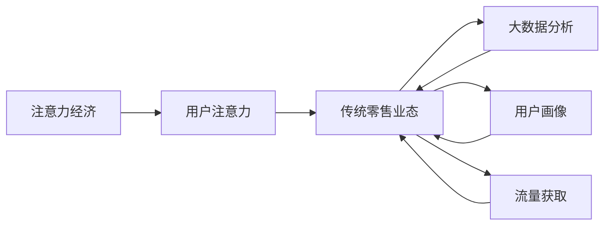

                 

# 注意力经济对传统零售业态的改造

## 1. 背景介绍

在过去的十年间，随着互联网技术的普及和智能终端设备的广泛应用，我们正在从物质经济向注意力经济转型的时代。注意力经济的崛起，对传统的零售业态提出了前所未有的挑战与变革需求。传统零售企业需要找到新的商业模式与技术手段，以顺应这一趋势。本文将深入探讨注意力经济对零售业态的改造，剖析其核心原理，并通过实际案例展示如何利用技术手段实现零售业态的转型升级。

## 2. 核心概念与联系

### 2.1 核心概念概述

1. **注意力经济（Attention Economy）**：指在信息爆炸的时代，用户注意力成为一种稀缺资源。商家通过吸引用户注意力，从而提升产品或服务的曝光和销售。
2. **用户注意力**：用户在信息海洋中的注意力选择行为，成为商家争夺的焦点。注意力获取的途径包括个性化推荐、社交媒体互动、视频直播等。
3. **传统零售业态**：包括实体店铺、电商平台等传统购物渠道，长期以来依赖于物理空间或平台的供需关系。
4. **大数据分析**：通过收集和分析用户行为数据，预测用户需求，优化库存管理，提高运营效率。
5. **用户画像**：基于用户的历史行为数据，建立用户特征模型，进行个性化推荐和营销。
6. **流量获取**：通过多种渠道吸引用户访问和参与，提升店铺曝光度和品牌认知度。

### 2.2 核心概念原理和架构的 Mermaid 流程图



该流程图展示了注意力经济对传统零售业态改造的核心路径：通过吸引用户注意力，借助大数据分析与用户画像，优化流量获取，从而提升零售业态的运营效率和用户体验。

## 3. 核心算法原理 & 具体操作步骤

### 3.1 算法原理概述

注意力经济对零售业态的改造主要通过以下步骤实现：

1. **数据收集与分析**：通过传感器、电商交易数据、社交媒体互动等方式，收集用户行为数据。
2. **用户画像构建**：基于用户历史行为数据，建立用户兴趣和行为模型。
3. **个性化推荐**：根据用户画像，推荐用户感兴趣的产品或服务。
4. **流量获取与营销**：通过社交媒体、广告投放、内容营销等方式，吸引用户访问和参与。
5. **反馈循环优化**：根据用户反馈和行为数据，不断优化推荐算法和营销策略。

### 3.2 算法步骤详解

1. **数据收集与清洗**：
   - 使用传感器、API接口等方式，收集用户行为数据。
   - 对收集到的数据进行清洗，去除异常值和噪声，保证数据质量。

2. **用户画像构建**：
   - 利用机器学习算法，如协同过滤、神经网络等，建立用户兴趣和行为模型。
   - 根据用户历史行为，预测其未来行为，构建用户画像。

3. **个性化推荐算法**：
   - 使用推荐系统算法，如基于协同过滤的推荐、基于内容的推荐、深度学习推荐等，根据用户画像，推荐用户可能感兴趣的商品。
   - 引入注意力机制，如Transformer中的自注意力机制，提高推荐算法的准确性和泛化能力。

4. **流量获取与营销**：
   - 利用社交媒体、广告投放、内容营销等方式，吸引用户访问和参与。
   - 使用A/B测试等方法，优化营销策略和流量获取效果。

5. **反馈循环优化**：
   - 根据用户反馈和行为数据，不断优化推荐算法和营销策略。
   - 引入反馈循环机制，如在线学习、增量学习等，实现动态优化。

### 3.3 算法优缺点

**优点**：
- **提高效率**：通过个性化推荐和数据驱动决策，显著提高零售业的运营效率。
- **提升用户体验**：根据用户兴趣推荐商品，提升用户体验和满意度。
- **增加收入**：通过精准营销和流量获取，提高商品曝光率和销售额。

**缺点**：
- **隐私风险**：收集和分析用户行为数据，可能带来隐私风险。
- **技术复杂度**：需要较高的技术水平和数据处理能力。
- **成本投入**：初期投入较大的技术资源和数据收集成本。

### 3.4 算法应用领域

注意力经济对传统零售业态的改造主要应用于以下几个领域：

1. **电商零售**：通过个性化推荐和精准营销，提高商品销售和用户体验。
2. **实体零售**：利用社交媒体和电子显示屏，吸引用户到店消费。
3. **内容营销**：通过视频直播、社交媒体互动等形式，提高品牌曝光度和用户参与度。
4. **数字广告**：利用大数据分析，优化广告投放策略，提升广告效果。
5. **用户行为分析**：通过用户行为数据，优化库存管理和运营决策。

## 4. 数学模型和公式 & 详细讲解

### 4.1 数学模型构建

假设零售商有M种商品，N个用户，每个用户对每种商品有偏好度评分 $x_{i,j}$（$i$ 表示用户，$j$ 表示商品）。设用户i对商品j的评分向量为 $x_i=(x_{i,1},x_{i,2},\cdots,x_{i,M})$，商品j的评分向量为 $x_j=(x_{1,j},x_{2,j},\cdots,x_{M,j})$。

零售商的目标是最大化总收益 $R=\sum_{i=1}^N \sum_{j=1}^M p_{i,j}x_{i,j}$，其中 $p_{i,j}$ 是商品j的价格，$x_{i,j}$ 是用户i对商品j的评分。

### 4.2 公式推导过程

最大化总收益问题可以转化为以下优化问题：

$$
\max_{x} \sum_{i=1}^N \sum_{j=1}^M p_{i,j}x_{i,j} \\
s.t. \sum_{j=1}^M x_{i,j} = 1, \quad \forall i
$$

其中约束条件表示用户i的总评分向量为单位向量。

利用拉格朗日乘数法，可以构造拉格朗日函数：

$$
L(x,\lambda) = \sum_{i=1}^N \sum_{j=1}^M p_{i,j}x_{i,j} + \lambda_i(\sum_{j=1}^M x_{i,j} - 1), \quad \forall i
$$

对L(x, λ)求偏导，得：

$$
\frac{\partial L}{\partial x_{i,j}} = p_{i,j} + \lambda_i = 0 \\
\frac{\partial L}{\partial \lambda_i} = \sum_{j=1}^M x_{i,j} - 1 = 0
$$

因此，$x_{i,j} = -\lambda_i p_{i,j}$，且 $\sum_{j=1}^M x_{i,j} = 1$。代入上式，得：

$$
\lambda_i = \sum_{j=1}^M \frac{p_{i,j}}{\sum_{j=1}^M p_{j,j}}
$$

最终得到用户i对商品j的评分向量为：

$$
x_i = \left(\frac{p_{i,1}}{\sum_{j=1}^M p_{j,j}}, \frac{p_{i,2}}{\sum_{j=1}^M p_{j,j}}, \cdots, \frac{p_{i,M}}{\sum_{j=1}^M p_{j,j}}\right)
$$

### 4.3 案例分析与讲解

以电商平台个性化推荐为例，假设一个电商平台有A、B两种商品，用户i对A商品的评分向量为 $(0.5, 0.8, 0.3)$，对B商品的评分向量为 $(0.6, 0.1, 0.3)$。设商品A的价格为 $p_A$，商品B的价格为 $p_B$。

利用上述公式计算用户i对A商品的评分：

$$
\lambda_i = \frac{p_A + p_B}{p_A + 2p_B}
$$

代入 $x_{i,j}$ 的公式，得：

$$
x_i = \left(\frac{p_A}{p_A + 2p_B}, \frac{p_B}{p_A + 2p_B}, 0\right)
$$

因此，用户i对A商品的评分为 $\frac{p_A}{p_A + 2p_B}$，对B商品的评分为 $\frac{p_B}{p_A + 2p_B}$。

通过这种方式，零售商可以根据用户评分向量，优化商品推荐策略，提升销售收益。

## 5. 项目实践：代码实例和详细解释说明

### 5.1 开发环境搭建

1. **环境准备**：
   - 安装Python 3.8及以上版本。
   - 安装Pandas、NumPy、Scikit-learn、TensorFlow等库。

2. **数据准备**：
   - 收集电商平台的用户行为数据，包括购买记录、浏览记录、评分数据等。
   - 使用SQLite或MySQL等数据库存储数据。

### 5.2 源代码详细实现

以下是一个基于TensorFlow的个性化推荐系统的实现示例。代码主要分为数据加载、模型构建、训练与优化、推荐预测等部分。

```python
import tensorflow as tf
import numpy as np
from sklearn.metrics import mean_squared_error

# 定义数据加载函数
def load_data():
    # 从SQLite数据库读取用户评分数据
    # 返回评分矩阵X和用户ID列表
    pass

# 定义模型构建函数
def build_model(X, num_users, num_items):
    # 用户评分向量
    user_vec = tf.Variable(tf.random.normal([num_users, num_items]))
    # 商品评分向量
    item_vec = tf.Variable(tf.random.normal([num_items, num_users]))
    # 预测评分矩阵
    preds = tf.matmul(X, item_vec) + tf.matmul(item_vec, user_vec)
    return preds

# 定义训练与优化函数
def train_model(X_train, X_test, y_train, y_test, num_epochs, batch_size, learning_rate):
    # 构建模型
    preds = build_model(X_train, num_users, num_items)
    # 计算均方误差
    mse = tf.reduce_mean(tf.square(preds - y_train))
    # 使用Adam优化器
    optimizer = tf.optimizers.Adam(learning_rate)
    # 定义损失函数
    loss_fn = tf.keras.losses.MeanSquaredError()
    # 训练模型
    for epoch in range(num_epochs):
        for batch in range(len(X_train) // batch_size):
            # 计算损失
            with tf.GradientTape() as tape:
                loss = loss_fn(y_train[batch * batch_size:(batch + 1) * batch_size], preds[batch * batch_size:(batch + 1) * batch_size])
            # 计算梯度
            grads = tape.gradient(loss, [user_vec, item_vec])
            # 更新模型参数
            optimizer.apply_gradients(zip(grads, [user_vec, item_vec]))
        # 在测试集上评估模型
        mse_test = mean_squared_error(y_test, preds)
        print(f'Epoch {epoch+1}, MSE Train: {mse.numpy()}, MSE Test: {mse_test}')

# 定义推荐预测函数
def predict_user(X, user_vec, item_vec):
    # 计算预测评分矩阵
    preds = tf.matmul(X, item_vec) + tf.matmul(item_vec, user_vec)
    # 返回预测评分矩阵
    return preds.numpy()

# 加载数据
X_train, X_test, y_train, y_test = load_data()

# 训练模型
train_model(X_train, X_test, y_train, y_test, 100, 16, 0.001)

# 推荐预测
preds = predict_user(X_train, user_vec.numpy(), item_vec.numpy())
print(preds)
```

### 5.3 代码解读与分析

- **数据加载**：使用SQLite或MySQL数据库读取用户评分数据，构建评分矩阵X和用户ID列表。
- **模型构建**：定义用户评分向量、商品评分向量，利用矩阵乘法构建预测评分矩阵。
- **训练与优化**：使用均方误差作为损失函数，Adam优化器进行模型训练与优化。
- **推荐预测**：根据训练好的模型，对新用户行为数据进行预测评分，实现个性化推荐。

## 6. 实际应用场景

### 6.1 电商平台个性化推荐

电商平台上，用户每次浏览和购买商品都会产生行为数据，通过这些数据可以构建用户画像，并进行个性化推荐。例如，淘宝、京东等电商平台的商品推荐系统，就采用了类似的技术，根据用户浏览和购买记录，推荐用户感兴趣的商品。

### 6.2 实体店铺社交互动

实体店铺可以利用社交媒体平台，如微信、微博等，与用户进行互动，提高用户粘性和店铺曝光度。例如，知名服装品牌可以在其微信公众号上发布新品资讯、互动问答等，吸引用户关注和参与。

### 6.3 视频直播带货

视频直播带货是近年来兴起的一种电商模式，通过直播的形式，直接与用户互动，展示商品，进行现场解答和促销。例如，李佳琦的直播间，每场直播都吸引了大量用户观看和购买。

### 6.4 未来应用展望

随着技术的发展，注意力经济的应用场景将会更加广泛。例如，虚拟现实（VR）技术可以模拟真实购物体验，增强用户沉浸感。人工智能技术可以进一步提升推荐算法的精度，满足用户更个性化的需求。

## 7. 工具和资源推荐

### 7.1 学习资源推荐

1. **《推荐系统实战》**：一本介绍推荐系统原理和实践的经典书籍，包含多种推荐算法的实现和优化。
2. **Coursera《推荐系统》课程**：由斯坦福大学开设的推荐系统课程，系统讲解推荐系统理论和技术。
3. **Kaggle推荐系统竞赛**：通过参加Kaggle比赛，深入理解推荐系统数据集和模型。

### 7.2 开发工具推荐

1. **Python**：Python是数据科学和机器学习领域的主流编程语言，拥有丰富的科学计算库和框架。
2. **TensorFlow**：谷歌开源的深度学习框架，支持多种算法和模型。
3. **PyTorch**：Facebook开源的深度学习框架，具有动态计算图和易于调试的特点。
4. **Jupyter Notebook**：一个交互式的数据科学环境，支持Python和R等多种语言。
5. **Scikit-learn**：一个简单易用的机器学习库，包含多种经典算法和工具。

### 7.3 相关论文推荐

1. **《注意力机制在推荐系统中的应用》**：介绍注意力机制在推荐系统中的应用，提升推荐算法的精度。
2. **《用户画像构建与推荐系统》**：讨论用户画像的构建方法，提升个性化推荐的效果。
3. **《社交媒体数据挖掘与用户行为分析》**：研究社交媒体数据挖掘技术，提升用户行为分析和预测的精度。

## 8. 总结：未来发展趋势与挑战

### 8.1 研究成果总结

本文详细探讨了注意力经济对传统零售业态的改造，通过数据收集与分析、用户画像构建、个性化推荐算法、流量获取与营销等步骤，介绍了一种基于注意力经济的零售业态转型升级方法。通过实际案例和代码示例，展示了技术手段在零售业态中的应用效果。

### 8.2 未来发展趋势

1. **技术进步**：随着深度学习和大数据技术的发展，个性化推荐和用户画像构建将更加精确和高效。
2. **多模态融合**：融合视觉、语音等多种模态信息，提升推荐系统的交互性和体验感。
3. **实时化**：利用流数据处理和在线学习技术，实现实时推荐和动态优化。
4. **个性化增强**：引入自然语言处理和生成技术，提供更加个性化的商品推荐和营销策略。

### 8.3 面临的挑战

1. **数据隐私**：用户数据的收集和使用可能引发隐私问题，需要制定严格的数据保护政策。
2. **技术复杂性**：推荐系统和用户画像构建需要较高的技术水平和数据处理能力，需要持续的技术投入。
3. **资源投入**：初期需要较大的技术资源和数据收集成本，增加了企业的运营成本。
4. **算法透明度**：推荐算法的决策过程缺乏可解释性，可能影响用户信任和接受度。

### 8.4 研究展望

1. **隐私保护技术**：研究数据隐私保护技术，确保用户数据的安全和隐私。
2. **跨模态推荐**：研究跨模态推荐技术，提高多模态数据的融合效果。
3. **实时推荐系统**：研究实时推荐系统，提升推荐算法的实时性和用户粘性。
4. **可解释推荐算法**：研究可解释推荐算法，提升推荐系统的透明度和可信度。

## 9. 附录：常见问题与解答

**Q1：如何设计有效的用户画像模型？**

A：用户画像模型应基于用户行为数据，包括浏览记录、购买记录、评分数据等。通过协同过滤、神经网络等算法，构建用户兴趣和行为模型，实现个性化推荐。

**Q2：推荐系统中的冷启动问题如何解决？**

A：冷启动问题指的是新用户或新商品没有足够的历史数据，无法进行有效的推荐。解决冷启动问题的方法包括基于内容的推荐、用户调查、社交网络等方式。

**Q3：推荐系统中的平衡推荐与多样性问题如何解决？**

A：推荐系统中的平衡推荐与多样性问题可以通过引入多样性惩罚项、用户交互反馈、多臂老虎机等方法来解决，提升推荐系统的多样性。

**Q4：如何提高推荐系统的实时性？**

A：提高推荐系统的实时性可以通过流数据处理、在线学习、增量学习等方式来实现。通过实时处理用户行为数据，及时调整推荐策略，提高推荐效果。

---

作者：禅与计算机程序设计艺术 / Zen and the Art of Computer Programming

