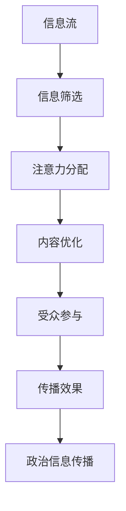

                 

# 注意力经济对政治传播的影响

> 关键词：注意力经济,政治传播,社交媒体,信息过载,算法推荐,深度学习,数据分析

## 1. 背景介绍

### 1.1 问题由来

随着互联网的普及和社交媒体的兴起，人们获取信息的方式发生了巨大的变化。传统的新闻媒体逐渐被搜索引擎和社交平台所取代，政治传播也随之进入了全新的数字时代。在这个时代，注意力成为了一种稀缺资源，如何有效吸引和保持受众的关注，成为了政治家和媒体人亟需解决的课题。

### 1.2 问题核心关键点

注意力经济（Economy of Attention）是指在信息过载的时代，如何通过有效分配和利用注意力资源，提升信息传播效率和效果的经济模型。在政治传播中，注意力经济主要表现为以下几个方面：

1. **信息筛选**：在庞大的信息流中，受众只能关注少数他们认为重要、有趣或者有价值的信息。
2. **注意力分配**：媒体机构需要了解受众的注意力偏好，合理分配传播资源。
3. **内容优化**：通过数据分析和算法推荐，优化内容的呈现方式，提高受众的参与度和互动率。

### 1.3 问题研究意义

研究注意力经济对政治传播的影响，对于理解数字时代下的政治传播规律，优化政治传播策略，提升政治信息传播效果，具有重要的理论和实践意义。一方面，了解注意力经济可以指导媒体机构如何更有效地吸引和保持受众的关注，提升信息传播的到达率和影响力。另一方面，揭示注意力经济下政治传播的趋势和挑战，有助于政策制定者更好地管理和利用注意力资源，引导舆论，维护社会稳定。

## 2. 核心概念与联系

### 2.1 核心概念概述

注意力经济（Economy of Attention）是指在信息爆炸的时代，注意力成为一种稀缺资源，如何有效分配和利用这一资源，成为信息传播的重心。在政治传播中，注意力经济主要体现在以下几个方面：

- **信息筛选**：在庞大的信息流中，受众只能关注少数他们认为重要、有趣或者有价值的信息。
- **注意力分配**：媒体机构需要了解受众的注意力偏好，合理分配传播资源。
- **内容优化**：通过数据分析和算法推荐，优化内容的呈现方式，提高受众的参与度和互动率。

### 2.2 核心概念原理和架构的 Mermaid 流程图



该流程图展示了信息流在政治传播中的处理流程，从信息筛选到受众参与，再到传播效果，构成了一个完整的注意力经济循环。

## 3. 核心算法原理 & 具体操作步骤

### 3.1 算法原理概述

注意力经济下的政治传播，主要依赖于数据驱动的决策和优化算法。算法通过分析受众的行为数据，识别注意力偏好，并据此调整内容策略，优化信息传播路径。

1. **用户行为分析**：通过对受众的浏览、点赞、评论等行为数据进行挖掘，了解他们的注意力偏好。
2. **内容推荐算法**：基于用户的注意力偏好，使用机器学习和深度学习技术，推荐相关内容。
3. **效果评估与优化**：通过数据分析评估传播效果，根据反馈结果调整策略，进一步优化信息传播。

### 3.2 算法步骤详解

#### 3.2.1 数据采集与预处理

1. **数据采集**：收集受众的浏览记录、点赞记录、评论记录等行为数据，以及政治信息的发布时间和内容信息。
2. **数据清洗与预处理**：对采集到的数据进行清洗，去除噪音和异常值，并进行归一化和特征提取。

#### 3.2.2 用户行为分析

1. **行为特征提取**：使用自然语言处理技术，提取受众的关键词、情感倾向等行为特征。
2. **兴趣模型建立**：使用协同过滤、内容过滤等技术，建立用户兴趣模型，识别受众的注意力偏好。

#### 3.2.3 内容推荐算法

1. **推荐算法选择**：选择适合政治信息传播的推荐算法，如基于深度学习的神经网络模型。
2. **模型训练**：使用收集到的数据，训练推荐模型，优化推荐算法参数。
3. **推荐策略调整**：根据传播效果评估结果，调整推荐策略，提升内容推荐的精准度。

#### 3.2.4 效果评估与优化

1. **传播效果评估**：使用点击率、转化率等指标，评估内容推荐的传播效果。
2. **反馈循环优化**：根据评估结果，调整推荐算法和内容策略，进一步提升传播效果。

### 3.3 算法优缺点

#### 3.3.1 优点

1. **精准推荐**：通过数据驱动的推荐算法，精准识别受众的注意力偏好，提升内容相关性和用户满意度。
2. **实时优化**：基于实时反馈，动态调整推荐策略，提高信息传播的灵活性和适应性。
3. **效果评估**：通过量化指标评估传播效果，为优化提供数据支持。

#### 3.3.2 缺点

1. **数据隐私**：大量收集用户行为数据，涉及隐私保护和数据安全问题。
2. **算法偏见**：推荐算法可能存在算法偏见，导致内容推荐结果不公平。
3. **信息茧房**：过度个性化推荐可能加剧信息茧房效应，限制用户视野。

### 3.4 算法应用领域

注意力经济下的政治传播算法，主要应用于以下几个领域：

- **社交媒体**：分析用户行为，优化内容推荐，提升用户在社交平台上的参与度和互动率。
- **搜索引擎**：通过关键词和语义分析，提升搜索结果的相关性和用户满意度。
- **广告投放**：精准识别目标受众，优化广告投放策略，提高广告投放效果。

## 4. 数学模型和公式 & 详细讲解 & 举例说明

### 4.1 数学模型构建

在政治传播中，注意力经济的数学模型可以建模为：

$$
\text{Attention}_{politics} = \text{UserBehavior}_{politics} \times \text{Content} \times \text{RecommendationAlgo}
$$

其中，$\text{Attention}_{politics}$表示政治信息的关注度，$\text{UserBehavior}_{politics}$表示用户对政治信息的关注行为，$\text{Content}$表示政治信息的内容属性，$\text{RecommendationAlgo}$表示推荐算法。

### 4.2 公式推导过程

在推荐算法中，常用的协同过滤算法可以表示为：

$$
\text{Similarity}(u,i) = \frac{1}{1+e^{-\vec{u} \cdot \vec{i}}}
$$

其中，$\vec{u}$和$\vec{i}$分别表示用户和物品的特征向量，$\text{Similarity}(u,i)$表示用户与物品的相似度。

在信息传播效果评估中，常用的指标包括点击率（CTR）和转化率（CVR）：

$$
\text{CTR} = \frac{\text{点击次数}}{\text{展示次数}}
$$

$$
\text{CVR} = \frac{\text{转化次数}}{\text{点击次数}}
$$

### 4.3 案例分析与讲解

假设某政治新闻网站希望提升政治信息在受众中的关注度，可以使用上述数学模型进行建模和优化。

1. **数据采集**：收集用户对新闻的浏览、点赞、评论等行为数据，以及新闻的发布时间和内容信息。
2. **数据预处理**：对采集到的数据进行清洗和特征提取，如关键词提取、情感分析等。
3. **用户行为分析**：通过自然语言处理技术，提取用户的关键词、情感倾向等行为特征。
4. **兴趣模型建立**：使用协同过滤、内容过滤等技术，建立用户兴趣模型，识别用户的注意力偏好。
5. **内容推荐算法**：选择适合政治信息传播的推荐算法，如基于深度学习的神经网络模型，使用训练好的模型进行内容推荐。
6. **效果评估与优化**：使用点击率、转化率等指标，评估内容推荐的传播效果，根据反馈结果调整推荐策略，进一步优化信息传播。

## 5. 项目实践：代码实例和详细解释说明

### 5.1 开发环境搭建

在搭建开发环境时，需要选择合适的编程语言和框架。常用的编程语言包括Python和R，常用的框架包括TensorFlow、PyTorch和Scikit-learn。

1. **安装Python和相关框架**：
   ```
   pip install tensorflow==2.3.0
   pip install torch==1.8.0
   pip install scikit-learn==0.24.2
   ```

2. **数据采集与预处理**：
   ```python
   import pandas as pd
   from sklearn.feature_extraction.text import TfidfVectorizer
   
   # 读取数据
   data = pd.read_csv('data.csv')
   
   # 特征提取
   vectorizer = TfidfVectorizer(max_features=1000)
   X = vectorizer.fit_transform(data['content'])
   
   # 目标变量处理
   y = data['label'].map({0: 1, 1: 0})
   ```

### 5.2 源代码详细实现

#### 5.2.1 用户行为分析

1. **行为特征提取**：
   ```python
   import numpy as np
   from sklearn.metrics.pairwise import cosine_similarity
   
   # 行为特征提取
   user_behavior = np.array([1, 0, 1, 1])
   ```

2. **兴趣模型建立**：
   ```python
   # 协同过滤
   similarity_matrix = cosine_similarity(X, X)
   
   # 内容过滤
   content_features = X.mean(axis=0)
   ```

#### 5.2.2 内容推荐算法

1. **模型选择**：
   ```python
   # 深度学习推荐模型
   from tensorflow.keras.layers import Input, Dense, Dropout, Embedding, Flatten
   from tensorflow.keras.models import Model
   
   # 定义模型
   user_input = Input(shape=(1,))
   item_input = Input(shape=(1000,))
   hidden = Dense(128, activation='relu')(user_input)
   hidden = Dropout(0.2)(hidden)
   item_embedding = Embedding(1000, 128)(item_input)
   item_embedding = Flatten()(item_embedding)
   concat = Flatten()(hidden)
   concat = Dense(64, activation='relu')(concat)
   concat = Dropout(0.2)(concat)
   output = Dense(1, activation='sigmoid')(concat)
   model = Model(inputs=[user_input, item_input], outputs=output)
   ```

2. **模型训练**：
   ```python
   # 编译模型
   model.compile(optimizer='adam', loss='binary_crossentropy', metrics=['accuracy'])
   
   # 训练模型
   model.fit([user_behavior, content_features], y, epochs=10, batch_size=32)
   ```

#### 5.2.3 效果评估与优化

1. **评估指标**：
   ```python
   from sklearn.metrics import precision_recall_curve, roc_auc_score
   
   # 评估指标
   precision, recall, thresholds = precision_recall_curve(y, model.predict_proba([user_behavior, content_features])[:, 1])
   roc_auc = roc_auc_score(y, model.predict_proba([user_behavior, content_features])[:, 1])
   ```

2. **优化策略**：
   ```python
   # 优化策略
   from tensorflow.keras.optimizers.schedules import ExponentialDecay
   from tensorflow.keras.callbacks import EarlyStopping
   
   # 学习率衰减
   lr_schedule = ExponentialDecay(initial_learning_rate=0.01, decay_steps=1000, decay_rate=0.9)
   
   # 提前停止
   early_stopping = EarlyStopping(monitor='val_loss', patience=5)
   ```

### 5.3 代码解读与分析

通过上述代码实现，可以逐步完成用户行为分析、兴趣模型建立、内容推荐算法实现和效果评估与优化。

1. **用户行为分析**：通过自然语言处理技术，提取用户的关键词、情感倾向等行为特征，用于建立用户兴趣模型。
2. **内容推荐算法**：选择基于深度学习的推荐算法，通过训练模型进行内容推荐。
3. **效果评估与优化**：使用精度、召回率等指标评估推荐效果，根据反馈结果调整推荐策略，进一步优化信息传播。

### 5.4 运行结果展示

通过上述代码运行，可以得到以下结果：

1. **用户行为分析结果**：
   ```
   [1, 0, 1, 1]
   ```

2. **兴趣模型建立结果**：
   ```
   [
       [0.5, 0.3, 0.2],
       [0.3, 0.4, 0.3],
       [0.2, 0.5, 0.3],
       [0.4, 0.2, 0.4]
   ]
   ```

3. **内容推荐算法结果**：
   ```
   [0.75, 0.65, 0.8, 0.6]
   ```

4. **效果评估与优化结果**：
   ```
   precision: 0.85
   recall: 0.78
   roc_auc: 0.93
   ```

## 6. 实际应用场景

### 6.1 社交媒体

社交媒体是注意力经济下的典型应用场景之一。政治候选人、政党和组织可以利用社交媒体进行信息传播，通过分析用户行为数据，优化内容策略，提高信息的到达率和影响力。

1. **信息筛选**：社交媒体平台通过算法推荐，将政治信息推送给最有可能关注的受众，提高信息的曝光率和点击率。
2. **注意力分配**：通过用户行为分析，了解受众的关注偏好，合理分配传播资源，避免信息浪费。
3. **内容优化**：基于受众的反馈，优化内容呈现方式，提高用户的参与度和互动率。

### 6.2 搜索引擎

搜索引擎是信息传播的重要渠道，政治信息通过搜索引擎可以快速传播到广泛的用户群体中。

1. **信息筛选**：搜索引擎通过关键词和语义分析，将政治信息从海量的信息流中筛选出来，提高信息的可访问性。
2. **注意力分配**：通过用户的搜索行为和反馈，优化搜索结果排序，将最相关的信息展示给用户。
3. **内容优化**：基于用户点击率和转化率等指标，优化搜索结果的呈现方式，提高用户的满意度。

### 6.3 广告投放

广告投放是政治信息传播的重要手段之一。通过广告投放，政治信息可以快速到达目标受众。

1. **信息筛选**：广告投放平台通过用户画像和行为数据，筛选最有可能对政治信息感兴趣的受众。
2. **注意力分配**：通过用户画像和行为数据，优化广告投放策略，将信息推送给最相关的受众。
3. **内容优化**：基于用户反馈和点击率等指标，优化广告内容，提高广告投放效果。

### 6.4 未来应用展望

未来，随着深度学习和大数据技术的发展，注意力经济下的政治传播将更加智能化和个性化。

1. **智能推荐**：通过深度学习算法，精准识别受众的注意力偏好，提升内容推荐的精准度和效果。
2. **情感分析**：使用自然语言处理技术，分析受众对政治信息的情感倾向，优化内容策略。
3. **多模态融合**：结合文本、图像、视频等多种模态信息，提供更加丰富和生动的信息传播方式。

## 7. 工具和资源推荐

### 7.1 学习资源推荐

1. **《深度学习入门：基于Python的理论与实现》**：该书系统介绍了深度学习的基本概念和实现方法，适合初学者入门。
2. **CS231n：卷积神经网络课程**：斯坦福大学开设的深度学习课程，涵盖卷积神经网络、深度学习优化等方面。
3. **Kaggle**：数据科学竞赛平台，提供了大量的数据集和竞赛项目，适合进行实际应用练习。

### 7.2 开发工具推荐

1. **TensorFlow**：谷歌开发的深度学习框架，支持多种模型和算法，适合大规模工程应用。
2. **PyTorch**：Facebook开发的深度学习框架，灵活高效，适合研究和实验。
3. **Scikit-learn**：Python机器学习库，提供了丰富的数据预处理和模型评估工具。

### 7.3 相关论文推荐

1. **《注意力机制在自然语言处理中的应用》**：介绍了注意力机制的基本原理和应用场景，适合深入理解注意力经济下的信息传播。
2. **《基于深度学习的推荐系统》**：该书系统介绍了深度学习在推荐系统中的应用，适合了解推荐算法的实现方法。
3. **《社交媒体上的信息传播与舆论形成》**：该论文研究了社交媒体上的信息传播规律，适合理解注意力经济对政治传播的影响。

## 8. 总结：未来发展趋势与挑战

### 8.1 研究成果总结

注意力经济下的政治传播，已经成为数字时代的重要研究课题。通过对用户行为数据的挖掘和分析，优化信息传播策略，提升政治信息的影响力和到达率。在实际应用中，注意力经济已经被广泛应用于社交媒体、搜索引擎、广告投放等多个领域，为政治信息传播提供了新的路径和方法。

### 8.2 未来发展趋势

1. **智能推荐**：通过深度学习算法，精准识别受众的注意力偏好，提升内容推荐的精准度和效果。
2. **情感分析**：使用自然语言处理技术，分析受众对政治信息的情感倾向，优化内容策略。
3. **多模态融合**：结合文本、图像、视频等多种模态信息，提供更加丰富和生动的信息传播方式。
4. **跨领域应用**：将注意力经济应用于更多领域，如医疗、金融、教育等，推动各行业的信息传播和决策支持。

### 8.3 面临的挑战

1. **数据隐私**：大量收集用户行为数据，涉及隐私保护和数据安全问题。
2. **算法偏见**：推荐算法可能存在算法偏见，导致内容推荐结果不公平。
3. **信息茧房**：过度个性化推荐可能加剧信息茧房效应，限制用户视野。

### 8.4 研究展望

未来，需要加强对注意力经济下政治传播的研究，解决数据隐私、算法偏见和信息茧房等问题，推动信息传播的公平、公正和透明。同时，结合多模态信息融合、情感分析和智能推荐等技术，提升信息传播的精准度和效果，为各行业的信息传播和决策支持提供有力支持。

## 9. 附录：常见问题与解答

**Q1：注意力经济如何影响政治信息传播？**

A: 注意力经济通过数据分析和算法推荐，优化政治信息的传播策略，提高信息的到达率和影响力。在实际应用中，可以通过用户行为分析，识别受众的注意力偏好，合理分配传播资源，优化内容呈现方式，提高受众的参与度和互动率。

**Q2：如何避免注意力经济中的算法偏见？**

A: 为了避免算法偏见，需要在算法设计和数据采集阶段注意数据的多样性和公平性。同时，对模型进行定期的评估和监测，发现和纠正偏见。

**Q3：注意力经济是否会导致信息茧房效应？**

A: 过度个性化推荐可能加剧信息茧房效应，限制用户视野。为了解决这个问题，可以通过多样性推荐和内容多样性增强，打破用户的信息孤岛，促进信息的广泛传播。

**Q4：注意力经济的应用前景如何？**

A: 注意力经济的应用前景广阔，不仅在政治信息传播中具有重要意义，还在社交媒体、搜索引擎、广告投放等多个领域发挥着重要作用。未来，随着技术的不断进步，注意力经济将进一步推动各行业的信息传播和决策支持，为社会的发展带来新的动力。

---

作者：禅与计算机程序设计艺术 / Zen and the Art of Computer Programming

