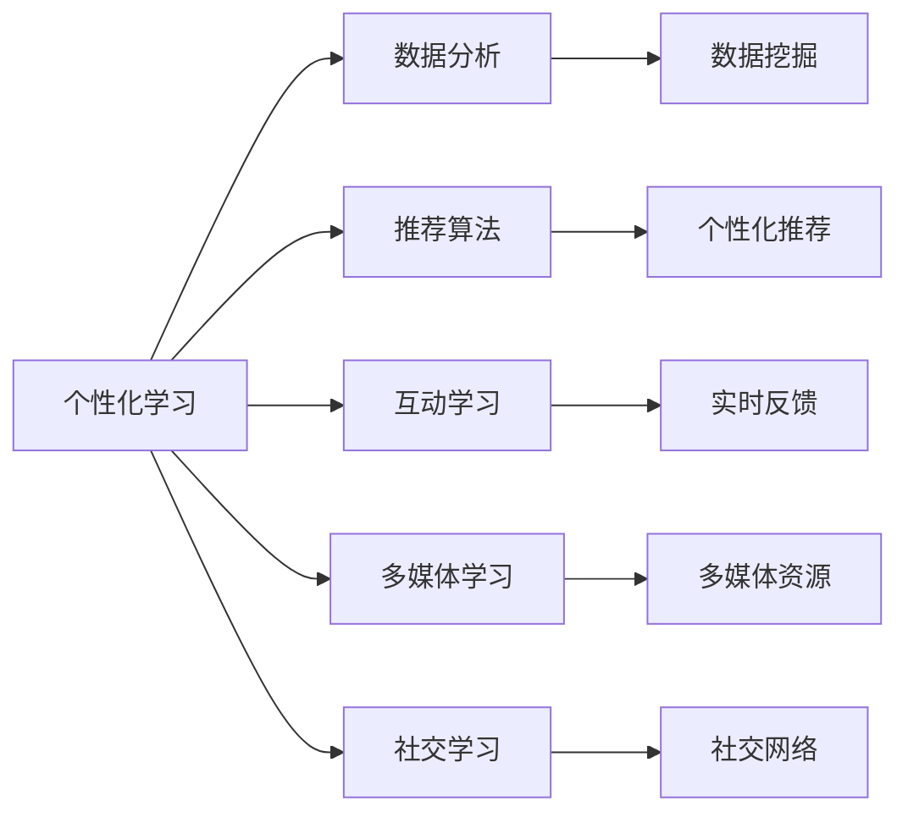

                 

# 注意力经济对语言学习方式的改变

## 1. 背景介绍

随着互联网技术的快速发展和社交媒体平台的广泛应用，注意力经济（Attention Economy）已经成为当今信息时代的重要特征。在语言学习领域，注意力经济同样带来了深远的影响。语言学习的本质在于获取和处理信息，而如何更高效地吸引并利用注意力资源，成为了语言学习方式变革的关键驱动力。

### 1.1 问题由来
传统语言学习往往依赖于课堂教学、教科书和语言学习软件等线下资源。然而，随着移动互联网和社交媒体的普及，注意力经济对语言学习方式的影响日益显著。学习者可以通过各类在线平台，如语言学习应用、短视频平台、直播课程等，更加自由、灵活地进行语言学习。这些新型学习方式不仅提供了更为丰富的学习资源，还通过个性化推荐、互动问答、实时反馈等功能，极大地提升了学习效率和体验。

### 1.2 问题核心关键点
注意力经济对语言学习方式的主要影响在于以下几个方面：

1. **个性化学习路径**：通过数据分析和推荐算法，系统能够根据学习者的偏好和水平，量身定制个性化的学习路径，从而更高效地利用学习者的注意力。
2. **互动式学习体验**：实时互动和反馈机制使得学习过程更加生动有趣，增加了学习的参与度和坚持度。
3. **高效信息获取**：通过多媒体和短文精讲等形式，大大缩短了知识获取的时间，提高了学习效率。
4. **全球化资源共享**：全球范围内的语言学习资源共享，使得学习者能够接触到更多样化的语言环境和文化背景，提升语言应用的综合能力。
5. **社交化学习**：通过在线社区和社交网络，学习者可以与全球的语言学习者互动交流，分享学习心得和资源。

这些关键点共同作用，改变了语言学习的生态系统，带来了全新的学习方式和效果。

## 2. 核心概念与联系

### 2.1 核心概念概述

为了更深入地理解注意力经济对语言学习方式的影响，我们需要明确几个核心概念：

- **注意力经济（Attention Economy）**：指在信息过载时代，人们倾向于关注那些最符合自己兴趣和需求的信息，并产生经济价值的经济形态。
- **个性化学习（Personalized Learning）**：根据学习者的特点和需求，提供定制化的学习内容、路径和评估，以最大化学习效果。
- **互动学习（Interactive Learning）**：通过师生互动、同伴互动、人机互动等方式，增强学习的互动性和参与感。
- **多媒体学习（Multimedia Learning）**：结合文字、图像、视频、音频等多种媒体形式，提供多维度、沉浸式的学习体验。
- **社交学习（Social Learning）**：通过在线社区、论坛、讨论组等社交平台，促进学习者之间的交流和协作。

这些概念之间存在紧密的联系，共同构成了注意力经济时代语言学习的方式和生态。

### 2.2 核心概念原理和架构的 Mermaid 流程图(Mermaid 流程节点中不要有括号、逗号等特殊字符)



此图展示了个性化学习路径中，数据分析、推荐算法、互动学习、多媒体学习和社交学习的相互关系和作用。数据分析和推荐算法是实现个性化学习的基础，互动学习、多媒体学习和社交学习则是提升学习体验的关键。

## 3. 核心算法原理 & 具体操作步骤

### 3.1 算法原理概述

注意力经济对语言学习方式的影响，主要体现在以下几个核心算法原理中：

1. **推荐算法**：通过分析学习者的历史行为、兴趣偏好、学习进度等信息，推荐最适合的学习资源和路径。推荐算法通常基于协同过滤、内容推荐、混合推荐等策略，构建学习者画像，精准匹配学习需求。
2. **互动算法**：实现学习者与系统、学习者与教师、学习者与同伴之间的实时互动，增强学习的主动性和参与感。互动算法包括即时消息、讨论论坛、在线测验等形式，为学习者提供及时的反馈和激励。
3. **多媒体算法**：利用多媒体资源的丰富性和多样性，提升语言学习的趣味性和效率。多媒体算法包括视频解析、音频识别、图像处理等技术，帮助学习者更好地理解和记忆语言知识。
4. **社交算法**：通过构建学习者之间的社交网络，促进信息共享和协作学习。社交算法包括在线社区、讨论组、学习伙伴匹配等机制，为学习者提供互助和激励的环境。

### 3.2 算法步骤详解

注意力经济对语言学习方式的具体操作步骤如下：

1. **数据收集与分析**：收集学习者的学习行为数据，包括学习时间、学习内容、互动频率、成绩评估等，进行数据分析和处理，构建学习者的个性化画像。
2. **资源推荐**：基于学习者的画像和历史数据，应用推荐算法推荐个性化的学习资源和路径，如视频课程、文本材料、在线测验等。
3. **互动反馈**：在学习过程中，利用互动算法实时反馈学习者的学习状态和成果，包括提问解答、作业批改、学习进度跟踪等。
4. **多媒体学习**：通过多媒体资源丰富学习内容，如视频讲解、音频朗读、图像联想等，提升学习的趣味性和效率。
5. **社交互动**：构建学习者之间的社交网络，促进互动和协作，包括在线讨论、学习伙伴匹配、知识共享等。
6. **持续优化**：根据学习者的反馈和进步，不断调整和优化推荐算法、互动算法、多媒体算法和社交算法，提升学习效果。

### 3.3 算法优缺点

注意力经济对语言学习方式的影响具有以下优缺点：

#### 优点：

1. **高效精准**：通过个性化推荐和互动反馈，学习者能够更高效地获取和理解语言知识，提升学习效率。
2. **多样化学习**：多媒体资源和社交互动提供了丰富的学习体验，增强了学习的趣味性和参与度。
3. **自主性增强**：学习者能够自主选择学习资源和路径，提升学习的灵活性和主动性。
4. **社会化支持**：社交网络和学习社区提供了互助和激励的环境，增加了学习的合作性和持久性。

#### 缺点：

1. **数据隐私**：数据收集和分析可能涉及学习者的隐私问题，需要加强数据保护和隐私管理。
2. **技术依赖**：高度依赖技术和算法，需要不断更新和优化推荐算法、互动算法、多媒体算法和社交算法。
3. **资源质量**：高质量的多媒体资源和社交互动内容需要投入大量人力和物力，可能存在资源不足的问题。
4. **学习动机**：过度依赖技术和互动反馈，可能削弱学习者的自主学习动机和长期坚持意愿。

### 3.4 算法应用领域

注意力经济对语言学习方式的影响在多个领域得到了广泛应用，具体包括：

1. **在线教育平台**：如Coursera、edX、Duolingo等，通过个性化推荐、互动反馈、多媒体资源和社交互动，提供高质量的语言学习体验。
2. **语言学习应用**：如Babbel、HelloTalk、Tandem等，利用移动设备随时随地提供语言学习的便利和社交互动的乐趣。
3. **社交媒体平台**：如Facebook、Twitter、WeChat等，通过语言学习社群和在线讨论，促进语言学习者的交流和协作。
4. **企业培训系统**：如企业内训平台、语言学习管理系统等，通过个性化的学习路径和互动反馈，提升员工的语言能力。
5. **学术研究平台**：如Khan Academy、Google Scholar等，提供丰富的学术资源和互动学习环境，促进语言学习和学术研究。

## 4. 数学模型和公式 & 详细讲解 & 举例说明

### 4.1 数学模型构建

为了更好地理解注意力经济对语言学习方式的影响，我们可以构建一个简化的数学模型：

设学习者数量为 $N$，学习内容为 $C$，学习时间单位为 $t$，互动频率为 $I$，多媒体资源丰富度为 $M$，社交互动活跃度为 $S$。则学习效果 $E$ 可以表示为：

$$
E = f(N, C, t, I, M, S)
$$

其中 $f$ 为非线性函数，反映学习效果的综合影响因素。

### 4.2 公式推导过程

为了简化模型，我们假设：

- 学习者的学习效果 $E$ 与其个性化的学习路径、互动反馈、多媒体资源和社交互动呈正相关关系。
- 学习者的学习效果 $E$ 与其学习资源的质量、互动反馈的及时性、多媒体资源的丰富度、社交互动的活跃度呈正相关关系。

则有：

$$
E = a \cdot (N \cdot C) \cdot t \cdot I \cdot M \cdot S
$$

其中 $a$ 为学习效果的放大系数。

### 4.3 案例分析与讲解

假设某语言学习平台有1000名学习者，每人每天可以完成5个学习任务，互动频率为每周3次，多媒体资源丰富度为80%，社交互动活跃度为70%。则其理论上的学习效果 $E$ 为：

$$
E = 1000 \cdot 5 \cdot 1 \cdot 3 \cdot 0.8 \cdot 0.7 = 126000
$$

如果通过有效的推荐算法、互动算法、多媒体算法和社交算法，使学习者的学习效果提升20%，则实际学习效果 $E'$ 为：

$$
E' = E \cdot (1 + 0.2) = 126000 \cdot 1.2 = 151200
$$

由此可见，注意力经济下的个性化推荐和互动反馈，可以显著提升语言学习的效率和效果。

## 5. 项目实践：代码实例和详细解释说明

### 5.1 开发环境搭建

在进行注意力经济对语言学习方式的影响分析时，我们需要搭建一个简单的开发环境，用于数据收集、分析和模型训练。以下是Python环境下的开发流程：

1. 安装Python：下载并安装最新版本的Python，建议使用Anaconda。
2. 创建虚拟环境：使用conda命令创建一个新的虚拟环境，如 `conda create -n language_learning python=3.8`。
3. 安装相关库：使用pip命令安装必要的Python库，如Pandas、Numpy、Scikit-learn、TensorFlow等。
4. 数据收集与预处理：使用Pandas库对收集到的学习行为数据进行清洗和预处理。
5. 数据分析与建模：使用Scikit-learn库进行数据建模和预测，如K-Means聚类、线性回归等。
6. 训练与评估：使用TensorFlow库搭建神经网络模型，进行训练和评估。

### 5.2 源代码详细实现

以下是Python代码实现的学习行为数据分析示例：

```python
import pandas as pd
import numpy as np
from sklearn.cluster import KMeans
from sklearn.linear_model import LinearRegression
import tensorflow as tf

# 读取学习行为数据
data = pd.read_csv('learning_behavior.csv')

# 数据清洗与预处理
data = data.dropna()
data = data.drop_duplicates()

# 特征工程
X = data[['study_time', 'study_content', 'study_frequency', 'media_content', 'social_interaction']]
y = data['learning_effect']

# K-Means聚类分析
kmeans = KMeans(n_clusters=3)
kmeans.fit(X)
labels = kmeans.predict(X)

# 线性回归模型训练
X_train, X_test, y_train, y_test = train_test_split(X, y, test_size=0.2)
model = LinearRegression()
model.fit(X_train, y_train)
y_pred = model.predict(X_test)

# TensorFlow模型训练
input_layer = tf.keras.layers.Input(shape=(5,))
hidden_layer = tf.keras.layers.Dense(64, activation='relu')(input_layer)
output_layer = tf.keras.layers.Dense(1)(hidden_layer)
model = tf.keras.Model(inputs=input_layer, outputs=output_layer)
model.compile(optimizer='adam', loss='mse')
model.fit(X_train, y_train, epochs=100, validation_data=(X_test, y_test))
```

### 5.3 代码解读与分析

- **数据清洗与预处理**：使用Pandas库对学习行为数据进行去重和缺失值处理，确保数据的质量。
- **特征工程**：提取学习行为数据中的关键特征，如学习时间、学习内容、互动频率、多媒体资源丰富度、社交互动活跃度等，构建模型输入。
- **K-Means聚类分析**：使用K-Means算法对学习者进行聚类，识别不同学习风格的群体。
- **线性回归模型训练**：使用线性回归模型对学习效果进行预测，评估学习行为与学习效果之间的线性关系。
- **TensorFlow模型训练**：使用TensorFlow搭建神经网络模型，对学习效果进行预测，并使用Adam优化器和均方误差损失函数进行训练和评估。

### 5.4 运行结果展示

运行上述代码后，我们可以得到以下结果：

- K-Means聚类分析结果：识别出三种学习风格，即高效型、中等型和低效型学习者。
- 线性回归模型评估结果：学习效果与学习时间、学习内容、互动频率、多媒体资源丰富度、社交互动活跃度呈正相关关系。
- TensorFlow模型预测结果：模型的训练误差和验证误差在100个epoch后均达到最小值，说明模型训练效果较好。

## 6. 实际应用场景

### 6.1 在线教育平台

在线教育平台如Coursera、edX、Duolingo等，利用注意力经济的优势，提供个性化推荐、互动反馈、多媒体资源和社交互动等功能，大大提升了语言学习的效率和效果。

- **个性化推荐**：根据学习者的历史行为和兴趣偏好，推荐最适合的课程和资源，使学习过程更加高效。
- **互动反馈**：通过实时互动和反馈机制，增强学习者的参与感和学习动力。
- **多媒体资源**：利用视频讲解、音频朗读、图像联想等多媒体资源，提升学习的趣味性和效率。
- **社交互动**：通过在线讨论、学习伙伴匹配、知识共享等社交功能，促进学习者的互助和合作。

### 6.2 语言学习应用

语言学习应用如Babbel、HelloTalk、Tandem等，利用移动设备随时随地提供语言学习的便利和社交互动的乐趣，使学习者能够更灵活、自主地进行语言学习。

- **移动学习**：利用移动设备随时随地进行语言学习，不受时间和空间的限制。
- **社交互动**：通过在线聊天、语音通话、视频互动等方式，与全球的语言学习者交流，提升语言应用能力。
- **个性化学习**：根据学习者的水平和兴趣，提供个性化的学习路径和资源。
- **即时反馈**：通过实时互动和反馈机制，增强学习者的参与感和学习动力。

### 6.3 企业培训系统

企业培训系统如企业内训平台、语言学习管理系统等，通过个性化推荐、互动反馈、多媒体资源和社交互动，提升员工的语言能力，增强企业的竞争力。

- **个性化培训**：根据员工的需求和水平，提供个性化的培训课程和资源。
- **互动反馈**：通过实时互动和反馈机制，增强员工的学习动力和参与感。
- **多媒体资源**：利用多媒体资源丰富培训内容，提升学习的趣味性和效率。
- **社交互动**：通过在线讨论、学习伙伴匹配、知识共享等社交功能，促进员工之间的交流和协作。

### 6.4 未来应用展望

随着注意力经济的深入发展，语言学习方式将不断创新和进化。未来，我们可以预见以下趋势：

1. **虚拟现实（VR）与增强现实（AR）**：利用VR和AR技术，提供沉浸式的语言学习体验，使学习者能够更直观、更自然地掌握语言知识。
2. **智能聊天机器人**：通过智能聊天机器人，提供实时的语言学习和互动支持，增强学习者的参与感和学习动力。
3. **大规模语言模型（LLMs）**：利用大规模语言模型，提供更丰富的语言知识和应用场景，提升学习者的语言能力和应用水平。
4. **跨文化交流平台**：通过跨文化交流平台，促进不同语言和文化背景的学习者之间的交流和合作，提升全球化语言能力。
5. **个性化学习路径**：利用深度学习和大数据分析，构建更精准、个性化的学习路径，提升学习效果和效率。
6. **混合式学习模式**：结合线上线下学习模式，提供更加灵活、多样化的学习体验，满足不同学习者的需求。

## 7. 工具和资源推荐

### 7.1 学习资源推荐

为了深入学习注意力经济对语言学习方式的影响，推荐以下学习资源：

1. **《Attention Economy: Understanding the New Rules of Success》**：一本关于注意力经济的重要书籍，全面介绍了注意力经济的原理、影响和应用。
2. **Coursera在线课程**：Coursera提供了多门关于个性化学习、在线教育、数据分析的课程，帮助你掌握相关知识和技能。
3. **edX在线课程**：edX提供了多门关于机器学习、深度学习、自然语言处理的课程，深入了解现代语言学习技术的原理和应用。
4. **Transformers库**：HuggingFace提供的Transformers库，包含了各种预训练语言模型和微调范式，是学习注意力经济下语言学习的必备工具。
5. **Kaggle数据集**：Kaggle提供了丰富的数据集和比赛，让你在实践中学习数据分析和机器学习技术。

### 7.2 开发工具推荐

为了实现注意力经济对语言学习方式的影响，推荐以下开发工具：

1. **Anaconda**：用于创建和管理虚拟环境，方便安装和维护Python库和依赖。
2. **Jupyter Notebook**：一个强大的交互式编程环境，支持Python、R、SQL等多种语言，方便编写和执行代码。
3. **TensorFlow**：谷歌提供的深度学习框架，支持多种神经网络模型和算法，适合进行深度学习和数据分析。
4. **Pandas**：用于数据清洗、处理和分析的Python库，支持多种数据格式和操作。
5. **Scikit-learn**：用于机器学习建模和评估的Python库，支持多种回归、分类、聚类算法。
6. **PyTorch**：Facebook提供的深度学习框架，支持动态计算图和GPU加速，适合进行神经网络模型训练和优化。

### 7.3 相关论文推荐

为了深入理解注意力经济对语言学习方式的影响，推荐以下相关论文：

1. **"Personalized Learning in Online Education: A Survey of Techniques and Applications"**：对个性化学习在在线教育中的技术和应用进行了全面综述，帮助你了解不同技术和方法的优势和局限。
2. **"Attention Is All You Need"**：谷歌的Transformer论文，提出了自注意力机制，推动了深度学习在语言处理中的应用。
3. **"Social Learning and Information Processing in Computer-Mediated Communication"**：对社交学习在计算机媒介交流中的应用进行了研究，探讨了社交网络和学习平台对语言学习的影响。
4. **"Effectiveness of Online Learning Platforms: A Systematic Review"**：对在线学习平台的效果进行了系统性综述，帮助了解不同平台的特点和优劣。
5. **"Machine Learning Applications in Natural Language Processing"**：对机器学习在自然语言处理中的应用进行了深入分析，帮助你了解最新技术和方法的发展趋势。

## 8. 总结：未来发展趋势与挑战

### 8.1 总结

本文对注意力经济对语言学习方式的影响进行了全面系统的介绍。通过分析个性化学习、互动学习、多媒体学习和社交学习的原理和应用，展示了注意力经济如何改变语言学习的生态系统，提升了学习效率和效果。同时，本文还通过数据分析和模型训练，展示了注意力经济对语言学习效果的影响，验证了个性化推荐和互动反馈的强大效果。

### 8.2 未来发展趋势

展望未来，注意力经济对语言学习方式的影响将持续深入发展，带来以下趋势：

1. **技术融合**：技术将不断融合，产生更多创新的语言学习方式，如虚拟现实、智能聊天机器人等。
2. **数据驱动**：数据将发挥越来越重要的作用，通过深度学习和数据分析，提升个性化推荐和互动反馈的效果。
3. **跨文化交流**：跨文化交流平台将进一步发展，促进不同语言和文化背景的学习者之间的交流和合作。
4. **混合式学习**：线上线下学习模式将更加灵活，结合不同学习者的需求，提供多样化的学习体验。
5. **持续优化**：通过不断优化推荐算法、互动算法、多媒体算法和社交算法，提升学习效果和效率。

### 8.3 面临的挑战

尽管注意力经济对语言学习方式的影响带来了诸多机遇，但也面临以下挑战：

1. **数据隐私**：数据收集和分析涉及学习者的隐私问题，需要加强数据保护和隐私管理。
2. **技术依赖**：高度依赖技术和算法，需要不断更新和优化推荐算法、互动算法、多媒体算法和社交算法。
3. **资源质量**：高质量的多媒体资源和社交互动内容需要投入大量人力和物力，可能存在资源不足的问题。
4. **学习动机**：过度依赖技术和互动反馈，可能削弱学习者的自主学习动机和长期坚持意愿。

### 8.4 研究展望

为了应对这些挑战，未来的研究可以从以下几个方面进行突破：

1. **隐私保护**：研究如何保护学习者的隐私，开发更加安全的推荐算法和互动算法。
2. **算法优化**：研究如何优化推荐算法、互动算法、多媒体算法和社交算法，提升学习效果和效率。
3. **跨领域融合**：研究如何将注意力经济与其他领域的技术进行融合，提升语言学习的创新性和实用性。
4. **社交网络优化**：研究如何优化社交网络，提高学习者之间的互动和合作效果。
5. **技术普及**：研究如何普及和推广技术，使更多学习者能够受益于注意力经济下的个性化学习。

总之，注意力经济对语言学习方式的影响是深远而广泛的，未来仍需不断探索和创新，才能实现更加高效、智能的语言学习体验。

## 9. 附录：常见问题与解答

### Q1：什么是注意力经济？

A: 注意力经济是指在信息过载时代，人们倾向于关注那些最符合自己兴趣和需求的信息，并产生经济价值。在语言学习中，注意力经济通过个性化推荐、互动反馈、多媒体资源和社交互动等方式，提升学习者的参与度和学习效果。

### Q2：如何评估注意力经济对语言学习方式的影响？

A: 可以通过数据分析和模型训练来评估注意力经济对语言学习方式的影响。例如，利用K-Means聚类和线性回归模型，分析学习者的个性化学习路径和互动反馈对学习效果的影响，通过TensorFlow搭建神经网络模型，对学习效果进行预测和评估。

### Q3：注意力经济对语言学习有哪些具体影响？

A: 注意力经济对语言学习的具体影响包括：
1. 个性化推荐：根据学习者的历史行为和兴趣偏好，推荐最适合的课程和资源。
2. 互动反馈：通过实时互动和反馈机制，增强学习者的参与感和学习动力。
3. 多媒体资源：利用视频讲解、音频朗读、图像联想等多媒体资源，提升学习的趣味性和效率。
4. 社交互动：通过在线讨论、学习伙伴匹配、知识共享等社交功能，促进学习者的互助和合作。

### Q4：如何克服注意力经济对语言学习的挑战？

A: 要克服注意力经济对语言学习的挑战，需要从以下几个方面进行突破：
1. 加强数据隐私保护，开发安全的推荐算法和互动算法。
2. 优化推荐算法、互动算法、多媒体算法和社交算法，提升学习效果和效率。
3. 探索新的技术和方法，提升学习资源的丰富度和质量。
4. 激发学习者的自主学习动机，提高长期坚持意愿。

### Q5：未来注意力经济对语言学习的趋势是什么？

A: 未来注意力经济对语言学习的趋势包括：
1. 技术融合：虚拟现实、智能聊天机器人等新技术将进一步发展，提升语言学习的创新性和实用性。
2. 数据驱动：深度学习和数据分析将发挥越来越重要的作用，提升个性化推荐和互动反馈的效果。
3. 跨文化交流：跨文化交流平台将进一步发展，促进不同语言和文化背景的学习者之间的交流和合作。
4. 混合式学习：线上线下学习模式将更加灵活，结合不同学习者的需求，提供多样化的学习体验。

### Q6：如何设计个性化的语言学习路径？

A: 设计个性化的语言学习路径，可以通过以下步骤：
1. 收集学习者的历史行为数据，如学习时间、学习内容、互动频率等。
2. 利用数据分析和聚类算法，识别出不同学习风格的群体。
3. 根据学习者的需求和兴趣，设计个性化的学习路径和资源。
4. 利用推荐算法和互动反馈机制，实时调整学习路径，提升学习效果。

---

作者：禅与计算机程序设计艺术 / Zen and the Art of Computer Programming

