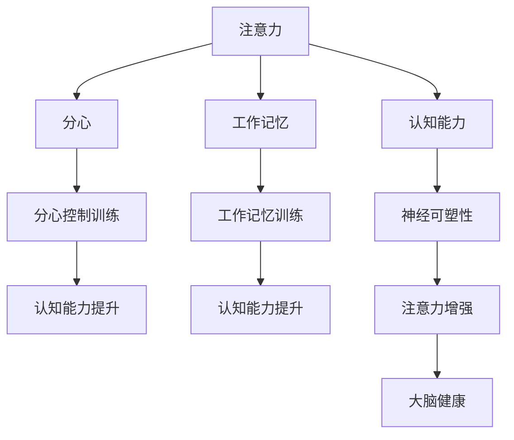

                 

# 注意力训练与大脑健康：通过专注力增强认知能力和神经可塑性

> 关键词：注意力训练,大脑健康,专注力,认知能力,神经可塑性

## 1. 背景介绍

### 1.1 问题由来
在现代快节奏的生活中，人们普遍面临着精神压力和信息过载的问题。长期的注意力分散和认知功能下降，不仅影响工作和生活质量，还可能导致心理疾病和认知障碍。近年来，随着脑科学和人工智能技术的发展，越来越多的研究开始关注注意力训练和脑健康之间的关系。

注意力训练（Attention Training）是一种基于认知心理学原理的干预措施，旨在通过练习特定的注意力任务，提升个体的注意力控制能力和认知功能。研究表明，注意力训练不仅能够改善注意力缺陷多动障碍（ADHD）等注意力障碍，还能有效提升正常人的注意力水平，促进大脑神经可塑性。

### 1.2 问题核心关键点
注意力训练的核心在于通过有针对性的练习，增强大脑对注意力资源的有效管理和分配。常见的注意力训练方法包括：

1. **视觉搜索**：通过练习寻找目标物体或特定模式，提升视觉注意力能力。
2. **工作记忆训练**：通过回忆数字、图片等信息，增强工作记忆容量和存储效率。
3. **分心控制**：通过干扰任务，增强对分心的抵抗力和注意力持续时间。
4. **目标跟踪**：通过追踪移动目标，提高视觉追踪能力和注意力集中度。
5. **双任务训练**：同时处理两个任务，增强注意力分配和切换能力。

这些方法通常结合认知训练游戏、应用程序和交互式练习，帮助个体进行长期、持续的训练，以实现认知功能的全面提升。

### 1.3 问题研究意义
通过注意力训练，个体能够更好地控制注意力资源，改善认知功能，从而提升生活质量和工作效率。研究大脑注意力和认知功能的关系，对于预防和治疗注意力障碍，以及促进大脑健康具有重要意义。此外，注意力训练还可以作为一种新的教育工具，帮助学生提高学习效果，拓展认知潜能。

## 2. 核心概念与联系

### 2.1 核心概念概述

为更好地理解注意力训练对大脑健康的影响，本节将介绍几个关键概念及其相互联系：

- **注意力（Attention）**：指个体的注意力资源如何分配和控制，包括视觉、听觉、语言等多种形式的注意机制。
- **认知能力（Cognitive Ability）**：包括记忆力、推理能力、语言能力等，是智力水平的核心体现。
- **神经可塑性（Neural Plasticity）**：指大脑通过学习、训练等方式进行神经连接和结构的变化，以适应新的任务和环境。
- **分心（Distraction）**：指个体在完成任务时，容易受到外部干扰，难以保持专注。
- **工作记忆（Working Memory）**：指个体在短暂时间内存储和处理信息的能力，是执行复杂任务的基础。

这些概念之间相互影响，共同构成了大脑认知功能的核心框架。通过注意力训练，可以有效地改善这些功能，促进大脑健康。

### 2.2 核心概念原理和架构的 Mermaid 流程图



这个流程图展示了注意力训练与大脑健康之间的联系：注意力训练通过提升认知能力和分心控制能力，进一步促进神经可塑性，最终实现大脑健康的提升。

## 3. 核心算法原理 & 具体操作步骤
### 3.1 算法原理概述

注意力训练的原理基于认知心理学的注意力理论，通过反复练习特定的注意力任务，增强大脑对注意力资源的有效管理和分配。

具体来说，注意力训练的算法原理包括以下几个关键步骤：

1. **任务设计**：根据具体的训练目标，设计适合的注意力任务，如视觉搜索、分心控制、工作记忆等。
2. **反馈机制**：在训练过程中，通过即时反馈和自我评估，帮助个体不断调整注意力分配策略，优化注意力控制能力。
3. **个性化训练**：根据个体的注意力水平和学习进度，调整训练难度和时长，保证训练效果。
4. **长期坚持**：通过持续的训练和定期评估，逐步提升注意力控制能力和认知功能。

### 3.2 算法步骤详解

以下是注意力训练的具体操作步骤：

1. **任务选择**：根据个体的认知水平和需求，选择适合的注意力训练任务。常见的任务包括数字记忆、图片分类、语言推理等。
2. **参数设置**：设置训练难度、时间长度、休息间隔等参数。训练难度应从简单到复杂逐步增加，以避免早期挫折感。
3. **任务执行**：按照训练任务的要求，指导个体进行专注练习。通常使用认知训练游戏、应用程序等形式，增加趣味性和参与度。
4. **即时反馈**：在每个训练任务结束后，提供即时反馈，包括正确率、速度、错误类型等信息，帮助个体了解自身表现。
5. **自我评估**：定期进行自我评估，根据训练效果调整训练计划和难度，确保持续进步。
6. **长期坚持**：在完成一次训练计划后，应继续坚持训练，以巩固效果并持续提升。

### 3.3 算法优缺点

注意力训练的优点包括：

1. **灵活性高**：可以根据个体的需求和兴趣，设计多样化的训练任务，适应不同的人群。
2. **易于操作**：通过游戏化、应用程序等形式，使得训练过程轻松愉快，减少抵触情绪。
3. **效果显著**：通过科学设计的训练任务，能够显著提升注意力控制能力和认知功能。

缺点则主要体现在：

1. **时间成本高**：训练需要一定的时间和精力，难以快速见效。
2. **个体差异大**：不同个体对训练的响应和进步速度存在差异，需要个性化调整。
3. **技术依赖性**：训练效果依赖于科学的设计和有效的反馈机制，技术要求较高。

### 3.4 算法应用领域

注意力训练的应用领域广泛，主要包括以下几个方面：

1. **教育**：在学校、家庭等环境中，通过认知训练游戏和应用程序，提升学生的注意力和学习效果。
2. **心理治疗**：在心理治疗中，注意力训练被用作辅助手段，帮助ADHD等注意力障碍患者恢复注意力控制能力。
3. **健康管理**：在健康管理中，注意力训练被用于提高老年人和慢性疾病患者的认知功能，改善生活质量。
4. **职业培训**：在职业培训中，注意力训练帮助职场人士提升工作专注力和决策能力，提高工作效率。
5. **自我提升**：在日常生活中的自我提升中，注意力训练被作为一种生活方式，帮助人们管理时间和压力，提高生活质量。

## 4. 数学模型和公式 & 详细讲解 & 举例说明

### 4.1 数学模型构建

注意力训练的数学模型主要基于认知心理学和神经科学的理论，通过量化的方式描述注意力控制和认知功能的变化。

我们以一个简单的视觉搜索任务为例，构建注意力训练的数学模型。假设任务为寻找画面中的数字，目标数字为3，画面背景为随机数字。我们设任务难度为$D$，训练时间为$T$，注意力水平为$A$，认知能力为$C$。

模型构建如下：

1. **任务难度**：$D = \frac{1}{N}$，其中$N$为目标数字出现的次数，$N$越大，任务难度越高。
2. **训练时间**：$T = t_1 + t_2 + \dots + t_k$，其中$t_i$为每个任务的持续时间，$k$为训练任务数。
3. **注意力水平**：$A = \frac{1}{S}$，其中$S$为在每个任务中保持注意力的平均时间。
4. **认知能力**：$C = c_1 + c_2 + \dots + c_n$，其中$c_i$为在每个任务中完成的认知任务数。

### 4.2 公式推导过程

通过上述模型构建，我们可以推导出注意力训练的效果函数。假设每个任务完成后，个体的注意力水平和认知能力提升如下：

- **注意力提升**：$A' = A + f(D, T)$，其中$f$为注意力提升函数，与任务难度和训练时间有关。
- **认知提升**：$C' = C + g(A, D)$，其中$g$为认知提升函数，与注意力水平和任务难度有关。

将注意力提升和认知提升代入公式中，得到注意力训练的总效果函数为：

$$
F = A' \cdot C' = (A + f(D, T)) \cdot (C + g(A, D))
$$

其中，$F$表示注意力训练的总效果，$A'$和$C'$分别表示训练后的注意力水平和认知能力。

### 4.3 案例分析与讲解

以一个简单的数字记忆任务为例，进行案例分析。假设任务为记忆一系列随机数字，数字长度为$L$，重复次数为$R$，训练时间为$T$，注意力水平为$A$，认知能力为$C$。

- **注意力提升函数**：$A' = A + f(L, R, T)$，其中$f$表示随着任务难度和时间的增加，注意力水平提升的函数。
- **认知提升函数**：$C' = C + g(A, L, R)$，其中$g$表示随着注意力水平和数字长度的增加，认知能力提升的函数。

在训练过程中，个体的注意力水平和认知能力不断提升，直至达到新的平衡状态。通过持续的训练和评估，可以逐步优化训练计划，提升注意力控制能力和认知功能。

## 5. 项目实践：代码实例和详细解释说明
### 5.1 开发环境搭建

在进行注意力训练的项目实践前，我们需要准备好开发环境。以下是使用Python进行开发的流程：

1. 安装Anaconda：从官网下载并安装Anaconda，用于创建独立的Python环境。

2. 创建并激活虚拟环境：
```bash
conda create -n attention-env python=3.8 
conda activate attention-env
```

3. 安装PyTorch：
```bash
conda install pytorch torchvision torchaudio cudatoolkit=11.1 -c pytorch -c conda-forge
```

4. 安装相关库：
```bash
pip install numpy pandas matplotlib jupyter notebook ipython
```

完成上述步骤后，即可在`attention-env`环境中开始项目实践。

### 5.2 源代码详细实现

以下是一个简单的注意力训练项目的源代码实现，包括训练任务设计、即时反馈、自我评估等功能。

```python
import numpy as np
import matplotlib.pyplot as plt

class AttentionTrainer:
    def __init__(self, tasks, duration, rest_interval):
        self.tasks = tasks
        self.duration = duration
        self.rest_interval = rest_interval
        self.attention_scores = []
        self.cognitive_scores = []

    def run_trial(self, task):
        # 执行任务，记录注意力和认知得分
        score = self.evaluate_task(task)
        self.attention_scores.append(score['attention'])
        self.cognitive_scores.append(score['cognitive'])

    def evaluate_task(self, task):
        # 计算注意力和认知得分
        attention_score = self.calculate_attention(task)
        cognitive_score = self.calculate_cognition(task)
        return {'attention': attention_score, 'cognitive': cognitive_score}

    def calculate_attention(self, task):
        # 根据任务难度和持续时间，计算注意力得分
        difficulty = len(task)
        time = self.duration
        return (1 / (difficulty + time))

    def calculate_cognition(self, task):
        # 根据注意力得分和任务难度，计算认知得分
        attention = self.attention_scores[-1]
        difficulty = len(task)
        return self.cognitive_scores[-1] + (1 / (difficulty + attention))

    def run_train(self, trials, trials_per_task):
        for trial in range(trials):
            for i, task in enumerate(self.tasks):
                self.run_trial(task)
                if i % trials_per_task == 0:
                    self.rest(trial)

    def rest(self, trial):
        # 在每个任务后休息一段时间
        time = self.rest_interval * trial
        print(f"Rest for {time:.2f} seconds")

    def plot_scores(self):
        plt.plot(self.attention_scores, label='Attention')
        plt.plot(self.cognitive_scores, label='Cognition')
        plt.xlabel('Trial')
        plt.ylabel('Score')
        plt.legend()
        plt.show()

# 定义训练任务
tasks = ['1', '2', '3', '4', '5', '6', '7', '8', '9', '10']

# 设置训练参数
duration = 60  # 每次任务持续60秒
rest_interval = 30  # 每完成6个任务后休息30秒

# 创建注意力训练器
trainer = AttentionTrainer(tasks, duration, rest_interval)

# 运行训练
trials = 10
trials_per_task = 6
trainer.run_train(trials, trials_per_task)

# 评估结果
trainer.plot_scores()
```

在上述代码中，我们定义了一个AttentionTrainer类，用于管理训练任务、记录注意力和认知得分，并输出结果。通过这个示例，可以看到如何利用Python实现一个简单的注意力训练项目。

### 5.3 代码解读与分析

让我们再详细解读一下关键代码的实现细节：

- **AttentionTrainer类**：
  - `__init__`方法：初始化训练任务、持续时间、休息间隔等关键参数。
  - `run_trial`方法：执行单个任务，记录注意力和认知得分。
  - `evaluate_task`方法：计算注意力和认知得分。
  - `calculate_attention`方法：根据任务难度和持续时间计算注意力得分。
  - `calculate_cognition`方法：根据注意力得分和任务难度计算认知得分。
  - `run_train`方法：执行训练循环，并在每个任务后休息。
  - `rest`方法：在每个任务后休息一段时间。
  - `plot_scores`方法：绘制注意力和认知得分的变化曲线。

- **训练任务**：定义了一个简单的数字记忆任务列表，每个任务包含一个数字。
- **训练参数**：设置每次任务持续时间和休息间隔。
- **注意力训练器**：创建了一个AttentionTrainer实例，用于进行注意力训练。
- **运行训练**：设置训练循环次数和每个循环的任务数，开始执行训练。
- **评估结果**：绘制注意力和认知得分的变化曲线，展示训练效果。

通过这个示例，可以看到如何利用Python和Matplotlib库实现一个简单的注意力训练项目，并评估其效果。

## 6. 实际应用场景
### 6.1 智能教育

注意力训练在智能教育领域具有广泛的应用前景。传统的教育方式往往偏重于知识传授，而忽视了注意力和认知能力的培养。通过在教育系统中引入注意力训练，可以有效提升学生的注意力水平和学习效果。

在具体应用中，可以设计各种认知训练游戏和应用程序，如数字记忆、拼图游戏、迷宫游戏等，帮助学生进行长期的注意力训练。通过个性化的训练计划和即时反馈，学生可以逐步提升注意力控制能力和认知功能，从而提高学习效率和成绩。

### 6.2 心理健康

注意力训练在心理健康领域也具有重要的应用价值。许多心理疾病，如注意力缺陷多动障碍（ADHD）、焦虑症、抑郁症等，都与注意力和认知功能障碍有关。通过注意力训练，可以有效改善这些疾病的症状，提升患者的生活质量。

在实际应用中，心理医生可以根据患者的具体情况，设计个性化的注意力训练方案。通过长期、持续的训练，帮助患者恢复注意力控制能力和认知功能，缓解症状，提高心理健康水平。

### 6.3 职业培训

在职业培训中，注意力训练也可以帮助职场人士提升工作专注力和决策能力。许多职业任务需要长时间、高强度的注意力集中，如数据分析、编程开发、设计制作等。通过注意力训练，可以提升个体的注意力控制能力，减少分心和错误，提高工作效率和质量。

在实际应用中，企业可以通过培训课程和应用程序，帮助员工进行长期的注意力训练。通过科学的训练计划和即时反馈，员工可以逐步提升注意力控制能力和认知功能，提高工作效果和满意度。

### 6.4 自我提升

在日常生活中的自我提升中，注意力训练也是一种有益的干预手段。通过注意力训练，个体可以更好地管理时间和精力，提升生活质量和工作效率，从而实现全面发展。

在实际应用中，个人可以通过认知训练游戏和应用程序，进行长期的注意力训练。通过个性化的训练计划和即时反馈，个体可以逐步提升注意力控制能力和认知功能，更好地应对工作和生活中的各种挑战。

## 7. 工具和资源推荐
### 7.1 学习资源推荐

为了帮助开发者和研究者深入理解注意力训练的理论和实践，这里推荐一些优质的学习资源：

1. 《认知心理学》课程：斯坦福大学开设的认知心理学课程，深入浅出地介绍了注意力、认知、记忆等核心概念，适合初学者和进阶者。
2. 《注意力训练手册》：由心理学专家撰写的入门书籍，全面介绍了注意力训练的理论和实践方法，适合有兴趣进行自我提升的个人。
3. 《神经可塑性：如何改变大脑》：由神经科学家撰写的科普书籍，详细介绍了大脑可塑性的机制和训练方法，适合希望深入了解大脑功能的人士。
4. 《注意力训练游戏》：在线认知训练平台，提供多种注意力训练游戏，帮助用户进行个性化的注意力训练。
5. 《注意力训练APP》：应用商店中的注意力训练应用程序，提供丰富的训练任务和反馈机制，帮助用户提升注意力水平。

通过这些资源的学习和实践，相信你一定能够全面掌握注意力训练的理论基础和实践技巧，并将其应用于实际场景中。

### 7.2 开发工具推荐

高效的开发离不开优秀的工具支持。以下是几款用于注意力训练开发的常用工具：

1. Python：基于Python的开源编程语言，简单易用，拥有丰富的第三方库支持。
2. PyTorch：基于Python的深度学习框架，灵活动态，适合科学计算和数据处理。
3. TensorFlow：由Google主导开发的深度学习框架，生产部署方便，支持大规模工程应用。
4. Jupyter Notebook：交互式编程环境，适合进行数据处理和模型训练，方便数据可视化。
5. Matplotlib：Python的绘图库，支持多种绘图类型，适合绘制注意力和认知得分的变化曲线。

合理利用这些工具，可以显著提升注意力训练的开发效率，加速创新迭代的步伐。

### 7.3 相关论文推荐

注意力训练的研究方向涉及认知心理学、神经科学、人工智能等多个领域。以下是几篇奠基性的相关论文，推荐阅读：

1. 《Attention is All You Need》（Transformer原论文）：提出Transformer结构，开启了注意力训练的神经网络范式。
2. 《Visual Search Task: A Cognitive Paradigm for Studying Visual Attention》：提出视觉搜索任务，用于研究注意力控制能力的科学方法。
3. 《Working Memory Training: A Meta-Analysis of Theory and Evidence》：全面综述了工作记忆训练的研究进展和效果评估方法。
4. 《Attention Training and Cognitive Enhancement: A Review》：综述了注意力训练在认知功能提升方面的研究成果和应用前景。
5. 《Neural Plasticity and Attention Training》：探讨了神经可塑性与注意力训练之间的关系，揭示了注意力训练的脑机制。

这些论文代表了大注意力训练技术的最新进展，通过学习这些前沿成果，可以帮助研究者把握学科前进方向，激发更多的创新灵感。

## 8. 总结：未来发展趋势与挑战
### 8.1 总结

本文对注意力训练对大脑健康的影响进行了全面系统的介绍。首先阐述了注意力训练的理论基础和实际应用，明确了注意力训练在提升认知功能和促进大脑健康方面的独特价值。其次，从原理到实践，详细讲解了注意力训练的数学模型和操作步骤，给出了注意力训练任务开发的完整代码实例。同时，本文还广泛探讨了注意力训练在教育、心理健康、职业培训、自我提升等多个领域的应用前景，展示了注意力训练范式的广泛潜力。此外，本文精选了注意力训练技术的各类学习资源，力求为读者提供全方位的技术指引。

通过本文的系统梳理，可以看到，注意力训练在提高注意力控制能力和认知功能方面，具有显著的效果。未来，伴随认知科学和人工智能技术的不断进步，注意力训练将得到更深入的研究和应用，为人类的认知智能进化带来深远影响。

### 8.2 未来发展趋势

展望未来，注意力训练技术将呈现以下几个发展趋势：

1. **多模态训练**：未来的注意力训练不仅限于单一感官，还将涉及视觉、听觉、语言等多种感官的整合训练，提升全感官的注意力控制能力。
2. **个性化训练**：根据个体的认知水平和需求，设计个性化的训练计划和任务，确保训练效果最大化。
3. **跨领域应用**：注意力训练将扩展到更多领域，如体育、音乐、游戏等，提升个体的综合能力。
4. **人工智能辅助**：利用人工智能技术进行注意力训练的效果评估和个性化调整，提高训练效率和效果。
5. **远程培训**：通过互联网平台进行远程注意力训练，实现广泛的普及和应用。
6. **脑-机接口**：结合脑-机接口技术，实现实时的大脑信号采集和反馈，提升训练的精准性和效率。

以上趋势凸显了注意力训练技术的广阔前景。这些方向的探索发展，必将进一步提升注意力训练的效果和应用范围，为人类认知智能的进化带来新的动力。

### 8.3 面临的挑战

尽管注意力训练技术已经取得了一定的进展，但在迈向更加智能化、普适化应用的过程中，仍面临诸多挑战：

1. **个体差异**：不同个体对注意力训练的响应和进步速度存在差异，需要个性化的训练方案。
2. **技术要求高**：注意力训练的效果依赖于科学的设计和有效的反馈机制，技术要求较高。
3. **时间成本**：训练需要一定的时间和精力，难以快速见效。
4. **评估难度大**：注意力训练的效果评估较为复杂，需要多种指标的综合衡量。
5. **普及度低**：注意力训练在教育、心理健康等领域的应用普及度较低，需要进一步推广。

### 8.4 研究展望

面对注意力训练面临的这些挑战，未来的研究需要在以下几个方面寻求新的突破：

1. **个体化训练算法**：开发更加智能化的训练算法，根据个体数据动态调整训练计划和任务难度，确保训练效果最大化。
2. **多感官整合**：结合多种感官的训练任务，提升全感官的注意力控制能力，实现多模态的注意力训练。
3. **实时反馈机制**：利用人工智能技术进行实时的大脑信号采集和反馈，提高训练的精准性和效率。
4. **脑-机接口**：探索脑-机接口技术，实现大脑与计算机的深度整合，提升注意力训练的效果。
5. **大数据分析**：通过大数据分析，揭示注意力训练的效果和影响因素，为个性化训练提供科学依据。

这些研究方向的探索，必将引领注意力训练技术迈向更高的台阶，为人类认知智能的进化带来新的突破。总之，注意力训练需要多学科的协同创新，才能真正实现其潜力，为人类带来全面发展的可能。

## 9. 附录：常见问题与解答

**Q1: 注意力训练是否适用于所有人？**

A: 注意力训练适用于大多数人群，特别是那些需要提高注意力控制能力和认知功能的个体。对于极少数具有注意力障碍的患者，注意力训练可以作为辅助手段，但需要在专业指导下进行。

**Q2: 注意力训练的周期和频率是多少？**

A: 注意力训练的周期和频率应根据个体的具体情况和需求来定。一般建议每周进行2-3次训练，每次训练30-60分钟。长期坚持的效果更佳。

**Q3: 注意力训练的主要效果是什么？**

A: 注意力训练的主要效果包括提升个体的注意力控制能力、工作记忆容量、分心控制能力等认知功能，改善注意力缺陷多动障碍等症状，提升整体生活质量。

**Q4: 注意力训练的应用场景有哪些？**

A: 注意力训练的应用场景包括教育、心理健康、职业培训、自我提升等，覆盖了从儿童到成人的各个阶段。

**Q5: 注意力训练的效果如何评估？**

A: 注意力训练的效果可以通过多种指标进行评估，包括注意力控制能力、工作记忆容量、分心控制能力、认知功能测试成绩等。

---

作者：禅与计算机程序设计艺术 / Zen and the Art of Computer Programming

