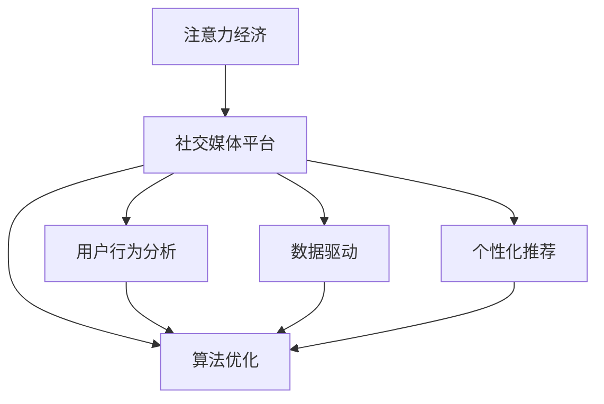

                 

# 注意力货币化：社交媒体平台是如何争夺你的时间和精力的

> 关键词：注意力经济,社交媒体,平台策略,用户行为分析,数据驱动,算法优化

## 1. 背景介绍

### 1.1 问题由来

社交媒体平台的兴起，已经深刻改变了人们获取信息、交流互动的方式。无论是Facebook、Twitter、Instagram、微信等，都在我们日常生活中扮演着重要的角色。然而，这些平台不仅仅是社交工具，更是经济体，它们通过吸引和利用用户的时间与注意力，实现商业价值的创造和增长。

这一现象引发了广泛的社会关注和讨论。如何理解社交媒体平台如何争夺用户的时间和注意力？它们是如何通过算法优化，实现这一目标的？本文将深入分析社交媒体平台注意力货币化的原理与策略。

### 1.2 问题核心关键点

社交媒体平台的核心在于吸引用户注意力，通过广告、推荐系统等机制，实现流量变现。这其中，算法扮演了至关重要的角色。

- 注意力经济：利用用户的时间与注意力作为商品进行商业运作的经济模式。
- 社交媒体平台：通过连接用户，提供社交互动与信息分享的平台。
- 用户行为分析：通过对用户的行为和偏好进行分析，了解用户的需求与兴趣。
- 数据驱动：利用大数据技术，优化推荐算法，提升用户体验。
- 算法优化：通过迭代改进算法，提高用户黏性，增加用户时长。
- 个性化推荐：根据用户的历史行为和偏好，推荐相关信息和内容。

## 2. 核心概念与联系

### 2.1 核心概念概述

要理解社交媒体平台注意力货币化的原理与策略，首先需要了解一些关键概念：

- 注意力经济：指在经济活动中，通过吸引和利用人们的时间与注意力，获取经济价值的过程。注意力被视为一种无形资产，可以通过广告、付费会员、内容订阅等方式进行货币化。
- 社交媒体平台：如Facebook、Twitter、Instagram、微信等，提供社交互动、内容分享与信息获取的平台。它们通过吸引用户，提供丰富的社交功能与内容服务，建立庞大的用户群体。
- 用户行为分析：利用数据挖掘、机器学习等技术，分析用户的行为和偏好，了解用户需求与兴趣，从而制定精准的用户营销策略。
- 数据驱动：指在决策过程中，以数据分析为基础，而非经验判断，通过数据驱动算法优化，提高业务效率。
- 算法优化：通过不断迭代改进算法模型，提高算法的预测能力和用户满意度。
- 个性化推荐：根据用户的历史行为和偏好，推荐相关信息与内容，提高用户参与度和满意度。

这些概念之间的逻辑关系可以通过以下Mermaid流程图来展示：



这个流程图展示了社交媒体平台注意力货币化的一般流程：

1. 注意力经济被视为社交媒体平台的核心价值。
2. 通过用户行为分析，了解用户需求与兴趣。
3. 基于数据驱动，优化算法模型。
4. 通过算法优化，提高个性化推荐的效果。
5. 最终，通过个性化推荐提升用户黏性和参与度。

这些概念共同构成了社交媒体平台注意力货币化的基础，使其能够有效吸引和利用用户的时间与注意力。

## 3. 核心算法原理 & 具体操作步骤
### 3.1 算法原理概述

社交媒体平台的注意力货币化，主要依赖于个性化推荐算法。这些算法通过分析用户的历史行为和兴趣，预测其未来的行为，从而实现精准推荐，提升用户参与度和满意度。

算法原理主要包括以下几个步骤：

1. **数据收集与预处理**：收集用户的互动数据，如点赞、评论、分享等行为，通过数据清洗与特征提取，为后续分析打下基础。
2. **用户建模**：通过分析用户的历史行为，构建用户兴趣模型，识别出用户的兴趣点和偏好。
3. **推荐模型训练**：利用机器学习技术，训练推荐模型，预测用户对新内容的兴趣。
4. **推荐策略优化**：根据用户的实时反馈，不断调整推荐策略，提高推荐效果。
5. **用户参与度评估**：通过评估用户参与度，如点击率、停留时间、互动率等指标，反馈到算法模型中，进一步优化。

### 3.2 算法步骤详解

接下来，我们将详细讲解社交媒体平台个性化推荐算法的主要步骤：

**Step 1: 数据收集与预处理**

数据收集是个性化推荐算法的基础。社交媒体平台通过API接口、日志文件等方式，收集用户的操作数据。

具体而言，数据收集包括以下几个方面：

- 用户基本信息：如年龄、性别、地理位置等。
- 用户行为数据：如浏览页面、点赞、评论、分享等互动行为。
- 内容特征数据：如文章标题、标签、发布时间等。

数据预处理包括数据清洗、去重、缺失值处理等，确保数据的质量和一致性。同时，需要对数据进行特征提取，如TF-IDF、词频等，以供后续建模使用。

**Step 2: 用户建模**

用户建模是推荐算法的关键步骤。通过分析用户的历史行为，构建用户兴趣模型。

具体而言，用户建模包括以下几个步骤：

- 用户行为序列建模：将用户的历史行为序列化，形成用户行为序列。
- 用户兴趣点提取：通过聚类、TF-IDF等方法，提取用户的兴趣点和偏好。
- 用户行为向量表示：将用户兴趣点转化为向量表示，用于后续推荐模型训练。

**Step 3: 推荐模型训练**

推荐模型训练是个性化推荐算法的核心。通过机器学习技术，训练推荐模型，预测用户对新内容的兴趣。

具体而言，推荐模型训练包括以下几个步骤：

- 选择合适的机器学习算法，如协同过滤、矩阵分解、深度学习等。
- 构建推荐模型，如矩阵分解模型、神经网络模型等。
- 训练推荐模型，使用用户行为数据进行模型参数优化。

**Step 4: 推荐策略优化**

推荐策略优化是个性化推荐算法的保障。通过不断调整推荐策略，提高推荐效果。

具体而言，推荐策略优化包括以下几个步骤：

- 实时反馈：收集用户的实时反馈，如点击率、停留时间等指标。
- 算法迭代：根据用户反馈，不断调整推荐模型参数，优化推荐策略。
- A/B测试：使用A/B测试方法，评估推荐策略的效果，选择最优策略。

**Step 5: 用户参与度评估**

用户参与度评估是个性化推荐算法的评估指标。通过评估用户参与度，反馈到算法模型中，进一步优化。

具体而言，用户参与度评估包括以下几个指标：

- 点击率：用户对推荐内容的点击次数。
- 停留时间：用户浏览推荐内容的时间。
- 互动率：用户对推荐内容的互动行为，如点赞、评论等。

### 3.3 算法优缺点

社交媒体平台个性化推荐算法具有以下优点：

1. 提高用户体验：通过精准推荐，满足用户个性化需求，提升用户满意度。
2. 增加用户黏性：提高用户参与度，增加用户在平台上的停留时间。
3. 提升转化率：精准推荐有效引导用户点击广告、购买商品等，提高转化率。

同时，该算法也存在一些缺点：

1. 依赖标注数据：推荐算法需要大量的标注数据进行训练，而获取高质量的标注数据成本较高。
2. 数据隐私问题：收集用户行为数据可能涉及用户隐私，需严格遵守数据保护法规。
3. 信息过载：推荐算法可能过度推荐类似内容，导致用户信息过载。
4. 算法偏见：推荐算法可能存在算法偏见，导致不公正推荐。
5. 模型复杂度高：推荐模型复杂度较高，对计算资源要求较高。

### 3.4 算法应用领域

个性化推荐算法在社交媒体平台的应用广泛，涵盖了以下几个方面：

- 内容推荐：推荐用户感兴趣的文章、视频、图片等。
- 广告推荐：推荐用户感兴趣的广告内容，增加广告点击率。
- 电商推荐：推荐用户感兴趣的商品，提高电商平台的销售转化率。
- 社交关系推荐：推荐用户感兴趣的朋友、群组，增加社交互动。

除了上述这些应用外，个性化推荐算法还广泛应用于新闻推荐、音乐推荐、视频推荐等多个领域，为不同场景下的用户提供个性化服务。

## 4. 数学模型和公式 & 详细讲解 & 举例说明

### 4.1 数学模型构建

社交媒体平台个性化推荐算法的数学模型主要基于协同过滤、矩阵分解和深度学习等技术。这里以协同过滤为例，介绍推荐模型的构建过程。

设用户集合为 $U$，物品集合为 $I$，用户对物品的评分矩阵为 $R \in \mathbb{R}^{m \times n}$，其中 $m$ 为用户的数量，$n$ 为物品的数量，$r_{ui}$ 表示用户 $u$ 对物品 $i$ 的评分。

协同过滤算法通过计算用户和物品的相似度，预测用户对新物品的评分。设用户 $u$ 和物品 $i$ 的相似度为 $s_{ui}$，则推荐模型可以表示为：

$$
\hat{r}_{ui} = \sum_{v \in U} \alpha_{uv} r_{vi}
$$

其中，$\alpha_{uv}$ 为相似度系数，用于调整用户 $u$ 和物品 $v$ 的权重。

### 4.2 公式推导过程

推荐模型中，相似度系数 $\alpha_{uv}$ 的计算方式有多种，这里以余弦相似度为例进行推导：

设用户 $u$ 和物品 $i$ 的向量表示分别为 $\mathbf{u}$ 和 $\mathbf{i}$，则余弦相似度可以表示为：

$$
s_{ui} = \cos \langle \mathbf{u}, \mathbf{i} \rangle = \frac{\mathbf{u}^T \mathbf{i}}{\|\mathbf{u}\| \|\mathbf{i}\|}
$$

根据上式，相似度系数 $\alpha_{uv}$ 可以表示为：

$$
\alpha_{uv} = \frac{s_{ui} s_{vi}}{s_{ui} s_{vi} + \epsilon}
$$

其中，$\epsilon$ 为防止分母为零的常数，通常取 $10^{-6}$。

### 4.3 案例分析与讲解

以Facebook为例，分析其个性化推荐算法的具体实现。

**数据收集与预处理**

Facebook通过API接口收集用户的操作数据，包括点赞、评论、分享等行为。数据预处理包括去重、缺失值处理等，确保数据质量。

**用户建模**

Facebook利用用户的历史行为，构建用户兴趣模型。具体而言，Facebook将用户的历史行为序列化，使用TF-IDF方法提取用户兴趣点，并将其转化为向量表示。

**推荐模型训练**

Facebook使用矩阵分解模型进行推荐。模型构建如下：

$$
R \approx \mathbf{U} \mathbf{V}^T
$$

其中，$\mathbf{U}$ 为用户向量矩阵，$\mathbf{V}$ 为物品向量矩阵。

通过矩阵分解模型，Facebook可以预测用户对新物品的评分，并进行推荐。

**推荐策略优化**

Facebook通过实时反馈和A/B测试方法，不断调整推荐策略。例如，通过点击率、停留时间等指标，反馈到算法模型中，进一步优化推荐策略。

**用户参与度评估**

Facebook通过点击率、停留时间等指标，评估用户参与度。例如，通过点击率指标，评估用户对推荐内容的兴趣。

## 5. 项目实践：代码实例和详细解释说明
### 5.1 开发环境搭建

在进行个性化推荐算法实践前，我们需要准备好开发环境。以下是使用Python进行Scikit-learn和TensorFlow开发的典型环境配置流程：

1. 安装Anaconda：从官网下载并安装Anaconda，用于创建独立的Python环境。

2. 创建并激活虚拟环境：
```bash
conda create -n recommendation-env python=3.8 
conda activate recommendation-env
```

3. 安装必要的Python包：
```bash
pip install scikit-learn tensorflow pandas
```

4. 安装数据集：例如，可以使用Kaggle上的数据集进行训练和测试，如MovieLens、Amazon Reviews等。

5. 准备数据集：将数据集划分为训练集和测试集，并进行数据清洗、特征提取等预处理操作。

完成上述步骤后，即可在`recommendation-env`环境中开始算法实践。

### 5.2 源代码详细实现

这里我们以协同过滤算法为例，给出使用Scikit-learn和TensorFlow对个性化推荐模型进行训练和测试的Python代码实现。

```python
from sklearn.model_selection import train_test_split
from sklearn.metrics import mean_squared_error, mean_absolute_error
from tensorflow.keras.layers import Dense, Input, Embedding, Flatten
from tensorflow.keras.models import Model

# 加载数据集
X, y = load_data()

# 数据预处理
X_train, X_test, y_train, y_test = train_test_split(X, y, test_size=0.2)

# 构建模型
user_input = Input(shape=(1,))
item_input = Input(shape=(1,))
user_vector = Embedding(input_dim=num_users, output_dim=128, mask_zero=True)(user_input)
item_vector = Embedding(input_dim=num_items, output_dim=128, mask_zero=True)(item_input)
user_item_dot = Dot(axes=2)([user_vector, item_vector])
user_item_sum = Flatten()(user_item_dot)
output = Dense(1, activation='linear')(user_item_sum)

model = Model(inputs=[user_input, item_input], outputs=output)
model.compile(optimizer='adam', loss='mse')

# 模型训练
model.fit([X_train[:, 0], X_train[:, 1]], y_train, epochs=10, validation_data=([X_test[:, 0], X_test[:, 1]], y_test))

# 模型测试
y_pred = model.predict([X_test[:, 0], X_test[:, 1]])
rmse = mean_squared_error(y_test, y_pred)

print('RMSE:', rmse)
```

在这个代码示例中，我们使用Scikit-learn和TensorFlow构建了一个简单的协同过滤推荐模型。具体步骤如下：

1. 加载数据集并进行数据预处理。
2. 构建模型，使用Embedding层将用户和物品的ID转化为向量表示，并通过Dot层计算用户和物品的相似度，最终通过Dense层进行预测。
3. 编译模型并设置优化器和损失函数。
4. 训练模型，使用训练集进行迭代优化。
5. 测试模型，使用测试集进行评估，并计算RMSE指标。

### 5.3 代码解读与分析

以下是代码中各部分的详细解读：

**数据加载与预处理**

```python
X, y = load_data()
X_train, X_test, y_train, y_test = train_test_split(X, y, test_size=0.2)
```

这里我们使用`load_data()`函数加载数据集，并将数据划分为训练集和测试集。

**模型构建**

```python
user_input = Input(shape=(1,))
item_input = Input(shape=(1,))
user_vector = Embedding(input_dim=num_users, output_dim=128, mask_zero=True)(user_input)
item_vector = Embedding(input_dim=num_items, output_dim=128, mask_zero=True)(item_input)
user_item_dot = Dot(axes=2)([user_vector, item_vector])
user_item_sum = Flatten()(user_item_dot)
output = Dense(1, activation='linear')(user_item_sum)
```

我们使用`Input`层定义用户和物品的输入，并使用`Embedding`层将其转化为向量表示。通过`Dot`层计算用户和物品的相似度，并使用`Flatten`层将相似度结果展开，最终通过`Dense`层进行预测。

**模型编译**

```python
model = Model(inputs=[user_input, item_input], outputs=output)
model.compile(optimizer='adam', loss='mse')
```

我们定义模型，并使用`compile`方法设置优化器和损失函数。

**模型训练**

```python
model.fit([X_train[:, 0], X_train[:, 1]], y_train, epochs=10, validation_data=([X_test[:, 0], X_test[:, 1]], y_test))
```

我们使用`fit`方法训练模型，并设置训练轮数。

**模型测试**

```python
y_pred = model.predict([X_test[:, 0], X_test[:, 1]])
rmse = mean_squared_error(y_test, y_pred)
```

我们使用`predict`方法预测测试集，并计算RMSE指标进行评估。

## 6. 实际应用场景
### 6.1 智能推荐系统

个性化推荐算法在智能推荐系统中得到了广泛应用。智能推荐系统通过分析用户的历史行为，为用户推荐感兴趣的内容，提高用户满意度和黏性。

以Amazon为例，其推荐系统通过分析用户的浏览记录和购买行为，为用户推荐商品。Amazon的推荐系统包括基于内容的推荐、协同过滤推荐、混合推荐等多种算法，并通过A/B测试等方法不断优化推荐策略。

### 6.2 广告推荐系统

广告推荐系统通过分析用户的行为和兴趣，为用户推荐个性化的广告内容，提高广告的点击率和转化率。

以Google AdWords为例，其广告推荐系统通过分析用户的搜索记录和点击行为，为用户推荐相关广告。Google AdWords的推荐系统包括基于关键词的推荐、基于上下文的推荐、实时竞价等多种算法，并通过A/B测试等方法不断优化推荐策略。

### 6.3 社交媒体平台

社交媒体平台通过分析用户的行为和兴趣，为用户推荐感兴趣的内容，提高用户参与度和黏性。

以Facebook为例，其推荐系统通过分析用户的点赞、评论、分享等行为，为用户推荐感兴趣的文章、视频、朋友等。Facebook的推荐系统包括基于内容的推荐、协同过滤推荐、时间因素等算法，并通过A/B测试等方法不断优化推荐策略。

### 6.4 未来应用展望

随着数据和算法的不断进步，个性化推荐算法将在更多领域得到应用，为各个行业带来新的商业机会。

在智慧医疗领域，个性化推荐算法可以用于推荐药品、医疗服务，提升医疗质量和效率。

在智能教育领域，个性化推荐算法可以用于推荐学习资源、课程，提高学习效果。

在智慧城市治理中，个性化推荐算法可以用于推荐公共服务、娱乐活动，提高城市管理水平。

此外，在企业生产、社会治理、文娱传媒等众多领域，个性化推荐算法都将发挥重要作用，推动各行各业数字化转型。

## 7. 工具和资源推荐
### 7.1 学习资源推荐

为了帮助开发者系统掌握个性化推荐算法的原理与实践，这里推荐一些优质的学习资源：

1. 《推荐系统实践》书籍：全面介绍了推荐系统的基本概念和经典算法，涵盖协同过滤、矩阵分解、深度学习等多种推荐方法。
2. Kaggle推荐系统竞赛：参加Kaggle的推荐系统竞赛，可以深入理解推荐算法在实际应用中的实现。
3. Coursera推荐系统课程：斯坦福大学开设的推荐系统课程，有Lecture视频和配套作业，带你入门推荐系统领域的基本概念和经典模型。
4. Udacity推荐系统纳米学位：Udacity推出的推荐系统课程，涵盖协同过滤、矩阵分解、深度学习等多种推荐方法。

通过对这些资源的学习实践，相信你一定能够快速掌握个性化推荐算法的精髓，并用于解决实际的推荐问题。

### 7.2 开发工具推荐

高效的开发离不开优秀的工具支持。以下是几款用于个性化推荐系统开发的常用工具：

1. TensorFlow：由Google主导开发的开源深度学习框架，生产部署方便，适合大规模工程应用。
2. PyTorch：基于Python的开源深度学习框架，灵活动态的计算图，适合快速迭代研究。
3. Scikit-learn：基于Python的机器学习库，提供了多种推荐算法和评估指标。
4. H2O.ai：开源的机器学习平台，提供了简单易用的推荐算法和可视化界面。
5. Apache Mahout：Apache基金会下的机器学习库，提供了多种推荐算法和分布式处理能力。

合理利用这些工具，可以显著提升个性化推荐系统的开发效率，加快创新迭代的步伐。

### 7.3 相关论文推荐

个性化推荐算法的不断发展离不开学界的持续研究。以下是几篇奠基性的相关论文，推荐阅读：

1. Koren, Y., & Bell, K. L. (2010). Factorization meets the Neighborhood: A multifaceted collaborative filtering model. In Proceedings of the 7th ACM SIGKDD international conference on Knowledge discovery and data mining (pp. 426-434). ACM.
2. He, L., & Koren, Y. (2007). Context-aware collaborative filtering. In Proceedings of the 18th ACM SIGKDD international conference on Knowledge discovery and data mining (pp. 849-856). ACM.
3. Wu, Y., Liu, Y., & Yang, Y. (2016). A comprehensive survey on multidimensional collaborative filtering. International Journal of Computational Intelligence Systems, 9(2), 264-286.
4. Mnih, A., Korattikara, A., Kavukcuoglu, K., & Lillicrap, T. (2013). Learning to optimize. arXiv preprint arXiv:1308.3432.
5. Hinton, G. E., Osindero, S., & Teh, Y. W. (2006). A fast learning algorithm for deep belief nets. Neural computation, 18(7), 1527-1554.
6. Salakhutdinov, R. R., & Mnih, A. (2008). Probabilistic matrix factorization techniques for collaborative prediction. IEEE transactions on knowledge and data engineering, 20(3), 322-330.

这些论文代表了个性化推荐算法的发展脉络。通过学习这些前沿成果，可以帮助研究者把握学科前进方向，激发更多的创新灵感。

## 8. 总结：未来发展趋势与挑战
### 8.1 总结

本文对个性化推荐算法的原理与实践进行了全面系统的介绍。首先阐述了社交媒体平台注意力货币化的原理与策略，明确了个性化推荐算法在提升用户参与度和满意度方面的重要价值。其次，从算法原理到具体操作步骤，详细讲解了个性化推荐算法的构建和优化方法，给出了推荐系统的典型代码实现。同时，本文还广泛探讨了推荐算法在智能推荐系统、广告推荐系统、社交媒体平台等多个领域的应用前景，展示了个性化推荐算法的广阔应用空间。

通过本文的系统梳理，可以看到，个性化推荐算法通过精准推荐，有效提高了用户的参与度和满意度，是社交媒体平台吸引用户注意力、实现流量变现的重要手段。未来，伴随数据和算法的不断进步，个性化推荐算法将会在更多领域得到应用，为各个行业带来新的商业机会。

### 8.2 未来发展趋势

展望未来，个性化推荐算法将呈现以下几个发展趋势：

1. 数据驱动的个性化推荐：随着数据量的不断增长，个性化推荐算法将更加依赖数据驱动，提升推荐精度和效果。
2. 多模态数据的融合：将视觉、语音、文本等多种模态数据进行融合，提升推荐系统的智能化水平。
3. 实时推荐系统：通过实时数据流处理，实现动态推荐，提高推荐的时效性和个性化程度。
4. 深度学习技术的引入：利用深度学习技术，提升推荐算法的复杂度和精度，实现更精准的推荐。
5. 推荐算法的多样化：引入更多推荐算法，如基于内容推荐、协同过滤推荐、基于混合模型的推荐等，提升推荐系统的鲁棒性和灵活性。

以上趋势凸显了个性化推荐算法的广阔前景，将进一步提升推荐系统的智能化水平，为用户带来更好的体验。

### 8.3 面临的挑战

尽管个性化推荐算法已经取得了显著成效，但在迈向更加智能化、个性化应用的过程中，它仍面临着诸多挑战：

1. 数据隐私问题：个性化推荐算法需要收集用户行为数据，涉及用户隐私，需严格遵守数据保护法规。
2. 推荐系统的透明性：用户对推荐算法的透明性需求越来越高，如何让用户理解推荐逻辑和决策依据，仍需进一步探索。
3. 推荐系统的公平性：个性化推荐算法可能存在推荐偏见，需引入公平性评估指标，确保推荐公平。
4. 推荐系统的鲁棒性：个性化推荐算法在应对突发事件和噪声数据时，需具备较强的鲁棒性，确保推荐系统的稳定性。
5. 推荐系统的复杂性：个性化推荐算法模型复杂度高，需优化算法模型，提高推荐效率。

正视这些挑战，积极应对并寻求突破，将是个性化推荐算法走向成熟的重要步骤。

### 8.4 研究展望

面对个性化推荐算法所面临的挑战，未来的研究需要在以下几个方面寻求新的突破：

1. 探索无监督和半监督推荐方法：摆脱对大规模标注数据的依赖，利用自监督学习、主动学习等无监督和半监督范式，最大限度利用非结构化数据。
2. 研究个性化推荐算法的多样化：引入更多推荐算法，如基于内容推荐、协同过滤推荐、基于混合模型的推荐等，提升推荐系统的鲁棒性和灵活性。
3. 引入因果分析和博弈论工具：将因果分析方法引入推荐系统，识别出推荐系统的关键特征，增强推荐系统的透明性和公平性。
4. 纳入伦理道德约束：在推荐系统设计中引入伦理导向的评估指标，过滤和惩罚有害的推荐内容，确保推荐系统的安全性。
5. 引入多模态推荐技术：将视觉、语音、文本等多种模态数据进行融合，提升推荐系统的智能化水平。

这些研究方向的探索，必将引领个性化推荐算法走向更高的台阶，为构建安全、可靠、可解释、可控的推荐系统铺平道路。面向未来，个性化推荐算法还需要与其他人工智能技术进行更深入的融合，如知识表示、因果推理、强化学习等，多路径协同发力，共同推动推荐系统的发展。只有勇于创新、敢于突破，才能不断拓展推荐算法的边界，让用户享受更优质的推荐服务。

## 9. 附录：常见问题与解答

**Q1：什么是个性化推荐算法？**

A: 个性化推荐算法是一种通过分析用户的历史行为和偏好，为用户推荐感兴趣的内容，提高用户参与度和满意度的方法。个性化推荐算法广泛应用于智能推荐系统、广告推荐系统、社交媒体平台等多个领域，是现代互联网应用的重要技术手段。

**Q2：个性化推荐算法有哪些常见类型？**

A: 个性化推荐算法主要包括基于内容的推荐、协同过滤推荐、深度学习推荐、混合推荐等多种类型。这些算法通过不同的机制，实现个性化推荐，提升用户体验。

**Q3：如何评估个性化推荐算法的效果？**

A: 个性化推荐算法的评估通常通过以下指标进行：
1. 点击率（CTR）：用户对推荐内容的点击次数。
2. 转化率（CR）：用户对推荐内容的点击并完成购买或其他动作的比例。
3. 平均停留时间（AVG_T）：用户浏览推荐内容的时间。
4. 用户满意度（SAT）：用户对推荐内容的满意度，通常通过问卷调查等方式获取。

**Q4：个性化推荐算法在实现时需要注意哪些问题？**

A: 个性化推荐算法在实现时需要注意以下几个问题：
1. 数据隐私：收集用户行为数据涉及用户隐私，需严格遵守数据保护法规。
2. 推荐系统的透明性：用户对推荐算法的透明性需求越来越高，需引入透明性评估指标。
3. 推荐系统的公平性：个性化推荐算法可能存在推荐偏见，需引入公平性评估指标，确保推荐公平。
4. 推荐系统的鲁棒性：推荐系统在应对突发事件和噪声数据时，需具备较强的鲁棒性，确保推荐系统的稳定性。
5. 推荐系统的复杂性：个性化推荐算法模型复杂度高，需优化算法模型，提高推荐效率。

**Q5：如何进一步提升个性化推荐算法的效果？**

A: 提升个性化推荐算法的效果，可以从以下几个方面入手：
1. 优化数据预处理和特征工程：通过更好的数据预处理和特征工程，提高推荐算法的准确性。
2. 引入多模态数据融合：将视觉、语音、文本等多种模态数据进行融合，提升推荐系统的智能化水平。
3. 引入深度学习技术：利用深度学习技术，提升推荐算法的复杂度和精度，实现更精准的推荐。
4. 引入实时推荐技术：通过实时数据流处理，实现动态推荐，提高推荐的时效性和个性化程度。
5. 引入推荐系统的透明性和公平性评估指标：确保推荐系统的透明性和公平性，提高用户满意度。

综上所述，个性化推荐算法通过精准推荐，有效提高了用户的参与度和满意度，是社交媒体平台吸引用户注意力、实现流量变现的重要手段。未来，伴随数据和算法的不断进步，个性化推荐算法将会在更多领域得到应用，为各个行业带来新的商业机会。同时，个性化推荐算法也面临着诸多挑战，需要进一步探索和优化，以实现更加智能化、个性化的推荐服务。

---

作者：禅与计算机程序设计艺术 / Zen and the Art of Computer Programming

