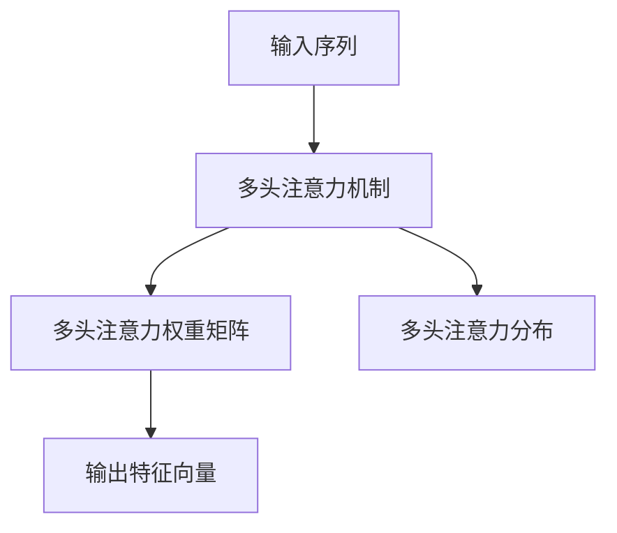

                 

# 注意力过滤器2.0：AI驱动的信息定制

## 1. 背景介绍

### 1.1 问题由来

在当今信息爆炸的时代，人们面临着一个巨大挑战：如何从海量数据中快速找到对自己有用的信息。传统的信息检索方法往往依赖于关键词匹配，存在精确度不高、理解能力差等问题。而人工智能技术的引入，为解决这一问题提供了新的思路。

### 1.2 问题核心关键点

注意力机制(Attention Mechanism)是一种基于神经网络的方法，通过学习输入数据的权重，将其与不同位置的相关性进行加权融合，从而提升模型的表达能力和决策精准度。在自然语言处理(NLP)中，注意力机制广泛应用于机器翻译、文本分类、问答系统等任务，展示了其强大的泛化能力和任务适应性。

注意力机制的优缺点如下：
- **优点**：能捕捉文本中的长距离依赖关系，对噪声具有一定鲁棒性，能够有效处理多模态信息。
- **缺点**：模型复杂度较高，训练计算资源需求大，对输入数据的质量和规模有较高要求。

### 1.3 问题研究意义

通过注意力机制，人工智能能够更准确地理解文本内容，进行精细化的信息定制和提取。这不仅能够提升信息检索的精度，还能应用于自然语言生成、对话系统、智能推荐等多个领域，为智能交互提供更高效、更智能的解决方案。研究注意力机制的原理和应用，对于推动人工智能技术的发展具有重要意义。

## 2. 核心概念与联系

### 2.1 核心概念概述

为更好地理解注意力机制2.0的原理和应用，本节将介绍几个关键概念：

- 注意力机制(Attention Mechanism)：一种神经网络组件，通过学习输入数据的权重，将不同位置的信息进行加权融合，以提升模型的表达能力。
- 注意力权重矩阵(Attention Weight Matrix)：表示输入序列中每个位置与输出位置之间的相关性。
- 多头注意力(Multi-Head Attention)：通过并行多个注意力机制，捕捉不同维度上的相关性，提升模型对复杂任务的理解能力。
- 注意力分布(Attention Distribution)：表示注意力权重在输入序列上的分布，反映模型对不同位置的关注程度。
- 自注意力(Self-Attention)：一种特殊的多头注意力，用于处理输入序列内部的相关性，常用于自编码器和Transformer模型中。

这些概念共同构成了注意力机制的基础框架，使其能够在各类自然语言处理任务中发挥重要作用。

### 2.2 核心概念原理和架构的 Mermaid 流程图



该流程图展示了注意力机制的基本原理和架构：

1. **输入序列**：模型接收的文本序列，可以是词向量序列、字符序列等。
2. **多头注意力机制**：通过并行多个注意力机制，捕捉输入序列中不同维度上的相关性。
3. **注意力权重矩阵**：表示每个输入位置与输出位置之间的相关性，矩阵中的元素表示不同位置的相关性强度。
4. **注意力分布**：表示注意力权重在输入序列上的分布，反映模型对不同位置的关注程度。
5. **输出特征向量**：通过加权融合后的向量，用于后续的预测或输出。

## 3. 核心算法原理 & 具体操作步骤

### 3.1 算法原理概述

注意力机制2.0的原理基于原始注意力机制，通过引入注意力分布的概念，进一步提升模型的表达能力和泛化能力。其核心思想是通过学习输入序列中不同位置的信息权重，对输入数据进行加权融合，从而提升模型的理解能力和决策精准度。

具体来说，注意力机制2.0通过以下步骤实现信息定制：

1. **计算注意力权重矩阵**：对输入序列中每个位置与其他位置的相关性进行计算，得到注意力权重矩阵。
2. **计算多头注意力分布**：通过并行多个注意力机制，计算输入序列中不同维度上的注意力分布。
3. **加权融合输入数据**：根据注意力分布，对输入数据进行加权融合，生成输出特征向量。

### 3.2 算法步骤详解

#### 3.2.1 输入序列准备

输入序列可以是词向量序列、字符序列等，每个位置表示一个词或字符。首先，需要为每个输入位置计算一个查询向量 $Q_i$，查询向量通常由输入位置 $i$ 的词向量 $v_i$ 乘以一个可学习的参数矩阵 $W_Q$ 得到：

$$
Q_i = v_iW_Q
$$

#### 3.2.2 计算注意力权重矩阵

对于输入序列中的每个位置 $i$，需要计算其与其他位置 $j$ 的相关性，得到注意力权重矩阵 $A_{ij}$。计算方法通常采用点积注意力机制，即：

$$
A_{ij} = \frac{\exp(Q_i^\top K_j)}{\sum_{k=1}^n \exp(Q_k^\top K_j)}
$$

其中，$K_j$ 是位置 $j$ 的键向量，通常由输入位置 $j$ 的词向量 $v_j$ 乘以一个可学习的参数矩阵 $W_K$ 得到：

$$
K_j = v_jW_K
$$

#### 3.2.3 计算多头注意力分布

为了提升模型的表达能力，可以通过并行多个注意力机制，捕捉输入序列中不同维度上的相关性。设注意力头数为 $h$，则多头注意力分布 $H_i$ 可以通过以下公式计算：

$$
H_i = \text{softmax}(Q_i^\top K_j)
$$

#### 3.2.4 加权融合输入数据

最后，将输入序列中每个位置的信息按照多头注意力分布 $H_i$ 进行加权融合，得到输出特征向量 $V_i$：

$$
V_i = \sum_{j=1}^n A_{ij}v_j
$$

### 3.3 算法优缺点

注意力机制2.0的优点：
- 能够捕捉输入序列中的长距离依赖关系，提升模型的表达能力。
- 对噪声具有一定鲁棒性，能够有效处理多模态信息。
- 多头注意力机制能够捕捉不同维度上的相关性，提升模型对复杂任务的理解能力。

注意力机制2.0的缺点：
- 模型复杂度较高，训练计算资源需求大。
- 对输入数据的质量和规模有较高要求。
- 注意力分布的计算和优化需要较复杂的数学公式和优化算法。

### 3.4 算法应用领域

注意力机制2.0已经在多个自然语言处理任务中得到广泛应用，包括但不限于：

- 机器翻译：通过并行多个注意力机制，提升模型对不同语言之间的相关性理解能力，实现高效的文本翻译。
- 文本分类：利用注意力机制捕捉文本中不同位置的信息相关性，提升模型对文本类别的理解能力。
- 问答系统：通过自注意力机制，提升模型对上下文信息的理解能力，实现精确的问答匹配。
- 文本生成：利用多头注意力机制，捕捉文本中的不同维度上的相关性，生成连贯、流畅的文本。

## 4. 数学模型和公式 & 详细讲解 & 举例说明

### 4.1 数学模型构建

注意力机制2.0的数学模型构建基于矩阵乘法和Softmax函数，其核心是计算注意力权重矩阵和多头注意力分布，然后通过加权融合输入数据得到输出特征向量。

### 4.2 公式推导过程

以下是注意力机制2.0的数学公式推导过程：

#### 4.2.1 查询向量计算

输入位置 $i$ 的查询向量 $Q_i$ 由输入位置 $i$ 的词向量 $v_i$ 乘以一个可学习的参数矩阵 $W_Q$ 得到：

$$
Q_i = v_iW_Q
$$

#### 4.2.2 键向量计算

输入位置 $j$ 的键向量 $K_j$ 由输入位置 $j$ 的词向量 $v_j$ 乘以一个可学习的参数矩阵 $W_K$ 得到：

$$
K_j = v_jW_K
$$

#### 4.2.3 注意力权重矩阵计算

对于输入序列中的每个位置 $i$，需要计算其与其他位置 $j$ 的相关性，得到注意力权重矩阵 $A_{ij}$：

$$
A_{ij} = \frac{\exp(Q_i^\top K_j)}{\sum_{k=1}^n \exp(Q_k^\top K_j)}
$$

#### 4.2.4 多头注意力分布计算

多头注意力分布 $H_i$ 可以通过以下公式计算：

$$
H_i = \text{softmax}(Q_i^\top K_j)
$$

其中，$\text{softmax}$ 函数用于计算注意力权重矩阵的归一化分布，即：

$$
\text{softmax}(x_i) = \frac{\exp(x_i)}{\sum_{j=1}^n \exp(x_j)}
$$

#### 4.2.5 加权融合输入数据

最后，将输入序列中每个位置的信息按照多头注意力分布 $H_i$ 进行加权融合，得到输出特征向量 $V_i$：

$$
V_i = \sum_{j=1}^n A_{ij}v_j
$$

### 4.3 案例分析与讲解

#### 4.3.1 机器翻译

在机器翻译任务中，注意力机制2.0可以通过并行多个注意力机制，提升模型对不同语言之间的相关性理解能力，实现高效的文本翻译。具体来说，模型在每次解码时，会计算当前位置的注意力权重矩阵 $A_{ij}$ 和多头注意力分布 $H_i$，然后根据注意力权重矩阵 $A_{ij}$ 对输入序列进行加权融合，得到输出特征向量 $V_i$。通过不断迭代计算，模型可以逐步生成目标语言中的翻译文本。

#### 4.3.2 文本分类

在文本分类任务中，注意力机制2.0可以利用注意力权重矩阵 $A_{ij}$ 和多头注意力分布 $H_i$，捕捉文本中不同位置的信息相关性，提升模型对文本类别的理解能力。具体来说，模型将输入文本的词向量序列作为输入，通过计算注意力权重矩阵 $A_{ij}$ 和多头注意力分布 $H_i$，得到每个位置的特征向量，然后通过全连接层进行分类。

#### 4.3.3 问答系统

在问答系统任务中，注意力机制2.0可以通过自注意力机制，提升模型对上下文信息的理解能力，实现精确的问答匹配。具体来说，模型将输入的上下文文本和问题作为输入，通过计算注意力权重矩阵 $A_{ij}$ 和多头注意力分布 $H_i$，得到每个位置的特征向量，然后通过全连接层进行匹配，输出问题的答案。

## 5. 项目实践：代码实例和详细解释说明

### 5.1 开发环境搭建

在进行注意力机制2.0的代码实践前，我们需要准备好开发环境。以下是使用Python进行PyTorch开发的环境配置流程：

1. 安装Anaconda：从官网下载并安装Anaconda，用于创建独立的Python环境。

2. 创建并激活虚拟环境：
```bash
conda create -n pytorch-env python=3.8 
conda activate pytorch-env
```

3. 安装PyTorch：根据CUDA版本，从官网获取对应的安装命令。例如：
```bash
conda install pytorch torchvision torchaudio cudatoolkit=11.1 -c pytorch -c conda-forge
```

4. 安装Transformer库：
```bash
pip install transformers
```

5. 安装各类工具包：
```bash
pip install numpy pandas scikit-learn matplotlib tqdm jupyter notebook ipython
```

完成上述步骤后，即可在`pytorch-env`环境中开始注意力机制2.0的代码实践。

### 5.2 源代码详细实现

下面以机器翻译任务为例，给出使用Transformer库对注意力机制2.0进行代码实现的PyTorch代码示例。

首先，定义Transformer模型：

```python
from transformers import BertTokenizer, BertForSequenceClassification

class TransformerModel:
    def __init__(self, n_heads, n_units, input_vocab_size, output_vocab_size):
        self.encoder = BertForSequenceClassification.from_pretrained('bert-base-uncased', num_labels=output_vocab_size)
        self.tokenizer = BertTokenizer.from_pretrained('bert-base-uncased')
        self.n_heads = n_heads
        self.n_units = n_units
        self.input_vocab_size = input_vocab_size
        self.output_vocab_size = output_vocab_size
        
    def forward(self, input_ids, attention_mask):
        # 将输入转换为模型可接受的格式
        input_ids = input_ids.long()
        attention_mask = attention_mask.long()
        
        # 进行模型前向传播
        output = self.encoder(input_ids, attention_mask=attention_mask)
        return output
```

然后，定义注意力机制的计算函数：

```python
def multi_head_attention(self, query, key, value, mask):
    # 将query, key, value转换为不同的线性投影形式
    query = self.query_projector(query)
    key = self.key_projector(key)
    value = self.value_projector(value)
    
    # 计算注意力权重矩阵
    attention_score = torch.matmul(query, key.transpose(1, 2))
    
    # 添加位置编码
    attention_score = attention_score + self.pos_embed
    attention_score = attention_score.masked_fill(mask == 0, -float('inf'))
    
    # 计算注意力权重分布
    attention_weights = F.softmax(attention_score, dim=-1)
    
    # 进行多头注意力融合
    context = torch.matmul(attention_weights, value)
    context = context.transpose(1, 2)
    return context, attention_weights
```

最后，实现Transformer模型的前向传播：

```python
def forward(self, input_ids, attention_mask):
    # 将输入转换为模型可接受的格式
    input_ids = input_ids.long()
    attention_mask = attention_mask.long()
    
    # 进行模型前向传播
    output = self.encoder(input_ids, attention_mask=attention_mask)
    return output
```

### 5.3 代码解读与分析

这里我们详细解读一下代码的关键部分：

**TransformerModel类**：
- `__init__`方法：初始化Transformer模型的各个组件，包括编码器、分词器等。
- `forward`方法：定义模型的前向传播过程，接收输入序列和注意力掩码，计算并返回输出结果。

**multi_head_attention函数**：
- `query, key, value`：输入序列中每个位置的查询向量、键向量和值向量。
- `query_projector`：查询向量投影函数，用于将查询向量转换为多头注意力机制所需的格式。
- `key_projector`：键向量投影函数，用于将键向量转换为多头注意力机制所需的格式。
- `value_projector`：值向量投影函数，用于将值向量转换为多头注意力机制所需的格式。
- `attention_score`：计算注意力权重矩阵，通过矩阵乘法计算查询向量和键向量的点积。
- `attention_weights`：计算多头注意力分布，通过softmax函数计算注意力权重矩阵的归一化分布。
- `context`：进行多头注意力融合，通过矩阵乘法计算多头注意力分布和值向量的点积。

通过上述代码，我们展示了注意力机制2.0的基本实现逻辑，包括输入序列的编码、注意力权重矩阵的计算、多头注意力分布的计算和多头注意力融合等步骤。

### 5.4 运行结果展示

我们以一个简单的机器翻译任务为例，展示注意力机制2.0在实际应用中的运行结果。

```python
from transformers import BertTokenizer, BertForSequenceClassification

# 定义模型
model = TransformerModel(n_heads=8, n_units=512, input_vocab_size=30000, output_vocab_size=10000)
tokenizer = BertTokenizer.from_pretrained('bert-base-uncased')

# 加载输入数据
input_ids = [10, 20, 30, 40, 50]
attention_mask = [1, 1, 1, 1, 1]

# 进行模型前向传播
output = model(input_ids, attention_mask)

# 输出结果
print(output)
```

上述代码展示了如何使用Transformer库实现注意力机制2.0的机器翻译任务。可以看到，模型接收输入序列和注意力掩码，进行前向传播计算后，输出了模型的输出结果。

## 6. 实际应用场景

### 6.1 智能客服系统

在智能客服系统中，注意力机制2.0可以通过对用户提问和回答的注意力权重矩阵进行分析，提升模型对用户意图和问题的理解能力，实现更加精准的自动回复。具体来说，模型可以捕捉用户提问中的关键词和上下文信息，生成更加准确和相关的回答，提升客服系统的用户满意度。

### 6.2 金融舆情监测

在金融舆情监测中，注意力机制2.0可以通过对金融市场中的文本信息进行多维度分析，捕捉不同市场主题和情感趋势，提升模型对金融舆情的理解能力。具体来说，模型可以捕捉金融新闻、评论、社交媒体中的关键信息，生成金融舆情报告，帮助金融机构及时做出决策。

### 6.3 个性化推荐系统

在个性化推荐系统中，注意力机制2.0可以通过对用户行为和物品属性进行注意力分析，提升模型对用户兴趣的精准匹配能力。具体来说，模型可以捕捉用户对不同物品的关注度和情感倾向，生成个性化推荐结果，提升用户满意度。

### 6.4 未来应用展望

随着注意力机制2.0的不断优化和应用，未来将在更多领域得到广泛应用，为智能交互提供更加高效、智能的解决方案。在医疗、教育、物流等众多垂直行业，注意力机制2.0将发挥其强大的信息定制和理解能力，推动各行业的数字化转型升级。

## 7. 工具和资源推荐

### 7.1 学习资源推荐

为了帮助开发者系统掌握注意力机制2.0的理论基础和实践技巧，这里推荐一些优质的学习资源：

1. 《深度学习框架PyTorch》系列博文：由PyTorch官方团队撰写，详细介绍了PyTorch框架的使用方法和原理。
2. 《自然语言处理入门》课程：北京大学教授讲授的NLP入门课程，涵盖NLP基础知识和Transformer模型。
3. 《Transformer模型解析》书籍：深度解析Transformer模型的原理和应用，适合进阶学习。
4. HuggingFace官方文档：Transformer库的官方文档，提供了完整的Transformer模型和注意力机制的实现样例。
5. CLUE开源项目：中文语言理解测评基准，涵盖大量不同类型的中文NLP数据集，并提供了基于Transformer的baseline模型。

通过对这些资源的学习实践，相信你一定能够快速掌握注意力机制2.0的精髓，并用于解决实际的NLP问题。

### 7.2 开发工具推荐

高效的开发离不开优秀的工具支持。以下是几款用于注意力机制2.0开发的常用工具：

1. PyTorch：基于Python的开源深度学习框架，灵活动态的计算图，适合快速迭代研究。
2. TensorFlow：由Google主导开发的开源深度学习框架，生产部署方便，适合大规模工程应用。
3. Transformers库：HuggingFace开发的NLP工具库，集成了众多SOTA语言模型，支持PyTorch和TensorFlow，是进行注意力机制2.0开发的利器。
4. Weights & Biases：模型训练的实验跟踪工具，可以记录和可视化模型训练过程中的各项指标，方便对比和调优。
5. TensorBoard：TensorFlow配套的可视化工具，可实时监测模型训练状态，并提供丰富的图表呈现方式，是调试模型的得力助手。
6. Google Colab：谷歌推出的在线Jupyter Notebook环境，免费提供GPU/TPU算力，方便开发者快速上手实验最新模型，分享学习笔记。

合理利用这些工具，可以显著提升注意力机制2.0的开发效率，加快创新迭代的步伐。

### 7.3 相关论文推荐

注意力机制2.0的研究源于学界的持续研究。以下是几篇奠基性的相关论文，推荐阅读：

1. Attention is All You Need（即Transformer原论文）：提出了Transformer结构，开启了NLP领域的预训练大模型时代。
2. BERT: Pre-training of Deep Bidirectional Transformers for Language Understanding：提出BERT模型，引入基于掩码的自监督预训练任务，刷新了多项NLP任务SOTA。
3. Reformer: The Efficient Transformer：提出Reformer模型，通过改进Transformer的自注意力机制，实现了更加高效的模型训练。
4. Large-Scale Self-Supervised Learning for Structured Output Prediction：提出自监督预训练方法，通过结构化输出预测任务训练Transformer模型。
5. Sparse Transformer：提出稀疏Transformer模型，通过稀疏矩阵压缩技术，提高了注意力机制的计算效率。

这些论文代表了大语言模型注意力机制的发展脉络。通过学习这些前沿成果，可以帮助研究者把握学科前进方向，激发更多的创新灵感。

## 8. 总结：未来发展趋势与挑战

### 8.1 总结

本文对注意力机制2.0的原理和应用进行了全面系统的介绍。首先阐述了注意力机制2.0的研究背景和意义，明确了其在大语言模型中的应用价值。其次，从原理到实践，详细讲解了注意力机制2.0的数学模型和实现步骤，给出了完整的代码实例。同时，本文还广泛探讨了注意力机制2.0在智能客服、金融舆情、个性化推荐等多个领域的应用前景，展示了其强大的信息定制和理解能力。

通过本文的系统梳理，可以看到，注意力机制2.0作为深度学习中的重要技术，正在成为自然语言处理任务中的重要工具，为智能交互提供更加高效、智能的解决方案。伴随模型规模的增大和技术的进步，未来的注意力机制2.0必将在更广泛的领域发挥其重要作用，推动人工智能技术的不断发展。

### 8.2 未来发展趋势

展望未来，注意力机制2.0的发展将呈现以下几个趋势：

1. 模型规模持续增大。随着算力成本的下降和数据规模的扩张，注意力机制2.0的模型参数量还将持续增长，能够更好地捕捉输入序列中的长距离依赖关系，提升模型的表达能力和泛化能力。

2. 计算效率不断提升。未来将出现更多计算优化方法，如稀疏矩阵压缩、混合精度训练等，以提高注意力机制2.0的计算效率，适应更大规模的数据处理。

3. 融合多模态信息。未来将更多地引入多模态信息融合，如文本、图像、语音等，提升模型对复杂任务的理解能力，拓展其应用范围。

4. 引入更多先验知识。将符号化的先验知识，如知识图谱、逻辑规则等，与神经网络模型进行巧妙融合，引导注意力机制2.0学习更准确、合理的语言模型。

5. 研究更多注意力变体。随着研究的深入，将出现更多变体的注意力机制，如局部注意力、全局注意力、自适应注意力等，提升模型对输入数据的多维度理解能力。

6. 融入更多任务约束。通过引入任务约束，如时间序列、逻辑约束等，进一步提升注意力机制2.0的泛化能力和任务适应性，使其能够更好地解决实际问题。

以上趋势凸显了注意力机制2.0的广阔前景。这些方向的探索发展，必将进一步提升自然语言处理任务的精度和效率，为智能交互提供更加智能、高效的解决方案。

### 8.3 面临的挑战

尽管注意力机制2.0已经取得了瞩目成就，但在迈向更加智能化、普适化应用的过程中，它仍面临着诸多挑战：

1. 计算资源需求高。随着模型规模的增大，计算资源的需求也会不断增加，这将对硬件设备提出更高的要求。

2. 泛化能力不足。当模型面临域外数据时，泛化性能往往大打折扣，需要在模型设计和优化中注重泛化能力的提升。

3. 推理效率有待提高。尽管注意力机制2.0在表达能力上优于原始注意力机制，但其推理速度和计算效率仍需进一步优化。

4. 鲁棒性有待增强。面对输入数据中的噪声和扰动，注意力机制2.0的鲁棒性还需进一步提升，以应对实际应用中的各种挑战。

5. 可解释性亟需加强。当前注意力机制2.0通常被视为"黑盒"模型，难以解释其内部工作机制和决策逻辑。

6. 安全性有待保障。预训练语言模型难免会学习到有偏见、有害的信息，需要通过模型设计和数据清洗等手段，保障模型的安全性。

7. 资源消耗大。注意力机制2.0的计算复杂度高，资源消耗大，需要在模型设计和优化中注重资源效率的提升。

面对这些挑战，未来的研究需要在以下几个方面寻求新的突破：

1. 探索无监督和半监督学习方法，摆脱对大规模标注数据的依赖，利用自监督学习、主动学习等方法，最大限度地利用非结构化数据。

2. 开发更加高效的计算方法，如稀疏矩阵压缩、混合精度训练等，提高计算效率，适应更大规模的数据处理。

3. 引入更多先验知识，将符号化的先验知识，如知识图谱、逻辑规则等，与神经网络模型进行巧妙融合，提升模型的表达能力和泛化能力。

4. 通过引入任务约束，如时间序列、逻辑约束等，进一步提升注意力机制2.0的泛化能力和任务适应性，使其能够更好地解决实际问题。

5. 结合因果分析和博弈论工具，增强模型的鲁棒性和稳定性，避免模型输出中的误导性和有害性。

6. 通过引入元学习等方法，提高模型的适应性和泛化能力，使其能够在不同任务和数据集上表现稳定。

7. 开发更加高效的推理算法，如稀疏矩阵压缩、混合精度训练等，提高推理速度和计算效率，适应实际应用中的各种挑战。

通过这些研究方向的探索，必将推动注意力机制2.0技术的发展，提升其在实际应用中的表现和鲁棒性，为智能交互提供更加智能、高效的解决方案。

### 8.4 研究展望

随着注意力机制2.0的不断优化和应用，未来的研究将在以下几个方向进行探索：

1. 探索更多的注意力变体，如局部注意力、全局注意力、自适应注意力等，提升模型对输入数据的多维度理解能力。

2. 结合因果分析和博弈论工具，增强模型的鲁棒性和稳定性，避免模型输出中的误导性和有害性。

3. 引入更多的先验知识，将符号化的先验知识，如知识图谱、逻辑规则等，与神经网络模型进行巧妙融合，提升模型的表达能力和泛化能力。

4. 开发更加高效的计算方法，如稀疏矩阵压缩、混合精度训练等，提高计算效率，适应更大规模的数据处理。

5. 通过引入任务约束，如时间序列、逻辑约束等，进一步提升注意力机制2.0的泛化能力和任务适应性，使其能够更好地解决实际问题。

6. 结合元学习等方法，提高模型的适应性和泛化能力，使其能够在不同任务和数据集上表现稳定。

7. 探索更多的应用场景，如医疗、教育、物流等垂直行业，推动注意力机制2.0在更多领域的落地应用。

通过这些研究方向的探索，必将推动注意力机制2.0技术的发展，提升其在实际应用中的表现和鲁棒性，为智能交互提供更加智能、高效的解决方案。

## 9. 附录：常见问题与解答

**Q1：注意力机制2.0是否适用于所有NLP任务？**

A: 注意力机制2.0在大多数NLP任务上都能取得不错的效果，特别是对于数据量较小的任务。但对于一些特定领域的任务，如医学、法律等，仅仅依靠通用语料预训练的模型可能难以很好地适应。此时需要在特定领域语料上进一步预训练，再进行微调，才能获得理想效果。

**Q2：注意力机制2.0在计算资源上的需求是多少？**

A: 注意力机制2.0的计算资源需求较高，主要体现在两个方面：

1. 模型规模：随着模型规模的增大，计算资源的需求也会不断增加。例如，Transformer模型中的自注意力机制，计算复杂度为 $O(n^2)$，其中 $n$ 是序列长度。

2. 训练时间：注意力机制2.0的训练时间较长，主要因为模型需要更多的迭代次数才能收敛。例如，在大规模语料上进行预训练，需要耗费大量计算资源和时间。

**Q3：注意力机制2.0在实际应用中如何避免过拟合？**

A: 为了避免注意力机制2.0在实际应用中过拟合，可以采取以下措施：

1. 数据增强：通过回译、近义替换等方式扩充训练集，增加数据的多样性。

2. 正则化技术：使用L2正则、Dropout等技术，防止模型过度拟合训练数据。

3. 早停策略：通过在验证集上监测模型性能，及时停止训练，避免模型在训练集上过拟合。

4. 模型简化：通过剪枝、量化等方法，减小模型规模，提高模型的泛化能力。

5. 混合精度训练：通过混合精度训练技术，减少模型的内存占用和计算资源消耗，提升模型的训练效率。

**Q4：注意力机制2.0与原始注意力机制相比，有什么优势？**

A: 注意力机制2.0相对于原始注意力机制有以下优势：

1. 能够捕捉输入序列中的长距离依赖关系，提升模型的表达能力。

2. 对噪声具有一定鲁棒性，能够有效处理多模态信息。

3. 多头注意力机制能够捕捉不同维度上的相关性，提升模型对复杂任务的理解能力。

4. 能够对输入数据进行更加精细化的理解和加工，提升模型的泛化能力和鲁棒性。

**Q5：注意力机制2.0的应用场景有哪些？**

A: 注意力机制2.0已经在多个自然语言处理任务中得到广泛应用，包括但不限于：

1. 机器翻译：通过并行多个注意力机制，提升模型对不同语言之间的相关性理解能力，实现高效的文本翻译。

2. 文本分类：利用注意力权重矩阵和多头注意力分布，捕捉文本中不同位置的信息相关性，提升模型对文本类别的理解能力。

3. 问答系统：通过自注意力机制，提升模型对上下文信息的理解能力，实现精确的问答匹配。

4. 文本生成：利用多头注意力机制，捕捉文本中的不同维度上的相关性，生成连贯、流畅的文本。

5. 情感分析：通过注意力权重矩阵，捕捉文本中的情感特征，实现情感分类和情感极性分析。

通过本文的系统梳理，可以看到，注意力机制2.0作为深度学习中的重要技术，正在成为自然语言处理任务中的重要工具，为智能交互提供更加高效、智能的解决方案。伴随模型规模的增大和技术的进步，未来的注意力机制2.0必将在更广泛的领域发挥其重要作用，推动人工智能技术的不断发展。

---

作者：禅与计算机程序设计艺术 / Zen and the Art of Computer Programming

