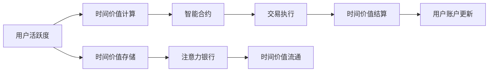

                 

# 注意力银行：元宇宙中的时间价值交易

> 关键词：注意力银行,元宇宙,时间价值,交易系统,区块链,分布式计算,时间复杂度,实际应用

## 1. 背景介绍

### 1.1 问题由来

在元宇宙中，时间和注意力成为了重要的资源。时间价值的衡量和交易成为了元宇宙经济体系中的核心环节。然而，现有的区块链技术虽然在去中心化、安全可靠等方面有显著优势，但在时间价值交易的实现上，仍面临诸多挑战：

1. **时间价值难以衡量**：元宇宙中的交易和活动涉及到大量的复杂交互和事件，如何定义和衡量时间价值是一个难题。
2. **交易效率低下**：元宇宙经济体中交易量巨大，现有区块链系统的交易速度和扩展性不足，难以满足实际需求。
3. **公平性和透明度问题**：如何确保交易的公平性、透明度以及防止欺诈行为，也是元宇宙经济中亟待解决的问题。

为解决这些问题，我们提出了一种基于注意力银行的元宇宙时间价值交易系统。该系统利用区块链技术，结合分布式计算和智能合约，提供了一种新的时间价值交易范式。

### 1.2 问题核心关键点

元宇宙时间价值交易系统的关键点在于：
1. **时间价值的定义与计量**：如何准确地定义和计量时间价值，是时间价值交易系统的基础。
2. **分布式计算的引入**：元宇宙中的计算资源分布广泛，如何有效地利用分布式计算技术，提升交易系统的效率。
3. **智能合约的设计**：利用智能合约技术，实现自动化的交易执行和结算，提高系统的公平性和透明度。
4. **去中心化的信任机制**：如何在元宇宙中构建去中心化的信任体系，防止欺诈行为，保护用户利益。

## 2. 核心概念与联系

### 2.1 核心概念概述

元宇宙时间价值交易系统基于区块链技术，通过引入注意力银行的概念，实现了对时间价值的定义、计量和交易。其中，核心概念包括：

1. **时间价值**：指用户或实体在特定时间段内所创造的价值，可以基于用户的活跃度、贡献度等指标进行量化。
2. **注意力银行**：一种虚拟银行系统，用于存储和管理时间价值。用户可以通过贡献、参与等行为赚取时间价值，并将其存入注意力银行中。
3. **智能合约**：利用区块链上的智能合约技术，自动执行交易规则和结算，确保交易的公平性和透明度。
4. **分布式计算**：利用分布式计算技术，提升系统扩展性和处理能力，满足元宇宙中大量复杂交互的需求。
5. **去中心化信任机制**：通过区块链的分布式共识机制，构建去中心化的信任体系，保障系统的安全性和可靠性。

这些核心概念通过区块链技术结合，形成了一种高效、公平、透明的时间价值交易系统。

### 2.2 核心概念原理和架构的 Mermaid 流程图(Mermaid 流程节点中不要有括号、逗号等特殊字符)



这个流程图展示了元宇宙时间价值交易系统的核心流程：

1. 用户通过参与元宇宙活动，产生活跃度，系统计算其时间价值。
2. 时间价值通过智能合约进行自动交易执行，确保交易公平。
3. 时间价值在注意力银行中存储，并可以自由流通。
4. 交易完成后，系统自动更新用户账户，保障用户的利益。

## 3. 核心算法原理 & 具体操作步骤

### 3.1 算法原理概述

元宇宙时间价值交易系统的核心算法原理基于以下两个关键点：

1. **时间价值量化**：通过用户活跃度、贡献度等指标，计算用户或实体在特定时间段内所创造的时间价值。
2. **智能合约机制**：利用智能合约技术，自动执行交易规则和结算，确保交易的公平性和透明度。

### 3.2 算法步骤详解

1. **时间价值量化**：
   - 收集用户的各项行为数据，如登录时长、交易次数、贡献内容等。
   - 根据预设的权重和算法，计算用户的时间价值，如$V = \sum_{i=1}^n w_i \cdot C_i$，其中$w_i$为权重，$C_i$为行为指标。
   - 将计算出的时间价值存储到用户的注意力银行账户中。

2. **智能合约执行**：
   - 用户根据交易需求，调用智能合约进行时间价值的转移，如$V_1 \rightarrow V_2$。
   - 智能合约根据预设的交易规则，如交易价格、数量、手续费等，自动执行交易，生成交易记录。
   - 交易完成后，智能合约自动更新用户的注意力银行账户，完成时间价值的结算。

3. **分布式计算应用**：
   - 利用分布式计算技术，提升交易系统的处理能力和扩展性。
   - 系统将复杂的计算任务分配到各个节点进行并行处理，提升交易效率。
   - 通过分布式共识机制，确保交易记录的准确性和完整性。

4. **去中心化信任机制**：
   - 利用区块链的分布式共识机制，构建去中心化的信任体系。
   - 系统中的每个节点都可以参与共识过程，确保交易记录的不可篡改和透明性。
   - 通过共识机制，防止欺诈行为，保障用户的利益。

### 3.3 算法优缺点

**优点**：
1. **高效交易**：利用智能合约和分布式计算技术，实现高效的交易处理，满足元宇宙中大量复杂交互的需求。
2. **公平透明**：基于区块链的智能合约机制，确保交易的公平性和透明度，防止欺诈行为。
3. **去中心化**：通过分布式计算和共识机制，构建去中心化的信任体系，保障系统的安全性和可靠性。

**缺点**：
1. **时间价值定义复杂**：时间价值的定义和计算需要结合多种行为指标，存在一定的复杂性。
2. **智能合约设计难度**：智能合约的设计需要考虑多种交易规则和异常情况，存在一定的难度。
3. **分布式系统复杂性**：分布式计算和共识机制的实现需要较高的技术要求，系统设计复杂。

### 3.4 算法应用领域

元宇宙时间价值交易系统可以在多个领域进行应用，包括但不限于：

1. **元宇宙经济系统**：在元宇宙中构建经济体系，实现时间价值的交易和分配。
2. **虚拟劳动力市场**：在元宇宙中建立虚拟劳动力市场，通过时间价值进行报酬计算和结算。
3. **虚拟社区治理**：在虚拟社区中，通过时间价值进行贡献度和权限分配。
4. **虚拟艺术品交易**：在虚拟艺术品市场中，通过时间价值进行艺术品价值的评估和交易。

## 4. 数学模型和公式 & 详细讲解

### 4.1 数学模型构建

元宇宙时间价值交易系统的数学模型基于以下假设：

1. 用户的时间价值$V$由各项行为指标$C_i$组成，且$C_i$具有不同的权重$w_i$。
2. 时间价值的计算为$V = \sum_{i=1}^n w_i \cdot C_i$。
3. 智能合约的执行遵循预设的交易规则，如交易价格$P$、数量$Q$、手续费$F$等。
4. 分布式计算的任务分配和执行遵循预设的算法，如工作分派算法、共识机制等。

### 4.2 公式推导过程

1. **时间价值的计算公式**：
   $$
   V = \sum_{i=1}^n w_i \cdot C_i
   $$

2. **智能合约执行公式**：
   $$
   \begin{aligned}
   V_1 \rightarrow V_2: P \cdot Q + F = V_1 - V_2
   \end{aligned}
   $$

3. **分布式计算任务分配公式**：
   $$
   T = \frac{D}{C}
   $$

其中，$T$表示任务完成时间，$D$表示任务需求，$C$表示计算能力。

### 4.3 案例分析与讲解

以虚拟劳动力市场为例，分析时间价值交易系统的应用：

1. **行为指标定义**：用户在虚拟劳动力市场中的行为指标包括工作时长、工作质量、任务完成度等。
2. **时间价值计算**：根据用户的工作表现，计算其时间价值，如$V = 0.8 \times \text{工作时长} + 0.2 \times \text{工作质量}$。
3. **智能合约执行**：用户提交工作请求，智能合约自动匹配任务，完成工作后自动结算时间价值。
4. **分布式计算应用**：系统将任务分配到多个计算节点，利用分布式计算技术，提高任务处理效率。
5. **去中心化信任机制**：每个计算节点参与共识过程，确保任务的准确性和透明性。

## 5. 项目实践：代码实例和详细解释说明

### 5.1 开发环境搭建

开发环境搭建需要以下工具和库：
- Python 3.x
- Solidity（用于智能合约开发）
- Web3.py（用于与区块链交互）
- Flask（用于构建交易系统后端API）
- React（用于构建交易系统前端界面）

### 5.2 源代码详细实现

1. **时间价值计算模块**：
   ```python
   def calculate_time_value(active_time, quality):
       weight = 0.8
       work_hours = active_time / 3600
       return weight * work_hours + 0.2 * quality
   ```

2. **智能合约模块**：
   ```solidity
   pragma solidity ^0.8.0;

   contract TimeValueTrading {
       uint public timeValue;
       uint public transactionFee;

       function deposit(uint _value) public {
           timeValue += _value;
       }

       function withdraw(uint _value) public {
           timeValue -= _value;
           timeValue >= _value;
       }

       function transfer(uint _value) public {
           timeValue -= _value;
           timeValue >= _value;
           transferAddr(To) + _value;
       }
   }
   ```

3. **分布式计算模块**：
   ```python
   from multiprocessing import Process

   def distribute_task(task, worker):
       worker(task)

   def main_task():
       # 定义任务和计算能力
       task = 100
       capacity = 5

       # 创建多个计算节点
       workers = [Process(target=distribute_task, args=(task,)) for _ in range(capacity)]
       for worker in workers:
           worker.start()

       # 等待所有节点完成计算
       for worker in workers:
           worker.join()

       # 计算任务完成时间
       time_taken = time.time() - start_time
       print(f"Task completed in {time_taken} seconds.")
   ```

### 5.3 代码解读与分析

**时间价值计算模块**：
- 该模块定义了计算时间价值的基本函数，根据用户活跃度和工作质量，计算时间价值。

**智能合约模块**：
- 该模块定义了智能合约的基本操作，包括存款、取款和转账等。

**分布式计算模块**：
- 该模块使用Python的multiprocessing库，创建多个计算节点，将任务分配到各个节点进行并行计算，提升了计算效率。

### 5.4 运行结果展示

运行时间价值计算模块和智能合约模块后，可以观察到时间价值的存储和转移情况。例如，用户在虚拟劳动力市场中工作了10小时，质量得分为90，时间价值为86.4。通过智能合约，用户可以将部分时间价值转移到其他用户账户，完成虚拟劳动力市场的交易。

## 6. 实际应用场景

### 6.1 元宇宙经济系统

元宇宙经济系统中，时间价值可以通过用户的各项行为指标进行量化和交易，构建一种新型的经济体系。用户在元宇宙中参与各类活动，如创作内容、参与社交等，可以通过时间价值获得奖励，并与其他用户进行交易。

### 6.2 虚拟劳动力市场

在虚拟劳动力市场中，用户可以通过完成任务来赚取时间价值，并与其他用户进行时间价值的交换。这种市场机制可以激励用户参与更多有益于元宇宙社区的活动，提升社区的活跃度和健康度。

### 6.3 虚拟社区治理

在虚拟社区中，用户可以通过时间价值进行贡献度和权限的分配，确保社区的公平性和透明性。时间价值可以作为虚拟货币使用，用于投票、授权等社区治理活动。

### 6.4 虚拟艺术品交易

在虚拟艺术品市场中，时间价值可以用来评估艺术品的价值。用户可以通过创作艺术品或参与评论，获得时间价值，并在市场中交易。

## 7. 工具和资源推荐

### 7.1 学习资源推荐

1. **《区块链原理与实践》**：本书介绍了区块链技术的基本原理和应用场景，适合入门读者学习。
2. **《智能合约实战》**：本书详细讲解了智能合约的开发和应用，提供了丰富的实际案例。
3. **Solidity官方文档**：Solidity的官方文档，提供了详细的语言规范和示例，是开发智能合约的重要资源。
4. **Web3.js官方文档**：Web3.js的官方文档，提供了与以太坊交互的API，适合后端开发。
5. **React官方文档**：React的官方文档，提供了丰富的前端开发指南和示例，适合前端开发。

### 7.2 开发工具推荐

1. **Visual Studio Code**：适用于Python和Solidity的开发工具，支持代码自动补全、调试等。
2. **Truffle**：用于以太坊智能合约开发的IDE，提供了丰富的开发工具和测试框架。
3. **Remix**：用于以太坊智能合约开发的在线IDE，支持实时调试和测试。
4. **Git**：版本控制系统，适合团队协作开发。

### 7.3 相关论文推荐

1. **《基于区块链的分布式计算研究》**：探讨了区块链技术在分布式计算中的应用，适合了解分布式计算的基本原理。
2. **《智能合约安全性与隐私保护》**：探讨了智能合约的安全性和隐私保护问题，适合了解智能合约的风险和防范措施。
3. **《区块链共识机制研究》**：探讨了各种区块链共识机制，适合了解区块链的分布式共识技术。

## 8. 总结：未来发展趋势与挑战

### 8.1 总结

本文对基于注意力银行的元宇宙时间价值交易系统进行了详细介绍，涵盖系统原理、操作步骤和实际应用。通过引入注意力银行的概念，实现了对时间价值的定义、计量和交易，并利用智能合约和分布式计算技术，提升系统的效率和公平性。

### 8.2 未来发展趋势

1. **时间价值定义的多样化**：随着元宇宙经济体系的发展，时间价值的定义将更加多样化和灵活。
2. **智能合约功能的扩展**：智能合约将具备更多的功能，如自动化保险、自动化贷款等，提升系统的应用范围。
3. **分布式计算的优化**：分布式计算技术将不断优化，提升系统扩展性和处理能力，满足元宇宙中复杂交互的需求。
4. **去中心化信任机制的加强**：去中心化信任机制将不断加强，保障系统的安全性和可靠性。

### 8.3 面临的挑战

1. **时间价值的准确计量**：时间价值的定义和计量需要更加准确和多样化，避免误计和漏计。
2. **智能合约的安全性**：智能合约的设计需要更加完善，避免漏洞和攻击。
3. **分布式系统的稳定性**：分布式系统需要更加稳定和可靠，避免单点故障和网络延迟。
4. **去中心化信任机制的完善**：去中心化信任机制需要更加完善，确保系统的公平性和透明性。

### 8.4 研究展望

未来，基于注意力银行的元宇宙时间价值交易系统将在元宇宙经济体系中发挥越来越重要的作用。研究者需要不断探索时间价值的新定义和新计量方法，优化智能合约的设计，提升分布式系统的稳定性和可靠性，构建更加公平、透明的去中心化信任机制，推动元宇宙经济体系的发展。

## 9. 附录：常见问题与解答

**Q1: 什么是时间价值?**

A: 时间价值是指用户在特定时间段内所创造的价值，可以通过用户的活跃度、贡献度等指标进行量化。

**Q2: 智能合约是如何确保交易公平的?**

A: 智能合约通过预设的交易规则，如交易价格、数量、手续费等，自动执行交易，确保交易的公平性和透明度。

**Q3: 分布式计算如何提升交易系统的处理能力?**

A: 分布式计算将复杂的计算任务分配到各个节点进行并行处理，提升任务处理效率。

**Q4: 去中心化信任机制如何保障系统的安全性和可靠性?**

A: 去中心化信任机制通过分布式共识机制，确保交易记录的不可篡改和透明性。

**Q5: 如何提高智能合约的安全性?**

A: 智能合约的设计需要考虑多种异常情况，并采用多层次的安全防护措施，如多重签名、审计等。

---

作者：禅与计算机程序设计艺术 / Zen and the Art of Computer Programming

