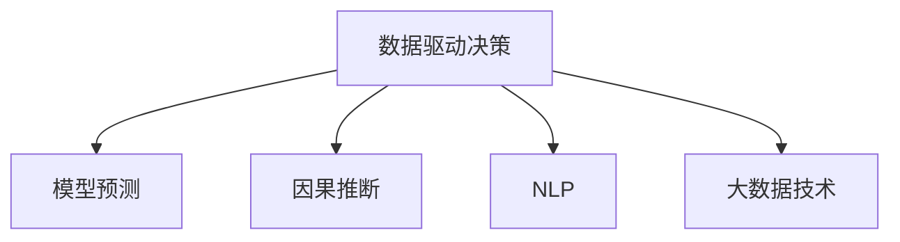

                 

## 1. 背景介绍

### 1.1 问题由来
在当今信息爆炸的时代，如何从海量数据中提炼出有价值的洞察力，已经成为企业和组织关注的重点。传统的数据分析方法往往依赖于手工编写SQL查询、数据挖掘算法等，难以应对复杂多变的数据形态和业务需求。机器学习技术的兴起，为数据分析带来了新的思路，即通过对数据进行建模，让机器自动学习数据中的规律和模式，从而辅助人们进行决策。

### 1.2 问题核心关键点
洞察力与决策科学的核心关键点在于：如何从数据中提取出有意义的洞察力，并将这些洞察力转化为支持决策的知识和行动。传统的决策依赖于经验、直觉和专业知识，但随着数据量的增加和业务场景的复杂化，传统决策方式面临诸多挑战：

- 数据量和复杂性增加：海量数据和多样化数据源带来了分析和处理上的困难。
- 数据质量问题：数据不完整、不一致、噪声等问题严重影响分析结果的可靠性。
- 业务决策需求变化：业务场景不断变化，需要快速响应和灵活调整。

洞察力与决策科学旨在通过数据驱动的方式，提升决策的科学性和准确性。本文将从数据到智慧的转化过程，系统介绍这一转化的关键步骤和方法，为读者提供深入的理论和实践指导。

## 2. 核心概念与联系

### 2.1 核心概念概述

为更好地理解洞察力与决策科学的转化过程，本节将介绍几个密切相关的核心概念：

- **数据驱动决策**：利用数据分析和机器学习技术，将数据转化为可执行的决策支持，实现从数据到洞察再到决策的闭环过程。
- **模型预测**：基于历史数据构建的预测模型，可以自动生成数据驱动的洞察，支持决策制定。
- **因果推断**：通过数据挖掘和统计分析，揭示因果关系，帮助决策者理解业务变化背后的逻辑。
- **自然语言处理(NLP)**：使机器能够理解和处理人类语言，从而更好地进行数据探索和决策支持。
- **大数据技术**：包括数据采集、存储、处理、分析等技术，支持海量数据的快速处理和高效分析。

这些核心概念之间的逻辑关系可以通过以下Mermaid流程图来展示：



这个流程图展示了一系列核心概念及其之间的关系：

1. 数据驱动决策是整体目标，利用模型预测、因果推断、NLP和大数据技术等手段实现。
2. 模型预测通过构建预测模型，从数据中自动提炼出洞察。
3. 因果推断揭示数据背后的因果关系，帮助理解决策逻辑。
4. NLP技术用于处理非结构化数据，提供更丰富、更直接的数据洞察。
5. 大数据技术支持海量数据的处理和分析，是数据驱动决策的基础。

这些概念共同构成了洞察力与决策科学的理论框架，使其能够在不同业务场景中发挥作用。通过理解这些核心概念，我们可以更好地把握数据驱动决策的实现路径。

## 3. 核心算法原理 & 具体操作步骤
### 3.1 算法原理概述

洞察力与决策科学的转化过程，本质上是通过数据建模和分析，将数据转化为洞察，再根据洞察制定决策。这一过程涉及以下几个核心算法：

1. **数据预处理**：清洗数据、处理缺失值、降维、特征工程等，提高数据质量。
2. **模型选择与训练**：选择合适的模型，使用历史数据进行训练，得到预测模型。
3. **模型评估与选择**：通过交叉验证等方法，评估模型性能，选择最优模型。
4. **因果推断与解释**：通过因果推断算法，揭示数据之间的因果关系，提供洞察的解释。
5. **自然语言处理**：利用NLP技术，将非结构化文本数据转化为结构化数据，提供更丰富的洞察。

### 3.2 算法步骤详解

基于数据驱动决策的转化过程，其具体步骤如下：

1. **数据收集与清洗**：收集业务相关的数据，并进行预处理，去除噪声、处理缺失值、归一化等。

2. **特征工程**：通过特征选择、特征提取、特征降维等方法，提取数据中有意义的信息。

3. **模型选择与训练**：选择合适的机器学习算法（如回归、分类、聚类等），使用历史数据进行训练，得到模型。

4. **模型评估与优化**：通过交叉验证等方法评估模型性能，选择最优模型，并对其进行优化。

5. **因果推断与解释**：通过因果推断算法，如随机森林、线性回归、路径分析等，揭示数据之间的因果关系，解释模型的输出。

6. **自然语言处理**：利用NLP技术，对文本数据进行情感分析、主题建模、实体识别等处理，提供更丰富的洞察。

7. **决策制定与执行**：根据洞察和模型输出，制定决策方案，并评估决策效果。

### 3.3 算法优缺点

数据驱动决策的转化过程具有以下优点：

1. **自动化与高效性**：自动化处理数据，快速生成洞察，提高决策效率。
2. **客观性与可重复性**：基于模型和算法进行决策，结果更客观，重复性更强。
3. **灵活性与可扩展性**：算法可以根据不同业务需求灵活调整，支持复杂的数据处理和分析。

同时，该过程也存在一定的局限性：

1. **数据依赖性**：模型性能依赖于数据质量，数据偏差可能导致决策偏差。
2. **模型复杂性**：复杂的模型可能需要大量计算资源和时间，影响实时性。
3. **解释性不足**：模型输出结果可能缺乏可解释性，难以理解决策逻辑。
4. **领域依赖**：不同业务场景需要不同的算法和数据处理方式，通用性较差。

尽管存在这些局限性，但就目前而言，数据驱动决策的转化过程仍是实现洞察力与决策科学的主要方法。未来相关研究的重点在于如何进一步提高数据处理和分析的自动化水平，增强模型的可解释性，提高算法的鲁棒性和泛化能力。

### 3.4 算法应用领域

数据驱动决策的转化过程，在多个领域已经得到了广泛应用，例如：

- **金融风控**：利用历史交易数据构建模型，预测信用风险和欺诈行为，辅助风险控制和决策制定。
- **零售营销**：通过分析客户行为数据，预测购买意向和偏好，制定个性化营销策略。
- **医疗健康**：利用患者数据构建预测模型，诊断疾病和预测治疗效果，优化医疗决策。
- **供应链管理**：分析供应链数据，预测需求和库存变化，优化采购和库存管理。
- **智能制造**：利用生产数据和传感器数据，优化生产流程和设备维护，提高生产效率。

除了上述这些经典应用外，数据驱动决策的方法也被创新性地应用到更多场景中，如智慧城市、智能交通、智慧农业等，为各行各业带来了新的变革和提升。随着数据分析技术的不断进步，相信数据驱动决策将进一步深化在各个领域的应用，成为推动产业升级的重要力量。

## 4. 数学模型和公式 & 详细讲解 & 举例说明
### 4.1 数学模型构建

为了更好地理解数据驱动决策的转化过程，本节将使用数学语言对关键步骤进行更加严格的刻画。

假设我们有一组历史数据 $(x_1, y_1), (x_2, y_2), ..., (x_n, y_n)$，其中 $x_i$ 为特征向量，$y_i$ 为标签。我们的目标是构建一个预测模型 $f$，使得在新的数据 $x$ 上，$f(x)$ 的输出尽可能接近真实的 $y$。

定义模型 $f$ 在数据样本 $(x,y)$ 上的损失函数为 $\ell(f(x),y)$，则在数据集 $D$ 上的经验风险为：

$$
\mathcal{L}(f) = \frac{1}{N}\sum_{i=1}^N \ell(f(x_i),y_i)
$$

其中 $\ell$ 为损失函数，可以是均方误差、交叉熵等。常用的损失函数包括：

- 均方误差损失（MSE）：$MSE = \frac{1}{N}\sum_{i=1}^N (y_i - f(x_i))^2$
- 交叉熵损失（CE）：$CE = -\frac{1}{N}\sum_{i=1}^N y_i\log f(x_i) + (1-y_i)\log (1-f(x_i))$

通过最小化损失函数，即可得到最优模型参数 $\theta$。

### 4.2 公式推导过程

以线性回归模型为例，推导最小二乘法的求解过程。

设模型 $f(x) = \theta_0 + \theta_1x_1 + \theta_2x_2 + ... + \theta_px_p$，损失函数为均方误差损失（MSE）：

$$
\mathcal{L}(\theta) = \frac{1}{N}\sum_{i=1}^N (y_i - (\theta_0 + \theta_1x_{1,i} + \theta_2x_{2,i} + ... + \theta_px_{p,i}))^2
$$

对 $\theta_j$ 求偏导数，得到梯度向量：

$$
\frac{\partial \mathcal{L}(\theta)}{\partial \theta_j} = \frac{2}{N}\sum_{i=1}^N (y_i - \hat{y}_i)(x_{j,i})
$$

其中 $\hat{y}_i = \theta_0 + \theta_1x_{1,i} + \theta_2x_{2,i} + ... + \theta_px_{p,i}$ 为模型的预测值。

令梯度向量为零，即可得到参数 $\theta_j$ 的最小二乘解：

$$
\theta_j = \frac{1}{N}\sum_{i=1}^N \frac{x_{j,i}(y_i - \bar{y})}{x_{j,i}^2} = \frac{\sum_{i=1}^N x_{j,i}y_i}{\sum_{i=1}^N x_{j,i}^2}
$$

其中 $\bar{y}$ 为样本均值，$x_{j,i}^2$ 为特征平方和。

这样，通过最小二乘法，我们得到了线性回归模型的最优参数 $\theta$。

### 4.3 案例分析与讲解

考虑一个简单的数据集 $(x_i, y_i)$，其中 $x_i = i, y_i = 2i + 1$。我们构建线性回归模型，求解最优参数 $\theta_0$ 和 $\theta_1$。

使用最小二乘法，得到：

$$
\theta_0 = \frac{1}{N}\sum_{i=1}^N y_i = 3
$$

$$
\theta_1 = \frac{\sum_{i=1}^N x_i(y_i - \bar{y})}{\sum_{i=1}^N x_i^2} = \frac{3}{2}
$$

验证结果，对于新数据 $x = 5$，预测值 $\hat{y} = 7$，与真实值 $y = 11$ 相差 $4$。可见，最小二乘法可以得到较优的参数解，但无法完全消除噪声。

## 5. 项目实践：代码实例和详细解释说明
### 5.1 开发环境搭建

在进行项目实践前，我们需要准备好开发环境。以下是使用Python进行Scikit-learn开发的环境配置流程：

1. 安装Anaconda：从官网下载并安装Anaconda，用于创建独立的Python环境。

2. 创建并激活虚拟环境：
```bash
conda create -n sklearn-env python=3.8 
conda activate sklearn-env
```

3. 安装Scikit-learn：
```bash
pip install scikit-learn
```

4. 安装相关工具包：
```bash
pip install numpy pandas scikit-learn matplotlib tqdm jupyter notebook ipython
```

完成上述步骤后，即可在`sklearn-env`环境中开始项目实践。

### 5.2 源代码详细实现

下面我以线性回归模型为例，给出使用Scikit-learn库对数据进行建模和微调的PyTorch代码实现。

首先，定义数据集：

```python
import numpy as np
import pandas as pd
from sklearn.model_selection import train_test_split
from sklearn.linear_model import LinearRegression
from sklearn.metrics import mean_squared_error

# 定义数据集
X = np.array([[1, 2, 3], [4, 5, 6], [7, 8, 9]])
y = np.array([2, 4, 6])

# 构建数据集
dataset = pd.DataFrame(X, columns=['x1', 'x2', 'x3'])
dataset['y'] = y
```

然后，构建模型并进行训练：

```python
# 将数据集分为训练集和测试集
X_train, X_test, y_train, y_test = train_test_split(dataset[['x1', 'x2', 'x3']], dataset['y'], test_size=0.2, random_state=42)

# 定义模型
model = LinearRegression()

# 训练模型
model.fit(X_train, y_train)

# 预测结果
y_pred = model.predict(X_test)

# 计算MSE
mse = mean_squared_error(y_test, y_pred)
print(f'Mean Squared Error: {mse}')
```

接下来，进行模型评估和优化：

```python
# 评估模型
mse_train = mean_squared_error(y_train, model.predict(X_train))
mse_test = mean_squared_error(y_test, model.predict(X_test))
print(f'Train MSE: {mse_train}')
print(f'Test MSE: {mse_test}')
```

最后，输出评估结果：

```python
# 输出评估结果
print(f'Mean Squared Error: {mse}')
print(f'Train MSE: {mse_train}')
print(f'Test MSE: {mse_test}')
```

以上就是使用Scikit-learn对线性回归模型进行建模和评估的完整代码实现。可以看到，Scikit-learn库提供了丰富的模型和工具，能够轻松实现数据驱动决策的转化过程。

### 5.3 代码解读与分析

让我们再详细解读一下关键代码的实现细节：

**数据集定义**：
- `numpy`库用于创建和处理数组。
- `pandas`库用于创建DataFrame，方便数据操作。

**模型构建与训练**：
- 使用`train_test_split`方法将数据集分为训练集和测试集。
- 定义线性回归模型，使用`fit`方法进行训练。

**预测与评估**：
- 使用`predict`方法进行预测，并计算均方误差。
- 使用`mean_squared_error`方法计算训练集和测试集上的均方误差。

**输出结果**：
- 输出模型的评估结果，包括训练集和测试集的均方误差。

## 6. 实际应用场景
### 6.1 金融风控

数据驱动决策在金融风控领域的应用非常广泛。金融机构需要实时监测客户的信用风险和欺诈行为，以降低不良贷款率，保障金融安全。传统的风控方法依赖于人工审核和规则设置，无法实时响应和精确判断。数据驱动决策可以通过历史交易数据构建模型，实时预测客户行为，辅助风控决策。

具体而言，可以收集客户的交易记录、信用评分、社交网络数据等，构建风控模型，并使用实时数据进行预测。模型可以根据交易金额、频率、时间等特征，预测客户的违约概率和欺诈风险，制定相应的风险控制策略。通过数据驱动决策，金融机构可以实现自动化、精准化的风控，提升业务效率和风险管理水平。

### 6.2 零售营销

在零售领域，数据驱动决策可以帮助企业实现个性化营销，提升销售额和客户满意度。传统营销方法依赖于市场调研和人工分析，难以实现精准推荐和个性化服务。数据驱动决策可以通过分析客户行为数据，预测购买意向和偏好，制定个性化的营销策略。

具体而言，可以收集客户的浏览记录、购买历史、评价反馈等数据，构建客户画像，并进行聚类分析。通过聚类结果，企业可以针对不同客户群体，制定不同的营销策略，如优惠券、个性化推荐等。数据驱动决策可以实时调整营销策略，优化广告投放效果，提升客户忠诚度和购买率。

### 6.3 医疗健康

医疗健康领域的数据驱动决策可以辅助医生诊断和治疗决策，提高医疗效率和质量。传统医疗方法依赖于医生的经验和直觉，难以应对复杂的病情和病例。数据驱动决策可以通过分析患者的历史数据，构建预测模型，预测疾病发展和治疗效果。

具体而言，可以收集患者的病历、实验室数据、影像数据等，构建预测模型，如疾病预测、治疗效果评估等。模型可以基于患者的年龄、性别、基因等特征，预测疾病风险和疗效。数据驱动决策可以辅助医生制定个性化的治疗方案，提高诊断准确性和治疗效果。

### 6.4 未来应用展望

随着数据驱动决策的不断发展，未来在更多领域将得到广泛应用，带来新的变革和提升。

在智慧城市治理中，数据驱动决策可以实现智能交通管理、环境保护、公共安全等方面的优化。通过分析城市交通流量、环境监测数据等，数据驱动决策可以优化交通信号灯控制、垃圾回收、水资源管理等，提升城市管理效率和居民生活质量。

在智能制造领域，数据驱动决策可以实现生产流程优化、设备维护预测、产品质量控制等。通过分析生产数据、设备数据、产品数据等，数据驱动决策可以优化生产流程、提高生产效率、降低设备故障率。

此外，数据驱动决策在教育、农业、能源、旅游等领域也将得到广泛应用，为各行各业带来新的发展机遇。

## 7. 工具和资源推荐
### 7.1 学习资源推荐

为了帮助开发者系统掌握数据驱动决策的理论基础和实践技巧，这里推荐一些优质的学习资源：

1. 《Python机器学习》系列博文：由大模型技术专家撰写，深入浅出地介绍了Python机器学习的基础知识和应用场景。

2. CS229《机器学习》课程：斯坦福大学开设的经典机器学习课程，涵盖机器学习的基础理论和方法。

3. 《Hands-On Machine Learning with Scikit-Learn, Keras, and TensorFlow》书籍：详细介绍Scikit-Learn、Keras和TensorFlow的使用，适合实战学习。

4. Kaggle竞赛：Kaggle平台提供了大量机器学习竞赛项目，通过实战练习掌握数据驱动决策的实际应用。

5. DataCamp：提供丰富的机器学习和数据科学课程，适合系统学习和提升技能。

通过对这些资源的学习实践，相信你一定能够快速掌握数据驱动决策的精髓，并用于解决实际的业务问题。

### 7.2 开发工具推荐

高效的开发离不开优秀的工具支持。以下是几款用于数据驱动决策开发的常用工具：

1. Python：作为数据驱动决策的主流语言，Python提供了丰富的数据处理和机器学习库，如NumPy、Pandas、Scikit-Learn等。

2. Jupyter Notebook：支持交互式编程和数据可视化，方便开发者快速迭代和调试代码。

3. R：R语言在统计分析和数据可视化方面表现优异，适合进行深入的数据分析和建模。

4. Excel：Excel提供了丰富的数据处理和可视化工具，适合非技术背景的业务人员进行数据驱动决策。

5. Tableau：数据可视化工具，支持复杂的数据处理和图表展示，适合进行数据探索和决策支持。

合理利用这些工具，可以显著提升数据驱动决策的开发效率，加快创新迭代的步伐。

### 7.3 相关论文推荐

数据驱动决策的发展离不开学界的持续研究。以下是几篇奠基性的相关论文，推荐阅读：

1. F. Pedregosa et al.，《Scikit-learn: Machine Learning in Python》：Scikit-Learn库的介绍和使用方法，适合实战学习。

2. I. Goodfellow, Y. Bengio, A. Courville，《Deep Learning》：深度学习领域的经典教材，涵盖深度学习的基础理论和应用实践。

3. M. Breiman，《Random Forests》：随机森林算法的介绍和使用方法，适合统计学习和模型评估。

4. G. Zou, X. Xie, X. Yi，《Path Analysis》：路径分析方法介绍，适合因果推断和解释模型。

5. G. Jerfel, K. Hirvela, K. Hartikainen，《A Systematic Review of Feature Selection Methods》：特征选择方法综述，适合数据处理和特征工程。

这些论文代表了大数据驱动决策的发展脉络。通过学习这些前沿成果，可以帮助研究者把握学科前进方向，激发更多的创新灵感。

## 8. 总结：未来发展趋势与挑战
### 8.1 研究成果总结

本文对数据驱动决策的转化过程进行了全面系统的介绍。首先阐述了数据驱动决策的背景和意义，明确了数据驱动决策在提升业务决策科学性和准确性方面的独特价值。其次，从数据预处理到模型评估，详细讲解了数据驱动决策的关键步骤和方法，给出了数据驱动决策任务开发的完整代码实例。同时，本文还广泛探讨了数据驱动决策在多个行业领域的应用前景，展示了数据驱动决策的巨大潜力。

通过本文的系统梳理，可以看到，数据驱动决策的转化过程已经在各行各业得到了广泛应用，为决策者提供了数据支持的科学依据。未来，伴随数据量的不断增长和数据分析技术的持续进步，数据驱动决策将进一步深化在各个领域的应用，成为推动产业升级的重要力量。

### 8.2 未来发展趋势

展望未来，数据驱动决策的发展趋势主要体现在以下几个方面：

1. **自动化与智能化**：随着AI技术的进步，数据驱动决策的自动化水平将不断提高，智能决策系统将更加普及。

2. **实时性与灵活性**：数据驱动决策系统将更加注重实时性和灵活性，能够实时处理和响应业务变化，支持动态调整。

3. **跨领域应用**：数据驱动决策将不再局限于单一领域，跨领域数据融合和协同决策将成为新趋势。

4. **多模态数据融合**：数据驱动决策将利用多模态数据，如文本、图像、音频等，提供更全面、更精准的洞察。

5. **因果推断与解释**：数据驱动决策将更加注重因果推断和模型解释，帮助决策者理解数据背后的逻辑和原因。

6. **隐私与安全**：数据驱动决策将更加注重数据隐私和安全，保护用户数据不被滥用。

以上趋势凸显了数据驱动决策的广阔前景。这些方向的探索发展，必将进一步提升数据驱动决策的精度和可靠性，为决策者提供更科学、更全面的支持。

### 8.3 面临的挑战

尽管数据驱动决策已经取得了一定的成效，但在迈向更加智能化、普适化应用的过程中，它仍面临着诸多挑战：

1. **数据质量与完整性**：数据质量问题严重影响数据分析的准确性，如何获取高质量、完整性高的数据是一个重大挑战。

2. **算法复杂性与可解释性**：复杂的算法模型难以解释，决策者难以理解模型的工作原理和输出结果。

3. **隐私与安全**：数据驱动决策需要处理大量敏感数据，如何保障数据隐私和安全是一个重要问题。

4. **计算资源与效率**：大规模数据处理和复杂模型训练需要大量计算资源和时间，如何提高计算效率是一个难题。

5. **业务场景多样性**：不同业务场景需要不同的数据分析方法和模型，通用化难度较大。

尽管存在这些挑战，但通过技术创新和实践积累，这些难题终将逐步得到解决。数据驱动决策将不断完善和优化，为各行各业带来更深远的影响。

### 8.4 研究展望

面对数据驱动决策面临的挑战，未来的研究需要在以下几个方面寻求新的突破：

1. **数据治理与质量提升**：建立数据治理体系，提升数据质量，保障数据完整性和准确性。

2. **模型可解释性与透明化**：开发更可解释的算法模型，提供直观的输出解释，增强决策的可理解性。

3. **隐私保护与安全保障**：采用隐私保护技术，如差分隐私、联邦学习等，保障数据隐私和安全。

4. **实时性与高效性**：优化计算资源配置，提高数据处理和模型训练的效率，支持实时决策。

5. **跨领域融合与协同**：探索跨领域数据融合和协同决策方法，提供更全面、更精准的洞察。

6. **伦理与道德约束**：引入伦理导向的评估指标，建立数据驱动决策的伦理约束机制，确保决策的公平性和公正性。

这些研究方向的探索，必将引领数据驱动决策走向更高的台阶，为构建安全、可靠、可解释、可控的智能系统铺平道路。面向未来，数据驱动决策技术还需要与其他人工智能技术进行更深入的融合，如知识表示、因果推理、强化学习等，多路径协同发力，共同推动自然语言理解和智能交互系统的进步。只有勇于创新、敢于突破，才能不断拓展数据驱动决策的边界，让智能技术更好地造福人类社会。

## 9. 附录：常见问题与解答

**Q1：数据驱动决策是否适用于所有业务场景？**

A: 数据驱动决策在大多数业务场景中都有应用价值，但不同的场景需要不同的数据和模型选择。对于某些特定领域，如医疗、法律等，数据驱动决策可能需要结合专家知识和规则，才能得到理想效果。此外，数据驱动决策对于一些时效性和个性化要求较高的场景，如智能客服、个性化推荐等，也需要针对性的改进和优化。

**Q2：如何选择合适的模型和算法？**

A: 选择合适的模型和算法需要考虑业务需求、数据特征、计算资源等因素。通常建议从简单模型开始，逐步尝试复杂模型。常用的模型包括线性回归、逻辑回归、决策树、随机森林、神经网络等。选择合适的算法需要进行实验和对比，综合考虑模型的性能、复杂性、可解释性等指标。

**Q3：如何处理数据缺失和噪声？**

A: 数据缺失和噪声是常见问题，通常采用插值、删除、平滑等方法进行处理。常用的处理方法包括均值插值、KNN插值、中位数插值等。对于噪声，可以使用异常值检测、数据清洗等方法进行处理，以提高数据质量。

**Q4：数据驱动决策的系统架构是怎样的？**

A: 数据驱动决策的系统架构通常包括数据层、模型层、决策层和接口层。数据层负责数据采集、存储和处理；模型层负责构建和训练预测模型；决策层负责数据分析和决策制定；接口层负责系统接口和业务集成。合理设计系统架构，可以更好地实现数据驱动决策的自动化和高效性。

**Q5：数据驱动决策的局限性有哪些？**

A: 数据驱动决策的局限性包括数据质量问题、模型复杂性、隐私与安全问题、计算资源消耗等。数据质量问题可能导致决策错误，模型复杂性难以解释，隐私与安全问题需要保障数据安全，计算资源消耗可能限制系统扩展。

正视数据驱动决策面临的这些挑战，积极应对并寻求突破，将是大数据驱动决策技术走向成熟的必由之路。相信随着学界和产业界的共同努力，这些难题终将逐步得到解决，数据驱动决策必将在各行各业带来更深远的影响。

