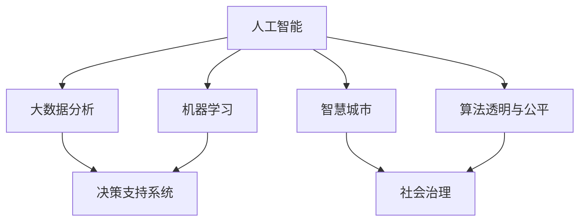

                 

# 洞察力与政策制定：社会治理的智慧

> 关键词：人工智能,社会治理,数据分析,决策支持,智慧城市,算法优化,公民参与,隐私保护

## 1. 背景介绍

### 1.1 问题由来
在现代社会，信息量爆炸、社会关系复杂多变，政府和公共机构面临着前所未有的挑战。如何有效管理和决策，已成为各国公共治理中的核心问题。传统的数据驱动决策模式，难以应对动态、多元、非结构化数据。为此，人工智能技术特别是大数据和机器学习等方法，成为提升政府治理能力的重要手段。

人工智能（AI）在诸多领域显示出其强大的数据处理和分析能力，能够从海量数据中挖掘出有价值的洞察力，辅助政策制定和执行。但如何将AI技术与政策制定紧密结合，打造智能治理新范式，仍然是一个需要深入探讨的重要课题。

### 1.2 问题核心关键点
AI技术在社会治理中的应用，主要体现在以下几个关键方面：

1. **数据驱动决策**：通过大数据分析和机器学习，挖掘数据背后的洞察力，辅助政府进行科学决策。
2. **智能治理系统**：利用AI技术提升公共服务效率，构建智慧城市，实现精准治理。
3. **决策支持系统**：开发智能决策支持系统，辅助政府制定更加精准、公正的公共政策。
4. **算法透明与公平**：确保AI算法的透明性和公平性，防止算法偏见，保障公民权益。

本文将详细探讨如何运用AI技术，特别是数据分析和机器学习技术，提升社会治理的洞察力和政策制定能力，旨在为政府部门和社会治理机构提供可操作的指导。

## 2. 核心概念与联系

### 2.1 核心概念概述

为更好地理解基于人工智能的社会治理模式，本节将介绍几个关键概念：

- **人工智能（AI）**：指利用计算机系统模拟人类智能行为的技术，包括但不限于机器学习、深度学习、自然语言处理、计算机视觉等。
- **社会治理**：指政府和公共机构通过组织、协调、控制等手段，维护社会秩序，提升公共服务水平的过程。
- **大数据分析**：指利用先进技术，从海量数据中挖掘出有价值的信息，辅助决策和行动。
- **机器学习**：指利用算法，让计算机系统通过数据分析自动学习、优化，以适应新的数据和任务。
- **决策支持系统（DSS）**：辅助决策者进行结构化和非结构化决策的系统，利用数据分析和模型优化提升决策质量。
- **智慧城市**：利用AI技术提升城市基础设施管理、公共服务效率，实现城市智能化和精细化管理。
- **算法透明与公平**：确保AI算法过程透明，避免算法偏见，保障决策公平公正。

这些核心概念之间的逻辑关系可以通过以下Mermaid流程图来展示：



这个流程图展示了大数据、机器学习、智慧城市等概念如何与社会治理紧密结合，形成互为支撑的技术生态。

## 3. 核心算法原理 & 具体操作步骤
### 3.1 算法原理概述

基于人工智能的社会治理模式，本质上是通过数据分析和模型优化，从数据中挖掘出洞察力，辅助政策制定和执行。其核心思想是：

1. **数据收集与整合**：从各类数据源收集海量数据，进行清洗和整合，形成可用于分析的统一数据集。
2. **数据分析与建模**：利用机器学习算法，挖掘数据中的规律和洞察力，构建预测和优化模型。
3. **决策辅助**：将模型结果和分析洞察应用于政策制定和执行中，提升决策的科学性和透明度。

具体的算法步骤如下：

**Step 1: 数据收集与清洗**
- 从各类数据源（如公共记录、社会媒体、传感器数据等）收集数据。
- 对数据进行清洗，去除噪声和异常值。
- 将数据整合到统一格式，形成可用于分析的数据集。

**Step 2: 数据分析与建模**
- 根据具体任务选择合适的分析模型，如分类、回归、聚类等。
- 利用机器学习算法（如随机森林、神经网络、深度学习等），对数据进行训练和优化。
- 使用交叉验证、正则化等技术，提升模型的泛化能力和鲁棒性。

**Step 3: 模型评估与优化**
- 在验证集上评估模型的性能，使用准确率、召回率、F1值等指标进行评估。
- 根据评估结果，对模型进行调参和优化。
- 在测试集上再次验证模型性能，确认模型可靠性。

**Step 4: 决策支持与执行**
- 将模型应用于实际决策场景，如智慧交通、医疗资源分配等。
- 结合实际需求，对模型进行微调和优化。
- 持续收集反馈，不断迭代模型，提升决策效果。

### 3.2 算法步骤详解

以智慧交通为例，详细说明基于AI的社会治理过程：

**Step 1: 数据收集与清洗**
- 收集交通流量、车辆位置、事故记录、天气数据等，形成数据集。
- 清洗数据，去除不准确、冗余的数据，保证数据质量。
- 整合数据，形成包含车辆、路线、时间等要素的统一数据集。

**Step 2: 数据分析与建模**
- 根据交通流量和车辆位置数据，使用时间序列分析模型进行预测。
- 利用深度学习算法，如RNN、LSTM等，对交通流量进行预测和优化。
- 结合天气数据，调整模型参数，提高预测准确性。

**Step 3: 模型评估与优化**
- 在验证集上评估模型性能，如平均绝对误差（MAE）、均方误差（MSE）等指标。
- 根据评估结果，调整模型参数，优化预测效果。
- 在测试集上再次验证模型，确认模型的稳定性。

**Step 4: 决策支持与执行**
- 将优化后的模型应用于交通信号灯控制、路网优化等场景。
- 根据实际反馈，调整模型参数，不断优化交通流量。
- 持续收集数据，进行模型迭代和优化，提升决策效果。

### 3.3 算法优缺点

基于AI的社会治理模式具有以下优点：

1. **高效性**：AI技术能够高效处理大量数据，辅助决策者快速获取洞察力。
2. **准确性**：通过机器学习算法，AI模型能够提升预测准确性，减少人为偏差。
3. **全面性**：AI技术能够综合考虑多种数据源，提供全面、多维度的决策支持。
4. **可解释性**：AI模型可以提供预测依据，增强决策的透明度和可解释性。

同时，该模式也存在一些局限性：

1. **数据质量依赖**：AI模型的效果依赖于数据质量，数据偏差可能影响模型结果。
2. **算法复杂度**：AI模型的训练和优化可能需要大量计算资源，实现成本较高。
3. **模型公平性**：AI算法可能存在偏见，影响政策公平性。
4. **隐私保护**：数据收集和使用过程中，需注意隐私保护和数据安全。

尽管存在这些局限性，但AI技术在社会治理中的应用前景广阔，通过不断优化和改进，可以逐步克服其局限性。

### 3.4 算法应用领域

基于AI的社会治理模式，已经在多个领域得到应用：

- **智慧城市**：利用AI技术提升城市基础设施管理、公共服务效率，实现精细化管理。
- **医疗健康**：利用大数据分析和机器学习，提高疾病预测和预防能力，优化医疗资源配置。
- **环境保护**：通过数据分析和模型优化，监测环境污染，制定科学的环保政策。
- **教育公平**：利用AI技术提升教育资源分配的公平性，缩小城乡教育差距。
- **公共安全**：利用AI技术预测和防范犯罪，提升公共安全水平。

这些领域的应用展示了AI技术在提升公共治理能力方面的巨大潜力。随着AI技术的不断进步和应用领域的拓展，AI在社会治理中的应用将更加广泛和深入。

## 4. 数学模型和公式 & 详细讲解 & 举例说明

### 4.1 数学模型构建

以智慧交通中的交通流量预测为例，构建预测模型。

记交通流量为 $Y$，影响因素包括时间 $T$、天气 $W$、节假日 $H$ 等。预测模型可以表示为：

$$
Y = f(T, W, H, \theta)
$$

其中，$f$ 为预测函数，$\theta$ 为模型参数。

### 4.2 公式推导过程

假设 $Y$ 为连续变量，预测模型采用线性回归模型：

$$
Y = \alpha + \beta T + \gamma W + \delta H + \epsilon
$$

其中，$\alpha$ 为截距，$\beta, \gamma, \delta$ 为系数，$\epsilon$ 为误差项。

利用最小二乘法求解模型参数：

$$
\theta = \mathop{\arg\min}_{\theta} \sum_{i=1}^N (Y_i - f(X_i, \theta))^2
$$

其中，$X_i = (T_i, W_i, H_i)$ 为输入变量，$Y_i$ 为预测值。

### 4.3 案例分析与讲解

以北京市交通流量预测为例，详细说明模型的构建和应用过程：

**数据准备**
- 收集北京市的交通流量数据，包括时间、天气、节假日等要素。
- 对数据进行清洗和整合，形成可用于分析的统一数据集。

**模型构建**
- 选择线性回归模型，将时间、天气、节假日作为输入变量。
- 利用历史数据训练模型，求解模型参数 $\theta$。

**模型评估**
- 在验证集上评估模型性能，如MAE、MSE等指标。
- 根据评估结果，调整模型参数，优化预测效果。

**模型应用**
- 将优化后的模型应用于北京市交通流量预测。
- 根据实际反馈，调整模型参数，不断优化交通流量预测效果。

## 5. 项目实践：代码实例和详细解释说明
### 5.1 开发环境搭建

在进行AI社会治理项目开发前，我们需要准备好开发环境。以下是使用Python进行TensorFlow开发的环境配置流程：

1. 安装Anaconda：从官网下载并安装Anaconda，用于创建独立的Python环境。

2. 创建并激活虚拟环境：
```bash
conda create -n tf-env python=3.8 
conda activate tf-env
```

3. 安装TensorFlow：根据CUDA版本，从官网获取对应的安装命令。例如：
```bash
conda install tensorflow -c conda-forge
```

4. 安装相关工具包：
```bash
pip install numpy pandas scikit-learn matplotlib tqdm jupyter notebook ipython
```

完成上述步骤后，即可在`tf-env`环境中开始项目开发。

### 5.2 源代码详细实现

下面我以智慧交通中的交通流量预测为例，给出使用TensorFlow进行预测的PyTorch代码实现。

首先，定义数据处理函数：

```python
import numpy as np
import pandas as pd
from sklearn.model_selection import train_test_split
from tensorflow.keras import layers, models
from sklearn.preprocessing import StandardScaler

def load_data(file_path, features):
    data = pd.read_csv(file_path)
    X = data[features].values
    y = data['traffic_flow'].values
    return X, y

def preprocess_data(X, y):
    scaler = StandardScaler()
    X = scaler.fit_transform(X)
    y = np.log(y) # 对目标变量进行对数变换
    return X, y
```

然后，定义模型和训练函数：

```python
def create_model():
    model = models.Sequential()
    model.add(layers.Dense(64, activation='relu', input_shape=(X.shape[1],)))
    model.add(layers.Dense(64, activation='relu'))
    model.add(layers.Dense(1))
    model.compile(optimizer='adam', loss='mse')
    return model

def train_model(model, X_train, y_train, X_valid, y_valid, epochs=100):
    history = model.fit(X_train, y_train, validation_data=(X_valid, y_valid), epochs=epochs, batch_size=32)
    return model, history
```

接着，加载数据并进行预处理：

```python
file_path = 'traffic_data.csv'
features = ['time', 'weather', 'holiday']
X, y = load_data(file_path, features)
X, y = preprocess_data(X, y)
X_train, X_valid, y_train, y_valid = train_test_split(X, y, test_size=0.2, random_state=42)
```

最后，启动训练流程并在测试集上评估：

```python
model = create_model()
model, history = train_model(model, X_train, y_train, X_valid, y_valid)
print(history.history)
```

以上就是使用TensorFlow进行智慧交通中交通流量预测的完整代码实现。可以看到，TensorFlow的高级API使得模型构建和训练过程变得简洁高效。

### 5.3 代码解读与分析

让我们再详细解读一下关键代码的实现细节：

**load_data函数**：
- 从CSV文件中加载数据，提取特征和目标变量。

**preprocess_data函数**：
- 使用标准化的方式对特征进行归一化处理，避免数据偏差。
- 对目标变量进行对数变换，提高模型的预测能力。

**create_model函数**：
- 定义三层神经网络模型，包含两个全连接层和一个输出层。
- 使用Adam优化器和均方误差损失函数进行模型编译。

**train_model函数**：
- 使用训练集和验证集对模型进行训练。
- 在每个epoch结束时记录训练和验证的损失值。

**启动训练流程**：
- 创建模型，并在训练集上训练。
- 使用评估函数在测试集上评估模型性能。

通过这些代码，可以看出TensorFlow在构建和训练AI模型时的高效性和灵活性。开发者可以将更多精力放在数据处理、模型改进等高层逻辑上，而不必过多关注底层的实现细节。

## 6. 实际应用场景
### 6.1 智慧交通

基于AI的社会治理模式，在智慧交通中的应用已经取得了显著成果。通过大数据分析和机器学习，智慧交通系统能够实时监测交通流量，预测交通拥堵情况，优化交通信号灯控制，提升道路通行效率。

具体而言，智慧交通系统通过以下几个步骤实现：

1. **数据收集**：从各类传感器、监控设备中收集交通流量、车辆位置、事故记录等数据。
2. **数据清洗**：对收集到的数据进行清洗和整合，去除噪声和异常值。
3. **数据分析**：利用机器学习算法，对交通流量进行预测和分析。
4. **决策辅助**：将分析结果应用于交通信号灯控制、路网优化等场景，提升交通管理效率。

例如，北京市的智慧交通系统通过实时监测交通流量，动态调整信号灯控制，显著减少了交通拥堵，提升了道路通行效率。

### 6.2 环境保护

环境保护是政府治理中的重要方面。AI技术在环境监测和污染控制中的应用，能够提升环保政策的科学性和精准性。

具体而言，AI技术在环境保护中的应用主要包括以下几个方面：

1. **环境监测**：利用传感器和摄像头等设备，实时监测空气、水质等环境指标，分析数据变化趋势。
2. **污染预测**：通过大数据分析和机器学习，预测环境污染趋势，提前采取应对措施。
3. **政策制定**：根据数据分析结果，制定科学的环保政策，优化资源配置。

例如，城市空气质量监测系统通过实时监测空气质量数据，利用机器学习算法预测未来污染趋势，帮助政府提前采取减排措施，减少环境污染。

### 6.3 公共安全

AI技术在公共安全中的应用，能够提升警务管理效率，预防和应对各种安全事件。

具体而言，AI技术在公共安全中的应用主要包括以下几个方面：

1. **事件预测**：利用大数据分析和机器学习，预测各类安全事件，提前采取预防措施。
2. **应急响应**：通过实时监测和数据分析，快速定位和响应突发事件，保障公共安全。
3. **情报分析**：利用AI技术分析大量公共安全数据，提取有价值的情报信息，辅助决策。

例如，智慧警务系统通过实时监测各类安全事件，利用机器学习算法预测未来安全趋势，提前采取应对措施，保障公共安全。

## 7. 工具和资源推荐
### 7.1 学习资源推荐

为了帮助开发者系统掌握AI技术在社会治理中的应用，这里推荐一些优质的学习资源：

1. 《机器学习》课程：斯坦福大学开设的机器学习课程，涵盖机器学习基础、深度学习、强化学习等前沿知识。
2. 《Python深度学习》书籍：Ian Goodfellow等人所著，全面介绍了深度学习的基本原理和应用。
3. 《AI治理之道》书籍：探讨AI技术在社会治理中的应用，提供大量案例和实践指南。
4. TensorFlow官方文档：详细介绍了TensorFlow框架的使用方法，提供了丰富的样例代码。
5. Kaggle数据竞赛：通过参与数据竞赛，实践AI技术在实际问题中的应用。

通过对这些资源的学习实践，相信你一定能够快速掌握AI技术在社会治理中的应用，并用于解决实际问题。

### 7.2 开发工具推荐

高效的开发离不开优秀的工具支持。以下是几款用于AI社会治理开发的常用工具：

1. Python：广泛使用的编程语言，支持大量AI库和框架。
2. TensorFlow：Google开发的深度学习框架，支持大规模分布式训练。
3. PyTorch：Facebook开发的深度学习框架，灵活性高，适用于多种AI任务。
4. Jupyter Notebook：支持交互式代码编写和数据可视化，便于数据探索和模型训练。
5. Scikit-learn：Python的数据科学库，提供丰富的机器学习算法和工具。

合理利用这些工具，可以显著提升AI社会治理项目的开发效率，加快创新迭代的步伐。

### 7.3 相关论文推荐

AI技术在社会治理中的应用，源于学界的持续研究。以下是几篇奠基性的相关论文，推荐阅读：

1. "Data Mining, Statistical Learning, and Statistical Theory" by T. Hastie, R. Tibshirani, and J. Friedman（数据挖掘、统计学习与统计理论）。
2. "Deep Learning" by Ian Goodfellow, Yoshua Bengio, and Aaron Courville（深度学习）。
3. "Artificial Intelligence: A Modern Approach" by Stuart Russell and Peter Norvig（人工智能现代方法）。
4. "Human-AI Collaboration: The Road Ahead" by Erik Brynjolfsson and Daniel McFall（人机协作：未来之路）。
5. "Governing in the Age of AI" by Andrew Ng（人工智能时代的治理）。

这些论文代表了大数据和机器学习在社会治理中的应用方向，提供了丰富的理论基础和实践案例。

## 8. 总结：未来发展趋势与挑战
### 8.1 总结

本文对基于AI的社会治理模式进行了全面系统的介绍。首先阐述了AI技术在社会治理中的应用背景和意义，明确了AI在提升公共服务水平和政策制定能力方面的独特价值。其次，从原理到实践，详细讲解了AI模型构建和训练的具体步骤，给出了智慧交通、环境保护、公共安全等实际应用案例。同时，本文还推荐了多款学习资源和开发工具，力求为政府部门和社会治理机构提供可操作的指导。

通过本文的系统梳理，可以看到，AI技术在社会治理中的应用前景广阔，已经成为提升公共服务水平和政策制定能力的重要手段。未来，伴随AI技术的不断进步和应用领域的拓展，AI在社会治理中的应用将更加广泛和深入。

### 8.2 未来发展趋势

展望未来，AI技术在社会治理中的应用将呈现以下几个发展趋势：

1. **智能化治理**：通过大数据分析和机器学习，提升公共服务智能化水平，实现精准治理。
2. **泛在化治理**：利用AI技术，实现社会治理的全面覆盖，提升治理效率和覆盖广度。
3. **公平化治理**：确保AI算法透明和公平，防止算法偏见，保障公民权益。
4. **协同化治理**：利用AI技术，实现跨部门、跨层级、跨地域的协同治理，提升治理效果。
5. **可解释性治理**：增强AI决策的可解释性，提升公众信任和接受度。

这些趋势凸显了AI技术在社会治理中的应用前景，AI技术将成为推动公共治理现代化的重要力量。

### 8.3 面临的挑战

尽管AI技术在社会治理中的应用前景广阔，但在实现过程中仍面临诸多挑战：

1. **数据隐私和安全**：AI技术的应用需要大量数据，但数据隐私和安全问题需引起高度重视。
2. **算法偏见和公平性**：AI算法可能存在偏见，影响政策公平性，需采取措施避免。
3. **技术复杂度**：AI技术的实现需要高水平的技术支持，需培养大量技术人才。
4. **治理成本**：AI技术的应用成本较高，需投入大量资金和技术资源。
5. **公众接受度**：AI技术的应用可能引发公众质疑，需加强宣传和教育。

尽管存在这些挑战，但随着AI技术的不断发展和应用实践的深入，AI在社会治理中的应用将逐步克服这些难题，提升公共治理的智能化和科学化水平。

### 8.4 研究展望

未来，研究需聚焦于以下几个方向：

1. **多模态数据融合**：将AI技术应用于多模态数据融合，提升治理决策的全面性和准确性。
2. **跨领域知识整合**：将AI技术与各类知识库、规则库结合，提升治理决策的合理性和科学性。
3. **持续学习与优化**：利用AI技术实现持续学习和模型优化，提高治理决策的时效性和适应性。
4. **透明度与可解释性**：增强AI决策的可解释性和透明度，提升公众信任和接受度。
5. **公平与公正**：确保AI算法的公平和公正，防止算法偏见，保障公民权益。

通过这些研究方向，未来AI技术在社会治理中的应用将更加全面和深入，推动公共治理现代化的进程。

## 9. 附录：常见问题与解答

**Q1：AI技术在社会治理中的应用需要哪些数据？**

A: AI技术在社会治理中的应用需要大量高质量的数据。具体包括：
1. 公共服务数据：如交通流量、天气、空气质量、公共安全事件等。
2. 社会经济数据：如人口统计、收入水平、就业情况等。
3. 公共记录数据：如司法记录、医疗记录、教育记录等。
4. 社交媒体数据：如微博、微信、社交网站等。

这些数据通过整合和清洗，可以形成可用于分析的统一数据集，为AI模型的训练和优化提供坚实基础。

**Q2：AI技术在社会治理中如何确保数据隐私和安全？**

A: 确保数据隐私和安全是AI技术应用中的重要问题。主要措施包括：
1. 数据匿名化：对敏感数据进行匿名化处理，避免个人隐私泄露。
2. 数据加密：对数据进行加密存储和传输，防止数据被非法获取。
3. 访问控制：设置严格的访问权限，确保数据只能被授权人员访问。
4. 隐私保护算法：使用差分隐私、联邦学习等算法，保护数据隐私。

通过这些措施，可以在确保数据安全和隐私的同时，充分利用AI技术提升公共治理能力。

**Q3：AI技术在社会治理中如何避免算法偏见？**

A: 避免算法偏见是AI技术应用中的关键问题。主要措施包括：
1. 数据预处理：对数据进行预处理，去除异常值和噪声，确保数据质量。
2. 模型优化：利用多种算法模型，进行交叉验证和优化，提升模型泛化能力。
3. 公平性评估：使用公平性评估指标，如敏感性分析、平衡误差等，检测和纠正算法偏见。
4. 多模型融合：通过多模型融合，降低单个模型偏见的影响。

通过这些措施，可以最大限度地避免AI算法中的偏见，确保治理决策的公平和公正。

**Q4：AI技术在社会治理中如何提升公众信任和接受度？**

A: 提升公众信任和接受度是AI技术应用中的重要问题。主要措施包括：
1. 透明决策：确保AI决策过程透明，向公众公开决策依据和模型参数。
2. 公众参与：通过公众参与，收集民意和反馈，改进治理决策。
3. 教育宣传：加强对AI技术的教育宣传，提升公众对AI技术的理解和接受度。
4. 用户体验：提升用户体验，使公众感受到AI技术带来的便利和改进。

通过这些措施，可以增强公众对AI技术的信任和接受度，推动AI技术在社会治理中的应用。

---

作者：禅与计算机程序设计艺术 / Zen and the Art of Computer Programming

