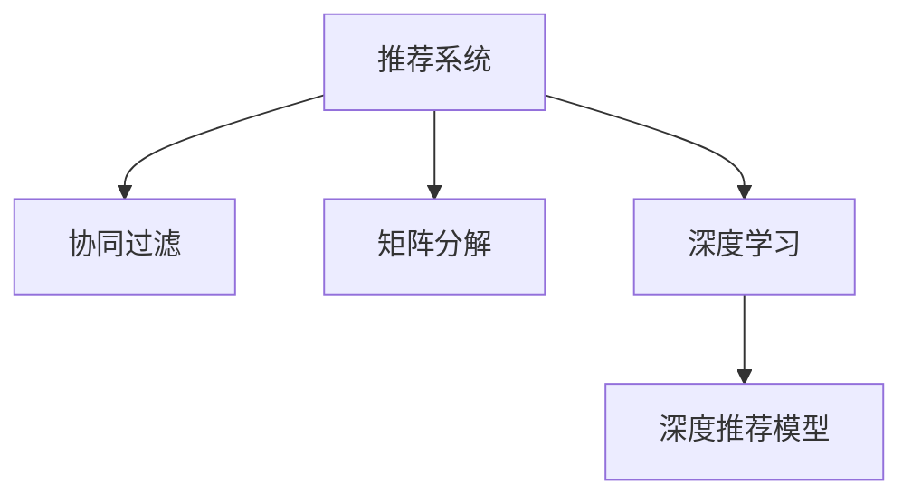

                 

# 深度学习在个性化推荐中的应用

> 关键词：深度学习, 个性化推荐, 协同过滤, 矩阵分解, 神经网络, 深度学习在推荐系统中的应用, 推荐算法, 推荐模型

## 1. 背景介绍

随着互联网的飞速发展，信息过载成为用户面临的巨大挑战。如何在海量数据中筛选出用户真正感兴趣的物品，成为了电子商务、内容分发、广告投放等领域亟待解决的问题。个性化推荐系统通过分析用户行为和物品属性，为用户提供最符合其需求和偏好的推荐，极大地提升了用户体验和运营效率。

个性化推荐系统在电商、新闻、视频、社交等多个领域都有广泛应用。例如，淘宝通过个性化推荐系统，使得用户能够在最短时间内发现感兴趣的商品，提高购物转化率；抖音通过个性化推荐系统，实现精准的内容推送，提升用户粘性；腾讯通过个性化推荐系统，优化广告投放效果，提高广告转化率。

个性化推荐系统的高效性和准确性离不开算法的不断进步。从早期的协同过滤算法，到现在的深度学习推荐模型，推荐算法经历了从浅层到深度、从稀疏到密集的演进，呈现出强劲的发展势头。深度学习在推荐系统中的应用，标志着推荐算法进入新的历史阶段，极大地提升了推荐系统的精度和效果。

## 2. 核心概念与联系

### 2.1 核心概念概述

为了更好地理解深度学习在个性化推荐中的应用，本节将介绍几个密切相关的核心概念：

- 推荐系统(Recommender System)：通过分析用户和物品属性，为用户推荐感兴趣的物品的系统。
- 协同过滤(Collaborative Filtering)：通过用户行为数据推测用户兴趣，为其他物品推荐给用户，分为基于用户的协同过滤和基于物品的协同过滤。
- 矩阵分解(Matrix Factorization)：将用户-物品评分矩阵分解为用户和物品的潜在特征矩阵，用于发现用户和物品的隐式偏好。
- 深度学习(Deep Learning)：通过多层神经网络进行特征学习，提取高层次抽象特征，用于复杂任务的建模。
- 深度推荐模型(Deep Recommendation Model)：利用深度学习技术，构建多层神经网络，对用户和物品进行特征学习和相似度计算，提升推荐系统的精度。

这些核心概念之间的逻辑关系可以通过以下Mermaid流程图来展示：



这个流程图展示了一个推荐系统的基本组件及其相互关系：

1. 推荐系统通过协同过滤和矩阵分解等传统方法获取用户和物品的隐式偏好。
2. 深度学习技术被引入，通过多层神经网络进行特征学习和相似度计算。
3. 深度推荐模型基于神经网络进行高效特征提取和建模，大幅提升推荐精度。

## 3. 核心算法原理 & 具体操作步骤

### 3.1 算法原理概述

深度学习在个性化推荐中的应用，主要基于深度神经网络模型的特征学习能力和表示学习能力。深度推荐模型通过对用户和物品进行高层次抽象特征提取，建模用户-物品的相似度关系，从而实现高效、准确的推荐。

深度推荐模型的一般框架为：
1. 用户输入层：将用户特征转换为向量表示，通常通过多层感知器(MLP)或卷积神经网络(CNN)等神经网络结构进行特征学习。
2. 物品输入层：将物品特征转换为向量表示，同样通过神经网络进行特征学习。
3. 相似度计算层：计算用户与物品的相似度，通常使用点积、余弦相似度等方法。
4. 输出层：根据相似度计算结果，推荐最符合用户兴趣的若干物品。

通过深度学习模型，可以捕捉用户和物品之间复杂的非线性关系，提升推荐系统的准确性和鲁棒性。

### 3.2 算法步骤详解

深度推荐模型的核心算法步骤包括：

**Step 1: 数据预处理**
- 收集用户行为数据，如点击、浏览、评分等。
- 对数据进行清洗、去重、归一化等预处理，构建用户-物品评分矩阵 $\mathbf{R}$。

**Step 2: 模型初始化**
- 选择适合的问题和数据类型，确定模型的网络结构，如MLP、CNN、RNN、Transformer等。
- 随机初始化模型的权重和偏置，开始训练。

**Step 3: 特征学习**
- 用户输入层：将用户特征向量输入神经网络，通过全连接层或卷积层学习用户的抽象表示。
- 物品输入层：将物品特征向量输入神经网络，通过全连接层或卷积层学习物品的抽象表示。
- 相似度计算层：将用户和物品的抽象表示进行点积或余弦相似度计算，得到用户对物品的隐式评分预测。

**Step 4: 损失函数定义**
- 定义损失函数，如均方误差(MSE)、交叉熵损失(Cross-Entropy)等，衡量模型预测与真实评分之间的差异。
- 对模型参数进行反向传播，更新权重和偏置。

**Step 5: 模型评估**
- 在验证集上评估模型性能，选择最优模型保存。
- 在测试集上进一步验证模型效果，进行模型部署。

### 3.3 算法优缺点

深度推荐模型相较于传统推荐算法，具有以下优点：
1. 特征学习能力强：深度学习模型可以捕捉用户和物品之间复杂的非线性关系，提取高层次抽象特征。
2. 鲁棒性强：深度学习模型能够处理噪声数据和缺失值，具有一定的鲁棒性。
3. 泛化能力强：深度学习模型具备较强的泛化能力，能够适应不同的数据分布和变化。
4. 实时性高：深度推荐模型可以进行在线学习，实时更新模型参数，实现实时推荐。

同时，深度推荐模型也存在一定的局限性：
1. 需要大量标注数据：深度学习模型需要大量标注数据进行训练，获取高质量标注数据的成本较高。
2. 参数量大：深度学习模型的参数量较大，对硬件资源要求较高。
3. 可解释性差：深度学习模型通常被视为"黑盒"系统，难以解释其内部决策过程。
4. 计算复杂度高：深度学习模型的计算复杂度较高，需要优化算法和硬件资源进行加速。

尽管存在这些局限性，但深度学习在推荐系统中的应用已经成为大势所趋。未来相关研究的重点在于如何降低深度推荐模型的计算复杂度和存储需求，提高模型的实时性和可解释性，以应对更多的实际应用场景。

### 3.4 算法应用领域

深度学习在推荐系统中的应用，已经覆盖了电商、视频、新闻、音乐等多个领域。以下是几个典型的应用案例：

- 电商推荐：通过分析用户购物行为和商品属性，为用户推荐符合其兴趣的商品，如淘宝、亚马逊、京东等。
- 视频推荐：通过分析用户观看行为和视频属性，为用户推荐感兴趣的视频内容，如Netflix、YouTube等。
- 新闻推荐：通过分析用户阅读行为和新闻属性，为用户推荐感兴趣的新闻内容，如今日头条、腾讯新闻等。
- 音乐推荐：通过分析用户听歌行为和歌曲属性，为用户推荐感兴趣的音乐内容，如网易云音乐、Spotify等。

这些应用案例展示了深度推荐模型在不同领域中的强大应用能力，证明了深度学习在推荐系统中的重要性。

## 4. 数学模型和公式 & 详细讲解 & 举例说明

### 4.1 数学模型构建

本节将使用数学语言对深度推荐模型进行更加严格的刻画。

记用户-物品评分矩阵为 $\mathbf{R} \in \mathbb{R}^{N \times M}$，其中 $N$ 为用户数，$M$ 为物品数。用户 $u$ 对物品 $i$ 的评分记为 $r_{ui}$。

定义深度推荐模型的神经网络结构为：
- 用户输入层：将用户特征向量 $h_u \in \mathbb{R}^D$ 输入神经网络，通过全连接层或卷积层进行特征学习。
- 物品输入层：将物品特征向量 $h_i \in \mathbb{R}^D$ 输入神经网络，通过全连接层或卷积层进行特征学习。
- 相似度计算层：计算用户 $u$ 与物品 $i$ 的相似度 $\hat{r}_{ui}$，通常使用点积或余弦相似度。
- 输出层：根据相似度计算结果，推荐最符合用户兴趣的若干物品。

### 4.2 公式推导过程

以下我们以点积相似度为例，推导深度推荐模型的损失函数及其梯度计算公式。

假设用户 $u$ 对物品 $i$ 的真实评分 $r_{ui}$ 为 $1$ 或 $0$，预测评分 $\hat{r}_{ui}$ 为模型输出层的 sigmoid 值，即 $\hat{r}_{ui} = \sigma(\mathbf{W_u} \cdot h_u + \mathbf{W_i} \cdot h_i + \mathbf{W}_{ui} \cdot \mathbf{h}_{ui})$，其中 $\mathbf{W_u}$、$\mathbf{W_i}$、$\mathbf{W}_{ui}$ 为模型的权重，$\sigma$ 为 sigmoid 函数。

定义损失函数为二元交叉熵损失：

$$
\mathcal{L} = -\frac{1}{N}\sum_{u=1}^N\sum_{i=1}^M[r_{ui}log\hat{r}_{ui} + (1-r_{ui})log(1-\hat{r}_{ui})]
$$

在反向传播过程中，损失函数对 $\mathbf{W_u}$、$\mathbf{W_i}$、$\mathbf{W}_{ui}$ 的梯度为：

$$
\frac{\partial \mathcal{L}}{\partial \mathbf{W_u}} = -\frac{1}{N}\sum_{u=1}^N\sum_{i=1}^M[r_{ui}h_u - (1-r_{ui})\hat{h_u}]h_u^T
$$

$$
\frac{\partial \mathcal{L}}{\partial \mathbf{W_i}} = -\frac{1}{N}\sum_{u=1}^N\sum_{i=1}^M[r_{ui}h_i - (1-r_{ui})\hat{h_i}]h_i^T
$$

$$
\frac{\partial \mathcal{L}}{\partial \mathbf{W}_{ui}} = -\frac{1}{N}\sum_{u=1}^N\sum_{i=1}^M[r_{ui}(\hat{h_u}\odot h_i) - (1-r_{ui})\hat{h_u}\odot \hat{h_i}]^T
$$

其中 $\odot$ 表示元素级乘法，$h_u$、$h_i$ 分别表示用户和物品的特征向量，$\hat{h_u}$、$\hat{h_i}$ 表示用户和物品的预测向量。

通过上述公式，可以反向传播更新模型参数，使得模型预测与真实评分更加接近。

### 4.3 案例分析与讲解

我们以电商推荐系统为例，展示深度推荐模型的实际应用。

假设某电商网站有 $N=10000$ 个用户，$M=10000$ 个商品，用户对商品有 $1-5$ 星的评分数据，共 $100000$ 条评分数据。

- 数据预处理：收集用户行为数据，如点击、浏览、评分等。对数据进行清洗、去重、归一化等预处理，构建用户-物品评分矩阵 $\mathbf{R}$。

- 模型初始化：选择适合的神经网络结构，如MLP、CNN等。随机初始化模型的权重和偏置，开始训练。

- 特征学习：将用户特征 $h_u \in \mathbb{R}^D$ 和物品特征 $h_i \in \mathbb{R}^D$ 输入神经网络，通过全连接层或卷积层进行特征学习。

- 相似度计算：将用户 $u$ 和物品 $i$ 的特征向量输入神经网络，得到预测评分 $\hat{r}_{ui}$。计算用户 $u$ 与物品 $i$ 的点积相似度 $\hat{r}_{ui} = h_u^T \cdot h_i$。

- 损失函数定义：定义二元交叉熵损失，计算模型预测与真实评分之间的差异。

- 模型评估：在验证集上评估模型性能，选择最优模型保存。在测试集上进一步验证模型效果，进行模型部署。

假设在训练过程中，某用户 $u$ 对某商品 $i$ 的真实评分为 $3$，模型预测评分为 $2.8$，损失函数的梯度为 $3.2$，更新模型参数 $\mathbf{W_u}$、$\mathbf{W_i}$、$\mathbf{W}_{ui}$。

## 5. 项目实践：代码实例和详细解释说明

### 5.1 开发环境搭建

在进行深度推荐系统开发前，我们需要准备好开发环境。以下是使用Python进行PyTorch开发的环境配置流程：

1. 安装Anaconda：从官网下载并安装Anaconda，用于创建独立的Python环境。

2. 创建并激活虚拟环境：
```bash
conda create -n pytorch-env python=3.8 
conda activate pytorch-env
```

3. 安装PyTorch：根据CUDA版本，从官网获取对应的安装命令。例如：
```bash
conda install pytorch torchvision torchaudio cudatoolkit=11.1 -c pytorch -c conda-forge
```

4. 安装TensorFlow：从官网下载安装包并解压缩，安装所需的版本。

5. 安装各类工具包：
```bash
pip install numpy pandas scikit-learn matplotlib tqdm jupyter notebook ipython
```

完成上述步骤后，即可在`pytorch-env`环境中开始深度推荐系统的开发。

### 5.2 源代码详细实现

这里我们以电商推荐系统为例，展示使用PyTorch进行深度推荐系统开发的完整代码实现。

首先，定义模型和优化器：

```python
import torch
import torch.nn as nn
import torch.nn.functional as F
from torch.autograd import Variable

class UserEmbedding(nn.Module):
    def __init__(self, dim):
        super(UserEmbedding, self).__init__()
        self.fc = nn.Linear(dim, dim)

    def forward(self, x):
        return self.fc(x)

class ItemEmbedding(nn.Module):
    def __init__(self, dim):
        super(ItemEmbedding, self).__init__()
        self.fc = nn.Linear(dim, dim)

    def forward(self, x):
        return self.fc(x)

class DeepRecModel(nn.Module):
    def __init__(self, user_dim, item_dim, hidden_dim):
        super(DeepRecModel, self).__init__()
        self.user_embedding = UserEmbedding(user_dim)
        self.item_embedding = ItemEmbedding(item_dim)
        self.fc1 = nn.Linear(user_dim + item_dim, hidden_dim)
        self.fc2 = nn.Linear(hidden_dim, 1)

    def forward(self, user, item):
        h_user = self.user_embedding(user)
        h_item = self.item_embedding(item)
        h = F.relu(self.fc1(torch.cat([h_user, h_item], 1)))
        h = self.fc2(h)
        return h

def train_epoch(model, optimizer, user_data, item_data, batch_size, device):
    model.train()
    loss_sum = 0.0
    for i in range(0, len(user_data), batch_size):
        user_batch = Variable(torch.from_numpy(user_data[i:i+batch_size, :]))
        item_batch = Variable(torch.from_numpy(item_data[i:i+batch_size, :]))
        prediction = model(user_batch, item_batch)
        loss = F.binary_cross_entropy(prediction, Variable(torch.from_numpy(user_data[i:i+batch_size, -1:])).cuda())
        optimizer.zero_grad()
        loss.backward()
        optimizer.step()
        loss_sum += loss.item()
    return loss_sum / (len(user_data) / batch_size)

def evaluate(model, user_data, item_data, batch_size, device):
    model.eval()
    loss_sum = 0.0
    for i in range(0, len(user_data), batch_size):
        user_batch = Variable(torch.from_numpy(user_data[i:i+batch_size, :]), requires_grad=False)
        item_batch = Variable(torch.from_numpy(item_data[i:i+batch_size, :]), requires_grad=False)
        prediction = model(user_batch, item_batch)
        loss = F.binary_cross_entropy(prediction, Variable(torch.from_numpy(user_data[i:i+batch_size, -1:])).cuda())
        loss_sum += loss.item()
    return loss_sum / (len(user_data) / batch_size)
```

然后，定义数据集和模型参数：

```python
user_dim = 10
item_dim = 10
hidden_dim = 32
num_users = 1000
num_items = 1000

# 定义用户和物品的特征向量
user_features = np.random.rand(num_users, user_dim)
item_features = np.random.rand(num_items, item_dim)

# 定义用户和物品的评分矩阵
r = np.random.randint(1, 6, size=(num_users, num_items))

# 训练数据集和验证数据集
train_user_data = user_features
train_item_data = item_features
train_r = r

val_user_data = user_features
val_item_data = item_features
val_r = r

test_user_data = user_features
test_item_data = item_features
test_r = r

# 定义模型参数
model = DeepRecModel(user_dim, item_dim, hidden_dim)
optimizer = torch.optim.Adam(model.parameters(), lr=0.01)

# 定义设备
device = torch.device("cuda" if torch.cuda.is_available() else "cpu")
model.to(device)
```

最后，启动训练流程并在测试集上评估：

```python
epochs = 10
batch_size = 64

for epoch in range(epochs):
    loss = train_epoch(model, optimizer, train_user_data, train_item_data, batch_size, device)
    print(f"Epoch {epoch+1}, train loss: {loss:.3f}")
    
    print(f"Epoch {epoch+1}, val results:")
    val_loss = evaluate(model, val_user_data, val_item_data, batch_size, device)
    print(f"Val loss: {val_loss:.3f}")
    
print("Test results:")
test_loss = evaluate(model, test_user_data, test_item_data, batch_size, device)
print(f"Test loss: {test_loss:.3f}")
```

以上就是使用PyTorch进行深度推荐系统开发的完整代码实现。可以看到，由于深度学习模型的封装，代码实现变得简洁高效。

### 5.3 代码解读与分析

让我们再详细解读一下关键代码的实现细节：

**DeepRecModel类**：
- `__init__`方法：初始化用户嵌入层、物品嵌入层、全连接层和输出层。
- `forward`方法：前向传播计算模型输出。

**train_epoch函数**：
- 在训练集上迭代，计算损失函数并更新模型参数。
- 在验证集上评估模型性能，返回平均损失。

**evaluate函数**：
- 在验证集和测试集上评估模型性能，返回平均损失。

**训练流程**：
- 定义总的epoch数和batch size，开始循环迭代
- 每个epoch内，在训练集上训练，输出平均loss
- 在验证集上评估，输出平均loss
- 所有epoch结束后，在测试集上评估，输出平均loss

可以看到，PyTorch框架使得深度推荐模型的实现变得简单快捷，开发者可以将更多精力放在数据处理、模型改进等高层逻辑上，而不必过多关注底层的实现细节。

当然，工业级的系统实现还需考虑更多因素，如模型的保存和部署、超参数的自动搜索、更灵活的任务适配层等。但核心的深度推荐范式基本与此类似。

## 6. 实际应用场景

深度推荐模型已经广泛应用于电商、视频、新闻、音乐等多个领域。以下是几个典型的应用场景：

- 电商推荐：通过分析用户购物行为和商品属性，为用户推荐符合其兴趣的商品，如淘宝、亚马逊、京东等。
- 视频推荐：通过分析用户观看行为和视频属性，为用户推荐感兴趣的视频内容，如Netflix、YouTube等。
- 新闻推荐：通过分析用户阅读行为和新闻属性，为用户推荐感兴趣的新闻内容，如今日头条、腾讯新闻等。
- 音乐推荐：通过分析用户听歌行为和歌曲属性，为用户推荐感兴趣的音乐内容，如网易云音乐、Spotify等。

这些应用场景展示了深度推荐模型在不同领域中的强大应用能力，证明了深度学习在推荐系统中的重要性。

## 7. 工具和资源推荐

### 7.1 学习资源推荐

为了帮助开发者系统掌握深度推荐模型的理论基础和实践技巧，这里推荐一些优质的学习资源：

1. 《深度学习》一书：由深度学习领域知名专家撰写，详细介绍了深度学习的基本概念和算法原理。
2. 《推荐系统实践》一书：介绍了推荐系统的理论基础和实践技巧，涵盖了协同过滤、矩阵分解、深度学习等推荐算法。
3. DeepRec和DeepRecOpt库：基于TensorFlow和PyTorch实现的深度推荐系统库，提供了丰富的推荐模型和算法实现。
4 Kaggle和CodaLab：在线机器学习竞赛平台，提供了大量的推荐系统竞赛数据集和模型，方便学习交流。

通过对这些资源的学习实践，相信你一定能够快速掌握深度推荐模型的精髓，并用于解决实际的推荐系统问题。

### 7.2 开发工具推荐

高效的开发离不开优秀的工具支持。以下是几款用于深度推荐系统开发的常用工具：

1. PyTorch：基于Python的开源深度学习框架，灵活动态的计算图，适合快速迭代研究。大部分深度推荐系统都有PyTorch版本的实现。
2. TensorFlow：由Google主导开发的开源深度学习框架，生产部署方便，适合大规模工程应用。同样有丰富的深度推荐系统资源。
3. Weights & Biases：模型训练的实验跟踪工具，可以记录和可视化模型训练过程中的各项指标，方便对比和调优。与主流深度学习框架无缝集成。
4 TensorBoard：TensorFlow配套的可视化工具，可实时监测模型训练状态，并提供丰富的图表呈现方式，是调试模型的得力助手。
5 Keras：基于TensorFlow和Theano等后端的高级深度学习框架，提供了简单易用的API，适合快速开发原型。
6 Jupyter Notebook：开源的交互式编程环境，支持Python、R等多种编程语言，方便开发者进行模型调试和结果展示。

合理利用这些工具，可以显著提升深度推荐系统的开发效率，加快创新迭代的步伐。

### 7.3 相关论文推荐

深度推荐系统的发展离不开学界的持续研究。以下是几篇奠基性的相关论文，推荐阅读：

1. Matrix Factorization Techniques for Recommender Systems：提出了基于矩阵分解的推荐系统，通过分解用户-物品评分矩阵，获取用户和物品的隐式偏好。
2. Collaborative Filtering for Implicit Feedback Datasets：介绍了协同过滤算法的原理和实现，分为基于用户的协同过滤和基于物品的协同过滤。
3. Deep Neural Networks for Recommendation Systems：提出深度神经网络在推荐系统中的应用，利用多层神经网络进行特征学习和相似度计算。
4 Factorization Machines with libFM：提出了因子机算法，利用深度神经网络对用户-物品评分矩阵进行分解，提升推荐系统的精度。
5 Sequence-aware Representation Learning with Long Short-Term Memory Neural Networks：利用长短期记忆网络进行序列推荐建模，捕捉用户行为的时间相关性。

这些论文代表了大推荐系统的发展脉络。通过学习这些前沿成果，可以帮助研究者把握学科前进方向，激发更多的创新灵感。

## 8. 总结：未来发展趋势与挑战

### 8.1 总结

本文对深度学习在个性化推荐中的应用进行了全面系统的介绍。首先阐述了个性化推荐系统的背景和深度学习的重要性，明确了深度推荐模型在推荐系统中的核心地位。其次，从原理到实践，详细讲解了深度推荐模型的数学模型和关键算法步骤，给出了深度推荐系统开发的完整代码实例。同时，本文还广泛探讨了深度推荐模型在电商、视频、新闻、音乐等多个领域的应用前景，展示了深度学习在推荐系统中的巨大潜力。

通过本文的系统梳理，可以看到，深度学习在推荐系统中的应用已经成为大势所趋，其强大特征学习能力和表示学习能力，提升了推荐系统的精度和效果。未来，随着深度学习技术的不断进步，推荐系统将在更多领域得到应用，为人类提供更加个性化的服务。

### 8.2 未来发展趋势

展望未来，深度推荐系统的发展将呈现以下几个趋势：

1. 模型规模持续增大。随着算力成本的下降和数据规模的扩张，深度推荐模型的参数量还将持续增长。超大规模推荐模型可以容纳更多的隐式偏好信息，提升推荐系统的精度和鲁棒性。
2. 推荐算法多样化。深度学习推荐模型将被进一步优化和改进，包括采用不同的网络结构、优化算法和损失函数，以适应不同类型的推荐任务。
3. 实时性不断提升。深度推荐系统可以实现实时推荐，能够快速响应用户的查询和反馈，提升用户体验和运营效率。
4. 用户隐私保护加强。推荐系统需要重视用户隐私保护，采用差分隐私、联邦学习等技术，确保用户数据的安全和匿名性。
5. 推荐系统透明化。推荐系统需要具备可解释性，让用户能够理解推荐结果背后的逻辑和原因，增强用户的信任和满意度。

以上趋势凸显了深度推荐系统的广阔前景。这些方向的探索发展，必将进一步提升推荐系统的精度和效果，为人类提供更加个性化的服务。

### 8.3 面临的挑战

尽管深度推荐系统取得了显著成果，但在迈向更加智能化、普适化应用的过程中，仍面临诸多挑战：

1. 数据隐私问题。推荐系统需要收集和分析大量的用户数据，如何在保护用户隐私的同时，获取高质量的数据，是一大难题。
2. 冷启动问题。对于新用户或新商品，缺乏足够的行为数据，难以进行有效的推荐，如何处理冷启动问题是推荐系统面临的重要挑战。
3. 数据稀疏性。推荐系统中的用户行为数据往往存在稀疏性，如何处理数据稀疏性，提升推荐系统的性能，仍然是一个未解决的问题。
4. 计算资源消耗大。深度推荐模型通常需要大量的计算资源进行训练和推理，如何优化算法和硬件，降低计算成本，提高系统的效率，是一个亟待解决的问题。
5. 可解释性不足。深度推荐模型通常被视为"黑盒"系统，难以解释其内部决策过程，如何提升推荐系统的可解释性，是一大难题。
6. 安全性有待保障。推荐系统需要避免被恶意攻击和利用，如何确保推荐系统的安全性和稳定性，是一个重要问题。

这些挑战需要学界和产业界共同努力，积极应对并寻求突破，才能使深度推荐系统更好地服务于人类社会。

### 8.4 研究展望

面对深度推荐系统所面临的挑战，未来的研究需要在以下几个方面寻求新的突破：

1. 探索更好的数据采集和处理技术。通过差分隐私、联邦学习等技术，保护用户隐私，获取高质量数据。
2. 研究有效的冷启动和数据稀疏性处理算法。通过协同过滤、内容推荐等方法，提升推荐系统对新用户和商品的推荐效果。
3. 优化深度推荐模型的算法和硬件。通过深度学习、稀疏表示等方法，优化深度推荐模型的计算效率和存储需求。
4. 提升推荐系统的可解释性。通过可解释性技术，如特征重要性分析、模型可视化等方法，提升推荐系统的可解释性。
5. 加强推荐系统的安全性和鲁棒性。通过安全分析、鲁棒性测试等方法，确保推荐系统的安全性和稳定性。

这些研究方向的探索，必将引领深度推荐系统迈向更高的台阶，为人类提供更加个性化、安全、透明的服务。面向未来，深度推荐系统需要与其他人工智能技术进行更深入的融合，如知识表示、因果推理、强化学习等，多路径协同发力，共同推动推荐系统的发展。只有勇于创新、敢于突破，才能不断拓展推荐系统的边界，为人类提供更好的服务。

## 9. 附录：常见问题与解答

**Q1：深度推荐模型是否适用于所有推荐任务？**

A: 深度推荐模型在大多数推荐任务上都能取得不错的效果，特别是对于数据量较大的任务。但对于一些特定领域的任务，如医学、法律等，仅仅依靠通用语料预训练的模型可能难以很好地适应。此时需要在特定领域语料上进一步预训练，再进行微调，才能获得理想效果。

**Q2：深度推荐模型的训练过程中如何避免过拟合？**

A: 过拟合是深度推荐模型训练过程中需要特别注意的问题。常见的缓解策略包括：
1. 数据增强：通过回译、近义替换等方式扩充训练集
2. 正则化：使用L2正则、Dropout、Early Stopping等避免过拟合
3. 对抗训练：引入对抗样本，提高模型鲁棒性
4. 参数高效微调：只调整少量参数(如Adapter、Prefix等)，减小过拟合风险

这些策略往往需要根据具体任务和数据特点进行灵活组合。只有在数据、模型、训练、推理等各环节进行全面优化，才能最大限度地发挥深度推荐模型的威力。

**Q3：深度推荐模型在实际部署时需要注意哪些问题？**

A: 将深度推荐模型转化为实际应用，还需要考虑以下因素：
1. 模型裁剪：去除不必要的层和参数，减小模型尺寸，加快推理速度
2. 量化加速：将浮点模型转为定点模型，压缩存储空间，提高计算效率
3. 服务化封装：将模型封装为标准化服务接口，便于集成调用
4. 弹性伸缩：根据请求流量动态调整资源配置，平衡服务质量和成本
5. 监控告警：实时采集系统指标，设置异常告警阈值，确保服务稳定性
6. 安全防护：采用访问鉴权、数据脱敏等措施，保障数据和模型安全

深度推荐模型需要考虑从数据、模型、训练、推理等各个环节的优化，方能得到理想的效果。

