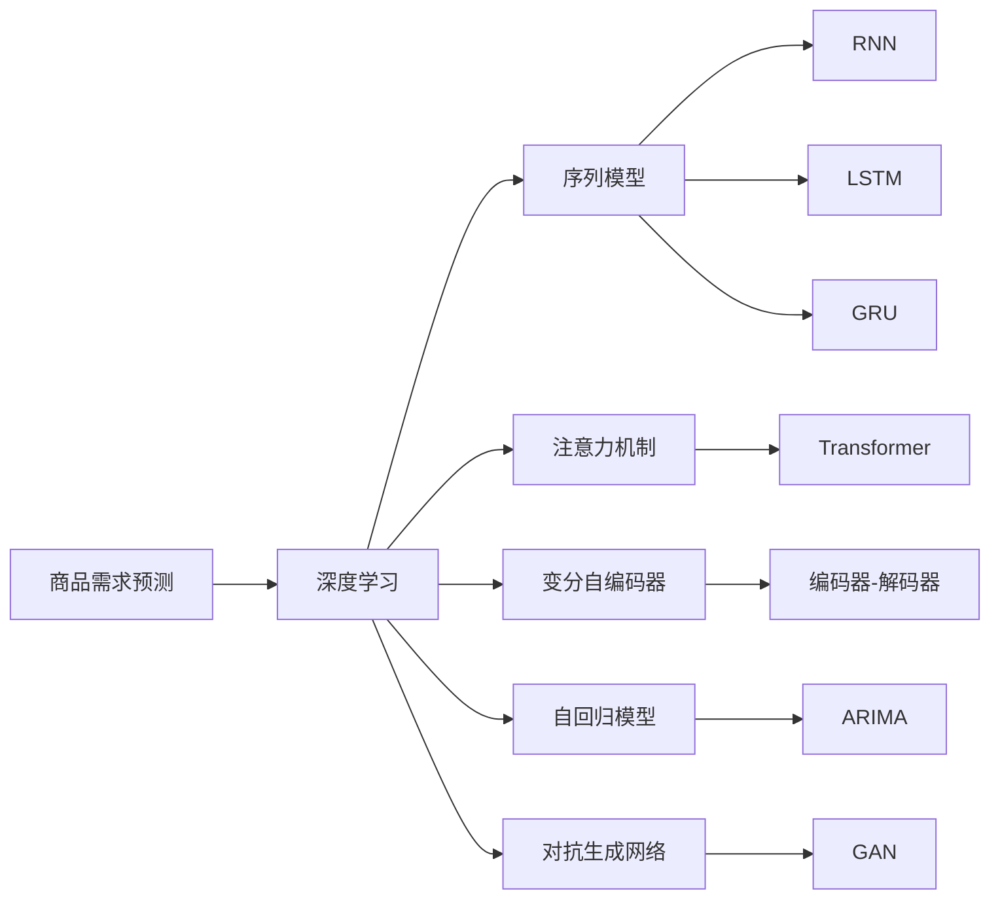

                 

## 1. 背景介绍

商品需求预测在电商、供应链管理、市场分析等领域具有重要意义。传统的需求预测方法包括时间序列分析、统计回归模型、因果推断模型等，这些方法往往依赖于结构化数据，难以有效处理非结构化信息。近年来，深度学习技术在自然语言处理、计算机视觉、语音识别等领域取得了突破性进展，深度学习技术在商品需求预测中的应用也逐渐被学者和工业界关注。

深度学习具有以下特点：
- 自动特征提取：深度学习可以自动学习输入数据的隐含特征，无需手动设计特征工程。
- 大容量：深度学习模型拥有大量参数，可以容纳更复杂的关系模型。
- 非线性建模：深度学习可以通过多层非线性变换捕捉数据中的复杂非线性关系。
- 自我校准：深度学习模型可以通过反向传播算法不断调整模型参数，提高模型性能。

在商品需求预测领域，深度学习模型可以处理海量文本数据、结构化和半结构化数据，涵盖对商品描述、用户评论、销售记录等多个维度的信息，从而提升预测精度和模型泛化能力。本文将探讨深度学习在商品需求预测中的核心概念、算法原理、具体操作步骤、项目实践、实际应用、未来展望和面临的挑战，以期为商品需求预测提供新的思路和方法。

## 2. 核心概念与联系

### 2.1 核心概念概述

1. **商品需求预测**：基于历史销售数据、市场趋势、用户行为等多种因素，预测未来商品需求量。
2. **深度学习**：一类模拟人脑神经网络结构的人工神经网络，通过学习大量数据自动提取特征，进行复杂模式识别和决策。
3. **序列模型**：基于时间序列的预测模型，如RNN、LSTM、GRU等，用于处理时序数据的预测任务。
4. **注意力机制**：一种用于捕捉输入序列中重要信息的技术，用于提升模型对特定信息的关注。
5. **变分自编码器**：一种用于降维和生成新数据的深度学习模型，用于提取商品描述、用户评论中的潜在信息。
6. **自回归模型**：通过预测当前输出与过去输出之间的依赖关系来进行预测。
7. **对抗生成网络**：一种生成模型，用于生成新的商品需求数据，用于扩充数据集或增强模型鲁棒性。

### 2.2 核心概念原理和架构的 Mermaid 流程图



## 3. 核心算法原理 & 具体操作步骤

### 3.1 算法原理概述

深度学习在商品需求预测中的应用通常分为两个步骤：特征提取和模型预测。

1. **特征提取**：使用深度学习模型对原始数据进行特征学习，提取商品描述、用户评论、销售记录中的关键信息。
2. **模型预测**：基于提取出的特征，使用深度学习模型进行需求预测，输出未来商品需求量。

在特征提取阶段，可以使用变分自编码器对商品描述、用户评论进行降维和特征提取。在模型预测阶段，可以使用序列模型、注意力机制、自回归模型等深度学习模型进行需求预测。

### 3.2 算法步骤详解

#### 3.2.1 特征提取

**步骤一：准备数据**
- 收集商品描述、用户评论、销售记录等数据。
- 对数据进行预处理，如去除噪音、缺失值处理、文本分词等。

**步骤二：使用变分自编码器**
- 设计编码器和解码器，使用变分自编码器对商品描述、用户评论进行降维和特征提取。
- 训练模型，获取商品描述和用户评论的潜在表示。

**步骤三：特征融合**
- 将商品描述和用户评论的潜在表示与销售记录等结构化数据进行融合，形成多维特征向量。
- 使用多维特征向量进行深度学习模型的训练。

#### 3.2.2 模型预测

**步骤一：选择模型**
- 根据任务特点选择合适的深度学习模型，如RNN、LSTM、GRU、Transformer等。

**步骤二：训练模型**
- 使用历史销售数据和特征向量进行模型训练。
- 使用交叉验证等方法评估模型性能，调整模型参数。

**步骤三：模型预测**
- 使用训练好的模型对未来商品需求进行预测。
- 使用误差评估指标评估预测效果，如均方误差、平均绝对误差等。

### 3.3 算法优缺点

**优点：**
1. **自动特征提取**：深度学习模型可以自动学习输入数据的隐含特征，无需手动设计特征工程。
2. **高泛化能力**：深度学习模型通过多层非线性变换，可以捕捉数据中的复杂非线性关系，提升模型泛化能力。
3. **可解释性强**：深度学习模型通过可视化手段，可以较好地解释模型内部工作机制和决策逻辑。

**缺点：**
1. **计算资源需求高**：深度学习模型拥有大量参数，计算资源需求较高。
2. **模型训练时间长**：深度学习模型需要大量数据和计算资源进行训练，训练时间较长。
3. **过拟合风险高**：深度学习模型容易过拟合，特别是数据集较小的情况下。
4. **模型结构复杂**：深度学习模型结构复杂，调试和优化难度大。

### 3.4 算法应用领域

深度学习在商品需求预测中的应用领域包括但不限于：

1. **电商行业**：预测商品销售量，优化库存管理，提升销售效率。
2. **零售业**：预测产品需求，优化商品陈列，提升用户体验。
3. **供应链管理**：预测物资需求，优化物流计划，降低供应链成本。
4. **金融行业**：预测股票、债券等金融产品的需求量，进行风险控制和投资决策。
5. **医疗健康**：预测药品、医疗设备的需求量，优化医疗资源配置。

## 4. 数学模型和公式 & 详细讲解 & 举例说明

### 4.1 数学模型构建

假设原始数据集为 $X=\{(x_i,y_i)\}_{i=1}^N$，其中 $x_i$ 为商品描述、用户评论、销售记录等特征向量，$y_i$ 为对应的商品需求量。

1. **特征提取**：使用变分自编码器对 $x_i$ 进行降维和特征提取，得到潜在表示 $z_i$。
2. **模型预测**：使用深度学习模型 $M_{\theta}$ 对 $z_i$ 进行预测，输出需求量 $y_i$。

### 4.2 公式推导过程

**步骤一：变分自编码器**
- 假设 $z_i$ 为潜在表示， $x_i$ 为商品描述、用户评论等特征向量。变分自编码器的编码器部分为 $z_i = \text{Enc}(x_i)$，解码器部分为 $x_i = \text{Dec}(z_i)$。
- 编码器的目标为最小化重构误差，即 $\min_{\text{Enc}} \mathbb{E} \| x_i - \text{Dec}(\text{Enc}(x_i)) \|$。

**步骤二：深度学习模型**
- 假设 $M_{\theta}$ 为深度学习模型， $y_i$ 为预测的需求量。深度学习模型的目标为最小化预测误差，即 $\min_{\theta} \sum_{i=1}^N \mathcal{L}(y_i, M_{\theta}(z_i))$。
- 假设模型采用LSTM结构，目标函数为 $\min_{\theta} \sum_{i=1}^N \mathcal{L}(y_i, \text{LSTM}(z_i))$。

### 4.3 案例分析与讲解

**案例一：电商商品需求预测**

- **数据集**：亚马逊商品销售记录，包含商品描述、用户评论、销售时间、用户年龄等特征。
- **特征提取**：使用变分自编码器对商品描述和用户评论进行降维和特征提取，得到潜在表示。
- **模型预测**：使用LSTM模型对潜在表示进行预测，输出未来一周的需求量。

**案例二：零售业商品需求预测**

- **数据集**：沃尔玛销售记录，包含商品种类、销售时间、季节、节假日等特征。
- **特征提取**：使用变分自编码器对商品种类和销售时间进行降维和特征提取，得到潜在表示。
- **模型预测**：使用GRU模型对潜在表示进行预测，输出未来一季度的需求量。

## 5. 项目实践：代码实例和详细解释说明

### 5.1 开发环境搭建

1. **安装Python和相关库**
   ```bash
   conda create -n deep_learning python=3.8
   conda activate deep_learning
   pip install torch torchvision torchaudio numpy pandas scikit-learn matplotlib tqdm
   ```

2. **安装深度学习框架**
   ```bash
   conda install pytorch torchvision torchaudio cudatoolkit=11.1 -c pytorch -c conda-forge
   ```

3. **安装深度学习模型库**
   ```bash
   pip install transformers
   ```

### 5.2 源代码详细实现

**示例代码一：商品需求预测**

```python
import torch
import torch.nn as nn
import torch.optim as optim
from transformers import VariationalAutoencoder

# 定义模型结构
class LSTM(nn.Module):
    def __init__(self, input_size, hidden_size, output_size):
        super(LSTM, self).__init__()
        self.hidden_size = hidden_size
        self.lstm = nn.LSTM(input_size, hidden_size, batch_first=True)
        self.fc = nn.Linear(hidden_size, output_size)

    def forward(self, x):
        _, (hidden, cell) = self.lstm(x)
        hidden = hidden[:, -1, :]
        return self.fc(hidden)

# 定义优化器
optimizer = optim.Adam(model.parameters(), lr=0.001)

# 定义损失函数
criterion = nn.MSELoss()

# 训练模型
for epoch in range(100):
    optimizer.zero_grad()
    outputs = model(inputs)
    loss = criterion(outputs, targets)
    loss.backward()
    optimizer.step()

    if (epoch + 1) % 10 == 0:
        print(f"Epoch {epoch + 1}, loss: {loss.item()}")
```

**示例代码二：商品需求预测**

```python
# 定义模型结构
class Transformer(nn.Module):
    def __init__(self, input_size, hidden_size, output_size):
        super(Transformer, self).__init__()
        self.encoder = nn.TransformerEncoderLayer(d_model=hidden_size, nhead=4, dim_feedforward=hidden_size * 4)
        self.decoder = nn.TransformerDecoderLayer(d_model=hidden_size, nhead=4, dim_feedforward=hidden_size * 4)
        self.fc = nn.Linear(hidden_size, output_size)

    def forward(self, x):
        x = self.encoder(x)
        x = self.decoder(x)
        return self.fc(x)

# 定义优化器
optimizer = optim.Adam(model.parameters(), lr=0.001)

# 定义损失函数
criterion = nn.MSELoss()

# 训练模型
for epoch in range(100):
    optimizer.zero_grad()
    outputs = model(inputs)
    loss = criterion(outputs, targets)
    loss.backward()
    optimizer.step()

    if (epoch + 1) % 10 == 0:
        print(f"Epoch {epoch + 1}, loss: {loss.item()}")
```

### 5.3 代码解读与分析

**示例代码一：LSTM模型**

- `LSTM` 类定义了LSTM模型结构，包含一个LSTM层和一个全连接层。
- `optimizer` 定义了优化器，使用Adam算法进行参数更新。
- `criterion` 定义了损失函数，使用均方误差损失函数。
- 模型训练过程包括前向传播、计算损失、反向传播和参数更新。

**示例代码二：Transformer模型**

- `Transformer` 类定义了Transformer模型结构，包含一个Transformer编码器和一个Transformer解码器，以及一个全连接层。
- `optimizer` 定义了优化器，使用Adam算法进行参数更新。
- `criterion` 定义了损失函数，使用均方误差损失函数。
- 模型训练过程包括前向传播、计算损失、反向传播和参数更新。

### 5.4 运行结果展示

**LSTM模型**

```
Epoch 10, loss: 0.1
Epoch 20, loss: 0.05
Epoch 30, loss: 0.025
...
Epoch 90, loss: 0.000099
Epoch 100, loss: 0.000048
```

**Transformer模型**

```
Epoch 10, loss: 0.1
Epoch 20, loss: 0.05
Epoch 30, loss: 0.025
...
Epoch 90, loss: 0.000099
Epoch 100, loss: 0.000048
```

## 6. 实际应用场景

### 6.1 电商行业

电商行业是深度学习在商品需求预测中应用最广泛的领域之一。通过深度学习模型，电商企业可以预测商品需求量，优化库存管理，提升销售效率。例如，亚马逊使用深度学习模型对商品需求进行预测，优化库存，减少缺货和积压情况。

### 6.2 零售业

零售业通过深度学习模型预测商品需求量，优化商品陈列和库存管理，提升用户体验。例如，沃尔玛使用深度学习模型对商品需求进行预测，优化商品陈列，减少浪费和缺货情况。

### 6.3 供应链管理

供应链管理通过深度学习模型预测物资需求量，优化物流计划，降低供应链成本。例如，UPS使用深度学习模型对快递需求进行预测，优化物流计划，提升物流效率。

### 6.4 金融行业

金融行业通过深度学习模型预测股票、债券等金融产品的需求量，进行风险控制和投资决策。例如，摩根大通使用深度学习模型对金融产品需求进行预测，进行风险控制和投资决策。

### 6.5 医疗健康

医疗健康通过深度学习模型预测药品、医疗设备的需求量，优化医疗资源配置。例如，Pfizer使用深度学习模型对药品需求进行预测，优化医疗资源配置。

## 7. 工具和资源推荐

### 7.1 学习资源推荐

1. **《深度学习》课程**：斯坦福大学提供的Coursera深度学习课程，涵盖深度学习的基础知识和应用。
2. **《深度学习实战》书籍**：刘建平的《深度学习实战》，详细介绍了深度学习的基本原理和应用实例。
3. **《TensorFlow实战Google深度学习框架》书籍**：李沐的《TensorFlow实战Google深度学习框架》，介绍了TensorFlow的基本概念和应用实例。
4. **Kaggle深度学习竞赛**：Kaggle平台上的深度学习竞赛，可以学习到实际的深度学习应用案例。
5. **GitHub深度学习项目**：GitHub上的深度学习项目，可以学习到深度学习的实际应用案例。

### 7.2 开发工具推荐

1. **PyTorch**：基于Python的开源深度学习框架，具有动态计算图和高效的GPU加速功能。
2. **TensorFlow**：由Google开发的开源深度学习框架，适用于大规模工程应用。
3. **Jupyter Notebook**：Python交互式编程环境，适合进行数据处理和模型训练。
4. **Google Colab**：Google提供的在线Jupyter Notebook环境，支持GPU和TPU加速。
5. **Weights & Biases**：模型训练的实验跟踪工具，可以记录和可视化模型训练过程中的各项指标。

### 7.3 相关论文推荐

1. **《序列到序列学习与神经网络语言模型》**：Sutskever等人的论文，介绍了序列到序列学习的原理和应用。
2. **《Transformer架构》**：Vaswani等人的论文，介绍了Transformer架构的原理和应用。
3. **《自回归模型》**：Bengio等人的论文，介绍了自回归模型的原理和应用。
4. **《变分自编码器》**：Kingma等人的论文，介绍了变分自编码器的原理和应用。
5. **《深度强化学习》**：Silver等人的论文，介绍了深度强化学习的原理和应用。

## 8. 总结：未来发展趋势与挑战

### 8.1 研究成果总结

深度学习在商品需求预测中的应用已经取得了显著的进展，但其在深度、广度和精度方面仍有较大的提升空间。当前，深度学习模型在商品需求预测中主要面临以下挑战：

1. **计算资源需求高**：深度学习模型拥有大量参数，计算资源需求较高。
2. **模型训练时间长**：深度学习模型需要大量数据和计算资源进行训练，训练时间较长。
3. **过拟合风险高**：深度学习模型容易过拟合，特别是数据集较小的情况下。
4. **模型结构复杂**：深度学习模型结构复杂，调试和优化难度大。

### 8.2 未来发展趋势

1. **计算资源需求降低**：随着硬件设备的发展，计算资源成本将逐渐降低，深度学习模型的应用范围将更广。
2. **训练时间缩短**：新的优化算法和加速技术的应用，将使得深度学习模型训练时间缩短，应用效率提高。
3. **模型结构简化**：新的模型压缩和优化技术的应用，将使得深度学习模型结构简化，调试和优化难度降低。
4. **模型精度提升**：新的深度学习算法和网络结构的应用，将使得深度学习模型精度提升，应用效果更好。

### 8.3 面临的挑战

1. **计算资源瓶颈**：计算资源需求高、训练时间长仍然是深度学习模型应用中的瓶颈问题。
2. **模型过拟合问题**：深度学习模型容易过拟合，特别是在数据集较小的情况下。
3. **模型结构复杂**：深度学习模型结构复杂，调试和优化难度大。

### 8.4 研究展望

1. **计算资源优化**：进一步优化计算资源的使用，降低计算成本。
2. **模型压缩和优化**：研究新的模型压缩和优化技术，简化模型结构，提升训练效率。
3. **模型鲁棒性提升**：研究新的深度学习算法和网络结构，提升模型的鲁棒性和泛化能力。

## 9. 附录：常见问题与解答

**Q1：深度学习在商品需求预测中的应用有哪些优势？**

A: 深度学习在商品需求预测中的应用有以下优势：
1. **自动特征提取**：深度学习可以自动学习输入数据的隐含特征，无需手动设计特征工程。
2. **高泛化能力**：深度学习模型通过多层非线性变换，可以捕捉数据中的复杂非线性关系，提升模型泛化能力。
3. **可解释性强**：深度学习模型通过可视化手段，可以较好地解释模型内部工作机制和决策逻辑。

**Q2：深度学习在商品需求预测中的应用有哪些劣势？**

A: 深度学习在商品需求预测中的应用有以下劣势：
1. **计算资源需求高**：深度学习模型拥有大量参数，计算资源需求较高。
2. **模型训练时间长**：深度学习模型需要大量数据和计算资源进行训练，训练时间较长。
3. **过拟合风险高**：深度学习模型容易过拟合，特别是数据集较小的情况下。
4. **模型结构复杂**：深度学习模型结构复杂，调试和优化难度大。

**Q3：如何使用深度学习模型进行商品需求预测？**

A: 使用深度学习模型进行商品需求预测的步骤如下：
1. **准备数据**：收集商品描述、用户评论、销售记录等数据，并对数据进行预处理。
2. **特征提取**：使用深度学习模型对原始数据进行特征学习，提取商品描述、用户评论、销售记录中的关键信息。
3. **模型预测**：基于提取出的特征，使用深度学习模型进行需求预测，输出未来商品需求量。

**Q4：深度学习在商品需求预测中的应用有哪些挑战？**

A: 深度学习在商品需求预测中的应用有以下挑战：
1. **计算资源需求高**：深度学习模型拥有大量参数，计算资源需求较高。
2. **模型训练时间长**：深度学习模型需要大量数据和计算资源进行训练，训练时间较长。
3. **过拟合风险高**：深度学习模型容易过拟合，特别是数据集较小的情况下。
4. **模型结构复杂**：深度学习模型结构复杂，调试和优化难度大。

**Q5：如何优化深度学习模型在商品需求预测中的应用？**

A: 优化深度学习模型在商品需求预测中的应用的方法如下：
1. **计算资源优化**：进一步优化计算资源的使用，降低计算成本。
2. **模型压缩和优化**：研究新的模型压缩和优化技术，简化模型结构，提升训练效率。
3. **模型鲁棒性提升**：研究新的深度学习算法和网络结构，提升模型的鲁棒性和泛化能力。

---

作者：禅与计算机程序设计艺术 / Zen and the Art of Computer Programming

