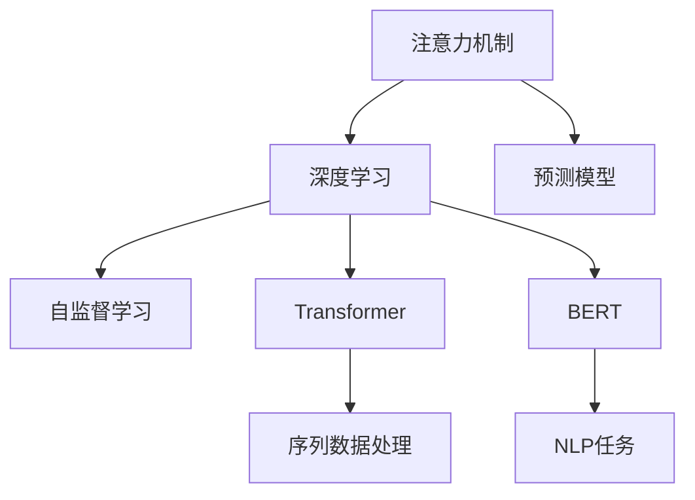

                 

# 深度学习在注意力预测模型中的应用

> 关键词：注意力机制,深度学习,预测模型,自监督学习,Transformer,BERT

## 1. 背景介绍

在深度学习领域，预测模型（Predictive Models）是最具代表性和应用最广泛的模型之一。预测模型旨在基于输入数据，通过机器学习算法预测出未来结果。其在金融预测、天气预报、医学诊断等领域有着广泛的应用。近年来，随着深度学习技术的发展，预测模型在精度、泛化能力等方面的性能得到了显著提升。特别是在注意力预测模型中，深度学习技术的应用，带来了新的突破。

### 1.1 问题由来

在预测任务中，传统的线性模型和浅层神经网络往往难以捕捉数据中的复杂依赖关系，特别是在高维度和非线性场景中表现不佳。随着深度学习技术的兴起，特别是神经网络在图像、语音等领域的成功应用，预测模型逐渐从浅层网络向深层网络演化，以应对复杂数据的挑战。其中，注意力机制（Attention Mechanism）成为深度学习中的重要组件，通过关注数据的关键部分，显著提升了预测模型的精度和泛化能力。

### 1.2 问题核心关键点

注意力预测模型的核心思想在于通过深度学习算法，学习到输入数据的关键特征，并根据这些特征对输出结果进行预测。其核心在于“注意力”二字，即模型能够动态关注输入数据的不同部分，以提升预测准确度。

注意力预测模型的发展历程可简述为：
- 早期基于前向神经网络的模型，如时间卷积网络（TCN），通过引入时间卷积层来捕捉序列数据的依赖关系。
- 随着注意力机制的提出，如基于注意力机制的LSTM，能够通过关注序列数据的不同部分，显著提升了序列建模的能力。
- 后来Transformer模型成为注意力机制的代表，通过自注意力机制的自回归特性，实现了序列数据的端到端预测。

注意力预测模型的主要优点包括：
- 能够处理高维度和非线性的输入数据。
- 具有端到端的预测能力，无需额外特征提取步骤。
- 能够捕捉序列数据中的长期依赖关系。
- 可以并行化处理，提升模型的训练和推理效率。

## 2. 核心概念与联系

### 2.1 核心概念概述

为更好地理解注意力预测模型，本节将介绍几个密切相关的核心概念：

- 注意力机制（Attention Mechanism）：通过计算输入数据中不同部分的权重，动态关注关键部分。通常应用于序列数据，通过学习输入序列中每个时间步的上下文表示，提升模型的序列建模能力。
- 深度学习（Deep Learning）：通过多层的神经网络模型，学习数据的复杂表示。深度学习在图像、语音、自然语言处理等领域得到了广泛应用。
- 预测模型（Predictive Models）：基于输入数据，通过机器学习算法预测未来结果。常见于金融预测、天气预报、医学诊断等领域。
- 自监督学习（Self-supervised Learning）：通过无标签数据进行训练，学习数据的内在表示，常用于预训练阶段。
- Transformer：基于自注意力机制的深度学习模型，广泛应用于序列数据处理。
- BERT：基于Transformer架构的预训练语言模型，通过大规模自监督训练，学习语言知识，广泛应用于自然语言处理领域。

这些核心概念之间的逻辑关系可以通过以下Mermaid流程图来展示：



这个流程图展示了几大核心概念之间的关系：

1. 注意力机制是深度学习中的重要组件，通过计算输入数据中不同部分的权重，动态关注关键部分。
2. 深度学习通过多层的神经网络模型，学习数据的复杂表示。
3. 预测模型基于输入数据，通过机器学习算法预测未来结果。
4. 自监督学习通过无标签数据进行训练，学习数据的内在表示。
5. Transformer基于自注意力机制的深度学习模型，广泛应用于序列数据处理。
6. BERT基于Transformer架构的预训练语言模型，通过大规模自监督训练，学习语言知识，广泛应用于自然语言处理领域。

这些概念共同构成了深度学习在注意力预测模型中的应用框架，使其能够在大规模数据上实现高效的预测任务。

## 3. 核心算法原理 & 具体操作步骤
### 3.1 算法原理概述

注意力预测模型是一种基于深度学习的预测模型，其核心思想是利用注意力机制，动态关注输入数据的不同部分，从而提升预测精度和泛化能力。在注意力预测模型中，输入数据被分解为多个部分，每个部分通过计算与输出目标的相关性，得到不同的注意力权重。模型通过加权平均这些部分的表示，得到最终预测结果。

### 3.2 算法步骤详解

注意力预测模型的训练流程一般包括以下几个关键步骤：

**Step 1: 准备训练数据**
- 收集与预测任务相关的标注数据集。
- 将数据集划分为训练集、验证集和测试集。
- 对数据进行预处理，如分词、序列填充等。

**Step 2: 设计模型架构**
- 选择合适的深度学习模型，如Transformer、LSTM等。
- 设计注意力机制，如自注意力机制或多头注意力机制。
- 添加输出层，如线性层或全连接层，用于预测目标值。

**Step 3: 初始化模型参数**
- 使用随机初始化方法，初始化模型参数。
- 使用自监督学习任务进行预训练，如语言建模、掩码语言建模等。

**Step 4: 训练模型**
- 在训练集上，通过前向传播计算预测结果。
- 计算预测结果与真实标签之间的损失。
- 反向传播计算梯度，更新模型参数。
- 周期性在验证集上评估模型性能，根据性能指标决定是否调整学习率。
- 重复上述步骤直到满足预设的迭代轮数或Early Stopping条件。

**Step 5: 测试和评估**
- 在测试集上评估模型性能。
- 使用统计指标如MAE、RMSE等评估模型预测精度。
- 根据测试结果，优化模型参数或改进模型架构。

### 3.3 算法优缺点

注意力预测模型具有以下优点：
- 能够处理高维度和非线性的输入数据。
- 具有端到端的预测能力，无需额外特征提取步骤。
- 能够捕捉序列数据中的长期依赖关系。
- 可以并行化处理，提升模型的训练和推理效率。

同时，该模型也存在一些局限性：
- 需要较多的标注数据进行训练。
- 模型复杂度高，训练和推理计算量大。
- 在处理长序列数据时，可能出现梯度消失或爆炸问题。
- 模型参数较多，难以进行高效的参数共享。

尽管存在这些局限性，但总体而言，注意力预测模型在预测任务中表现优异，特别是在自然语言处理、图像处理等领域，已经成为主流的深度学习模型之一。

### 3.4 算法应用领域

注意力预测模型在多个领域中得到了广泛应用，包括：

- 自然语言处理（NLP）：用于文本分类、命名实体识别、情感分析等任务。通过多头的自注意力机制，能够捕捉文本中的不同特征，提升任务性能。
- 计算机视觉（CV）：用于图像分类、目标检测、图像生成等任务。通过空间自注意力机制，能够关注图像的不同区域，提升任务精度。
- 语音处理：用于语音识别、语音生成、情感分析等任务。通过时间自注意力机制，能够捕捉语音中的不同音素，提升任务效果。
- 推荐系统：用于个性化推荐、广告推荐等任务。通过自注意力机制，能够捕捉用户的行为和兴趣，提升推荐准确度。
- 金融预测：用于股票价格预测、信用评分预测等任务。通过自注意力机制，能够捕捉金融市场中的复杂关系，提升预测精度。

除了上述这些领域，注意力预测模型还被创新性地应用于更多场景中，如医疗预测、环境监测、交通预测等，为各行各业带来了新的应用可能。

## 4. 数学模型和公式 & 详细讲解
### 4.1 数学模型构建

在注意力预测模型中，常见的数学模型包括自注意力机制和多头注意力机制。本节以Transformer模型为基础，详细讲解其数学模型构建和公式推导过程。

### 4.2 公式推导过程

Transformer模型基于自注意力机制，其数学模型构建和公式推导如下：

设输入序列为 $\{x_1, x_2, \ldots, x_T\}$，其中 $x_t \in \mathbb{R}^d$ 表示序列中第 $t$ 个位置的嵌入向量。Transformer模型的目标是通过计算序列中每个位置 $t$ 的注意力权重，得到每个位置的上下文表示 $z_t$，再通过全连接层得到预测结果 $y$。

Transformer模型的核心是自注意力机制，其数学公式如下：

$$
a_{t,j} = \text{softmax}(e(x_t, x_j) / \sqrt{d_k}) \tag{1}
$$

其中 $d_k$ 为注意力机制的维度，$e(x_t, x_j)$ 为注意力得分函数，通常采用点积形式计算：

$$
e(x_t, x_j) = x_t^T W_Q x_j + b_Q \tag{2}
$$

$$
W_Q \in \mathbb{R}^{d_k \times d_k}, b_Q \in \mathbb{R}^{d_k}
$$

注意力权重 $a_{t,j}$ 被归一化处理，确保其总和为1。通过计算注意力权重，可以得到每个位置 $j$ 对位置 $t$ 的注意力贡献：

$$
z_t = \sum_{j=1}^T a_{t,j} x_j \tag{3}
$$

其中 $z_t \in \mathbb{R}^d$ 表示位置 $t$ 的上下文表示。

Transformer模型还包括多头注意力机制，通过多个不同的注意力头（Heads），可以并行处理多个注意力关系，提升模型的建模能力。设多头注意力头的数量为 $n$，每个头的注意力机制与公式（1）类似，但权重矩阵 $W_Q$ 和 $W_V$ 不同。通过将不同头的注意力机制输出拼接起来，可以得到最终的上下文表示 $z_t$：

$$
z_t = \left[\sum_{h=1}^n \text{head}_t^h \right] \tag{4}
$$

其中 $\text{head}_t^h$ 表示位置 $t$ 在第 $h$ 个头的注意力机制输出。

最终，Transformer模型的输出通过全连接层和线性变换得到预测结果 $y$：

$$
y = \text{softmax}\left(W_O z_t\right) + b_O \tag{5}
$$

$$
W_O \in \mathbb{R}^{d \times d}, b_O \in \mathbb{R}^d
$$

### 4.3 案例分析与讲解

下面以BERT模型为例，详细讲解其数学模型构建和公式推导过程。

BERT模型基于Transformer架构，通过大规模自监督学习任务（如掩码语言建模、下一句预测等）进行预训练。其数学模型构建如下：

设输入序列为 $\{x_1, x_2, \ldots, x_T\}$，其中 $x_t \in \mathbb{R}^d$ 表示序列中第 $t$ 个位置的嵌入向量。BERT模型的目标是通过计算序列中每个位置 $t$ 的注意力权重，得到每个位置的上下文表示 $z_t$，再通过全连接层得到预测结果 $y$。

BERT模型的核心是掩码语言建模，其数学公式如下：

$$
l(x_t, x_j) = x_t^T W_Q x_j + b_Q \tag{6}
$$

$$
W_Q \in \mathbb{R}^{d_k \times d_k}, b_Q \in \mathbb{R}^{d_k}
$$

其中 $l(x_t, x_j)$ 表示位置 $t$ 和位置 $j$ 的掩码语言建模损失，$x_t$ 和 $x_j$ 分别表示输入序列中第 $t$ 和第 $j$ 个位置的嵌入向量。

BERT模型还包括下一句预测，其数学公式如下：

$$
p(x_t, x_j) = x_t^T W_P x_j + b_P \tag{7}
$$

$$
W_P \in \mathbb{R}^{d_k \times d_k}, b_P \in \mathbb{R}^{d_k}
$$

其中 $p(x_t, x_j)$ 表示位置 $t$ 和位置 $j$ 的下一句预测损失，$x_t$ 和 $x_j$ 分别表示输入序列中第 $t$ 和第 $j$ 个位置的嵌入向量。

BERT模型的输出通过多头注意力机制和全连接层得到预测结果 $y$：

$$
z_t = \left[\sum_{h=1}^n \text{head}_t^h \right] \tag{8}
$$

$$
y = \text{softmax}\left(W_O z_t\right) + b_O \tag{9}
$$

$$
W_O \in \mathbb{R}^{d \times d}, b_O \in \mathbb{R}^d
$$

通过预训练后，BERT模型在多个NLP任务中取得了优异的性能。其原理在于大规模自监督学习任务能够捕捉语言的广泛知识，提升了模型的泛化能力。

## 5. 项目实践：代码实例和详细解释说明
### 5.1 开发环境搭建

在进行注意力预测模型实践前，我们需要准备好开发环境。以下是使用Python进行PyTorch开发的环境配置流程：

1. 安装Anaconda：从官网下载并安装Anaconda，用于创建独立的Python环境。

2. 创建并激活虚拟环境：
```bash
conda create -n pytorch-env python=3.8 
conda activate pytorch-env
```

3. 安装PyTorch：根据CUDA版本，从官网获取对应的安装命令。例如：
```bash
conda install pytorch torchvision torchaudio cudatoolkit=11.1 -c pytorch -c conda-forge
```

4. 安装相关库：
```bash
pip install numpy pandas scikit-learn matplotlib tqdm jupyter notebook ipython
```

5. 安装WandB：
```bash
pip install wandb
```

完成上述步骤后，即可在`pytorch-env`环境中开始注意力预测模型的实践。

### 5.2 源代码详细实现

下面我们以BERT模型为例，给出使用Transformers库进行自然语言处理任务（如文本分类）的PyTorch代码实现。

首先，定义BERT任务的数据处理函数：

```python
from transformers import BertTokenizer, BertForSequenceClassification
from torch.utils.data import Dataset
import torch

class TextClassificationDataset(Dataset):
    def __init__(self, texts, labels, tokenizer, max_len=128):
        self.texts = texts
        self.labels = labels
        self.tokenizer = tokenizer
        self.max_len = max_len
        
    def __len__(self):
        return len(self.texts)
    
    def __getitem__(self, item):
        text = self.texts[item]
        label = self.labels[item]
        
        encoding = self.tokenizer(text, return_tensors='pt', max_length=self.max_len, padding='max_length', truncation=True)
        input_ids = encoding['input_ids'][0]
        attention_mask = encoding['attention_mask'][0]
        
        # 对label进行编码
        encoded_label = [label2id[label] for label in self.labels] 
        encoded_label.extend([label2id['O']] * (self.max_len - len(encoded_label)))
        labels = torch.tensor(encoded_label, dtype=torch.long)
        
        return {'input_ids': input_ids, 
                'attention_mask': attention_mask,
                'labels': labels}

# 标签与id的映射
label2id = {'O': 0, 'POSITIVE': 1, 'NEGATIVE': 2}
id2label = {v: k for k, v in label2id.items()}

# 创建dataset
tokenizer = BertTokenizer.from_pretrained('bert-base-cased')

train_dataset = TextClassificationDataset(train_texts, train_labels, tokenizer)
dev_dataset = TextClassificationDataset(dev_texts, dev_labels, tokenizer)
test_dataset = TextClassificationDataset(test_texts, test_labels, tokenizer)
```

然后，定义模型和优化器：

```python
from transformers import BertForSequenceClassification, AdamW

model = BertForSequenceClassification.from_pretrained('bert-base-cased', num_labels=len(label2id))

optimizer = AdamW(model.parameters(), lr=2e-5)
```

接着，定义训练和评估函数：

```python
from torch.utils.data import DataLoader
from tqdm import tqdm
from sklearn.metrics import classification_report

device = torch.device('cuda') if torch.cuda.is_available() else torch.device('cpu')
model.to(device)

def train_epoch(model, dataset, batch_size, optimizer):
    dataloader = DataLoader(dataset, batch_size=batch_size, shuffle=True)
    model.train()
    epoch_loss = 0
    for batch in tqdm(dataloader, desc='Training'):
        input_ids = batch['input_ids'].to(device)
        attention_mask = batch['attention_mask'].to(device)
        labels = batch['labels'].to(device)
        model.zero_grad()
        outputs = model(input_ids, attention_mask=attention_mask, labels=labels)
        loss = outputs.loss
        epoch_loss += loss.item()
        loss.backward()
        optimizer.step()
    return epoch_loss / len(dataloader)

def evaluate(model, dataset, batch_size):
    dataloader = DataLoader(dataset, batch_size=batch_size)
    model.eval()
    preds, labels = [], []
    with torch.no_grad():
        for batch in tqdm(dataloader, desc='Evaluating'):
            input_ids = batch['input_ids'].to(device)
            attention_mask = batch['attention_mask'].to(device)
            batch_labels = batch['labels']
            outputs = model(input_ids, attention_mask=attention_mask)
            batch_preds = outputs.logits.argmax(dim=2).to('cpu').tolist()
            batch_labels = batch_labels.to('cpu').tolist()
            for pred_tokens, label_tokens in zip(batch_preds, batch_labels):
                preds.append(pred_tokens[:len(label_tokens)])
                labels.append(label_tokens)
                
    print(classification_report(labels, preds))
```

最后，启动训练流程并在测试集上评估：

```python
epochs = 5
batch_size = 16

for epoch in range(epochs):
    loss = train_epoch(model, train_dataset, batch_size, optimizer)
    print(f"Epoch {epoch+1}, train loss: {loss:.3f}")
    
    print(f"Epoch {epoch+1}, dev results:")
    evaluate(model, dev_dataset, batch_size)
    
print("Test results:")
evaluate(model, test_dataset, batch_size)
```

以上就是使用PyTorch对BERT进行文本分类任务微调的完整代码实现。可以看到，得益于Transformers库的强大封装，我们可以用相对简洁的代码完成BERT模型的加载和微调。

### 5.3 代码解读与分析

让我们再详细解读一下关键代码的实现细节：

**TextClassificationDataset类**：
- `__init__`方法：初始化文本、标签、分词器等关键组件。
- `__len__`方法：返回数据集的样本数量。
- `__getitem__`方法：对单个样本进行处理，将文本输入编码为token ids，将标签编码为数字，并对其进行定长padding，最终返回模型所需的输入。

**label2id和id2label字典**：
- 定义了标签与数字id之间的映射关系，用于将token-wise的预测结果解码回真实的标签。

**训练和评估函数**：
- 使用PyTorch的DataLoader对数据集进行批次化加载，供模型训练和推理使用。
- 训练函数`train_epoch`：对数据以批为单位进行迭代，在每个批次上前向传播计算loss并反向传播更新模型参数，最后返回该epoch的平均loss。
- 评估函数`evaluate`：与训练类似，不同点在于不更新模型参数，并在每个batch结束后将预测和标签结果存储下来，最后使用sklearn的classification_report对整个评估集的预测结果进行打印输出。

**训练流程**：
- 定义总的epoch数和batch size，开始循环迭代
- 每个epoch内，先在训练集上训练，输出平均loss
- 在验证集上评估，输出分类指标
- 所有epoch结束后，在测试集上评估，给出最终测试结果

可以看到，PyTorch配合Transformers库使得BERT微调的代码实现变得简洁高效。开发者可以将更多精力放在数据处理、模型改进等高层逻辑上，而不必过多关注底层的实现细节。

当然，工业级的系统实现还需考虑更多因素，如模型的保存和部署、超参数的自动搜索、更灵活的任务适配层等。但核心的微调范式基本与此类似。

## 6. 实际应用场景
### 6.1 智能客服系统

基于大语言模型注意力预测模型，智能客服系统可以实现更高效的客户互动和问题解答。传统的客服系统依赖于规则库和人工调度，难以快速响应用户问题，且对客户体验的个性化和连贯性要求较高。通过训练基于BERT模型的注意力预测模型，可以实现端到端的对话理解与生成，显著提升客户咨询体验和问题解决效率。

在技术实现上，可以收集企业内部的历史客服对话记录，将问题和最佳答复构建成监督数据，在此基础上对BERT模型进行微调。微调后的模型能够自动理解用户意图，匹配最合适的答案模板进行回复。对于客户提出的新问题，还可以接入检索系统实时搜索相关内容，动态组织生成回答。如此构建的智能客服系统，能大幅提升客户咨询体验和问题解决效率。

### 6.2 金融舆情监测

金融机构需要实时监测市场舆论动向，以便及时应对负面信息传播，规避金融风险。传统的人工监测方式成本高、效率低，难以应对网络时代海量信息爆发的挑战。基于大语言模型注意力预测模型，金融舆情监测可以实现更快速、更精准的数据处理和情感分析。

具体而言，可以收集金融领域相关的新闻、报道、评论等文本数据，并对其进行主题标注和情感标注。在此基础上对BERT模型进行微调，使其能够自动判断文本属于何种主题，情感倾向是正面、中性还是负面。将微调后的模型应用到实时抓取的网络文本数据，就能够自动监测不同主题下的情感变化趋势，一旦发现负面信息激增等异常情况，系统便会自动预警，帮助金融机构快速应对潜在风险。

### 6.3 个性化推荐系统

当前的推荐系统往往只依赖用户的历史行为数据进行物品推荐，无法深入理解用户的真实兴趣偏好。基于大语言模型注意力预测模型，个性化推荐系统可以更好地挖掘用户行为背后的语义信息，从而提供更精准、多样的推荐内容。

在实践中，可以收集用户浏览、点击、评论、分享等行为数据，提取和用户交互的物品标题、描述、标签等文本内容。将文本内容作为模型输入，用户的后续行为（如是否点击、购买等）作为监督信号，在此基础上微调BERT模型。微调后的模型能够从文本内容中准确把握用户的兴趣点。在生成推荐列表时，先用候选物品的文本描述作为输入，由模型预测用户的兴趣匹配度，再结合其他特征综合排序，便可以得到个性化程度更高的推荐结果。

### 6.4 未来应用展望

随着大语言模型注意力预测模型的不断发展，其在NLP、图像、语音等众多领域的应用前景广阔，为各行各业带来了新的应用可能。

在智慧医疗领域，基于注意力预测模型的自然语言处理和图像处理技术，可以提升医学诊断的准确性和效率。在智能教育领域，注意力预测模型可以用于作业批改、学情分析、知识推荐等方面，因材施教，促进教育公平，提高教学质量。

在智慧城市治理中，注意力预测模型可应用于城市事件监测、舆情分析、应急指挥等环节，提高城市管理的自动化和智能化水平，构建更安全、高效的未来城市。

此外，在企业生产、社会治理、文娱传媒等众多领域，基于注意力预测模型的AI应用也将不断涌现，为经济社会发展注入新的动力。相信随着技术的日益成熟，注意力预测模型必将在构建人机协同的智能时代中扮演越来越重要的角色。

## 7. 工具和资源推荐
### 7.1 学习资源推荐

为了帮助开发者系统掌握注意力预测模型及其应用，这里推荐一些优质的学习资源：

1. 《Transformer从原理到实践》系列博文：由大模型技术专家撰写，深入浅出地介绍了Transformer原理、BERT模型、注意力预测模型等前沿话题。

2. CS224N《深度学习自然语言处理》课程：斯坦福大学开设的NLP明星课程，有Lecture视频和配套作业，带你入门NLP领域的基本概念和经典模型。

3. 《Natural Language Processing with Transformers》书籍：Transformers库的作者所著，全面介绍了如何使用Transformers库进行NLP任务开发，包括注意力预测模型在内的诸多范式。

4. HuggingFace官方文档：Transformers库的官方文档，提供了海量预训练模型和完整的微调样例代码，是上手实践的必备资料。

5. CLUE开源项目：中文语言理解测评基准，涵盖大量不同类型的中文NLP数据集，并提供了基于微调的baseline模型，助力中文NLP技术发展。

通过对这些资源的学习实践，相信你一定能够快速掌握注意力预测模型的精髓，并用于解决实际的NLP问题。
### 7.2 开发工具推荐

高效的开发离不开优秀的工具支持。以下是几款用于注意力预测模型开发的常用工具：

1. PyTorch：基于Python的开源深度学习框架，灵活动态的计算图，适合快速迭代研究。大部分预训练语言模型都有PyTorch版本的实现。

2. TensorFlow：由Google主导开发的开源深度学习框架，生产部署方便，适合大规模工程应用。同样有丰富的预训练语言模型资源。

3. Transformers库：HuggingFace开发的NLP工具库，集成了众多SOTA语言模型，支持PyTorch和TensorFlow，是进行注意力预测模型开发的利器。

4. Weights & Biases：模型训练的实验跟踪工具，可以记录和可视化模型训练过程中的各项指标，方便对比和调优。与主流深度学习框架无缝集成。

5. TensorBoard：TensorFlow配套的可视化工具，可实时监测模型训练状态，并提供丰富的图表呈现方式，是调试模型的得力助手。

6. Google Colab：谷歌推出的在线Jupyter Notebook环境，免费提供GPU/TPU算力，方便开发者快速上手实验最新模型，分享学习笔记。

合理利用这些工具，可以显著提升注意力预测模型的开发效率，加快创新迭代的步伐。

### 7.3 相关论文推荐

注意力预测模型的发展源于学界的持续研究。以下是几篇奠基性的相关论文，推荐阅读：

1. Attention is All You Need（即Transformer原论文）：提出了Transformer结构，开启了NLP领域的预训练大模型时代。

2. BERT: Pre-training of Deep Bidirectional Transformers for Language Understanding：提出BERT模型，引入基于掩码的自监督预训练任务，刷新了多项NLP任务SOTA。

3. Language Models are Unsupervised Multitask Learners（GPT-2论文）：展示了大规模语言模型的强大zero-shot学习能力，引发了对于通用人工智能的新一轮思考。

4. Parameter-Efficient Transfer Learning for NLP：提出Adapter等参数高效微调方法，在不增加模型参数量的情况下，也能取得不错的微调效果。

5. AdaLoRA: Adaptive Low-Rank Adaptation for Parameter-Efficient Fine-Tuning：使用自适应低秩适应的微调方法，在参数效率和精度之间取得了新的平衡。

这些论文代表了大语言模型注意力预测模型的发展脉络。通过学习这些前沿成果，可以帮助研究者把握学科前进方向，激发更多的创新灵感。

## 8. 总结：未来发展趋势与挑战

### 8.1 总结

本文对基于深度学习的注意力预测模型进行了全面系统的介绍。首先阐述了注意力预测模型在预测任务中的重要作用，明确了注意力机制在大模型中的核心地位。其次，从原理到实践，详细讲解了注意力预测模型的数学模型构建和公式推导过程，给出了微调任务开发的完整代码实例。同时，本文还广泛探讨了注意力预测模型在多个领域中的应用前景，展示了其广阔的应用范围。

通过本文的系统梳理，可以看到，注意力预测模型已经成为了深度学习在NLP领域的重要模型，极大地提升了预测任务的精度和泛化能力。未来，伴随深度学习技术的不断进步，注意力预测模型必将在更广泛的应用领域大放异彩。

### 8.2 未来发展趋势

展望未来，注意力预测模型将呈现以下几个发展趋势：

1. 模型规模持续增大。随着算力成本的下降和数据规模的扩张，预训练语言模型的参数量还将持续增长。超大批次的训练和推理计算将成为常态。

2. 注意力机制更加多样。未来会涌现更多多样化的注意力机制，如多头注意力、因果注意力等，提升模型的建模能力和泛化能力。

3. 深度学习与优化算法的结合。深度学习与优化算法（如梯度裁剪、自适应学习率等）的结合将提升模型的训练效率和稳定性。

4. 模型可解释性增强。通过可视化工具（如TensorBoard、WandB），能够更直观地理解模型的训练和推理过程，提升模型的可解释性。

5. 模型集成与融合。多个模型可以并行运行，通过集成和融合提升模型的性能和鲁棒性。

6. 多模态注意力机制。将视觉、语音等不同模态的信息与文本信息进行融合，提升模型的跨模态预测能力。

以上趋势凸显了注意力预测模型的广阔前景。这些方向的探索发展，必将进一步提升深度学习模型的性能和应用范围，为人工智能技术带来新的突破。

### 8.3 面临的挑战

尽管注意力预测模型已经取得了瞩目成就，但在迈向更加智能化、普适化应用的过程中，它仍面临着诸多挑战：

1. 标注数据需求高。当前训练深度学习模型仍需要大量的标注数据，标注成本较高。如何降低对标注数据的依赖，是未来的重要研究课题。

2. 模型鲁棒性不足。深度学习模型在面对复杂和噪声数据时，泛化能力有限。如何提高模型的鲁棒性，避免过拟合，是亟待解决的问题。

3. 训练和推理计算量大。大模型和复杂结构带来了巨大的计算负担，如何在保证精度的情况下，提升训练和推理效率，是重要的优化方向。

4. 模型可解释性有待加强。深度学习模型通常被视为“黑盒”系统，难以解释其内部工作机制和决策逻辑。如何赋予模型更强的可解释性，是未来的研究挑战。

5. 模型安全性亟需保障。深度学习模型可能学习到有害信息，如何从数据和算法层面消除模型偏见，确保输出的安全性，也将是重要的研究课题。

6. 知识整合能力不足。现有的深度学习模型往往局限于任务内数据，难以灵活吸收和运用更广泛的先验知识。如何让深度学习模型更好地与外部知识库、规则库等专家知识结合，形成更加全面、准确的信息整合能力，还有很大的想象空间。

正视注意力预测模型面临的这些挑战，积极应对并寻求突破，将是大模型迈向成熟的必由之路。相信随着学界和产业界的共同努力，这些挑战终将一一被克服，深度学习模型必将在构建人机协同的智能时代中扮演越来越重要的角色。

### 8.4 研究展望

面对深度学习模型所面临的种种挑战，未来的研究需要在以下几个方面寻求新的突破：

1. 探索无监督和半监督深度学习模型。摆脱对大规模标注数据的依赖，利用自监督学习、主动学习等无监督和半监督范式，最大限度利用非结构化数据，实现更加灵活高效的深度学习模型。

2. 研究深度学习和强化学习的结合。深度学习与强化学习的结合，能够提升模型在复杂环境中的决策能力，是未来重要的研究方向。

3. 融合因果推断和知识图谱。将因果推断和知识图谱与深度学习模型结合，能够提升模型对因果关系的理解能力，增强模型的泛化能力。

4. 引入伦理道德约束。在模型训练目标中引入伦理导向的评估指标，过滤和惩罚有害的输出倾向，确保模型输出的安全性。

这些研究方向的探索，必将引领深度学习模型迈向更高的台阶，为构建安全、可靠、可解释、可控的智能系统铺平道路。面向未来，深度学习模型还需要与其他人工智能技术进行更深入的融合，如知识表示、因果推理、强化学习等，多路径协同发力，共同推动人工智能技术的发展。

## 9. 附录：常见问题与解答

**Q1：大语言模型注意力预测模型是否适用于所有预测任务？**

A: 大语言模型注意力预测模型在大多数预测任务上都能取得不错的效果，特别是对于高维度和非线性的输入数据。但对于一些特殊领域的任务，如医学、法律等，可能仍需进行额外的预训练和微调，以确保模型在特定领域的性能。

**Q2：如何选择合适的学习率？**

A: 选择合适的学习率是深度学习模型训练中至关重要的一步。通常建议从一个小学习率开始，逐步增加，直到模型收敛或达到预设的训练轮数。同时，可以考虑使用warmup策略，在开始阶段使用较小的学习率，再逐渐过渡到预设值。

**Q3：在处理长序列数据时，模型可能遇到梯度消失或爆炸问题，如何解决？**

A: 梯度消失或爆炸是深度学习模型中常见的问题，可以通过以下方法解决：
1. 使用梯度裁剪（Gradient Clipping）：将梯度限制在一定的范围之内，避免梯度爆炸。
2. 使用残差连接（Residual Connection）：在网络中引入残差连接，可以缓解梯度消失问题。
3. 使用激活函数（Activation Function）：使用ReLU、LeakyReLU等激活函数，增强模型非线性特性，提升模型稳定性和收敛速度。

**Q4：在模型训练过程中，如何提升模型的可解释性？**

A: 提升模型可解释性可以通过以下方法实现：
1. 可视化工具：使用TensorBoard、WandB等可视化工具，记录和展示模型的训练过程和推理结果，帮助理解模型的行为。
2. 特征重要性分析：使用SHAP（SHapley Additive exPlanations）、LIME（Local Interpretable Model-agnostic Explanations）等工具，分析模型对每个输入特征的依赖关系，提升模型的可解释性。
3. 自然语言解释：将模型输出的结果转换为自然语言，帮助用户理解模型的决策过程。

这些方法可以结合使用，帮助提升深度学习模型的可解释性，增强模型的可信度和可靠性。

**Q5：在实际部署中，如何优化模型的计算效率？**

A: 优化模型计算效率可以通过以下方法实现：
1. 模型压缩：使用量化、剪枝、融合等技术，减少模型的参数量和计算量。
2. 并行化处理：使用多GPU、多TPU等并行计算资源，提升模型的训练和推理速度。
3. 稀疏化存储：使用稀疏矩阵等技术，优化模型的存储空间，提升计算效率。

这些方法可以结合使用，帮助优化深度学习模型的计算效率，提升模型的实时性和可扩展性。

---

作者：禅与计算机程序设计艺术 / Zen and the Art of Computer Programming

