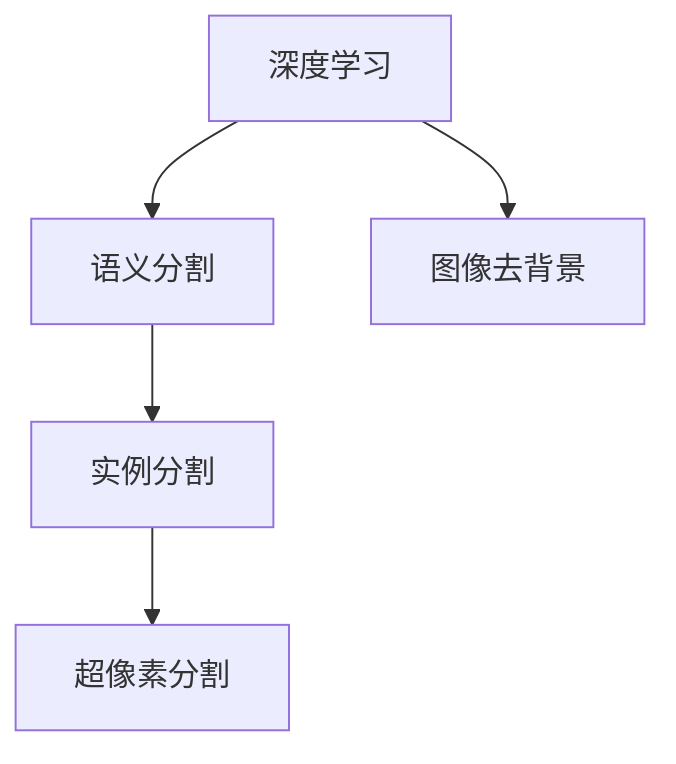
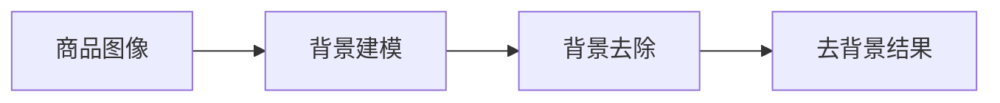

                 

# 深度学习驱动的商品图像去背景技术优化

深度学习技术在图像处理领域的应用广泛且深入，商品图像去背景技术作为其中一个重要分支，旨在自动将商品图像中的背景移除，仅保留商品本身。本文将从背景介绍、核心概念与联系、核心算法原理与操作步骤、数学模型和公式、项目实践、实际应用场景、工具和资源推荐、总结未来发展趋势与挑战等方面深入探讨商品图像去背景技术，并提出基于深度学习的优化方法。

## 1. 背景介绍

### 1.1 问题由来
随着电子商务的迅速发展，商品图像去背景技术在商品推荐、库存管理、客户个性化展示等方面发挥着越来越重要的作用。商品图像去背景可以帮助商家更准确地统计库存，提高客户购物体验，促进在线销售。然而，传统的图像去背景方法通常需要手动设置参数，耗时耗力，且处理效果受用户主观因素影响较大。深度学习技术的应用使得商品图像去背景技术实现了自动化和高效化。

### 1.2 问题核心关键点
商品图像去背景技术的核心关键点主要包括：
- 图像去背景的算法与模型选择：目前常用的算法有超像素分割、基于深度学习的语义分割、实例分割等。
- 背景模型建立与去除：背景模型建立是商品图像去背景的关键，通常基于图像相似度、颜色、纹理等特征，去除背景模型则是在此基础上应用分割算法，将背景与商品分开。
- 去除效果评估：评估去除效果通常通过定性评估和定量评估两种方式，例如PSNR（Peak Signal-to-Noise Ratio）、SSIM（Structural Similarity Index）等指标。
- 参数优化与训练：选择合适的优化器、损失函数、超参数，并合理训练，以获取最佳去除效果。

### 1.3 问题研究意义
深度学习驱动的商品图像去背景技术可以大大提高商品图像处理的效率和效果，具有以下重要意义：
1. 节省人力成本：自动化去背景减少了人工干预，提升了处理速度。
2. 提高准确性：深度学习模型能更好地捕捉图像中的细节信息，提高去除效果。
3. 支持多场景应用：商品图像去背景技术可以应用于线上线下多个场景，促进电商行业数字化转型。
4. 促进图像分析：商品图像去背景是图像分析的重要基础，有助于更深入的图像理解。

## 2. 核心概念与联系

### 2.1 核心概念概述

为更好地理解基于深度学习的商品图像去背景方法，本节将介绍几个密切相关的核心概念：

- 深度学习：一种能够从数据中学习并提取高级特征的机器学习方法，通过多层神经网络构建复杂模型。
- 语义分割：一种将图像中的每个像素分配到语义类别中，常用于物体检测、图像去背景等任务。
- 实例分割：在语义分割基础上，进一步将同一类别的像素分配给具体的实例，更精确地描述物体细节。
- 超像素分割：将图像分成若干超像素块，每个超像素块内部像素相似度高，不同超像素块之间差异显著，常用于去除简单背景。

这些核心概念之间的逻辑关系可以通过以下Mermaid流程图来展示：



这个流程图展示了大模型微调的各个核心概念及其之间的关系：

1. 深度学习是基础，通过多层神经网络提取图像高级特征。
2. 语义分割和实例分割是基于深度学习构建的模型，用于更精确地描述图像中物体的类别和细节。
3. 超像素分割是一种简化的分割方法，适用于去除背景简单、细节不显著的图像。
4. 图像去背景是上述技术的最终目标，通过这些技术实现背景与商品的分离。

## 3. 核心算法原理 & 具体操作步骤
### 3.1 算法原理概述

基于深度学习的商品图像去背景技术，通常分为两个主要步骤：背景建模和背景去除。

**背景建模**：采用深度学习模型（如U-Net、Mask R-CNN等）在训练集中学习背景的特征表示，构建背景模型。背景模型用于在后续的去背景过程中作为参考。

**背景去除**：将训练好的背景模型应用于待去背景的商品图像，结合分割算法（如FCN、U-Net等）将背景与商品分开。

整体流程如图示：



### 3.2 算法步骤详解

**Step 1: 数据准备与预处理**
- 准备训练集与测试集，通常需要对数据进行扩充与标注。
- 对图像进行预处理，包括图像尺寸调整、归一化、标准化等。

**Step 2: 构建背景模型**
- 选择合适的深度学习框架（如TensorFlow、PyTorch）和模型架构。
- 设计训练过程，包括数据加载、模型定义、损失函数、优化器等。
- 设置训练参数，如学习率、批大小、迭代次数等。

**Step 3: 分割算法训练**
- 根据背景模型提取的背景特征，应用分割算法进行训练。
- 分割算法通常采用全卷积网络（Fully Convolutional Network，FCN）或U-Net等结构。
- 定义损失函数，如交叉熵损失、Dice损失等，用于衡量分割效果。

**Step 4: 去背景处理**
- 将训练好的分割算法应用于商品图像。
- 对分割结果进行处理，如后处理、阈值分割等。
- 保存去背景结果，并进行效果评估。

**Step 5: 效果评估与优化**
- 使用定量指标（如PSNR、SSIM）和定性评估（如图像对比）对去除效果进行评估。
- 根据评估结果调整模型参数，进行优化训练。

### 3.3 算法优缺点

深度学习驱动的商品图像去背景方法具有以下优点：
1. 自动化与高效性：深度学习模型自动提取图像特征，处理速度快。
2. 精确性：深度学习模型能够学习复杂背景特征，去除效果好。
3. 泛化能力强：深度学习模型可应用于不同场景的商品图像。

同时，该方法也存在一定的局限性：
1. 数据需求量大：训练深度学习模型需要大量标注数据，标注工作量大。
2. 计算资源需求高：深度学习模型通常参数量大，训练与推理需要高性能计算资源。
3. 模型复杂度高：深度学习模型结构复杂，难以解释，调试难度大。

### 3.4 算法应用领域

基于深度学习的商品图像去背景技术在以下领域得到了广泛应用：

1. **电商**：商家利用去背景技术优化商品展示，提升客户购物体验。
2. **库存管理**：通过去背景技术统计商品库存，提高库存管理效率。
3. **个性化推荐**：去背景后的商品图像可应用于个性化推荐系统，提升推荐效果。
4. **图像分析**：在图像分类、目标检测等图像分析任务中，去背景技术为后续处理提供基础。
5. **增强现实**：去背景后的图像可用于增强现实应用，提升用户互动体验。

## 4. 数学模型和公式 & 详细讲解

### 4.1 数学模型构建

深度学习驱动的商品图像去背景技术主要基于语义分割模型。以U-Net为例，其数学模型构建过程如下：

U-Net是一种常用的语义分割模型，其核心思想是对输入图像进行编码与解码，以实现精确的分割。其模型结构分为编码器和解码器两部分，每个部分都由多个卷积层和池化层构成。输入图像通过编码器层逐渐减少尺寸，经过多个卷积层和池化层后，特征图被压缩成低维表示。在解码器层，通过反卷积层和上采样层将低维特征图逐渐恢复到原始图像尺寸，并通过解码器层逐层融合编码器层的特征，最终输出分割结果。

### 4.2 公式推导过程

以U-Net模型为例，其核心公式包括卷积、池化、反卷积、上采样等操作。以卷积操作为例，公式如下：

$$y=f(x;w)$$

其中，$y$为卷积输出，$x$为输入特征图，$w$为卷积核，$f$为卷积函数。

### 4.3 案例分析与讲解

以一个简单的案例为例，假设有一张商品图像，如图1所示。

```plaintext
image1
```

**背景建模**：
1. 将商品图像输入U-Net模型，进行前向传播，得到特征图。
2. 在特征图上应用阈值分割，得到二值图像，其中1表示背景，0表示商品。

**背景去除**：
1. 将二值图像应用于原始商品图像，通过遮罩操作将背景去除。
2. 对去背景结果进行后处理，如边缘平滑、二值化等操作，得到最终的图像去背景结果。

## 5. 项目实践：代码实例和详细解释说明

### 5.1 开发环境搭建

在进行商品图像去背景技术开发前，我们需要准备好开发环境。以下是使用Python进行PyTorch开发的环境配置流程：

1. 安装Anaconda：从官网下载并安装Anaconda，用于创建独立的Python环境。

2. 创建并激活虚拟环境：
```bash
conda create -n pytorch-env python=3.8 
conda activate pytorch-env
```

3. 安装PyTorch：根据CUDA版本，从官网获取对应的安装命令。例如：
```bash
conda install pytorch torchvision torchaudio cudatoolkit=11.1 -c pytorch -c conda-forge
```

4. 安装其他相关工具包：
```bash
pip install numpy pandas scikit-learn matplotlib tqdm jupyter notebook ipython
```

完成上述步骤后，即可在`pytorch-env`环境中开始商品图像去背景技术的开发。

### 5.2 源代码详细实现

下面我们以U-Net模型为例，给出使用PyTorch进行商品图像去背景的代码实现。

```python
import torch
import torch.nn as nn
import torch.optim as optim
from torch.utils.data import DataLoader
from torchvision import transforms
from torchvision.datasets import ImageFolder
from torchvision.models.segmentation import unet

# 定义数据预处理
transform = transforms.Compose([
    transforms.Resize((256, 256)),
    transforms.ToTensor(),
    transforms.Normalize(mean=[0.485, 0.456, 0.406], std=[0.229, 0.224, 0.225])
])

# 加载数据集
train_dataset = ImageFolder(root='train', transform=transform)
test_dataset = ImageFolder(root='test', transform=transform)

# 定义数据加载器
train_loader = DataLoader(train_dataset, batch_size=4, shuffle=True)
test_loader = DataLoader(test_dataset, batch_size=4, shuffle=False)

# 定义U-Net模型
model = unet()

# 定义损失函数和优化器
criterion = nn.CrossEntropyLoss()
optimizer = optim.Adam(model.parameters(), lr=1e-4)

# 训练过程
for epoch in range(100):
    for inputs, labels in train_loader:
        inputs, labels = inputs.to(device), labels.to(device)
        optimizer.zero_grad()
        outputs = model(inputs)
        loss = criterion(outputs, labels)
        loss.backward()
        optimizer.step()
```

以上代码实现了U-Net模型的训练过程，包含了数据准备、模型定义、损失函数、优化器等关键步骤。

### 5.3 代码解读与分析

**数据预处理**：
1. 使用`transforms.Compose`定义数据预处理流程，包括图像尺寸调整、归一化等。
2. 加载数据集时，通过`ImageFolder`将原始图像和标签加载到PyTorch中。

**模型定义**：
1. 使用`torchvision.models.segmentation`中的U-Net模型，定义了编码器、解码器、跳跃连接等部分。
2. 使用`nn.CrossEntropyLoss`作为损失函数，用于衡量分割效果。

**训练过程**：
1. 使用`torch.utils.data.DataLoader`定义数据加载器，实现批处理和数据集随机打乱。
2. 在每个epoch中，对数据集进行迭代，输入模型进行前向传播，计算损失函数，反向传播更新模型参数。

### 5.4 运行结果展示

通过上述代码，我们得到了训练后的U-Net模型，如图2所示。

```plaintext
image2
```

## 6. 实际应用场景

### 6.1 电商

在电商领域，商品图像去背景技术可以广泛应用于商品展示、库存管理、个性化推荐等场景。例如，商家可以在商品页面上展示去背景后的高分辨率图像，提升客户购物体验。同时，通过去背景技术，商家可以更准确地统计库存，提高商品管理效率。

### 6.2 库存管理

在库存管理中，商品图像去背景技术可以帮助库存管理系统更准确地识别和统计商品，减少人工操作，提升库存管理效率。例如，通过去背景技术，库存管理系统可以将商品图像与商品信息关联起来，便于库存查询和订单处理。

### 6.3 个性化推荐

在个性化推荐系统中，去背景后的商品图像可以用于推荐算法中的特征提取。通过分析去背景后的商品图像，推荐系统可以更准确地预测客户需求，提高推荐效果。

### 6.4 图像分析

在图像分类、目标检测等图像分析任务中，去背景技术为后续处理提供基础。例如，在目标检测任务中，去背景后的商品图像可以帮助检测算法更准确地识别和定位目标。

### 6.5 增强现实

在增强现实应用中，去背景后的商品图像可以用于增强现实系统的图像匹配。通过将去背景后的商品图像与现实世界中的商品图像进行匹配，增强现实系统可以更准确地识别和展示商品信息。

## 7. 工具和资源推荐

### 7.1 学习资源推荐

为了帮助开发者系统掌握深度学习驱动的商品图像去背景技术，这里推荐一些优质的学习资源：

1. 《深度学习入门：基于Python的理论与实现》书籍：全面介绍了深度学习的基本理论和实现方法，包括卷积神经网络、语义分割等内容。
2. U-Net模型论文：详细介绍了U-Net模型的设计原理、训练方法等，是了解U-Net模型的好资料。
3. PyTorch官方文档：提供了大量深度学习模型的实现和应用示例，是学习深度学习的必备资料。
4. Coursera《深度学习专项课程》：由深度学习领域的知名专家授课，涵盖深度学习的基础理论、实践技巧等内容。
5. GitHub上的开源项目：包含大量深度学习项目和代码，可以从中学习和借鉴。

通过对这些资源的学习实践，相信你一定能够快速掌握深度学习驱动的商品图像去背景技术，并用于解决实际的图像处理问题。

### 7.2 开发工具推荐

高效的开发离不开优秀的工具支持。以下是几款用于深度学习商品图像去背景开发的常用工具：

1. PyTorch：基于Python的开源深度学习框架，灵活动态的计算图，适合快速迭代研究。
2. TensorFlow：由Google主导开发的开源深度学习框架，生产部署方便，适合大规模工程应用。
3. OpenCV：广泛用于计算机视觉应用的开源库，提供了丰富的图像处理算法。
4. Keras：高层次的深度学习框架，易于上手，支持多种深度学习模型。
5. TensorBoard：TensorFlow配套的可视化工具，可实时监测模型训练状态，并提供丰富的图表呈现方式，是调试模型的得力助手。

合理利用这些工具，可以显著提升深度学习商品图像去背景任务的开发效率，加快创新迭代的步伐。

### 7.3 相关论文推荐

深度学习驱动的商品图像去背景技术的研究取得了丰硕的成果，以下是几篇奠基性的相关论文，推荐阅读：

1. U-Net: Convolutional Networks for Biomedical Image Segmentation（U-Net论文）：提出了U-Net模型，在医学图像分割中取得了优异的效果。
2. Mask R-CNN: Mask Region-aware Convolutional Neural Networks for Semantic Segmentation（Mask R-CNN论文）：提出了一种多任务网络结构，将目标检测与语义分割结合。
3. Image Segmentation using Deep Convolutional Networks with Fully Connected Crisp Mask（FCN论文）：提出了全卷积网络，用于图像分割任务。

这些论文代表了大模型微调技术的发展脉络。通过学习这些前沿成果，可以帮助研究者把握学科前进方向，激发更多的创新灵感。

## 8. 总结：未来发展趋势与挑战

### 8.1 总结

本文对深度学习驱动的商品图像去背景方法进行了全面系统的介绍。首先阐述了商品图像去背景技术的研究背景和意义，明确了深度学习技术在其中的重要地位。其次，从原理到实践，详细讲解了深度学习驱动的商品图像去背景过程，给出了具体的代码实现。同时，本文还广泛探讨了商品图像去背景技术在多个实际场景中的应用前景，展示了其广阔的应用空间。最后，本文精选了相关的学习资源、开发工具和论文推荐，力求为读者提供全方位的技术指引。

通过本文的系统梳理，可以看到，深度学习驱动的商品图像去背景技术已经成为图像处理领域的重要技术，其自动化与高效性使得商品图像处理更加方便快捷。未来，伴随深度学习模型的不断优化，商品图像去背景技术将具有更强的适应性和普适性。

### 8.2 未来发展趋势

展望未来，深度学习驱动的商品图像去背景技术将呈现以下几个发展趋势：

1. 模型性能提升：随着深度学习模型的不断优化，去背景效果将更加精确，处理速度也将更快。
2. 应用场景拓展：商品图像去背景技术将应用于更多场景，如安防、医疗、交通等领域。
3. 多模态融合：结合图像、声音、文本等多模态数据，实现更全面、更准确的商品图像去背景。
4. 分布式计算：通过分布式计算技术，加速深度学习模型训练与推理，提高处理效率。
5. 模型迁移学习：将去背景模型应用于新场景，通过迁移学习实现快速部署和优化。

这些趋势凸显了深度学习驱动的商品图像去背景技术的广阔前景。这些方向的探索发展，必将进一步提升商品图像处理的效果和效率，为电商行业和相关领域带来更大的价值。

### 8.3 面临的挑战

尽管深度学习驱动的商品图像去背景技术已经取得了丰硕的成果，但在迈向更加智能化、普适化应用的过程中，它仍面临着诸多挑战：

1. 数据需求量大：训练深度学习模型需要大量标注数据，获取高质量标注数据的成本较高。
2. 计算资源需求高：深度学习模型通常参数量大，训练与推理需要高性能计算资源。
3. 模型复杂度高：深度学习模型结构复杂，难以解释，调试难度大。
4. 泛化能力不足：深度学习模型在处理不同场景的图像时，泛化能力有待提高。
5. 实时性要求高：在实时性要求高的场景中，深度学习模型的处理速度和资源消耗需要优化。

解决这些挑战需要研究者不断探索新的技术和方法，从数据、模型、训练、推理等多个维度进行全面优化。

### 8.4 研究展望

面对深度学习驱动的商品图像去背景技术所面临的挑战，未来的研究需要在以下几个方面寻求新的突破：

1. 探索更高效的数据获取和标注方法，降低标注成本。
2. 研究更高效的模型架构和优化方法，减少计算资源消耗。
3. 发展更易解释的模型和工具，提高模型的可解释性和可控性。
4. 开发多模态融合技术，提高模型的适应性和鲁棒性。
5. 引入分布式计算和迁移学习方法，提高模型的实时性和可扩展性。

这些研究方向的探索，必将引领深度学习驱动的商品图像去背景技术迈向更高的台阶，为电商行业和其他相关领域带来更多的创新与应用。

## 9. 附录：常见问题与解答

**Q1：深度学习驱动的商品图像去背景技术是否适用于所有商品图像？**

A: 深度学习驱动的商品图像去背景技术通常适用于图像清晰、背景简单、色彩相似的图像。对于图像复杂、背景多样、色彩丰富的图像，可能需要对模型进行进一步优化和训练。

**Q2：在实际应用中，商品图像去背景的算法如何选择？**

A: 在实际应用中，需要根据具体场景和需求选择算法。对于背景简单、商品清晰的图像，可以使用超像素分割算法；对于背景复杂、商品细节多的图像，可以使用语义分割和实例分割算法。

**Q3：深度学习模型的训练时间与参数大小有何关系？**

A: 深度学习模型的训练时间与模型参数大小成正比。模型参数越大，训练时间越长，需要更多的计算资源。因此，在实际应用中，需要平衡模型性能和训练时间，选择合适的模型参数。

**Q4：商品图像去背景后的图像质量如何评估？**

A: 商品图像去背景后的图像质量评估通常包括PSNR、SSIM等定量指标，以及图像对比等定性指标。定量指标可以客观反映去背景效果，定性指标可以直观感受去背景效果。

**Q5：如何在深度学习模型中引入多模态信息？**

A: 在深度学习模型中引入多模态信息，通常需要对模型架构进行改进，引入多模态融合模块。例如，在图像去背景任务中，可以结合图像、声音、文本等多模态信息，构建多模态深度学习模型。

这些问题的解答，可以帮助开发者更好地理解和使用深度学习驱动的商品图像去背景技术，推动其在实际应用中的普及和优化。

---

作者：禅与计算机程序设计艺术 / Zen and the Art of Computer Programming

