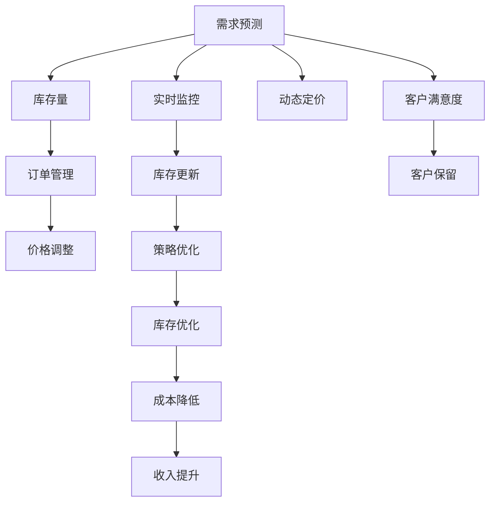

                 

# 深度强化学习在电商库存管理中的创新

> 关键词：电商库存管理, 深度强化学习, 连续控制, 策略优化, 供应链优化, 动态定价

## 1. 背景介绍

在现代电商行业中，库存管理是提升企业竞争力和用户体验的关键环节。传统的库存管理系统多采用基于规则的策略，但随着需求波动性加剧、季节性特点明显，简单的规则难以应对复杂多变的市场情况。与此同时，市场对个性化、实时化、成本最优化的库存管理方案提出了更高的要求，传统的库存管理系统面临严峻挑战。

在此背景下，深度强化学习（Deep Reinforcement Learning, DRL）成为电商库存管理领域的新兴技术。与传统的基于规则的库存管理方法不同，深度强化学习能够通过连续控制和策略优化，实现实时动态调整库存策略，最大化企业的经济收益和客户满意度。

## 2. 核心概念与联系

### 2.1 核心概念概述

为便于读者理解，本节首先介绍深度强化学习的基本概念和核心原理：

- **深度强化学习**：通过深度神经网络模型进行策略学习的一种强化学习（Reinforcement Learning, RL）方法。它结合了深度学习和强化学习的优势，能够在高维度、非线性的复杂环境中实现高效的策略优化。

- **连续控制**：在传统的强化学习中，往往使用离散动作策略。而深度强化学习通过引入连续动作空间，可以解决更复杂的控制问题，实现更加精细化的库存管理。

- **策略优化**：通过不断与环境互动，深度强化学习可以优化策略，实现最优的库存管理效果。在电商库存管理中，策略优化往往体现在库存补货、订单分配、价格调整等方面。

- **供应链优化**：深度强化学习能够通过优化供应链中的各个环节，实现库存、物流、需求预测等方面的协同管理，提高整体运营效率。

- **动态定价**：深度强化学习能够根据市场实时需求，动态调整商品价格，以最大化收益。在电商领域，动态定价策略在促销活动、清仓销售等方面具有重要应用价值。

### 2.2 核心概念原理和架构的 Mermaid 流程图



这个流程图展示了深度强化学习在电商库存管理中的核心流程：

1. 需求预测
2. 库存量计算
3. 订单管理
4. 价格调整
5. 实时监控
6. 库存更新
7. 策略优化
8. 动态定价
9. 客户满意度
10. 库存优化
11. 成本降低
12. 收入提升

## 3. 核心算法原理 & 具体操作步骤

### 3.1 算法原理概述

深度强化学习在电商库存管理中的应用主要基于以下原理：

- **Q-learning**：通过与环境的交互，更新Q值表，进而优化策略。Q-learning能够处理连续动作空间，适合电商库存管理的实时动态优化。

- **策略梯度方法**：通过策略梯度优化方法（如Policy Gradient, REINFORCE），直接优化策略函数，不需要显式构建状态值函数，适用于高维度连续动作空间的优化。

- **深度神经网络**：使用深度神经网络模型，如卷积神经网络（CNN）、长短时记忆网络（LSTM）等，提取环境特征，提高策略学习效率和精度。

### 3.2 算法步骤详解

电商库存管理中的深度强化学习一般包含以下步骤：

**Step 1: 构建环境模型**

- 定义环境状态：例如库存水平、需求预测值、客户满意度、订单接收量等。
- 定义动作空间：例如补货量、订单分配、价格调整等。
- 定义奖励函数：例如利润、客户满意度、库存成本等。

**Step 2: 定义神经网络模型**

- 选择合适的神经网络架构：如多层次感知机（MLP）、卷积神经网络（CNN）、长短时记忆网络（LSTM）等。
- 设计神经网络输出层：例如Q值预测、策略函数等。

**Step 3: 训练深度强化学习模型**

- 初始化神经网络权重，随机设定动作策略。
- 与环境进行交互，根据状态和动作，计算奖励值。
- 使用Q-learning或策略梯度方法更新神经网络参数。
- 通过不断迭代，优化策略函数，提高库存管理效果。

**Step 4: 评估与部署**

- 在测试集上评估模型性能，对比基线模型效果。
- 部署模型到生产环境，实时监测库存管理效果。
- 根据反馈，持续优化模型，提高库存管理策略。

### 3.3 算法优缺点

深度强化学习在电商库存管理中的应用具有以下优点：

1. **动态调整能力**：能够实时根据市场变化动态调整库存策略，适应性强。
2. **数据驱动决策**：通过数据驱动的方式，优化库存管理策略，提升决策效果。
3. **优化效率高**：通过神经网络模型进行高维度、非线性的优化，效率较高。

同时，该方法也存在一些缺点：

1. **数据需求高**：需要大量的历史数据进行模型训练，数据获取成本较高。
2. **策略稳定难保证**：电商需求波动大，策略的稳定性难以保证。
3. **模型复杂度高**：深度强化学习模型较为复杂，训练和部署难度较大。
4. **可解释性不足**：深度强化学习模型的决策过程较为复杂，难以解释。

### 3.4 算法应用领域

深度强化学习在电商库存管理中的应用，不仅局限于库存管理本身，还涉及到供应链优化、动态定价、客户满意度提升等多个领域：

- **库存管理**：通过深度强化学习优化库存补货、订单分配等决策，减少库存积压，提高库存周转率。
- **供应链优化**：通过优化供应链中的各个环节，实现库存、物流、需求预测等方面的协同管理，提高整体运营效率。
- **动态定价**：根据市场实时需求，动态调整商品价格，以最大化收益。
- **客户满意度提升**：通过个性化推荐、实时响应等策略，提升客户满意度，增加客户保留率。

## 4. 数学模型和公式 & 详细讲解 & 举例说明

### 4.1 数学模型构建

电商库存管理中的深度强化学习模型可以描述为：

$$
\pi_{\theta}(a_t | s_t) = \sigma(W^\pi \cdot f(s_t) + b^\pi)
$$

其中，$\pi_{\theta}$ 为策略函数，$a_t$ 为动作，$s_t$ 为状态，$f(s_t)$ 为状态特征提取函数，$W^\pi$ 和 $b^\pi$ 为策略函数的可训练参数，$\sigma$ 为激活函数（如ReLU、tanh等）。

### 4.2 公式推导过程

以Q-learning为例，模型训练过程如下：

1. 在状态 $s_t$ 下，执行动作 $a_t$，观察下一个状态 $s_{t+1}$ 和奖励 $r_t$。
2. 计算Q值预测：

$$
Q_{\theta}(s_t, a_t) = W_{Q}^\top f(s_t) + b_Q
$$

3. 计算实际Q值：

$$
G_{t:T} = \sum_{k=t}^T \gamma^{k-t} r_k + \gamma^{k-t} Q_\theta(s_k, a_k)
$$

其中，$\gamma$ 为折扣因子，$T$ 为终止时间。

4. 更新Q值：

$$
Q_{\theta}(s_t, a_t) \leftarrow Q_{\theta}(s_t, a_t) + \eta (r_t + \gamma Q_{\theta}(s_{t+1}, a_{t+1}) - Q_{\theta}(s_t, a_t))
$$

其中，$\eta$ 为学习率。

5. 更新策略函数参数：

$$
\frac{\partial \pi_{\theta}(a_t | s_t)}{\partial \theta} = \pi_{\theta}(a_t | s_t) \frac{\partial Q_{\theta}(s_t, a_t)}{\partial \theta}
$$

### 4.3 案例分析与讲解

以电商平台中的库存补货策略为例：

假设当前库存量为100个单位，预测需求为120个单位，订单量为80个单位。库存管理策略为补货，动作空间为补货量（0-100）。

1. 观察状态：当前库存量为100个单位。
2. 执行动作：补货量为50个单位。
3. 观察奖励：补货成功，奖励为10。
4. 计算Q值：$Q_{\theta}(100, 50) = W_{Q}^\top f(100) + b_Q$
5. 计算实际Q值：$G_{t:T} = 10 + \gamma (Q_\theta(s_{t+1}, a_{t+1})$
6. 更新Q值：$Q_{\theta}(100, 50) \leftarrow Q_{\theta}(100, 50) + \eta (10 + \gamma Q_{\theta}(150, 100) - Q_{\theta}(100, 50))$
7. 更新策略函数参数：$\frac{\partial \pi_{\theta}(a_t | s_t)}{\partial \theta} = \pi_{\theta}(a_t | s_t) \frac{\partial Q_{\theta}(s_t, a_t)}{\partial \theta}$

重复上述过程，直到模型收敛。

## 5. 项目实践：代码实例和详细解释说明

### 5.1 开发环境搭建

电商库存管理中的深度强化学习项目开发，通常需要以下环境支持：

1. Python：电商库存管理项目开发通常使用Python，因为其拥有丰富的第三方库和强大的科学计算能力。

2. TensorFlow或PyTorch：深度强化学习模型训练通常使用TensorFlow或PyTorch，它们提供了丰富的深度学习模型和优化器。

3. Gym和Mujoco：电商库存管理项目中，可以使用Gym或Mujoco等开源平台进行环境模拟和模型测试。

4. Jupyter Notebook：电商库存管理项目开发中，可以使用Jupyter Notebook进行模型调试和可视化。

### 5.2 源代码详细实现

以下是一个基于TensorFlow实现电商库存管理中的深度强化学习模型的示例代码：

```python
import tensorflow as tf
from gym import spaces
import numpy as np

class InventoryManagementAgent(tf.keras.Model):
    def __init__(self, state_dim, action_dim):
        super().__init__()
        self.fc1 = tf.keras.layers.Dense(64, activation='relu')
        self.fc2 = tf.keras.layers.Dense(64, activation='relu')
        self.fc3 = tf.keras.layers.Dense(action_dim, activation='softmax')
    
    def call(self, inputs):
        x = self.fc1(inputs)
        x = self.fc2(x)
        x = self.fc3(x)
        return x

def build_model(state_dim, action_dim):
    model = InventoryManagementAgent(state_dim, action_dim)
    optimizer = tf.keras.optimizers.Adam(learning_rate=0.001)
    loss_fn = tf.keras.losses.MeanSquaredError()
    return model, optimizer, loss_fn

def train(model, optimizer, loss_fn, env, num_steps=1000, discount_factor=0.9):
    state_dim = env.observation_space.shape[0]
    action_dim = env.action_space.n
    
    state = env.reset()
    state = np.reshape(state, [1, state_dim])
    total_reward = 0
    
    for step in range(num_steps):
        action_probs = model(tf.convert_to_tensor(state))
        action = np.random.choice(action_dim, p=action_probs.numpy()[0])
        next_state, reward, done, _ = env.step(action)
        next_state = np.reshape(next_state, [1, state_dim])
        
        with tf.GradientTape() as tape:
            predicted_q_value = model(tf.convert_to_tensor(next_state))
            target_q_value = reward + discount_factor * np.amax(predicted_q_value.numpy()[0])
            loss = loss_fn(target_q_value, predicted_q_value)
        
        gradients = tape.gradient(loss, model.trainable_variables)
        optimizer.apply_gradients(zip(gradients, model.trainable_variables))
        
        state = next_state
        total_reward += reward
        
        if done:
            print(f'Step {step+1}: Reward = {total_reward}')
            state = env.reset()
            state = np.reshape(state, [1, state_dim])
            total_reward = 0
    
    env.close()

if __name__ == '__main__':
    env = gym.make('InventoryEnv')
    state_dim = env.observation_space.shape[0]
    action_dim = env.action_space.n
    
    model, optimizer, loss_fn = build_model(state_dim, action_dim)
    train(model, optimizer, loss_fn, env)
```

### 5.3 代码解读与分析

上述代码中，首先定义了一个`InventoryManagementAgent`类，继承自`tf.keras.Model`，用于定义策略函数。在`__init__`方法中，定义了三个全连接层（FC），分别用于提取特征、优化特征和输出动作概率。

`build_model`函数用于初始化模型、优化器和损失函数。`train`函数用于训练模型，根据环境状态和动作，计算预测值和目标值，使用梯度下降优化器更新模型参数。

在训练过程中，每次执行一个动作后，观察下一个状态和奖励，计算目标Q值和预测Q值之间的差距，使用梯度下降方法更新模型参数。

## 6. 实际应用场景

### 6.1 智能库存管理

电商库存管理中的深度强化学习可以应用于智能库存管理，实现库存策略的动态优化。例如，基于实时需求预测，电商平台可以自动调整库存补货策略，避免库存积压或短缺，提高库存周转率。

### 6.2 动态定价

电商库存管理中的深度强化学习可以应用于动态定价，根据市场需求和库存水平，自动调整商品价格，以最大化收益。例如，在促销活动期间，平台可以根据库存量和市场需求，自动调整商品价格，实现最优收益。

### 6.3 供应链优化

电商库存管理中的深度强化学习可以应用于供应链优化，优化库存、物流、需求预测等多个环节，提高整体运营效率。例如，通过优化供应链中的各个环节，平台可以降低成本，提升物流效率，增加库存周转率。

## 7. 工具和资源推荐

### 7.1 学习资源推荐

为了帮助开发者系统掌握电商库存管理中的深度强化学习技术，这里推荐一些优质的学习资源：

1. 《深度强化学习》（Deep Reinforcement Learning）书籍：由Richard S. Sutton和Andrew G. Barto合著，全面介绍了强化学习的原理和应用。

2. Coursera的《深度强化学习》课程：由DeepMind的科学家Sebastian Thrun主讲，涵盖了深度强化学习的基础知识和实践技巧。

3. OpenAI的博客和论文：OpenAI在深度强化学习领域的研究成果丰硕，其博客和论文值得仔细阅读。

4. TensorFlow官方文档：TensorFlow提供了丰富的深度学习模型和优化器，适用于电商库存管理项目开发。

### 7.2 开发工具推荐

电商库存管理中的深度强化学习项目开发，通常需要使用以下工具：

1. Jupyter Notebook：用于模型调试和可视化。

2. TensorFlow或PyTorch：用于深度强化学习模型的训练和优化。

3. Gym或Mujoco：用于环境模拟和模型测试。

### 7.3 相关论文推荐

电商库存管理中的深度强化学习研究涉及多个前沿技术，以下是几篇具有代表性的论文：

1. "Deep Reinforcement Learning in Inventory Management: A Survey"：综述了深度强化学习在库存管理中的应用，总结了现有研究成果和未来趋势。

2. "DQN: A New Approach to Reinforcement Learning in Atari Games"：提出了深度Q网络（DQN），用于解决高维度动作空间中的强化学习问题。

3. "Policy Gradient Methods for General Reinforcement Learning"：提出了策略梯度方法，直接优化策略函数，适用于电商库存管理中的高维度优化问题。

## 8. 总结：未来发展趋势与挑战

### 8.1 研究成果总结

深度强化学习在电商库存管理中的应用，已经取得了显著的研究成果，涵盖了库存管理、供应链优化、动态定价等多个领域。通过深度强化学习，电商平台可以实现动态调整库存策略、优化供应链管理、实现动态定价等目标，提升整体运营效率和经济收益。

### 8.2 未来发展趋势

深度强化学习在电商库存管理中的应用将呈现以下几个发展趋势：

1. **多模态融合**：电商库存管理中的数据不仅包括库存水平、需求预测、订单信息等，还涉及客户反馈、市场趋势等多个维度。未来将更多地融合多模态数据，提高策略的精度和稳定性。

2. **自适应学习**：电商库存管理中的需求波动性大，策略的适应性要求高。未来将探索自适应学习算法，使模型能够根据市场需求变化，实时调整库存策略。

3. **分布式训练**：电商库存管理中的数据量大，模型复杂度较高，训练过程需要大量计算资源。未来将探索分布式训练方法，加速模型训练过程。

4. **解释性增强**：电商库存管理中的深度强化学习模型较为复杂，难以解释其决策过程。未来将探索可解释性增强技术，使模型更加透明，便于用户理解和接受。

### 8.3 面临的挑战

尽管深度强化学习在电商库存管理中的应用已经取得了一些成果，但仍然面临一些挑战：

1. **数据质量问题**：电商库存管理中的数据质量问题，如数据噪声、数据不完整等，可能影响模型的训练效果。

2. **模型复杂性**：电商库存管理中的深度强化学习模型较为复杂，训练和部署难度较大。

3. **成本问题**：电商库存管理中的深度强化学习模型训练需要大量的计算资源，成本较高。

4. **可解释性问题**：电商库存管理中的深度强化学习模型难以解释其决策过程，可能影响用户的信任度。

### 8.4 研究展望

针对电商库存管理中的深度强化学习研究，未来需要在以下几个方向寻求新的突破：

1. **多模态数据融合**：融合多模态数据，提高库存管理的精度和稳定性。

2. **自适应学习算法**：探索自适应学习算法，使模型能够实时调整库存策略。

3. **分布式训练方法**：探索分布式训练方法，加速模型训练过程。

4. **可解释性增强技术**：探索可解释性增强技术，使模型更加透明，便于用户理解和接受。

5. **强化学习与优化算法结合**：探索强化学习与优化算法结合，提高库存管理的效率和效果。

总之，深度强化学习在电商库存管理中的应用将不断深化，为电商平台提供更智能、高效的库存管理方案，进一步提升用户体验和运营效率。未来，在技术、应用和市场等多个层面的协同创新，将推动电商库存管理迈向更高的智能化水平。

