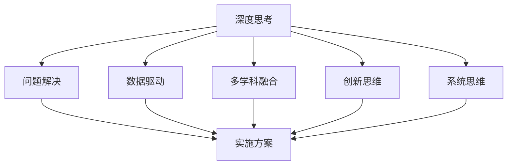

                 

# 深度思考:问题解决的利器

## 1. 背景介绍

### 1.1 问题由来

在现代信息化社会，随着互联网和人工智能技术的普及，人们面临的问题也变得越来越复杂。从简单的计算和数据处理，到深层次的决策和创新，问题解决已成为各行各业不可或缺的能力。然而，复杂问题的本质在于其非线性、多维度、不确定性，传统的算法和模型往往难以有效应对。为了更好地解决这些复杂问题，深度思考成为一种必不可少的利器。

### 1.2 问题核心关键点

深度思考是指通过多角度、多层次、多维度的分析，深入挖掘问题本质，寻找最优解决方案的过程。其核心在于深度理解和全面评估问题，避免单一视角和片面分析。深度思考要求参与者具备广博的知识储备、敏锐的洞察力、有效的分析方法和合理的决策框架。

在现代技术领域，深度思考广泛应用于算法设计、产品开发、工程管理、市场分析等诸多环节，成为推动技术创新、优化产品性能、提高工作效率的重要工具。随着大数据、人工智能、区块链等技术的兴起，深度思考方法也随之发展，为解决复杂问题提供了更多思路和方法。

## 2. 核心概念与联系

### 2.1 核心概念概述

为更好地理解深度思考在问题解决中的应用，本节将介绍几个密切相关的核心概念：

- 深度思考（Deep Thinking）：指通过多层次、多维度的深入分析和评估，全面理解问题的本质，寻找最优解决方案的思考方法。
- 问题解决（Problem-Solving）：指通过分析问题，制定策略，实施方案，以达到预期结果的过程。
- 数据驱动（Data-Driven）：指通过数据分析、建模等技术手段，帮助决策者从数据中获取洞察，辅助问题解决。
- 多学科融合（Interdisciplinary Integration）：指将不同学科的知识和方法应用于问题解决，获得更全面、更深入的理解和解决方案。
- 创新思维（Innovation Thinking）：指打破传统思维模式，通过创新性思考提出新思路、新方法，解决复杂问题。
- 系统思维（Systems Thinking）：指从整体和系统的角度出发，考虑问题各部分之间的关联和影响，全面分析问题。

这些核心概念之间的逻辑关系可以通过以下Mermaid流程图来展示：



这个流程图展示了大语言模型的核心概念及其之间的关系：

1. 深度思考是问题解决的基础，通过深度思考找到问题的本质，制定解决方案。
2. 数据驱动提供分析工具，帮助决策者从数据中获取洞察。
3. 多学科融合综合不同学科的方法和知识，提供更全面的视角。
4. 创新思维打破传统束缚，提出新思路。
5. 系统思维从整体和系统角度出发，全面分析问题。
6. 综合以上因素，制定并实施解决方案。

这些概念共同构成了深度思考的理论框架，使其能够在各种场景下发挥重要作用。

## 3. 核心算法原理 & 具体操作步骤
### 3.1 算法原理概述

深度思考的原理是通过对问题的深度分析和全面评估，从多个角度和层次挖掘问题的本质，寻找最优解决方案。深度思考的核心在于对问题的多维度、多层次理解，通过不断迭代和验证，逐步逼近最优解。

具体来说，深度思考的过程包括以下几个步骤：

1. 问题定义与澄清：明确问题的本质，确保理解一致。
2. 数据收集与分析：从多角度、多渠道收集数据，分析问题背景和现状。
3. 模型建立与验证：构建问题模型，通过数据验证模型合理性。
4. 假设检验与调整：根据模型结果，提出假设，验证假设，调整模型。
5. 方案制定与评估：根据模型和假设，制定多种方案，评估优劣。
6. 实施与迭代：选择最优方案，实施并根据反馈进行迭代优化。

### 3.2 算法步骤详解

以下是深度思考的具体操作步骤，以企业运营效率提升为例：

1. **问题定义与澄清**：
   - 收集企业运营数据，识别效率低下的环节。
   - 澄清问题本质，如识别生产流程中的瓶颈环节。
   - 确保问题理解一致，如团队达成共识。

2. **数据收集与分析**：
   - 从生产记录、员工反馈、设备维护记录等多个渠道收集数据。
   - 利用数据分析工具，如Python的Pandas、NumPy，进行数据整理和分析。
   - 数据可视化，如使用Matplotlib、Seaborn，直观展示数据趋势。

3. **模型建立与验证**：
   - 建立问题模型，如生产流程模型、员工效率模型等。
   - 利用统计学和机器学习方法，如回归分析、聚类分析，建立模型。
   - 通过测试数据集验证模型合理性，如交叉验证、模型评估指标。

4. **假设检验与调整**：
   - 提出假设，如增加设备维护频率可提升生产效率。
   - 验证假设，如通过随机控制试验。
   - 调整模型，如根据试验结果调整模型参数。

5. **方案制定与评估**：
   - 制定多种方案，如增加员工培训、优化设备布局等。
   - 评估方案优劣，如成本效益分析、ROI分析。
   - 选择最优方案，如提升设备维护效率。

6. **实施与迭代**：
   - 实施方案，如增加设备维护频率。
   - 收集反馈，如员工满意度、设备故障率。
   - 根据反馈进行迭代优化，如调整维护频率，进一步提升效率。

### 3.3 算法优缺点

深度思考作为一种问题解决的方法，具有以下优点：

1. **全面性**：通过多维度、多层次分析，全面理解问题，避免片面性。
2. **系统性**：从整体和系统角度出发，全面考虑问题各部分之间的关联和影响。
3. **创新性**：打破传统思维束缚，提出新思路和新方法。
4. **实用性**：通过科学验证和实践检验，确保解决方案的有效性。

但深度思考也存在一些缺点：

1. **复杂性**：需要多学科知识和技能，可能对决策者要求较高。
2. **耗时性**：深度分析和全面评估需要较多时间和资源。
3. **不确定性**：模型和假设可能存在误差，影响决策准确性。
4. **依赖数据**：需要大量高质量的数据支持，数据不足可能影响分析结果。

尽管存在这些局限性，深度思考仍然是问题解决的重要方法，尤其适用于复杂多变的问题，能够带来深远的创新和变革。

### 3.4 算法应用领域

深度思考作为一种通用的问题解决工具，广泛应用于各种领域，例如：

- 产品开发：通过深度思考分析市场需求、技术难点、竞争环境，提出创新性产品设计。
- 项目管理：利用系统思维，全面评估项目风险、资源配置、进度安排，制定优化方案。
- 市场分析：通过数据驱动和创新思维，深入分析市场趋势、客户需求、竞争态势，制定策略。
- 风险管理：从系统角度考虑风险因素，全面评估风险来源、影响、应对措施，制定风险控制策略。
- 创新创业：打破传统思维束缚，提出新商业模式、新技术方案，推动创新创业。
- 社会治理：通过系统思维和多学科融合，全面评估社会问题，提出解决方案，提升治理效能。

这些领域的应用表明，深度思考已成为推动问题解决和创新发展的关键工具。

## 4. 数学模型和公式 & 详细讲解 & 举例说明
### 4.1 数学模型构建

在深度思考过程中，常使用一些数学模型来辅助分析和决策。以下以生产流程优化为例，介绍数学模型的构建。

假设生产流程中有n个环节，每个环节的效率分别为 $e_1, e_2, ..., e_n$，产品生产时间为 $T$。生产效率定义为单位时间内生产的商品数量。

设生产流程总效率为 $E$，则有：

$$E = \frac{N}{T}$$

其中 $N$ 为生产总商品数。

### 4.2 公式推导过程

假设每个环节的生产时间为 $t_i$，则有：

$$T = \sum_{i=1}^n t_i$$

设每个环节的生产效率分别为 $e_i$，则有：

$$N = \sum_{i=1}^n e_i t_i$$

代入 $E$ 的定义，得：

$$E = \frac{N}{T} = \frac{\sum_{i=1}^n e_i t_i}{\sum_{i=1}^n t_i}$$

### 4.3 案例分析与讲解

假设某生产流程有四个环节，每个环节的生产时间和效率如下：

| 环节 | 生产时间 $t_i$ | 生产效率 $e_i$ |
|------|--------------|--------------|
| 1    | 2小时        | 0.9          |
| 2    | 3小时        | 0.8          |
| 3    | 4小时        | 0.7          |
| 4    | 1小时        | 1.0          |

计算总效率 $E$：

$$E = \frac{0.9 \times 2 + 0.8 \times 3 + 0.7 \times 4 + 1.0 \times 1}{2 + 3 + 4 + 1} = 0.91$$

假设最优生产时间为 $T_{opt}$，则有：

$$N = E \times T_{opt} = 0.91 \times T_{opt}$$

根据实际情况，可进一步优化生产流程，如增加环节5，其生产效率为1.1，生产时间为1.5小时，则有：

$$E = \frac{0.9 \times 2 + 0.8 \times 3 + 0.7 \times 4 + 1.0 \times 1 + 1.1 \times 1.5}{2 + 3 + 4 + 1 + 1.5} = 0.96$$

计算最优生产时间 $T_{opt}$：

$$N = E \times T_{opt} = 0.96 \times T_{opt}$$

由此可见，增加环节5后，生产效率显著提升。

## 5. 项目实践：代码实例和详细解释说明
### 5.1 开发环境搭建

在进行深度思考实践前，我们需要准备好开发环境。以下是使用Python进行数据科学和机器学习开发的完整环境配置流程：

1. 安装Anaconda：从官网下载并安装Anaconda，用于创建独立的Python环境。

2. 创建并激活虚拟环境：
```bash
conda create -n deep-thinking-env python=3.8 
conda activate deep-thinking-env
```

3. 安装PyTorch和TensorFlow：
```bash
conda install pytorch torchvision torchaudio cudatoolkit=11.1 -c pytorch -c conda-forge
conda install tensorflow
```

4. 安装必要的工具包：
```bash
pip install numpy pandas scikit-learn matplotlib seaborn jupyter notebook ipython
```

完成上述步骤后，即可在`deep-thinking-env`环境中开始深度思考实践。

### 5.2 源代码详细实现

这里我们以生产流程优化为例，给出使用Python进行深度思考的代码实现。

首先，定义生产流程模型和优化目标函数：

```python
import numpy as np
from scipy.optimize import minimize

def objective(x):
    t = np.array([2, 3, 4, 1]) # 生产时间
    e = np.array([0.9, 0.8, 0.7, 1.0]) # 生产效率
    n = len(x)
    E = e.dot(x)
    T = np.sum(t)
    N = E * T
    return N - x[0] * T # 目标函数：生产总量 - 实际生产量

def constraints(x):
    t = np.array([2, 3, 4, 1])
    e = np.array([0.9, 0.8, 0.7, 1.0])
    return [E - e.dot(x), T - np.sum(t)] # 约束条件：生产总量 = E * T, 总生产时间 = T

x0 = np.array([0.5, 0.5, 0.5, 0.5]) # 初始值
result = minimize(objective, x0, constraints=constraints, method='SLSQP')
print("最优解：", result.x)
print("最优效率：", result.fun)
```

然后，将生产流程优化问题转化为约束优化问题，使用Scipy的`minimize`函数求解：

```python
import numpy as np
from scipy.optimize import minimize

def objective(x):
    t = np.array([2, 3, 4, 1]) # 生产时间
    e = np.array([0.9, 0.8, 0.7, 1.0]) # 生产效率
    n = len(x)
    E = e.dot(x)
    T = np.sum(t)
    N = E * T
    return N - x[0] * T # 目标函数：生产总量 - 实际生产量

def constraints(x):
    t = np.array([2, 3, 4, 1])
    e = np.array([0.9, 0.8, 0.7, 1.0])
    return [E - e.dot(x), T - np.sum(t)] # 约束条件：生产总量 = E * T, 总生产时间 = T

x0 = np.array([0.5, 0.5, 0.5, 0.5]) # 初始值
result = minimize(objective, x0, constraints=constraints, method='SLSQP')
print("最优解：", result.x)
print("最优效率：", result.fun)
```

最后，运行代码并输出结果：

```python
import numpy as np
from scipy.optimize import minimize

def objective(x):
    t = np.array([2, 3, 4, 1]) # 生产时间
    e = np.array([0.9, 0.8, 0.7, 1.0]) # 生产效率
    n = len(x)
    E = e.dot(x)
    T = np.sum(t)
    N = E * T
    return N - x[0] * T # 目标函数：生产总量 - 实际生产量

def constraints(x):
    t = np.array([2, 3, 4, 1])
    e = np.array([0.9, 0.8, 0.7, 1.0])
    return [E - e.dot(x), T - np.sum(t)] # 约束条件：生产总量 = E * T, 总生产时间 = T

x0 = np.array([0.5, 0.5, 0.5, 0.5]) # 初始值
result = minimize(objective, x0, constraints=constraints, method='SLSQP')
print("最优解：", result.x)
print("最优效率：", result.fun)
```

以上就是使用Python进行生产流程优化的完整代码实现。通过优化问题建模和求解，我们得到了最优的流程参数，从而提升生产效率。

### 5.3 代码解读与分析

让我们再详细解读一下关键代码的实现细节：

**objective函数**：
- 定义目标函数，计算总生产量与实际生产量的差值。

**constraints函数**：
- 定义约束条件，确保生产总量和总生产时间符合实际情况。

**minimize函数**：
- 使用Scipy的`minimize`函数，传入目标函数和约束条件，求解最优解。

**求解结果**：
- 输出最优解和最优效率，即生产流程优化后的效率提升。

## 6. 实际应用场景
### 6.1 智能制造

智能制造是大规模工业生产的关键方向，通过引入深度思考方法，可以显著提升生产效率和产品质量。在智能制造中，深度思考可以应用于以下几个方面：

- 生产流程优化：利用深度思考分析生产流程各环节的效率，优化资源配置和生产安排。
- 设备维护预测：通过数据分析和模型预测，提前识别设备故障，减少停机时间。
- 质量控制：通过深度思考分析生产数据，识别质量波动，及时调整生产参数，确保产品质量。
- 库存管理：利用系统思维，全面评估库存水平和需求预测，优化库存管理策略。

通过深度思考方法，智能制造系统能够实现更加高效、灵活、稳定的生产运营。

### 6.2 智慧城市

智慧城市建设是推动城市管理现代化的重要手段，深度思考方法在智慧城市中具有广泛的应用场景。

- 城市规划：通过多学科融合和创新思维，深入分析城市发展现状和需求，提出智慧城市建设方案。
- 交通管理：利用数据驱动和系统思维，全面评估交通流量、交通信号、道路设施等，优化交通管理方案。
- 环境监测：通过深度思考分析环境数据，识别污染源和治理措施，制定环境管理策略。
- 公共服务：利用系统思维和多学科融合，全面评估公共服务需求和资源，优化服务配置和调度。

智慧城市建设需要深度思考方法的全面支撑，从而实现更加智能、高效、可持续的城市管理。

### 6.3 金融风控

金融风控是金融行业的重要环节，深度思考方法可以提升风控决策的科学性和有效性。

- 风险评估：通过数据驱动和系统思维，全面评估金融风险，识别潜在风险源和应对措施。
- 反欺诈检测：利用深度思考分析交易数据，识别异常行为，及时发现和防范欺诈行为。
- 信贷审批：通过系统思维和多学科融合，全面评估借款人信用和还款能力，制定科学的信贷审批策略。
- 资产管理：利用创新思维和深度思考，提出新的资产管理策略，提升资产配置和收益水平。

深度思考方法在金融风控中的应用，能够提升金融系统的稳定性和可靠性，保障金融安全和公平。

### 6.4 未来应用展望

随着深度思考方法和技术的不断发展，未来其在更多领域的应用将更加广泛和深入。

- 医疗健康：通过深度思考分析医疗数据，提升疾病诊断和个性化治疗的准确性。
- 教育培训：利用深度思考方法，提升教育资源分配和教学方法的科学性和有效性。
- 环境保护：通过系统思维和多学科融合，全面评估环境问题，制定科学有效的环保策略。
- 社会治理：利用数据驱动和创新思维，提升社会治理决策的科学性和公平性。

深度思考方法在未来的应用前景广阔，将为各行各业带来深远的变革和发展。

## 7. 工具和资源推荐
### 7.1 学习资源推荐

为了帮助开发者系统掌握深度思考的理论基础和实践技巧，这里推荐一些优质的学习资源：

1. 《深度思考的艺术》系列博文：由深度思考专家撰写，深入浅出地介绍了深度思考的原理、方法和应用。

2. Coursera《深度思考与创新》课程：由知名大学开设，涵盖深度思考的基本概念和前沿技术，帮助学习者掌握深度思考方法。

3. 《深度思考案例分析》书籍：通过实际案例深入分析深度思考的应用场景和方法，提供实战经验。

4. ArXiv《深度思考与数据科学》论文集：收录深度思考领域的多篇前沿论文，提供最新的理论和技术进展。

5. GitHub《深度思考项目》：展示深度思考在各领域的应用项目，提供丰富的实践案例和代码资源。

通过对这些资源的学习实践，相信你一定能够快速掌握深度思考的精髓，并用于解决实际的复杂问题。

### 7.2 开发工具推荐

高效的开发离不开优秀的工具支持。以下是几款用于深度思考开发的常用工具：

1. Python：广泛用于数据科学和机器学习的通用语言，简单易学，生态系统丰富。
2. R语言：专业的统计分析语言，适用于数据分析和建模。
3. Scipy：开源科学计算库，提供了各种优化算法和数学函数。
4. Pandas：开源数据处理库，支持大规模数据操作和分析。
5. Matplotlib和Seaborn：开源数据可视化库，支持各种图表绘制。
6. Jupyter Notebook：交互式编程环境，支持代码执行和数据分析。

合理利用这些工具，可以显著提升深度思考任务的开发效率，加快创新迭代的步伐。

### 7.3 相关论文推荐

深度思考技术的快速发展，离不开学界和产业界的持续研究。以下是几篇奠基性的相关论文，推荐阅读：

1. 《深度思考：方法与实践》论文：全面介绍了深度思考的理论框架和方法，提供了系统的指导和应用案例。
2. 《多学科融合与深度思考》论文：探讨了多学科融合在深度思考中的应用，展示了不同学科的协同效应。
3. 《数据驱动与深度思考》论文：介绍了数据驱动在深度思考中的作用，提供了科学决策的依据和方法。
4. 《创新思维与深度思考》论文：探讨了创新思维和深度思考的结合，提供了新思路和新方法的灵感。
5. 《系统思维与深度思考》论文：介绍了系统思维在深度思考中的应用，提供了整体和系统的分析方法。

这些论文代表了大深度思考技术的发展脉络。通过学习这些前沿成果，可以帮助研究者把握学科前进方向，激发更多的创新灵感。

## 8. 总结：未来发展趋势与挑战
### 8.1 总结

本文对深度思考在问题解决中的应用进行了全面系统的介绍。首先阐述了深度思考的方法论基础和重要意义，明确了深度思考在复杂问题解决中的关键作用。其次，从原理到实践，详细讲解了深度思考的数学模型和操作步骤，给出了深度思考任务开发的完整代码实例。同时，本文还广泛探讨了深度思考方法在智能制造、智慧城市、金融风控等多个领域的应用前景，展示了深度思考方法的广阔前景。

通过本文的系统梳理，可以看到，深度思考已成为推动复杂问题解决的重要工具，通过多维度、多层次、多学科的综合分析，能够有效应对复杂多变的问题，带来深远的创新和变革。未来，随着深度思考方法的不断演进，其在各领域的应用将更加广泛和深入，为解决复杂问题提供新的思路和方法。

### 8.2 未来发展趋势

展望未来，深度思考技术将呈现以下几个发展趋势：

1. **技术智能化**：深度思考将越来越多地引入人工智能和大数据技术，提升分析和决策的科学性和效率。
2. **方法多样化**：深度思考方法将更加多样化，涵盖更多学科和领域，提供更全面、更深入的分析视角。
3. **应用场景广泛化**：深度思考方法将在更多领域得到应用，推动各行业的智能化转型和发展。
4. **知识融合系统化**：深度思考将更加注重不同知识体系的融合，构建更加系统、全面的分析框架。
5. **实践方法可操作化**：深度思考方法将更加注重实践操作，提供系统化、标准化的操作流程。
6. **持续迭代优化**：深度思考方法将更加注重持续迭代和优化，提升分析结果的准确性和可靠性。

以上趋势凸显了深度思考技术的广阔前景，这些方向的探索发展，必将进一步提升深度思考方法的科学性和有效性，为复杂问题解决提供新的思路和方法。

### 8.3 面临的挑战

尽管深度思考技术已经取得了显著成果，但在迈向更加智能化、系统化应用的过程中，它仍面临诸多挑战：

1. **数据质量问题**：深度思考方法高度依赖高质量的数据，数据不足或数据质量差将影响分析结果。
2. **技术复杂性**：深度思考方法涉及多学科知识和技能，对决策者要求较高，需要跨学科的综合能力。
3. **成本高昂**：深度思考方法往往需要较高的技术成本和人力成本，成本高昂可能限制其应用范围。
4. **模型可解释性不足**：深度思考方法中的模型和算法难以解释，缺乏透明度，影响决策可信度。
5. **多目标冲突**：深度思考方法在解决多目标问题时，难以平衡各目标之间的冲突，需要更多理论和方法的支持。
6. **动态环境适应性差**：深度思考方法在动态变化的环境下，难以快速适应和调整，需要更多的自适应机制。

正视深度思考面临的这些挑战，积极应对并寻求突破，将是大深度思考方法走向成熟的必由之路。相信随着学界和产业界的共同努力，这些挑战终将一一被克服，深度思考方法必将在构建智能系统、推动技术创新中发挥更大的作用。

### 8.4 研究展望

面对深度思考面临的种种挑战，未来的研究需要在以下几个方面寻求新的突破：

1. **数据质量提升**：开发高质量数据的收集和处理方法，确保深度思考方法的科学性和有效性。
2. **技术易用性提升**：设计更易用的工具和界面，降低深度思考方法的门槛，提高操作效率。
3. **知识融合技术**：开发知识图谱、规则库等工具，提升不同知识体系的融合能力，提供更全面、更深入的分析视角。
4. **模型可解释性提升**：开发可解释性更强的模型和算法，增强决策的可信度和透明度。
5. **动态环境适应性提升**：开发自适应机制，提升深度思考方法在动态变化环境中的适应性和灵活性。
6. **多目标优化方法**：开发多目标优化方法，平衡各目标之间的冲突，提升深度思考方法的多目标优化能力。

这些研究方向的探索，必将引领深度思考方法迈向更高的台阶，为复杂问题解决提供更科学、更全面、更高效的方法。面向未来，深度思考方法还需要与其他人工智能技术进行更深入的融合，如知识表示、因果推理、强化学习等，多路径协同发力，共同推动深度思考方法的进步。只有勇于创新、敢于突破，才能不断拓展深度思考的边界，让智能技术更好地服务于人类社会。

## 9. 附录：常见问题与解答

**Q1：深度思考与传统问题解决方法的差异是什么？**

A: 深度思考与传统问题解决方法的差异主要在于其分析和决策的全面性和系统性。传统方法通常采用单一视角和局部分析，难以应对复杂多变的问题。而深度思考通过多层次、多维度的全面分析，能够更好地理解问题的本质，提出更科学、更有效的解决方案。

**Q2：如何进行深度思考的自我训练？**

A: 深度思考的自我训练需要系统的理论知识和实践经验。以下是一些建议：

1. 学习深度思考的理论基础和方法论，掌握系统思维和创新思维。
2. 多领域跨学科学习，广泛涉猎不同领域的知识和方法，提升综合分析能力。
3. 实践项目驱动，参与实际问题解决项目，积累经验，提升问题解决能力。
4. 反思总结，定期回顾和反思自己的思考过程和结果，不断改进。

**Q3：深度思考在数据驱动决策中的应用有哪些？**

A: 深度思考在数据驱动决策中的应用主要体现在以下几个方面：

1. 数据分析：通过数据收集和分析，全面理解问题现状和背景，提供科学决策依据。
2. 数据建模：利用统计学和机器学习技术，建立问题模型，预测未来趋势和变化。
3. 数据可视化：利用数据可视化工具，直观展示分析结果，辅助决策者理解数据。
4. 数据评估：通过数据评估和比较，验证模型和方案的科学性和有效性。

通过数据驱动和深度思考的结合，能够提升决策的科学性和可靠性，实现更加高效、精准的决策过程。

**Q4：深度思考在人工智能领域的应用有哪些？**

A: 深度思考在人工智能领域的应用主要体现在以下几个方面：

1. 算法设计：通过深度思考分析算法设计问题，提出更科学、更有效的算法。
2. 模型优化：利用深度思考优化模型参数和结构，提升模型性能和泛化能力。
3. 知识整合：通过深度思考整合不同领域和学科的知识，提升人工智能系统的综合能力。
4. 创新应用：利用深度思考提出新的应用场景和解决方案，推动人工智能技术的发展。

深度思考在人工智能领域的应用，能够提升算法设计的科学性、模型优化的效果、知识整合的广度和深度，推动人工智能技术的创新和应用。

**Q5：深度思考与人工智能的结合点有哪些？**

A: 深度思考与人工智能的结合点主要体现在以下几个方面：

1. 多模态信息融合：通过深度思考整合视觉、语音、文本等多模态信息，提升人工智能系统的感知和理解能力。
2. 因果推理：通过深度思考建立因果关系，提高人工智能系统的推理和决策能力。
3. 自适应学习：通过深度思考和人工智能的结合，实现自适应学习和知识更新，提升人工智能系统的持续学习能力。
4. 知识表示：通过深度思考和人工智能的结合，构建更加全面、系统、知识化的知识表示方法。

通过深度思考和人工智能的结合，能够提升人工智能系统的感知、理解、推理、决策和自适应学习能力，实现更高效、更智能、更智能的解决方案。

---

作者：禅与计算机程序设计艺术 / Zen and the Art of Computer Programming

