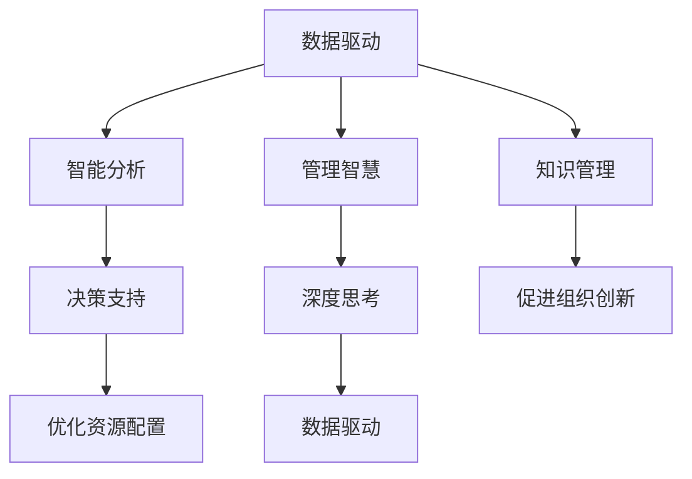

                 

## 1. 背景介绍

### 1.1 问题由来

在当今快速发展的信息化社会中，深度思考与管理智慧的积累变得尤为重要。随着人工智能（AI）、大数据、云计算等技术的不断进步，企业、组织乃至个体面临的管理挑战愈加复杂多样。如何提升管理智慧，提高决策效率，成为每一个管理者的核心任务。

深度思考与管理智慧的积累，不仅涉及如何有效管理信息、数据和资源，还包括了如何运用人工智能技术进行决策支持和智能分析，以应对不断变化的商业环境。

### 1.2 问题核心关键点

深度思考与管理智慧的积累，核心在于以下几个方面：

1. **数据驱动**：企业通过收集和分析大量数据，形成对市场、客户、产品等方面的深入理解。
2. **决策支持**：利用人工智能和大数据分析技术，为决策者提供数据驱动的洞察和建议。
3. **智慧积累**：构建知识管理系统，不断总结和优化企业的管理经验，形成系统的管理智慧。
4. **智能分析**：运用智能算法，对复杂问题进行预测和决策优化。
5. **持续学习**：通过不断迭代和优化模型，适应管理环境的变化。

深度思考与管理智慧的积累，旨在通过科学的管理方法和先进的技术手段，提升企业的管理效能和竞争力。

### 1.3 问题研究意义

深度思考与管理智慧的积累，对于提升企业决策水平、优化资源配置、推动组织创新具有重要意义：

1. **提升决策质量**：数据驱动和智能分析使决策更加科学和客观。
2. **优化资源配置**：通过对数据和经验的深度分析，合理配置资源，提高运营效率。
3. **促进组织创新**：智慧积累有助于形成系统化的管理经验，推动组织创新和变革。
4. **增强市场竞争力**：数据驱动的洞察和预测能力，使企业在竞争中保持领先地位。
5. **驱动可持续发展**：通过科学管理，推动企业的可持续发展和长期繁荣。

## 2. 核心概念与联系

### 2.1 核心概念概述

为了更好地理解深度思考与管理智慧的积累，本节将介绍几个密切相关的核心概念：

- **深度思考（Deep Thinking）**：指的是在复杂问题中，通过深度分析和逻辑推理，寻找最优解决方案的能力。
- **管理智慧（Management Wisdom）**：指管理者通过经验和知识，形成对管理和运营的有效理解和处理方法。
- **知识管理（Knowledge Management）**：通过系统化地收集、存储、共享和管理知识，提升组织的学习能力和创新能力。
- **数据驱动（Data-Driven）**：以数据为依据进行决策和优化，提升决策的科学性和准确性。
- **智能分析（Intelligent Analysis）**：运用人工智能技术，对大量数据进行分析和预测，提供智能洞察。

这些概念之间存在紧密联系，通过深度思考和管理智慧的积累，能够更好地利用数据和智能分析，实现高效和科学的管理。

### 2.2 核心概念原理和架构的 Mermaid 流程图



这个流程图展示了大语言模型微调的核心概念及其之间的关系：

1. 数据驱动使管理者和企业基于数据进行决策。
2. 智能分析提供数据驱动的洞察，辅助决策。
3. 知识管理通过系统化管理知识，提升组织的学习能力。
4. 管理智慧通过经验和知识，形成有效的管理和运营方法。
5. 深度思考通过逻辑推理和分析，提升问题的解决能力。

这些概念共同构成了管理智慧的积累框架，帮助管理者在复杂多变的商业环境中，做出科学和高效的决策。

## 3. 核心算法原理 & 具体操作步骤

### 3.1 算法原理概述

深度思考与管理智慧的积累，其核心在于数据驱动和智能分析。通过数据驱动的决策支持和智能分析的辅助，管理者能够更好地理解和优化管理过程。

在深度思考过程中，我们需要收集、处理和分析大量数据，形成对复杂问题的洞察和理解。智能分析则通过算法模型，预测未来趋势和优化方案。这些数据和分析结果，通过系统化的知识管理，形成管理智慧，再反哺深度思考和智能分析，形成良性循环。

### 3.2 算法步骤详解

基于深度思考与管理智慧的积累，其核心算法步骤包括：

1. **数据收集与处理**：
   - 收集与业务相关的数据，包括客户行为、市场趋势、财务报表等。
   - 清洗和预处理数据，去除噪声和不相关数据，形成可分析的数据集。

2. **智能分析**：
   - 选择适合的算法模型，如机器学习、深度学习等，对数据进行分析。
   - 通过训练和测试模型，验证分析结果的准确性和可靠性。
   - 利用智能分析工具，如数据可视化、报表生成等，提供可视化洞察。

3. **决策支持**：
   - 结合智能分析结果和业务经验，形成数据驱动的决策建议。
   - 利用决策支持系统（DSS），自动化决策流程，提高效率。
   - 定期回顾决策结果，评估模型的准确性和效果。

4. **知识管理**：
   - 构建知识库，存储和整理管理经验、最佳实践和案例分析。
   - 设计知识管理系统，支持知识检索、共享和协作。
   - 定期更新和优化知识库，保证其时效性和实用性。

5. **管理智慧积累**：
   - 通过定期回顾和总结，形成系统的管理经验和智慧。
   - 利用智慧模型和知识库，提升管理决策的质量和效率。
   - 通过持续学习和改进，形成持续发展的管理智慧。

### 3.3 算法优缺点

深度思考与管理智慧的积累方法具有以下优点：

1. **科学决策**：通过数据驱动和智能分析，决策更加科学和客观。
2. **高效管理**：利用智能工具和知识管理，提升管理效率和效果。
3. **系统优化**：形成系统的管理经验和智慧，提升组织的竞争力。
4. **持续改进**：通过持续学习和优化，不断提升管理水平。

同时，该方法也存在一些局限性：

1. **数据依赖性**：数据质量和数据量的准确性直接影响分析结果。
2. **算法复杂性**：复杂算法模型的训练和调参难度较大，需专业技能。
3. **成本较高**：数据收集和处理、模型训练和优化需要较高的成本。
4. **知识共享难**：知识管理系统的设计和维护需要较高的投入。

尽管存在这些局限性，但通过科学的管理方法和先进的技术手段，深度思考与管理智慧的积累仍然具有重要的实践意义。

### 3.4 算法应用领域

深度思考与管理智慧的积累方法，在多个领域得到了广泛应用，具体包括：

1. **金融管理**：
   - 利用数据驱动的智能分析，进行市场预测、风险评估和投资决策。
   - 构建知识管理系统，积累和分享金融行业经验。

2. **供应链管理**：
   - 通过智能分析优化库存管理、物流调度和供应链协同。
   - 系统化管理供应链知识，提升供应链的透明度和效率。

3. **人力资源管理**：
   - 利用数据分析优化招聘、培训和绩效评估。
   - 构建知识管理系统，积累和共享人力资源管理经验。

4. **市场营销**：
   - 通过智能分析进行市场细分、客户行为分析和精准营销。
   - 系统化管理市场营销知识，提升市场洞察和决策能力。

5. **产品研发**：
   - 利用数据分析优化产品设计和开发流程。
   - 构建知识管理系统，积累和共享产品研发经验。

以上仅是深度思考与管理智慧的积累在部分领域的应用，未来将在更多领域得到更广泛的应用，推动管理智慧的积累和发展。

## 4. 数学模型和公式 & 详细讲解

### 4.1 数学模型构建

在深度思考与管理智慧的积累过程中，涉及到的数学模型和公式主要包括：

- 数据驱动模型：如回归分析、时间序列预测等。
- 智能分析模型：如决策树、随机森林、深度学习等。
- 知识管理系统：如知识图谱、本体论等。

通过这些数学模型和公式，可以构建科学的管理决策体系，提升管理效率和效果。

### 4.2 公式推导过程

以线性回归模型为例，推导其公式和应用过程：

1. **模型假设**：
   - 自变量 $X$ 和因变量 $Y$ 之间存在线性关系。
   - 误差项 $e$ 服从均值为0，方差为 $\sigma^2$ 的正态分布。

2. **线性回归模型**：
   $$
   Y = \beta_0 + \beta_1X + e
   $$

3. **最小二乘估计**：
   - 通过最小化误差平方和，求解 $\beta_0$ 和 $\beta_1$：
   $$
   \hat{\beta}_1 = \frac{n\sum XY - \sum X\sum Y}{n\sum X^2 - (\sum X)^2}
   $$
   $$
   \hat{\beta}_0 = \bar{Y} - \hat{\beta}_1\bar{X}
   $$

4. **模型应用**：
   - 通过给定自变量 $X$，利用模型预测因变量 $Y$ 的值。
   - 利用残差分析等方法，评估模型精度和鲁棒性。

通过以上推导过程，我们可以看到，线性回归模型在深度思考与管理智慧的积累中，起到了重要的作用。

### 4.3 案例分析与讲解

假设某电子商务平台通过收集客户购买数据和浏览行为，构建了客户行为预测模型。通过数据分析和模型训练，平台能够预测客户购买概率，优化推荐算法和营销策略。

具体步骤如下：

1. **数据收集**：收集客户的购买记录、浏览记录、搜索记录等数据。
2. **数据处理**：清洗和预处理数据，去除噪声和不相关数据，形成可分析的数据集。
3. **模型选择**：选择线性回归模型，建立客户购买概率预测模型。
4. **模型训练**：利用历史数据训练模型，验证预测准确性和稳定性。
5. **模型应用**：利用预测模型，优化推荐算法和营销策略，提升客户转化率和满意度。
6. **效果评估**：通过A/B测试等方法，评估模型的实际效果和业务价值。

通过以上案例，我们可以看到，深度思考与管理智慧的积累，能够有效地提升企业决策和运营的科学性和效率。

## 5. 项目实践：代码实例和详细解释说明

### 5.1 开发环境搭建

在进行深度思考与管理智慧的积累项目实践前，我们需要准备好开发环境。以下是使用Python进行PyTorch和TensorFlow开发的环境配置流程：

1. 安装Anaconda：从官网下载并安装Anaconda，用于创建独立的Python环境。

2. 创建并激活虚拟环境：
```bash
conda create -n pytorch-env python=3.8 
conda activate pytorch-env
```

3. 安装PyTorch：根据CUDA版本，从官网获取对应的安装命令。例如：
```bash
conda install pytorch torchvision torchaudio cudatoolkit=11.1 -c pytorch -c conda-forge
```

4. 安装TensorFlow：从官网下载并安装TensorFlow，并配置依赖库。

5. 安装各类工具包：
```bash
pip install numpy pandas scikit-learn matplotlib tqdm jupyter notebook ipython
```

完成上述步骤后，即可在`pytorch-env`环境中开始项目实践。

### 5.2 源代码详细实现

下面我们以客户行为预测为例，给出使用PyTorch和TensorFlow进行深度思考与管理智慧的积累的代码实现。

```python
# 使用PyTorch实现客户行为预测模型

import torch
import torch.nn as nn
import torch.optim as optim

class CustomerBehaviorPredictor(nn.Module):
    def __init__(self, input_size, hidden_size, output_size):
        super(CustomerBehaviorPredictor, self).__init__()
        self.fc1 = nn.Linear(input_size, hidden_size)
        self.relu = nn.ReLU()
        self.fc2 = nn.Linear(hidden_size, output_size)
        self.sigmoid = nn.Sigmoid()
    
    def forward(self, x):
        x = self.fc1(x)
        x = self.relu(x)
        x = self.fc2(x)
        x = self.sigmoid(x)
        return x

# 加载数据和分割数据集
from sklearn.model_selection import train_test_split
from sklearn.datasets import load_boston

boston = load_boston()
X, y = boston.data, boston.target
X_train, X_test, y_train, y_test = train_test_split(X, y, test_size=0.2, random_state=42)

# 构建模型
model = CustomerBehaviorPredictor(input_size=X.shape[1], hidden_size=32, output_size=1)

# 定义损失函数和优化器
criterion = nn.BCELoss()
optimizer = optim.Adam(model.parameters(), lr=0.01)

# 训练模型
num_epochs = 1000
for epoch in range(num_epochs):
    optimizer.zero_grad()
    outputs = model(X_train)
    loss = criterion(outputs, y_train)
    loss.backward()
    optimizer.step()
    if epoch % 100 == 0:
        print(f'Epoch [{epoch+1}/{num_epochs}], Loss: {loss.item():.4f}')

# 测试模型
with torch.no_grad():
    y_pred = model(X_test)
    print('Test Results:')
    print(f'Accuracy: {torch.mean((y_pred > 0.5).float()) * 100:.2f}%')
```

### 5.3 代码解读与分析

让我们再详细解读一下关键代码的实现细节：

**CustomerBehaviorPredictor类**：
- `__init__`方法：初始化模型的各个组件，包括线性层、激活函数和输出层。
- `forward`方法：定义模型的前向传播过程，依次经过线性层、激活函数和输出层，最终输出预测结果。

**数据加载与分割**：
- 使用`load_boston`函数加载波士顿房价数据集，通过`train_test_split`将数据集分为训练集和测试集。

**模型构建**：
- 定义`CustomerBehaviorPredictor`类，用于构建客户行为预测模型，包括输入层、隐藏层和输出层。
- 选择线性回归模型，输出层使用Sigmoid函数将预测结果映射到0-1之间。

**训练和测试**：
- 定义损失函数和优化器，选择合适的损失函数（二元交叉熵损失）和优化器（Adam）。
- 在训练过程中，通过前向传播和反向传播，更新模型参数，并定期输出损失值。
- 在测试过程中，利用测试集数据，评估模型的预测准确性，输出准确率。

以上代码展示了深度思考与管理智慧的积累在客户行为预测中的应用，通过简单的模型设计和数据处理，实现了基本的预测功能。

## 6. 实际应用场景

### 6.1 智能制造

深度思考与管理智慧的积累在智能制造领域具有重要应用。通过智能分析和决策支持，企业可以优化生产流程、提升产品质量和生产效率。

具体应用包括：

- **预测性维护**：通过传感器数据和机器学习模型，预测设备故障，进行预防性维护。
- **智能调度**：利用智能调度算法，优化生产计划和资源配置。
- **质量控制**：通过数据分析和质量检测，实时监控产品质量，进行质量改进。

### 6.2 智慧城市

智慧城市管理中的深度思考与管理智慧的积累，主要体现在智能交通、公共安全和环保监控等方面。

具体应用包括：

- **智能交通管理**：通过交通数据和智能算法，优化交通流量，提升交通效率和安全性。
- **公共安全监控**：利用视频分析和机器学习，识别异常行为，提升公共安全水平。
- **环保监控**：通过环境数据和智能分析，监测污染源，实施环保措施。

### 6.3 智慧医疗

深度思考与管理智慧的积累在智慧医疗领域具有重要应用。通过智能分析和决策支持，医院和医生可以提升诊断和治疗的准确性和效率。

具体应用包括：

- **疾病预测**：通过病历数据和智能分析，预测疾病风险，进行早期干预。
- **个性化治疗**：利用患者数据和智能算法，制定个性化治疗方案。
- **医疗资源优化**：通过数据分析和智能调度，优化医疗资源配置，提升医疗服务效率。

### 6.4 未来应用展望

随着深度思考与管理智慧的积累方法不断发展和完善，未来将有更多领域得到应用，推动管理智慧的进一步积累和发展。

1. **环境管理**：通过智能分析和决策支持，优化能源消耗和环境监测。
2. **金融风险管理**：利用大数据和智能算法，评估金融风险，提升风险控制能力。
3. **人力资源管理**：通过数据分析和智能分析，优化招聘、培训和绩效评估。
4. **供应链管理**：通过智能分析和决策支持，优化库存管理、物流调度和供应链协同。

未来，深度思考与管理智慧的积累方法将在更多领域得到应用，推动管理智慧的积累和发展，提升企业的竞争力和创新能力。

## 7. 工具和资源推荐

### 7.1 学习资源推荐

为了帮助开发者系统掌握深度思考与管理智慧的积累的理论基础和实践技巧，这里推荐一些优质的学习资源：

1. **《深度学习》课程**：斯坦福大学开设的深度学习课程，涵盖了深度学习的基本概念、算法和应用。
2. **《数据驱动的决策支持系统》书籍**：介绍数据驱动的决策支持系统的理论和实践，适用于企业管理者。
3. **《机器学习实战》书籍**：通过实战案例，深入浅出地讲解机器学习算法和应用。
4. **Coursera《数据科学》专业课程**：由约翰·霍普金斯大学开设，涵盖了数据科学的基本方法和应用。
5. **Kaggle平台**：提供丰富的数据集和竞赛，适用于数据科学和机器学习的实践和竞赛。

通过对这些资源的学习实践，相信你一定能够快速掌握深度思考与管理智慧的积累的精髓，并用于解决实际的业务问题。

### 7.2 开发工具推荐

高效的开发离不开优秀的工具支持。以下是几款用于深度思考与管理智慧的积累开发的常用工具：

1. **PyTorch**：基于Python的开源深度学习框架，灵活动态的计算图，适合快速迭代研究。
2. **TensorFlow**：由Google主导开发的开源深度学习框架，生产部署方便，适合大规模工程应用。
3. **Jupyter Notebook**：支持代码和文档的混合编写，便于分享和协作。
4. **Python IDEs**：如PyCharm、JupyterLab等，提供代码调试和集成开发环境。
5. **数据可视化工具**：如Matplotlib、Seaborn等，帮助直观展示数据分析结果。

合理利用这些工具，可以显著提升深度思考与管理智慧的积累的开发效率，加快创新迭代的步伐。

### 7.3 相关论文推荐

深度思考与管理智慧的积累的研究源于学界的持续研究。以下是几篇奠基性的相关论文，推荐阅读：

1. **《深度学习》论文**：Yann LeCun等，介绍深度学习的基本概念和算法。
2. **《数据驱动的决策支持系统》论文**：Richard de Arcos等，介绍数据驱动的决策支持系统的理论和实践。
3. **《机器学习》论文**：Tom Mitchell，介绍机器学习的基本概念和算法。
4. **《智能分析》论文**：Robert Seiringer等，介绍智能分析的基本方法和应用。

这些论文代表了大语言模型微调技术的发展脉络。通过学习这些前沿成果，可以帮助研究者把握学科前进方向，激发更多的创新灵感。

## 8. 总结：未来发展趋势与挑战

### 8.1 总结

本文对深度思考与管理智慧的积累方法进行了全面系统的介绍。首先阐述了深度思考与管理智慧的积累的研究背景和意义，明确了其对于提升企业决策水平、优化资源配置、推动组织创新的重要性。其次，从原理到实践，详细讲解了深度思考与管理智慧的积累的数学模型和算法步骤，给出了具体的应用案例。同时，本文还广泛探讨了深度思考与管理智慧的积累方法在多个领域的应用前景，展示了其广阔的潜在价值。

通过本文的系统梳理，可以看到，深度思考与管理智慧的积累方法在提升企业管理智慧和决策能力方面具有重要意义。未来，伴随深度思考与管理智慧的积累方法的不断演进，将进一步推动管理智慧的积累和发展，提升企业的管理效能和竞争力。

### 8.2 未来发展趋势

展望未来，深度思考与管理智慧的积累方法将呈现以下几个发展趋势：

1. **智能化提升**：通过人工智能和大数据分析，提升决策和管理的智能化水平。
2. **多模态融合**：结合文本、图像、声音等多种模态数据，形成更加全面的数据分析和智能分析。
3. **实时性增强**：通过实时数据处理和智能分析，提升决策的实时性和响应速度。
4. **人机协同**：结合人类专家知识和智能系统，形成人机协同的决策支持体系。
5. **可解释性增强**：通过可解释性算法，提升智能分析的可解释性和透明度。

这些趋势凸显了深度思考与管理智慧的积累方法的广阔前景。这些方向的探索发展，必将进一步提升管理决策的科学性和效率，推动管理智慧的积累和发展。

### 8.3 面临的挑战

尽管深度思考与管理智慧的积累方法已经取得了一定的进展，但在迈向更加智能化、普适化应用的过程中，仍面临诸多挑战：

1. **数据质量和数据量**：数据质量和数据量的不足，可能导致分析结果不准确，影响决策质量。
2. **算法复杂性**：复杂算法模型的训练和调参难度较大，需要专业技能。
3. **资源需求高**：数据处理、模型训练和智能分析需要较高的计算资源和存储资源。
4. **技术更新快**：深度思考与管理智慧的积累方法需要不断更新和改进，才能适应变化的环境。

尽管存在这些挑战，但通过科学的管理方法和先进的技术手段，深度思考与管理智慧的积累仍然具有重要的实践意义。

### 8.4 研究展望

面对深度思考与管理智慧的积累所面临的种种挑战，未来的研究需要在以下几个方面寻求新的突破：

1. **数据融合与清洗**：通过数据融合和清洗技术，提升数据质量和数据量，减少噪声和无关数据。
2. **智能算法优化**：开发更加高效、易于调参的智能算法，提升分析结果的准确性和可靠性。
3. **多模态数据分析**：结合文本、图像、声音等多种模态数据，形成更加全面的数据分析和智能分析。
4. **实时数据分析**：利用流式计算和大数据技术，实现实时数据处理和智能分析。
5. **人机协同决策**：结合人类专家知识和智能系统，形成人机协同的决策支持体系，提升决策质量和效率。

这些研究方向和技术的探索，将推动深度思考与管理智慧的积累方法的不断发展和完善，为提升企业管理智慧和决策能力提供有力支撑。

## 9. 附录：常见问题与解答

**Q1: 深度思考与管理智慧的积累的核心在于什么？**

A: 深度思考与管理智慧的积累的核心在于数据驱动和智能分析。通过数据驱动的决策支持和智能分析的辅助，管理者能够更好地理解和优化管理过程。

**Q2: 数据驱动和智能分析的区别是什么？**

A: 数据驱动是指在决策和分析过程中，以数据为依据进行决策和优化，提升决策的科学性和准确性。智能分析则是指运用人工智能技术，对大量数据进行分析和预测，提供智能洞察。

**Q3: 如何选择合适的智能分析工具？**

A: 选择合适的智能分析工具需要考虑以下几个方面：
1. 数据类型和数据量：选择适合处理大规模数据和不同类型数据的工具。
2. 分析需求：根据具体的分析需求，选择适合的算法和模型。
3. 用户体验：选择易于使用和可视化的工具，便于数据分析和决策。

**Q4: 如何优化深度思考与管理智慧的积累方法？**

A: 优化深度思考与管理智慧的积累方法需要从以下几个方面进行：
1. 数据融合与清洗：通过数据融合和清洗技术，提升数据质量和数据量，减少噪声和无关数据。
2. 智能算法优化：开发更加高效、易于调参的智能算法，提升分析结果的准确性和可靠性。
3. 多模态数据分析：结合文本、图像、声音等多种模态数据，形成更加全面的数据分析和智能分析。
4. 实时数据分析：利用流式计算和大数据技术，实现实时数据处理和智能分析。
5. 人机协同决策：结合人类专家知识和智能系统，形成人机协同的决策支持体系，提升决策质量和效率。

通过以上优化措施，可以进一步提升深度思考与管理智慧的积累方法的科学性和效率。

**Q5: 深度思考与管理智慧的积累在哪些领域有应用？**

A: 深度思考与管理智慧的积累在多个领域得到了广泛应用，具体包括：
1. 金融管理：利用数据驱动的智能分析，进行市场预测、风险评估和投资决策。
2. 供应链管理：通过智能分析优化库存管理、物流调度和供应链协同。
3. 人力资源管理：利用数据分析优化招聘、培训和绩效评估。
4. 市场营销：通过智能分析进行市场细分、客户行为分析和精准营销。
5. 智能制造：通过智能分析和决策支持，优化生产流程、提升产品质量和生产效率。

以上仅是深度思考与管理智慧的积累在部分领域的应用，未来将在更多领域得到更广泛的应用，推动管理智慧的积累和发展。

通过本文的系统梳理，可以看到，深度思考与管理智慧的积累方法在提升企业管理智慧和决策能力方面具有重要意义。未来，伴随深度思考与管理智慧的积累方法的不断演进，将进一步推动管理智慧的积累和发展，提升企业的管理效能和竞争力。

---

作者：禅与计算机程序设计艺术 / Zen and the Art of Computer Programming

