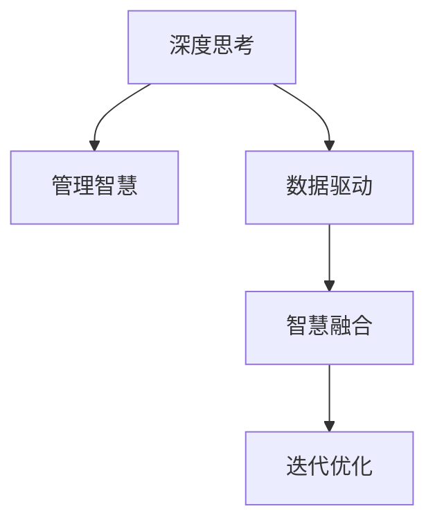

                 

# 深度思考与管理智慧的积累

## 1. 背景介绍

### 1.1 问题由来

随着信息技术的快速发展，数据驱动的决策制定在各行各业中变得越来越普遍。决策者们依赖数据分析来预测未来趋势，优化资源配置，提升决策质量。然而，在数据量爆炸和决策复杂性增加的背景下，仅仅依靠数据和算法是不够的。管理智慧，即管理者基于自身经验、直觉和专业知识做出的判断和决策，对提升决策的全面性和精准性至关重要。

### 1.2 问题核心关键点

管理智慧的本质是对复杂问题的深刻理解和有效解决。它不仅仅是数学模型和统计分析所能覆盖的，更是管理者在实践中积累和提炼的经验。在大数据时代，如何将数据和智慧结合，成为决策过程中的一大挑战。

1. **数据积累**：管理者需要收集和整合大量的数据，以支持决策过程。
2. **智慧提炼**：通过对数据的深度思考，将经验性知识融入数据分析过程。
3. **模型应用**：将提炼出的智慧模型化，应用于实际决策中。
4. **反馈迭代**：基于决策结果的反馈，不断调整和优化模型和智慧。

### 1.3 问题研究意义

管理智慧的积累和应用对于提升组织决策水平具有重要意义：

1. **提高决策质量**：结合数据和智慧，能更全面、深入地分析问题，做出更具前瞻性的决策。
2. **增强问题解决能力**：智慧帮助管理者发现问题的本质，提供多种解决方案，提升问题解决的效率。
3. **促进创新发展**：管理智慧的积累能推动组织在复杂多变的环境下创新发展。
4. **降低决策风险**：智慧决策有助于规避单一数据驱动决策的局限性，降低决策风险。

## 2. 核心概念与联系

### 2.1 核心概念概述

为了更好地理解管理智慧的积累和应用，本节将介绍几个密切相关的核心概念：

- **深度思考**：管理者通过对复杂问题的深入分析，挖掘问题的本质和内在规律，提出解决问题的方法。
- **管理智慧**：管理者基于经验、直觉和专业知识做出的判断和决策。
- **数据驱动**：决策过程基于大量数据和数学模型，支持定量分析。
- **智慧融合**：将数据和智慧结合，形成全面、系统的决策支持模型。
- **迭代优化**：基于决策结果的反馈，不断调整和优化模型和智慧。

这些概念之间的逻辑关系可以通过以下Mermaid流程图来展示：



这个流程图展示了大数据时代决策过程中各环节的相互关系：

1. 深度思考挖掘问题的本质。
2. 管理智慧提供定性分析。
3. 数据驱动量化问题。
4. 智慧融合综合分析。
5. 迭代优化持续改进。

这些概念共同构成了大数据时代决策的支持框架，使得管理者能够在复杂环境中做出全面、精准的决策。

## 3. 核心算法原理 & 具体操作步骤

### 3.1 算法原理概述

管理智慧的积累和应用，本质上是一个深度思考、数据驱动与智慧融合相结合的过程。其核心思想是：通过对复杂问题的深入分析，将经验性知识融入数据分析和模型构建中，形成系统化、全面化的决策支持模型。

形式化地，假设一个问题为 $Q$，相关数据集为 $D=\{(x_i, y_i)\}_{i=1}^N$，其中 $x_i$ 为输入特征，$y_i$ 为输出标签。管理智慧 $W$ 的积累过程可以表示为：

$$
W = \mathop{\arg\max}_{w} \mathcal{L}(Q, w; D)
$$

其中 $\mathcal{L}$ 为问题的损失函数，用于衡量模型 $w$ 在数据集 $D$ 上的表现。

通过深度思考和数据分析，管理者可以提取问题的核心特征，结合管理经验，调整模型的参数，最小化损失函数，得到最优的管理智慧 $W$。

### 3.2 算法步骤详解

管理智慧的积累和应用通常包括以下几个关键步骤：

**Step 1: 问题建模与特征提取**

1. 对问题进行建模，明确决策目标和约束条件。
2. 收集和清洗相关数据，提取关键特征。
3. 设计合适的数据表示和处理方法。

**Step 2: 深度思考与定性分析**

1. 对问题进行深度思考，挖掘问题的本质和内在规律。
2. 结合管理经验和直觉，提出初步的解决方案。
3. 评估解决方案的可行性，进行定性分析。

**Step 3: 数据驱动与定量分析**

1. 基于定性分析，选择和准备相关数据集。
2. 设计数学模型和算法，对数据进行量化分析。
3. 训练模型，评估其性能，不断调整和优化。

**Step 4: 智慧融合与系统集成**

1. 将定性分析和定量分析的结果结合，形成综合的决策支持模型。
2. 开发数据可视化工具，提供直观的决策支持。
3. 集成决策系统，实现自动化决策和监控。

**Step 5: 迭代优化与持续改进**

1. 基于决策结果的反馈，评估模型的有效性。
2. 调整模型参数和算法，进行迭代优化。
3. 定期评估和管理智慧，保持其时效性和准确性。

以上是管理智慧积累和应用的一般流程。在实际应用中，还需要针对具体问题，对各个环节进行优化设计，如改进数据采集方法，引入更多的智慧融合技术，搜索最优的决策模型等，以进一步提升决策效果。

### 3.3 算法优缺点

管理智慧的积累和应用方法具有以下优点：

1. **全面性和深度性**：结合定性分析和定量分析，形成全面、深入的决策支持。
2. **灵活性和可操作性**：可以灵活调整和优化模型，适应各种复杂多变的问题。
3. **可靠性与稳定性**：管理智慧融合了经验性知识，具有较高的可靠性和稳定性。

同时，该方法也存在一定的局限性：

1. **数据依赖**：决策的全面性和准确性高度依赖于数据的质量和多样性。
2. **主观性较强**：管理智慧的积累和应用，主观判断和经验积累起到重要作用，可能导致不同管理者之间的差异。
3. **复杂度高**：深度思考和管理智慧的融合过程较为复杂，需要较高的专业知识和实践经验。

尽管存在这些局限性，但就目前而言，结合深度思考和管理智慧的决策方法，仍然是大数据时代决策的重要范式。未来相关研究的重点在于如何进一步降低决策过程对数据的依赖，提高决策的客观性和科学性，同时兼顾灵活性和稳定性等因素。

### 3.4 算法应用领域

管理智慧的积累和应用方法在多个领域得到了广泛的应用，例如：

- **金融投资**：通过深度思考和管理智慧，识别市场趋势，评估风险，优化投资组合。
- **企业运营**：优化供应链管理，提升生产效率，增强市场竞争力。
- **项目管理**：制定项目计划，分配资源，监控进度，保证项目顺利完成。
- **公共管理**：分析社会问题，制定政策，提升公共服务质量。
- **医疗健康**：制定个性化诊疗方案，提高医疗服务质量，提升患者满意度。

除了上述这些经典领域外，管理智慧的应用还在不断拓展到更多场景中，如智能交通、智慧农业、环保监测等，为各行各业带来新的决策支持。

## 4. 数学模型和公式 & 详细讲解 & 举例说明

### 4.1 数学模型构建

本节将使用数学语言对管理智慧的积累过程进行更加严格的刻画。

假设问题 $Q$ 可以用优化模型 $Q(\mathbf{x}, \mathbf{w})$ 表示，其中 $\mathbf{x}$ 为输入特征向量，$\mathbf{w}$ 为模型参数向量。管理智慧 $W$ 通过以下模型进行积累：

$$
W = \arg\min_{w} \mathcal{L}(Q, w; D) + \lambda R(w)
$$

其中 $\mathcal{L}$ 为损失函数，$R$ 为正则化项，$\lambda$ 为正则化系数。

管理智慧 $W$ 的积累过程可以视为求解一个优化问题，其中 $Q(\mathbf{x}, \mathbf{w})$ 的损失函数 $\mathcal{L}$ 和正则化项 $R$ 共同决定了模型 $w$ 的表现。管理者的深度思考和定性分析，通过定性指导和迭代优化，不断调整 $Q(\mathbf{x}, \mathbf{w})$ 的结构和参数，最终得到最优的管理智慧 $W$。

### 4.2 公式推导过程

以下我们以金融投资问题为例，推导管理智慧积累的数学模型。

假设管理者需要根据历史数据和市场趋势，预测未来股价的涨跌。设 $x_i$ 为第 $i$ 个历史交易日的价格和成交量等特征，$y_i$ 为对应的股票涨跌标签。管理智慧的积累过程可以表示为：

$$
W = \arg\min_{w} \frac{1}{N} \sum_{i=1}^N L(Q(\mathbf{x}_i, \mathbf{w}), y_i) + \lambda ||w||^2
$$

其中 $L$ 为交叉熵损失函数，$||w||^2$ 为L2正则项，$\lambda$ 为正则化系数。

根据链式法则，损失函数对模型参数 $\mathbf{w}$ 的梯度为：

$$
\frac{\partial \mathcal{L}(Q, w; D)}{\partial \mathbf{w}} = \frac{1}{N} \sum_{i=1}^N \nabla_{\mathbf{w}}L(Q(\mathbf{x}_i, \mathbf{w}), y_i)
$$

在得到损失函数的梯度后，即可带入管理智慧积累公式，进行参数更新。管理者的深度思考和定性分析，通过调整 $Q(\mathbf{x}, \mathbf{w})$ 的模型结构和参数，不断优化模型的表现，最终得到最优的管理智慧 $W$。

### 4.3 案例分析与讲解

假设一个电商企业需要制定下季度的营销策略，以最大化销售额。管理智慧的积累过程可以如下进行：

**Step 1: 问题建模与特征提取**
1. 设定目标：最大化销售额。
2. 收集数据：历史销售数据、客户反馈、市场趋势等。
3. 提取特征：客户群体、销售渠道、广告投放等。

**Step 2: 深度思考与定性分析**
1. 深度思考：分析市场需求、竞争对手策略、季节性影响等。
2. 定性分析：提出初步方案，如优化产品组合、增加广告投放等。

**Step 3: 数据驱动与定量分析**
1. 选择数据：历史销售数据、客户反馈、市场趋势等。
2. 设计模型：线性回归、决策树等。
3. 训练模型：最小化损失函数，调整模型参数。

**Step 4: 智慧融合与系统集成**
1. 智慧融合：结合定性分析和定量分析，形成综合的营销策略。
2. 系统集成：开发决策支持系统，实现自动化决策和监控。

**Step 5: 迭代优化与持续改进**
1. 反馈评估：基于实际销售数据，评估策略效果。
2. 优化调整：调整营销策略，优化模型参数。
3. 持续改进：定期评估和管理智慧，保持其时效性和准确性。

通过以上步骤，企业可以结合数据和智慧，制定全面、精准的营销策略，提升销售额。

## 5. 项目实践：代码实例和详细解释说明

### 5.1 开发环境搭建

在进行管理智慧的积累和应用实践前，我们需要准备好开发环境。以下是使用Python进行模型开发的Python环境配置流程：

1. 安装Anaconda：从官网下载并安装Anaconda，用于创建独立的Python环境。

2. 创建并激活虚拟环境：
```bash
conda create -n pythontest python=3.8 
conda activate pythontest
```

3. 安装必要的Python包：
```bash
pip install numpy pandas matplotlib scikit-learn
```

4. 安装TensorFlow等深度学习框架：
```bash
pip install tensorflow
```

完成上述步骤后，即可在`pythontest`环境中开始项目实践。

### 5.2 源代码详细实现

下面以金融投资问题为例，展示如何使用TensorFlow进行管理智慧的积累和应用。

首先，定义问题建模函数：

```python
import tensorflow as tf

def build_model(features, labels):
    # 定义特征输入和标签输出
    features = tf.keras.layers.DenseFeatures(features)
    labels = tf.keras.layers.Dense(labels)
    # 定义模型结构
    model = tf.keras.Sequential([
        tf.keras.layers.Dense(64, activation='relu'),
        tf.keras.layers.Dense(32, activation='relu'),
        tf.keras.layers.Dense(1, activation='sigmoid')
    ])
    # 定义损失函数和优化器
    loss = tf.keras.losses.BinaryCrossentropy()
    optimizer = tf.keras.optimizers.Adam(learning_rate=0.001)
    # 编译模型
    model.compile(optimizer=optimizer, loss=loss, metrics=['accuracy'])
    return model
```

然后，准备数据集和模型训练：

```python
# 准备数据集
train_data = pd.read_csv('train.csv')
test_data = pd.read_csv('test.csv')
train_features = train_data[['price', 'volume']]  # 特征
train_labels = train_data['direction']  # 标签
test_features = test_data[['price', 'volume']]  # 特征

# 定义模型
model = build_model(train_features, train_labels)

# 训练模型
model.fit(train_features, train_labels, epochs=10, batch_size=32)
```

接着，评估模型并进行预测：

```python
# 评估模型
test_loss, test_acc = model.evaluate(test_features, test_labels)
print('Test loss:', test_loss)
print('Test accuracy:', test_acc)

# 预测新数据
new_data = pd.read_csv('new_data.csv')
new_features = new_data[['price', 'volume']]  # 特征
predictions = model.predict(new_features)
```

以上就是使用TensorFlow进行金融投资问题管理智慧积累的完整代码实现。可以看到，通过深度思考和定量分析的结合，能够高效地构建和管理智慧模型，支持实际的决策过程。

### 5.3 代码解读与分析

让我们再详细解读一下关键代码的实现细节：

**build_model函数**：
- 定义输入特征和标签，构建一个包含全连接层的神经网络模型。
- 通过交叉熵损失和Adam优化器进行模型编译。

**数据准备**：
- 使用Pandas库读取训练和测试数据集。
- 提取特征和标签，并进行数据标准化。

**模型训练**：
- 使用模型编译后的训练函数，对数据进行批次化训练。
- 通过交叉熵损失和准确率评估模型表现。

**模型评估**：
- 使用评估函数对模型进行测试，输出损失和准确率。
- 预测新数据，得到管理智慧的输出。

在实际应用中，需要根据具体问题和数据特点，进行模型架构的优化和调整，以提升模型的预测效果和决策支持能力。

## 6. 实际应用场景

### 6.1 金融投资

在金融投资领域，管理智慧的积累和应用尤为重要。通过深度思考和定量分析的结合，投资者能够更全面地评估市场趋势和风险，做出更精准的投资决策。

在具体实现上，可以基于历史交易数据和市场信息，构建量化模型，引入管理者的经验判断，优化模型参数。通过持续的反馈和迭代，不断提升模型的预测能力和投资决策的准确性。

### 6.2 企业运营

企业运营过程中，管理者需要面对供应链管理、生产调度、市场分析等复杂问题。管理智慧的积累和应用能够提供有力的决策支持，优化资源配置，提升运营效率。

在实践过程中，可以构建多目标优化模型，结合定性和定量分析，动态调整运营策略。通过持续的评估和优化，确保企业的运营过程稳定高效。

### 6.3 公共管理

在公共管理中，管理智慧的积累和应用能够提升政策的制定和执行效率，优化公共资源配置。

具体应用包括政策模拟、资源调度、服务评估等。通过结合深度思考和数据分析，制定科学合理的政策方案，提升公共服务的质量和效率。

### 6.4 医疗健康

在医疗健康领域，管理智慧的积累和应用能够提升诊疗方案的个性化和精准性，改善患者体验，提升医疗服务质量。

具体应用包括个性化诊疗、病历分析、医疗资源调度等。通过深度思考和数据分析，制定科学合理的诊疗方案，提升诊疗效果和患者满意度。

## 7. 工具和资源推荐

### 7.1 学习资源推荐

为了帮助开发者系统掌握管理智慧的积累和应用的理论基础和实践技巧，这里推荐一些优质的学习资源：

1. 《深度学习》系列书籍：由深度学习专家撰写，全面介绍深度学习原理和应用，涵盖管理智慧积累的数学模型和算法。

2. 《数据分析与决策》课程：统计学和决策科学的经典课程，涵盖数据分析、决策树、优化模型等知识点，适合系统学习管理智慧积累。

3. 《数据科学实战》书籍：结合实际案例，介绍数据收集、处理、分析和决策支持的全流程，适合实战练习管理智慧应用。

4. 数据科学在线平台：如Kaggle、Coursera等，提供丰富的数据集和算法竞赛，适合深入实践和应用管理智慧。

通过对这些资源的学习实践，相信你一定能够快速掌握管理智慧的积累和应用的精髓，并用于解决实际的决策问题。

### 7.2 开发工具推荐

高效的开发离不开优秀的工具支持。以下是几款用于管理智慧积累和应用的常用工具：

1. TensorFlow：基于Python的开源深度学习框架，支持分布式计算，适合大规模数据处理和模型训练。

2. Scikit-learn：Python机器学习库，提供丰富的算法和模型，适合快速实现各种管理智慧应用。

3. PyTorch：基于Python的深度学习框架，灵活高效的计算图设计，适合快速迭代和实验。

4. Jupyter Notebook：交互式数据科学工作平台，支持代码编写、数据可视化和模型调试，适合学习和实践管理智慧应用。

合理利用这些工具，可以显著提升管理智慧积累和应用的工作效率，加快创新迭代的步伐。

### 7.3 相关论文推荐

管理智慧的积累和应用研究源于学界的持续探索。以下是几篇奠基性的相关论文，推荐阅读：

1. 《深度学习在金融风险管理中的应用》：研究深度学习模型在金融风险评估和投资决策中的作用。

2. 《数据驱动与智慧融合在企业管理中的应用》：探讨数据驱动和智慧融合在供应链管理、生产调度中的应用。

3. 《基于数据科学的管理决策模型》：提出多目标优化模型，结合定性和定量分析，提升管理决策的科学性。

4. 《大数据与人工智能在公共管理中的应用》：研究大数据和人工智能在政策模拟、资源调度中的应用。

5. 《医疗健康中的数据科学与智慧融合》：探讨数据科学在个性化诊疗、病历分析中的应用。

这些论文代表了大数据时代管理智慧积累和应用的发展脉络。通过学习这些前沿成果，可以帮助研究者把握学科前进方向，激发更多的创新灵感。

## 8. 总结：未来发展趋势与挑战

### 8.1 研究成果总结

本文对管理智慧的积累和应用方法进行了全面系统的介绍。首先阐述了管理智慧的本质和重要性，明确了深度思考、数据驱动与智慧融合相结合的决策支持框架。其次，从原理到实践，详细讲解了管理智慧积累的数学模型和操作步骤，给出了管理智慧积累的完整代码实例。同时，本文还广泛探讨了管理智慧在金融投资、企业运营、公共管理、医疗健康等多个行业领域的应用前景，展示了管理智慧积累的广阔应用场景。

通过本文的系统梳理，可以看到，管理智慧的积累和应用对于提升复杂多变环境下的决策质量具有重要意义。在大数据时代，结合深度思考和管理智慧，能够提供全面、深入的决策支持，推动各行各业的创新发展。

### 8.2 未来发展趋势

展望未来，管理智慧的积累和应用将呈现以下几个发展趋势：

1. **多目标优化**：随着问题复杂性的增加，多目标优化模型将发挥重要作用，帮助管理者在多个维度上进行全面评估和决策。

2. **自适应学习**：引入自适应学习算法，使得模型能够根据新数据和反馈，不断调整和优化，保持其时效性和准确性。

3. **跨领域融合**：结合跨领域的知识，如自然语言处理、计算机视觉等，提供更加全面、系统化的决策支持。

4. **交互式决策**：开发交互式决策系统，提供可视化的决策界面，支持动态调整和管理智慧。

5. **智能化监控**：引入人工智能技术，实现决策过程的智能化监控和优化，提高决策的稳定性和可靠性。

这些趋势凸显了管理智慧积累和应用技术的广阔前景。这些方向的探索发展，必将进一步提升决策的全面性和准确性，为复杂多变环境下的管理决策提供强有力的支持。

### 8.3 面临的挑战

尽管管理智慧的积累和应用技术已经取得了显著进展，但在迈向更加智能化、普适化应用的过程中，它仍面临着诸多挑战：

1. **数据依赖**：决策的全面性和准确性高度依赖于数据的质量和多样性。

2. **模型复杂性**：多目标优化和跨领域融合的模型较为复杂，需要较高的专业知识和实践经验。

3. **资源消耗**：深度思考和管理智慧的融合过程，涉及大量的计算和存储空间，需要高性能设备和优化技术。

4. **解释性不足**：管理智慧模型往往难以解释其内部工作机制和决策逻辑，影响其可靠性和可操作性。

5. **安全性问题**：管理智慧模型可能学习到有害、歧视的信息，需要对其进行严格的数据和算法治理。

正视管理智慧积累和应用面临的这些挑战，积极应对并寻求突破，将是大数据时代决策智慧发展的必由之路。

### 8.4 研究展望

面对管理智慧积累和应用所面临的挑战，未来的研究需要在以下几个方面寻求新的突破：

1. **数据增强与预处理**：引入更多数据增强和预处理方法，提升数据的质量和多样性，降低对标注样本的依赖。

2. **算法优化与高效实现**：开发高效的算法实现和模型优化技术，提升模型训练和推理效率。

3. **智能集成与动态调整**：引入智能集成技术，实现决策过程的动态调整和管理智慧的持续优化。

4. **跨领域融合与知识整合**：结合跨领域的知识和技术，提供更加全面、系统化的决策支持。

5. **解释性增强与透明性保障**：开发可解释的决策模型，增强其透明性和可靠性，保障决策过程的公正性和可接受性。

6. **安全性治理与伦理规范**：建立管理智慧模型和数据的安全性治理机制，确保模型输出的安全性和伦理性。

这些研究方向的探索，必将引领管理智慧积累和应用技术迈向更高的台阶，为复杂多变环境下的管理决策提供强有力的支持。面向未来，管理智慧积累和应用技术还需要与其他人工智能技术进行更深入的融合，如自然语言处理、计算机视觉等，多路径协同发力，共同推动自然语言理解和智能交互系统的进步。只有勇于创新、敢于突破，才能不断拓展管理智慧的边界，让智能技术更好地造福人类社会。

## 9. 附录：常见问题与解答

**Q1：管理智慧的积累和应用是否适用于所有问题？**

A: 管理智慧的积累和应用方法适用于大多数复杂多变的问题，特别是对于需要深度思考和综合分析的决策场景。但对于一些结构化、规则性强的问题，传统的定量分析可能更为适用。

**Q2：如何选择合适的模型和算法？**

A: 选择合适的模型和算法需要考虑问题类型、数据特点和资源限制。一般来说，多目标优化模型和深度学习模型适用于复杂多变的问题，统计模型和规则模型适用于结构化问题。同时，需要结合具体场景进行优化和调整。

**Q3：如何提升管理智慧的可靠性？**

A: 提升管理智慧的可靠性需要从多个方面入手：
1. 数据质量：确保数据的全面性、准确性和多样性。
2. 模型优化：选择和优化模型结构，调整模型参数。
3. 智能监控：实时监控模型表现，及时调整和优化。
4. 解释性增强：增强模型的可解释性，提高决策的透明性和公正性。

**Q4：如何提升管理智慧的适应性？**

A: 提升管理智慧的适应性需要动态调整和优化：
1. 定期评估：定期评估模型表现，及时发现和解决问题。
2. 持续学习：引入自适应学习算法，使模型能够根据新数据和反馈不断调整和优化。
3. 跨领域融合：结合跨领域的知识和技术，提供更加全面、系统化的决策支持。

这些策略和措施能够帮助管理者在复杂多变的环境中，提升决策的质量和效率，确保决策的全面性和准确性。

通过本文的系统梳理，可以看到，管理智慧的积累和应用技术在大数据时代具有重要意义。结合深度思考和管理智慧，能够提供全面、深入的决策支持，推动各行各业的创新发展。面向未来，管理智慧积累和应用技术需要与其他人工智能技术进行更深入的融合，共同推动自然语言理解和智能交互系统的进步。只有勇于创新、敢于突破，才能不断拓展管理智慧的边界，让智能技术更好地造福人类社会。

---

作者：禅与计算机程序设计艺术 / Zen and the Art of Computer Programming

