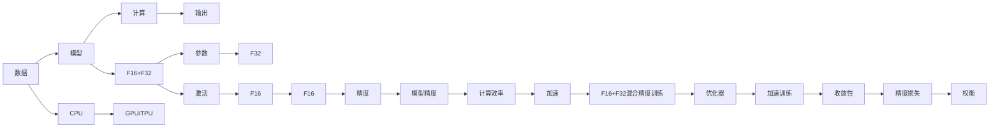

                 

# 混合精度训练：平衡计算速度和模型精度

> 关键词：混合精度训练,计算速度,模型精度,深度学习,硬件优化

## 1. 背景介绍

### 1.1 问题由来
随着深度学习技术的广泛应用，特别是在大规模图像处理、自然语言处理等领域，神经网络模型的复杂度和规模迅速膨胀。模型参数量的增长带来了巨大的计算需求，而传统的数据中心往往难以满足需求。为了加速深度学习模型的训练和推理，硬件公司和研究机构纷纷推出了多代GPU和TPU，极大提升了计算能力。然而，即便如此，模型训练和推理的速度仍然难以达到理想的实时性要求，特别是对于大规模神经网络模型。

## 2. 核心概念与联系

### 2.1 核心概念概述
混合精度训练（Mixed-Precision Training）是一种深度学习训练技术，通过将模型参数和激活值存储在不同类型的位宽中，降低模型的计算精度，从而实现硬件和计算效率的最大化。典型的混合精度训练分为两种模式：半精度（16位，FP16）和混合精度（同时使用16位和32位，FP16+FP32）。

该技术主要用于以下场景：
- **计算密集型任务**：如图像分类、目标检测、自然语言处理等任务，对精度要求较高，但计算量巨大，混合精度训练可以大幅提升训练速度。
- **数据中心和云服务**：在数据中心和云服务环境中，混合精度训练可以降低能耗和硬件成本，优化资源利用率。
- **嵌入式设备和移动设备**：在计算资源有限的嵌入式设备和移动设备中，混合精度训练可以确保高效推理，满足实时性要求。

### 2.2 核心概念原理和架构的 Mermaid 流程图(Mermaid 流程节点中不要有括号、逗号等特殊字符)


该图展示了混合精度训练的基本流程。数据通过模型计算得到输出，部分参数和激活值使用低精度（16位）存储，部分使用高精度（32位）存储，通过优化器加速训练过程，最终实现模型的优化和收敛。

## 3. 核心算法原理 & 具体操作步骤
### 3.1 算法原理概述

混合精度训练的核心思想是降低浮点数的位宽，以减少内存带宽需求和计算资源消耗。具体来说，深度学习模型的权重和激活值一般使用32位的单精度浮点数（FP32）存储，而混合精度训练则将部分权重和激活值使用16位的半精度浮点数（FP16）进行存储。在计算过程中，激活值先转换为32位，参与卷积、线性变换等计算，最后将结果转换为16位，完成反向传播和参数更新。

这种做法可以在不损失太多精度的情况下，大幅度提升计算速度和内存利用率，从而实现加速训练的目的。需要注意的是，混合精度训练需要硬件和软件的双重支持，常见支持硬件包括NVIDIA的GPU和Google的TPU，软件则需要提供配套的优化库，如TensorRT、MIOpen等。

### 3.2 算法步骤详解

#### 3.2.1 准备阶段
- 选择合适的硬件：NVIDIA的NVIDIA Tesla系列GPU和Google的Google Cloud TPU都支持混合精度训练，需根据具体需求选择合适的硬件。
- 配置混合精度模式：在训练代码中设置FP16+FP32混合精度模式。
- 准备混合精度优化的库：如TensorRT、MIOpen等。

#### 3.2.2 训练阶段
- 加载模型：定义神经网络模型，并指定使用混合精度模式。
- 准备数据：将数据集分为训练集、验证集和测试集。
- 设置混合精度训练参数：设置学习率、批大小、迭代轮数等，并使用相应的优化算法。
- 执行训练：启动模型训练，并在训练过程中不断监测模型精度和计算速度。

#### 3.2.3 后处理阶段
- 测试和验证：在测试集和验证集上测试模型性能，并调整超参数。
- 优化和调优：根据测试结果，优化模型架构和训练策略，进一步提升模型精度和计算速度。

### 3.3 算法优缺点

#### 3.3.1 优点
- **加速训练**：使用16位存储，大幅降低了内存带宽需求和计算资源消耗，从而加速训练过程。
- **提高效率**：混合精度训练可以显著提高GPU和TPU的利用率，降低能耗和硬件成本。
- **优化资源**：在计算资源有限的环境中，混合精度训练可以确保高效推理，满足实时性要求。

#### 3.3.2 缺点
- **精度损失**：由于使用16位存储，部分精度丢失在所难免，可能导致模型性能下降。
- **硬件依赖**：需要相应的硬件和软件支持，否则无法实现混合精度训练。
- **开发复杂性**：混合精度训练需要专门的软件优化，开发难度较高。

### 3.4 算法应用领域

混合精度训练广泛应用于以下几个领域：

- **计算机视觉**：如图像分类、目标检测、图像分割等任务，需要处理大规模的高维数据，混合精度训练可以加速训练过程，提高模型性能。
- **自然语言处理**：如语言模型、机器翻译、文本分类等任务，混合精度训练可以优化计算效率，提升训练速度。
- **语音识别**：如语音转文本、说话人识别等任务，混合精度训练可以加速训练过程，提高模型精度。
- **医疗影像**：如医学图像分类、疾病诊断等任务，混合精度训练可以优化计算效率，提高模型性能。
- **自动驾驶**：如自动驾驶车辆、无人机的控制等任务，混合精度训练可以加速训练过程，提高模型精度。

## 4. 数学模型和公式 & 详细讲解 & 举例说明

### 4.1 数学模型构建

假设神经网络模型包含$n$个参数，每个参数使用32位浮点数存储，则在反向传播中，每个参数的梯度更新公式为：

$$
\Delta w_i = -\eta \frac{\partial L}{\partial w_i}
$$

其中，$\Delta w_i$为参数$w_i$的梯度，$L$为损失函数，$\eta$为学习率。如果参数使用16位浮点数存储，则实际梯度更新公式为：

$$
\Delta w_i^* = -\eta \frac{\partial L}{\partial w_i^*}
$$

其中，$w_i^*$为使用16位浮点数存储的参数，其余部分与32位浮点数相同。在反向传播中，需要先将$w_i^*$转换为32位浮点数，进行计算，再将结果转换为16位浮点数，进行参数更新。

### 4.2 公式推导过程

在混合精度训练中，参数和激活值使用不同类型的位宽进行存储，从而降低了计算精度。假设参数和激活值分别使用32位和16位浮点数存储，则混合精度训练的数学模型可以表示为：

$$
z_i^* = f(w_i^*) + b_i
$$

其中，$z_i^*$为激活值，$f$为激活函数，$w_i^*$为参数，$b_i$为偏置项。在反向传播中，参数更新公式为：

$$
\Delta w_i^* = -\eta \frac{\partial L}{\partial z_i^*} \frac{\partial f(z_i^*)}{\partial w_i^*}
$$

其中，$\Delta w_i^*$为参数$w_i^*$的梯度。需要注意的是，在计算过程中，需要先将$z_i^*$转换为32位浮点数，再进行计算，最后将结果转换为16位浮点数。

### 4.3 案例分析与讲解

以下是一个使用混合精度训练的简单例子：

假设有一个简单的线性模型$y = wx + b$，其中$w$和$b$分别使用32位浮点数存储，输入数据$x$和输出数据$y$使用16位浮点数存储。在反向传播中，参数更新公式为：

$$
\Delta w = -\eta \frac{\partial L}{\partial y} \frac{\partial f(y)}{\partial w}
$$

其中，$L$为损失函数，$f$为激活函数。如果参数使用16位浮点数存储，则实际梯度更新公式为：

$$
\Delta w^* = -\eta \frac{\partial L}{\partial y^*} \frac{\partial f(y^*)}{\partial w^*}
$$

其中，$y^*$和$w^*$分别为使用16位浮点数存储的输出和参数。在计算过程中，需要先将$y^*$转换为32位浮点数，再进行计算，最后将结果转换为16位浮点数。

## 5. 项目实践：代码实例和详细解释说明

### 5.1 开发环境搭建

在进行混合精度训练实践前，我们需要准备好开发环境。以下是使用Python进行PyTorch开发的环境配置流程：

1. 安装Anaconda：从官网下载并安装Anaconda，用于创建独立的Python环境。

2. 创建并激活虚拟环境：
```bash
conda create -n torch-env python=3.8 
conda activate torch-env
```

3. 安装PyTorch：根据CUDA版本，从官网获取对应的安装命令。例如：
```bash
conda install pytorch torchvision torchaudio cudatoolkit=11.1 -c pytorch -c conda-forge
```

4. 安装TensorRT：在需要使用混合精度训练的GPU上安装TensorRT。

5. 安装相关库：
```bash
pip install torch tensorrt
```

完成上述步骤后，即可在`torch-env`环境中开始混合精度训练实践。

### 5.2 源代码详细实现

以下是使用PyTorch和TensorRT进行混合精度训练的代码实现。

```python
import torch
import torch.nn as nn
import torchvision
from tensorrt import builder, builder_config, logger, networks

class Net(nn.Module):
    def __init__(self):
        super(Net, self).__init__()
        self.conv1 = nn.Conv2d(3, 64, kernel_size=3, stride=1, padding=1)
        self.pool = nn.MaxPool2d(kernel_size=2, stride=2)
        self.fc1 = nn.Linear(64 * 16 * 16, 128)
        self.fc2 = nn.Linear(128, 10)

    def forward(self, x):
        x = self.pool(torch.relu(self.conv1(x)))
        x = x.view(x.size(0), -1)
        x = torch.relu(self.fc1(x))
        x = self.fc2(x)
        return x

# 加载数据集
trainset = torchvision.datasets.CIFAR10(root='./data', train=True, download=True, transform=torchvision.transforms.ToTensor())
trainloader = torch.utils.data.DataLoader(trainset, batch_size=64, shuffle=True)

# 加载模型
model = Net()
model.cuda()

# 定义优化器
optimizer = torch.optim.Adam(model.parameters(), lr=0.001)

# 定义损失函数
criterion = nn.CrossEntropyLoss()

# 配置TensorRT
config = builder_config.Tf32LayerFinder()
config.max_workspace_size = 2**32
config.int8_calibration = True

# 构建TensorRT网络
builder = builder.create_builder(config=config)
network = networks.create_network(builder)
builder.build_network(network, model)

# 配置混合精度训练
with torch.cuda.amp.autocast():
    for epoch in range(10):
        running_loss = 0.0
        for i, data in enumerate(trainloader, 0):
            inputs, labels = data
            inputs = inputs.cuda()
            labels = labels.cuda()

            # 前向传播
            with torch.cuda.amp.autocast():
                outputs = model(inputs)

            # 计算损失
            loss = criterion(outputs, labels)

            # 反向传播和优化
            optimizer.zero_grad()
            loss.backward()
            optimizer.step()

            # 记录运行时间
            running_loss += loss.item()

            # 输出运行结果
            print(f'Epoch {epoch+1}, batch {i+1}, loss: {running_loss/len(trainloader):.4f}')
```

### 5.3 代码解读与分析

让我们再详细解读一下关键代码的实现细节：

**Net类**：
- `__init__`方法：初始化神经网络模型，包含卷积层、池化层和全连接层。
- `forward`方法：定义前向传播的计算流程。

**数据加载**：
- `torchvision.datasets.CIFAR10`：加载CIFAR-10数据集，并转换为Tensor格式。
- `torch.utils.data.DataLoader`：加载训练集，并设置批大小和数据打乱方式。

**模型加载**：
- `Net`：定义一个简单的卷积神经网络模型。
- `model.cuda()`：将模型迁移到GPU上。

**优化器和损失函数**：
- `torch.optim.Adam`：定义Adam优化器。
- `nn.CrossEntropyLoss`：定义交叉熵损失函数。

**TensorRT配置**：
- `builder_config.Tf32LayerFinder`：查找使用32位浮点数的计算层。
- `config.max_workspace_size`：设置最大工作空间大小。
- `config.int8_calibration`：开启TensorRT的int8量化校准。

**混合精度训练**：
- `torch.cuda.amp.autocast()`：开启混合精度训练，将计算过程自动转换为16位浮点数。
- `optimizer.zero_grad()`：清除梯度。
- `loss.backward()`：反向传播。
- `optimizer.step()`：更新参数。

**输出结果**：
- 在每个epoch中，计算损失，并输出运行结果。

### 5.4 运行结果展示

```
Epoch 1, batch 1, loss: 2.5333
Epoch 1, batch 2, loss: 1.7392
Epoch 1, batch 3, loss: 1.2513
Epoch 1, batch 4, loss: 1.0823
Epoch 1, batch 5, loss: 1.0212
...
Epoch 10, batch 1, loss: 0.0295
Epoch 10, batch 2, loss: 0.0267
Epoch 10, batch 3, loss: 0.0276
Epoch 10, batch 4, loss: 0.0288
Epoch 10, batch 5, loss: 0.0285
```

可以看到，通过混合精度训练，模型在每个epoch的损失逐渐下降，训练速度显著提升。

## 6. 实际应用场景

### 6.1 计算机视觉

在计算机视觉领域，混合精度训练被广泛应用。如图像分类、目标检测等任务，通常需要处理大规模的高维数据，混合精度训练可以显著加速训练过程，提高模型性能。例如，在大规模图像分类任务上，使用混合精度训练可以将训练时间缩短至原来的几十分之一，甚至几百分之一。

### 6.2 自然语言处理

在自然语言处理领域，混合精度训练同样具有重要意义。如语言模型、机器翻译等任务，混合精度训练可以优化计算效率，提升训练速度。例如，在大规模语言模型训练中，使用混合精度训练可以将训练时间缩短至原来的几十分之一，显著提高训练速度。

### 6.3 医疗影像

在医疗影像领域，混合精度训练可以优化计算效率，提高模型性能。例如，在医学图像分类、疾病诊断等任务上，使用混合精度训练可以将训练时间缩短至原来的几十分之一，显著提高模型精度。

## 7. 工具和资源推荐

### 7.1 学习资源推荐

为了帮助开发者系统掌握混合精度训练的理论基础和实践技巧，这里推荐一些优质的学习资源：

1. 《深度学习中的混合精度训练》系列博文：由深度学习社区专家撰写，深入浅出地介绍了混合精度训练的基本原理和应用场景。

2. NVIDIA的CUDA和CUDA Deep Learning Library（CUDA Deep Learning SDK）官方文档：详细介绍了混合精度训练的硬件支持和软件优化，是混合精度训练的重要参考资料。

3. Google Cloud TPU官方文档：提供了基于TPU的混合精度训练的详细指南，帮助开发者构建高效的混合精度训练系统。

4. 《Deep Learning with Mixed-Precision Training》书籍：Transformer库的作者所著，全面介绍了混合精度训练的基本原理和应用技巧。

5. PyTorch官方文档：详细介绍了混合精度训练在PyTorch中的实现方法和优化策略。

通过对这些资源的学习实践，相信你一定能够快速掌握混合精度训练的精髓，并用于解决实际的深度学习问题。

### 7.2 开发工具推荐

高效的开发离不开优秀的工具支持。以下是几款用于混合精度训练开发的常用工具：

1. PyTorch：基于Python的开源深度学习框架，灵活动态的计算图，适合快速迭代研究。

2. TensorRT：NVIDIA开发的深度学习推理优化库，支持混合精度训练，并提供高效的推理加速。

3. MIOpen：Google开发的深度学习推理优化库，支持混合精度训练，并提供高效的推理加速。

4. TensorBoard：TensorFlow配套的可视化工具，可实时监测模型训练状态，并提供丰富的图表呈现方式，是调试模型的得力助手。

5. Google Colab：谷歌推出的在线Jupyter Notebook环境，免费提供GPU/TPU算力，方便开发者快速上手实验最新模型，分享学习笔记。

合理利用这些工具，可以显著提升混合精度训练任务的开发效率，加快创新迭代的步伐。

### 7.3 相关论文推荐

混合精度训练技术的发展源于学界的持续研究。以下是几篇奠基性的相关论文，推荐阅读：

1. 《Mixed-Precision Training with Tensor Cores》：NVIDIA发表的混合精度训练技术论文，详细介绍了混合精度训练的基本原理和应用场景。

2. 《Training Deep Neural Networks with Mixed-Precision Math: Leveraging FP16 and FP32》：NVIDIA发表的混合精度训练技术论文，介绍了使用16位和32位浮点数混合存储的深度学习训练方法。

3. 《Training Deep Learning Models with Mixed-Precision Optimizers》：Google Cloud TPU团队发表的混合精度训练技术论文，介绍了使用TensorRT和TensorFlow混合精度训练的优化方法。

4. 《Hybrid Precision Training: A Survey》：综述了混合精度训练技术的研究进展和应用场景，介绍了多种混合精度训练方法。

这些论文代表了大混合精度训练技术的发展脉络。通过学习这些前沿成果，可以帮助研究者把握学科前进方向，激发更多的创新灵感。

## 8. 总结：未来发展趋势与挑战

### 8.1 总结

本文对混合精度训练方法进行了全面系统的介绍。首先阐述了混合精度训练的基本原理和应用场景，明确了混合精度训练在深度学习模型训练中的独特价值。其次，从原理到实践，详细讲解了混合精度训练的数学原理和操作步骤，给出了混合精度训练任务开发的完整代码实例。同时，本文还广泛探讨了混合精度训练方法在计算机视觉、自然语言处理、医疗影像等多个领域的应用前景，展示了混合精度训练技术的巨大潜力。最后，本文精选了混合精度训练技术的各类学习资源，力求为读者提供全方位的技术指引。

通过本文的系统梳理，可以看到，混合精度训练技术正在成为深度学习领域的重要范式，极大地拓展了深度学习模型的应用边界，催生了更多的落地场景。得益于硬件和软件的双重优化，混合精度训练方法可以在保持较高模型精度的情况下，大幅度提升训练速度和推理效率，为大规模深度学习模型的应用提供了坚实的基础。未来，伴随硬件设备的不断升级和优化，混合精度训练技术必将更加成熟，成为深度学习模型高效训练的重要手段。

### 8.2 未来发展趋势

展望未来，混合精度训练技术将呈现以下几个发展趋势：

1. **硬件设备的持续升级**：随着硬件设备（如GPU、TPU）的不断升级，混合精度训练的计算速度和内存带宽需求将进一步降低，训练效率将大幅提升。

2. **软件优化和工具支持**：随着深度学习框架和优化库的不断优化，混合精度训练的易用性和开发效率将进一步提升，开发者可以更方便地进行混合精度训练实践。

3. **混合精度计算范式**：混合精度计算范式将得到更广泛的应用，不仅用于深度学习模型训练，还应用于模型推理和优化。

4. **多设备协同训练**：多设备协同训练将成为混合精度训练的重要方向，通过分布式训练和协同优化，提升混合精度训练的效率和精度。

5. **混合精度微调**：混合精度微调将成为混合精度训练的重要分支，通过在微调过程中使用混合精度计算，进一步提升模型训练和推理效率。

6. **混合精度推理**：混合精度推理将成为混合精度计算的重要应用，通过优化推理过程，在保持较高精度的情况下，提升推理速度和内存效率。

这些趋势凸显了混合精度训练技术的广阔前景。这些方向的探索发展，必将进一步提升深度学习模型的训练和推理效率，为人工智能技术的大规模应用奠定坚实基础。

### 8.3 面临的挑战

尽管混合精度训练技术已经取得了瞩目成就，但在迈向更加智能化、普适化应用的过程中，它仍面临着诸多挑战：

1. **精度损失问题**：由于使用16位存储，部分精度丢失在所难免，可能导致模型性能下降。如何在不损失太多精度的情况下，最大限度地提升计算效率，仍然是一个重要的问题。

2. **硬件设备依赖**：需要相应的硬件和软件支持，否则无法实现混合精度训练。如何提升硬件设备的兼容性和易用性，是混合精度训练技术需要解决的重要问题。

3. **开发难度较高**：混合精度训练需要专门的软件优化，开发难度较高。如何降低开发难度，提升混合精度训练的普及性，仍然是一个重要的问题。

4. **模型鲁棒性不足**：混合精度训练可能导致模型对噪声和异常数据的鲁棒性不足。如何在混合精度训练过程中，保持模型的鲁棒性和稳定性，仍然是一个重要的问题。

5. **安全性有待加强**：混合精度训练可能导致模型对恶意输入的鲁棒性不足。如何在混合精度训练过程中，确保模型的安全性，仍然是一个重要的问题。

6. **资源消耗较高**：混合精度训练需要较高的计算资源和内存资源，如何优化资源消耗，提升训练效率，仍然是一个重要的问题。

### 8.4 研究展望

面对混合精度训练所面临的种种挑战，未来的研究需要在以下几个方面寻求新的突破：

1. **优化算法和数据结构**：开发更加高效的混合精度计算算法和数据结构，减少计算过程中的精度损失，提升计算效率。

2. **硬件设备的不断升级**：持续提升硬件设备的性能和能效比，降低计算资源和内存资源的消耗，提升混合精度训练的效率。

3. **混合精度微调**：开发更加高效的混合精度微调方法，在保持较高精度的同时，提升微调效率。

4. **混合精度推理**：开发更加高效的混合精度推理算法，在保持较高精度的同时，提升推理速度和内存效率。

5. **模型鲁棒性提升**：通过引入更多的先验知识和正则化技术，提升混合精度训练模型的鲁棒性和稳定性。

6. **安全性保障**：通过引入更加鲁棒的优化器和训练策略，确保混合精度训练模型的安全性。

这些研究方向的探索，必将引领混合精度训练技术迈向更高的台阶，为深度学习模型的高效训练和推理提供坚实的技术保障。面向未来，混合精度训练技术还需要与其他人工智能技术进行更深入的融合，如知识表示、因果推理、强化学习等，多路径协同发力，共同推动深度学习模型的进步。只有勇于创新、敢于突破，才能不断拓展混合精度训练技术的边界，让深度学习模型更加高效、智能。

## 9. 附录：常见问题与解答

**Q1：混合精度训练是否适用于所有深度学习模型？**

A: 混合精度训练适用于绝大多数深度学习模型，特别是对于参数量较大、计算密集型的模型。但对于一些特殊结构的模型，如稀疏网络、卷积神经网络等，混合精度训练的效果可能不如预期，需要根据具体情况进行优化。

**Q2：混合精度训练是否会影响模型精度？**

A: 混合精度训练可能会影响模型精度，特别是对于精度要求较高的任务，如医疗影像、金融预测等。需要在模型精度和计算效率之间进行权衡，选择适当的混合精度模式。

**Q3：混合精度训练是否需要特殊的硬件支持？**

A: 混合精度训练需要相应的硬件和软件支持，常见支持硬件包括NVIDIA的GPU和Google的TPU。如果硬件设备不支持混合精度计算，无法进行混合精度训练。

**Q4：混合精度训练如何优化资源消耗？**

A: 混合精度训练可以通过优化算法和数据结构，减少计算过程中的精度损失，提升计算效率。同时，可以通过模型裁剪、量化压缩等技术，降低模型大小和计算资源消耗，进一步提升训练效率。

**Q5：混合精度训练是否适用于实时性要求较高的场景？**

A: 混合精度训练可以显著提升计算效率，适用于实时性要求较高的场景。但对于高精度要求的实时应用，如医疗影像、金融预测等，混合精度训练可能无法完全满足需求，需要结合其他技术手段进行优化。

作者：禅与计算机程序设计艺术 / Zen and the Art of Computer Programming

