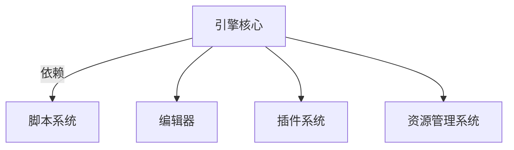

                 

## 1. 背景介绍

游戏开发一直是计算机图形和模拟技术的先驱，对于视觉效果的追求始终处于技术的尖端。Unity和Unreal Engine作为全球两大主流的实时游戏引擎，在过去十年中不断创新和发展，推动了游戏和虚拟现实技术的进步。

### 1.1 问题由来
随着硬件性能的提升和开发者的需求变化，游戏引擎也经历了多次变革。从最初的单机游戏，发展到支持多人在线的MMORPG、开放世界的 sandbox games、以及更加沉浸的虚拟现实游戏，游戏引擎的架构和特性也需要相应地升级。

而2010年发布的Unity和2013年发布的Unreal Engine 4，正是这种转变的代表。这两款引擎不仅在功能和性能上有了质的飞跃，还在架构设计和用户体验上进行了诸多改进，从而能够满足不同类型游戏的开发需求。

### 1.2 问题核心关键点
Unity和Unreal Engine 4的成功，很大程度上取决于它们在引擎设计上的核心创新。这包括支持多平台开发、强大的物理引擎、先进的渲染技术、高效的资源管理机制、丰富的第三方插件生态系统等。

- **多平台支持**：两款引擎都支持在Windows、macOS、Linux、iOS、Android、Web等多个平台上的开发，使得游戏开发者可以更加自由地选择发布平台。
- **物理引擎**：Unity的Physics2D和Unreal Engine的PhysX引擎都具备强大的物理模拟能力，能够提供逼真的物理效果。
- **渲染技术**：两款引擎都提供了高度优化的渲染引擎，如Unity的URP（Universal Render Pipeline）和Unreal Engine的HDRP（High Definition Render Pipeline），以提升图形表现和性能。
- **资源管理**：Unity的Asset Bundles和Unreal Engine的资产管理系统，有助于优化资源的加载和卸载，提升游戏的运行效率。
- **插件生态**：两款引擎都有丰富的第三方插件库，可以加速开发流程，扩展游戏功能。

本文将全面介绍Unity和Unreal Engine 4在游戏框架发展方面的技术突破，并对比两者的特点和优势。

## 2. 核心概念与联系

### 2.1 核心概念概述

要了解Unity和Unreal Engine 4的核心概念，首先需要理解游戏引擎的基本架构和组件：

- **引擎核心**：包括图形渲染、物理模拟、碰撞检测等核心组件，负责处理游戏的核心计算。
- **脚本系统**：支持开发者的自定义代码编写，用于扩展引擎的功能。
- **编辑器**：提供可视化界面，简化开发流程，提高开发效率。
- **插件系统**：允许开发者自由安装和卸载插件，以扩展引擎功能。
- **资源管理系统**：管理游戏的资源，如纹理、模型、音频等，以优化性能。

### 2.2 核心概念联系（使用 Mermaid 流程图表示）



这个流程图展示了两款引擎的核心组件及其相互依赖的关系。引擎核心负责处理游戏的基本运行，脚本系统负责开发者自定义的扩展功能，编辑器简化了开发流程，插件系统丰富了功能，资源管理系统优化了性能。

## 3. 核心算法原理 & 具体操作步骤

### 3.1 算法原理概述

Unity和Unreal Engine 4在游戏引擎的核心算法上采用了许多相似的设计理念，但具体的实现和优化策略则有所差异。

#### 3.1.1 渲染管线

两款引擎都采用了管线（Pipeline）的概念，即将渲染过程分为多个阶段，每个阶段处理特定的图形处理任务。这种设计大大提高了渲染效率，同时也为游戏开发者提供了更大的自由度。

- **Unity的URP（Universal Render Pipeline）**：Unity的渲染管线专注于性能和可扩展性。它使用了标准着色器，并通过动态批处理和延迟着色来提升渲染效率。
- **Unreal Engine的HDRP（High Definition Render Pipeline）**：Unreal Engine的渲染管线则强调细节和质量。它使用了PBR（物理基于渲染）着色器和实时光线追踪，能够提供更为逼真的图形效果。

#### 3.1.2 物理引擎

两款引擎都拥有强大的物理引擎，用于模拟游戏内的物理交互。

- **Unity的Physics2D**：Unity的物理引擎专注于二维游戏，提供了强大的刚体物理、碰撞检测和动画系统。
- **Unreal Engine的PhysX**：Unreal Engine的物理引擎支持三维物理模拟，提供了复杂的物理效果和真实的碰撞响应。

### 3.2 算法步骤详解

#### 3.2.1 Unity的开发流程

1. **搭建项目**：在Unity Hub中选择项目模板，搭建新的项目框架。
2. **创建场景**：在编辑器中创建或导入3D场景，设置光源、摄像机和背景。
3. **编写脚本**：使用C#或JavaScript编写游戏逻辑，如游戏流程控制、动画控制等。
4. **添加组件**：在场景中创建对象，并为其添加如刚体、碰撞器、粒子系统等组件。
5. **测试和优化**：在编辑器中测试游戏，并通过分析工具（如Unity Profiler）优化性能。

#### 3.2.2 Unreal Engine 4的开发流程

1. **搭建项目**：在Unreal Engine 4中创建新的项目，选择合适的蓝图或C++代码。
2. **创建角色和场景**：在编辑器中创建角色和场景，设置光源、摄像机和环境。
3. **编写蓝图或代码**：使用蓝图或C++编写游戏逻辑，如角色控制、动画控制等。
4. **添加组件**：在角色或场景中创建或修改组件，如碰撞器、动画系统等。
5. **测试和优化**：在编辑器中测试游戏，并通过性能分析工具（如Unreal Engine 4 Profiler）优化性能。

### 3.3 算法优缺点

#### 3.3.1 Unity的优势

- **广泛的用户基础**：Unity拥有庞大的用户群体，提供丰富的社区支持和资源库。
- **跨平台支持**：支持Windows、macOS、Linux、iOS、Android和Web等多个平台。
- **易于学习**：提供可视化的编辑器，新手上手快。
- **高效性能**：通过动态批处理和延迟着色等技术，提升渲染效率。

#### 3.3.2 Unity的劣势

- **性能瓶颈**：在处理大规模场景和高帧率需求时，可能会出现性能问题。
- **资源消耗**：动态批处理可能导致资源消耗过高，尤其是在渲染复杂场景时。

#### 3.3.3 Unreal Engine 4的优势

- **高质量图形**：支持实时光线追踪和PBR着色器，提供逼真的图形效果。
- **强大的物理引擎**：支持三维物理模拟，提供复杂的物理效果和真实的碰撞响应。
- **丰富的工具和资源**：提供强大的编辑器和丰富的插件库，支持高效的开发流程。

#### 3.3.4 Unreal Engine 4的劣势

- **学习曲线陡峭**：蓝图和C++两种开发模式需要开发者具备一定的编程基础。
- **资源需求高**：支持高分辨率和复杂特效，资源消耗较大。

### 3.4 算法应用领域

两款引擎在多个领域都有广泛应用：

- **手机游戏**：Unity和Unreal Engine都支持移动平台的开发，可以制作高质量的手游。
- **大型游戏**：Unreal Engine 4在游戏画面和物理效果上的优势，使其更适合开发大型游戏。
- **VR和AR**：两款引擎都支持VR和AR开发，能够提供沉浸式的体验。
- **教育游戏**：Unity提供了易于学习的编辑器和丰富的教程资源，适合开发教育游戏。

## 4. 数学模型和公式 & 详细讲解 & 举例说明

### 4.1 数学模型构建

#### 4.1.1 Unity的渲染管线

Unity的渲染管线（URP）主要由以下几个部分组成：

1. **着色器（Shader）**：负责计算每个像素的颜色。
2. **几何着色器（Geometry Shader）**：处理顶点数据，生成复杂几何体。
3. **光照着色器（Lighting Shader）**：计算光源对场景的影响。
4. **透明度着色器（Alpha Shader）**：处理透明对象。

### 4.2 公式推导过程

#### 4.2.1 Unity的光照计算

Unity使用Deferred Shading技术进行光照计算。其核心公式为：

$$ \text{Pixel Color} = \text{Base Color} + \sum_i \text{Light Color}_i \times \text{Attenuation}_i $$

其中，$\text{Pixel Color}$ 为像素颜色，$\text{Base Color}$ 为基本颜色，$\text{Light Color}_i$ 为第 $i$ 个光源的颜色，$\text{Attenuation}_i$ 为第 $i$ 个光源的衰减因子。

### 4.3 案例分析与讲解

#### 4.3.1 实际案例

- **Unity中的动态批处理**：在Unity中，动态批处理可以将多个相同材质或材质的对象合批处理，减少渲染次数，提高性能。
- **Unreal Engine的光线追踪**：Unreal Engine 4中的光线追踪使用 ray tracing 技术，通过追踪光线与场景的交互，实现更加真实的阴影和反射效果。

## 5. 项目实践：代码实例和详细解释说明

### 5.1 开发环境搭建

#### 5.1.1 Unity的搭建

1. **安装Unity Hub**：下载并安装Unity Hub，它是Unity的官方平台，可以下载和管理Unity的各种版本。
2. **创建新项目**：在Unity Hub中选择合适的项目模板，创建新的Unity项目。
3. **导入资源**：在编辑器中导入所需的资源，如3D模型、纹理和音频。

#### 5.1.2 Unreal Engine 4的搭建

1. **安装Unreal Engine**：从Unreal Engine官网下载并安装最新版本的Unreal Engine。
2. **创建新项目**：在Unreal Engine 4中创建一个新的项目，选择C++或蓝图开发模式。
3. **导入资源**：在编辑器中导入所需的资源，如3D模型、纹理和音频。

### 5.2 源代码详细实现

#### 5.2.1 Unity的脚本编写

```csharp
using UnityEngine;

public class CharacterController : MonoBehaviour
{
    private Rigidbody rb;
    public float speed = 5f;
    public float jumpPower = 5f;

    void Update()
    {
        float moveX = Input.GetAxis("Horizontal");
        float moveY = Input.GetAxis("Vertical");

        rb.velocity = new Vector3(moveX * speed, moveY * speed, 0);
        if (Input.GetButtonDown("Jump"))
        {
            rb.AddForce(new Vector3(0, jumpPower, 0), ForceMode.Impulse);
        }
    }
}
```

#### 5.2.2 Unreal Engine 4的蓝图编写

1. **创建蓝图**：在Unreal Engine 4中选择“Blueprints”类别，创建新的蓝图。
2. **添加组件**：在蓝图中添加必要的组件，如Character Movement和Jump。
3. **编写逻辑**：在蓝图的事件节点中添加逻辑，如输入控制和跳跃动作。

### 5.3 代码解读与分析

#### 5.3.1 Unity的解释

上述代码实现了角色的移动和跳跃功能。通过Rigidbody组件控制角色的物理行为，并通过Input系统获取用户的操作。

#### 5.3.2 Unreal Engine 4的解释

蓝图中通过Character Movement组件实现角色的移动，通过Jump组件实现角色的跳跃。用户的操作通过事件节点触发蓝图中的逻辑，实现控制。

### 5.4 运行结果展示

#### 5.4.1 Unity的运行结果

在Unity编辑器中设置场景和角色，将上述脚本组件添加到角色上，即可运行测试。

#### 5.4.2 Unreal Engine 4的运行结果

在Unreal Engine 4编辑器中设置场景和角色，将上述蓝图组件添加到角色上，即可运行测试。

## 6. 实际应用场景

### 6.1 智能游戏

两款引擎在智能游戏中的应用尤为突出。例如，使用Unity和Unreal Engine 4开发的《星际争霸2》和《堡垒之夜》，展示了高端游戏引擎的强大功能。

#### 6.1.1 Unity的应用

Unity在《星际争霸2》中实现了高帧率的多人在线游戏，支持大规模玩家对战。

#### 6.1.2 Unreal Engine 4的应用

Unreal Engine 4在《堡垒之夜》中实现了实时动态光照和复杂的物理效果，提供了沉浸式的游戏体验。

### 6.2 虚拟现实

Unity和Unreal Engine 4在虚拟现实（VR）领域也有广泛应用。例如，使用Unity和Unreal Engine 4开发的《Beat Saber》和《Oculus Quest 2》，展示了VR游戏的潜力。

#### 6.2.1 Unity的应用

Unity在《Beat Saber》中实现了实时的音乐节奏匹配和互动体验。

#### 6.2.2 Unreal Engine 4的应用

Unreal Engine 4在《Oculus Quest 2》中实现了复杂的空间物理交互和高效的渲染。

### 6.3 跨平台游戏

两款引擎都支持跨平台开发，可以实现同一个游戏在多个平台上的运行。

#### 6.3.1 Unity的应用

Unity的跨平台支持使得开发团队可以轻松地将游戏部署到iOS、Android等多个平台，实现全球范围内的用户覆盖。

#### 6.3.2 Unreal Engine 4的应用

Unreal Engine 4的跨平台支持同样强大，可以实现高质量的移动游戏，并在PC和主机上运行。

## 7. 工具和资源推荐

### 7.1 学习资源推荐

#### 7.1.1 Unity的资源

1. **官方文档**：Unity官网提供了详细的文档和教程，涵盖从基础到高级的各种主题。
2. **Unity Learn**：Unity官方在线学习平台，提供视频教程、课程和实验项目。
3. **Unity论坛**：Unity社区的官方论坛，可以找到大量的开发资源和帮助。

#### 7.1.2 Unreal Engine 4的资源

1. **官方文档**：Unreal Engine官网提供了详尽的文档和教程，涵盖从基础到高级的各种主题。
2. **Unreal Engine Learn**：Unreal Engine官方在线学习平台，提供视频教程、课程和实验项目。
3. **Unreal Engine 4社区**：Unreal Engine社区的官方论坛，可以找到大量的开发资源和帮助。

### 7.2 开发工具推荐

#### 7.2.1 Unity的开发工具

1. **Unity Hub**：Unity的官方平台，可以下载和管理Unity的各种版本。
2. **Visual Studio Code**：一个轻量级的代码编辑器，支持Unity脚本编写。
3. **Unity Profiler**：Unity的性能分析工具，可以帮助开发者优化游戏性能。

#### 7.2.2 Unreal Engine 4的开发工具

1. **Visual Studio**：一个全功能的IDE，支持C++和蓝图开发模式。
2. **Unreal Engine 4 Profiler**：Unreal Engine的性能分析工具，可以帮助开发者优化游戏性能。
3. **Unreal Engine 4 Editor**：Unreal Engine 4的编辑器，提供可视化界面，简化开发流程。

### 7.3 相关论文推荐

#### 7.3.1 Unity的相关论文

1. **Unity: Universal Game Engine**：Unity官方文档，详细介绍Unity引擎的架构和特性。
2. **Unity Scripting Architecture**：探讨Unity脚本系统的设计。
3. **Unity Particle System**：详细讲解Unity的粒子系统及其应用。

#### 7.3.2 Unreal Engine 4的相关论文

1. **Unreal Engine 4: Technical Details**：Unreal Engine官方文档，详细介绍Unreal Engine 4的架构和特性。
2. **Unreal Engine 4 Graphics**：详细讲解Unreal Engine 4的渲染管线和图形技术。
3. **Unreal Engine 4 Physics**：详细讲解Unreal Engine 4的物理引擎及其应用。

## 8. 总结：未来发展趋势与挑战

### 8.1 总结

Unity和Unreal Engine 4在游戏引擎领域分别代表了两大技术潮流。两款引擎通过不断创新，提升了游戏开发的质量和效率，推动了游戏行业的快速发展。

通过对比两款引擎的核心算法和具体操作步骤，可以清晰地看到它们各自的优势和劣势。两款引擎在游戏渲染、物理模拟、跨平台开发等方面都有独到之处，能够满足不同类型游戏的开发需求。

### 8.2 未来发展趋势

#### 8.2.1 引擎优化

两款引擎未来将继续优化性能，提升渲染效率和物理模拟精度。例如，Unity将优化动态批处理和异步渲染，Unreal Engine 4将进一步完善实时光线追踪和PBR着色器。

#### 8.2.2 增强支持

两款引擎将增强对新兴技术平台的支持，如WebGL、WebAssembly等，进一步拓展游戏的应用范围。

#### 8.2.3 人工智能

两款引擎将更多地集成人工智能技术，如深度学习、机器学习等，提升游戏的智能交互和自适应能力。

#### 8.2.4 开发生态

两款引擎将继续丰富第三方插件库和社区支持，提供更便捷的开发工具和资源。

### 8.3 面临的挑战

#### 8.3.1 性能瓶颈

两款引擎在处理大规模场景和高帧率需求时，可能面临性能瓶颈。需要进一步优化渲染和物理模拟算法。

#### 8.3.2 资源消耗

两款引擎在处理高分辨率和复杂特效时，资源消耗较大。需要进一步优化资源管理系统。

#### 8.3.3 学习曲线

两款引擎的学习曲线相对陡峭，需要提供更多的教程和文档支持，帮助开发者快速上手。

### 8.4 研究展望

#### 8.4.1 开发平台

未来的游戏引擎将更加注重跨平台支持和资源优化，提升游戏的性能和用户体验。

#### 8.4.2 人工智能

结合人工智能技术，游戏引擎将支持更多的智能交互和自适应功能，提升游戏的沉浸感和互动性。

#### 8.4.3 用户界面

未来的游戏引擎将提供更加友好的用户界面和开发工具，降低开发门槛，提升开发效率。

综上所述，Unity和Unreal Engine 4作为当前最流行的游戏引擎，将继续引领游戏引擎的发展方向。开发者应该根据具体需求和开发经验，选择合适的引擎进行游戏开发，不断探索新的技术领域，推动游戏行业的发展。

## 9. 附录：常见问题与解答

### 9.1 问题解答

#### Q1: Unity和Unreal Engine 4有何区别？

A: Unity和Unreal Engine 4在渲染技术、物理模拟、开发生态等方面存在区别。Unity注重性能和跨平台支持，适合开发中小型游戏和移动游戏。Unreal Engine 4注重质量和高帧率，适合开发大型游戏和复杂场景的游戏。

#### Q2: Unity和Unreal Engine 4的学习难度是否相同？

A: Unity的开发界面更加友好，学习难度相对较低，适合新手入门。Unreal Engine 4的学习曲线较陡峭，需要一定的编程基础，适合有一定开发经验的用户。

#### Q3: 如何选择Unity和Unreal Engine 4？

A: 如果希望开发跨平台的游戏或小型游戏，可以选择Unity。如果希望开发高质量的3D游戏或大型游戏，可以选择Unreal Engine 4。

#### Q4: 如何在Unity和Unreal Engine 4中进行脚本编写？

A: Unity使用C#或JavaScript进行脚本编写，Unreal Engine 4使用C++或蓝图进行编写。开发者可以根据项目需求选择适合的编程语言。

#### Q5: 如何进行游戏引擎的优化？

A: 优化游戏引擎需要从多个方面入手，包括渲染优化、物理模拟优化、资源管理优化等。可以使用性能分析工具如Unity Profiler和Unreal Engine 4 Profiler进行调优。

---

作者：禅与计算机程序设计艺术 / Zen and the Art of Computer Programming

