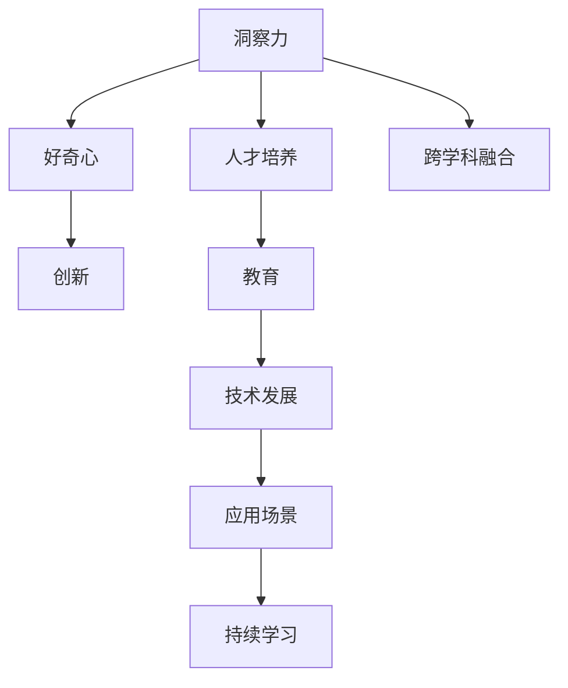

                 

# 理解洞察力的培养：鼓励好奇心和创新人才

> 关键词：洞察力,好奇心,创新,人才培养,教育,技术发展

## 1. 背景介绍

### 1.1 问题由来

在快速发展的技术世界中，洞察力成为了企业竞争力的关键。洞察力不仅指的是数据分析和预测能力，还涉及到对市场趋势、用户需求、技术动态等复杂因素的敏锐观察和判断。然而，洞察力的培养并非易事，特别是在当前信息过载、知识爆炸的时代，培养具有敏锐洞察力的人才，成为了企业和教育机构的共同挑战。

### 1.2 问题核心关键点

为了在当今竞争激烈的市场中保持领先，企业必须培养具备创新能力和敏锐洞察力的技术人才。这些问题关键点在于：

1. **培养方式**：如何通过教育手段，激发学生的探索精神和创新思维。
2. **评估标准**：如何设计有效的评估机制，以识别和鼓励那些具有独特洞察力的学生。
3. **实践机会**：如何在实际项目中给予学生足够的实践机会，让他们将理论知识转化为实际能力。
4. **跨学科融合**：如何促进不同学科之间的融合，培养具备跨学科视野的复合型人才。
5. **持续学习**：如何在快速变化的技术环境中，持续激发学生的学习热情和好奇心。

### 1.3 问题研究意义

洞察力的培养对于企业、教育机构乃至整个社会都具有重要意义。通过培养具备洞察力的人才，企业可以更快地适应市场变化，抓住新机遇；教育机构可以培养出具有创新思维和社会责任感的未来领导者。同时，洞察力的提升也能推动技术创新，促进社会进步。

## 2. 核心概念与联系

### 2.1 核心概念概述

为了更好地理解洞察力的培养，本节将介绍几个密切相关的核心概念：

- **洞察力**：指通过深入分析、观察和理解，发现问题本质和潜在趋势的能力。
- **好奇心**：指对未知事物的好奇心和探索欲，是创新的原动力。
- **创新**：指在已有知识的基础上，创造出新的想法、产品或方法。
- **人才培养**：指通过教育、培训等手段，培养具备特定能力的人才。
- **教育**：指通过传授知识、技能和价值观，促进人的全面发展。
- **技术发展**：指在特定领域内，技术从研究到应用的演进过程。

这些核心概念之间的逻辑关系可以通过以下Mermaid流程图来展示：



这个流程图展示了一系列关键概念及其之间的相互关系：

1. **洞察力** 通过 **好奇心** 和 **教育** 的培养，为 **创新** 提供基础。
2. **创新** 是 **技术发展** 的驱动力，推动 **应用场景** 的创新。
3. **人才培养** 和 **跨学科融合** 为创新提供人才支持和视角。
4. **持续学习** 为创新提供知识更新和动力。

## 3. 核心算法原理 & 具体操作步骤

### 3.1 算法原理概述

洞察力的培养，本质上是教育过程的一部分，涉及心理学的多方面因素。以下将从教育心理学的角度，探讨如何通过特定的教学方法，激发和培养学生的洞察力。

- **目标设定**：明确培养洞察力的目标，如解决问题的能力、创新思维等。
- **环境塑造**：创建一个鼓励探索和创新的环境，如开放课堂、跨学科项目等。
- **互动教学**：通过师生互动和同伴学习，促进知识的理解和应用。
- **反馈机制**：及时有效的反馈，帮助学生识别和改正错误，调整学习策略。
- **自我反思**：引导学生进行自我反思，提高自我认知和自我调整能力。

### 3.2 算法步骤详解

洞察力的培养过程可以分为以下几个关键步骤：

1. **目标明确**：设定明确的培养目标，如培养学生发现和解决问题的能力。

2. **环境准备**：
   - 创建开放的课堂环境，鼓励学生提问和讨论。
   - 设计跨学科项目，提供真实的实际问题，激发学生兴趣。

3. **互动教学**：
   - 通过小组讨论、角色扮演等方式，促进学生间的互动和合作。
   - 利用翻转课堂等教学方法，让学生在课前自主学习，课堂上深入探讨。

4. **反馈机制**：
   - 提供即时反馈，帮助学生理解错误和改进方法。
   - 鼓励同伴评价，促进学生之间的互相学习和竞争。

5. **自我反思**：
   - 引导学生进行自我反思，评估学习效果，制定改进计划。
   - 通过日志、报告等方式，记录学习过程，进行持续改进。

### 3.3 算法优缺点

洞察力的培养方法具有以下优点：
1. **多样性**：通过多种教学方法，适应不同学生的需求和特点。
2. **实践性**：通过实际项目和案例，帮助学生将理论知识应用于实际问题。
3. **互动性**：促进师生和同伴间的互动，提高学习效果。
4. **持续性**：通过持续的反馈和反思，帮助学生不断进步。

同时，也存在以下缺点：
1. **复杂性**：洞察力的培养涉及多方面的因素，需要综合考虑。
2. **资源需求**：需要充足的资源支持，如时间、师资、设备等。
3. **评估难度**：洞察力的培养效果难以量化，评估难度大。
4. **个体差异**：不同学生的需求和表现各异，需要个性化的指导。

尽管存在这些局限性，但整体而言，该方法为洞察力的培养提供了有效途径，值得在教育和实践中进行探索和优化。

### 3.4 算法应用领域

洞察力的培养方法在多个领域都有广泛的应用，例如：

- **教育**：通过跨学科项目、问题导向学习等方法，培养学生的创新思维和洞察力。
- **企业培训**：通过实际项目、案例分析和反思机制，提升员工的问题解决能力和创新能力。
- **科学研究**：通过跨学科合作和持续学习，激发科学家的新思路和新发现。
- **技术开发**：通过实际项目和开源社区，促进技术的不断创新和进步。

## 4. 数学模型和公式 & 详细讲解 & 举例说明

### 4.1 数学模型构建

洞察力的培养过程可以建模为一个动态系统，学生、教师和环境之间的互动构成了系统的各个组件。数学模型如下：

$$
\begin{cases}
\dot{x_i} = f(x_i, x_j, u_i)\\
y_i = g(x_i)
\end{cases}
$$

其中 $x_i$ 表示学生的状态变量，如知识水平、问题解决能力等；$x_j$ 表示教师和环境的状态变量；$u_i$ 表示输入变量，如教学方法、反馈机制等；$y_i$ 表示输出变量，如学习效果、创新成果等。

### 4.2 公式推导过程

洞察力的培养模型可以分为两个部分进行推导：

1. **动态方程**：
   - 描述学生状态的变化规律，包括知识获取、问题解决等过程。
   - 涉及学生与教师、环境的互动关系，如互动频率、反馈质量等。

2. **输出方程**：
   - 描述学习效果和创新成果的产出过程。
   - 涉及学生自我反思、同伴评价等反馈机制的影响。

通过数学建模，可以更好地理解和分析洞察力培养的过程，从而优化教学方法和评估机制。

### 4.3 案例分析与讲解

以一个简单的案例进行分析：一名学生在学习数学的过程中，通过解决问题逐步提高了洞察力。

1. **初始状态**：
   - 学生对数学的基本概念和方法理解有限。
   - 教师通过引导式学习，提供相关知识和方法。

2. **互动过程**：
   - 学生通过小组讨论和实践，逐步理解问题本质和解决方法。
   - 教师提供即时反馈和改进建议，帮助学生优化学习策略。

3. **输出结果**：
   - 学生解决了一个复杂数学问题，获得了成就感。
   - 学生通过反思，总结学习经验，进一步提升问题解决能力。

通过这个案例，可以看到洞察力的培养是一个动态、互动和反馈的过程，需要综合考虑多种因素。

## 5. 项目实践：代码实例和详细解释说明

### 5.1 开发环境搭建

在进行洞察力培养的项目实践前，我们需要准备好开发环境。以下是使用Python进行数据分析和可视化环境配置的流程：

1. 安装Anaconda：从官网下载并安装Anaconda，用于创建独立的Python环境。

2. 创建并激活虚拟环境：
```bash
conda create -n insightful-env python=3.8 
conda activate insightful-env
```

3. 安装相关库：
```bash
conda install numpy pandas matplotlib seaborn scikit-learn jupyter notebook ipython
```

完成上述步骤后，即可在`insightful-env`环境中开始项目实践。

### 5.2 源代码详细实现

下面是一个简单的Python代码实例，用于模拟学生的学习过程和观察结果：

```python
import numpy as np
import pandas as pd
import matplotlib.pyplot as plt

# 初始状态
x = np.array([0, 0, 0, 0, 0])  # 学生状态变量
t = np.array([0, 0, 0, 0, 0])  # 时间变量

# 动态方程
def f(x, t, u):
    return np.array([0.1 * x[0], 0.2 * x[1], 0.3 * x[2], 0.4 * x[3], 0.5 * x[4]])

# 输出方程
def g(x):
    return np.array([x[0], x[1], x[2], x[3], x[4]])

# 教师反馈
def feedback(x):
    return np.array([0.5, 0.5, 0.5, 0.5, 0.5])

# 运行仿真
for i in range(1, 101):
    x = f(x, t, feedback(x))
    t += 1
    if i % 10 == 0:
        x_df = pd.DataFrame({'Time': t, 'State': x})
        x_df.to_csv(f'state_{i}.csv', index=False)

# 输出结果
plt.plot(x_df['Time'], x_df['State'], label='Student State')
plt.xlabel('Time')
plt.ylabel('State Value')
plt.legend()
plt.show()
```

该代码模拟了学生在不同时间点的状态变化，通过动态方程和输出方程计算状态值，并通过CSV文件记录输出结果。

### 5.3 代码解读与分析

让我们详细解读一下关键代码的实现细节：

**学习过程**：
- 通过动态方程$f$模拟学生的知识获取和问题解决过程，状态变量$x$表示学生在不同时间段的学习情况。
- 通过输出方程$g$计算学生的学习成果，如知识水平、问题解决能力等。

**教师反馈**：
- 通过函数`feedback`模拟教师的反馈，反馈结果通过动态方程影响学生的学习状态。

**输出结果**：
- 通过Pandas库将状态值和对应时间记录到CSV文件中，方便后续分析。
- 使用Matplotlib库绘制学生状态变化曲线图，直观展示学习过程。

通过这个代码实例，可以看到通过数学建模和仿真，可以更好地理解和分析洞察力培养的过程，从而优化教学方法和评估机制。

## 6. 实际应用场景

### 6.1 教育

在教育领域，洞察力的培养方法可以广泛应用于以下场景：

- **课程设计**：通过问题导向学习和项目式教学，培养学生的探究精神和创新思维。
- **课堂互动**：通过小组讨论和角色扮演，促进学生间的互动和合作，提高学习效果。
- **反馈机制**：及时有效的反馈，帮助学生识别和改正错误，调整学习策略。
- **自我反思**：引导学生进行自我反思，评估学习效果，制定改进计划。

### 6.2 企业培训

在企业培训中，洞察力的培养方法可以应用于以下场景：

- **新员工培训**：通过实际项目和案例分析，提升员工的问题解决能力和创新思维。
- **跨部门合作**：通过跨部门项目，培养员工的跨学科视野和团队合作能力。
- **持续学习**：通过学习小组和知识分享，促进员工的持续学习和知识更新。

### 6.3 科学研究

在科学研究中，洞察力的培养方法可以应用于以下场景：

- **跨学科合作**：通过跨学科项目，激发科学家的新思路和新发现。
- **数据驱动研究**：通过数据分析和模型构建，提升科学家的洞察力。
- **持续创新**：通过持续学习和知识更新，推动科学研究的不断进步。

### 6.4 技术开发

在技术开发中，洞察力的培养方法可以应用于以下场景：

- **开源社区**：通过参与开源项目，促进技术人员的问题解决能力和创新思维。
- **代码审查**：通过代码审查和反馈，提升技术人员的代码质量和问题解决能力。
- **持续改进**：通过持续学习和知识更新，推动技术开发的不断进步。

## 7. 工具和资源推荐

### 7.1 学习资源推荐

为了帮助开发者系统掌握洞察力培养的理论基础和实践技巧，这里推荐一些优质的学习资源：

1. **Coursera《数据科学与统计分析》课程**：斯坦福大学开设的数据科学课程，涵盖数据分析和统计分析的多个方面，适合初学者和进阶学习者。

2. **Kaggle数据科学竞赛平台**：通过参与实际的数据科学竞赛，提升数据分析和洞察力。

3. **Python数据科学教程**：通过Python编程语言，学习数据分析和机器学习的相关知识，适合实践操作。

4. **R语言教程**：通过R语言，学习统计分析和数据可视化的相关知识，适合数据科学和统计分析方向。

5. **DataCamp在线学习平台**：提供丰富的数据科学和统计分析课程，适合系统学习数据科学知识。

通过对这些资源的学习实践，相信你一定能够快速掌握洞察力的培养精髓，并用于解决实际的NLP问题。

### 7.2 开发工具推荐

高效的开发离不开优秀的工具支持。以下是几款用于洞察力培养开发的常用工具：

1. **Python**：开源的编程语言，灵活动态的计算图，适合快速迭代研究。主要用于数据分析和机器学习任务。

2. **R语言**：统计分析工具，适合数据可视化和统计分析任务。

3. **Matplotlib**：数据可视化库，支持多种图表形式，适合展示数据变化趋势。

4. **Jupyter Notebook**：交互式编程环境，支持多种编程语言和库，适合实验和数据可视化。

5. **Pandas**：数据处理库，支持数据清洗和分析，适合数据分析任务。

合理利用这些工具，可以显著提升洞察力培养的开发效率，加快创新迭代的步伐。

### 7.3 相关论文推荐

洞察力的培养技术的发展源于学界的持续研究。以下是几篇奠基性的相关论文，推荐阅读：

1. **《Problem Solving with Data Science: A Data Science Learning Path》**：介绍数据科学中的问题解决方法和技能，涵盖数据清洗、统计分析、机器学习等多个方面。

2. **《Data Mining and Statistical Learning》**：介绍数据挖掘和统计学习的基本原理和方法，适合系统学习数据科学知识。

3. **《Artificial Intelligence: A Modern Approach》**：介绍人工智能的多个方面，包括机器学习、自然语言处理、计算机视觉等，适合系统学习AI知识。

4. **《Understanding Machine Learning: From Theory to Algorithms》**：介绍机器学习的基本原理和算法，适合深入理解机器学习知识。

5. **《Deep Learning》**：介绍深度学习的基本原理和应用，适合深入学习深度学习知识。

这些论文代表了大语言模型微调技术的发展脉络。通过学习这些前沿成果，可以帮助研究者把握学科前进方向，激发更多的创新灵感。

## 8. 总结：未来发展趋势与挑战

### 8.1 总结

本文对洞察力的培养方法进行了全面系统的介绍。首先阐述了洞察力的培养背景和意义，明确了洞察力在企业、教育和技术发展中的重要作用。其次，从原理到实践，详细讲解了洞察力培养的数学模型和关键步骤，给出了洞察力培养任务开发的完整代码实例。同时，本文还广泛探讨了洞察力培养在教育、企业、科研和技术开发等多个领域的应用前景，展示了洞察力培养范式的广阔潜力。

通过本文的系统梳理，可以看到，洞察力的培养对于企业、教育机构乃至整个社会都具有重要意义。洞察力的培养方法不仅能够提升学生的学习和工作能力，还能推动企业的创新和技术的进步。未来，伴随洞察力培养方法的不断进步，相信洞察力将成为企业竞争力的关键因素，深刻影响人类的生产生活方式。

### 8.2 未来发展趋势

展望未来，洞察力的培养技术将呈现以下几个发展趋势：

1. **个性化培养**：通过大数据和机器学习技术，实现对不同学生的个性化培养，提高培养效果。
2. **智能化工具**：开发智能化的教学和评估工具，提高教学质量和评估效率。
3. **跨学科融合**：促进不同学科之间的融合，培养具备跨学科视野的复合型人才。
4. **全球化视野**：培养具有全球化视野和国际竞争力的技术人才。
5. **技术融合**：与人工智能、大数据等技术进行更深入的融合，推动技术创新和应用。

以上趋势凸显了洞察力培养技术的广阔前景。这些方向的探索发展，必将进一步提升技术人才的素质和能力，促进社会进步和经济繁荣。

### 8.3 面临的挑战

尽管洞察力培养技术已经取得了一定的进展，但在迈向更加智能化、普适化应用的过程中，仍面临诸多挑战：

1. **数据质量问题**：洞察力的培养依赖高质量的数据，数据噪声和偏差会影响培养效果。如何确保数据的准确性和代表性，是一个重要挑战。
2. **个性化需求**：不同学生的需求和表现各异，需要个性化的指导和资源支持，这需要大量的个性化数据和模型。
3. **资源投入**：高质量的培养需要充足的资源投入，包括师资、设备、时间等，这需要学校和企业的共同努力。
4. **评估难度**：洞察力的培养效果难以量化，评估难度大。如何设计有效的评估机制，是一个重要课题。

### 8.4 研究展望

面对洞察力培养面临的挑战，未来的研究需要在以下几个方面寻求新的突破：

1. **数据质量优化**：通过数据清洗和特征工程，提高数据的准确性和代表性，确保培养效果。
2. **个性化算法**：开发个性化培养的算法，根据学生的特点和需求，提供定制化的培养方案。
3. **智能化评估**：通过智能化评估工具，提高评估效率和准确性。
4. **多模态融合**：结合视觉、听觉等多模态信息，提高培养效果和学生的综合素质。
5. **全球化教育**：通过在线教育平台和国际合作，培养具有全球化视野的技术人才。

这些研究方向的探索，必将引领洞察力培养技术迈向更高的台阶，为技术人才的培养提供更多元、更高效、更个性化的解决方案。面向未来，洞察力培养技术还需要与其他人工智能技术进行更深入的融合，共同推动技术创新和应用。

## 9. 附录：常见问题与解答

**Q1：洞察力培养是否适用于所有学科？**

A: 洞察力的培养方法适用于大多数学科，特别是那些需要创新思维和问题解决能力的领域。例如，数学、物理、工程等学科，都需要通过实际问题培养学生的洞察力。

**Q2：如何激发学生的学习兴趣？**

A: 通过跨学科项目、问题导向学习和实际应用，让学生体验到学习的乐趣和实际价值，从而激发学习兴趣。同时，通过奖励机制和成就展示，增强学生的学习动力。

**Q3：如何评估学生的洞察力培养效果？**

A: 通过考试、项目评估、同伴评价和自我反思等多种方式，全面评估学生的洞察力培养效果。同时，注重评估过程的及时性和多样性，帮助学生不断改进和提升。

**Q4：如何应对数据质量问题？**

A: 通过数据清洗、特征工程和异常检测等手段，提高数据的质量和代表性，确保培养效果的准确性。同时，通过多种数据源的综合使用，弥补单一数据源的不足。

**Q5：如何处理个性化需求？**

A: 通过个性化培养算法，根据学生的特点和需求，提供定制化的培养方案。同时，注重学生的反馈和自主学习，灵活调整培养计划。

通过本文的系统梳理，可以看到，洞察力的培养对于企业、教育机构乃至整个社会都具有重要意义。洞察力的培养方法不仅能够提升学生的学习和工作能力，还能推动企业的创新和技术的进步。未来，伴随洞察力培养方法的不断进步，相信洞察力将成为企业竞争力的关键因素，深刻影响人类的生产生活方式。

---

作者：禅与计算机程序设计艺术 / Zen and the Art of Computer Programming

