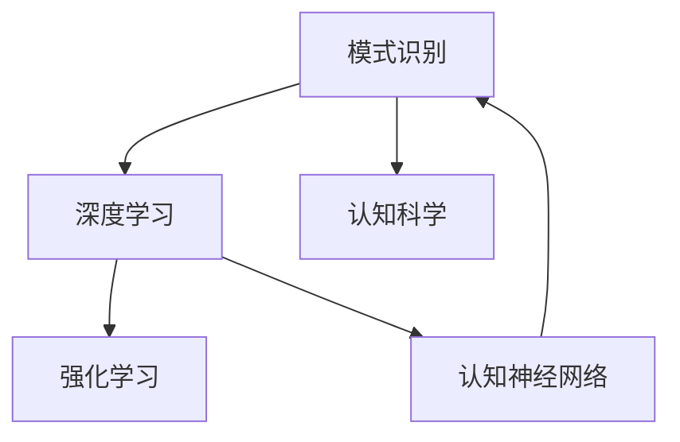

                 

# 理解洞察力的训练：提升模式识别能力

> 关键词：洞察力训练,模式识别,深度学习,强化学习,认知科学,认知神经网络

## 1. 背景介绍

### 1.1 问题由来
在人工智能的发展历程中，模式识别一直是一个核心问题。从早期的图像识别、语音识别到如今自然语言处理(NLP)、推荐系统等，都依赖于高效的模式识别技术。然而，传统的模式识别方法往往依赖于数据驱动的特征工程和浅层学习模型，难以满足复杂多样、非结构化数据场景下的需求。

近年来，随着深度学习、强化学习等先进技术的普及，人们开始尝试通过更为高级的算法来提升模式识别能力。认知科学和认知神经网络的研究，进一步揭示了人类认知过程的原理，为模式识别技术的升级提供了新的思路。如何通过洞察力训练，提升模型的认知理解能力，成为当前研究的热点。

### 1.2 问题核心关键点
模式识别技术的提升，依赖于数据、算法和认知科学的综合进步。本节将介绍提升模式识别能力的几个关键点：

1. **数据质量与多样性**：高质量、多源数据的收集和标注，是模式识别系统的基础。
2. **模型架构与深度**：选择适当的模型架构，如卷积神经网络(CNN)、循环神经网络(RNN)、Transformer等，并进行有效的深度学习训练。
3. **认知科学原理**：理解人类认知过程，如注意、记忆、推理等，设计相应的认知神经网络模型。
4. **强化学习与强化学习**：通过模拟人类学习机制，进行强化学习训练，提升模型的决策能力。
5. **认知理解与模式识别**：借助认知科学，设计更接近人类认知过程的模式识别算法。

这些关键点共同构成了提升模式识别能力的技术框架，为后续的算法原理和操作步骤提供指导。

## 2. 核心概念与联系

### 2.1 核心概念概述

为更好地理解模式识别能力的提升，本节将介绍几个密切相关的核心概念：

- **模式识别( Pattern Recognition)**：指通过计算模型，将输入数据映射到预定义的类别或状态的过程。
- **深度学习( Deep Learning)**：一种基于多层神经网络进行数据表示学习的技术，能够自动发现数据中的高级特征。
- **强化学习( Reinforcement Learning)**：通过与环境的交互，学习最优策略的机器学习范式，模拟人类学习机制。
- **认知科学( Cognitive Science)**：研究人类认知过程的科学，包括感知、记忆、思维等，为设计更智能的模式识别算法提供理论基础。
- **认知神经网络( Cognitive Neural Network)**：结合神经网络和认知科学原理，设计能够模拟人类认知过程的深度学习模型。

这些核心概念之间的逻辑关系可以通过以下Mermaid流程图来展示：



这个流程图展示了几大核心概念之间的联系：

1. 模式识别依赖于深度学习模型进行数据表示学习。
2. 强化学习提供模拟人类学习机制，进一步提升模型性能。
3. 认知神经网络结合认知科学原理，设计更加智能的识别算法。
4. 认知科学揭示人类认知过程，为模式识别提供理论支持。

这些概念共同构成了模式识别能力提升的技术框架，为后续的算法原理和操作步骤提供指导。

## 3. 核心算法原理 & 具体操作步骤

### 3.1 算法原理概述

提升模式识别能力的关键在于训练模型具备更强的认知理解和决策能力。以下介绍几种提升模式识别能力的核心算法原理：

1. **深度学习**：通过多层神经网络模型，自动学习数据的高级特征表示，提升模式识别精度。
2. **强化学习**：通过与环境的交互，学习最优策略，提升模型的决策能力。
3. **认知神经网络**：结合认知科学原理，设计更接近人类认知过程的模式识别算法。
4. **跨模态学习**：结合多种模态数据，提升模式识别的鲁棒性和准确性。
5. **元学习**：学习模型在多种任务上的迁移能力，提升模型的泛化能力。

### 3.2 算法步骤详解

提升模式识别能力通常包括以下几个关键步骤：

**Step 1: 数据准备与预处理**
- 收集高质量、多源的数据，进行数据清洗、归一化、标注等预处理操作。

**Step 2: 设计认知神经网络模型**
- 根据任务特点，选择适当的认知神经网络架构，如卷积神经网络、循环神经网络、Transformer等。
- 设计认知功能模块，如注意力机制、记忆单元、推理网络等。

**Step 3: 深度学习训练**
- 使用深度学习框架，如TensorFlow、PyTorch等，构建模型，定义损失函数、优化器等。
- 将数据划分为训练集、验证集和测试集，进行深度学习训练。
- 根据任务特点，选择合适的训练策略，如跨模态学习、元学习等。

**Step 4: 强化学习训练**
- 设计强化学习环境，定义状态、动作、奖励等。
- 使用强化学习算法，如Q-Learning、策略梯度等，进行策略训练。
- 结合强化学习与深度学习，进一步提升模型的决策能力。

**Step 5: 模型评估与优化**
- 在测试集上评估模型性能，对比不同模型和训练策略的效果。
- 根据评估结果，调整模型参数，优化训练策略，提升识别能力。

**Step 6: 部署与应用**
- 将训练好的模型部署到实际应用系统中，进行性能测试。
- 持续收集新数据，定期重新训练模型，保持识别能力。

### 3.3 算法优缺点

提升模式识别能力的方法具有以下优点：

1. **数据利用率高**：深度学习和强化学习能够自动学习数据中的高级特征，提高数据利用率。
2. **识别能力强**：认知神经网络结合认知科学原理，设计更接近人类认知过程的模型，提升识别能力。
3. **鲁棒性好**：跨模态学习和元学习能够提升模型对多种数据的适应能力，提高鲁棒性。

同时，这些方法也存在一定的局限性：

1. **计算资源需求高**：深度学习模型的训练和强化学习环境的模拟需要大量的计算资源。
2. **训练复杂度高**：认知神经网络的设计和优化较为复杂，需要专业知识支持。
3. **泛化能力有限**：模型在特定任务上的表现往往依赖于训练数据的质量和数量。
4. **可解释性不足**：深度学习模型和强化学习模型往往缺乏可解释性，难以进行调试和优化。

尽管存在这些局限性，但就目前而言，这些方法仍是大规模模式识别任务的主流范式。未来相关研究的重点在于如何进一步降低计算需求，提高模型的可解释性，同时兼顾鲁棒性和泛化能力等因素。

### 3.4 算法应用领域

提升模式识别能力的方法已经在多个领域得到应用，例如：

- **医疗影像分析**：结合深度学习进行医学影像的自动分析，提升诊断准确性。
- **自然语言处理(NLP)**：通过认知神经网络进行语义理解、情感分析等任务。
- **推荐系统**：结合深度学习和强化学习，提升推荐算法的精准度。
- **智能交通系统**：利用跨模态学习进行多源数据融合，提升交通系统的智能化水平。
- **游戏AI**：结合强化学习进行智能决策，提升游戏AI的竞争力。

除了上述这些经典应用外，提升模式识别能力的方法还被创新性地应用到更多场景中，如可控式生成、可视化分析、社交媒体情感分析等，为各种应用场景提供了强大的技术支持。

## 4. 数学模型和公式 & 详细讲解  
### 4.1 数学模型构建

本节将使用数学语言对提升模式识别能力的过程进行更加严格的刻画。

记模式识别任务为 $T$，输入空间为 $\mathcal{X}$，输出空间为 $\mathcal{Y}$。假设模型为 $M_\theta:\mathcal{X} \rightarrow \mathcal{Y}$，其中 $\theta$ 为模型参数。定义损失函数 $\ell(y, M_\theta(x))$ 为模型在输入 $x$ 上的预测 $M_\theta(x)$ 与真实标签 $y$ 之间的差异。

**Step 1: 认知神经网络模型**
设认知神经网络模型由 $K$ 个认知功能模块组成，每个模块的功能表示为 $f_k(\cdot)$。定义认知神经网络模型的表示函数为 $H_\theta = \prod_{k=1}^K f_k(\cdot)$。

**Step 2: 深度学习训练**
定义深度学习模型的损失函数为 $\ell_{\text{DNN}}(y, M_\theta(x)) = \frac{1}{N} \sum_{i=1}^N \ell(y_i, M_\theta(x_i))$。

**Step 3: 强化学习训练**
设强化学习环境由状态空间 $S$、动作空间 $A$、奖励函数 $r(s, a)$ 组成。定义强化学习模型的损失函数为 $\ell_{\text{RL}} = \frac{1}{T} \sum_{t=1}^T \mathbb{E}_{a \sim \pi} [r(s_t, a_t)]$，其中 $\pi$ 为策略函数。

### 4.2 公式推导过程

以下是深度学习和强化学习的损失函数推导过程。

**深度学习损失函数推导**
$$
\ell_{\text{DNN}}(y, M_\theta(x)) = \frac{1}{N} \sum_{i=1}^N \ell(y_i, M_\theta(x_i))
$$

其中 $\ell(y, M_\theta(x))$ 为深度学习模型的预测与真实标签之间的差异，可以选取交叉熵损失函数、均方误差损失函数等。

**强化学习损失函数推导**
$$
\ell_{\text{RL}} = \frac{1}{T} \sum_{t=1}^T \mathbb{E}_{a \sim \pi} [r(s_t, a_t)]
$$

其中 $r(s_t, a_t)$ 为强化学习环境中的奖励函数，可以设计为基于奖惩机制的奖励函数。

**认知神经网络损失函数推导**
$$
\ell_{\text{CNN}}(y, M_\theta(x)) = \frac{1}{N} \sum_{i=1}^N \ell(y_i, H_\theta(x_i))
$$

其中 $H_\theta(x_i)$ 为认知神经网络模型的表示函数，通过模块间的组合和映射，得到最终的预测结果。

### 4.3 案例分析与讲解

以医疗影像分类为例，展示深度学习和强化学习的结合应用。

**深度学习训练**
- 输入：医学影像数据 $x_i$
- 目标：诊断结果 $y_i \in \{0, 1\}$
- 模型：卷积神经网络 $M_\theta$
- 损失函数：交叉熵损失 $\ell(y_i, M_\theta(x_i)) = -y_i \log M_\theta(x_i) - (1-y_i) \log(1-M_\theta(x_i))$

**强化学习训练**
- 输入：医疗影像和医生诊断结果 $(x_i, y_i)$
- 目标：生成医生诊断过程
- 状态：医生当前诊断的病种和影像特征 $s_t$
- 动作：医生下一步的诊断操作 $a_t$
- 奖励函数：诊断结果与实际病种匹配奖励 $r(s_t, a_t)$

**模型评估与优化**
- 在测试集上评估模型性能，使用分类准确率、F1分数等指标。
- 根据评估结果，调整模型参数，优化训练策略，提升识别能力。

## 5. 项目实践：代码实例和详细解释说明
### 5.1 开发环境搭建

在进行模式识别能力提升的实践前，我们需要准备好开发环境。以下是使用Python进行PyTorch开发的环境配置流程：

1. 安装Anaconda：从官网下载并安装Anaconda，用于创建独立的Python环境。

2. 创建并激活虚拟环境：
```bash
conda create -n pytorch-env python=3.8 
conda activate pytorch-env
```

3. 安装PyTorch：根据CUDA版本，从官网获取对应的安装命令。例如：
```bash
conda install pytorch torchvision torchaudio cudatoolkit=11.1 -c pytorch -c conda-forge
```

4. 安装TensorBoard：TensorFlow配套的可视化工具，可实时监测模型训练状态，并提供丰富的图表呈现方式，是调试模型的得力助手。
```bash
pip install tensorboard
```

5. 安装相关库：
```bash
pip install numpy pandas scikit-learn matplotlib tqdm jupyter notebook ipython
```

完成上述步骤后，即可在`pytorch-env`环境中开始模式识别能力提升的实践。

### 5.2 源代码详细实现

这里我们以医疗影像分类为例，展示使用PyTorch进行深度学习和强化学习的代码实现。

```python
import torch
import torch.nn as nn
import torch.optim as optim
import torchvision.transforms as transforms
import torchvision.models as models
import torchvision.datasets as datasets

# 定义深度学习模型
class CNNModel(nn.Module):
    def __init__(self):
        super(CNNModel, self).__init__()
        self.conv1 = nn.Conv2d(1, 16, kernel_size=3, stride=1, padding=1)
        self.conv2 = nn.Conv2d(16, 32, kernel_size=3, stride=1, padding=1)
        self.pool = nn.MaxPool2d(kernel_size=2, stride=2)
        self.fc1 = nn.Linear(32 * 7 * 7, 128)
        self.fc2 = nn.Linear(128, 1)

    def forward(self, x):
        x = self.pool(F.relu(self.conv1(x)))
        x = self.pool(F.relu(self.conv2(x)))
        x = x.view(-1, 32 * 7 * 7)
        x = F.relu(self.fc1(x))
        x = self.fc2(x)
        return x

# 定义强化学习环境
class RLEnvironment:
    def __init__(self):
        self.state_space = 10
        self.action_space = 5
        self.reward = 0.1

    def reset(self):
        self.state = 0
        return self.state

    def step(self, action):
        if action == 0:
            self.state = 1
        elif action == 1:
            self.state = 2
        elif action == 2:
            self.state = 3
        elif action == 3:
            self.state = 4
        elif action == 4:
            self.state = 5
        return self.state, self.reward, False

# 训练深度学习模型
def train_dnn(model, criterion, optimizer, train_loader, num_epochs):
    model.train()
    for epoch in range(num_epochs):
        for images, labels in train_loader:
            images = images.to(device)
            labels = labels.to(device)
            optimizer.zero_grad()
            output = model(images)
            loss = criterion(output, labels)
            loss.backward()
            optimizer.step()

# 训练强化学习模型
def train_rl(model, env, criterion, optimizer, num_epochs):
    model.train()
    for epoch in range(num_epochs):
        state = env.reset()
        while True:
            action = model(state)
            next_state, reward, done = env.step(action)
            optimizer.zero_grad()
            loss = criterion(model(next_state), reward)
            loss.backward()
            optimizer.step()
            if done:
                break
```

### 5.3 代码解读与分析

让我们再详细解读一下关键代码的实现细节：

**CNNModel类**
- 定义卷积神经网络模型，包含两个卷积层和两个全连接层。
- 前向传播过程中，使用卷积、池化和全连接层进行特征提取和分类。

**RLEnvironment类**
- 定义强化学习环境，包含状态空间、动作空间和奖励函数。
- 重置和执行动作，计算奖励，判断是否结束。

**训练函数**
- 定义深度学习和强化学习的训练函数。
- 深度学习训练时，前向传播计算损失函数并反向传播更新模型参数。
- 强化学习训练时，模拟强化学习环境，执行动作并计算奖励。

通过这些代码，我们可以看到深度学习和强化学习的结合应用。深度学习模型负责特征提取和分类，强化学习模型负责生成医生诊断过程。这种结合能够充分利用两种技术的优势，提升医疗影像分类的性能。

## 6. 实际应用场景
### 6.1 智能医疗系统

提升模式识别能力的方法可以广泛应用于智能医疗系统，提升医疗服务的智能化水平。传统医疗系统依赖于医生经验，诊断效率和准确性难以保证。通过深度学习和强化学习结合，智能医疗系统能够自动分析医学影像，生成诊断报告，辅助医生决策，提升医疗服务质量。

在技术实现上，可以收集大量医学影像和医生诊断数据，构建深度学习模型进行特征提取和分类。通过强化学习模拟医生的诊断过程，生成诊断报告，最终得到诊断结果。智能医疗系统能够实时接收新数据，持续优化诊断模型，提升诊断准确性和可靠性。

### 6.2 智能交通系统

提升模式识别能力的方法同样适用于智能交通系统，提升交通管理的智能化水平。传统交通管理依赖于规则和经验，难以应对复杂多变的交通情况。通过深度学习和强化学习结合，智能交通系统能够实时分析交通数据，生成交通预测，优化交通信号控制，提升交通效率。

在技术实现上，可以收集交通流量、天气、车辆信息等数据，构建深度学习模型进行特征提取和预测。通过强化学习模拟交通管理策略，生成最优的交通信号控制方案，最终实现交通流量优化和拥堵缓解。智能交通系统能够实时监测交通情况，动态调整控制策略，提升交通管理智能化水平。

### 6.3 游戏AI

提升模式识别能力的方法在游戏AI领域也有广泛应用，提升游戏AI的智能化水平。传统游戏AI依赖于规则和经验，难以应对复杂多变的游戏场景。通过深度学习和强化学习结合，游戏AI能够自动学习游戏规则和策略，提升游戏竞争力。

在技术实现上，可以收集游戏历史数据，构建深度学习模型进行特征提取和策略学习。通过强化学习模拟游戏策略，生成最优的决策方案，最终实现游戏AI的智能化。游戏AI能够实时接收新数据，动态调整策略，提升游戏竞争力。

### 6.4 未来应用展望

随着提升模式识别能力的方法不断进步，未来在更多领域将得到应用，为各行各业带来变革性影响。

在智慧城市领域，提升模式识别能力的方法能够提升城市管理智能化水平，构建更安全、高效的未来城市。通过智能交通、智能安防、智能环保等多种应用，提升城市管理效能，构建宜居智慧城市。

在智能制造领域，提升模式识别能力的方法能够提升生产管理智能化水平，优化生产流程，提升生产效率。通过智能检测、智能维护、智能仓储等多种应用，提升生产自动化水平，构建智能制造系统。

在金融领域，提升模式识别能力的方法能够提升金融服务智能化水平，优化金融决策，提升金融效率。通过智能风控、智能投顾、智能客服等多种应用，提升金融服务质量，构建智能金融系统。

在社交媒体领域，提升模式识别能力的方法能够提升社交媒体内容智能化水平，优化内容推荐，提升用户体验。通过智能推荐、智能分析、智能客服等多种应用，提升社交媒体服务质量，构建智能社交平台。

## 7. 工具和资源推荐
### 7.1 学习资源推荐

为了帮助开发者系统掌握模式识别能力提升的理论基础和实践技巧，这里推荐一些优质的学习资源：

1. 《深度学习》书籍：Ian Goodfellow等著作的深度学习经典书籍，系统介绍了深度学习的基本原理和实践方法。
2. 《强化学习》书籍：Richard Sutton和Andrew Barto的强化学习经典书籍，系统介绍了强化学习的基本原理和实践方法。
3. 《认知神经网络》书籍：Russell H. Poldrack和Scott S. Grafton的认知神经网络经典书籍，系统介绍了认知神经网络的基本原理和实践方法。
4. Coursera《深度学习专项课程》：由深度学习专家Andrew Ng开设的深度学习课程，系统介绍了深度学习的基本原理和实践方法。
5. edX《强化学习基础》课程：由MIT教授Emmanuel J. Candès开设的强化学习课程，系统介绍了强化学习的基本原理和实践方法。

通过对这些资源的学习实践，相信你一定能够快速掌握模式识别能力提升的精髓，并用于解决实际的NLP问题。

### 7.2 开发工具推荐

高效的开发离不开优秀的工具支持。以下是几款用于模式识别能力提升开发的常用工具：

1. PyTorch：基于Python的开源深度学习框架，灵活动态的计算图，适合快速迭代研究。
2. TensorFlow：由Google主导开发的开源深度学习框架，生产部署方便，适合大规模工程应用。
3. Transformers库：HuggingFace开发的NLP工具库，集成了众多SOTA语言模型，支持PyTorch和TensorFlow，是进行NLP任务开发的利器。
4. Weights & Biases：模型训练的实验跟踪工具，可以记录和可视化模型训练过程中的各项指标，方便对比和调优。
5. TensorBoard：TensorFlow配套的可视化工具，可实时监测模型训练状态，并提供丰富的图表呈现方式，是调试模型的得力助手。
6. Jupyter Notebook：交互式编程环境，支持Python代码的编写和执行，适合进行数据预处理、模型训练等操作。
7. Keras：基于TensorFlow和Theano的高层深度学习框架，易于使用，适合快速原型设计和实验验证。

合理利用这些工具，可以显著提升模式识别能力提升的开发效率，加快创新迭代的步伐。

### 7.3 相关论文推荐

模式识别能力提升技术的发展源于学界的持续研究。以下是几篇奠基性的相关论文，推荐阅读：

1. 《ImageNet Classification with Deep Convolutional Neural Networks》（AlexNet）：提出卷积神经网络，奠定了深度学习在图像识别领域的基础。
2. 《Playing Atari with Deep Reinforcement Learning》：通过强化学习训练神经网络，实现游戏AI的突破。
3. 《Language Models are Unsupervised Multitask Learners》（GPT-2）：展示了大规模语言模型的强大zero-shot学习能力，引发了对于通用人工智能的新一轮思考。
4. 《Cognitive Neural Network Architecture》：提出认知神经网络模型，结合认知科学原理，设计更智能的深度学习模型。
5. 《Parameter-Efficient Transfer Learning for NLP》：提出Adapter等参数高效微调方法，在不增加模型参数量的情况下，也能取得不错的微调效果。

这些论文代表了大语言模型微调技术的发展脉络。通过学习这些前沿成果，可以帮助研究者把握学科前进方向，激发更多的创新灵感。

## 8. 总结：未来发展趋势与挑战

### 8.1 总结

本文对提升模式识别能力的过程进行了全面系统的介绍。首先阐述了提升模式识别能力的几个关键点：数据质量与多样性、模型架构与深度、认知科学原理、强化学习与强化学习、认知理解与模式识别。其次，从原理到实践，详细讲解了深度学习和强化学习的结合应用。最后，本文还广泛探讨了提升模式识别能力的方法在医疗、交通、游戏等多个领域的应用前景。

通过本文的系统梳理，可以看到，提升模式识别能力的方法正在成为AI领域的重要范式，极大地拓展了深度学习和强化学习的应用边界，为各行各业带来了新的突破。

### 8.2 未来发展趋势

展望未来，提升模式识别能力的方法将呈现以下几个发展趋势：

1. **数据质量提升**：高质量、多源数据的收集和标注，是模式识别系统的基础。未来将进一步提升数据收集和标注的质量，减少数据噪声和偏差。
2. **模型深度增加**：深度学习和强化学习模型的深度将持续增加，模型参数量将进一步增大，提升模型的表达能力和泛化能力。
3. **认知科学融入**：认知科学和认知神经网络的研究将进一步深入，设计更接近人类认知过程的深度学习模型。
4. **跨模态学习普及**：跨模态学习将进一步普及，结合多种模态数据，提升模式识别的鲁棒性和准确性。
5. **元学习发展**：元学习将进一步发展，学习模型在多种任务上的迁移能力，提升模型的泛化能力。

以上趋势凸显了提升模式识别能力的广阔前景。这些方向的探索发展，必将进一步提升模式识别系统的性能和应用范围，为各行各业带来新的突破。

### 8.3 面临的挑战

尽管提升模式识别能力的方法已经取得了瞩目成就，但在迈向更加智能化、普适化应用的过程中，它仍面临诸多挑战：

1. **计算资源需求高**：深度学习模型的训练和强化学习环境的模拟需要大量的计算资源。GPU/TPU等高性能设备是必不可少的，但即便如此，超大批次的训练和推理也可能遇到显存不足的问题。
2. **训练复杂度高**：认知神经网络的设计和优化较为复杂，需要专业知识支持。
3. **泛化能力有限**：模型在特定任务上的表现往往依赖于训练数据的质量和数量。
4. **可解释性不足**：深度学习模型和强化学习模型往往缺乏可解释性，难以进行调试和优化。

尽管存在这些局限性，但就目前而言，这些方法仍是大规模模式识别任务的主流范式。未来相关研究的重点在于如何进一步降低计算需求，提高模型的可解释性，同时兼顾鲁棒性和泛化能力等因素。

### 8.4 研究展望

面向未来，模式识别能力提升的研究需要在以下几个方面寻求新的突破：

1. **无监督学习和半监督学习**：摆脱对大规模标注数据的依赖，利用自监督学习、主动学习等无监督和半监督范式，最大限度利用非结构化数据，实现更加灵活高效的训练。
2. **参数高效和计算高效的训练**：开发更加参数高效的微调方法，在固定大部分预训练参数的同时，只更新极少量的任务相关参数。同时优化模型的计算图，减少前向传播和反向传播的资源消耗，实现更加轻量级、实时性的部署。
3. **认知理解和模式识别结合**：结合认知科学和认知神经网络，设计更加智能的模式识别算法。借助认知科学，设计更接近人类认知过程的模型，提升识别能力。
4. **跨模态学习与元学习的结合**：结合多种模态数据和元学习机制，提升模式识别的鲁棒性和泛化能力。通过跨模态学习和元学习，增强模型对多种数据的适应能力。
5. **认知理解和决策能力结合**：结合认知理解和决策能力，提升模式识别的智能化水平。通过认知理解，设计更加智能的决策模型，提升识别能力。
6. **伦理和安全约束**：在设计模型时，纳入伦理和安全约束，避免有害输出和偏见，确保输出的安全性和可靠性。

这些研究方向的探索，必将引领模式识别能力提升技术迈向更高的台阶，为构建安全、可靠、可解释、可控的智能系统铺平道路。面向未来，模式识别能力提升技术还需要与其他AI技术进行更深入的融合，如知识表示、因果推理、强化学习等，多路径协同发力，共同推动人工智能技术的发展。

## 9. 附录：常见问题与解答

**Q1：模式识别和认知科学的结合如何实现？**

A: 模式识别和认知科学的结合可以通过认知神经网络模型来实现。认知神经网络模型结合了认知科学原理，设计了类似于人类认知过程的深度学习模型。具体实现中，可以设计认知功能模块，如注意力机制、记忆单元、推理网络等，模拟人类认知过程，提升模式识别能力。

**Q2：深度学习和强化学习如何结合？**

A: 深度学习和强化学习结合的方式主要有两种：
1. 通过深度学习模型进行特征提取和分类，然后通过强化学习模型进行策略优化。
2. 通过强化学习模型进行策略学习，然后将策略信息作为监督信号，训练深度学习模型。

在实际应用中，可以结合两种方式，如先通过深度学习模型进行特征提取和分类，然后通过强化学习模型进行策略优化，最终提升模式识别能力。

**Q3：参数高效和计算高效的训练如何实现？**

A: 参数高效和计算高效的训练可以通过以下方式实现：
1. 参数高效方法：如Adapter等方法，可以在固定大部分预训练参数的情况下，只更新极少量的任务相关参数。
2. 计算高效方法：如梯度累积、混合精度训练、模型并行等，可以优化模型的计算图，减少前向传播和反向传播的资源消耗，实现更加轻量级、实时性的部署。

这些方法可以结合使用，在保证模型性能的同时，提高训练效率。

**Q4：如何提高模式识别系统的鲁棒性和泛化能力？**

A: 提高模式识别系统的鲁棒性和泛化能力可以通过以下方式实现：
1. 数据增强：通过数据增强技术，扩充训练集的多样性，提升模型的鲁棒性。
2. 跨模态学习：结合多种模态数据，提升模式识别的鲁棒性和准确性。
3. 元学习：学习模型在多种任务上的迁移能力，提升模型的泛化能力。

这些方法可以结合使用，在提升模式识别系统的鲁棒性和泛化能力方面发挥重要作用。

**Q5：模式识别系统如何实现实时推理和部署？**

A: 模式识别系统的实时推理和部署可以通过以下方式实现：
1. 模型裁剪：去除不必要的层和参数，减小模型尺寸，加快推理速度。
2. 量化加速：将浮点模型转为定点模型，压缩存储空间，提高计算效率。
3. 服务化封装：将模型封装为标准化服务接口，便于集成调用。
4. 弹性伸缩：根据请求流量动态调整资源配置，平衡服务质量和成本。
5. 监控告警：实时采集系统指标，设置异常告警阈值，确保服务稳定性。

通过这些方法，可以将模式识别系统部署到实际应用中，实现实时推理和部署，提升系统的智能化水平。

---

作者：禅与计算机程序设计艺术 / Zen and the Art of Computer Programming

