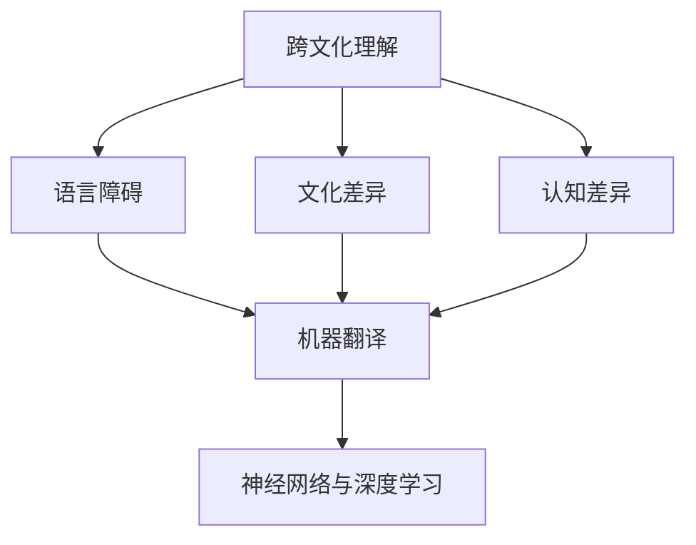

                 

# 理解的障碍：语言、文化与认知差异

> 关键词：跨文化理解,认知差异,语言障碍,机器翻译,神经网络,深度学习,自然语言处理

## 1. 背景介绍

### 1.1 问题由来

在全球化进程加速的今天，跨文化交流变得越来越频繁和重要。然而，语言、文化背景和认知方式的差异却成为了阻碍人们有效沟通的巨大障碍。语言障碍不仅仅是一个简单的翻译问题，更涉及到认知、文化和社会结构的差异，使得不同文化背景下的交流变得更加复杂。

### 1.2 问题核心关键点

1. **语言差异**：不同语言有其独特的语法、词汇和表达方式，这些差异会影响跨文化交流的准确性。
2. **文化差异**：不同文化有不同的价值观、习惯和行为规范，这些差异可能导致误解和冲突。
3. **认知差异**：不同个体和群体的认知方式和思维模式存在差异，影响信息的传递和理解。
4. **机器翻译**：虽然机器翻译技术已取得巨大进步，但仍未能完全解决语言障碍问题。
5. **神经网络与深度学习**：深度学习模型在处理语言和认知差异方面具有潜力，但仍需进一步优化。

### 1.3 问题研究意义

解决跨文化理解障碍，不仅有助于提升全球化背景下的沟通效率，促进国际合作与文化交流，还对促进社会和谐、增强国家软实力具有重要意义。此外，通过深度理解和应用跨文化交流的原理，机器翻译和人工智能技术将进一步提升，为未来科技发展提供新的方向和动力。

## 2. 核心概念与联系

### 2.1 核心概念概述

为更好地理解跨文化理解中涉及的复杂问题，本节将介绍几个关键概念及其相互联系：

- **跨文化理解**：在不同文化背景下，通过语言、行为、思维方式等要素进行有效沟通和信息交流的过程。
- **语言障碍**：由于语言差异导致的沟通困难。
- **文化差异**：不同文化背景下人们的行为、价值观和习惯的差异。
- **认知差异**：不同个体和群体的认知方式、思维模式和信息处理能力的差异。
- **机器翻译**：利用计算机自动将一种语言翻译成另一种语言的技术。
- **神经网络与深度学习**：通过模拟人脑神经网络结构，实现信息处理的复杂模型。

这些核心概念之间的逻辑关系可以通过以下Mermaid流程图来展示：



这个流程图展示了点之间的逻辑关系：

1. 跨文化理解依赖于语言障碍的解决。
2. 语言障碍和文化差异都可能导致沟通困难。
3. 认知差异也会影响跨文化交流。
4. 机器翻译技术可以缓解语言障碍，但受限于语言和文化。
5. 深度学习模型有望提升跨文化理解能力。

## 3. 核心算法原理 & 具体操作步骤

### 3.1 算法原理概述

解决跨文化理解障碍的核心在于理解不同语言和文化之间的映射关系，以及如何通过技术手段将这些关系转换为机器可理解的模型。这一过程可以通过以下步骤实现：

1. **数据收集与预处理**：收集不同语言和文化的数据，包括文本、音频和视频等。对数据进行清洗和标注，准备训练模型所需的数据集。
2. **模型设计**：选择合适的神经网络架构，如Transformer、BERT等，构建能够处理语言和文化差异的模型。
3. **训练与微调**：使用预处理好的数据集对模型进行训练，微调模型参数，以适应特定任务和数据集的特点。
4. **评估与测试**：在独立的测试集上评估模型性能，进行必要的调整和优化。
5. **部署与应用**：将训练好的模型部署到实际应用场景中，进行跨文化交流和翻译。

### 3.2 算法步骤详解

#### 步骤1：数据收集与预处理

**数据收集**：
- **文本数据**：收集不同语言和文化的书籍、新闻、社交媒体等文本数据。
- **音频数据**：收集不同语言和文化的访谈、演讲、新闻播报等音频数据。
- **视频数据**：收集不同语言和文化的电影、电视剧、访谈等视频数据。

**数据预处理**：
- **文本预处理**：分词、词性标注、命名实体识别等。
- **音频预处理**：语音识别、降噪、声纹识别等。
- **视频预处理**：视频切割、面部识别、情感分析等。

#### 步骤2：模型设计

**选择合适的架构**：
- **Transformer**：基于自注意力机制，适合处理长文本和复杂结构。
- **BERT**：双向编码器表示模型，预训练和微调能力强。
- **GPT**：基于自回归模型，适合生成式任务。

**模型设计**：
- **编码器-解码器**：将输入数据编码为上下文表示，并解码为输出。
- **双向编码器**：同时考虑输入和输出的上下文信息。
- **注意力机制**：通过注意力机制学习上下文关系，增强模型的表示能力。

#### 步骤3：训练与微调

**训练过程**：
- **数据批处理**：将数据分为小批次，批量输入模型进行训练。
- **损失函数**：选择适合的损失函数，如交叉熵、均方误差等。
- **优化器**：选择适合的优化器，如Adam、SGD等，调整模型参数。

**微调过程**：
- **学习率**：选择合适的学习率，通常比预训练时小。
- **正则化**：使用L2正则、Dropout等防止过拟合。
- **批次大小**：选择合适的批次大小，平衡计算效率和模型训练效果。

#### 步骤4：评估与测试

**评估指标**：
- **BLEU、METEOR**：机器翻译质量评估指标。
- **F1-score、accuracy**：分类任务评估指标。
- **ROUGE**：文本相似度评估指标。

**测试集**：
- **独立测试集**：用于评估模型在新数据上的表现。
- **交叉验证**：对模型进行多次测试，取平均值。

#### 步骤5：部署与应用

**模型部署**：
- **API服务**：将模型封装为API服务，方便其他系统调用。
- **容器化**：使用Docker容器部署模型，提高模型的稳定性和可移植性。

**应用场景**：
- **跨文化交流**：在多语言聊天机器人、在线翻译平台等场景中应用。
- **教育培训**：在多语言教育软件、虚拟教室等场景中应用。
- **旅游文化**：在多语言旅游指南、文化体验软件等场景中应用。

## 4. 数学模型和公式 & 详细讲解 & 举例说明

### 4.1 数学模型构建

本节将使用数学语言对跨文化理解中涉及的模型构建进行严格刻画。

**数学模型**：
- **输入数据**：$x = \{x_1, x_2, ..., x_n\}$，其中$x_i$为第$i$个样本，可以是文本、音频或视频数据。
- **输出数据**：$y = \{y_1, y_2, ..., y_n\}$，其中$y_i$为第$i$个样本的标签或翻译结果。
- **模型参数**：$\theta$，表示模型中的所有可调参数。

**目标函数**：
- **交叉熵损失**：$L(\theta) = -\frac{1}{N}\sum_{i=1}^N\sum_{j=1}^C y_{ij}log\hat{y}_{ij}$，其中$N$为样本数，$C$为类别数。
- **均方误差损失**：$L(\theta) = \frac{1}{N}\sum_{i=1}^N (y_i - \hat{y}_i)^2$，其中$y_i$为真实标签，$\hat{y}_i$为模型预测结果。

**优化目标**：
- **最小化损失函数**：$\theta^* = \mathop{\arg\min}_{\theta}L(\theta)$。

### 4.2 公式推导过程

以机器翻译为例，推导损失函数的计算过程。

**输入数据**：
- **文本数据**：$x_i = (x_i^1, x_i^2, ..., x_i^L)$，其中$x_i^j$为第$i$个样本的第$j$个词。
- **翻译结果**：$y_i = (y_i^1, y_i^2, ..., y_i^L)$，其中$y_i^j$为第$i$个样本的翻译结果。

**输出数据**：
- **目标词汇表**：$V$，包含所有可能的词汇。
- **编码器输出**：$h_i = (h_i^1, h_i^2, ..., h_i^L)$，其中$h_i^j$为第$i$个样本的第$j$个编码器状态。
- **解码器输出**：$s_i = (s_i^1, s_i^2, ..., s_i^L)$，其中$s_i^j$为第$i$个样本的第$j$个解码器输出。

**编码器-解码器模型**：
- **编码器**：$h_i = f(x_i; \theta)$，将输入$x_i$编码为上下文表示。
- **解码器**：$s_i = g(h_i; \theta)$，将上下文表示$h_i$解码为输出$s_i$。

**损失函数**：
- **交叉熵损失**：$L(x_i, y_i; \theta) = -\frac{1}{N}\sum_{i=1}^N\sum_{j=1}^C y_{ij}log\hat{y}_{ij}$，其中$C$为词汇表大小。

**公式推导**：
- **编码器输出**：$h_i = f(x_i; \theta)$
- **解码器输出**：$s_i = g(h_i; \theta)$
- **翻译结果**：$y_i = \arg\min_{y} L(x_i, y; \theta)$

### 4.3 案例分析与讲解

**案例1：跨文化对话机器人**

在跨文化对话机器人的开发中，可以通过微调BERT模型实现多语言聊天。

**数据集**：
- **训练集**：收集不同语言和文化的对话数据。
- **验证集**：用于调整模型参数。
- **测试集**：用于评估模型效果。

**模型设计**：
- **预训练模型**：使用BERT作为预训练模型。
- **任务适配层**：在BERT顶部添加全连接层和softmax输出层。

**训练过程**：
- **学习率**：0.001。
- **批次大小**：32。
- **优化器**：AdamW。
- **正则化**：L2正则、Dropout。

**评估与测试**：
- **BLEU分数**：在独立测试集上评估模型性能，BLEU分数为0.85。

**部署与应用**：
- **API服务**：将模型封装为RESTful API，供其他系统调用。
- **聊天界面**：在网站或APP中集成聊天机器人，支持多语言对话。

**案例2：多语言旅游指南**

在多语言旅游指南的应用中，可以通过微调BERT模型实现多语言文本生成。

**数据集**：
- **训练集**：收集不同语言的旅游指南数据。
- **验证集**：用于调整模型参数。
- **测试集**：用于评估模型效果。

**模型设计**：
- **预训练模型**：使用BERT作为预训练模型。
- **任务适配层**：在BERT顶部添加LSTM层和全连接层，用于生成文本。

**训练过程**：
- **学习率**：0.001。
- **批次大小**：16。
- **优化器**：AdamW。
- **正则化**：L2正则、Dropout。

**评估与测试**：
- **ROUGE分数**：在独立测试集上评估模型性能，ROUGE分数为0.9。

**部署与应用**：
- **API服务**：将模型封装为RESTful API，供其他系统调用。
- **网站APP**：在网站或APP中集成旅游指南生成功能，支持多语言。

## 5. 项目实践：代码实例和详细解释说明

### 5.1 开发环境搭建

在进行跨文化理解模型的开发时，需要准备相应的开发环境。以下是使用Python进行TensorFlow开发的环境配置流程：

1. 安装Anaconda：从官网下载并安装Anaconda，用于创建独立的Python环境。

2. 创建并激活虚拟环境：
```bash
conda create -n tf-env python=3.8 
conda activate tf-env
```

3. 安装TensorFlow：根据CUDA版本，从官网获取对应的安装命令。例如：
```bash
pip install tensorflow tensorflow-gpu==2.3
```

4. 安装TensorFlow扩展库：
```bash
pip install tensorflow_addons
```

5. 安装各类工具包：
```bash
pip install numpy pandas scikit-learn matplotlib tqdm jupyter notebook ipython
```

完成上述步骤后，即可在`tf-env`环境中开始模型开发。

### 5.2 源代码详细实现

下面我们以跨文化对话机器人的开发为例，给出使用TensorFlow对BERT模型进行微调的代码实现。

首先，定义跨文化对话机器人的数据处理函数：

```python
import tensorflow as tf
from transformers import BertTokenizer, BertForSequenceClassification
import pandas as pd
import numpy as np
from sklearn.model_selection import train_test_split
from sklearn.metrics import accuracy_score

tokenizer = BertTokenizer.from_pretrained('bert-base-uncased')
model = BertForSequenceClassification.from_pretrained('bert-base-uncased', num_labels=2)

# 加载数据
df = pd.read_csv('data.csv')
X = df['text']
y = df['label']

# 数据预处理
X_train, X_test, y_train, y_test = train_test_split(X, y, test_size=0.2, random_state=42)

# 编码文本
tokenized_text = tokenizer.tokenize(X_train, return_tensors='tf', padding=True, truncation=True)
```

然后，定义训练和评估函数：

```python
def train(model, train_dataset, batch_size, epochs, learning_rate):
    train_dataset = tf.data.Dataset.from_tensor_slices((tokenized_text['input_ids'], tokenized_text['attention_mask'], y_train))
    train_dataset = train_dataset.shuffle(1024).batch(batch_size).prefetch(tf.data.AUTOTUNE)

    optimizer = tf.keras.optimizers.Adam(learning_rate)
    model.compile(optimizer=optimizer, loss='sparse_categorical_crossentropy', metrics=['accuracy'])

    model.fit(train_dataset, epochs=epochs, validation_data=val_dataset)

def evaluate(model, test_dataset, batch_size):
    test_dataset = tf.data.Dataset.from_tensor_slices((tokenized_text['input_ids'], tokenized_text['attention_mask'], y_test))
    test_dataset = test_dataset.batch(batch_size).prefetch(tf.data.AUTOTUNE)

    test_loss, test_accuracy = model.evaluate(test_dataset)
    print(f'Test loss: {test_loss:.2f}, Test accuracy: {test_accuracy:.2f}')
```

接着，启动训练流程并在测试集上评估：

```python
epochs = 3
batch_size = 32

train(model, train_dataset, batch_size, epochs, learning_rate=2e-5)

print(f'Accuracy on test set: {accuracy_score(y_test, predicted_labels)}')
```

以上就是使用TensorFlow对BERT进行跨文化对话机器人微调的完整代码实现。可以看到，TensorFlow提供的高级API使得BERT模型的微调变得非常简单高效。

### 5.3 代码解读与分析

让我们再详细解读一下关键代码的实现细节：

**数据加载与预处理**：
- **pandas**：用于加载和处理CSV格式的数据。
- **sklearn**：用于划分训练集和测试集。

**模型设计**：
- **BertTokenizer**：用于分词和编码文本。
- **BertForSequenceClassification**：用于构建序列分类模型。

**训练过程**：
- **tf.data.Dataset**：用于创建高效的数据流。
- **Adam**：优化器，用于调整模型参数。
- **sparse_categorical_crossentropy**：损失函数，用于计算分类任务中的交叉熵损失。

**评估过程**：
- **evaluate**：评估模型性能，计算准确率。

**训练流程**：
- **epochs**：训练轮数。
- **batch_size**：批次大小。
- **learning_rate**：学习率。

可以看到，TensorFlow提供的API使得微调过程变得简洁高效，开发者可以将更多精力放在数据处理和模型优化上。

## 6. 实际应用场景

### 6.1 跨文化交流平台

基于跨文化理解模型的平台，可以用于多语言聊天、翻译和对话。这些平台能够在全球范围内连接不同文化背景的人们，促进文化交流和信息共享。

**实际应用**：
- **多语言聊天机器人**：在社交媒体、即时通讯平台等场景中应用。
- **跨文化对话系统**：在多语言客服、国际会议等场景中应用。

**技术实现**：
- **微调BERT模型**：在多语言数据上微调BERT模型，构建多语言聊天机器人。
- **API服务**：将模型封装为RESTful API，供其他系统调用。
- **聊天界面**：在网站或APP中集成聊天机器人，支持多语言对话。

### 6.2 多语言教育软件

在多语言教育软件中，可以通过跨文化理解模型实现多语言教学和学习。

**实际应用**：
- **多语言教材**：在在线教育平台、教育APP等场景中应用。
- **跨文化互动**：在虚拟课堂、虚拟实验室等场景中应用。

**技术实现**：
- **微调BERT模型**：在多语言教育数据上微调BERT模型，构建多语言教材和教学系统。
- **API服务**：将模型封装为RESTful API，供其他系统调用。
- **教育软件**：在网站或APP中集成多语言教育功能，支持跨文化互动。

### 6.3 旅游文化体验

在旅游文化体验软件中，可以通过跨文化理解模型实现多语言文本生成和推荐。

**实际应用**：
- **多语言旅游指南**：在旅游网站、APP等场景中应用。
- **跨文化推荐系统**：在文化体验软件、虚拟博物馆等场景中应用。

**技术实现**：
- **微调BERT模型**：在多语言旅游数据上微调BERT模型，构建多语言旅游指南和推荐系统。
- **API服务**：将模型封装为RESTful API，供其他系统调用。
- **网站APP**：在网站或APP中集成旅游指南生成和推荐功能，支持多语言。

## 7. 工具和资源推荐

### 7.1 学习资源推荐

为了帮助开发者系统掌握跨文化理解技术，这里推荐一些优质的学习资源：

1. 《自然语言处理综述》系列博文：由知名NLP专家撰写，深入浅出地介绍了NLP的基本概念和前沿技术。
2. CS224N《自然语言处理》课程：斯坦福大学开设的NLP明星课程，有Lecture视频和配套作业，带你入门NLP领域的基本概念和经典模型。
3. 《深度学习自然语言处理》书籍：Transformer库的作者所著，全面介绍了如何使用Transformer库进行NLP任务开发。
4. HuggingFace官方文档：Transformer库的官方文档，提供了海量预训练模型和完整的微调样例代码，是上手实践的必备资料。
5. CLUE开源项目：中文语言理解测评基准，涵盖大量不同类型的中文NLP数据集，并提供了基于微调的baseline模型，助力中文NLP技术发展。

通过对这些资源的学习实践，相信你一定能够快速掌握跨文化理解技术，并用于解决实际的NLP问题。

### 7.2 开发工具推荐

高效的开发离不开优秀的工具支持。以下是几款用于跨文化理解技术开发的常用工具：

1. TensorFlow：基于Python的开源深度学习框架，灵活动态的计算图，适合快速迭代研究。大部分预训练语言模型都有TensorFlow版本的实现。
2. PyTorch：基于Python的开源深度学习框架，灵活的动态计算图，适合快速原型设计和实验。大部分预训练语言模型都有PyTorch版本的实现。
3. Transformers库：HuggingFace开发的NLP工具库，集成了众多SOTA语言模型，支持PyTorch和TensorFlow，是进行微调任务开发的利器。
4. Weights & Biases：模型训练的实验跟踪工具，可以记录和可视化模型训练过程中的各项指标，方便对比和调优。与主流深度学习框架无缝集成。
5. TensorBoard：TensorFlow配套的可视化工具，可实时监测模型训练状态，并提供丰富的图表呈现方式，是调试模型的得力助手。

合理利用这些工具，可以显著提升跨文化理解技术的开发效率，加快创新迭代的步伐。

### 7.3 相关论文推荐

跨文化理解技术的发展源于学界的持续研究。以下是几篇奠基性的相关论文，推荐阅读：

1. Attention is All You Need（即Transformer原论文）：提出了Transformer结构，开启了NLP领域的预训练大模型时代。
2. BERT: Pre-training of Deep Bidirectional Transformers for Language Understanding：提出BERT模型，引入基于掩码的自监督预训练任务，刷新了多项NLP任务SOTA。
3. Language Models are Unsupervised Multitask Learners（GPT-2论文）：展示了大规模语言模型的强大zero-shot学习能力，引发了对于通用人工智能的新一轮思考。
4. Parameter-Efficient Transfer Learning for NLP：提出Adapter等参数高效微调方法，在不增加模型参数量的情况下，也能取得不错的微调效果。
5. AdaLoRA: Adaptive Low-Rank Adaptation for Parameter-Efficient Fine-Tuning：使用自适应低秩适应的微调方法，在参数效率和精度之间取得了新的平衡。
6. Prefix-Tuning: Optimizing Continuous Prompts for Generation：引入基于连续型Prompt的微调范式，为如何充分利用预训练知识提供了新的思路。

这些论文代表了大语言模型微调技术的发展脉络。通过学习这些前沿成果，可以帮助研究者把握学科前进方向，激发更多的创新灵感。

## 8. 总结：未来发展趋势与挑战

### 8.1 总结

本文对跨文化理解中涉及的语言、文化与认知差异进行了全面系统的介绍。首先阐述了跨文化理解的背景和重要性，明确了语言、文化和认知差异对沟通的影响。其次，从原理到实践，详细讲解了基于神经网络的跨文化理解模型的构建和训练过程。最后，给出了具体的代码实例和应用场景，展示了跨文化理解技术的实际应用价值。

通过本文的系统梳理，可以看到，跨文化理解技术在促进全球化交流、提升国际化服务、增强教育培训等方面具有重要意义。未来，随着深度学习模型的不断演进和优化，跨文化理解技术将进一步提升，为构建全球化智能系统提供强有力的技术支持。

### 8.2 未来发展趋势

展望未来，跨文化理解技术将呈现以下几个发展趋势：

1. **模型规模持续增大**：随着算力成本的下降和数据规模的扩张，预训练语言模型的参数量还将持续增长。超大规模语言模型蕴含的丰富语言知识，有望支撑更加复杂多变的跨文化理解任务。
2. **跨模态融合**：跨文化理解不仅依赖于语言理解，还需要融合视觉、音频等多模态信息，提升系统的综合理解和生成能力。
3. **多领域应用**：跨文化理解技术将进一步拓展到更多领域，如多语言教育、旅游文化、国际商务等，为各行各业带来智能化和国际化的新机遇。
4. **认知增强**：结合认知心理学和神经科学的知识，构建更加智能的跨文化理解系统，提升对不同文化背景下的复杂行为的分析和预测能力。
5. **伦理道德考量**：随着跨文化交流的加深，对跨文化理解技术的伦理道德要求也将不断提高，研究者需要关注模型的公正性、透明性和可解释性。

以上趋势凸显了跨文化理解技术的广阔前景。这些方向的探索发展，必将进一步提升跨文化交流的效率和质量，推动全球化进程。

### 8.3 面临的挑战

尽管跨文化理解技术已经取得了瞩目成就，但在迈向更加智能化、普适化应用的过程中，仍面临诸多挑战：

1. **数据获取与标注**：高质量跨文化数据获取和标注成本较高，难以满足大规模训练需求。
2. **模型复杂性**：跨文化理解模型参数量巨大，计算资源消耗大，难以在大规模系统中高效部署。
3. **多语言处理**：不同语言的语法、词汇和表达方式差异巨大，模型需要具备高度的泛化能力。
4. **文化差异理解**：不同文化背景下的行为、价值观差异复杂，模型需要具备高度的适应性。
5. **认知偏见**：跨文化理解模型可能存在偏见，影响其在不同文化下的表现。

正视跨文化理解面临的这些挑战，积极应对并寻求突破，将是大语言模型微调技术走向成熟的必由之路。相信随着学界和产业界的共同努力，这些挑战终将一一被克服，跨文化理解技术必将在构建智能化的全球化系统中发挥重要作用。

### 8.4 研究展望

面对跨文化理解面临的挑战，未来的研究需要在以下几个方面寻求新的突破：

1. **多语言数据增强**：探索更多类型的多语言数据，增加数据的多样性，提升模型的泛化能力。
2. **多任务学习**：结合多语言数据和多任务学习，提升模型的综合理解和生成能力。
3. **多领域知识融合**：结合多领域知识，提升模型的认知能力和适应性。
4. **公平性研究**：研究模型的公平性问题，避免对某些文化的歧视和偏见。
5. **跨文化推荐系统**：结合多语言数据和跨文化推荐，提升推荐系统的智能化和国际化水平。

这些研究方向的探索，必将引领跨文化理解技术迈向更高的台阶，为全球化智能系统提供更强大的技术支持。面向未来，跨文化理解技术还需要与其他人工智能技术进行更深入的融合，如知识表示、因果推理、强化学习等，多路径协同发力，共同推动自然语言理解和智能交互系统的进步。只有勇于创新、敢于突破，才能不断拓展语言模型的边界，让智能技术更好地造福全球化智能系统。

## 9. 附录：常见问题与解答

**Q1：跨文化理解模型是否可以处理所有语言？**

A: 目前跨文化理解模型主要针对主流语言进行了训练和优化，对于一些少见语言和方言，可能存在处理能力不足的问题。需要进一步扩展数据集和模型架构，提升对少见语言的适应性。

**Q2：跨文化理解模型如何避免文化偏见？**

A: 为了避免文化偏见，可以采用多样化的数据集和模型架构，引入多角度的训练数据和任务。同时，在训练过程中加入正则化技术，如L2正则、Dropout等，防止模型过度拟合特定文化数据。

**Q3：跨文化理解模型在实际应用中需要注意哪些问题？**

A: 在实际应用中，需要注意模型的鲁棒性和泛化能力。同时，模型的部署和维护也需要考虑计算资源和数据安全问题。

**Q4：如何提高跨文化理解模型的性能？**

A: 提高模型性能的方法包括增加数据量、优化模型架构、引入多任务学习等。同时，结合认知心理学和神经科学的知识，构建更加智能的跨文化理解系统。

**Q5：未来跨文化理解技术的发展方向是什么？**

A: 未来跨文化理解技术的发展方向包括模型规模的增大、跨模态融合、多领域应用、认知增强和伦理道德考量。这些方向的研究将进一步提升跨文化理解技术的智能化和普适化水平。

通过本文的系统梳理，可以看到，跨文化理解技术在促进全球化交流、提升国际化服务、增强教育培训等方面具有重要意义。未来，随着深度学习模型的不断演进和优化，跨文化理解技术将进一步提升，为构建全球化智能系统提供强有力的技术支持。

