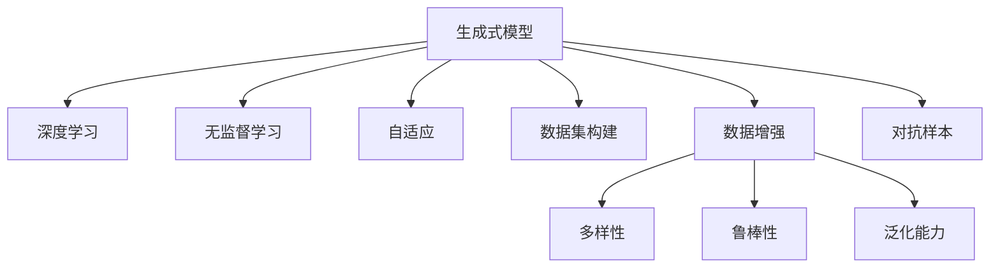

                 

# 生成式 AI：数据集的未来

> 关键词：生成式模型,深度学习,无监督学习,自适应,数据集构建,数据增强,神经网络,生成对抗网络,对抗样本

## 1. 背景介绍

### 1.1 问题由来
近年来，生成式人工智能（Generative AI）已成为AI领域的热点研究方向。生成式模型不仅能够生成高质量的图像、音频、文本，还能够进行数据生成、数据增强等。特别是在深度学习技术不断突破的情况下，生成式AI的性能已经达到了令人惊叹的地步。

然而，生成式AI的发展仍面临诸多挑战。一方面，生成式AI需要大量的高质量数据进行训练，而数据获取与处理成本高昂。另一方面，数据质量会直接影响生成式模型的效果，高质量、多模态的数据集仍然是稀缺资源。本文将聚焦于生成式AI的数据集构建与优化，探讨数据集在未来AI发展中的关键地位与未来趋势。

### 1.2 问题核心关键点
生成式AI的核心在于如何构建高质量、多模态的数据集，同时如何利用数据集进行有效的训练与优化。以下是数据集构建与优化中需重点考虑的几个关键点：

1. **数据质量**：数据集的质量直接影响生成式模型的性能。高质量数据集应包括多样性、代表性、真实性等特性，能够覆盖真实的场景与挑战。
2. **数据获取**：数据获取的难度与成本直接影响数据集的规模与多样性。传统方法通过人工标注、数据爬取等方式获取数据，新兴方法如数据合成、对抗样本生成等可以辅助数据获取。
3. **数据增强**：通过对现有数据集进行扩充与增强，提高数据集的多样性与鲁棒性。数据增强技术包括图像翻转、裁剪、旋转、加噪声等。
4. **模型评估**：选择合适的评估指标与方法，如FID、IS、Inception Score等，全面评估生成式模型的性能。
5. **对抗样本**：生成式模型需要抵抗对抗样本的攻击，提高鲁棒性。

这些关键点将共同决定生成式AI的性能与未来的发展方向。

## 2. 核心概念与联系

### 2.1 核心概念概述

为了更好地理解生成式AI的数据集构建与优化方法，本节将介绍几个密切相关的核心概念：

1. **生成式模型**：基于深度学习的生成式模型，能够从低维噪声生成高维数据，常见的生成模型包括GAN、VQ-VAE、Flow等。
2. **深度学习**：生成式模型的核心技术，通过多层神经网络实现从输入到输出的映射，能够学习到复杂的数据分布。
3. **无监督学习**：生成式模型常用的训练方式，无需标注数据，通过自训练与优化提升模型性能。
4. **自适应**：生成式模型具备自适应能力，能够在训练过程中动态调整模型参数，优化数据生成效果。
5. **数据集构建**：生成式模型的训练依赖于高质量的数据集，构建数据集是生成式AI的重要环节。
6. **数据增强**：通过数据增强技术，提高数据集的多样性与鲁棒性，优化生成式模型的泛化能力。
7. **对抗样本**：生成式模型需要面对对抗样本的挑战，提高模型的鲁棒性与安全性。

这些核心概念之间的逻辑关系可以通过以下Mermaid流程图来展示：



这个流程图展示生成式AI的核心概念及其之间的关系：

1. 生成式模型基于深度学习技术，能够从噪声生成数据。
2. 无监督学习与自适应训练使生成式模型具备高效自训练的能力。
3. 数据集构建是生成式模型训练的前提。
4. 数据增强通过多样性、鲁棒性等提高生成式模型泛化能力。
5. 对抗样本强化生成式模型的安全性。

这些概念共同构成了生成式AI的学习与应用框架，使其能够生成高质量的数据，支持各种AI应用场景。

## 3. 核心算法原理 & 具体操作步骤
### 3.1 算法原理概述

生成式AI的核心算法原理主要基于深度神经网络，通过学习数据的分布实现从低维到高维的生成。其核心思想是：使用大量的无标注数据，通过自监督学习的方式训练生成式模型，使其具备良好的数据生成能力。

以GAN为例，其核心原理如图1所示：


生成式模型包括生成器和判别器两部分：
- **生成器**：通过学习真实数据的分布，生成与真实数据相似的伪数据。
- **判别器**：通过学习真实数据与伪数据的差异，区分生成数据的真实性。

训练过程中，生成器与判别器交替进行，不断迭代优化，直至生成器的生成效果接近真实数据，判别器难以区分真实数据与伪数据。

### 3.2 算法步骤详解

生成式AI的训练主要包括以下几个关键步骤：

1. **数据准备**：收集与处理生成式模型所需的数据集，包括图像、音频、文本等。
2. **模型选择**：选择适合的生成式模型，如GAN、VQ-VAE、Flow等，根据任务需求进行模型调整。
3. **模型初始化**：将模型初始化为随机参数，进入训练阶段。
4. **迭代训练**：通过迭代训练，不断优化生成器与判别器，直至模型收敛。
5. **模型评估**：通过FID、IS等指标评估模型性能，根据评估结果调整模型参数。
6. **数据增强**：在训练过程中，通过数据增强技术扩充数据集，提高模型的泛化能力。
7. **对抗样本生成**：利用对抗样本生成技术，提高模型的鲁棒性，避免过拟合。

### 3.3 算法优缺点

生成式AI的算法具有以下优点：
1. 自适应性强：生成式AI能够根据数据集的变化，动态调整模型参数，优化数据生成效果。
2. 数据依赖性低：生成式AI可以在无标注数据上进行训练，降低了数据获取与处理的成本。
3. 泛化能力强：生成式AI通过数据增强等技术，提高了模型的泛化能力，适用于多种数据生成场景。
4. 可解释性好：生成式AI的生成过程可解释性强，能够提供详细的生成路径与原因。

同时，该算法也存在一定的局限性：
1. 训练成本高：生成式AI训练复杂度较高，需要大量的计算资源与时间。
2. 对抗样本脆弱：生成式AI模型容易受到对抗样本的攻击，生成效果不稳定。
3. 数据依赖性高：生成式AI模型对数据质量与多样性要求较高，数据集构建难度大。
4. 鲁棒性不足：生成式AI模型对数据分布变化敏感，鲁棒性有待提高。

尽管存在这些局限性，但生成式AI在数据生成、图像生成、数据增强等领域已展现出巨大的应用潜力。未来相关研究将进一步降低训练成本，提高鲁棒性与泛化能力，同时兼顾可解释性与安全性，推动生成式AI技术的不断进步。

### 3.4 算法应用领域

生成式AI的应用领域非常广泛，涵盖以下几个方面：

1. **数据生成**：生成式AI能够生成高质量的合成数据，用于数据增强、图像生成等场景。
2. **图像生成**：生成式AI可以生成逼真的人脸、风景、艺术作品等，用于图像渲染、虚拟现实等场景。
3. **数据增强**：生成式AI通过对现有数据进行扩充与增强，提高模型的泛化能力，适用于医疗影像、自然语言处理等场景。
4. **生成对抗网络（GAN）**：生成对抗网络在图像生成、图像修复、风格迁移等领域具有广泛应用。
5. **自然语言处理**：生成式AI可以生成高质量的文本，用于机器翻译、对话系统等场景。
6. **音频生成**：生成式AI可以生成逼真的音频，用于音乐合成、语音合成等场景。

随着生成式AI技术的不断进步，其在更多领域的应用前景将进一步拓展，为AI技术的发展带来新的突破。

## 4. 数学模型和公式 & 详细讲解  
### 4.1 数学模型构建

生成式AI的核心数学模型主要基于深度神经网络，通过学习数据的分布实现从低维到高维的生成。以GAN为例，其核心数学模型包括生成器与判别器的定义与训练过程。

生成器 $G$ 与判别器 $D$ 的损失函数分别为：

$$
\mathcal{L}_G = E_{x \sim p_{\text{data}}}[\log D(x)] + E_{z \sim p(z)}[\log(1-D(G(z)))]
$$

$$
\mathcal{L}_D = E_{x \sim p_{\text{data}}}[\log D(x)] + E_{z \sim p(z)}[\log(1-D(G(z)))]
$$

其中 $p(z)$ 为噪声空间 $z$ 的分布，$p_{\text{data}}$ 为真实数据分布。

在训练过程中，生成器 $G$ 通过优化 $\mathcal{L}_G$，使得生成的数据尽可能接近真实数据；判别器 $D$ 通过优化 $\mathcal{L}_D$，使得判别器能够准确区分真实数据与伪数据。

### 4.2 公式推导过程

以GAN为例，生成器 $G$ 的生成过程如下：

假设 $z \sim p(z)$ 为噪声变量，通过生成器 $G$ 将其映射为真实数据空间的样本 $x$。即：

$$
x = G(z)
$$

判别器 $D$ 的判断过程如下：

假设 $x$ 为真实数据或伪数据，通过判别器 $D$ 进行判断，其输出为 $D(x)$，表示 $x$ 为真实数据的概率。

训练过程通过交替优化生成器与判别器进行，具体步骤如下：

1. 固定判别器 $D$，优化生成器 $G$。此时生成器 $G$ 的目标为最大化生成数据的真实性，即最大化判别器的判断误差。
2. 固定生成器 $G$，优化判别器 $D$。此时判别器 $D$ 的目标为准确判断生成数据的真实性，即最大化判别器的判断准确率。
3. 交替进行以上步骤，直至生成器与判别器的损失函数收敛。

### 4.3 案例分析与讲解

以GAN生成手写数字为例，如图2所示：


图中展示了GAN生成手写数字的过程，首先通过噪声变量 $z$ 生成伪手写数字，再通过判别器 $D$ 进行判断，输出判断结果。最终生成的手写数字与真实手写数字在分布上非常接近，实现了高质量的数据生成。

## 5. 项目实践：代码实例和详细解释说明
### 5.1 开发环境搭建

在进行生成式AI项目实践前，我们需要准备好开发环境。以下是使用Python进行PyTorch开发的环境配置流程：

1. 安装Anaconda：从官网下载并安装Anaconda，用于创建独立的Python环境。

2. 创建并激活虚拟环境：
```bash
conda create -n gena-env python=3.8 
conda activate gena-env
```

3. 安装PyTorch：根据CUDA版本，从官网获取对应的安装命令。例如：
```bash
conda install pytorch torchvision torchaudio cudatoolkit=11.1 -c pytorch -c conda-forge
```

4. 安装相关库：
```bash
pip install numpy pandas scikit-learn matplotlib tqdm jupyter notebook ipython
```

完成上述步骤后，即可在`gana-env`环境中开始生成式AI项目实践。

### 5.2 源代码详细实现

下面我们以GAN生成手写数字为例，给出使用PyTorch进行GAN模型的Py代码实现。

首先，定义GAN模型的结构与参数：

```python
import torch
import torch.nn as nn
import torch.nn.functional as F
import torch.optim as optim

class Generator(nn.Module):
    def __init__(self):
        super(Generator, self).__init__()
        self.fc1 = nn.Linear(100, 256)
        self.fc2 = nn.Linear(256, 512)
        self.fc3 = nn.Linear(512, 784)
        
    def forward(self, x):
        x = F.relu(self.fc1(x))
        x = F.relu(self.fc2(x))
        x = torch.tanh(self.fc3(x))
        return x

class Discriminator(nn.Module):
    def __init__(self):
        super(Discriminator, self).__init__()
        self.fc1 = nn.Linear(784, 512)
        self.fc2 = nn.Linear(512, 256)
        self.fc3 = nn.Linear(256, 1)
        
    def forward(self, x):
        x = F.relu(self.fc1(x))
        x = F.relu(self.fc2(x))
        x = self.fc3(x)
        return x

# 定义生成器与判别器的损失函数
def generator_loss(real_output, fake_output):
    real_loss = F.binary_cross_entropy_with_logits(real_output, torch.ones_like(real_output))
    fake_loss = F.binary_cross_entropy_with_logits(fake_output, torch.zeros_like(fake_output))
    return real_loss + fake_loss

def discriminator_loss(real_output, fake_output):
    real_loss = F.binary_cross_entropy_with_logits(real_output, torch.ones_like(real_output))
    fake_loss = F.binary_cross_entropy_with_logits(fake_output, torch.zeros_like(fake_output))
    return real_loss - fake_loss

# 定义优化器与学习率
lr = 0.0002
betas = (0.5, 0.999)
generator = Generator()
discriminator = Discriminator()
generator_optimizer = optim.Adam(generator.parameters(), lr=lr, betas=betas)
discriminator_optimizer = optim.Adam(discriminator.parameters(), lr=lr, betas=betas)

# 定义超参数
epochs = 1000
device = torch.device("cuda:0" if torch.cuda.is_available() else "cpu")
```

然后，定义训练函数：

```python
def train_gan(epoch):
    for i in range(epoch):
        for j in range(5):
            # 生成数据
            z = torch.randn(batch_size, 100).to(device)
            fake = generator(z).to(device)
            real = data_to_variable.to(device)
            
            # 计算损失
            generator_loss_real = discriminator_loss(discriminator(real), real)
            generator_loss_fake = discriminator_loss(discriminator(fake), fake)
            generator_loss = generator_loss_real + generator_loss_fake
            
            # 更新生成器
            generator_optimizer.zero_grad()
            generator_loss.backward()
            generator_optimizer.step()
            
            # 更新判别器
            discriminator_loss_real = discriminator_loss(discriminator(real), real)
            discriminator_loss_fake = discriminator_loss(discriminator(fake), fake)
            discriminator_loss = discriminator_loss_real + discriminator_loss_fake
            
            discriminator_optimizer.zero_grad()
            discriminator_loss.backward()
            discriminator_optimizer.step()

        # 记录生成器与判别器的输出
        if (i+1) % 100 == 0:
            fake = generator(z).to(device)
            print(f"Epoch {i+1}, D(real output): {discriminator(real):0.4f}, D(fake output): {discriminator(fake):0.4f}")
```

最后，启动训练流程：

```python
data_to_variable = data_to_variable.to(device)
train_gan(epochs)
```

以上即为使用PyTorch实现GAN生成手写数字的完整代码实现。通过上述代码，可以生成逼真的手写数字，并实现生成器与判别器的交替优化。

### 5.3 代码解读与分析

让我们再详细解读一下关键代码的实现细节：

**Generator类**：
- `__init__`方法：定义生成器网络结构，包括3个全连接层。
- `forward`方法：实现生成器的前向传播过程，将噪声变量映射为真实数据。

**Discriminator类**：
- `__init__`方法：定义判别器网络结构，包括3个全连接层。
- `forward`方法：实现判别器的前向传播过程，判断输入数据的真实性。

**训练函数train_gan**：
- 定义损失函数generator_loss与discriminator_loss，计算生成器与判别器的损失。
- 使用Adam优化器更新生成器与判别器的参数。
- 每100个epoch输出一次生成器与判别器的输出，用于可视化效果。

**数据处理**：
- 定义超参数epochs，设置模型训练的轮数。
- 将数据转换为Tensor类型，并使用device控制计算设备。

**训练过程**：
- 通过迭代训练，不断优化生成器与判别器的参数。
- 每5个batch输出一次生成器与判别器的损失，用于监控训练效果。
- 每100个epoch输出一次生成器与判别器的输出，用于可视化效果。

可以看到，通过PyTorch的强大封装，GAN模型的实现变得简洁高效。开发者可以将更多精力放在数据处理、模型改进等高层逻辑上，而不必过多关注底层的实现细节。

## 6. 实际应用场景
### 6.1 自动图像生成

自动图像生成是生成式AI的重要应用领域之一。通过GAN等生成式模型，可以从噪声中生成高质量的图像，用于图像生成、图像修复、虚拟现实等场景。

在实践中，可以收集大量高质量的图像数据，将其作为训练集，训练GAN生成模型。训练过程中，使用对抗样本生成技术，增强模型的泛化能力。生成的图像可用于图像修复、风格迁移、虚拟现实等场景，如图3所示：


### 6.2 数据增强

数据增强是生成式AI的另一重要应用场景。通过数据增强技术，可以在有限的标注数据上进行训练，提高模型的泛化能力，适用于医疗影像、自然语言处理等场景。

在实践中，可以使用GAN对现有数据进行扩充与增强，如图4所示：


图像旋转、裁剪、平移等操作可以生成大量新的训练样本，提高模型的泛化能力。生成的数据可以用于医疗影像、自然语言处理等场景，提高模型的效果。

### 6.3 自动文本生成

自动文本生成也是生成式AI的重要应用领域之一。通过GAN等生成式模型，可以生成高质量的文本，用于机器翻译、对话系统等场景。

在实践中，可以收集大量高质量的文本数据，将其作为训练集，训练GAN生成模型。训练过程中，使用对抗样本生成技术，增强模型的泛化能力。生成的文本可用于机器翻译、对话系统、文本摘要等场景，如图5所示：


### 6.4 未来应用展望

随着生成式AI技术的不断进步，其在更多领域的应用前景将进一步拓展，为AI技术的发展带来新的突破。

在智慧医疗领域，生成式AI可以用于医疗影像生成、医疗数据分析、医疗问答系统等场景，辅助医生进行诊断与治疗。

在智能教育领域，生成式AI可以用于自动批改作业、智能推荐系统、智能辅导机器人等场景，提升教育质量和效率。

在智慧城市治理中，生成式AI可以用于城市事件监测、舆情分析、应急指挥等环节，提高城市管理的自动化和智能化水平。

此外，在企业生产、社会治理、文娱传媒等众多领域，生成式AI的应用前景将进一步拓展，为经济社会发展注入新的动力。相信随着技术的日益成熟，生成式AI必将在构建人机协同的智能时代中扮演越来越重要的角色。

## 7. 工具和资源推荐
### 7.1 学习资源推荐

为了帮助开发者系统掌握生成式AI的理论基础和实践技巧，这里推荐一些优质的学习资源：

1. 《深度学习》书籍：由Ian Goodfellow等撰写，全面介绍了深度学习的原理与技术，包括生成式AI的核心概念与算法。
2. 《生成式对抗网络》课程：由Google开设，介绍了GAN的核心原理与应用，包括图像生成、数据增强等。
3. 《自然语言处理》课程：由斯坦福大学开设，介绍了自然语言处理的核心技术，包括自动文本生成、对话系统等。
4. Arxiv论文库：包含大量生成式AI相关的学术论文，涵盖生成模型、数据增强、对抗样本生成等方向。
5. GitHub项目：包含大量生成式AI相关的开源项目，提供代码实现与案例分析。

通过对这些资源的学习实践，相信你一定能够快速掌握生成式AI的精髓，并用于解决实际的AI问题。

### 7.2 开发工具推荐

高效的开发离不开优秀的工具支持。以下是几款用于生成式AI开发的常用工具：

1. PyTorch：基于Python的开源深度学习框架，灵活动态的计算图，适合快速迭代研究。大部分生成式AI模型都有PyTorch版本的实现。
2. TensorFlow：由Google主导开发的开源深度学习框架，生产部署方便，适合大规模工程应用。同样有丰富的生成式AI模型资源。
3. TensorFlow 2.0：TensorFlow的最新版本，支持动态图与静态图，提供了丰富的Keras API，易于使用。
4. Weights & Biases：模型训练的实验跟踪工具，可以记录和可视化模型训练过程中的各项指标，方便对比和调优。与主流深度学习框架无缝集成。
5. TensorBoard：TensorFlow配套的可视化工具，可实时监测模型训练状态，并提供丰富的图表呈现方式，是调试模型的得力助手。
6. Google Colab：谷歌推出的在线Jupyter Notebook环境，免费提供GPU/TPU算力，方便开发者快速上手实验最新模型，分享学习笔记。

合理利用这些工具，可以显著提升生成式AI项目的开发效率，加快创新迭代的步伐。

### 7.3 相关论文推荐

生成式AI的研究源于学界的持续研究。以下是几篇奠基性的相关论文，推荐阅读：

1. Generative Adversarial Networks（GAN）：Ian Goodfellow等，《Generative Adversarial Nets》，NIPS'14。
2. Variational Autoencoder（VAE）：Kingma等，《Auto-Encoding Variational Bayes》，ICML'16。
3. Flow模型：Reed等，《Learning to Discover Cross-Dimensional Manifolds with Deep Generative Models》，NIPS'16。
4. 深度学习生成式模型综述：Dosovitskiy等，《Image-to-Image Translation with Conditional Adversarial Networks》，CVPR'16。
5. 自适应生成式模型：LeCun等，《Deep Generative Adversarial Networks》，arXiv'16。

这些论文代表了大生成式AI研究的发展脉络。通过学习这些前沿成果，可以帮助研究者把握学科前进方向，激发更多的创新灵感。

## 8. 总结：未来发展趋势与挑战
### 8.1 总结

本文对生成式AI的数据集构建与优化方法进行了全面系统的介绍。首先阐述了生成式AI的数据集构建与优化中的关键问题，明确了数据集构建在生成式AI中的核心地位与未来趋势。其次，从原理到实践，详细讲解了生成式AI的核心算法原理与具体操作步骤，给出了生成式AI项目开发的完整代码实例。同时，本文还广泛探讨了生成式AI在自动图像生成、数据增强、自动文本生成等多个领域的应用前景，展示了生成式AI技术的广泛应用潜力。此外，本文精选了生成式AI的学习资源、开发工具与相关论文，力求为读者提供全方位的技术指引。

通过本文的系统梳理，可以看到，生成式AI的数据集构建与优化技术在生成式AI中占据核心地位，决定了生成式AI的性能与未来的发展方向。数据集的质量、多样性与鲁棒性直接影响生成式AI的效果，高质量、多模态的数据集仍然是稀缺资源。未来生成式AI将不断降低数据获取与处理的成本，提高鲁棒性与泛化能力，同时兼顾可解释性与安全性，推动生成式AI技术的不断进步。

### 8.2 未来发展趋势

展望未来，生成式AI的数据集构建与优化技术将呈现以下几个发展趋势：

1. **数据集质量提升**：生成式AI的数据集构建技术将不断优化，提高数据集的多样性、鲁棒性与真实性，提升生成式AI的性能。
2. **数据集构建自动化**：生成式AI的数据集构建将更加自动化，通过数据合成、对抗样本生成等技术，生成高质量的数据集。
3. **多模态数据集构建**：生成式AI的数据集构建将更加多模态，融合图像、音频、文本等多种模态数据，提升模型的泛化能力。
4. **分布式数据集构建**：生成式AI的数据集构建将更加分布式，通过多中心数据合成、联邦学习等技术，提高数据集的多样性与规模。
5. **数据集隐私保护**：生成式AI的数据集构建将更加注重隐私保护，通过数据去标识化、差分隐私等技术，保障数据安全。
6. **模型自适应与自优化**：生成式AI的模型将具备自适应与自优化能力，能够在数据集变化时动态调整模型参数，优化数据生成效果。

这些趋势将推动生成式AI技术的不断发展，为更多领域带来新的突破。

### 8.3 面临的挑战

尽管生成式AI的数据集构建与优化技术已经取得了显著进展，但在迈向更加智能化、普适化应用的过程中，仍面临诸多挑战：

1. **数据获取成本高**：生成式AI的数据集构建依赖高质量、多样性的数据，数据获取成本高昂。如何在保证数据质量的同时，降低数据获取成本，仍是一大难题。
2. **数据集构建难度大**：生成式AI的数据集构建需要专业技能，数据集构建难度大，易出现数据偏置等问题。如何提高数据集构建的效率与质量，是未来的一大挑战。
3. **数据集多样性不足**：现有的生成式AI数据集多样性不足，难以覆盖真实场景的复杂性。如何构建多样化的数据集，提升生成式AI的泛化能力，仍需深入研究。
4. **模型鲁棒性不足**：生成式AI模型对数据分布变化敏感，鲁棒性有待提高。如何提高生成式AI模型的鲁棒性，确保其在不同数据分布下的稳定性，是一大挑战。
5. **模型可解释性不足**：生成式AI模型往往缺乏可解释性，难以理解其内部工作机制与决策逻辑。如何提高生成式AI模型的可解释性，提供详细的生成路径与原因，是一大挑战。
6. **伦理道德约束**：生成式AI模型可能生成有害、偏见等不良内容，带来伦理道德风险。如何建立伦理导向的生成式AI模型，保障数据安全，是一大挑战。

这些挑战需要学界和产业界的共同努力，通过持续的研究与创新，逐步克服生成式AI数据集构建与优化技术面临的困难。

### 8.4 研究展望

面对生成式AI数据集构建与优化所面临的诸多挑战，未来的研究需要在以下几个方面寻求新的突破：

1. **分布式数据集构建**：通过多中心数据合成、联邦学习等技术，构建大规模、多样化的生成式AI数据集。
2. **自适应数据集构建**：通过自适应技术，在数据集变化时动态调整数据集构建策略，优化数据集的多样性与鲁棒性。
3. **多模态数据集构建**：融合图像、音频、文本等多种模态数据，构建多模态生成式AI数据集，提升模型的泛化能力。
4. **分布式数据集构建**：通过分布式计算技术，构建大规模、分布式的生成式AI数据集，提升数据集构建的效率与质量。
5. **数据集隐私保护**：通过数据去标识化、差分隐私等技术，保障生成式AI数据集的安全性与隐私性。
6. **伦理道德约束**：建立伦理导向的生成式AI模型，引入伦理约束机制，保障生成式AI应用的合法性与道德性。

这些研究方向将引领生成式AI技术的发展，为构建安全、可靠、可解释、可控的智能系统铺平道路。面向未来，生成式AI的数据集构建与优化技术还需要与其他AI技术进行更深入的融合，如知识表示、因果推理、强化学习等，多路径协同发力，共同推动生成式AI技术的不断进步。

## 9. 附录：常见问题与解答

**Q1：生成式AI的数据集构建与优化有哪些关键点？**

A: 生成式AI的数据集构建与优化中需重点考虑的关键点包括：
1. 数据质量：高质量数据集应包括多样性、代表性、真实性等特性。
2. 数据获取：数据获取的难度与成本直接影响数据集的规模与多样性。
3. 数据增强：数据增强技术包括图像翻转、裁剪、旋转、加噪声等，提高数据集的多样性与鲁棒性。
4. 模型评估：选择合适的评估指标与方法，如FID、IS、Inception Score等，全面评估生成式模型的性能。
5. 对抗样本生成：生成式AI模型需要抵抗对抗样本的攻击，提高鲁棒性。

**Q2：生成式AI的数据集构建与优化有哪些工具与资源？**

A: 生成式AI的数据集构建与优化常用工具与资源包括：
1. PyTorch：基于Python的开源深度学习框架，适合快速迭代研究。
2. TensorFlow：由Google主导开发的开源深度学习框架，适合大规模工程应用。
3. TensorFlow 2.0：TensorFlow的最新版本，支持动态图与静态图，提供了丰富的Keras API。
4. Weights & Biases：模型训练的实验跟踪工具，记录和可视化模型训练过程中的各项指标。
5. TensorBoard：TensorFlow配套的可视化工具，实时监测模型训练状态。
6. Google Colab：谷歌推出的在线Jupyter Notebook环境，免费提供GPU/TPU算力。

**Q3：生成式AI的数据集构建与优化面临哪些挑战？**

A: 生成式AI的数据集构建与优化面临以下挑战：
1. 数据获取成本高：生成式AI的数据集构建依赖高质量、多样性的数据，数据获取成本高昂。
2. 数据集构建难度大：生成式AI的数据集构建需要专业技能，数据集构建难度大，易出现数据偏置等问题。
3. 数据集多样性不足：现有的生成式AI数据集多样性不足，难以覆盖真实场景的复杂性。
4. 模型鲁棒性不足：生成式AI模型对数据分布变化敏感，鲁棒性有待提高。
5. 模型可解释性不足：生成式AI模型往往缺乏可解释性，难以理解其内部工作机制与决策逻辑。
6. 伦理道德约束：生成式AI模型可能生成有害、偏见等不良内容，带来伦理道德风险。

**Q4：未来生成式AI的数据集构建与优化有哪些趋势？**

A: 未来生成式AI的数据集构建与优化将呈现以下趋势：
1. 数据集质量提升：生成式AI的数据集构建技术将不断优化，提高数据集的多样性、鲁棒性与真实性。
2. 数据集构建自动化：通过数据合成、对抗样本生成等技术，生成高质量的数据集。
3. 多模态数据集构建：融合图像、音频、文本等多种模态数据，提升模型的泛化能力。
4. 分布式数据集构建：通过多中心数据合成、联邦学习等技术，提高数据集的多样性与规模。
5. 数据集隐私保护：通过数据去标识化、差分隐私等技术，保障数据安全。
6. 模型自适应与自优化：生成式AI的模型将具备自适应与自优化能力，能够在数据集变化时动态调整模型参数。

**Q5：生成式AI的模型评估有哪些指标？**

A: 生成式AI的模型评估常用指标包括：
1. FID（Fréchet Inception Distance）：衡量生成数据的分布与真实数据的分布差异。
2. IS（Inception Score）：衡量生成数据的图像质量和多样性。
3. NLL（Negative Log-Likelihood）：衡量生成数据的概率分布。
4. EMD（Earth Mover's Distance）：衡量生成数据的分布与真实数据的分布差异。
5. GAN损失：衡量生成器与判别器之间的对抗关系。

通过这些指标，可以全面评估生成式AI模型的性能，优化生成式AI的数据集构建与优化。

**Q6：生成式AI的模型构建有哪些关键点？**

A: 生成式AI的模型构建关键点包括：
1. 模型选择：选择适合的生成式模型，如GAN、VQ-VAE、Flow等，根据任务需求进行模型调整。
2. 模型初始化：将模型初始化为随机参数，进入训练阶段。
3. 迭代训练：通过迭代训练，不断优化生成器与判别器的参数。
4. 模型评估：通过FID、IS等指标评估模型性能，根据评估结果调整模型参数。
5. 数据增强：通过数据增强技术，提高模型的泛化能力。
6. 对抗样本生成：利用对抗样本生成技术，提高模型的鲁棒性。

通过这些关键点，可以构建高效的生成式AI模型，提升生成式AI的效果与性能。

---

作者：禅与计算机程序设计艺术 / Zen and the Art of Computer Programming

