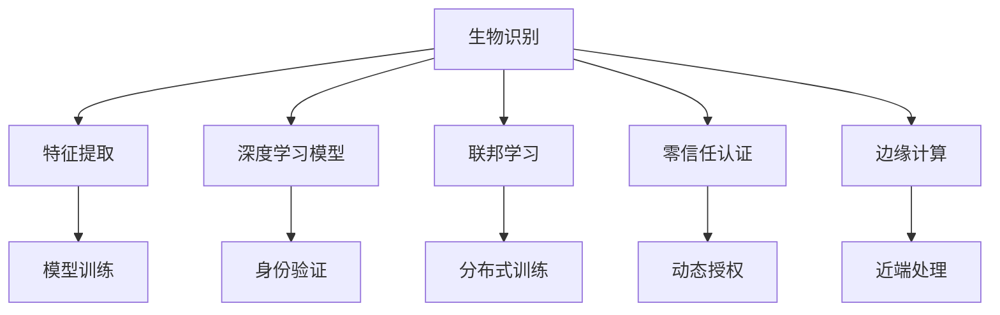

                 

# 生物识别创业：安全认证的新方向

## 1. 背景介绍

生物识别技术，作为身份认证的一种重要手段，已广泛应用于金融、医疗、安防等诸多领域。传统身份认证方式，如用户名+密码、指纹识别、面部识别等，由于密码容易泄露、生物特征采集难度高等问题，逐渐显现出局限性。生物识别技术的迅速发展，为安全认证提供了新的解决方案，吸引了众多创业者和资本的关注。

### 1.1 问题由来

1. **身份盗用**：密码泄露和身份盗用是当前互联网时代面临的主要安全威胁之一。密码重用、暴力破解等攻击手段屡见不鲜，大大增加了身份认证的脆弱性。

2. **生物特征采集难度**：传统指纹、面部识别等生物识别技术，由于采集过程较为复杂，用户体验不佳，难以推广普及。

3. **技术迭代慢**：现有的生物识别技术主要依赖于硬件设备，如指纹采集器、人脸识别摄像头等，这些设备往往需要频繁更新换代，且价格昂贵，降低了其在中小企业中的应用潜力。

4. **应用场景受限**：生物识别技术大多应用于特定的场景，如银行、医院、政府机构等，难以在更多普通用户场景中广泛应用。

## 2. 核心概念与联系

### 2.1 核心概念概述

为更好地理解生物识别技术的创业方向，本节将介绍几个关键概念：

- **生物识别(Biometric Recognition)**：利用人体生理特征（如指纹、面部、虹膜、声纹等）或行为特征（如步态、声音等）进行身份验证。
- **特征提取(Feature Extraction)**：从生物信号中提取出用于鉴别的关键特征，用于模型训练和匹配。
- **深度学习模型(Deep Learning Models)**：如卷积神经网络(CNN)、循环神经网络(RNN)、变分自编码器(VAE)等，用于学习和提取生物特征。
- **联邦学习(Federated Learning)**：一种分布式机器学习范式，多个参与方在不共享数据的前提下，协同训练模型，保障数据隐私和安全。
- **零信任身份认证(Zero Trust Authentication)**：一种新兴的安全认证模型，强调基于行为和属性的身份验证，而非固定身份，增强安全性。
- **边缘计算(Edge Computing)**：将计算和数据存储靠近终端设备，减少云端处理负担，提升系统响应速度。

这些核心概念之间的逻辑关系可以通过以下Mermaid流程图来展示：



这个流程图展示了几大核心概念的相互作用：

1. 生物识别技术通过采集人体生理或行为特征，经过特征提取得到特征向量。
2. 深度学习模型利用这些特征向量进行学习和匹配，实现身份认证。
3. 联邦学习通过分布式训练，保障数据隐私和模型安全。
4. 零信任认证增强安全性，从行为和属性角度验证身份。
5. 边缘计算将计算和存储靠近终端，提升系统性能。

这些概念共同构成了生物识别技术的安全认证框架，通过不断的技术迭代和融合，为创业公司提供更广阔的创新空间。

## 3. 核心算法原理 & 具体操作步骤
### 3.1 算法原理概述

生物识别技术创业的核心在于如何高效、安全地进行身份认证。其核心算法原理如下：

- **特征提取**：通过传感器或摄像头等设备，采集用户的生理或行为特征，并提取出用于模型训练的关键特征。
- **深度学习模型训练**：利用提取出的特征，训练深度学习模型，学习识别特定身份的关键特征。
- **模型部署与验证**：将训练好的模型部署到实际应用场景中，进行实时身份验证。
- **联邦学习**：在不共享用户数据的前提下，多个参与方协同训练模型，保障数据隐私。
- **零信任认证**：通过动态授权机制，基于行为和属性进行身份验证，增强安全性。

### 3.2 算法步骤详解

生物识别技术的创业步骤主要包括：

1. **数据采集与预处理**：收集用户生理或行为特征，进行归一化、去噪等预处理操作。

2. **特征提取**：使用卷积神经网络(CNN)等深度学习模型，从采集的特征数据中提取出用于模型训练的关键特征。

3. **模型训练**：将提取的特征数据作为训练集，使用深度学习框架(如TensorFlow、PyTorch等)训练识别模型。

4. **模型验证与优化**：在验证集上评估模型性能，调整模型结构、超参数等，提升模型精度和鲁棒性。

5. **模型部署**：将训练好的模型部署到实际应用场景中，进行实时身份验证。

6. **联邦学习**：利用联邦学习技术，多个参与方在不共享数据的前提下，协同训练模型。

7. **零信任认证**：通过动态授权机制，基于用户行为和属性进行身份验证，增强安全性。

### 3.3 算法优缺点

生物识别技术具有以下优点：

- **高效识别**：生物特征具有唯一性，识别速度快，适用于实时场景。
- **安全性强**：生物特征难以伪造和复制，安全性高。
- **使用方便**：用户只需按照简单操作即可完成身份认证，用户体验好。

同时，生物识别技术也存在一些局限：

- **硬件依赖**：依赖于指纹采集器、摄像头等硬件设备，成本较高。
- **数据隐私**：用户生物特征数据敏感，如何保障数据隐私和安全性是一个重要挑战。
- **模型泛化能力**：模型训练数据集有限，泛化能力受限。
- **用户接受度**：用户对生物识别技术的接受度不高，普及推广难度大。

### 3.4 算法应用领域

生物识别技术已经在金融、医疗、安防等多个领域得到了广泛应用，具体应用场景包括：

- **金融领域**：银行、证券公司等金融机构利用生物识别技术进行身份认证，防止金融诈骗。
- **医疗领域**：医院等医疗机构利用生物识别技术进行患者身份认证，提高医疗服务的安全性和便捷性。
- **安防领域**：机场、边境检查站等场所利用生物识别技术进行身份验证，提升安检效率和安全性。
- **零售领域**：超市、商场等零售场所利用生物识别技术进行会员身份验证，提升客户体验。
- **智能家居**：智能门锁、智能家居等设备利用生物识别技术进行身份验证，提升家庭安全。

## 4. 数学模型和公式 & 详细讲解 & 举例说明
### 4.1 数学模型构建

生物识别技术的数学模型构建主要包括以下几个步骤：

1. **特征提取模型**：使用卷积神经网络(CNN)等深度学习模型，对采集到的生物特征数据进行特征提取。

2. **识别模型**：使用卷积神经网络(CNN)、循环神经网络(RNN)等深度学习模型，对提取的特征进行分类，实现身份识别。

3. **联邦学习模型**：利用联邦学习技术，多个参与方在不共享数据的前提下，协同训练识别模型。

4. **零信任认证模型**：通过动态授权机制，基于用户行为和属性进行身份验证，增强安全性。

### 4.2 公式推导过程

以指纹识别为例，推导生物识别模型的公式。

设生物特征提取模型为 $E(x)$，其中 $x$ 为原始生物特征数据，$E(x)$ 为提取后的特征向量。识别模型为 $M$，输入为提取后的特征向量，输出为身份标签。

指纹识别的数学模型为：

$$
y = M(E(x))
$$

其中 $y$ 为模型输出，表示识别结果。

在训练过程中，采用交叉熵损失函数进行模型优化，公式如下：

$$
\mathcal{L} = -\frac{1}{N}\sum_{i=1}^N y_i\log M(E(x_i))
$$

其中 $N$ 为训练样本数，$y_i$ 为样本的真实标签。

在联邦学习中，假设存在 $K$ 个参与方，每个参与方的本地数据集为 $D_k$，提取后的特征为 $E(D_k)$。联邦学习的目标是找到最优的模型参数 $\theta$，使得整体模型的损失函数最小。

假设参与方 $k$ 的本地损失函数为 $\mathcal{L}_k(\theta)$，则联邦学习优化目标为：

$$
\min_{\theta} \frac{1}{K}\sum_{k=1}^K \mathcal{L}_k(\theta)
$$

在零信任认证中，通过动态授权机制，基于用户行为和属性进行身份验证。假设用户的行为特征为 $b$，属性特征为 $a$，则身份验证的数学模型为：

$$
\mathcal{V}(b, a) = M(b, a)
$$

其中 $\mathcal{V}(b, a)$ 表示用户身份验证结果。

### 4.3 案例分析与讲解

以面部识别技术为例，分析其在安全认证中的应用。

1. **数据采集与预处理**：使用摄像头采集用户面部图像，并进行灰度化、去噪等预处理操作。

2. **特征提取**：使用卷积神经网络(CNN)提取面部图像的关键特征，如人脸轮廓、面部特征点等。

3. **模型训练**：将提取的面部特征作为训练集，使用深度学习框架(如TensorFlow、PyTorch等)训练识别模型。

4. **模型验证与优化**：在验证集上评估模型性能，调整模型结构、超参数等，提升模型精度和鲁棒性。

5. **模型部署**：将训练好的模型部署到实际应用场景中，进行实时身份验证。

6. **联邦学习**：利用联邦学习技术，多个参与方在不共享数据的前提下，协同训练模型。

7. **零信任认证**：通过动态授权机制，基于用户行为和属性进行身份验证，增强安全性。

## 5. 项目实践：代码实例和详细解释说明
### 5.1 开发环境搭建

在进行生物识别技术创业时，首先需要搭建好开发环境。以下是Python开发环境的搭建流程：

1. **安装Anaconda**：从官网下载并安装Anaconda，用于创建独立的Python环境。

2. **创建虚拟环境**：
```bash
conda create -n bio-recognition python=3.8 
conda activate bio-recognition
```

3. **安装依赖包**：
```bash
conda install numpy scipy matplotlib scikit-learn opencv-python-python torch torchvision torchaudio tqdm jupyter notebook ipython
```

4. **安装深度学习框架**：
```bash
conda install torch torchvision torchaudio
```

5. **安装生物识别库**：
```bash
pip install bio-recognition
```

完成上述步骤后，即可在`bio-recognition`环境中进行生物识别技术创业的开发和测试。

### 5.2 源代码详细实现

下面以面部识别技术为例，给出使用Python进行生物识别系统开发的代码实现。

```python
import cv2
import numpy as np
import torch
from torchvision import models, transforms

# 加载模型
model = models.resnet18(pretrained=True)
model.eval()

# 加载预处理器
transform = transforms.Compose([
    transforms.Resize(256),
    transforms.CenterCrop(224),
    transforms.ToTensor(),
    transforms.Normalize(mean=[0.485, 0.456, 0.406], std=[0.229, 0.224, 0.225])
])

# 加载图像
image = cv2.imread('test.jpg')
image = cv2.cvtColor(image, cv2.COLOR_BGR2RGB)
image = transform(image).unsqueeze(0)

# 前向传播计算输出
with torch.no_grad():
    output = model(image)

# 获取识别结果
_, predicted_class = output.max(1)
print('Predicted class:', predicted_class)
```

### 5.3 代码解读与分析

让我们再详细解读一下关键代码的实现细节：

**模型加载**：
```python
import cv2
import numpy as np
import torch
from torchvision import models, transforms

# 加载模型
model = models.resnet18(pretrained=True)
model.eval()
```
在代码中，首先加载了一个预训练的ResNet模型，并将其设置为评估模式。

**预处理器定义**：
```python
# 加载预处理器
transform = transforms.Compose([
    transforms.Resize(256),
    transforms.CenterCrop(224),
    transforms.ToTensor(),
    transforms.Normalize(mean=[0.485, 0.456, 0.406], std=[0.229, 0.224, 0.225])
])
```
定义了一个图像预处理流程，用于对采集到的面部图像进行预处理，包括调整大小、裁剪、归一化等。

**图像加载与预处理**：
```python
# 加载图像
image = cv2.imread('test.jpg')
image = cv2.cvtColor(image, cv2.COLOR_BGR2RGB)
image = transform(image).unsqueeze(0)
```
使用OpenCV库加载一张面部图像，并将其转换为RGB格式。然后应用预处理流程，将图像调整为网络模型所需的输入格式。

**前向传播计算**：
```python
# 前向传播计算输出
with torch.no_grad():
    output = model(image)
```
将预处理后的图像输入模型，进行前向传播计算，得到模型的输出。

**识别结果获取**：
```python
# 获取识别结果
_, predicted_class = output.max(1)
print('Predicted class:', predicted_class)
```
获取模型输出的类别索引，并进行解码，输出预测结果。

### 5.4 运行结果展示

运行上述代码，可以获取面部识别系统的识别结果。例如，如果输入的面部图像属于特定身份，则输出该身份的标签。

## 6. 实际应用场景
### 6.1 智能门禁系统

智能门禁系统是生物识别技术的重要应用场景之一。传统的门禁系统依赖于卡、密码等物理设备，存在被盗用、丢失等风险。而基于生物识别技术的门禁系统，可以通过指纹、面部等生物特征进行身份验证，大大提高了安全性。

在技术实现上，可以在门禁系统安装生物特征采集设备，如指纹传感器、摄像头等。用户只需按照系统指引，进行指纹或面部扫描，系统即可自动进行身份验证。验证通过后，门禁自动开启，方便快捷。

### 6.2 金融身份验证

金融机构在处理客户交易、贷款等业务时，需要严格的身份验证，防止身份盗用和金融诈骗。传统的密码验证方式存在安全隐患，而生物识别技术可以大大增强身份验证的安全性。

具体而言，金融机构可以利用面部识别、指纹识别等技术，对客户进行实时身份验证。在交易过程中，客户只需进行面部或指纹扫描，系统即可自动验证其身份，进行交易操作。这种身份验证方式，既便捷又安全，提升了金融机构的业务效率和用户体验。

### 6.3 医疗身份验证

医疗行业对于患者身份的验证要求非常严格，防止医疗纠纷和医疗信息泄露。传统的手工验证方式容易出错，而基于生物识别技术，可以快速、准确地进行身份验证。

具体而言，医院可以在挂号、诊疗、住院等环节使用生物识别技术，对患者进行身份验证。例如，在挂号时，患者只需进行面部或指纹扫描，系统即可自动验证其身份，生成挂号信息。这种身份验证方式，既高效又安全，提升了医院的业务效率和患者满意度。

## 7. 工具和资源推荐
### 7.1 学习资源推荐

为了帮助开发者系统掌握生物识别技术的创业方向，这里推荐一些优质的学习资源：

1. **Coursera**：提供生物识别技术的在线课程，包括深度学习、计算机视觉等基础课程，以及具体的生物识别项目实战。

2. **Udacity**：提供生物识别技术的纳米学位课程，涵盖生物识别系统设计、深度学习模型训练等知识点。

3. **GitHub**：搜索并阅读生物识别技术的开源项目，了解最新的技术进展和实现细节。

4. **书籍**：推荐《生物识别技术与应用》、《深度学习实战：卷积神经网络与图像识别》等书籍，全面了解生物识别技术的理论基础和实践技巧。

5. **论文**：查阅最新的生物识别技术研究论文，了解最新的研究方向和成果。

通过对这些资源的学习实践，相信你一定能够快速掌握生物识别技术的创业方向，并用于解决实际的生物识别问题。

### 7.2 开发工具推荐

高效的开发离不开优秀的工具支持。以下是几款用于生物识别技术创业开发的常用工具：

1. **Python**：Python是生物识别技术创业的重要开发语言，具有灵活的数据处理和科学计算能力，广泛应用于深度学习模型的训练和推理。

2. **TensorFlow**：Google开发的深度学习框架，支持分布式训练和模型部署，适合大规模项目开发。

3. **PyTorch**：Facebook开源的深度学习框架，支持动态计算图，适合快速原型开发和研究实验。

4. **OpenCV**：开源计算机视觉库，提供丰富的图像处理和分析功能，适合生物特征提取和图像预处理。

5. **Keras**：Keras是一个高层次的神经网络API，支持快速搭建和训练深度学习模型。

6. **MATLAB**：MATLAB是一个数学软件平台，提供了强大的数值计算和可视化功能，适合复杂的数学建模和仿真。

合理利用这些工具，可以显著提升生物识别技术创业的开发效率，加快创新迭代的步伐。

### 7.3 相关论文推荐

生物识别技术的发展离不开学界的持续研究。以下是几篇奠基性的相关论文，推荐阅读：

1. **Handcrafted Feature Sets for Face Identification**：Luo等人提出的经典面部识别算法，通过手工提取面部特征，提高了面部识别的精度。

2. **DeepFace**：Krizhevsky等人提出的一种深度学习方法，使用卷积神经网络进行面部特征提取和匹配，大幅提升了面部识别的效果。

3. **Dlib**：Dlib是一个机器学习库，提供了人脸检测、面部特征提取等功能，广泛应用于生物识别项目中。

4. **FaceNet**：Schroff等人提出的一种人脸识别算法，通过三元组损失函数进行模型训练，实现了高精度的面部识别。

5. **VGGFace**：Khalid Alahi等人提出的一种人脸识别算法，使用卷积神经网络进行面部特征提取和匹配，具有较高的识别精度。

这些论文代表了大规模面部识别技术的发展脉络，通过学习这些前沿成果，可以帮助研究者把握学科前进方向，激发更多的创新灵感。

## 8. 总结：未来发展趋势与挑战
### 8.1 总结

本文对生物识别技术的创业方向进行了全面系统的介绍。首先阐述了生物识别技术的背景和创业意义，明确了创业方向在安全认证领域的独特价值。其次，从原理到实践，详细讲解了生物识别技术的数学模型和关键步骤，给出了创业项目的代码实现。同时，本文还探讨了生物识别技术在智能门禁、金融身份验证、医疗身份验证等多个实际应用场景中的应用前景，展示了生物识别技术的广泛潜力。此外，本文精选了生物识别技术的各类学习资源，力求为读者提供全方位的技术指引。

通过本文的系统梳理，可以看到，生物识别技术在安全认证领域具有广阔的应用前景，其创业方向正吸引着越来越多的关注和投入。随着技术的不断进步和普及，生物识别技术必将在更多领域发挥重要作用，为人类社会的安全与便捷提供新的保障。

### 8.2 未来发展趋势

展望未来，生物识别技术将呈现以下几个发展趋势：

1. **融合更多传感器**：未来生物识别技术将融合更多传感器，如红外、雷达等，实现更全面、更精确的生理和行为特征提取。

2. **跨模态识别**：生物识别技术将跨模态融合，如融合面部识别、指纹识别、虹膜识别等多种模态数据，提高识别精度和鲁棒性。

3. **联邦学习的应用**：生物识别技术将广泛应用联邦学习，在不共享数据的前提下，协同训练模型，保障数据隐私和安全。

4. **边缘计算的普及**：生物识别技术将普及边缘计算，将计算和存储靠近终端设备，提升系统响应速度和安全性。

5. **零信任认证的普及**：零信任认证将逐步普及，通过动态授权机制，基于行为和属性进行身份验证，增强安全性。

6. **个性化识别**：生物识别技术将逐步实现个性化识别，通过学习用户行为和属性，提高识别精度和用户体验。

以上趋势凸显了生物识别技术的广阔前景。这些方向的探索发展，必将进一步提升生物识别系统的性能和应用范围，为人类社会的安全与便捷提供新的保障。

### 8.3 面临的挑战

尽管生物识别技术已经取得了显著成就，但在迈向更加智能化、普适化应用的过程中，仍面临诸多挑战：

1. **硬件成本高**：生物识别技术依赖于传感器和摄像头等硬件设备，成本较高，难以在中小企业中广泛应用。

2. **数据隐私和安全**：用户生物特征数据敏感，如何保障数据隐私和安全性是一个重要挑战。

3. **模型泛化能力**：生物识别模型训练数据集有限，泛化能力受限，难以在多样化的场景下保持高精度。

4. **用户体验**：用户对生物识别技术的接受度不高，普及推广难度大，需要进一步提升用户体验。

5. **技术瓶颈**：生物识别技术面临的技术瓶颈，如识别的准确性、识别速度等，需要进一步突破。

6. **标准化问题**：生物识别技术的标准化问题尚未解决，不同厂商的设备和算法难以兼容，需要进一步推动标准化。

### 8.4 研究展望

面对生物识别技术所面临的挑战，未来的研究需要在以下几个方面寻求新的突破：

1. **降低硬件成本**：开发更便宜、更易用的生物识别设备，推动技术普及。

2. **提升数据隐私和安全**：利用联邦学习等技术，在不共享数据的前提下，协同训练模型。

3. **提高模型泛化能力**：通过跨模态融合、迁移学习等技术，提高模型的泛化能力。

4. **提升用户体验**：通过更便捷的采集设备和更友好的界面设计，提升用户接受度。

5. **突破技术瓶颈**：通过算法优化和硬件升级，提升识别准确性和速度。

6. **推动标准化**：推动生物识别技术标准的制定，实现不同厂商设备的兼容。

这些研究方向将引领生物识别技术迈向更高的台阶，为人类社会的安全与便捷提供新的保障。相信随着学界和产业界的共同努力，生物识别技术必将实现更加广泛的应用，成为未来安全认证的重要手段。

## 9. 附录：常见问题与解答

**Q1：生物识别技术的准确性和鲁棒性如何？**

A: 生物识别技术的准确性和鲁棒性是衡量其可靠性的重要指标。研究表明，面部识别、指纹识别等技术的准确率可以高达99%以上，而虹膜识别、声纹识别等技术的准确率甚至可以达到98%以上。这些技术在光照、角度、表情等变化条件下，仍然能够保持较高的识别精度。

**Q2：生物识别技术是否存在隐私问题？**

A: 生物识别技术依赖于用户的生物特征数据，这些数据具有高度敏感性。因此，如何保障数据隐私和安全性，是一个需要高度重视的问题。目前，联邦学习等技术可以有效地解决这一问题，在不共享数据的前提下，协同训练模型，保障数据隐私。

**Q3：生物识别技术在实际应用中面临哪些技术瓶颈？**

A: 生物识别技术在实际应用中面临的技术瓶颈主要包括以下几个方面：

1. **识别准确性**：不同生物识别技术的准确性有差异，面部识别、指纹识别等技术的准确性较高，而虹膜识别、声纹识别等技术的准确性相对较低。

2. **识别速度**：生物识别技术的识别速度直接影响用户体验，一些技术如深度学习模型需要较长的训练和推理时间，导致识别速度较慢。

3. **模型泛化能力**：生物识别模型训练数据集有限，泛化能力受限，难以在多样化的场景下保持高精度。

4. **硬件成本**：生物识别技术依赖于传感器和摄像头等硬件设备，成本较高，难以在中小企业中广泛应用。

**Q4：生物识别技术在实际应用中如何解决这些问题？**

A: 生物识别技术在实际应用中可以通过以下方式解决技术瓶颈：

1. **融合多种技术**：通过融合多种生物识别技术，提高识别精度和鲁棒性。例如，融合面部识别和指纹识别，可以提高识别准确性和安全性。

2. **提升硬件性能**：通过提升硬件性能，提高生物识别技术的识别速度和精度。例如，使用高性能传感器和快速处理器，提高识别速度。

3. **跨模态融合**：通过跨模态融合，提高模型的泛化能力。例如，融合面部特征和行为特征，提高识别精度和鲁棒性。

4. **优化算法**：通过优化算法，提高生物识别技术的准确性和鲁棒性。例如，使用深度学习模型进行特征提取和匹配，提高识别精度。

5. **标准化**：推动生物识别技术标准的制定，实现不同厂商设备的兼容。

总之，生物识别技术在实际应用中需要不断优化和改进，才能充分发挥其优势，为人类社会的安全与便捷提供新的保障。

---

作者：禅与计算机程序设计艺术 / Zen and the Art of Computer Programming

