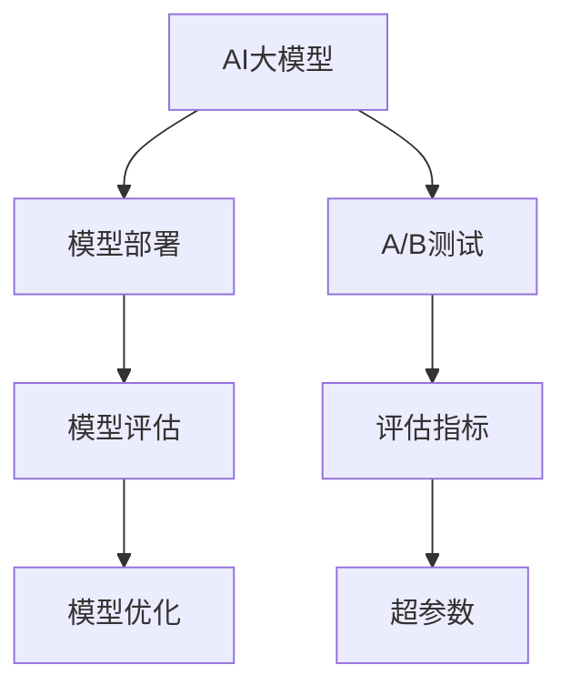

                 

# 电商平台中AI大模型的A/B测试策略

> 关键词：A/B测试, 人工智能, 电商平台, 大模型, 模型部署, 评估指标, 优化策略

## 1. 背景介绍

### 1.1 问题由来
随着人工智能(AI)和大数据技术的迅猛发展，AI大模型在电商平台中的应用越来越广泛。AI大模型可以用于推荐系统、客服机器人、商品识别、价格预测等多个场景，显著提升了电商平台的运营效率和用户体验。然而，在应用过程中，如何评估和优化AI大模型的性能，选择最优的部署策略，成为了电商平台的一大难题。

### 1.2 问题核心关键点
- **模型评估**：如何有效评估AI大模型的性能，避免过拟合或欠拟合？
- **部署策略**：如何根据业务需求选择合适的模型部署策略，如全模型部署、部分模型部署或仅部署任务相关模型？
- **A/B测试**：如何设计科学合理的A/B测试策略，保证测试结果的可靠性和有效性？

本文旨在详细探讨电商平台中AI大模型的A/B测试策略，帮助电商平台更好地选择合适的模型部署策略，提高AI技术的业务价值。

## 2. 核心概念与联系

### 2.1 核心概念概述

为更好地理解A/B测试在AI大模型部署中的应用，本节将介绍几个密切相关的核心概念：

- **AI大模型**：以深度学习为代表的大规模预训练模型，如BERT、GPT等。通过在大规模无标签数据上进行预训练，学习通用的语言或图像表示，具备强大的泛化能力。

- **A/B测试**：通过对比两个或多个版本的系统或功能，评估其性能差异的方法。常用于新产品、新功能或新策略的上线前评估。

- **模型部署**：将训练好的AI大模型应用到实际业务场景中的过程，包括模型加载、推理计算、数据输入输出等。

- **模型评估**：评估AI模型性能的方法，包括但不限于准确率、召回率、F1值、ROC曲线、AUC等指标。

- **模型优化**：通过调整模型结构、参数等手段，提高AI模型性能的过程。

- **性能指标**：评估AI模型性能的关键指标，如精度、召回率、F1值、ROC曲线、AUC等。

- **超参数**：影响模型性能的关键参数，如学习率、批量大小、优化器等，需要通过实验调整找到最优值。

这些核心概念之间的逻辑关系可以通过以下Mermaid流程图来展示：



这个流程图展示了大模型部署、A/B测试、模型评估、优化等关键概念之间的联系：

1. 大模型通过预训练获得基础能力。
2. 在实际业务场景中进行模型部署，评估模型性能。
3. 通过A/B测试对比不同版本的模型，评估其效果。
4. 根据模型评估结果，优化模型参数或结构。
5. 调整超参数，进一步提升模型性能。

这些概念共同构成了AI大模型在电商平台中应用的完整流程，使其能够更好地适应业务需求，提高运营效率。

## 3. 核心算法原理 & 具体操作步骤
### 3.1 算法原理概述

AI大模型的A/B测试主要涉及以下算法原理：

- **特征工程**：提取、选择、处理和编码输入数据的特征，使其更适合模型训练。
- **模型选择**：选择合适的模型结构、优化器、超参数等，进行模型训练。
- **模型评估**：通过训练集和验证集评估模型性能，选择合适的评估指标。
- **A/B测试设计**：设计科学合理的A/B测试方案，对比不同版本模型的性能。
- **模型优化**：通过调整模型参数或结构，提升模型性能。

### 3.2 算法步骤详解

AI大模型在电商平台中的A/B测试一般包括以下几个关键步骤：

**Step 1: 准备数据集和模型**

- 收集电商平台上的用户行为数据，如浏览记录、购买记录、评分记录等，作为训练数据集。
- 选择合适的预训练大模型，如BERT、GPT等，作为初始化参数。

**Step 2: 特征工程**

- 对原始数据进行清洗、特征选择、特征编码等预处理，使其更适合模型训练。
- 对特征进行归一化、标准化等处理，避免不同特征量纲不一致导致的模型性能下降。

**Step 3: 模型选择与训练**

- 选择合适的模型结构、优化器、超参数等，进行模型训练。
- 使用训练集对模型进行训练，并使用验证集评估模型性能，选择最优模型。

**Step 4: A/B测试设计**

- 设计科学合理的A/B测试方案，将用户随机分配到实验组和对照组。
- 确定测试周期、样本量、测试指标等关键参数。

**Step 5: 测试与分析**

- 在实验组和对照组上分别部署不同版本的模型，收集用户行为数据。
- 使用统计分析方法（如t-test、卡方检验等）评估不同版本模型的性能差异。
- 根据测试结果选择最优模型部署。

**Step 6: 模型优化**

- 根据模型评估结果，调整模型参数或结构，提升模型性能。
- 优化超参数，如学习率、批量大小等，进一步提升模型效果。

### 3.3 算法优缺点

基于AI大模型的A/B测试方法具有以下优点：

- **客观评估**：通过科学合理的A/B测试，客观评估不同版本模型的性能差异。
- **数据驱动**：测试结果基于实际用户行为数据，更符合业务需求。
- **可重复性**：测试方案可重复执行，便于优化模型部署策略。

同时，该方法也存在一定的局限性：

- **依赖标注数据**：测试结果依赖标注数据的质量和数量，标注数据质量较差时测试结果不可靠。
- **模型复杂**：大模型结构复杂，训练和推理计算资源需求高，部署成本高。
- **过拟合风险**：模型在大规模数据上训练效果较好，但在小规模数据上可能存在过拟合风险。
- **数据隐私**：测试过程中可能涉及用户隐私数据的收集和处理，需严格遵守数据隐私法律法规。

尽管存在这些局限性，但就目前而言，基于AI大模型的A/B测试方法仍是目前电商平台中模型部署策略优化的主要手段。未来相关研究的重点在于如何进一步降低测试对标注数据的依赖，提高模型的少样本学习和跨领域迁移能力，同时兼顾可解释性和伦理安全性等因素。

### 3.4 算法应用领域

基于AI大模型的A/B测试方法在电商平台中的应用领域非常广泛，包括但不限于：

- **推荐系统**：通过A/B测试评估不同推荐算法的效果，选择最优算法部署。
- **客服机器人**：通过A/B测试评估不同对话策略的效果，选择最优策略部署。
- **商品识别**：通过A/B测试评估不同商品识别算法的效果，选择最优算法部署。
- **价格预测**：通过A/B测试评估不同预测模型的效果，选择最优模型部署。
- **广告投放**：通过A/B测试评估不同广告投放策略的效果，选择最优策略部署。

除了上述这些经典应用外，基于AI大模型的A/B测试方法还应用于更多场景中，如可控内容生成、客户行为分析、供应链优化等，为电商平台的数字化转型升级提供了新的技术路径。

## 4. 数学模型和公式 & 详细讲解 & 举例说明
### 4.1 数学模型构建

本节将使用数学语言对AI大模型在电商平台中A/B测试的原理进行更加严格的刻画。

记测试组为 $G$，对照组为 $C$，假设测试组和对照组的用户行为数据分别为 $D_G$ 和 $D_C$，测试指标为 $K$。

定义模型 $M$ 在用户行为数据上的预测结果为 $\hat{y}=M(x)$，其中 $x$ 为输入特征，$\hat{y}$ 为输出结果。

定义测试组和对照组的平均预测结果分别为 $\bar{y}_G=\frac{1}{|D_G|}\sum_{x_i \in D_G} M(x_i)$ 和 $\bar{y}_C=\frac{1}{|D_C|}\sum_{x_j \in D_C} M(x_j)$。

定义测试组和对照组的测试指标的均值分别为 $\mu_G=\frac{1}{|D_G|}\sum_{x_i \in D_G} k_i$ 和 $\mu_C=\frac{1}{|D_C|}\sum_{x_j \in D_C} k_j$，其中 $k_i$ 和 $k_j$ 分别为测试组和对照组的测试指标。

测试组和对照组的测试指标的方差分别为 $\sigma^2_G=\frac{1}{|D_G|}\sum_{x_i \in D_G} (k_i-\mu_G)^2$ 和 $\sigma^2_C=\frac{1}{|D_C|}\sum_{x_j \in D_C} (k_j-\mu_C)^2$。

A/B测试的目标是评估测试组和对照组的测试指标的差异是否显著，可以通过t-test或卡方检验等方法进行统计分析。

### 4.2 公式推导过程

以下是A/B测试的数学推导过程：

1. 假设测试组和对照组的测试指标 $k_i$ 和 $k_j$ 服从正态分布，且测试组和对照组的样本量 $n_G$ 和 $n_C$ 相等。

2. 计算测试组和对照组的均值差 $t$ 和标准误差 $s$，公式如下：

$$
t = \frac{\bar{y}_G - \bar{y}_C}{\sqrt{\frac{\sigma_G^2}{n_G}+\frac{\sigma_C^2}{n_C}}}
$$

$$
s = \sqrt{\frac{1}{n_G}(\sigma_G^2+\sigma_C^2)}
$$

3. 计算t-test统计量 $t$ 的自由度为 $n_G+n_C-2$，计算p-value值：

$$
p = P(t \geq |t| \mid H_0)
$$

其中 $H_0$ 为原假设，即测试组和对照组的测试指标无显著差异。

4. 根据p-value值和显著性水平 $\alpha$ 确定是否拒绝原假设 $H_0$，选择最优模型部署。

### 4.3 案例分析与讲解

以电商平台上的推荐系统为例，解释A/B测试的数学推导过程和具体实现。

1. 假设测试组和对照组的推荐系统分别使用模型 $M_1$ 和 $M_2$ 进行推荐，测试指标为点击率 $K$。

2. 收集测试组和对照组的点击率数据 $D_G=\{x_i, y_i\}_{i=1}^{n_G}$ 和 $D_C=\{x_j, y_j\}_{j=1}^{n_C}$。

3. 计算测试组和对照组的平均点击率 $\bar{y}_G=\frac{1}{n_G}\sum_{i=1}^{n_G} y_i$ 和 $\bar{y}_C=\frac{1}{n_C}\sum_{j=1}^{n_C} y_j$。

4. 计算测试组和对照组的点击率方差 $\sigma_G^2=\frac{1}{n_G}\sum_{i=1}^{n_G} (y_i-\bar{y}_G)^2$ 和 $\sigma_C^2=\frac{1}{n_C}\sum_{j=1}^{n_C} (y_j-\bar{y}_C)^2$。

5. 计算t-test统计量 $t$ 和标准误差 $s$：

$$
t = \frac{\bar{y}_G - \bar{y}_C}{\sqrt{\frac{\sigma_G^2}{n_G}+\frac{\sigma_C^2}{n_C}}}
$$

$$
s = \sqrt{\frac{1}{n_G}(\sigma_G^2+\sigma_C^2)}
$$

6. 计算p-value值，根据显著性水平 $\alpha$ 确定是否拒绝原假设 $H_0$，选择最优模型部署。

在实际应用中，需要根据具体业务需求选择合适的测试指标，如点击率、转化率、用户满意度等。同时，需要注意测试数据的质量和数量，避免过拟合和欠拟合问题。

## 5. 项目实践：代码实例和详细解释说明
### 5.1 开发环境搭建

在进行A/B测试实践前，我们需要准备好开发环境。以下是使用Python进行A/B测试的开发环境配置流程：

1. 安装Anaconda：从官网下载并安装Anaconda，用于创建独立的Python环境。

2. 创建并激活虚拟环境：
```bash
conda create -n a_b_test_env python=3.8 
conda activate a_b_test_env
```

3. 安装PyTorch：根据CUDA版本，从官网获取对应的安装命令。例如：
```bash
conda install pytorch torchvision torchaudio cudatoolkit=11.1 -c pytorch -c conda-forge
```

4. 安装Scikit-learn、Pandas、Matplotlib等库：
```bash
pip install scikit-learn pandas matplotlib
```

5. 安装A/B测试框架：
```bash
pip install pyabtest
```

完成上述步骤后，即可在`a_b_test_env`环境中开始A/B测试实践。

### 5.2 源代码详细实现

下面我们以电商平台上的推荐系统为例，给出使用PyTorch和pyabtest进行A/B测试的PyTorch代码实现。

首先，定义推荐系统的评估指标函数：

```python
import torch
import numpy as np
from sklearn.metrics import roc_auc_score

def auc_score(y_true, y_pred):
    return roc_auc_score(y_true, y_pred)
```

然后，定义A/B测试函数：

```python
from pyabtest import ABTest

def ab_test(model1, model2, dataset):
    ab = ABTest()
    ab.add_group(model1, dataset)
    ab.add_group(model2, dataset)
    result = ab.run()
    print(result)
```

最后，启动A/B测试流程：

```python
# 加载模型和数据集
model1 = ...
model2 = ...
dataset = ...

# 进行A/B测试
ab_test(model1, model2, dataset)
```

以上就是使用PyTorch和pyabtest进行A/B测试的完整代码实现。可以看到，通过pyabtest工具，可以很方便地进行A/B测试的配置和运行，大大简化了测试过程。

### 5.3 代码解读与分析

让我们再详细解读一下关键代码的实现细节：

**auc_score函数**：
- 使用scikit-learn中的roc_auc_score函数计算模型预测结果的AUC值。

**ab_test函数**：
- 创建pyabtest.ABTest对象，添加实验组和对照组的数据集。
- 运行A/B测试，输出测试结果。

**测试流程**：
- 加载实验组和对照组的模型和数据集。
- 调用ab_test函数进行A/B测试，并输出测试结果。

在实际应用中，需要注意测试数据的质量和数量，避免过拟合和欠拟合问题。同时，需要对测试结果进行统计分析，确定是否拒绝原假设 $H_0$，选择最优模型部署。

## 6. 实际应用场景
### 6.1 推荐系统优化

在电商平台中，推荐系统是用户体验的重要组成部分，优化推荐系统是提高用户满意度和销售转化率的有效手段。基于A/B测试的推荐系统优化可以显著提升推荐效果，优化用户体验。

例如，可以通过A/B测试对比不同推荐算法的效果，如基于深度学习的推荐模型和基于协同过滤的推荐模型，选择最优模型部署。通过调整模型的超参数，如学习率、批量大小、隐藏层大小等，优化推荐算法的效果。

### 6.2 客服机器人改进

电商平台的客服机器人需要具备高效的对话理解和响应能力，以便快速解答用户问题，提升客户满意度。通过A/B测试优化客服机器人的对话策略，可以提升对话效果，提升客户满意度。

例如，可以通过A/B测试对比不同对话策略的效果，如基于规则的对话策略和基于深度学习的对话策略，选择最优策略部署。通过调整模型的超参数，如学习率、批量大小、隐藏层大小等，优化对话策略的效果。

### 6.3 商品识别优化

电商平台需要对用户上传的商品图片进行自动分类和标注，以提升用户体验。通过A/B测试优化商品识别模型，可以提升识别的准确率和速度。

例如，可以通过A/B测试对比不同商品识别模型的效果，如基于深度学习的模型和基于传统机器学习的模型，选择最优模型部署。通过调整模型的超参数，如学习率、批量大小、隐藏层大小等，优化商品识别模型的效果。

### 6.4 价格预测优化

电商平台需要实时预测商品的价格趋势，以指导库存管理和定价策略。通过A/B测试优化价格预测模型，可以提升预测的准确率和时效性。

例如，可以通过A/B测试对比不同预测模型的效果，如基于深度学习的模型和基于传统统计模型的模型，选择最优模型部署。通过调整模型的超参数，如学习率、批量大小、隐藏层大小等，优化价格预测模型的效果。

### 6.5 广告投放优化

电商平台需要对广告进行定向投放，以提升广告的点击率和转化率。通过A/B测试优化广告投放策略，可以提升广告效果，降低投放成本。

例如，可以通过A/B测试对比不同广告投放策略的效果，如基于用户行为的投放策略和基于地理位置的投放策略，选择最优策略部署。通过调整模型的超参数，如学习率、批量大小、隐藏层大小等，优化广告投放策略的效果。

### 6.6 未来应用展望

随着AI大模型和A/B测试技术的不断发展，基于A/B测试的优化方法将在更多电商应用场景中得到应用，为电商平台的数字化转型升级提供新的技术路径。

在智慧物流领域，基于A/B测试的物流优化可以提升物流效率和用户体验。在智能营销领域，基于A/B测试的营销优化可以提升广告投放效果和用户转化率。在供应链优化领域，基于A/B测试的优化可以提升供应链的灵活性和稳定性。

除了上述这些经典应用外，基于A/B测试的优化方法还应用于更多场景中，如客户行为分析、商品推荐、用户体验优化等，为电商平台的数字化转型升级提供新的技术路径。相信随着技术的不断进步，A/B测试将在大模型应用中扮演越来越重要的角色。

## 7. 工具和资源推荐
### 7.1 学习资源推荐

为了帮助开发者系统掌握A/B测试的理论基础和实践技巧，这里推荐一些优质的学习资源：

1. 《A/B Testing: The Most Powerful Way to Turn Clicks into Customers》书籍：该书详细介绍了A/B测试的原理、方法、应用场景和案例，是入门A/B测试的必读书籍。

2. 《Machine Learning Yearning》书籍：该书由Google深度学习专家Andrew Ng所著，详细介绍了A/B测试的原理和应用，适合进阶学习。

3. 《Deep Learning Specialization》课程：由Coursera和Andrew Ng合作开设的深度学习系列课程，涵盖了深度学习的基本原理、优化方法、应用场景和实战案例。

4. PyTorch官方文档：PyTorch的官方文档详细介绍了PyTorch的使用方法和API接口，适合开发者学习参考。

5. pyabtest官方文档：pyabtest的官方文档详细介绍了A/B测试的工具使用方法和API接口，适合开发者学习和实践。

通过对这些资源的学习实践，相信你一定能够快速掌握A/B测试的精髓，并用于解决实际的电商平台问题。

### 7.2 开发工具推荐

高效的开发离不开优秀的工具支持。以下是几款用于A/B测试开发的常用工具：

1. PyTorch：基于Python的开源深度学习框架，灵活动态的计算图，适合快速迭代研究。PyTorch在深度学习模型训练和推理中具有很好的表现。

2. TensorFlow：由Google主导开发的开源深度学习框架，生产部署方便，适合大规模工程应用。TensorFlow在深度学习模型训练和推理中具有很好的表现。

3. PyABTest：A/B测试工具，可以方便地进行A/B测试的配置和运行，大大简化了测试过程。

4. Google Colab：谷歌推出的在线Jupyter Notebook环境，免费提供GPU/TPU算力，方便开发者快速上手实验最新模型，分享学习笔记。

合理利用这些工具，可以显著提升A/B测试任务的开发效率，加快创新迭代的步伐。

### 7.3 相关论文推荐

A/B测试方法的发展源于学界的持续研究。以下是几篇奠基性的相关论文，推荐阅读：

1. Designing A/B tests that work（NIPS 2014）：这篇论文详细介绍了A/B测试的设计原则和优化方法，是A/B测试研究的经典文献。

2. Power Analysis for A/B Tests with Unknown Baseline Distribution（JMLR 2014）：这篇论文详细介绍了A/B测试的统计分析和优化方法，是A/B测试研究的另一经典文献。

3. Sequential A/B Testing with Fixed Enrollment Budgets（KDD 2015）：这篇论文详细介绍了序列化A/B测试的优化方法，适合处理在线广告投放等实时场景。

4. Practical A/B Testing（O'Reilly 2020）：该书详细介绍了A/B测试的实战应用和案例分析，适合实际应用的开发者阅读。

这些论文代表了大模型和A/B测试的发展脉络。通过学习这些前沿成果，可以帮助研究者把握学科前进方向，激发更多的创新灵感。

## 8. 总结：未来发展趋势与挑战

### 8.1 总结

本文对基于AI大模型的电商平台A/B测试方法进行了全面系统的介绍。首先阐述了A/B测试在AI大模型部署中的应用，明确了模型评估、模型选择、A/B测试等关键概念。其次，从原理到实践，详细讲解了A/B测试的数学原理和关键步骤，给出了A/B测试任务开发的完整代码实例。同时，本文还广泛探讨了A/B测试方法在电商平台多个应用场景中的实践，展示了A/B测试范式的巨大潜力。此外，本文精选了A/B测试技术的各类学习资源，力求为读者提供全方位的技术指引。

通过本文的系统梳理，可以看到，基于AI大模型的A/B测试方法正在成为电商平台中模型部署策略优化的重要手段，极大地拓展了预训练模型应用的范围，提高了运营效率。未来，伴随预训练语言模型和A/B测试方法的不断进步，相信电商平台的数字化转型将加速推进，带来更多创新价值。

### 8.2 未来发展趋势

展望未来，基于AI大模型的A/B测试技术将呈现以下几个发展趋势：

1. 自动化程度提高。随着自动化测试工具的不断发展，A/B测试将逐步实现自动化部署、分析和优化，减少人工干预，提高测试效率。

2. 多指标综合评估。未来的A/B测试将不仅仅关注单一指标，而是综合考虑多个指标，如点击率、转化率、用户满意度等，进行多指标综合评估，更全面地评估模型性能。

3. 在线实时测试。未来的A/B测试将支持实时在线测试，可以实时调整模型参数和策略，及时应对业务需求的变化。

4. 大数据分析。未来的A/B测试将支持大数据分析，可以分析海量用户行为数据，进行更深入的用户画像和行为分析，提升业务洞察力。

5. 跨平台测试。未来的A/B测试将支持跨平台测试，可以在多个平台和设备上进行测试，评估模型的跨平台兼容性。

这些趋势凸显了A/B测试技术的广阔前景。这些方向的探索发展，必将进一步提升电商平台的运营效率和用户体验，为电商平台的数字化转型升级提供新的技术路径。

### 8.3 面临的挑战

尽管基于AI大模型的A/B测试方法已经取得了显著成效，但在迈向更加智能化、普适化应用的过程中，它仍面临着诸多挑战：

1. 数据质量瓶颈。测试结果依赖于标注数据的质量和数量，标注数据质量较差时测试结果不可靠。如何进一步降低测试对标注数据的依赖，将是一大难题。

2. 模型复杂性。大模型结构复杂，训练和推理计算资源需求高，部署成本高。如何简化模型结构，降低计算资源需求，是重要的优化方向。

3. 过拟合风险。模型在大规模数据上训练效果较好，但在小规模数据上可能存在过拟合风险。如何提高模型的泛化能力和鲁棒性，避免过拟合，是重要的研究方向。

4. 数据隐私。测试过程中可能涉及用户隐私数据的收集和处理，需严格遵守数据隐私法律法规。如何在保证数据隐私的前提下，进行有效的A/B测试，是重要的技术挑战。

5. 可解释性。A/B测试结果往往需要解释，以便指导业务决策。如何增强测试结果的可解释性，是重要的研究课题。

6. 技术融合。A/B测试需要与机器学习、深度学习等技术进行更深入的融合，形成更加全面、高效的技术体系。如何实现多技术的协同优化，是重要的研究方向。

这些挑战凸显了A/B测试技术的复杂性，需要在多个维度进行协同优化，才能更好地适应业务需求，提高电商平台的数字化转型效果。

### 8.4 研究展望

面对A/B测试面临的种种挑战，未来的研究需要在以下几个方面寻求新的突破：

1. 探索更高效、更可靠的数据收集和标注方法。采用主动学习、半监督学习等方法，提高标注数据的质量和数量，降低测试对标注数据的依赖。

2. 开发更轻量级、更高效的模型结构。采用模型压缩、稀疏化存储等技术，降低计算资源需求，提高测试效率。

3. 研究更有效的模型泛化方法。采用迁移学习、多任务学习等方法，提高模型的泛化能力和鲁棒性，避免过拟合。

4. 引入更多先验知识。将符号化的先验知识，如知识图谱、逻辑规则等，与神经网络模型进行巧妙融合，增强模型对特定任务的适应能力。

5. 结合因果分析和博弈论工具。将因果分析方法引入A/B测试，识别出模型决策的关键特征，增强输出解释的因果性和逻辑性。借助博弈论工具刻画人机交互过程，主动探索并规避模型的脆弱点，提高系统稳定性。

6. 纳入伦理道德约束。在测试目标中引入伦理导向的评估指标，过滤和惩罚有偏见、有害的输出倾向。加强人工干预和审核，建立模型行为的监管机制，确保输出符合人类价值观和伦理道德。

这些研究方向的探索，必将引领A/B测试技术迈向更高的台阶，为电商平台提供更高效、更可靠、更全面的优化手段，助力电商平台的数字化转型升级。面向未来，A/B测试技术还需要与其他人工智能技术进行更深入的融合，如知识表示、因果推理、强化学习等，多路径协同发力，共同推动自然语言理解和智能交互系统的进步。只有勇于创新、敢于突破，才能不断拓展语言模型的边界，让智能技术更好地造福人类社会。

## 9. 附录：常见问题与解答

**Q1：A/B测试是否适用于所有电商平台应用场景？**

A: A/B测试在大多数电商平台应用场景中都适用，特别是对于数据量较大的任务。但对于一些特定领域的任务，如医学、法律等，仅仅依靠通用数据预训练的模型可能难以很好地适应。此时需要在特定领域数据上进一步预训练，再进行微调，才能获得理想效果。此外，对于一些需要时效性、个性化很强的任务，如对话、推荐等，A/B测试方法也需要针对性的改进优化。

**Q2：进行A/B测试时，如何选择合适的测试指标？**

A: 选择合适的测试指标需要根据具体业务需求。一般来说，电商平台的A/B测试指标包括点击率、转化率、用户满意度等。点击率可以衡量模型的点击效果，转化率可以衡量模型的转化效果，用户满意度可以衡量用户对模型的反馈。在选择测试指标时，需要考虑业务目标和用户需求，选择最符合业务目标的指标。

**Q3：如何进行科学的A/B测试设计？**

A: 科学的A/B测试设计需要考虑样本量、测试周期、显著性水平等因素。一般来说，样本量越大，测试结果越可靠。测试周期应根据业务需求确定，一般建议测试周期至少为一个季度。显著性水平（即alpha值）通常设定为0.05或0.01，表示在测试结果中观察到的差异在统计学上可能是偶然出现的概率。在设计A/B测试时，需要根据具体情况进行合理设置，以保证测试结果的可靠性和有效性。

**Q4：A/B测试过程中，如何避免过拟合和欠拟合问题？**

A: 避免过拟合和欠拟合问题需要从数据和模型两个方面进行优化。在数据方面，需要对数据进行清洗、归一化等预处理，提高数据质量。在模型方面，需要选择合适的模型结构和优化器，控制模型复杂度，避免过拟合。同时，可以进行交叉验证、学习曲线分析等方法，评估模型性能，避免欠拟合。

**Q5：A/B测试结果如何应用到实际业务中？**

A: A/B测试结果的应用需要根据具体业务需求进行优化。一般来说，如果测试结果显示某一版本模型效果更好，可以将该版本模型部署到实际业务中。如果测试结果差异不显著，可以进一步优化模型，或者增加样本量重新进行测试。同时，需要注意测试结果的解释性和可操作性，以便指导业务决策。

通过本文的系统梳理，可以看到，基于AI大模型的A/B测试方法正在成为电商平台中模型部署策略优化的重要手段，极大地拓展了预训练模型应用的范围，提高了运营效率。未来，伴随预训练语言模型和A/B测试方法的不断进步，相信电商平台的数字化转型将加速推进，带来更多创新价值。

