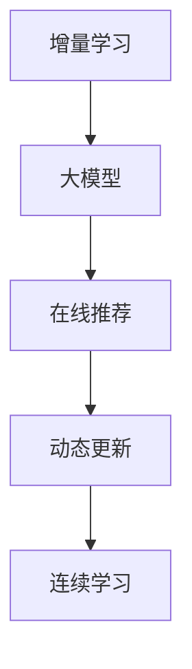

                 

# 电商平台中AI大模型的增量学习技术

> 关键词：增量学习,大模型,电商平台,在线推荐,用户行为,动态更新,连续学习

## 1. 背景介绍

### 1.1 问题由来
在电商平台的日常运营中，用户行为数据是核心资产之一。通过分析用户浏览、点击、购买等行为，电商平台能够提供个性化推荐、实时广告投放、库存管理等各类服务，提升用户体验和商家收益。然而，由于用户行为数据是实时变化的，采用传统的离线训练方式进行推荐模型更新显然是不现实的。因此，如何在海量用户行为数据上实现高效的在线学习，成为电商平台AI大模型应用的重要问题。

### 1.2 问题核心关键点
增量学习（Incremental Learning）是指在已训练好的模型基础上，不断吸收新数据进行持续学习，以适应数据分布的变化。这种技术能够实现在线更新推荐模型，及时反映用户行为变化，提升模型预测准确性和用户体验。

在电商平台中，增量学习尤为重要。原因包括：
- **实时性**：用户行为数据不断产生，模型需要实时更新以匹配最新的用户偏好。
- **用户多样性**：电商平台用户群体庞大，不同用户的行为模式存在较大差异，单一模型难以满足所有用户需求。
- **推荐效果**：推荐系统的核心指标是点击率、转化率等，随着模型更新，可以持续提升这些指标。

### 1.3 问题研究意义
电商平台AI大模型的增量学习技术，对于提升个性化推荐效果、优化用户体验、提高商家运营效率具有重要意义：

1. **提升个性化推荐**：增量学习能够及时更新模型，捕捉用户行为的最新变化，提供更精准的推荐。
2. **优化用户体验**：实时推荐引擎能够及时满足用户需求，提升用户满意度和粘性。
3. **提高商家运营效率**：通过优化库存和促销策略，提升销售转化率和用户留存率。
4. **技术创新**：增量学习技术推动了在线推荐系统的创新，为推荐系统带来了新的理论和方法。
5. **应用扩展**：在电商平台中的应用经验能够推广到更多领域，如智能广告、智能客服等。

## 2. 核心概念与联系

### 2.1 核心概念概述

为更好地理解电商平台中AI大模型的增量学习技术，本节将介绍几个密切相关的核心概念：

- **增量学习**：在已有模型的基础上，不断吸收新数据进行持续学习，以适应数据分布变化的技术。
- **大模型**：以Transformer、BERT等为代表的大规模预训练模型，具有强大的表征能力和泛化能力。
- **在线推荐**：通过实时分析用户行为数据，动态更新推荐模型，提升推荐效果。
- **动态更新**：指在用户行为数据不断产生的过程中，持续更新模型，保持推荐效果的持续优化。
- **连续学习**：指模型能够不断学习新知识，同时保持原有知识，避免灾难性遗忘。

这些核心概念之间的逻辑关系可以通过以下Mermaid流程图来展示：



这个流程图展示了一些核心概念及其之间的关系：增量学习依赖于大模型，在线推荐和动态更新则是增量学习的应用场景，而连续学习则描述了模型持续学习新知识的能力。

## 3. 核心算法原理 & 具体操作步骤

### 3.1 算法原理概述

电商平台的增量学习技术，本质上是一种在线学习方法，旨在保持模型的实时更新，以应对用户行为数据的变化。其核心思想是：在已有模型的基础上，通过不断吸收新数据，对模型进行微调，使模型参数逐步适应新的数据分布。

形式化地，假设初始模型为 $M_0$，模型参数为 $\theta_0$。对于新来的数据样本 $(x, y)$，模型的预测输出为 $M_0(x)$，真实标签为 $y$。增量学习的目标是最小化预测错误，即：

$$
\theta_{t+1} = \mathop{\arg\min}_{\theta} \mathcal{L}(M_{\theta}(x), y)
$$

其中 $\mathcal{L}$ 为损失函数，用于衡量模型预测输出与真实标签之间的差异。常见的损失函数包括交叉熵损失、均方误差损失等。

增量学习过程中，模型参数 $\theta$ 通过梯度下降等优化算法更新，不断调整以匹配新数据的分布。这样，模型能够在保证高性能的同时，实时响应用户行为变化，提升推荐效果。

### 3.2 算法步骤详解

电商平台的增量学习一般包括以下几个关键步骤：

**Step 1: 准备初始模型和数据集**
- 选择合适的预训练语言模型 $M_0$ 作为初始化参数，如 Transformer、BERT 等。
- 准备电商平台的用户行为数据集 $D=\{(x_i, y_i)\}_{i=1}^N$，划分为训练集、验证集和测试集。

**Step 2: 初始化模型**
- 将预训练语言模型 $M_0$ 加载到内存，设定模型参数 $\theta_0$。
- 在训练集上对模型进行小批量随机梯度下降(SGD)，微调部分参数。

**Step 3: 实时接收新数据**
- 实时获取电商平台新增的用户行为数据，如浏览记录、购买记录等。
- 将这些新数据分为批量处理，进行增量学习。

**Step 4: 更新模型参数**
- 对新数据进行前向传播计算损失函数。
- 反向传播计算参数梯度，根据设定的优化算法更新模型参数。
- 保留部分原有参数，更新微调参数，以避免过拟合。

**Step 5: 定期评估模型**
- 在验证集上评估模型性能，如点击率、转化率等指标。
- 根据评估结果调整微调策略，如学习率、微调层数等。

**Step 6: 部署和使用模型**
- 将增量学习后的模型部署到推荐系统中，实时进行个性化推荐。
- 持续收集新的用户行为数据，重复上述步骤进行模型更新。

以上是电商平台增量学习的常见流程。在实际应用中，还需要根据具体场景进行优化设计，如改进训练目标函数，引入更多的正则化技术，搜索最优的超参数组合等，以进一步提升模型性能。

### 3.3 算法优缺点

电商平台的增量学习技术具有以下优点：
1. 实时响应：能够实时吸收新数据，动态更新推荐模型，提升推荐效果。
2. 模型效率：模型更新基于小批量数据进行，计算开销较小，适合在线环境。
3. 模型精度：通过持续学习和动态更新，模型能够不断优化，提升推荐精度。
4. 业务适用：适用于个性化推荐、广告投放、库存管理等多种电商业务场景。

同时，该方法也存在一定的局限性：
1. 数据稀疏性：电商平台用户行为数据稀疏，难以进行有效的增量学习。
2. 数据噪声：用户行为数据中可能存在噪声，影响模型性能。
3. 计算复杂度：增量学习过程中，计算复杂度随着数据量增加而增加，需要合理设计算法。
4. 资源占用：增量学习需要不断更新模型参数，对计算资源和存储空间有较高要求。

尽管存在这些局限性，但就目前而言，增量学习技术在电商平台的推荐系统中，已经得到了广泛应用，并取得显著效果。未来相关研究的重点在于如何进一步降低增量学习对数据的要求，提高模型的泛化能力和鲁棒性，同时兼顾可解释性和资源利用效率。

### 3.4 算法应用领域

增量学习在电商平台的推荐系统中已经被广泛应用，包括但不限于以下场景：

- **个性化推荐**：根据用户浏览、点击、购买等行为数据，实时动态调整推荐结果，提升个性化推荐效果。
- **实时广告投放**：通过分析用户行为数据，实时调整广告投放策略，提高广告点击率。
- **库存管理**：根据用户历史购买记录，动态优化库存管理策略，提升销售效率。
- **用户行为预测**：通过分析用户行为数据，预测用户后续行为，如复购概率、流失概率等。
- **多场景融合**：将增量学习技术与个性化搜索、聊天机器人等场景融合，提供更全面的用户体验。

除了上述这些经典场景外，增量学习技术还被创新性地应用到更多场景中，如精准推荐、行为跟踪、用户分群等，为电商平台的运营提供了新的技术思路。

## 4. 数学模型和公式 & 详细讲解 & 举例说明

### 4.1 数学模型构建

电商平台的增量学习模型，通常基于大规模预训练语言模型，通过在线学习来更新模型参数。以下以推荐系统为例，展示增量学习模型的数学模型构建。

假设初始模型为 $M_0$，新数据样本为 $(x, y)$。定义模型 $M_{\theta}$ 在输入 $x$ 上的预测输出为 $M_{\theta}(x)$，真实标签为 $y$。则推荐系统中的损失函数为：

$$
\mathcal{L}(\theta, x, y) = -y\log M_{\theta}(x)
$$

增量学习的目标是最小化损失函数，即：

$$
\theta_{t+1} = \mathop{\arg\min}_{\theta} \mathcal{L}(M_{\theta}(x), y)
$$

其中 $\theta_{t+1}$ 为模型在新数据 $(x, y)$ 上的参数更新。

在增量学习过程中，我们通常使用随机梯度下降(SGD)算法更新模型参数。令 $\eta$ 为学习率，则每次更新参数的公式为：

$$
\theta_{t+1} = \theta_t - \eta \nabla_{\theta}\mathcal{L}(\theta_t, x, y)
$$

其中 $\nabla_{\theta}\mathcal{L}(\theta_t, x, y)$ 为损失函数对模型参数的梯度，可通过反向传播算法计算。

### 4.2 公式推导过程

以下以二分类任务为例，推导增量学习模型的损失函数及其梯度的计算公式。

假设模型 $M_{\theta}$ 在输入 $x$ 上的输出为 $\hat{y}=M_{\theta}(x) \in [0,1]$，表示样本属于正类的概率。真实标签 $y \in \{0,1\}$。则二分类交叉熵损失函数定义为：

$$
\ell(M_{\theta}(x),y) = -[y\log \hat{y} + (1-y)\log (1-\hat{y})]
$$

将其代入增量学习模型的损失函数公式，得：

$$
\mathcal{L}(\theta, x, y) = -y\log M_{\theta}(x)
$$

根据链式法则，损失函数对模型参数 $\theta_k$ 的梯度为：

$$
\frac{\partial \mathcal{L}(\theta, x, y)}{\partial \theta_k} = -\frac{\partial y\log M_{\theta}(x)}{\partial \theta_k}
$$

其中 $\frac{\partial M_{\theta}(x)}{\partial \theta_k}$ 可进一步递归展开，利用自动微分技术完成计算。

在得到损失函数的梯度后，即可带入参数更新公式，完成模型的迭代优化。重复上述过程直至收敛，最终得到适应新数据的增量学习模型参数 $\theta_{t+1}$。

### 4.3 案例分析与讲解

以下以电商平台中的推荐系统为例，展示增量学习模型的具体应用。

假设电商平台的推荐系统通过用户浏览行为数据进行推荐。用户浏览某商品后，系统会实时接收该数据，并将其作为增量数据进行模型更新。

首先，定义推荐系统的输入和输出：
- 输入：用户浏览的商品ID，表示为 $x$。
- 输出：推荐结果列表，表示为 $y$。

其次，构建推荐系统的损失函数：
- 由于推荐系统是二分类问题，损失函数为二分类交叉熵损失。
- 将输入 $x$ 和真实标签 $y$ 带入损失函数，计算模型预测输出与真实标签之间的差异。

最后，利用增量学习算法对模型参数进行更新：
- 每次新接收到的数据 $(x, y)$ 作为增量样本，利用反向传播算法计算梯度。
- 根据梯度更新模型参数，更新后的参数 $\theta_{t+1}$ 用于新的推荐。
- 在每个epoch结束后，利用验证集评估推荐效果，调整超参数。

通过上述步骤，电商平台的推荐系统能够实现实时的推荐更新，不断提升推荐效果。

## 5. 项目实践：代码实例和详细解释说明

### 5.1 开发环境搭建

在进行增量学习实践前，我们需要准备好开发环境。以下是使用Python进行PyTorch开发的环境配置流程：

1. 安装Anaconda：从官网下载并安装Anaconda，用于创建独立的Python环境。

2. 创建并激活虚拟环境：
```bash
conda create -n pytorch-env python=3.8 
conda activate pytorch-env
```

3. 安装PyTorch：根据CUDA版本，从官网获取对应的安装命令。例如：
```bash
conda install pytorch torchvision torchaudio cudatoolkit=11.1 -c pytorch -c conda-forge
```

4. 安装TensorFlow：如果希望支持TensorFlow版本，可以使用以下命令：
```bash
conda install tensorflow
```

5. 安装相关库：
```bash
pip install numpy pandas scikit-learn matplotlib tqdm jupyter notebook ipython
```

完成上述步骤后，即可在`pytorch-env`环境中开始增量学习实践。

### 5.2 源代码详细实现

下面我以电商平台中的推荐系统为例，给出使用Transformers库对BERT模型进行增量学习的PyTorch代码实现。

首先，定义推荐系统的输入和输出：
```python
from transformers import BertTokenizer
from torch.utils.data import Dataset
import torch

class RecommendationDataset(Dataset):
    def __init__(self, texts, labels):
        self.texts = texts
        self.labels = labels
        self.tokenizer = BertTokenizer.from_pretrained('bert-base-cased')
        
    def __len__(self):
        return len(self.texts)
    
    def __getitem__(self, item):
        text = self.texts[item]
        label = self.labels[item]
        
        encoding = self.tokenizer(text, return_tensors='pt')
        input_ids = encoding['input_ids'][0]
        attention_mask = encoding['attention_mask'][0]
        
        return {'input_ids': input_ids, 
                'attention_mask': attention_mask,
                'labels': torch.tensor(label, dtype=torch.long)}
```

然后，定义模型和优化器：
```python
from transformers import BertForSequenceClassification, AdamW

model = BertForSequenceClassification.from_pretrained('bert-base-cased', num_labels=2)

optimizer = AdamW(model.parameters(), lr=2e-5)
```

接着，定义训练和评估函数：
```python
from torch.utils.data import DataLoader
from tqdm import tqdm

device = torch.device('cuda') if torch.cuda.is_available() else torch.device('cpu')
model.to(device)

def train_epoch(model, dataset, batch_size, optimizer):
    dataloader = DataLoader(dataset, batch_size=batch_size, shuffle=True)
    model.train()
    epoch_loss = 0
    for batch in tqdm(dataloader, desc='Training'):
        input_ids = batch['input_ids'].to(device)
        attention_mask = batch['attention_mask'].to(device)
        labels = batch['labels'].to(device)
        model.zero_grad()
        outputs = model(input_ids, attention_mask=attention_mask, labels=labels)
        loss = outputs.loss
        epoch_loss += loss.item()
        loss.backward()
        optimizer.step()
    return epoch_loss / len(dataloader)

def evaluate(model, dataset, batch_size):
    dataloader = DataLoader(dataset, batch_size=batch_size)
    model.eval()
    preds, labels = [], []
    with torch.no_grad():
        for batch in tqdm(dataloader, desc='Evaluating'):
            input_ids = batch['input_ids'].to(device)
            attention_mask = batch['attention_mask'].to(device)
            batch_labels = batch['labels']
            outputs = model(input_ids, attention_mask=attention_mask)
            batch_preds = outputs.logits.argmax(dim=2).to('cpu').tolist()
            batch_labels = batch_labels.to('cpu').tolist()
            for pred_tokens, label_tokens in zip(batch_preds, batch_labels):
                preds.append(pred_tokens[:len(label_tokens)])
                labels.append(label_tokens)
                
    print(classification_report(labels, preds))
```

最后，启动训练流程并在测试集上评估：
```python
epochs = 5
batch_size = 16

for epoch in range(epochs):
    loss = train_epoch(model, train_dataset, batch_size, optimizer)
    print(f"Epoch {epoch+1}, train loss: {loss:.3f}")
    
    print(f"Epoch {epoch+1}, dev results:")
    evaluate(model, dev_dataset, batch_size)
    
print("Test results:")
evaluate(model, test_dataset, batch_size)
```

以上就是使用PyTorch对BERT进行推荐系统增量学习的完整代码实现。可以看到，得益于Transformers库的强大封装，我们可以用相对简洁的代码完成BERT模型的加载和增量学习。

### 5.3 代码解读与分析

让我们再详细解读一下关键代码的实现细节：

**RecommendationDataset类**：
- `__init__`方法：初始化输入文本和标签，加载BERT分词器。
- `__len__`方法：返回数据集的样本数量。
- `__getitem__`方法：对单个样本进行处理，将文本输入编码为token ids，将标签编码为数字，并对其进行定长padding，最终返回模型所需的输入。

**BertForSequenceClassification模型**：
- 定义了推荐系统的输出层和损失函数，适用于二分类任务。

**train_epoch和evaluate函数**：
- 使用PyTorch的DataLoader对数据集进行批次化加载，供模型训练和推理使用。
- 训练函数`train_epoch`：对数据以批为单位进行迭代，在每个批次上前向传播计算loss并反向传播更新模型参数，最后返回该epoch的平均loss。
- 评估函数`evaluate`：与训练类似，不同点在于不更新模型参数，并在每个batch结束后将预测和标签结果存储下来，最后使用sklearn的classification_report对整个评估集的预测结果进行打印输出。

**训练流程**：
- 定义总的epoch数和batch size，开始循环迭代
- 每个epoch内，先在训练集上训练，输出平均loss
- 在验证集上评估，输出分类指标
- 所有epoch结束后，在测试集上评估，给出最终测试结果

可以看到，PyTorch配合Transformers库使得BERT增量学习的代码实现变得简洁高效。开发者可以将更多精力放在数据处理、模型改进等高层逻辑上，而不必过多关注底层的实现细节。

当然，工业级的系统实现还需考虑更多因素，如模型的保存和部署、超参数的自动搜索、更灵活的任务适配层等。但核心的增量学习范式基本与此类似。

## 6. 实际应用场景

### 6.1 智能客服系统

基于增量学习的智能客服系统，可以实时响应用户咨询，提供个性化服务。传统客服往往需要配备大量人力，高峰期响应缓慢，且一致性和专业性难以保证。而使用增量学习的客服系统，可以7x24小时不间断服务，快速响应客户咨询，用自然流畅的语言解答各类常见问题。

在技术实现上，可以收集企业内部的历史客服对话记录，将问题和最佳答复构建成监督数据，在此基础上对增量学习模型进行训练。增量学习模型能够自动理解用户意图，匹配最合适的答案模板进行回复。对于客户提出的新问题，还可以接入检索系统实时搜索相关内容，动态组织生成回答。如此构建的智能客服系统，能大幅提升客户咨询体验和问题解决效率。

### 6.2 金融舆情监测

金融机构需要实时监测市场舆论动向，以便及时应对负面信息传播，规避金融风险。传统的人工监测方式成本高、效率低，难以应对网络时代海量信息爆发的挑战。基于增量学习的文本分类和情感分析技术，为金融舆情监测提供了新的解决方案。

具体而言，可以收集金融领域相关的新闻、报道、评论等文本数据，并对其进行主题标注和情感标注。在此基础上对增量学习模型进行微调，使其能够自动判断文本属于何种主题，情感倾向是正面、中性还是负面。将增量学习模型应用到实时抓取的网络文本数据，就能够自动监测不同主题下的情感变化趋势，一旦发现负面信息激增等异常情况，系统便会自动预警，帮助金融机构快速应对潜在风险。

### 6.3 个性化推荐系统

当前的推荐系统往往只依赖用户的历史行为数据进行物品推荐，无法深入理解用户的真实兴趣偏好。基于增量学习的个性化推荐系统可以更好地挖掘用户行为背后的语义信息，从而提供更精准、多样的推荐内容。

在实践中，可以收集用户浏览、点击、评论、分享等行为数据，提取和用户交互的物品标题、描述、标签等文本内容。将文本内容作为模型输入，用户的后续行为（如是否点击、购买等）作为监督信号，在此基础上增量学习模型。增量学习模型能够从文本内容中准确把握用户的兴趣点。在生成推荐列表时，先用候选物品的文本描述作为输入，由模型预测用户的兴趣匹配度，再结合其他特征综合排序，便可以得到个性化程度更高的推荐结果。

### 6.4 未来应用展望

随着增量学习技术和大模型应用的发展，基于增量学习的大模型应用将在更多领域得到应用，为传统行业带来变革性影响。

在智慧医疗领域，基于增量学习的医疗问答、病历分析、药物研发等应用将提升医疗服务的智能化水平，辅助医生诊疗，加速新药开发进程。

在智能教育领域，增量学习可应用于作业批改、学情分析、知识推荐等方面，因材施教，促进教育公平，提高教学质量。

在智慧城市治理中，增量学习技术可应用于城市事件监测、舆情分析、应急指挥等环节，提高城市管理的自动化和智能化水平，构建更安全、高效的未来城市。

此外，在企业生产、社会治理、文娱传媒等众多领域，基于增量学习的人工智能应用也将不断涌现，为经济社会发展注入新的动力。相信随着技术的日益成熟，增量学习技术必将在构建人机协同的智能时代中扮演越来越重要的角色。

## 7. 工具和资源推荐
### 7.1 学习资源推荐

为了帮助开发者系统掌握增量学习和大模型技术，这里推荐一些优质的学习资源：

1. 《深度学习基础》系列博文：由知名AI专家撰写，全面介绍了深度学习的基本概念和常用算法，适合初学者。

2. Coursera《深度学习专项课程》：由DeepMind和Google提供的深度学习课程，涵盖从基础到高级的深度学习内容。

3. 《TensorFlow实战Google深度学习框架》书籍：谷歌深度学习框架的权威指南，介绍了TensorFlow的各个模块和应用。

4. PyTorch官方文档：PyTorch的官方文档，提供了详细的API和示例代码，适合开发和研究。

5. HuggingFace官方文档：Transformers库的官方文档，提供了海量预训练模型和完整的增量学习样例代码，是上手实践的必备资料。

6. Kaggle：数据科学竞赛平台，提供大量数据集和竞赛项目，可以练习增量学习模型的构建和评估。

通过对这些资源的学习实践，相信你一定能够快速掌握增量学习和大模型的精髓，并用于解决实际的AI问题。
### 7.2 开发工具推荐

高效的开发离不开优秀的工具支持。以下是几款用于增量学习和大模型开发的常用工具：

1. PyTorch：基于Python的开源深度学习框架，灵活动态的计算图，适合快速迭代研究。大部分预训练语言模型都有PyTorch版本的实现。

2. TensorFlow：由Google主导开发的开源深度学习框架，生产部署方便，适合大规模工程应用。同样有丰富的预训练语言模型资源。

3. Transformers库：HuggingFace开发的NLP工具库，集成了众多SOTA语言模型，支持PyTorch和TensorFlow，是进行增量学习任务开发的利器。

4. Weights & Biases：模型训练的实验跟踪工具，可以记录和可视化模型训练过程中的各项指标，方便对比和调优。与主流深度学习框架无缝集成。

5. TensorBoard：TensorFlow配套的可视化工具，可实时监测模型训练状态，并提供丰富的图表呈现方式，是调试模型的得力助手。

6. Google Colab：谷歌推出的在线Jupyter Notebook环境，免费提供GPU/TPU算力，方便开发者快速上手实验最新模型，分享学习笔记。

合理利用这些工具，可以显著提升增量学习和大模型的开发效率，加快创新迭代的步伐。

### 7.3 相关论文推荐

增量学习和大模型技术的发展源于学界的持续研究。以下是几篇奠基性的相关论文，推荐阅读：

1. Deep Incremental Learning: Scaling Up to Big Data by Incremental Parameter Updates：介绍增量学习的经典算法和应用场景。

2. Parameter-Efficient Learning of Deep Structured Models：提出参数高效学习算法，在不增加模型参数量的情况下，也能取得不错的学习效果。

3. End-to-End Learning in Reinforcement Learning：将强化学习与深度学习结合，探索增量学习的端到端学习方式。

4. Training DNNs Using Hyper-Threading：通过超线程技术，提高增量学习模型的训练效率。

5. Large-Scale Online Learning in the Large: Application to Word Prediction and Image Classification：讨论大规模在线学习的算法和应用，适合电商平台的推荐系统。

这些论文代表了大模型增量学习的最新进展。通过学习这些前沿成果，可以帮助研究者把握学科前进方向，激发更多的创新灵感。

## 8. 总结：未来发展趋势与挑战

### 8.1 总结

本文对电商平台中AI大模型的增量学习技术进行了全面系统的介绍。首先阐述了增量学习和大模型的研究背景和意义，明确了增量学习在电商平台的推荐系统中的重要价值。其次，从原理到实践，详细讲解了增量学习的数学原理和关键步骤，给出了增量学习任务开发的完整代码实例。同时，本文还广泛探讨了增量学习技术在智能客服、金融舆情、个性化推荐等多个行业领域的应用前景，展示了增量学习技术的巨大潜力。此外，本文精选了增量学习技术的各类学习资源，力求为读者提供全方位的技术指引。

通过本文的系统梳理，可以看到，增量学习技术在电商平台中的应用，能够实现实时动态的推荐更新，显著提升推荐效果和用户满意度。未来，伴随增量学习技术和大模型应用的持续演进，基于增量学习的大模型将能够更好地适应用户行为变化，提升推荐精度，推动电商平台的智能化发展。

### 8.2 未来发展趋势

展望未来，增量学习技术的发展趋势包括以下几个方面：

1. **实时性**：随着数据流量的不断增加，实时性将成为增量学习的重要目标。未来将进一步优化增量学习算法，提升模型的更新速度和响应速度。

2. **动态更新**：增量学习将更加注重动态更新，能够实时处理新的数据，快速调整模型参数。这对于保持模型的时效性至关重要。

3. **多模态融合**：增量学习将扩展到多模态数据，如图像、视频、语音等，实现跨模态信息的整合和优化。

4. **参数高效**：增量学习将更加注重参数高效性，通过引入如Adapter等技术，在不增加模型参数量的情况下，提升增量学习效果。

5. **自适应学习**：增量学习将更加注重自适应性，能够根据数据分布的变化，动态调整学习策略，优化模型性能。

6. **分布式优化**：增量学习将更加注重分布式优化，能够在大规模数据集上进行高效增量学习，提升模型训练效率。

以上趋势凸显了增量学习技术的广阔前景。这些方向的探索发展，必将进一步提升增量学习模型的性能和应用范围，为智能系统的持续学习提供新的动力。

### 8.3 面临的挑战

尽管增量学习技术已经取得了瞩目成就，但在迈向更加智能化、普适化应用的过程中，它仍面临诸多挑战：

1. **数据稀疏性**：电商平台用户行为数据稀疏，难以进行有效的增量学习。如何处理数据稀疏性，增强模型的泛化能力，是未来的一大挑战。

2. **数据噪声**：用户行为数据中可能存在噪声，影响模型性能。如何有效过滤数据噪声，提升模型鲁棒性，是一个重要课题。

3. **计算复杂度**：增量学习过程中，计算复杂度随着数据量增加而增加，需要合理设计算法，提升增量学习效率。

4. **资源占用**：增量学习需要不断更新模型参数，对计算资源和存储空间有较高要求。如何优化增量学习模型，降低资源消耗，是未来需要解决的问题。

5. **可解释性**：增量学习模型往往作为"黑盒"系统，难以解释其内部工作机制和决策逻辑。如何赋予增量学习模型更强的可解释性，将是亟待攻克的难题。

6. **安全性**：增量学习模型可能学习到有偏见、有害的信息，通过模型传递到下游任务，产生误导性、歧视性的输出，给实际应用带来安全隐患。如何从数据和算法层面消除模型偏见，避免恶意用途，确保输出的安全性，也将是重要的研究课题。

7. **公平性**：增量学习模型可能由于数据偏差等原因，导致不同用户群体的推荐效果不均。如何确保推荐系统公平公正，提升用户体验，是未来需要解决的问题。

这些挑战凸显了增量学习技术在实际应用中的复杂性，需要从数据、算法、工程、业务等多个维度协同发力，才能真正实现增量学习的理想效果。

### 8.4 研究展望

面对增量学习面临的挑战，未来的研究需要在以下几个方面寻求新的突破：

1. **数据增强**：通过数据增强技术，提升模型的泛化能力和鲁棒性，增强增量学习的有效性。

2. **噪声过滤**：开发更有效的噪声过滤算法，提升模型对噪声数据的抗干扰能力。

3. **模型裁剪**：通过模型裁剪技术，优化增量学习模型的计算图，提升推理速度，降低资源消耗。

4. **分布式优化**：利用分布式计算技术，提升增量学习模型的训练效率，支持大规模数据集上的增量学习。

5. **自适应学习**：开发自适应学习算法，根据数据分布的变化，动态调整学习策略，优化模型性能。

6. **可解释性增强**：结合符号化的先验知识，增强增量学习模型的可解释性，提升模型决策的透明度和可信度。

7. **安全性保障**：引入伦理导向的评估指标，过滤和惩罚有偏见、有害的输出倾向，确保模型输出的安全性。

8. **公平性优化**：开发公平性优化算法，确保推荐系统公平公正，提升用户体验。

这些研究方向和突破，必将引领增量学习技术迈向更高的台阶，为构建安全、可靠、可解释、可控的智能系统提供新的方法。面向未来，增量学习技术还需要与其他人工智能技术进行更深入的融合，如知识表示、因果推理、强化学习等，多路径协同发力，共同推动智能系统的发展。只有勇于创新、敢于突破，才能不断拓展增量学习技术的边界，让智能系统更好地服务于人类社会。

## 9. 附录：常见问题与解答

**Q1：增量学习与传统的离线学习有什么区别？**

A: 增量学习与传统的离线学习有以下区别：
1. 数据来源：增量学习的数据是实时产生的，而离线学习的数据是预先准备好的。
2. 数据更新：增量学习能够实时吸收新数据，动态更新模型，而离线学习需要在模型训练完成后，重新训练模型。
3. 计算开销：增量学习对计算资源和存储空间的需求较低，而离线学习需要较大的计算和存储空间。
4. 模型更新：增量学习能够持续优化模型，提升推荐效果，而离线学习需要定期重新训练模型。

**Q2：增量学习对数据的要求有哪些？**

A: 增量学习对数据的要求包括：
1. 数据量：增量学习需要不断吸收新数据，数据量越大，增量学习的效率越高。
2. 数据分布：增量学习需要保证新数据与已有数据分布一致，避免模型过拟合。
3. 数据质量：增量学习的数据需要具有一定的质量，避免噪声和错误数据影响模型性能。
4. 数据频率：增量学习的数据需要频繁更新，以保证模型实时性。

**Q3：增量学习中如何处理数据稀疏性？**

A: 数据稀疏性是增量学习面临的一个重要挑战。处理数据稀疏性的方法包括：
1. 数据增强：通过数据增强技术，提升模型的泛化能力，增强增量学习的有效性。
2. 稀疏表示：利用稀疏表示技术，减少数据稀疏性对模型性能的影响。
3. 多任务学习：通过多任务学习，共享模型参数，提升模型的泛化能力。

**Q4：增量学习对计算资源的需求有哪些？**

A: 增量学习对计算资源的需求包括：
1. 内存：增量学习需要频繁更新模型参数，对内存的要求较高。
2. 计算能力：增量学习需要大量的计算资源进行前向传播和反向传播。
3. 存储空间：增量学习需要存储大量的模型参数和数据样本。

**Q5：增量学习中的模型更新策略有哪些？**

A: 增量学习中的模型更新策略包括：
1. 随机梯度下降：使用随机梯度下降算法，实时更新模型参数。
2. 在线梯度下降：使用在线梯度下降算法，动态调整学习率。
3. 增量微调：只更新微调参数，保持预训练权重不变。
4. 批量微调：使用批量微调算法，优化模型更新效率。

通过上述步骤，电商平台推荐系统能够实现实时更新，不断提升推荐效果。

