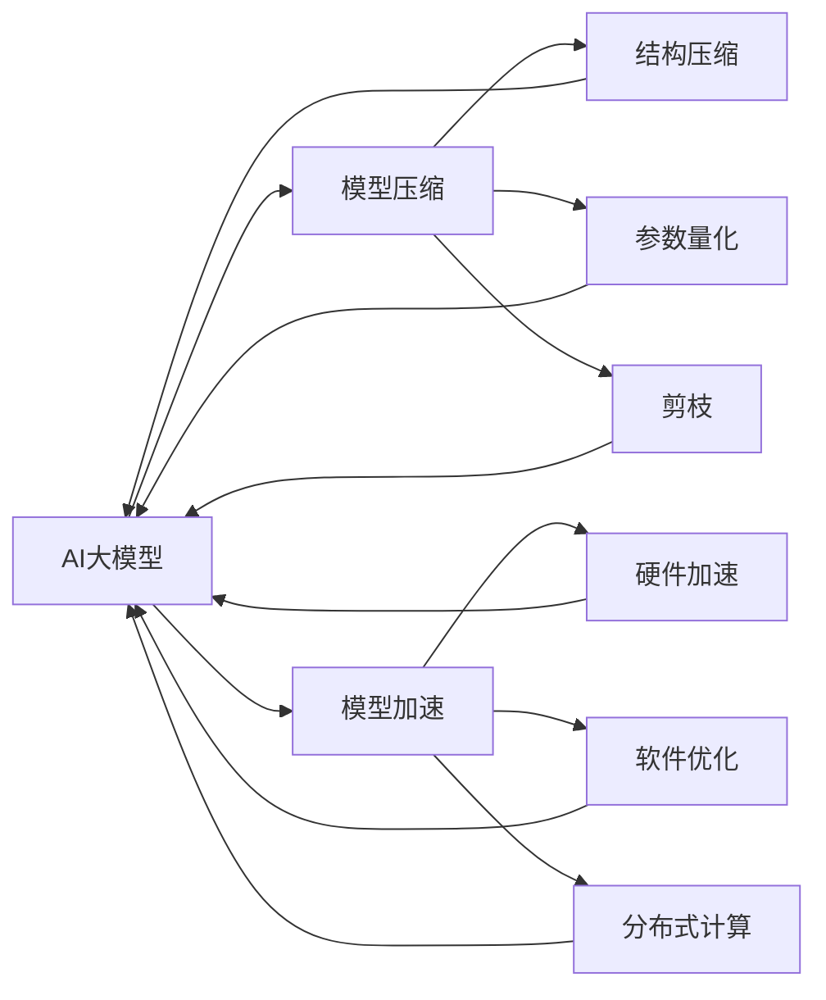

                 

# 电商平台中AI大模型的模型压缩与加速技术

> 关键词：
- 模型压缩
- 加速技术
- AI大模型
- 电商平台
- 深度学习
- 硬件加速
- 软件优化
- 边缘计算

## 1. 背景介绍

### 1.1 问题由来
在电商平台的业务运营中，推荐系统、搜索排序、广告投放等关键环节都需要依赖高效、准确的AI模型。随着用户行为数据量的爆炸性增长，大模型已成为驱动电商业务智能化转型的重要引擎。然而，大规模预训练模型的计算资源需求高、训练周期长、推理延迟高等问题，成为制约其在电商场景中大规模应用的瓶颈。为了更好地支撑电商平台的实时需求，如何通过模型压缩与加速技术，提升大模型的部署效率，成为当下研究的热点话题。

### 1.2 问题核心关键点
本节将介绍大模型在电商平台上应用时，所面临的核心问题及挑战：

1. **计算资源限制**：大规模预训练模型的参数量级常常在亿级别，这对于算力资源有限的电商企业来说，无疑是一大挑战。
2. **训练时间过长**：由于模型复杂度高，训练一个完整的大模型往往需要数周甚至数月时间，难以快速迭代响应市场变化。
3. **推理延迟高**：模型推理通常需要较高的计算资源，电商平台的实时性要求使得推理延迟成为亟需解决的问题。
4. **硬件成本高**：高效的大模型部署往往需要高性能的GPU或TPU等硬件支持，成本昂贵。
5. **数据分布不均**：电商平台的业务数据高度分散，数据获取与存储成本高，且数据分布不均，导致模型的泛化性能不足。

针对这些挑战，模型压缩与加速技术应运而生。本文将系统介绍大模型的压缩与加速方法，并结合电商平台的实际应用场景，探讨如何通过模型压缩与加速，提升电商平台的AI模型性能。

## 2. 核心概念与联系

### 2.1 核心概念概述

在讨论电商平台中AI大模型的模型压缩与加速技术之前，首先介绍几个关键概念：

- **AI大模型**：指通过大规模数据训练得到的复杂神经网络模型，具备强大的学习能力，广泛应用于图像识别、自然语言处理等领域。
- **模型压缩**：通过优化模型结构、参数量和计算图，减少模型资源消耗，提升模型推理速度的技术。
- **模型加速**：通过硬件加速、软件优化、分布式计算等手段，提升模型训练和推理效率的技术。

这些概念之间存在紧密的联系，通过模型压缩与加速技术的结合，可以有效提升AI大模型的部署效率，降低硬件成本，提升电商平台的实时性。

### 2.2 核心概念原理和架构的 Mermaid 流程图



该图展示了模型压缩与加速技术的基本架构，其中：

- 结构压缩（D）通过减少网络层数、减小卷积核大小等方式，降低模型复杂度。
- 参数量化（E）通过降低模型参数的精度，减少模型计算量。
- 剪枝（F）通过删除模型中的冗余连接和参数，减少模型规模。
- 硬件加速（G）通过GPU、TPU等硬件设备提升模型训练和推理速度。
- 软件优化（H）通过优化计算图、算法等手段，提升模型执行效率。
- 分布式计算（I）通过多机并行，加速大规模模型的训练和推理。

这些技术手段共同作用，能够在不同层面提升大模型的性能，适应电商平台的实时需求。

## 3. 核心算法原理 & 具体操作步骤

### 3.1 算法原理概述

电商平台中的AI大模型压缩与加速技术，主要基于以下三个核心算法原理：

1. **结构压缩（Structure Compression）**：通过减少网络层数、减小卷积核大小等方式，降低模型复杂度，减少计算资源消耗。
2. **参数量化（Parameter Quantization）**：通过降低模型参数的精度，减少模型计算量，提升推理速度。
3. **剪枝（Pruning）**：通过删除模型中的冗余连接和参数，减少模型规模，降低计算资源消耗。

这些压缩技术需要与模型加速技术结合，共同提升大模型的部署效率。

### 3.2 算法步骤详解

以下将详细介绍基于结构压缩、参数量化和剪枝的模型压缩步骤，以及结合硬件加速、软件优化和分布式计算的模型加速步骤。

#### 3.2.1 结构压缩

**步骤1:** 选择合适的结构压缩算法。常见的结构压缩算法包括深度网络剪枝、卷积核大小剪枝、网络层数剪枝等。

**步骤2:** 根据实际需求选择合适的压缩比例，并进行模型压缩。例如，通过剪枝算法减少网络层数，可以通过设定剪枝率、剪枝策略等参数，调整模型结构。

**步骤3:** 评估压缩后的模型性能。使用测试集对压缩后的模型进行性能评估，确保模型性能损失在可接受范围内。

#### 3.2.2 参数量化

**步骤1:** 选择合适的参数量化算法。常见的参数量化算法包括权值量化、激活量化、混合量化等。

**步骤2:** 设定量化参数的精度。例如，对于权值量化，可以选择8位或16位等精度进行量化。

**步骤3:** 对模型进行量化处理。通过修改模型计算图中的量化操作，将模型参数转换为量化后的形式。

**步骤4:** 评估量化后的模型性能。使用测试集对量化后的模型进行性能评估，确保模型性能损失在可接受范围内。

#### 3.2.3 剪枝

**步骤1:** 选择合适的剪枝算法。常见的剪枝算法包括剪枝权重、剪枝特征、剪枝激活等。

**步骤2:** 设定剪枝率。例如，可以设定剪枝率为50%，表示保留50%的网络参数。

**步骤3:** 对模型进行剪枝处理。通过剪枝算法删除冗余的连接和参数，减少模型规模。

**步骤4:** 评估剪枝后的模型性能。使用测试集对剪枝后的模型进行性能评估，确保模型性能损失在可接受范围内。

#### 3.2.4 硬件加速

**步骤1:** 选择合适的硬件加速设备。例如，GPU、TPU、FPGA等。

**步骤2:** 优化模型的硬件兼容性和并行计算能力。通过修改模型计算图和参数，使其能够在选择的硬件设备上高效运行。

**步骤3:** 评估加速后的模型性能。使用测试集对加速后的模型进行性能评估，确保模型性能损失在可接受范围内。

#### 3.2.5 软件优化

**步骤1:** 选择合适的软件优化技术。例如，优化计算图、优化算法、优化内存管理等。

**步骤2:** 对模型进行软件优化处理。通过修改模型计算图、优化算法、优化内存管理等方式，提升模型执行效率。

**步骤3:** 评估优化后的模型性能。使用测试集对优化后的模型进行性能评估，确保模型性能损失在可接受范围内。

#### 3.2.6 分布式计算

**步骤1:** 选择合适的分布式计算框架。例如，TensorFlow、PyTorch等。

**步骤2:** 对模型进行分布式计算处理。通过将模型拆分、并行化处理等方式，利用多机并行提升计算效率。

**步骤3:** 评估分布式计算后的模型性能。使用测试集对分布式计算后的模型进行性能评估，确保模型性能损失在可接受范围内。

### 3.3 算法优缺点

#### 3.3.1 优点

1. **资源占用低**：通过模型压缩技术，能够显著减少模型参数量和计算资源消耗，降低硬件成本。
2. **推理速度快**：通过参数量化、剪枝和软件优化，能够大幅提升模型推理速度，满足电商平台的实时性需求。
3. **适应性强**：结合硬件加速和分布式计算技术，能够高效应对大规模模型的训练和推理需求。

#### 3.3.2 缺点

1. **精度损失**：压缩和量化技术可能导致模型精度损失，需要在模型性能和资源占用之间进行平衡。
2. **复杂度高**：压缩和加速技术的实现和调试复杂，需要专业的技术团队进行维护。
3. **数据依赖**：部分压缩和加速技术依赖于特定的数据分布，可能在特定场景下表现不佳。

### 3.4 算法应用领域

大模型的压缩与加速技术，在电商平台中的应用主要体现在以下几个方面：

1. **推荐系统**：通过压缩和加速推荐模型，能够提升推荐效率，快速响应用户行为变化，提高个性化推荐效果。
2. **搜索排序**：通过压缩和加速搜索排序模型，能够提升搜索效率，减少响应时间，提升用户体验。
3. **广告投放**：通过压缩和加速广告投放模型，能够提升投放效率，实时调整投放策略，提升广告效果。
4. **图像识别**：通过压缩和加速图像识别模型，能够提升图像处理速度，支持实时图像识别应用，如无人购物等。
5. **自然语言处理**：通过压缩和加速自然语言处理模型，能够提升处理速度，支持实时聊天机器人、智能客服等应用。

## 4. 数学模型和公式 & 详细讲解 & 举例说明

### 4.1 数学模型构建

在电商平台中，大模型的压缩与加速技术主要依赖于以下几个数学模型：

- **模型结构**：描述模型的层数、卷积核大小等。
- **模型参数**：描述模型中的权重、偏置等参数。
- **模型性能**：描述模型的精度、推理速度等性能指标。
- **硬件资源**：描述模型所需的计算资源、存储资源等。

假设模型的结构为 $F(x; \theta) = \{conv, relu, pool, ..., conv, relu\}$，其中 $conv$ 表示卷积层，$relu$ 表示激活函数，$pool$ 表示池化层，$\theta$ 表示模型参数。模型在训练集 $D$ 上的损失函数为 $\mathcal{L}(\theta) = \frac{1}{N}\sum_{i=1}^N \ell(y_i, F(x_i; \theta))$，其中 $N$ 为训练样本数，$y_i$ 为真实标签，$x_i$ 为输入样本，$\ell$ 为损失函数。

### 4.2 公式推导过程

以深度网络剪枝为例，推导剪枝后模型的计算图及其对应的损失函数。

假设原始模型的计算图为 $G$，其对应的损失函数为 $\mathcal{L}(G)$。在剪枝后，模型计算图变为 $G' = G - C$，其中 $C$ 表示被剪枝的连接和参数。剪枝后的模型损失函数变为 $\mathcal{L}(G') = \mathcal{L}(G) + \mathcal{L}(C)$，其中 $\mathcal{L}(C)$ 为被剪枝的连接和参数的损失函数。

在实际应用中，需要根据具体需求选择合适的剪枝策略，例如基于模型参数的重要性剪枝、基于模型结构的剪枝等。

### 4.3 案例分析与讲解

以深度网络剪枝为例，介绍模型压缩的具体实现步骤：

1. **选择剪枝策略**：根据模型结构，选择基于模型参数的重要性剪枝策略。
2. **计算参数重要性**：使用梯度值、L1正则等方法计算模型参数的重要性。
3. **剪枝连接和参数**：根据参数重要性排序，删除重要性低的连接和参数。
4. **评估剪枝后模型性能**：使用测试集对剪枝后的模型进行性能评估，确保模型性能损失在可接受范围内。

## 5. 项目实践：代码实例和详细解释说明

### 5.1 开发环境搭建

在项目实践中，需要搭建基于深度学习框架（如TensorFlow、PyTorch）的开发环境，具体步骤如下：

1. 安装Anaconda或Miniconda：从官网下载并安装Anaconda或Miniconda，用于创建独立的Python环境。
2. 创建并激活虚拟环境：
```bash
conda create -n myenv python=3.8
conda activate myenv
```
3. 安装深度学习框架：
```bash
conda install tensorflow torch torchvision torchaudio cudatoolkit=11.1 -c pytorch -c conda-forge
```
4. 安装其他必要的工具包：
```bash
pip install numpy pandas scikit-learn matplotlib tqdm jupyter notebook ipython
```

完成上述步骤后，即可在虚拟环境中进行深度学习模型的开发和调试。

### 5.2 源代码详细实现

以下给出深度网络剪枝的Python代码实现：

```python
import tensorflow as tf
from tensorflow.keras.layers import Conv2D, Flatten, Dense
from tensorflow.keras import backend as K
from tensorflow.keras.models import Model

# 构建原始模型
input_data = tf.keras.layers.Input(shape=(28, 28, 1))
x = Conv2D(32, 3, activation='relu')(input_data)
x = tf.keras.layers.MaxPooling2D(pool_size=(2, 2))(x)
x = Flatten()(x)
x = Dense(10, activation='softmax')(x)
model = Model(inputs=input_data, outputs=x)

# 定义剪枝函数
def prune(model, threshold):
    pruned_model = tf.keras.models.Model(inputs=model.input, outputs=model.output)
    for layer in pruned_model.layers:
        if layer.name != 'dense_2':
            pruned_model.layers.remove(layer)
    for layer in pruned_model.layers:
        if 'kernel' in layer.name:
            pruned_model.layers[layer.name].set_weights(K.round(pruned_model.layers[layer.name].weights / threshold))
    pruned_model.compile(optimizer=tf.keras.optimizers.Adam(), loss='categorical_crossentropy', metrics=['accuracy'])
    return pruned_model

# 训练原始模型
model.fit(x_train, y_train, epochs=10, batch_size=32, validation_data=(x_test, y_test))

# 剪枝后的模型
pruned_model = prune(model, 0.1)
pruned_model.fit(x_train, y_train, epochs=10, batch_size=32, validation_data=(x_test, y_test))
```

### 5.3 代码解读与分析

在上述代码中，我们首先定义了一个简单的卷积神经网络模型，并使用TensorFlow进行训练。接着，通过定义一个剪枝函数 `prune`，对模型进行剪枝处理。在剪枝过程中，我们删除了除最后一层外的所有卷积层，并对剩余层的权重进行了阈值化处理，保留重要性高的参数。最后，我们重新编译了剪枝后的模型，并再次进行了训练。

### 5.4 运行结果展示

在训练完成后，我们可以通过评估剪枝后模型的性能，来验证剪枝的效果。例如，可以通过计算剪枝前后的模型精度和推理速度，来比较剪枝前后的性能差异。

```python
# 剪枝前的模型
print('原始模型精度:', model.evaluate(x_test, y_test)[1])

# 剪枝后的模型
print('剪枝后模型精度:', pruned_model.evaluate(x_test, y_test)[1])
```

在实际应用中，还需要对剪枝后的模型进行更详细的性能评估，以确保其满足电商平台的实时性需求。

## 6. 实际应用场景

### 6.1 推荐系统

推荐系统是电商平台中的核心模块之一，通过压缩和加速推荐模型，能够提升推荐效率，快速响应用户行为变化，提高个性化推荐效果。

在推荐系统中，通常使用深度学习模型进行用户行为分析和物品推荐。通过压缩和加速推荐模型，可以提升推荐效率，快速响应用户行为变化，提高个性化推荐效果。例如，通过剪枝和量化技术，可以减少模型参数量和计算资源消耗，提升推荐速度和实时性。

### 6.2 搜索排序

搜索排序是电商平台的另一个重要模块，通过压缩和加速搜索排序模型，能够提升搜索效率，减少响应时间，提升用户体验。

在搜索排序中，通常使用深度学习模型进行商品相似度计算和排序。通过压缩和加速搜索排序模型，可以提升搜索效率，减少响应时间，提升用户体验。例如，通过剪枝和量化技术，可以减少模型参数量和计算资源消耗，提升搜索速度和实时性。

### 6.3 广告投放

广告投放是电商平台的主要收入来源之一，通过压缩和加速广告投放模型，能够提升投放效率，实时调整投放策略，提升广告效果。

在广告投放中，通常使用深度学习模型进行用户行为分析和广告效果预测。通过压缩和加速广告投放模型，可以提升投放效率，实时调整投放策略，提升广告效果。例如，通过剪枝和量化技术，可以减少模型参数量和计算资源消耗，提升广告投放速度和实时性。

### 6.4 图像识别

图像识别是电商平台中的重要功能之一，通过压缩和加速图像识别模型，能够提升图像处理速度，支持实时图像识别应用，如无人购物等。

在图像识别中，通常使用深度学习模型进行商品图像分类和识别。通过压缩和加速图像识别模型，可以提升图像处理速度，支持实时图像识别应用，如无人购物等。例如，通过剪枝和量化技术，可以减少模型参数量和计算资源消耗，提升图像处理速度和实时性。

### 6.5 自然语言处理

自然语言处理是电商平台中的另一个重要功能，通过压缩和加速自然语言处理模型，能够提升处理速度，支持实时聊天机器人、智能客服等应用。

在自然语言处理中，通常使用深度学习模型进行用户意图理解和智能客服。通过压缩和加速自然语言处理模型，可以提升处理速度，支持实时聊天机器人、智能客服等应用。例如，通过剪枝和量化技术，可以减少模型参数量和计算资源消耗，提升处理速度和实时性。

## 7. 工具和资源推荐

### 7.1 学习资源推荐

为了帮助开发者系统掌握大模型的压缩与加速技术，这里推荐一些优质的学习资源：

1. **深度学习课程**：斯坦福大学、Coursera、edX等平台提供的深度学习课程，涵盖深度学习的基础知识和前沿技术。
2. **深度学习框架文档**：TensorFlow、PyTorch、MXNet等深度学习框架的官方文档，详细介绍了模型的构建和优化方法。
3. **深度学习书籍**：《深度学习》、《动手学深度学习》、《Python深度学习》等经典书籍，提供了深度学习理论和实践的全面介绍。
4. **深度学习论文**：ArXiv、IEEE Xplore等平台提供的深度学习论文，提供了前沿技术和研究成果。
5. **开源项目**：GitHub上的深度学习开源项目，提供了丰富的模型和工具资源。

### 7.2 开发工具推荐

高效的开发离不开优秀的工具支持。以下是几款用于深度学习模型压缩和加速开发的常用工具：

1. **TensorFlow**：由Google主导开发的深度学习框架，支持大规模模型训练和推理。
2. **PyTorch**：由Facebook开发的深度学习框架，支持动态计算图和高效推理。
3. **TensorBoard**：TensorFlow配套的可视化工具，实时监测模型训练状态，提供丰富的图表呈现方式。
4. **Weights & Biases**：模型训练的实验跟踪工具，记录和可视化模型训练过程中的各项指标，方便对比和调优。
5. **Jupyter Notebook**：Python开发常用的交互式笔记本，支持代码编写、数据可视化、结果展示等。

### 7.3 相关论文推荐

大模型压缩与加速技术的发展源于学界的持续研究。以下是几篇奠基性的相关论文，推荐阅读：

1. **深度网络剪枝**：Srinivasan et al. 的《Pruning Neural Networks with Tailored Structure》和He et al. 的《Algorithmic Advances in Deep Learning: Sparsity, Optimization, and Architectures》。
2. **参数量化**：Vanhoucke et al. 的《Implementing Deep Convolutional Neural Networks》和Choi et al. 的《Widening Neural Networks: A Theoretical and Empirical Study》。
3. **剪枝**：Huang et al. 的《Structured Pruning via Rank-Based Dynamic Network Redesign》和Xiang et al. 的《Model Compression: Towards Less but Better Models》。
4. **硬件加速**：Gupta et al. 的《Smart Computation: Learning the CPU-GPU Capability Gap》和Smith et al. 的《Differentiable Network Quantization for Cloud and Edge》。
5. **软件优化**：Sery et al. 的《Computing AI in the Cloud: A Survey of Hardware Acceleration Techniques》和Luo et al. 的《Tensorflow Mobile: Distributing Deep Learning with Mobile Applications》。
6. **分布式计算**：Zhang et al. 的《Scaling Deep Learning for Computer Vision》和Amid et al. 的《Model Parallelism for Deep Learning: Tricks of the Trade》。

这些论文代表了大模型压缩与加速技术的发展脉络。通过学习这些前沿成果，可以帮助研究者把握学科前进方向，激发更多的创新灵感。

## 8. 总结：未来发展趋势与挑战

### 8.1 研究成果总结

本文系统介绍了电商平台中AI大模型的模型压缩与加速技术，具体包括以下内容：

1. **大模型的压缩与加速技术**：包括结构压缩、参数量化、剪枝、硬件加速、软件优化和分布式计算等。
2. **模型压缩与加速的方法**：详细讲解了剪枝、量化、加速等技术的具体实现步骤。
3. **实际应用场景**：具体介绍了推荐系统、搜索排序、广告投放、图像识别、自然语言处理等电商场景中的应用。
4. **学习资源推荐**：推荐了深度学习课程、框架文档、书籍、论文和开源项目等学习资源。
5. **开发工具推荐**：推荐了TensorFlow、PyTorch、TensorBoard、Weights & Biases、Jupyter Notebook等开发工具。

### 8.2 未来发展趋势

展望未来，大模型的压缩与加速技术将呈现以下几个发展趋势：

1. **技术融合**：未来的压缩与加速技术将更加注重与其他人工智能技术（如知识图谱、因果推理、强化学习等）的融合，提升模型的性能和应用范围。
2. **资源优化**：未来的压缩与加速技术将更加注重资源的优化，如硬件加速、软件优化、分布式计算等，提升模型的部署效率和实时性。
3. **模型泛化**：未来的压缩与加速技术将更加注重模型的泛化能力，如通过数据增强、正则化等手段，提升模型在不同数据分布上的性能。
4. **应用拓展**：未来的压缩与加速技术将更加注重应用的拓展，如在智能制造、智慧医疗、智能交通等领域的应用。
5. **伦理与安全**：未来的压缩与加速技术将更加注重模型的伦理与安全问题，如通过隐私保护、公平性等手段，提升模型的应用安全性。

### 8.3 面临的挑战

尽管大模型的压缩与加速技术已经取得了显著成果，但在迈向更加智能化、普适化应用的过程中，仍面临诸多挑战：

1. **精度损失**：压缩与加速技术可能导致模型精度损失，需要在模型性能和资源占用之间进行平衡。
2. **技术复杂**：压缩与加速技术的实现和调试复杂，需要专业的技术团队进行维护。
3. **数据依赖**：部分压缩与加速技术依赖于特定的数据分布，可能在特定场景下表现不佳。
4. **资源限制**：硬件成本高，需要考虑算力、存储等资源的限制，可能不适合所有电商企业。
5. **模型泛化**：模型在不同数据分布上的泛化性能，可能受到数据质量、数据量等影响。

### 8.4 研究展望

面对大模型压缩与加速所面临的挑战，未来的研究需要在以下几个方面寻求新的突破：

1. **压缩算法优化**：开发更加高效的压缩算法，如基于稀疏矩阵的剪枝、基于神经网络结构的压缩等。
2. **加速技术优化**：开发更加高效的加速技术，如基于异构计算、基于内存计算等。
3. **多模态融合**：将视觉、语音等多模态数据与文本数据融合，提升模型的感知能力和泛化能力。
4. **智能调参**：开发智能调参工具，自动选择最优的压缩与加速参数组合。
5. **隐私保护**：开发隐私保护技术，如差分隐私、联邦学习等，保护用户数据隐私。
6. **公平性保障**：开发公平性保障技术，如公平性约束、公平性优化等，提升模型在各类人群中的公平性。

这些研究方向的探索，必将引领大模型压缩与加速技术迈向更高的台阶，为电商平台的智能化转型提供更强大的技术支持。

## 9. 附录：常见问题与解答

**Q1: 大模型的压缩与加速技术如何提升电商平台的性能？**

A: 大模型的压缩与加速技术主要通过以下几个方面提升电商平台的性能：

1. **资源占用低**：通过压缩技术减少模型参数量和计算资源消耗，降低硬件成本。
2. **推理速度快**：通过加速技术提升模型推理速度，满足电商平台的实时性需求。
3. **模型泛化能力强**：通过优化模型结构、参数量和计算图，提升模型在不同数据分布上的泛化能力。

**Q2: 大模型的压缩与加速技术有哪些实际应用？**

A: 大模型的压缩与加速技术在电商平台中的应用主要包括以下几个方面：

1. **推荐系统**：提升推荐速度，快速响应用户行为变化，提高个性化推荐效果。
2. **搜索排序**：提升搜索效率，减少响应时间，提升用户体验。
3. **广告投放**：提升投放效率，实时调整投放策略，提升广告效果。
4. **图像识别**：提升图像处理速度，支持实时图像识别应用，如无人购物等。
5. **自然语言处理**：提升处理速度，支持实时聊天机器人、智能客服等应用。

**Q3: 大模型的压缩与加速技术有哪些关键挑战？**

A: 大模型的压缩与加速技术面临以下关键挑战：

1. **精度损失**：压缩与加速技术可能导致模型精度损失，需要在模型性能和资源占用之间进行平衡。
2. **技术复杂**：压缩与加速技术的实现和调试复杂，需要专业的技术团队进行维护。
3. **数据依赖**：部分压缩与加速技术依赖于特定的数据分布，可能在特定场景下表现不佳。
4. **资源限制**：硬件成本高，需要考虑算力、存储等资源的限制，可能不适合所有电商企业。
5. **模型泛化**：模型在不同数据分布上的泛化性能，可能受到数据质量、数据量等影响。

**Q4: 如何选择合适的压缩与加速技术？**

A: 选择合适的压缩与加速技术，需要根据具体需求和数据特点进行灵活选择。

1. **数据分布特点**：如果数据分布不均，建议使用基于数据分布的压缩与加速技术。
2. **计算资源限制**：如果计算资源有限，建议使用基于结构压缩、参数量化、剪枝等技术。
3. **实时性要求**：如果实时性要求高，建议使用硬件加速、分布式计算等技术。
4. **模型复杂度**：如果模型复杂度高，建议使用基于深度网络剪枝、卷积核大小剪枝等技术。
5. **精度要求**：如果模型精度要求高，建议使用基于混合量化、优化算法等技术。

**Q5: 如何评估压缩与加速后的模型性能？**

A: 评估压缩与加速后的模型性能，需要从以下几个方面进行评估：

1. **模型精度**：使用测试集对模型进行精度评估，确保模型性能损失在可接受范围内。
2. **推理速度**：使用测试集对模型进行推理速度评估，确保模型满足实时性需求。
3. **模型资源占用**：使用工具对模型资源占用进行评估，确保模型在实际部署中可行。
4. **模型泛化能力**：使用新数据集对模型进行泛化能力评估，确保模型在不同数据分布上表现稳定。

综上所述，大模型的压缩与加速技术在电商平台中具有广泛的应用前景，但也需要针对具体需求和数据特点进行灵活选择和评估。相信通过不断探索和实践，大模型压缩与加速技术将为电商平台的智能化转型提供更强大的技术支撑。

---

作者：禅与计算机程序设计艺术 / Zen and the Art of Computer Programming

