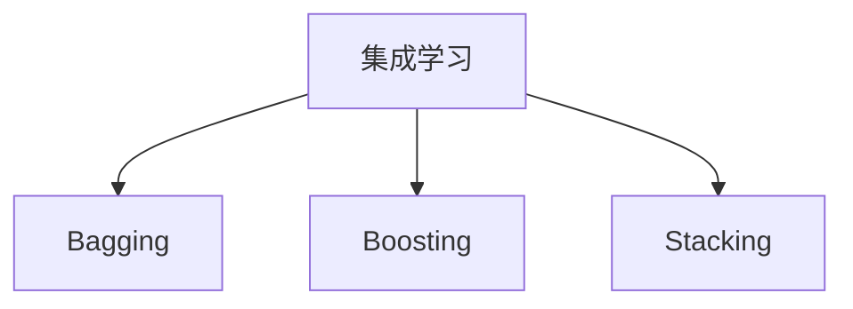

                 

# 电商平台中的AI大模型：从单一算法到集成学习

## 1. 背景介绍

### 1.1 问题由来

在互联网商业时代，电商平台成为了数字化交易的核心平台。通过智能算法，电商平台不仅能提升用户体验，还能大幅度提升运营效率和转化率。近年来，随着深度学习技术的发展，AI大模型在电商平台中得到了广泛应用，如智能推荐、智能客服、风险控制、价格预测等，极大地提升了电商平台的智能化水平。

目前，深度学习模型在电商平台的应用主要基于单一算法的逻辑，如基于协同过滤的推荐系统、基于序列模型的时间序列预测模型等。这些单一算法虽各有优势，但应用场景单一，难以覆盖电商平台的全面需求。如何构建更加强大、灵活、高效的AI模型，成为电商平台智能化升级的关键问题。

## 2. 核心概念与联系

### 2.1 核心概念概述

为了解决单一算法在电商平台中的应用局限，集成学习（Ensemble Learning）成为了一种有效的解决方案。集成学习通过结合多个单一算法的优点，在提升模型性能的同时，还能增强模型的稳定性和鲁棒性。

- **集成学习**：集成多个单一算法的输出，通过投票、加权平均等方式得到最终预测结果的技术。常见的集成方法包括Bagging、Boosting、Stacking等。
- **Bagging**：基于自助采样（Bootstrap Sampling）的集成方法，通过生成多个子样本集，分别训练多个模型，然后取平均输出，以降低模型方差。
- **Boosting**：通过迭代训练，逐步提高模型的预测准确率，最后通过加权平均得到最终的预测结果。常见的Boosting算法包括Adaboost、Gradient Boosting等。
- **Stacking**：将多个单一模型的输出作为输入，训练一个元模型（Meta Model）作为最终预测结果。元模型通常采用集成方法（如Boosting）。

这些核心概念之间的逻辑关系可以通过以下Mermaid流程图来展示：



## 3. 核心算法原理 & 具体操作步骤

### 3.1 算法原理概述

集成学习通过结合多个单一模型的输出，得到一个综合的预测结果。这种方法相比单一算法，具有更好的泛化能力和稳定性。其核心思想是利用模型的不确定性和互补性，构建一个整体性能更优的集成模型。

集成学习的原理可以通过下面的式子进行概括：

$$
F(X) = \sum_{k=1}^{K} \frac{1}{K} f_k(X)
$$

其中，$F(X)$ 表示集成模型的输出，$K$ 为参与集成学习的单一模型个数，$f_k(X)$ 表示第 $k$ 个单一模型的输出。

### 3.2 算法步骤详解

集成学习的实现步骤如下：

1. **选择单一算法**：根据任务特点选择适合的单一算法，如线性回归、随机森林、梯度提升树等。
2. **训练多个单一模型**：生成多个子样本集，分别训练多个单一模型，保证每个单一模型的预测结果具有多样性。
3. **集成模型输出**：将多个单一模型的预测结果进行加权平均或投票等操作，得到集成模型的最终预测结果。
4. **模型评估与优化**：使用验证集评估集成模型的性能，根据性能指标调整单一模型权重和样本生成方式。

### 3.3 算法优缺点

**优点**：
- 提高模型性能：通过结合多个单一算法的输出，集成模型通常能获得更好的预测结果。
- 降低模型方差：单一模型存在随机性，集成模型通过多样性降低了预测的不确定性。
- 增加鲁棒性：多个单一模型的共同作用，增强了模型的鲁棒性，对抗过拟合。

**缺点**：
- 计算复杂度高：集成学习需要训练多个单一模型，增加了计算复杂度。
- 可解释性差：集成模型的内部机制复杂，难以进行细致解释。
- 过拟合风险：单一模型的过拟合风险会传递到集成模型中。

### 3.4 算法应用领域

集成学习在电商平台中有着广泛的应用场景：

- **智能推荐**：结合基于协同过滤、深度学习等单一算法，通过集成学习提升推荐系统的综合性能。
- **智能客服**：集成多种单一算法构建自然语言理解模型，提升客户对话的质量和效率。
- **风险控制**：结合单一算法构建信用评分模型，通过集成学习提高风险评估的准确性。
- **价格预测**：结合多种单一算法构建价格预测模型，通过集成学习提升预测精度。

## 4. 数学模型和公式 & 详细讲解 & 举例说明

### 4.1 数学模型构建

集成学习的数学模型可以概括为如下形式：

$$
F(X) = \sum_{k=1}^{K} w_k f_k(X)
$$

其中，$w_k$ 表示第 $k$ 个单一模型的权重，$f_k(X)$ 表示第 $k$ 个单一模型的输出，$w_k$ 的取值通常需要通过交叉验证等方法确定。

### 4.2 公式推导过程

以随机森林（Random Forest）算法为例，其集成模型输出为多个决策树的平均预测结果。假设有一个决策树 $f_k(x)$，对于输入样本 $x$，随机森林的集成模型输出为：

$$
F(x) = \frac{1}{N} \sum_{i=1}^{N} f_k(x)
$$

其中，$N$ 为随机森林中决策树的数量。

### 4.3 案例分析与讲解

以电商平台的智能推荐系统为例，假设该系统使用了基于协同过滤和深度学习的两个单一模型，分别记为模型 $A$ 和模型 $B$。每个模型都基于一定的子样本集进行训练。集成学习的具体步骤如下：

1. 使用协同过滤模型 $A$ 和深度学习模型 $B$ 分别训练两个单一模型，得到两个模型的预测结果。
2. 使用交叉验证等方法评估两个单一模型的性能，分别得到权重 $w_A$ 和 $w_B$。
3. 将两个单一模型的预测结果进行加权平均，得到集成模型的最终预测结果 $F(x)$。

集成模型的输出可以表达为：

$$
F(x) = w_A f_A(x) + w_B f_B(x)
$$

其中，$w_A$ 和 $w_B$ 的取值需要通过交叉验证等方法确定，以保证集成模型的性能最优。

## 5. 项目实践：代码实例和详细解释说明

### 5.1 开发环境搭建

在进行集成学习项目实践前，需要准备好开发环境。以下是使用Python进行Scikit-learn库开发的环境配置流程：

1. 安装Anaconda：从官网下载并安装Anaconda，用于创建独立的Python环境。
2. 创建并激活虚拟环境：
```bash
conda create -n sklearn-env python=3.8 
conda activate sklearn-env
```

3. 安装Scikit-learn：
```bash
pip install scikit-learn
```

4. 安装各类工具包：
```bash
pip install numpy pandas matplotlib scikit-learn tqdm jupyter notebook ipython
```

完成上述步骤后，即可在`sklearn-env`环境中开始集成学习项目实践。

### 5.2 源代码详细实现

这里我们以电商平台的智能推荐系统为例，给出使用Scikit-learn库进行集成学习的PyTorch代码实现。

首先，定义推荐系统数据处理函数：

```python
import pandas as pd
import numpy as np
from sklearn.model_selection import train_test_split
from sklearn.ensemble import RandomForestRegressor, AdaBoostRegressor
from sklearn.linear_model import LinearRegression

# 加载数据集
df = pd.read_csv('recommendation_data.csv')
df.head()

# 数据预处理
features = df.drop('label', axis=1)
labels = df['label']
features, labels = train_test_split(features, labels, test_size=0.2, random_state=42)

# 定义单一算法
models = {
    'RandomForest': RandomForestRegressor(n_estimators=100, random_state=42),
    'AdaBoost': AdaBoostRegressor(n_estimators=100, random_state=42),
    'LinearRegression': LinearRegression()
}

# 训练多个单一模型
for name, model in models.items():
    model.fit(features, labels)
    df[name] = model.predict(features)

# 集成模型输出
from sklearn.ensemble import VotingRegressor

# 集成模型
voting_model = VotingRegressor(estimators=models.items(), weights=[1, 1, 1])
voting_model.fit(features, labels)
df['Voting'] = voting_model.predict(features)
```

然后，定义模型评估函数：

```python
from sklearn.metrics import mean_squared_error

def evaluate_model(model):
    predictions = model.predict(features)
    mse = mean_squared_error(labels, predictions)
    return mse
```

最后，启动集成学习流程并在测试集上评估：

```python
from sklearn.ensemble import BaggingRegressor

# 集成多个单一模型
bagging_model = BaggingRegressor(base_estimator=models['RandomForest'], n_estimators=10, random_state=42)
bagging_model.fit(features, labels)
bagging_predictions = bagging_model.predict(features)
bagging_mse = mean_squared_error(labels, bagging_predictions)

# 模型评估
print(f'Voting Model MSE: {evaluate_model(voting_model)}')
print(f'Bagging Model MSE: {bagging_mse}')
```

以上就是使用Scikit-learn库对电商推荐系统进行集成学习的完整代码实现。可以看到，Scikit-learn库封装了多种集成学习算法，使用起来非常便捷。

### 5.3 代码解读与分析

让我们再详细解读一下关键代码的实现细节：

**recommendation_data.csv**：
- 推荐系统数据集，包含用户行为记录和商品评分等特征。

**models字典**：
- 定义了三个单一模型：随机森林、梯度提升树、线性回归。

**单一模型训练**：
- 使用Scikit-learn库的API训练多个单一模型，并将预测结果保存到数据框中。

**VotingRegressor集成模型**：
- 使用Scikit-learn库的VotingRegressor类构建集成模型，并训练得到最终预测结果。

**模型评估**：
- 使用均方误差（MSE）评估模型性能，并输出结果。

## 6. 实际应用场景

### 6.1 智能推荐系统

智能推荐系统是电商平台的核心功能之一。传统的推荐算法如协同过滤、基于内容的推荐等，往往单一且效果有限。通过集成学习，可以将多种推荐算法结合，提升推荐系统的综合性能。

在实际应用中，可以构建基于协同过滤、基于内容的推荐、基于深度学习的推荐等单一模型，并使用集成学习算法进行融合。通过组合这些单一模型的预测结果，可以提高推荐系统的准确性和多样性，满足不同用户的多样化需求。

### 6.2 风险控制

电商平台的信用评分和风险控制是其运营中的重要环节。传统的风险控制算法如逻辑回归、决策树等，单一且效果有限。通过集成学习，可以结合多种单一算法，提升风险评估的准确性和鲁棒性。

在实际应用中，可以构建基于逻辑回归、决策树、神经网络等单一模型，并使用集成学习算法进行融合。通过组合这些单一模型的预测结果，可以提高风险评估的准确性和鲁棒性，降低平台的风险。

### 6.3 个性化推荐

个性化推荐系统是电商平台的重要功能之一。传统的个性化推荐算法如基于协同过滤的推荐、基于用户画像的推荐等，单一且效果有限。通过集成学习，可以将多种个性化推荐算法结合，提升推荐系统的综合性能。

在实际应用中，可以构建基于协同过滤、基于用户画像的推荐、基于深度学习的推荐等单一模型，并使用集成学习算法进行融合。通过组合这些单一模型的预测结果，可以提高推荐系统的准确性和多样性，满足不同用户的个性化需求。

### 6.4 未来应用展望

随着深度学习技术的不断发展，基于集成学习的AI模型在电商平台中的应用前景广阔。未来，集成学习将会在更多领域得到应用，为电商平台带来新的变革。

在智慧物流领域，基于集成学习的路径规划和配送优化算法将提升物流效率，降低成本。在客户服务领域，基于集成学习的多渠道客户对话分析系统将提升服务质量，降低运营成本。在营销策略领域，基于集成学习的大数据分析和消费者行为预测模型将优化营销策略，提升广告投放效果。

## 7. 工具和资源推荐

### 7.1 学习资源推荐

为了帮助开发者系统掌握集成学习技术的理论基础和实践技巧，这里推荐一些优质的学习资源：

1. 《机器学习实战》系列博文：由大模型技术专家撰写，深入浅出地介绍了集成学习原理、算法优化等前沿话题。

2. 《深度学习与强化学习》课程：斯坦福大学开设的深度学习课程，涵盖了深度学习、强化学习的基础知识和最新进展。

3. 《集成学习：理论与算法》书籍：集成学习领域的经典著作，详细介绍了各种集成算法的设计和应用。

4. Scikit-learn官方文档：Scikit-learn库的官方文档，提供了丰富的集成学习样例和API接口，是上手实践的必备资料。

5. Kaggle竞赛平台：全球最大的数据科学竞赛平台，提供了大量集成学习竞赛样例，帮助开发者提升实践能力。

通过对这些资源的学习实践，相信你一定能够快速掌握集成学习技术的精髓，并用于解决实际的电商平台问题。

### 7.2 开发工具推荐

高效的开发离不开优秀的工具支持。以下是几款用于集成学习开发的常用工具：

1. PyTorch：基于Python的开源深度学习框架，灵活动态的计算图，适合快速迭代研究。

2. TensorFlow：由Google主导开发的开源深度学习框架，生产部署方便，适合大规模工程应用。

3. Scikit-learn：开源机器学习库，提供了丰富的集成学习算法，易于使用。

4. H2O.ai：支持集成学习的高性能机器学习平台，提供了丰富的集成学习算法和可视化工具。

5. PyCaret：自动化的机器学习平台，提供了多种集成学习算法和可视化工具。

合理利用这些工具，可以显著提升集成学习任务的开发效率，加快创新迭代的步伐。

### 7.3 相关论文推荐

集成学习在电商平台中的应用已经取得了许多进展。以下是几篇奠基性的相关论文，推荐阅读：

1. AdaBoost算法：提出了AdaBoost算法，在集成学习中广泛应用。

2. Bagging算法：提出了Bagging算法，通过生成多个子样本集，降低模型方差。

3. Gradient Boosting算法：提出了梯度提升算法，逐步提高模型的预测准确率。

4. Voting算法：提出了Voting算法，通过加权平均得到最终的预测结果。

5. Stacking算法：提出了Stacking算法，结合多个单一模型的输出，训练一个元模型。

这些论文代表了大语言模型微调技术的发展脉络。通过学习这些前沿成果，可以帮助研究者把握学科前进方向，激发更多的创新灵感。

## 8. 总结：未来发展趋势与挑战

### 8.1 总结

本文对电商平台中的AI大模型从单一算法到集成学习的思路进行了全面系统的介绍。首先阐述了电商平台的智能化需求和单一算法的局限性，明确了集成学习在提升模型性能、稳定性和鲁棒性方面的独特价值。其次，从原理到实践，详细讲解了集成学习的数学原理和关键步骤，给出了电商推荐系统开发的完整代码实例。同时，本文还广泛探讨了集成学习在智能推荐、风险控制、个性化推荐等多个电商应用场景中的应用前景，展示了集成学习的巨大潜力。

通过本文的系统梳理，可以看到，基于集成学习的AI模型在电商平台中的应用前景广阔。这些方向的探索发展，必将进一步提升电商平台智能化水平，为电商平台的运营和用户提供更优质的体验。

### 8.2 未来发展趋势

展望未来，基于集成学习的AI模型在电商平台中的应用将呈现以下几个发展趋势：

1. 多模态融合：将图像、视频、语音等多模态数据与文本数据结合，提升电商平台的智能化水平。

2. 实时学习：通过在线学习（Online Learning）和增量学习（Incremental Learning）等技术，实现实时模型更新，提高电商平台的动态响应能力。

3. 分布式优化：通过分布式训练和优化技术，实现大规模模型的并行训练和推理，提升电商平台的计算效率。

4. 模型压缩与加速：通过模型压缩、剪枝、量化等技术，减少模型参数量，提升计算速度，降低存储成本。

5. 融合AI伦理：将AI伦理、可解释性、隐私保护等技术融入电商平台的AI模型中，确保模型行为符合伦理规范。

这些趋势凸显了集成学习技术的广阔前景。这些方向的探索发展，必将进一步提升电商平台的智能化水平，为电商平台的运营和用户提供更优质的体验。

### 8.3 面临的挑战

尽管基于集成学习的AI模型在电商平台中已经取得了许多进展，但在迈向更加智能化、普适化应用的过程中，它仍面临着诸多挑战：

1. 数据多样性和异质性：电商平台的交易数据存在多样性和异质性，如何构建统一的特征表示和模型训练框架，是一个重要的挑战。

2. 计算资源限制：大规模模型的训练和推理需要大量的计算资源，如何优化计算图、加速模型训练和推理，是一个亟待解决的问题。

3. 模型鲁棒性不足：电商平台的AI模型需要应对不同业务场景和用户行为，如何提升模型的鲁棒性和泛化能力，是一个需要重点研究的课题。

4. 可解释性不足：电商平台的AI模型通常是一个黑盒系统，难以解释其内部工作机制和决策逻辑。如何提升模型的可解释性，是一个重要的研究方向。

5. 数据隐私和安全：电商平台的交易数据涉及用户的隐私信息，如何保障数据隐私和安全，是一个需要重点关注的课题。

6. 模型公平性和透明性：电商平台的AI模型需要公平透明地对待所有用户，如何避免模型偏见和歧视，是一个需要重点研究的课题。

这些挑战凸显了集成学习技术的复杂性，需要在数据、算法、工程等多个维度进行深入研究，方能构建高效、鲁棒、可解释、安全的AI模型。

### 8.4 研究展望

面向未来，大语言模型微调技术还需要在其他方面进行深入研究，以实现更加强大、灵活、高效的AI模型：

1. 探索无监督和半监督学习：摆脱对大量标注数据的依赖，利用自监督学习、主动学习等无监督和半监督范式，最大限度利用非结构化数据，实现更加灵活高效的集成学习。

2. 研究参数高效和计算高效的集成方法：开发更加参数高效和计算高效的集成算法，在固定模型参数量的情况下，实现更优的集成效果。

3. 引入更多先验知识：将符号化的先验知识，如知识图谱、逻辑规则等，与神经网络模型进行巧妙融合，提升模型的综合性能。

4. 融合因果分析和博弈论工具：将因果分析方法引入集成学习模型，识别出模型决策的关键特征，增强输出解释的因果性和逻辑性。借助博弈论工具刻画人机交互过程，主动探索并规避模型的脆弱点，提高系统稳定性。

5. 引入AI伦理和隐私保护技术：将AI伦理、可解释性、隐私保护等技术融入电商平台的AI模型中，确保模型行为符合伦理规范，保障用户隐私安全。

这些研究方向将进一步拓展集成学习技术的应用边界，为电商平台智能化带来新的突破。只有勇于创新、敢于突破，才能不断拓展AI模型的边界，让智能技术更好地造福人类社会。

## 9. 附录：常见问题与解答

**Q1：电商平台的推荐系统如何应用集成学习？**

A: 电商平台的推荐系统可以结合多种单一推荐算法，如协同过滤、基于内容的推荐、基于深度学习的推荐等，通过集成学习算法进行融合。通过组合这些单一算法的预测结果，可以提高推荐系统的准确性和多样性，满足不同用户的多样化需求。

**Q2：集成学习在电商风险控制中如何应用？**

A: 电商平台的信用评分和风险控制需要结合多种单一算法，如逻辑回归、决策树、神经网络等，通过集成学习算法进行融合。通过组合这些单一算法的预测结果，可以提高风险评估的准确性和鲁棒性，降低平台的风险。

**Q3：电商平台的个性化推荐系统如何应用集成学习？**

A: 电商平台的个性化推荐系统可以结合多种单一个性化推荐算法，如基于协同过滤的推荐、基于用户画像的推荐、基于深度学习的推荐等，通过集成学习算法进行融合。通过组合这些单一算法的预测结果，可以提高推荐系统的准确性和多样性，满足不同用户的个性化需求。

**Q4：集成学习在电商平台中的应用前景如何？**

A: 集成学习在电商平台中的应用前景广阔。通过结合多种单一算法，可以提升推荐系统、风险控制、个性化推荐等核心功能的性能和鲁棒性。未来，集成学习技术还将广泛应用于智慧物流、客户服务、营销策略等多个电商领域，推动电商平台的智能化升级。

---

作者：禅与计算机程序设计艺术 / Zen and the Art of Computer Programming

