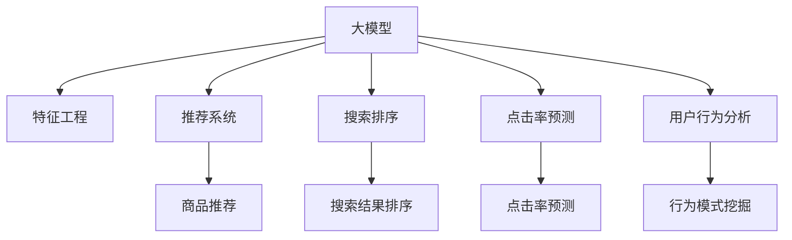

                 

# 电商平台中的AI大模型：从特征工程到端到端学习

> 关键词：电商平台, 大模型, 特征工程, 端到端学习, 深度学习, 推荐系统, 自然语言处理(NLP), 电商数据分析, 用户行为分析, 商品推荐, 搜索排序, 点击率预测

## 1. 背景介绍

### 1.1 问题由来

随着电子商务市场的迅猛发展，电商平台日益成为消费者获取商品信息和购买决策的重要渠道。然而，海量的商品和用户数据背后隐藏着巨大的信息不对称和搜索成本，使得用户难以在短时间内快速找到自己心仪的商品。为了解决这个问题，各大电商平台纷纷引入人工智能技术，以提升搜索、推荐、排序等功能的智能化程度，改善用户体验，增加用户粘性和转化率。

当前，AI技术在电商平台中的应用主要集中在以下几个方面：

- **推荐系统**：通过分析用户的历史行为数据，为用户推荐可能感兴趣的商品。
- **搜索排序**：优化搜索结果的排序算法，提升用户搜索体验。
- **点击率预测**：预测用户对搜索结果的点击概率，优化广告投放和SEO策略。
- **自然语言处理(NLP)**：解析用户查询意图，提供自然语言搜索功能。
- **用户行为分析**：挖掘用户行为模式，提升广告投放和个性化推荐的效果。

这些应用场景通常都需要对大规模数据进行复杂且耗时的特征工程。而大模型（如BERT、GPT、RNN等）通过在海量数据上进行预训练，能够高效提取数据特征，从而大幅提升AI系统性能。本文将从特征工程到端到端学习的角度，系统阐述AI大模型在电商平台中的应用，希望为电商领域的技术开发者提供借鉴。

### 1.2 问题核心关键点

为了更好地理解AI大模型在电商平台中的应用，我们首先阐述几个核心概念：

1. **大模型**：指通过大规模数据进行预训练的深度学习模型，如BERT、GPT、RNN等，能够自动学习数据的高级特征，提升模型泛化能力。

2. **特征工程**：在模型训练前，对原始数据进行预处理、特征提取、归一化等操作，以提高模型的预测准确度。

3. **端到端学习**：通过构建完整的模型训练流程，直接从原始数据到最终预测输出，无需手动提取特征。

4. **推荐系统**：基于用户历史行为数据，为用户推荐可能感兴趣的商品或内容。

5. **搜索排序**：优化搜索结果的排序算法，提升用户搜索体验。

6. **点击率预测**：预测用户对搜索结果的点击概率，优化广告投放和SEO策略。

7. **用户行为分析**：挖掘用户行为模式，提升广告投放和个性化推荐的效果。

这些核心概念之间的逻辑关系可以通过以下Mermaid流程图来展示：



这个流程图展示了电商平台上AI大模型的应用链条：大模型通过特征工程从原始数据中提取高级特征，再通过推荐系统、搜索排序、点击率预测、用户行为分析等端到端学习环节，提升电商平台的智能化水平，优化用户体验。

## 2. 核心概念与联系

### 2.1 核心概念概述

为更好地理解AI大模型在电商平台中的应用，本节将介绍几个密切相关的核心概念：

- **大模型**：指通过大规模数据进行预训练的深度学习模型，如BERT、GPT、RNN等，能够自动学习数据的高级特征，提升模型泛化能力。

- **特征工程**：在模型训练前，对原始数据进行预处理、特征提取、归一化等操作，以提高模型的预测准确度。

- **端到端学习**：通过构建完整的模型训练流程，直接从原始数据到最终预测输出，无需手动提取特征。

- **推荐系统**：基于用户历史行为数据，为用户推荐可能感兴趣的商品或内容。

- **搜索排序**：优化搜索结果的排序算法，提升用户搜索体验。

- **点击率预测**：预测用户对搜索结果的点击概率，优化广告投放和SEO策略。

- **用户行为分析**：挖掘用户行为模式，提升广告投放和个性化推荐的效果。

这些核心概念之间的联系可以通过以下方式展示：

1. **数据预处理**：电商平台上的数据通常包括用户行为数据、商品描述数据、用户反馈数据等。数据预处理是特征工程的重要环节，如清洗噪声、填充缺失值、归一化等。

2. **特征提取**：通过对预处理后的数据进行特征提取，得到模型所需的高维特征。特征提取可以手工设计，也可以利用深度学习模型自动学习。

3. **模型训练**：构建大模型，如BERT、GPT等，通过预训练和微调，学习数据的高级特征，提升模型泛化能力。

4. **模型应用**：将训练好的模型应用于推荐系统、搜索排序、点击率预测、用户行为分析等电商应用场景，优化用户体验和业务效果。

5. **反馈循环**：模型应用效果可以通过业务数据进行反馈，如点击率、购买率、用户满意度等，进一步优化模型训练和特征工程。

通过理解这些核心概念及其联系，我们可以更好地把握大模型在电商平台中的应用范式，并进行系统优化。

## 3. 核心算法原理 & 具体操作步骤
### 3.1 算法原理概述

AI大模型在电商平台中的应用，本质上是一个从数据预处理到模型训练再到模型应用的完整流程。其主要包括以下几个关键步骤：

- **数据预处理**：清洗、归一化、特征提取等预处理操作，以提升模型训练数据的质量。
- **特征提取**：通过大模型自动学习数据的高级特征，提升模型的泛化能力。
- **模型训练**：在电商数据集上进行预训练和微调，学习数据特征，提升模型性能。
- **模型应用**：将训练好的模型应用于推荐系统、搜索排序、点击率预测、用户行为分析等电商应用场景。

### 3.2 算法步骤详解

以下是AI大模型在电商平台中应用的核心算法步骤：

**Step 1: 数据预处理**

电商数据通常包括用户行为数据、商品描述数据、用户反馈数据等。数据预处理的主要任务是清洗数据、填补缺失值、归一化等，以提升模型训练数据的质量。

1. **数据清洗**：去除重复、噪声数据，修正错误数据。例如，去除用户重复点击行为，修正商品价格异常数据。

2. **数据填充**：对缺失值进行填充，保证数据完整性。例如，对于缺失的用户评分，可以通过平均值、中位数等方法进行填充。

3. **数据归一化**：对数据进行归一化处理，以提升模型的泛化能力。例如，对用户评分进行标准化处理，使其分布在0-1之间。

**Step 2: 特征提取**

特征提取是将原始数据转换为模型所需的高维特征。电商数据通常具有高维度、非结构化的特点，因此需要借助大模型自动学习数据的高级特征。

1. **文本特征提取**：对于文本类数据，如商品描述、用户评论等，可以使用大模型如BERT、GPT等进行特征提取。具体步骤如下：
   - 对文本进行分词、标记，得到文本编码。
   - 使用BERT、GPT等预训练模型对文本编码进行特征提取，得到高维文本特征向量。

2. **数值特征提取**：对于数值类数据，如用户评分、商品价格等，可以采用归一化、标准化等方法进行特征提取。

**Step 3: 模型训练**

模型训练是利用电商数据集对大模型进行预训练和微调的过程。预训练和微调的具体步骤包括：

1. **预训练**：在大规模无标签数据上进行预训练，学习数据的高级特征。例如，对于商品描述数据，可以使用BERT模型进行预训练，得到商品的语义表示。

2. **微调**：在电商数据集上进行微调，学习电商领域的特征。例如，在商品描述数据上微调BERT模型，得到更适合电商应用的特征。

**Step 4: 模型应用**

模型应用是将训练好的大模型应用于电商推荐系统、搜索排序、点击率预测、用户行为分析等场景的过程。具体步骤如下：

1. **商品推荐**：基于用户历史行为数据，使用推荐模型预测用户可能感兴趣的商品。例如，可以使用基于深度学习的推荐模型，如基于内容的推荐、协同过滤推荐等。

2. **搜索结果排序**：优化搜索结果的排序算法，提升用户搜索体验。例如，可以使用深度学习模型，如注意力机制、Transformer等，对搜索结果进行排序。

3. **点击率预测**：预测用户对搜索结果的点击概率，优化广告投放和SEO策略。例如，可以使用点击率预测模型，如LR、XGBoost、DNN等，对用户行为进行建模。

4. **用户行为分析**：挖掘用户行为模式，提升广告投放和个性化推荐的效果。例如，可以使用深度学习模型，如LSTM、GRU等，对用户行为进行建模。

### 3.3 算法优缺点

AI大模型在电商平台中的应用，具有以下优点：

1. **高效性**：大模型能够自动学习数据的高级特征，避免了手动设计特征的复杂性和高成本。

2. **泛化能力**：通过在大规模数据上进行预训练，大模型能够学习到数据的通用特征，提升模型的泛化能力。

3. **灵活性**：大模型可以应用于电商推荐系统、搜索排序、点击率预测、用户行为分析等各个场景，满足电商业务需求的多样性和复杂性。

然而，大模型在电商平台中的应用也存在以下缺点：

1. **计算资源消耗高**：大模型通常需要较大的计算资源和存储资源，如GPU/TPU等高性能设备。

2. **部署复杂**：大模型需要在服务器上进行训练和推理，部署过程复杂，需要考虑模型裁剪、量化加速、服务化封装等。

3. **解释性不足**：大模型的预测结果通常难以解释，缺乏可解释性，难以满足电商业务的透明性和可审计性需求。

### 3.4 算法应用领域

AI大模型在电商平台中的应用领域非常广泛，涵盖了推荐系统、搜索排序、点击率预测、用户行为分析等多个方面。具体应用包括：

- **推荐系统**：基于用户历史行为数据，为用户推荐可能感兴趣的商品或内容。例如，使用深度学习模型，如基于内容的推荐、协同过滤推荐等。

- **搜索排序**：优化搜索结果的排序算法，提升用户搜索体验。例如，使用深度学习模型，如注意力机制、Transformer等，对搜索结果进行排序。

- **点击率预测**：预测用户对搜索结果的点击概率，优化广告投放和SEO策略。例如，使用点击率预测模型，如LR、XGBoost、DNN等，对用户行为进行建模。

- **用户行为分析**：挖掘用户行为模式，提升广告投放和个性化推荐的效果。例如，使用深度学习模型，如LSTM、GRU等，对用户行为进行建模。

- **自然语言处理(NLP)**：解析用户查询意图，提供自然语言搜索功能。例如，使用大模型如BERT、GPT等进行文本特征提取。

## 4. 数学模型和公式 & 详细讲解  
### 4.1 数学模型构建

在电商平台的AI大模型应用中，常用的数学模型包括深度神经网络、Transformer、注意力机制等。本文以深度神经网络为例，介绍模型构建的基本步骤。

假设电商数据集为 $D=\{(x_i,y_i)\}_{i=1}^N$，其中 $x_i$ 为输入特征，$y_i$ 为输出标签。模型的目标是通过训练学习函数 $f$，使得 $f(x_i)$ 尽可能接近 $y_i$。

1. **深度神经网络**：模型采用多层神经网络结构，如图1所示。假设模型包含 $n$ 个隐藏层，每个隐藏层包含 $m$ 个神经元。模型参数为 $\theta=\{\theta_1,\theta_2,...,\theta_n\}$。

   

2. **损失函数**：常用的损失函数包括均方误差、交叉熵等。例如，对于二分类任务，常用的损失函数为交叉熵损失函数：
   $$
   \mathcal{L}(f(\theta),y_i)=-y_i\log f(x_i)-(1-y_i)\log(1-f(x_i))
   $$

3. **优化算法**：常用的优化算法包括梯度下降、Adam、Adagrad等。以梯度下降为例，模型的参数更新公式为：
   $$
   \theta_k \leftarrow \theta_k - \eta \nabla_{\theta_k}\mathcal{L}(f(\theta))
   $$

### 4.2 公式推导过程

以深度神经网络为例，推导模型训练的公式。假设模型包含 $n$ 个隐藏层，每个隐藏层包含 $m$ 个神经元，输出层为 $o$ 个神经元。模型参数为 $\theta=\{\theta_1,\theta_2,...,\theta_n\}$。

1. **前向传播**：模型输入 $x_i$ 通过隐藏层和输出层，得到输出 $y_i=f(x_i)$。前向传播的计算过程如下：
   $$
   y^{(1)}=\sigma(\theta_1x_i)
   $$
   $$
   y^{(2)}=\sigma(\theta_2y^{(1)})
   $$
   $$
   \cdots
   $$
   $$
   y^{(n)}=\sigma(\theta_ny^{(n-1)})
   $$
   $$
   y=f(x_i)=\sigma(\theta_ny^{(n-1)})
   $$

2. **损失函数**：假设损失函数为交叉熵损失函数，对于二分类任务，其公式为：
   $$
   \mathcal{L}(f(\theta),y_i)=-y_i\log f(x_i)-(1-y_i)\log(1-f(x_i))
   $$

3. **反向传播**：通过链式法则计算损失函数对模型参数的梯度，并更新模型参数。以梯度下降为例，参数更新公式为：
   $$
   \theta_k \leftarrow \theta_k - \eta \nabla_{\theta_k}\mathcal{L}(f(\theta))
   $$

4. **梯度计算**：使用反向传播算法计算损失函数对模型参数的梯度，具体公式如下：
   $$
   \frac{\partial \mathcal{L}}{\partial \theta_k}=\frac{\partial \mathcal{L}}{\partial y^{(n)}}\frac{\partial y^{(n)}}{\partial y^{(n-1)}}\cdots\frac{\partial y^{(2)}}{\partial y^{(1)}}\frac{\partial y^{(1)}}{\partial \theta_k}
   $$

通过上述公式推导，可以看出深度神经网络模型训练的过程包括前向传播、损失函数计算、反向传播和参数更新等步骤。

### 4.3 案例分析与讲解

以电商平台的商品推荐系统为例，介绍大模型的具体应用过程。假设电商平台有 $N$ 个商品，每个商品有 $D$ 个特征。用户对商品进行评分，评分范围为 $[1,5]$。

1. **数据预处理**：首先对用户评分进行归一化处理，使其分布在0-1之间。例如，将用户评分为 $\frac{5-1}{5-1}(r-1)+1$。

2. **特征提取**：使用大模型如BERT、GPT等对商品描述进行特征提取，得到商品的高维特征向量。

3. **模型训练**：使用深度神经网络模型，如LSTM、GRU等，对用户评分和商品特征进行建模，得到商品推荐的模型。

4. **模型应用**：对于每个用户，使用训练好的模型预测可能感兴趣的商品，并按照评分排序推荐给用户。

## 5. 项目实践：代码实例和详细解释说明
### 5.1 开发环境搭建

在进行AI大模型应用实践前，我们需要准备好开发环境。以下是使用Python进行PyTorch开发的环境配置流程：

1. 安装Anaconda：从官网下载并安装Anaconda，用于创建独立的Python环境。

2. 创建并激活虚拟环境：
```bash
conda create -n pytorch-env python=3.8 
conda activate pytorch-env
```

3. 安装PyTorch：根据CUDA版本，从官网获取对应的安装命令。例如：
```bash
conda install pytorch torchvision torchaudio cudatoolkit=11.1 -c pytorch -c conda-forge
```

4. 安装Transformers库：
```bash
pip install transformers
```

5. 安装各类工具包：
```bash
pip install numpy pandas scikit-learn matplotlib tqdm jupyter notebook ipython
```

完成上述步骤后，即可在`pytorch-env`环境中开始大模型应用实践。

### 5.2 源代码详细实现

下面以电商平台的商品推荐系统为例，给出使用PyTorch进行大模型应用的PyTorch代码实现。

首先，定义商品推荐系统的数据处理函数：

```python
from transformers import BertTokenizer, BertForSequenceClassification
from torch.utils.data import Dataset
import torch

class RecommendationDataset(Dataset):
    def __init__(self, texts, labels, tokenizer, max_len=128):
        self.texts = texts
        self.labels = labels
        self.tokenizer = tokenizer
        self.max_len = max_len
        
    def __len__(self):
        return len(self.texts)
    
    def __getitem__(self, item):
        text = self.texts[item]
        label = self.labels[item]
        
        encoding = self.tokenizer(text, return_tensors='pt', max_length=self.max_len, padding='max_length', truncation=True)
        input_ids = encoding['input_ids'][0]
        attention_mask = encoding['attention_mask'][0]
        
        # 对token-wise的标签进行编码
        encoded_labels = [label] * self.max_len
        labels = torch.tensor(encoded_labels, dtype=torch.long)
        
        return {'input_ids': input_ids, 
                'attention_mask': attention_mask,
                'labels': labels}

# 标签与id的映射
label2id = {'1': 0, '2': 1, '3': 2, '4': 3, '5': 4}
id2label = {v: k for k, v in label2id.items()}

# 创建dataset
tokenizer = BertTokenizer.from_pretrained('bert-base-cased')

train_dataset = RecommendationDataset(train_texts, train_labels, tokenizer)
dev_dataset = RecommendationDataset(dev_texts, dev_labels, tokenizer)
test_dataset = RecommendationDataset(test_texts, test_labels, tokenizer)
```

然后，定义模型和优化器：

```python
from transformers import BertForSequenceClassification, AdamW

model = BertForSequenceClassification.from_pretrained('bert-base-cased', num_labels=len(label2id))

optimizer = AdamW(model.parameters(), lr=2e-5)
```

接着，定义训练和评估函数：

```python
from torch.utils.data import DataLoader
from tqdm import tqdm
from sklearn.metrics import accuracy_score

device = torch.device('cuda') if torch.cuda.is_available() else torch.device('cpu')
model.to(device)

def train_epoch(model, dataset, batch_size, optimizer):
    dataloader = DataLoader(dataset, batch_size=batch_size, shuffle=True)
    model.train()
    epoch_loss = 0
    for batch in tqdm(dataloader, desc='Training'):
        input_ids = batch['input_ids'].to(device)
        attention_mask = batch['attention_mask'].to(device)
        labels = batch['labels'].to(device)
        model.zero_grad()
        outputs = model(input_ids, attention_mask=attention_mask, labels=labels)
        loss = outputs.loss
        epoch_loss += loss.item()
        loss.backward()
        optimizer.step()
    return epoch_loss / len(dataloader)

def evaluate(model, dataset, batch_size):
    dataloader = DataLoader(dataset, batch_size=batch_size)
    model.eval()
    preds, labels = [], []
    with torch.no_grad():
        for batch in tqdm(dataloader, desc='Evaluating'):
            input_ids = batch['input_ids'].to(device)
            attention_mask = batch['attention_mask'].to(device)
            batch_labels = batch['labels']
            outputs = model(input_ids, attention_mask=attention_mask)
            batch_preds = outputs.logits.argmax(dim=2).to('cpu').tolist()
            batch_labels = batch_labels.to('cpu').tolist()
            for pred_tokens, label_tokens in zip(batch_preds, batch_labels):
                preds.append(pred_tokens[:len(label_tokens)])
                labels.append(label_tokens)
                
    print('Accuracy:', accuracy_score(labels, preds))
```

最后，启动训练流程并在测试集上评估：

```python
epochs = 5
batch_size = 16

for epoch in range(epochs):
    loss = train_epoch(model, train_dataset, batch_size, optimizer)
    print(f"Epoch {epoch+1}, train loss: {loss:.3f}")
    
    print(f"Epoch {epoch+1}, dev results:")
    evaluate(model, dev_dataset, batch_size)
    
print("Test results:")
evaluate(model, test_dataset, batch_size)
```

以上就是使用PyTorch对电商平台的商品推荐系统进行大模型应用的完整代码实现。可以看到，得益于Transformers库的强大封装，我们可以用相对简洁的代码完成大模型的加载和训练。

### 5.3 代码解读与分析

让我们再详细解读一下关键代码的实现细节：

**RecommendationDataset类**：
- `__init__`方法：初始化文本、标签、分词器等关键组件。
- `__len__`方法：返回数据集的样本数量。
- `__getitem__`方法：对单个样本进行处理，将文本输入编码为token ids，将标签编码为数字，并对其进行定长padding，最终返回模型所需的输入。

**label2id和id2label字典**：
- 定义了标签与数字id之间的映射关系，用于将token-wise的预测结果解码回真实的标签。

**训练和评估函数**：
- 使用PyTorch的DataLoader对数据集进行批次化加载，供模型训练和推理使用。
- 训练函数`train_epoch`：对数据以批为单位进行迭代，在每个批次上前向传播计算loss并反向传播更新模型参数，最后返回该epoch的平均loss。
- 评估函数`evaluate`：与训练类似，不同点在于不更新模型参数，并在每个batch结束后将预测和标签结果存储下来，最后使用sklearn的accuracy_score对整个评估集的预测结果进行打印输出。

**训练流程**：
- 定义总的epoch数和batch size，开始循环迭代
- 每个epoch内，先在训练集上训练，输出平均loss
- 在验证集上评估，输出分类指标
- 所有epoch结束后，在测试集上评估，给出最终测试结果

可以看到，PyTorch配合Transformers库使得大模型应用的代码实现变得简洁高效。开发者可以将更多精力放在数据处理、模型改进等高层逻辑上，而不必过多关注底层的实现细节。

当然，工业级的系统实现还需考虑更多因素，如模型的保存和部署、超参数的自动搜索、更灵活的任务适配层等。但核心的应用范式基本与此类似。

## 6. 实际应用场景

### 6.1 智能推荐系统

电商平台的智能推荐系统是大模型应用的典型场景之一。通过分析用户历史行为数据，推荐系统可以为用户推荐可能感兴趣的商品，提升用户体验和转化率。

在技术实现上，可以收集用户浏览、点击、购买等行为数据，构建电商推荐数据集。使用大模型如BERT、GPT等进行特征提取，并在电商推荐数据集上进行微调，学习电商领域的特征。微调后的模型能够对用户行为进行建模，预测用户可能感兴趣的商品，并进行排序推荐。

### 6.2 搜索排序系统

电商平台的搜索排序系统旨在优化搜索结果的排序算法，提升用户搜索体验。传统的搜索排序方法通常采用基于关键词的匹配算法，无法理解查询的语义。而大模型能够自动学习查询语义，提升搜索结果的精准度。

在技术实现上，可以将用户查询与商品描述作为输入，使用大模型进行特征提取和语义匹配。根据匹配结果进行排序，提升搜索排序的效率和效果。例如，可以使用Transformer模型对查询和商品描述进行语义匹配，得到相似度分数，再根据分数进行排序。

### 6.3 点击率预测系统

电商平台的点击率预测系统能够预测用户对搜索结果的点击概率，优化广告投放和SEO策略。传统的点击率预测方法通常采用线性回归、逻辑回归等，难以处理非线性关系和高维数据。而大模型能够自动学习复杂的关系，提升预测精度。

在技术实现上，可以使用大模型如BERT、GPT等对用户行为数据进行建模，预测用户对搜索结果的点击概率。例如，可以使用点击率预测模型，如深度神经网络、XGBoost等，对用户行为进行建模，预测用户点击概率。

### 6.4 用户行为分析系统

电商平台的用户行为分析系统能够挖掘用户行为模式，提升广告投放和个性化推荐的效果。传统的行为分析方法通常采用统计分析和规则匹配，难以处理复杂的行为模式。而大模型能够自动学习用户行为模式，提升分析效果。

在技术实现上，可以使用大模型如LSTM、GRU等对用户行为数据进行建模，挖掘用户行为模式。例如，可以使用用户行为分析模型，如LSTM、GRU等，对用户行为进行建模，挖掘用户行为模式，提升个性化推荐的效果。

### 6.5 自然语言处理(NLP)

电商平台的自然语言处理系统能够解析用户查询意图，提供自然语言搜索功能。传统的NLP方法通常采用基于规则的模板匹配，难以处理复杂查询意图。而大模型能够自动学习查询意图，提升搜索效果。

在技术实现上，可以使用大模型如BERT、GPT等对用户查询进行特征提取和语义匹配。根据匹配结果进行搜索，提升自然语言搜索的效果。例如，可以使用大模型如BERT、GPT等，对用户查询进行特征提取和语义匹配，得到搜索结果。

## 7. 工具和资源推荐
### 7.1 学习资源推荐

为了帮助开发者系统掌握AI大模型在电商平台中的应用，这里推荐一些优质的学习资源：

1. 《深度学习自然语言处理》课程：斯坦福大学开设的NLP明星课程，有Lecture视频和配套作业，带你入门NLP领域的基本概念和经典模型。

2. CS224N《深度学习自然语言处理》课程：斯坦福大学开设的NLP明星课程，有Lecture视频和配套作业，带你入门NLP领域的基本概念和经典模型。

3. 《Natural Language Processing with Transformers》书籍：Transformers库的作者所著，全面介绍了如何使用Transformers库进行NLP任务开发，包括电商推荐系统在内的多个应用场景。

4. HuggingFace官方文档：Transformers库的官方文档，提供了海量预训练模型和完整的电商推荐系统应用样例代码，是上手实践的必备资料。

5. Weights & Biases：模型训练的实验跟踪工具，可以记录和可视化模型训练过程中的各项指标，方便对比和调优。与主流深度学习框架无缝集成。

6. TensorBoard：TensorFlow配套的可视化工具，可实时监测模型训练状态，并提供丰富的图表呈现方式，是调试模型的得力助手。

通过对这些资源的学习实践，相信你一定能够快速掌握AI大模型在电商平台中的应用精髓，并用于解决实际的NLP问题。
###  7.2 开发工具推荐

高效的开发离不开优秀的工具支持。以下是几款用于AI大模型应用开发的常用工具：

1. PyTorch：基于Python的开源深度学习框架，灵活动态的计算图，适合快速迭代研究。大部分预训练语言模型都有PyTorch版本的实现。

2. TensorFlow：由Google主导开发的开源深度学习框架，生产部署方便，适合大规模工程应用。同样有丰富的预训练语言模型资源。

3. Transformers库：HuggingFace开发的NLP工具库，集成了众多SOTA语言模型，支持PyTorch和TensorFlow，是进行大模型应用开发的利器。

4. Weights & Biases：模型训练的实验跟踪工具，可以记录和可视化模型训练过程中的各项指标，方便对比和调优。与主流深度学习框架无缝集成。

5. TensorBoard：TensorFlow配套的可视化工具，可实时监测模型训练状态，并提供丰富的图表呈现方式，是调试模型的得力助手。

6. Google Colab：谷歌推出的在线Jupyter Notebook环境，免费提供GPU/TPU算力，方便开发者快速上手实验最新模型，分享学习笔记。

合理利用这些工具，可以显著提升AI大模型在电商平台中的应用开发效率，加快创新迭代的步伐。

### 7.3 相关论文推荐

AI大模型在电商平台中的应用源于学界的持续研究。以下是几篇奠基性的相关论文，推荐阅读：

1. Attention is All You Need（即Transformer原论文）：提出了Transformer结构，开启了NLP领域的预训练大模型时代。

2. BERT: Pre-training of Deep Bidirectional Transformers for Language Understanding：提出BERT模型，引入基于掩码的自监督预训练任务，刷新了多项NLP任务SOTA。

3. Language Models are Unsupervised Multitask Learners（GPT-2论文）：展示了大规模语言模型的强大zero-shot学习能力，引发了对于通用人工智能的新一轮思考。

4. Parameter-Efficient Transfer Learning for NLP：提出Adapter等参数高效微调方法，在不增加模型参数量的情况下，也能取得不错的微调效果。

5. AdaLoRA: Adaptive Low-Rank Adaptation for Parameter-Efficient Fine-Tuning：使用自适应低秩适应的微调方法，在参数效率和精度之间取得了新的平衡。

6. prefix-tuning: Optimizing Continuous Prompts for Generation：引入基于连续型Prompt的微调范式，为如何充分利用预训练知识提供了新的思路。

这些论文代表了大模型在电商平台中的应用发展脉络。通过学习这些前沿成果，可以帮助研究者把握学科前进方向，激发更多的创新灵感。

## 8. 总结：未来发展趋势与挑战

### 8.1 总结

本文对AI大模型在电商平台中的应用进行了全面系统的介绍。首先阐述了电商平台上的数据特点和应用场景，明确了大模型应用的必要性和优势。其次，从数据预处理到模型应用，详细讲解了AI大模型在电商推荐系统、搜索排序、点击率预测、用户行为分析等场景中的具体应用过程。通过对比分析，展示了大模型在这些场景中表现出的高效性和泛化能力。

通过本文的系统梳理，可以看到，AI大模型在电商平台中的应用前景广阔，可以显著提升用户体验和业务效果。未来，伴随大模型和微调方法的持续演进，基于大模型的应用范式必将在电商领域不断拓展，推动电商平台的智能化升级。

### 8.2 未来发展趋势

展望未来，AI大模型在电商平台中的应用将呈现以下几个发展趋势：

1. **模型规模持续增大**：随着算力成本的下降和数据规模的扩张，预训练语言模型的参数量还将持续增长。超大规模语言模型蕴含的丰富语言知识，有望支撑更加复杂多变的电商应用。

2. **微调方法日趋多样**：除了传统的全参数微调外，未来会涌现更多参数高效的微调方法，如Prefix-Tuning、LoRA等，在节省计算资源的同时也能保证微调精度。

3. **持续学习成为常态**：随着数据分布的不断变化，微调模型也需要持续学习新知识以保持性能。如何在不遗忘原有知识的同时，高效吸收新样本信息，将成为重要的研究课题。

4. **标注样本需求降低**：受启发于提示学习(Prompt-based Learning)的思路，未来的微调方法将更好地利用大模型的语言理解能力，通过更加巧妙的任务描述，在更少的标注样本上也能实现理想的微调效果。

5. **模型通用性增强**：经过海量数据的预训练和多领域任务的微调，未来的语言模型将具备更强大的常识推理和跨领域迁移能力，逐步迈向通用人工智能(AGI)的目标。

以上趋势凸显了大模型在电商平台中的应用前景。这些方向的探索发展，必将进一步提升电商平台的智能化水平，优化用户体验和业务效果。

### 8.3 面临的挑战

尽管AI大模型在电商平台中的应用已经取得了显著成效，但在迈向更加智能化、普适化应用的过程中，它仍面临着诸多挑战：

1. **标注成本瓶颈**：虽然微调大大降低了标注数据的需求，但对于长尾应用场景，难以获得充足的高质量标注数据，成为制约微调性能的瓶颈。如何进一步降低微调对标注样本的依赖，将是一大难题。

2. **模型鲁棒性不足**：当前微调模型面对域外数据时，泛化性能往往大打折扣。对于测试样本的微小扰动，微调模型的预测也容易发生波动。如何提高微调模型的鲁棒性，避免灾难性遗忘，还需要更多理论和实践的积累。

3. **推理效率有待提高**：大规模语言模型虽然精度高，但在实际部署时往往面临推理速度慢、内存占用大等效率问题。如何在保证性能的同时，简化模型结构，提升推理速度，优化资源占用，将是重要的优化方向。

4. **可解释性亟需加强**：当前微调模型更像是"黑盒"系统，难以解释其内部工作机制和决策逻辑。对于医疗、金融等高风险应用，算法的可解释性和可审计性尤为重要。如何赋予微调模型更强的可解释性，将是亟待攻克的难题。

5. **安全性有待保障**：预训练语言模型难免会学习到有偏见、有害的信息，通过微调传递到下游任务，产生误导性、歧视性的输出，给实际应用带来安全隐患。如何从数据和算法层面消除模型偏见，避免恶意用途，确保输出的安全性，也将是重要的研究课题。

6. **知识整合能力不足**：现有的微调模型往往局限于任务内数据，难以灵活吸收和运用更广泛的先验知识。如何让微调过程更好地与外部知识库、规则库等专家知识结合，形成更加全面、准确的信息整合能力，还有很大的想象空间。

正视微调面临的这些挑战，积极应对并寻求突破，将是大语言模型在电商平台中走向成熟的必由之路。相信随着学界和产业界的共同努力，这些挑战终将一一被克服，大语言模型必将在电商领域实现更加广泛的应用。

### 8.4 研究展望

未来的研究需要在以下几个方面寻求新的突破：

1. **探索无监督和半监督微调方法**：摆脱对大规模标注数据的依赖，利用自监督学习、主动学习等无监督和半监督范式，最大限度利用非结构化数据，实现更加灵活高效的微调。

2. **研究参数高效和计算高效的微调范式**：开发更加参数高效的微调方法，在固定大部分预训练参数的同时，只更新极少量的任务相关参数。同时优化微调模型的计算图，减少前向传播和反向传播的资源消耗，实现更加轻量级、实时性的部署。

3. **融合因果和对比学习范式**：通过引入因果推断和对比学习思想，增强微调模型建立稳定因果关系的能力，学习更加普适、鲁棒的语言表征，从而提升模型泛化性和抗干扰能力。

4. **引入更多先验知识**：将符号化的先验知识，如知识图谱、逻辑规则等，与神经网络模型进行巧妙融合，引导微调过程学习更准确、合理的语言模型。同时加强不同模态数据的整合，实现视觉、语音等多模态信息与文本信息的协同建模。

5. **结合因果分析和博弈论工具**：将因果分析方法引入微调模型，识别出模型决策的关键特征，增强输出解释的因果性和逻辑性。借助博弈论工具刻画人机交互过程，主动探索并规避模型的脆弱点，提高系统稳定性。

6. **纳入伦理道德约束**：在模型训练目标中引入伦理导向的评估指标，过滤和惩罚有偏见、有害的输出倾向。同时加强人工干预和审核，建立模型行为的监管机制，确保输出符合人类价值观和伦理道德。

这些研究方向的探索，必将引领AI大模型在电商平台中的应用迈向更高的台阶，为电商平台的智能化升级提供更加强大的技术支持。面向未来，AI大模型必将在电商领域实现更加广泛的应用，推动电商平台的智能化进程。

## 9. 附录：常见问题与解答

**Q1：AI大模型在电商平台中的应用是否适用于所有场景？**

A: AI大模型在电商平台中的应用通常适用于大规模数据和高维数据的应用场景。但对于一些需要高实时性、低延迟的场景，如实时推荐、广告投放等，可能存在一定的计算延迟和资源占用问题。此外，对于一些需要高精度、低误差的场景，如金融交易、医疗诊断等，AI大模型需要进一步优化和校验，才能满足实际需求。

**Q2：在电商平台上应用AI大模型时，如何处理数据隐私问题？**

A: 数据隐私是电商平台上应用AI大模型时需要重点考虑的问题。为了保护用户隐私，可以采用以下方法：

1. 数据匿名化：对用户行为数据进行去标识化处理，如数据脱敏、加密等，保护用户隐私。

2. 差分隐私：采用差分隐私技术，在数据查询和分析过程中引入随机噪声，保护用户隐私。

3. 本地计算：将部分计算任务移到用户设备上进行，减少数据传输和存储风险。

4. 联邦学习：通过联邦学习技术，在用户设备上本地训练模型，然后将模型参数聚合到中央服务器进行汇总分析，保护用户隐私。

**Q3：在电商平台上应用AI大模型时，如何处理数据不平衡问题？**

A: 电商数据通常存在用户行为数据不平衡、商品描述数据不平衡等问题。为了解决这些问题，可以采用以下方法：

1. 数据增强：通过对少数类数据进行增强，提升少数类的训练样本数量。例如，对于用户评分数据，可以通过数据插值、数据合成等方法增加少数类的样本数量。

2. 重采样：对多数类数据进行重采样，减少多数类的训练样本数量。例如，对于用户评分数据，可以通过欠采样、过采样等方法减少多数类的样本数量。

3. 类别权重：在训练过程中，给少数类样本分配更高的权重，提升模型的分类精度。例如，对于用户评分数据，可以在训练过程中给少数类样本分配更高的权重。

4. 模型优化：采用适应性强的模型，提升模型对不平衡数据的鲁棒性。例如，对于用户评分数据，可以使用AdaBoost、XGBoost等模型进行训练。

**Q4：在电商平台上应用AI大模型时，如何处理数据多样性问题？**

A: 电商数据通常存在多样性，如用户行为数据、商品描述数据、用户反馈数据等。为了处理数据多样性问题，可以采用以下方法：

1. 数据集成：将不同来源的数据进行集成，形成一个统一的数据集，进行联合训练。例如，将用户行为数据和商品描述数据进行集成，形成一个电商推荐数据集。

2. 数据融合：将不同格式的数据进行融合，形成一个统一的数据集，进行联合训练。例如，将结构化数据和文本数据进行融合，形成一个电商推荐数据集。

3. 数据标准化：对不同格式的数据进行标准化处理，进行联合训练。例如，对用户行为数据和商品描述数据进行标准化处理，形成一个电商推荐数据集。

4. 模型优化：采用适应性强的模型，提升模型对数据多样性的处理能力。例如，对于电商推荐数据集，可以使用深度神经网络、Transformer等模型进行训练。

**Q5：在电商平台上应用AI大模型时，如何处理模型过拟合问题？**

A: 电商数据通常存在高维、稀疏、噪声等问题，容易导致模型过拟合。为了解决模型过拟合问题，可以采用以下方法：

1. 数据增强：通过对训练数据进行增强，提升模型泛化能力。例如，对于用户评分数据，可以通过数据插值、数据合成等方法增加训练样本数量。

2. 正则化：在模型训练过程中，加入正则化项，抑制模型过拟合。例如，可以在模型训练过程中加入L2正则、Dropout等正则化项。

3. 早停策略：在模型训练过程中，根据验证集上的性能指标，决定是否提前停止训练。例如，当验证集上的损失函数不再下降时，可以提前停止训练。

4. 模型优化：采用适应性强的模型，提升模型泛化能力。例如，对于用户评分数据，可以使用深度神经网络、Transformer等模型进行训练。

**Q6：在电商平台上应用AI大模型时，如何处理模型计算资源消耗问题？**

A: 电商数据通常存在高维、稀疏、噪声等问题，容易导致模型计算资源消耗过高。为了解决模型计算资源消耗问题，可以采用以下方法：

1. 模型压缩：对模型进行压缩，减少模型参数量和计算资源消耗。例如，可以对大模型进行剪枝、量化等操作，减少模型参数量和计算资源消耗。

2. 硬件优化：采用高效的硬件设备，提升模型计算效率。例如，可以使用GPU/TPU等高性能设备，提升模型计算效率。

3. 模型优化：采用适应性强的模型，提升模型计算效率。例如，对于用户评分数据，可以使用轻量级模型

