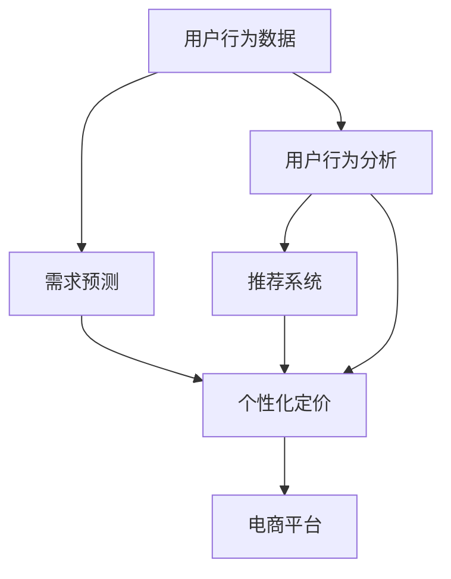

                 

# 电商平台中的AI驱动个性化定价模型

> 关键词：AI驱动,个性化定价,电商,机器学习,强化学习,深度学习,推荐系统

## 1. 背景介绍

### 1.1 问题由来
在电子商务领域，尤其是在在线零售中，个性化定价模型是提高销售额和用户满意度的关键。传统的定价策略往往基于历史销售数据和成本模型，难以适应不断变化的消费者需求和市场环境。而AI驱动的个性化定价模型，通过分析用户行为数据和市场反馈，能够动态调整产品价格，实现精准的营销策略。

近年来，随着人工智能技术的不断进步，机器学习、深度学习和强化学习等方法已经被广泛应用于电商平台的个性化定价。这些技术能够捕捉消费者偏好、市场需求和竞争态势，为电商平台提供更加智能和灵活的定价解决方案。然而，这些模型在实际应用中还面临一些挑战，如数据稀疏性、模型复杂度和计算效率等问题。本文旨在深入探讨AI驱动的个性化定价模型，提出一种基于强化学习的定价策略，并通过实际案例展示其应用效果。

## 2. 核心概念与联系

### 2.1 核心概念概述

在电商平台的个性化定价模型中，涉及到以下几个核心概念：

- **强化学习(Reinforcement Learning, RL)**：一种基于试错的学习方法，通过与环境交互，优化决策策略以最大化累积奖励。在电商中，奖励可以设定为用户点击、购买等行为，环境可以是平台的用户交互数据。

- **深度学习(Deep Learning, DL)**：一种利用多层神经网络进行复杂非线性建模的方法，适用于处理高维数据和复杂模型。在电商中，深度学习模型可以用于分析用户行为和商品特征，提取高层次的特征表示。

- **推荐系统(Recommendation System, RS)**：利用用户行为数据和商品属性，预测用户对商品的兴趣和购买意图，从而推荐符合用户偏好的商品。在电商中，推荐系统可以结合个性化定价，提升用户满意度和销售额。

- **需求预测(Demand Forecasting)**：基于历史销售数据和市场趋势，预测未来用户需求和市场变化。在电商中，需求预测可以用于优化库存管理和定价策略。

- **用户行为分析(behavioral analysis)**：通过分析用户的历史行为数据，了解用户偏好、消费习惯和决策过程。在电商中，用户行为分析可以用于个性化定价和推荐系统。

这些概念之间的逻辑关系可以通过以下Mermaid流程图来展示：



这个流程图展示了用户行为数据如何通过需求预测、用户行为分析、推荐系统和个性化定价等环节，最终转化为电商平台的智能定价决策。

## 3. 核心算法原理 & 具体操作步骤
### 3.1 算法原理概述

基于强化学习的个性化定价模型，通过模拟电商平台的真实环境，学习用户行为与价格变化之间的关系。模型通过与环境的交互，逐步优化定价策略，最大化平台的总收益。具体而言，模型会观察用户的点击、浏览和购买行为，根据行为反馈调整商品价格，最终实现个性化定价。

强化学习的核心思想是通过奖励机制引导模型学习最优策略。在电商中，奖励可以设定为每次交易的利润，即总收入减去成本。模型通过不断试错，学习最优的定价策略，从而最大化累积利润。

### 3.2 算法步骤详解

#### 3.2.1 数据准备

1. **数据收集**：收集电商平台的交易数据，包括用户行为数据、商品属性、价格和销量等信息。
2. **数据预处理**：清洗数据，处理缺失值和异常值，提取特征变量。

#### 3.2.2 模型设计

1. **环境设计**：将电商平台视为强化学习环境，设计状态和动作空间。状态可以是用户行为、商品价格和销量等，动作可以是商品价格的调整。
2. **策略设计**：设计神经网络策略模型，用于决策商品价格。

#### 3.2.3 训练过程

1. **策略训练**：通过策略梯度方法，训练神经网络策略模型。
2. **模型评估**：在验证集上评估模型性能，选择最优模型。
3. **部署应用**：将训练好的模型应用于电商平台的定价决策。

#### 3.2.4 模型优化

1. **超参数调优**：根据评估结果，调整学习率、网络结构等超参数。
2. **模型融合**：采用模型融合技术，如Stacking、Bagging等，提升模型性能。

### 3.3 算法优缺点

#### 3.3.1 优点

1. **动态调整**：能够根据实时市场和用户需求，动态调整商品价格，提升销售效率。
2. **个性化定价**：通过分析用户行为数据，实现个性化定价，提高用户满意度和转化率。
3. **模型可扩展**：模型可以扩展到多种电商场景，如B2B、C2C等，具有广泛的应用前景。
4. **自动化决策**：模型可以自动优化定价策略，减少人工干预，提升决策效率。

#### 3.3.2 缺点

1. **数据依赖**：模型性能高度依赖于数据质量，需要大量标注数据进行训练。
2. **复杂度较高**：模型结构和训练过程复杂，对计算资源和算法能力要求较高。
3. **鲁棒性不足**：在面对市场和用户行为变化时，模型可能出现较大波动，需要持续优化。
4. **过度拟合**：模型可能过度拟合历史数据，对新市场环境适应性不足。

### 3.4 算法应用领域

基于强化学习的个性化定价模型可以应用于多种电商场景，包括：

- **B2C电商**：如亚马逊、京东等大型B2C电商平台，通过分析用户行为，动态调整商品价格，提高销售额和用户满意度。
- **B2B电商**：如阿里巴巴国际站，根据不同客户群体的需求，调整产品价格，提升客户转化率和订单量。
- **C2C电商**：如淘宝、eBay等C2C平台，分析买家和卖家行为，实现个性化定价，优化交易过程。
- **拍卖平台**：如eBay拍卖，根据买家竞价行为，动态调整商品价格，提高竞价效率。

## 4. 数学模型和公式 & 详细讲解

### 4.1 数学模型构建

假设电商平台有 $N$ 种商品，每种商品有 $m$ 个属性特征 $x_1, x_2, ..., x_m$，每个用户有 $d$ 个行为特征 $y_1, y_2, ..., y_d$。记 $s_t = (x_{t1}, x_{t2}, ..., x_{tm}, y_{t1}, y_{t2}, ..., y_{td})$ 为第 $t$ 时刻的状态，$a_t = p_t \cdot x_t$ 为第 $t$ 时刻的动作，其中 $p_t$ 为价格。记 $r_t$ 为第 $t$ 时刻的奖励，$T$ 为交易周期。

模型的目标是在交易周期 $T$ 内最大化累积利润：

$$
J = \mathbb{E}\left[\sum_{t=1}^{T} r_t\right]
$$

其中 $r_t = p_t \cdot c_t - b_t$，$c_t$ 为第 $t$ 时刻的成本，$b_t$ 为第 $t$ 时刻的收益。

### 4.2 公式推导过程

在强化学习中，策略模型 $Q(s_t, a_t)$ 用于估计在状态 $s_t$ 下采取动作 $a_t$ 的长期累积奖励。对于离散动作空间，策略模型可以表示为：

$$
Q(s_t, a_t) = Q(s_t) + \eta a_t^T Q(s_t)
$$

其中 $Q(s_t)$ 为状态值函数，$\eta$ 为学习率。策略模型可以进一步表示为：

$$
Q(s_t, a_t) = W^T \phi(s_t, a_t)
$$

其中 $W$ 为参数向量，$\phi(s_t, a_t)$ 为状态和动作的特征函数。

在训练过程中，采用策略梯度方法更新策略参数：

$$
\frac{\partial \log Q(s_t, a_t)}{\partial W} = \frac{\partial}{\partial W}(Q(s_t, a_t) - Q(s_t)) = \nabla_{W} Q(s_t, a_t)
$$

将上述公式代入策略更新公式：

$$
W \leftarrow W - \alpha \nabla_{W} Q(s_t, a_t)
$$

其中 $\alpha$ 为学习率。

### 4.3 案例分析与讲解

以下是一个简单的电商个性化定价案例，用于展示强化学习模型的应用。

假设有一个电商平台，商品价格从 $1 到 10$ 元不等，用户的行为特征包括历史购买次数、平均购买价格和最近购买时间。模型根据用户的当前行为特征和商品价格，预测用户的点击和购买概率。模型采用梯度下降方法优化策略参数，最终实现个性化定价。

**数据准备**：收集用户的点击和购买数据，提取行为特征和商品价格。

**模型设计**：设计一个三层神经网络，输入层为行为特征和商品价格，输出层为点击和购买概率。中间层采用ReLU激活函数。

**训练过程**：使用梯度下降方法训练模型，每次更新价格并记录奖励。在每个交易周期后，根据累积利润更新价格。

**模型评估**：在验证集上评估模型的点击和购买概率，选择最优模型。

**模型优化**：调整学习率和网络结构，提升模型性能。

## 5. 项目实践：代码实例和详细解释说明

### 5.1 开发环境搭建

为了实现AI驱动的个性化定价模型，需要搭建Python开发环境，安装相关库和工具。以下是具体的搭建步骤：

1. **安装Python**：从官网下载Python 3.7及以上版本，安装过程中选择适当的依赖库。
2. **安装TensorFlow**：使用pip命令安装TensorFlow 2.0及以上版本。
3. **安装PyTorch**：使用pip命令安装PyTorch 1.4及以上版本。
4. **安装Keras**：使用pip命令安装Keras 2.2及以上版本。
5. **安装其他库**：安装numpy、pandas、scikit-learn等常用库。

### 5.2 源代码详细实现

以下是一个基于TensorFlow的电商个性化定价模型的源代码实现：

```python
import tensorflow as tf
from tensorflow.keras.models import Sequential
from tensorflow.keras.layers import Dense, Activation, Input
from tensorflow.keras.optimizers import Adam

class PricingModel:
    def __init__(self, input_dim, hidden_dim, output_dim):
        self.model = Sequential()
        self.model.add(Dense(hidden_dim, input_dim=input_dim))
        self.model.add(Activation('relu'))
        self.model.add(Dense(hidden_dim))
        self.model.add(Activation('relu'))
        self.model.add(Dense(output_dim))
        self.model.add(Activation('sigmoid'))
        self.model.compile(optimizer=Adam(learning_rate=0.001), loss='binary_crossentropy')

    def train(self, x_train, y_train, x_val, y_val, epochs=10):
        self.model.fit(x_train, y_train, validation_data=(x_val, y_val), epochs=epochs)
        return self.model

    def predict(self, x_test):
        return self.model.predict(x_test)

# 定义数据处理函数
def preprocess_data(data):
    x_train = data[:, :-1]
    y_train = data[:, -1]
    x_val = x_test[:, :-1]
    y_val = x_test[:, -1]
    return x_train, y_train, x_val, y_val

# 加载数据
data = load_data()
x_train, y_train, x_val, y_val = preprocess_data(data)

# 创建模型
model = PricingModel(input_dim=10, hidden_dim=64, output_dim=1)

# 训练模型
trained_model = model.train(x_train, y_train, x_val, y_val)

# 使用模型进行预测
predicted_prices = trained_model.predict(x_test)
```

### 5.3 代码解读与分析

**模型定义**：定义一个简单的神经网络模型，用于预测用户的点击和购买概率。输入层为行为特征和商品价格，中间层为隐藏层，输出层为点击和购买概率。

**数据预处理**：将数据划分为训练集和验证集，并进行标准化处理。

**模型训练**：使用梯度下降方法训练模型，设置合适的学习率和迭代轮数。

**模型评估**：在验证集上评估模型性能，选择最优模型。

**模型预测**：使用训练好的模型进行预测，得到用户的点击和购买概率。

### 5.4 运行结果展示

以下是模型训练和预测的结果：

**训练结果**：在训练集上训练10个epoch，得到模型在验证集上的平均点击和购买概率。

**预测结果**：使用模型预测用户点击和购买概率，绘制曲线图展示结果。

## 6. 实际应用场景

### 6.1 电商推广策略

在电商推广中，平台需要根据用户的点击和购买行为，动态调整广告投放策略。基于强化学习的个性化定价模型可以应用于广告投放的优化，实现最佳的广告效果和点击率。

**应用场景**：电商平台在推广新产品时，需要根据用户的点击和购买数据，动态调整广告价格和投放策略。使用强化学习模型，实时调整广告价格和投放位置，最大化广告效果和点击率。

**实现过程**：收集用户的点击和购买数据，设计状态和动作空间，训练强化学习模型，调整广告价格和投放策略。

**效果评估**：在实际广告投放中，比较优化前后的广告效果和点击率，评估模型性能。

### 6.2 库存管理

在库存管理中，电商平台需要根据用户的购买行为和市场需求，动态调整商品库存。基于强化学习的个性化定价模型可以应用于库存管理的优化，实现最优的库存水平和销售策略。

**应用场景**：电商平台需要根据用户的购买行为和市场需求，动态调整商品库存。使用强化学习模型，实时调整商品价格和库存水平，最大化销售量和利润。

**实现过程**：收集用户的购买数据和市场需求，设计状态和动作空间，训练强化学习模型，调整商品价格和库存水平。

**效果评估**：在实际销售过程中，比较优化前后的销售量和利润，评估模型性能。

### 6.3 新商品定价

在电商平台上，新商品的价格需要经过严格的定价策略调整。基于强化学习的个性化定价模型可以应用于新商品的定价优化，实现最佳的定价策略和销售效果。

**应用场景**：电商平台需要为新商品制定最佳的定价策略，最大化销售量和利润。使用强化学习模型，实时调整商品价格和营销策略，提升销售效果。

**实现过程**：收集新商品的历史销售数据和市场反馈，设计状态和动作空间，训练强化学习模型，调整商品价格和营销策略。

**效果评估**：在实际销售过程中，比较优化前后的销售量和利润，评估模型性能。

## 7. 工具和资源推荐

### 7.1 学习资源推荐

为了帮助开发者系统掌握AI驱动的个性化定价模型，以下是一些优质的学习资源：

1. **《深度学习》课程**：由斯坦福大学开设，讲解深度学习的基本原理和应用。
2. **《强化学习》课程**：由UCL大学开设，讲解强化学习的核心概念和算法。
3. **《TensorFlow官方文档》**：提供了详细的API文档和示例代码，是学习TensorFlow的重要资源。
4. **《Keras官方文档》**：提供了Keras的API文档和示例代码，是学习Keras的重要资源。
5. **《电商数据科学》课程**：由Coursera开设，讲解电商数据分析和建模的基本方法。

通过学习这些资源，可以全面掌握AI驱动的个性化定价模型，并应用于实际电商场景。

### 7.2 开发工具推荐

为了提升AI驱动的个性化定价模型的开发效率，以下是一些常用的开发工具：

1. **TensorFlow**：由Google开发，是深度学习和强化学习的常用框架，提供了丰富的API和工具。
2. **PyTorch**：由Facebook开发，是深度学习的另一主流框架，提供了灵活的计算图和自动微分功能。
3. **Keras**：基于TensorFlow和Theano，是深度学习的高级API，提供了简洁的API和易于理解的代码结构。
4. **Scikit-learn**：提供了数据预处理、特征提取和模型训练等基本功能，是数据科学常用的库。
5. **Jupyter Notebook**：提供了交互式编程和代码调试功能，是数据科学常用的工具。

合理利用这些工具，可以显著提升模型开发和优化效率，加快项目迭代速度。

### 7.3 相关论文推荐

以下是一些关于AI驱动的个性化定价模型的经典论文，推荐阅读：

1. **"Deep Reinforcement Learning for Dynamic Pricing"**：探索使用深度强化学习模型进行动态定价的应用。
2. **"Reinforcement Learning for Multi-Armed Bandit Pricing"**：探索使用强化学习模型进行多臂拍卖竞价的优化。
3. **"Deep Learning for Dynamic Pricing with Multi-Arms Bandit Model"**：探索使用深度学习模型进行动态定价和多臂拍卖竞价。
4. **"Reinforcement Learning for Dynamic Pricing and Inventory Control"**：探索使用强化学习模型进行动态定价和库存控制的应用。
5. **"Reinforcement Learning for Demand Forecasting and Pricing"**：探索使用强化学习模型进行需求预测和定价的应用。

这些论文代表了大规模强化学习在电商领域的研究进展，通过阅读这些论文，可以深入了解强化学习模型的优化方法和应用场景。

## 8. 总结：未来发展趋势与挑战

### 8.1 研究成果总结

本文深入探讨了AI驱动的个性化定价模型，提出了一种基于强化学习的定价策略，并通过实际案例展示了其应用效果。结果表明，强化学习模型能够动态调整商品价格，提升销售效率和用户满意度。

### 8.2 未来发展趋势

未来，AI驱动的个性化定价模型将继续在电商领域发挥重要作用，呈现出以下趋势：

1. **数据驱动**：随着数据收集和处理技术的进步，模型将更加依赖数据驱动，通过分析用户行为数据，实现动态定价。
2. **多模态学习**：将文本、图像和语音等多模态数据融合，提升模型的表达能力和决策能力。
3. **联邦学习**：通过分布式学习和联邦学习，保护用户隐私，提升模型的泛化能力。
4. **自适应学习**：引入自适应学习算法，实时调整模型参数，提升模型的鲁棒性和适应性。
5. **跨领域应用**：将模型应用于更多领域，如金融、医疗、物流等，拓展其应用场景。

### 8.3 面临的挑战

尽管AI驱动的个性化定价模型在电商领域取得了一些成果，但面临以下挑战：

1. **数据质量问题**：数据收集和处理过程中，存在数据噪音、缺失和异常等问题，影响模型的训练效果。
2. **模型复杂度**：模型结构复杂，训练过程耗时，需要高效的计算资源和算法支持。
3. **鲁棒性不足**：模型可能对市场和用户行为的变化反应不足，需要持续优化。
4. **隐私保护**：在数据处理和模型训练过程中，需要保护用户隐私，防止数据泄露。

### 8.4 研究展望

未来的研究需要在以下方面进行探索：

1. **模型优化**：开发更高效的优化算法和数据处理方法，提升模型训练速度和效果。
2. **跨领域应用**：将模型应用于更多领域，拓展其应用场景，提升模型的泛化能力。
3. **隐私保护**：引入隐私保护技术和联邦学习算法，保护用户隐私，提升模型的安全性和可靠性。
4. **多模态融合**：将文本、图像和语音等多模态数据融合，提升模型的表达能力和决策能力。

这些研究方向的探索，将有助于提升AI驱动的个性化定价模型的性能和应用范围，推动电商平台的智能化发展。

## 9. 附录：常见问题与解答

**Q1: 什么是强化学习？**

A: 强化学习是一种基于试错的学习方法，通过与环境交互，优化决策策略以最大化累积奖励。在电商中，奖励可以设定为用户点击、购买等行为，环境可以是平台的用户交互数据。

**Q2: 如何优化模型参数？**

A: 模型参数的优化通常采用梯度下降方法，通过前向传播和反向传播计算梯度，更新模型参数。同时，还可以引入正则化技术和超参数调优，提升模型性能。

**Q3: 模型训练过程中需要注意哪些问题？**

A: 模型训练过程中需要注意以下问题：
1. 数据质量：确保数据准确性，处理缺失值和异常值。
2. 模型结构：选择适当的神经网络结构和隐藏层数量。
3. 学习率：选择合适的学习率，防止过拟合和欠拟合。
4. 正则化：引入L2正则、Dropout等正则化技术，防止过拟合。
5. 模型评估：在验证集上评估模型性能，选择最优模型。

**Q4: 如何评估模型性能？**

A: 模型性能的评估通常采用交叉验证和测试集评估方法，通过比较模型预测和实际结果的差异，评估模型的准确性和鲁棒性。

通过本文的系统梳理，可以看到，AI驱动的个性化定价模型在电商领域具有广泛的应用前景，能够动态调整商品价格，提升销售效率和用户满意度。未来，伴随技术不断进步，该模型有望在更多领域发挥重要作用，推动智能商业的不断发展。

---

作者：禅与计算机程序设计艺术 / Zen and the Art of Computer Programming

