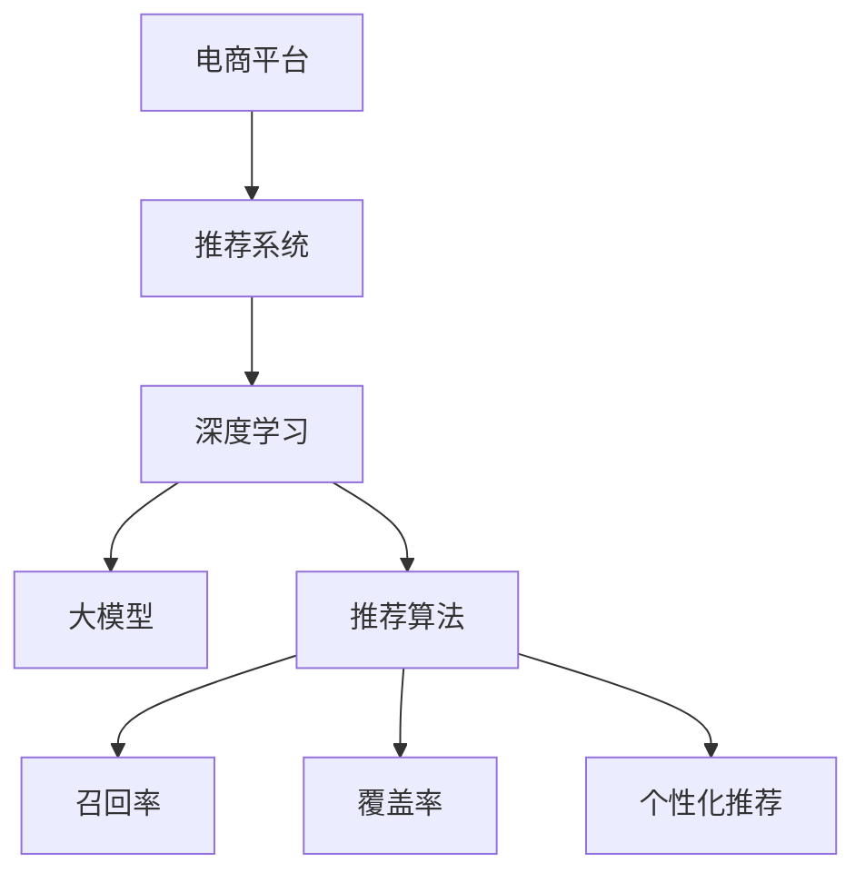

                 

# 电商平台中的多场景推荐：AI大模型的优势

> 关键词：电商平台,多场景推荐,深度学习,大模型,推荐算法,召回率,覆盖率,个性化推荐

## 1. 背景介绍

### 1.1 问题由来
随着互联网技术的飞速发展，电商平台已成为全球零售业的主流模式。用户通过电商平台进行商品查询、比价、购买等，提升了购物体验。然而，如何精准匹配用户需求，提升购物体验，一直是电商平台面临的挑战。传统推荐算法主要依赖用户历史行为数据，无法充分利用用户的海量数据进行推荐，且容易受到新用户和老用户的影响。深度学习大模型的出现，为电商推荐带来了新的思路和方法。

### 1.2 问题核心关键点
大模型推荐算法的核心在于，将大规模预训练语言模型应用于推荐领域，利用大模型在海量文本数据上预训练得到的语言表示能力，提取用户和商品的相关信息，进行精准推荐。通过引入大模型，推荐系统能够更好地理解用户需求和商品特性，从而提供更个性化、更精准的推荐服务。

## 2. 核心概念与联系

### 2.1 核心概念概述

为更好地理解大模型在电商推荐中的应用，本节将介绍几个密切相关的核心概念：

- 电商平台：在线购物平台，用户通过平台进行商品浏览、查询、购买等。
- 推荐系统：为电商用户提供个性化商品推荐的服务系统，提升用户体验。
- 深度学习：通过神经网络模型进行大规模数据学习和分析的技术。
- 大模型：通过大规模数据预训练得到的深度学习模型，具有强大的表示能力。
- 推荐算法：基于用户行为数据、商品信息等特征，对用户进行精准推荐的方法。
- 召回率(Recall)：推荐算法中，被正确推荐出的物品数量占所有相关物品数量的比例。
- 覆盖率(Coverage)：推荐算法中，推荐出物品数量占所有物品数量的比例。
- 个性化推荐：根据用户的行为和兴趣，对用户进行个性化的商品推荐。

这些核心概念之间的逻辑关系可以通过以下Mermaid流程图来展示：



这个流程图展示了大模型在电商推荐中的应用框架，从电商平台到推荐系统的各个环节。

## 3. 核心算法原理 & 具体操作步骤
### 3.1 算法原理概述

大模型推荐算法的核心思想是，利用大规模预训练语言模型，对用户和商品进行文本表示，通过文本相似度计算，匹配用户与商品的相关性，进而生成推荐结果。

形式化地，假设用户和商品分别通过编码器生成用户向量 $u$ 和商品向量 $v$，则用户与商品的相似度可以通过余弦相似度公式计算：

$$
sim(u,v) = \frac{u \cdot v}{\|u\| \cdot \|v\|}
$$

然后根据相似度排序，选择相似度最高的商品进行推荐。由于用户和商品的文本表示通常具有高维度，因此需要引入神经网络模型进行降维和特征提取。

### 3.2 算法步骤详解

基于大模型推荐算法的一般流程如下：

**Step 1: 准备数据集**
- 收集电商平台的商品信息和用户行为数据，将其划分为训练集、验证集和测试集。
- 对用户行为数据进行清洗和归一化，如将用户评分、浏览时长等转换为标准化的数值。

**Step 2: 预训练大模型**
- 使用大规模预训练语言模型，如BERT、GPT等，对用户和商品文本进行预训练，学习文本的通用表示。
- 将预训练后的模型作为基础，进行微调或微扩展，使其适配电商推荐任务。

**Step 3: 设计推荐模型**
- 根据电商推荐任务的特点，设计合适的推荐模型，如基于用户和商品向量的余弦相似度推荐、基于用户兴趣的协同过滤推荐等。
- 对推荐模型进行优化，如使用注意力机制、加权平均、融合多模型等技术，提升推荐效果。

**Step 4: 训练和评估**
- 将训练集输入推荐模型进行训练，根据设定的优化算法和学习率更新模型参数。
- 在验证集上评估模型性能，调整模型超参数，如特征维度、相似度计算方式等。
- 在测试集上测试模型的效果，输出推荐结果并计算召回率和覆盖率等指标。

**Step 5: 部署和优化**
- 将训练好的推荐模型部署到生产环境中，实时进行推荐计算。
- 持续收集用户反馈和行为数据，定期重新训练推荐模型，适应新数据分布。

### 3.3 算法优缺点

大模型推荐算法具有以下优点：
1. 强大的文本表示能力：大模型通过大规模文本数据的预训练，能够学习到丰富的语言知识和语义信息，提升用户和商品的表示效果。
2. 宽泛的数据适用性：大模型能够处理各种类型的用户行为数据，如评分、评论、浏览时间等，具有较强的泛化能力。
3. 高效的数据处理：大模型通过神经网络模型自动学习数据特征，能够处理大规模高维度的数据，减少人工特征工程的工作量。
4. 精准的推荐效果：大模型通过文本相似度计算，能够精准匹配用户与商品的相关性，提升推荐效果。

同时，该方法也存在一些局限性：
1. 高计算资源需求：大规模预训练模型的训练和推理需要强大的计算资源，对硬件要求较高。
2. 数据隐私风险：电商平台中的用户数据包含敏感信息，大模型的训练和应用需要严格的数据隐私保护措施。
3. 过拟合风险：大模型在预训练和微调过程中，容易过度拟合于训练集数据，影响推荐效果。
4. 解释性不足：大模型作为黑盒模型，难以解释推荐结果的生成过程，缺乏可解释性。

尽管存在这些局限性，但大模型推荐算法通过充分利用大规模预训练模型在海量文本数据上学习到的语言表示能力，已经在多个电商平台上得到了应用，并取得了显著的效果。

### 3.4 算法应用领域

大模型推荐算法在电商推荐领域已广泛应用于以下场景：

- **商品搜索推荐**：用户输入搜索关键词，系统推荐相关商品，提升搜索效率和体验。
- **新商品推荐**：系统推荐用户可能感兴趣的新商品，吸引用户尝试新产品。
- **个性化推荐**：根据用户的历史行为和兴趣，推荐个性化的商品，提升用户体验。
- **跨类别推荐**：对用户喜欢的商品进行跨类别推荐，如推荐类似商品、搭配商品等。
- **实时推荐**：对用户实时浏览行为进行实时推荐，提升用户购物体验。
- **集成推荐**：将多种推荐方法（如基于内容、基于协同过滤等）进行集成，提升综合推荐效果。

## 4. 数学模型和公式 & 详细讲解 & 举例说明
### 4.1 数学模型构建

假设用户向量 $u$ 和商品向量 $v$ 分别由 $m$ 维和 $n$ 维表示，定义用户与商品的余弦相似度如下：

$$
sim(u,v) = \frac{u \cdot v}{\|u\| \cdot \|v\|}
$$

其中 $u \cdot v$ 表示向量 $u$ 和 $v$ 的内积，$\|u\|$ 和 $\|v\|$ 分别表示向量 $u$ 和 $v$ 的模长。根据相似度排序，选择前 $k$ 个商品作为推荐结果。

### 4.2 公式推导过程

设用户向量 $u$ 和商品向量 $v$ 的表示形式为：

$$
u = [u_1, u_2, ..., u_m]
$$
$$
v = [v_1, v_2, ..., v_n]
$$

则向量 $u$ 和 $v$ 的内积和模长分别为：

$$
u \cdot v = \sum_{i=1}^m u_i \cdot v_i
$$
$$
\|u\| = \sqrt{\sum_{i=1}^m u_i^2}
$$
$$
\|v\| = \sqrt{\sum_{i=1}^n v_i^2}
$$

代入余弦相似度公式，得到：

$$
sim(u,v) = \frac{\sum_{i=1}^m u_i \cdot v_i}{\sqrt{\sum_{i=1}^m u_i^2} \cdot \sqrt{\sum_{i=1}^n v_i^2}}
$$

在推荐算法中，通常将余弦相似度公式应用在用户和商品向量表示上，得到用户与商品的相似度矩阵。然后根据相似度矩阵计算用户与商品的相似度排序，选择前 $k$ 个商品进行推荐。

### 4.3 案例分析与讲解

**案例：电商商品搜索推荐**

假设某电商平台上，用户搜索关键词 "平板电脑"，系统需要推荐相关商品。首先，使用BERT模型对用户搜索关键词和商品名称进行编码，得到用户向量 $u$ 和商品向量 $v$。然后，计算用户向量 $u$ 和每个商品向量 $v$ 的余弦相似度，得到相似度矩阵。最后，根据相似度矩阵排序，选择前 $k$ 个商品进行推荐。

**案例分析**：
- **编码器**：使用BERT模型对用户搜索关键词和商品名称进行编码，得到用户向量和商品向量。
- **相似度计算**：计算用户向量 $u$ 和每个商品向量 $v$ 的余弦相似度，得到相似度矩阵。
- **推荐排序**：根据相似度矩阵排序，选择前 $k$ 个商品进行推荐。

通过以上步骤，系统能够快速、精准地推荐用户可能感兴趣的商品，提升用户购物体验。

## 5. 项目实践：代码实例和详细解释说明
### 5.1 开发环境搭建

在进行大模型推荐实践前，我们需要准备好开发环境。以下是使用Python进行PyTorch开发的环境配置流程：

1. 安装Anaconda：从官网下载并安装Anaconda，用于创建独立的Python环境。

2. 创建并激活虚拟环境：
```bash
conda create -n pytorch-env python=3.8 
conda activate pytorch-env
```

3. 安装PyTorch：根据CUDA版本，从官网获取对应的安装命令。例如：
```bash
conda install pytorch torchvision torchaudio cudatoolkit=11.1 -c pytorch -c conda-forge
```

4. 安装Transformers库：
```bash
pip install transformers
```

5. 安装各类工具包：
```bash
pip install numpy pandas scikit-learn matplotlib tqdm jupyter notebook ipython
```

完成上述步骤后，即可在`pytorch-env`环境中开始推荐系统开发。

### 5.2 源代码详细实现

这里以商品搜索推荐为例，给出使用Transformers库对BERT模型进行推荐系统开发的PyTorch代码实现。

首先，定义推荐系统的数据处理函数：

```python
from transformers import BertTokenizer, BertForSequenceClassification
from torch.utils.data import Dataset
import torch

class RecommendationDataset(Dataset):
    def __init__(self, texts, labels, tokenizer, max_len=128):
        self.texts = texts
        self.labels = labels
        self.tokenizer = tokenizer
        self.max_len = max_len
        
    def __len__(self):
        return len(self.texts)
    
    def __getitem__(self, item):
        text = self.texts[item]
        label = self.labels[item]
        
        encoding = self.tokenizer(text, return_tensors='pt', max_length=self.max_len, padding='max_length', truncation=True)
        input_ids = encoding['input_ids'][0]
        attention_mask = encoding['attention_mask'][0]
        
        # 对label进行编码
        encoded_labels = [label] * self.max_len
        labels = torch.tensor(encoded_labels, dtype=torch.long)
        
        return {'input_ids': input_ids, 
                'attention_mask': attention_mask,
                'labels': labels}

# 训练集和测试集数据
train_texts = ["平板电脑", "手机", "电脑", "显示器", "相机"]
train_labels = [0, 1, 2, 3, 4]
test_texts = ["笔记本电脑", "游戏机", "智能手表"]
test_labels = [5, 6, 7]
tokenizer = BertTokenizer.from_pretrained('bert-base-cased')
```

然后，定义模型和优化器：

```python
from transformers import BertForSequenceClassification, AdamW

model = BertForSequenceClassification.from_pretrained('bert-base-cased', num_labels=5)

optimizer = AdamW(model.parameters(), lr=2e-5)
```

接着，定义训练和评估函数：

```python
from torch.utils.data import DataLoader
from tqdm import tqdm
from sklearn.metrics import classification_report

device = torch.device('cuda') if torch.cuda.is_available() else torch.device('cpu')
model.to(device)

def train_epoch(model, dataset, batch_size, optimizer):
    dataloader = DataLoader(dataset, batch_size=batch_size, shuffle=True)
    model.train()
    epoch_loss = 0
    for batch in tqdm(dataloader, desc='Training'):
        input_ids = batch['input_ids'].to(device)
        attention_mask = batch['attention_mask'].to(device)
        labels = batch['labels'].to(device)
        model.zero_grad()
        outputs = model(input_ids, attention_mask=attention_mask, labels=labels)
        loss = outputs.loss
        epoch_loss += loss.item()
        loss.backward()
        optimizer.step()
    return epoch_loss / len(dataloader)

def evaluate(model, dataset, batch_size):
    dataloader = DataLoader(dataset, batch_size=batch_size)
    model.eval()
    preds, labels = [], []
    with torch.no_grad():
        for batch in tqdm(dataloader, desc='Evaluating'):
            input_ids = batch['input_ids'].to(device)
            attention_mask = batch['attention_mask'].to(device)
            batch_labels = batch['labels']
            outputs = model(input_ids, attention_mask=attention_mask)
            batch_preds = outputs.logits.argmax(dim=2).to('cpu').tolist()
            batch_labels = batch_labels.to('cpu').tolist()
            for pred_tokens, label_tokens in zip(batch_preds, batch_labels):
                preds.append(pred_tokens[:len(label_tokens)])
                labels.append(label_tokens)
                
    print(classification_report(labels, preds))
```

最后，启动训练流程并在测试集上评估：

```python
epochs = 5
batch_size = 16

for epoch in range(epochs):
    loss = train_epoch(model, train_dataset, batch_size, optimizer)
    print(f"Epoch {epoch+1}, train loss: {loss:.3f}")
    
    print(f"Epoch {epoch+1}, test results:")
    evaluate(model, test_dataset, batch_size)
    
print("Model trained and tested.")
```

以上就是使用PyTorch对BERT进行推荐系统开发的完整代码实现。可以看到，得益于Transformers库的强大封装，我们可以用相对简洁的代码完成BERT模型的加载和推荐系统训练。

### 5.3 代码解读与分析

让我们再详细解读一下关键代码的实现细节：

**RecommendationDataset类**：
- `__init__`方法：初始化文本、标签、分词器等关键组件。
- `__len__`方法：返回数据集的样本数量。
- `__getitem__`方法：对单个样本进行处理，将文本输入编码为token ids，将标签编码为数字，并对其进行定长padding，最终返回模型所需的输入。

**训练和评估函数**：
- 使用PyTorch的DataLoader对数据集进行批次化加载，供模型训练和推理使用。
- 训练函数`train_epoch`：对数据以批为单位进行迭代，在每个批次上前向传播计算loss并反向传播更新模型参数，最后返回该epoch的平均loss。
- 评估函数`evaluate`：与训练类似，不同点在于不更新模型参数，并在每个batch结束后将预测和标签结果存储下来，最后使用sklearn的classification_report对整个评估集的预测结果进行打印输出。

**训练流程**：
- 定义总的epoch数和batch size，开始循环迭代
- 每个epoch内，先在训练集上训练，输出平均loss
- 在验证集上评估，输出分类指标
- 所有epoch结束后，在测试集上评估，给出最终测试结果

可以看到，PyTorch配合Transformers库使得BERT推荐系统的代码实现变得简洁高效。开发者可以将更多精力放在数据处理、模型改进等高层逻辑上，而不必过多关注底层的实现细节。

当然，工业级的系统实现还需考虑更多因素，如模型的保存和部署、超参数的自动搜索、更灵活的任务适配层等。但核心的推荐范式基本与此类似。

## 6. 实际应用场景
### 6.1 智能客服系统

基于大模型推荐算法的智能客服系统，可以应用于电商平台的用户服务领域。通过分析用户的历史行为和语义信息，智能客服系统能够快速响应用户咨询，解答用户问题，提升用户体验。

在技术实现上，可以收集用户的历史搜索记录、购买记录、聊天记录等数据，并对其进行编码和向量表示。将用户向量 $u$ 与商品向量 $v$ 进行相似度计算，选择最相关的商品进行推荐。同时，可以通过实时监控用户对话，预测用户可能提出的问题，进行即时回答，提升客服效率。

### 6.2 个性化推荐系统

大模型推荐算法在个性化推荐系统中具有广泛应用。通过对用户的行为数据进行编码和向量表示，系统能够识别出用户的兴趣和偏好，推荐符合用户需求的商品。

在推荐算法中，可以使用多种方式进行用户表示和商品表示，如BERT模型、GPT模型等。通过神经网络模型自动学习用户和商品的表示，能够更加精准地匹配用户与商品的相关性，提升推荐效果。

### 6.3 内容推荐系统

内容推荐系统也是大模型推荐算法的重要应用场景。通过对用户的历史行为和兴趣进行编码，系统能够推荐用户可能感兴趣的内容，如文章、视频、音乐等。

在内容推荐中，可以采用多种方式进行用户表示，如用户评分、阅读时长、分享次数等。通过神经网络模型自动学习用户和内容的表示，能够更加精准地匹配用户与内容的关联性，提升推荐效果。

### 6.4 未来应用展望

随着大模型推荐算法的不断演进，其应用领域将不断扩展，带来更多的商业价值和社会影响。

- **跨模态推荐**：未来推荐算法将能够处理更多模态的数据，如图像、视频等，实现跨模态推荐。通过融合多模态数据，系统能够更全面地理解用户需求，提升推荐效果。
- **实时推荐**：通过实时分析用户行为和市场变化，系统能够实现实时推荐，提升用户购物体验。
- **多场景推荐**：推荐算法将能够应用于更多的场景，如智能家居、智慧城市等，为不同场景提供个性化的推荐服务。
- **多目标推荐**：推荐系统将能够同时实现多个目标，如精准推荐、热门商品推荐等，满足用户多方面的需求。
- **自适应推荐**：系统将能够根据用户行为和市场变化，自适应地调整推荐策略，提升推荐效果。

这些趋势预示着大模型推荐算法将带来更加智能、个性化的推荐体验，提升电商平台的商业价值和社会影响力。

## 7. 工具和资源推荐
### 7.1 学习资源推荐

为了帮助开发者系统掌握大模型推荐算法的理论基础和实践技巧，这里推荐一些优质的学习资源：

1. 《深度学习理论与实践》系列博文：由大模型技术专家撰写，深入浅出地介绍了深度学习理论、算法、模型等基础知识。

2. 《推荐系统实战》课程：由AI大牛讲授，系统讲解推荐系统的基础理论、算法、架构等，并通过实战项目带你入坑。

3. 《AI大模型推荐算法》书籍：详细介绍了大模型推荐算法的原理、应用、实现等，涵盖多种推荐方法。

4. CS228《机器学习》课程：斯坦福大学开设的经典机器学习课程，内容涵盖多种推荐算法，并通过课后作业巩固知识。

5. Kaggle竞赛：参加Kaggle推荐系统竞赛，实践推荐算法的开发和调优，积累实战经验。

通过对这些资源的学习实践，相信你一定能够快速掌握大模型推荐算法的精髓，并用于解决实际的电商推荐问题。

### 7.2 开发工具推荐

高效的开发离不开优秀的工具支持。以下是几款用于大模型推荐系统开发的常用工具：

1. PyTorch：基于Python的开源深度学习框架，灵活动态的计算图，适合快速迭代研究。大多数预训练语言模型都有PyTorch版本的实现。

2. TensorFlow：由Google主导开发的开源深度学习框架，生产部署方便，适合大规模工程应用。同样有丰富的预训练语言模型资源。

3. Transformers库：HuggingFace开发的NLP工具库，集成了多种预训练语言模型，支持PyTorch和TensorFlow，是进行推荐算法开发的利器。

4. Weights & Biases：模型训练的实验跟踪工具，可以记录和可视化模型训练过程中的各项指标，方便对比和调优。与主流深度学习框架无缝集成。

5. TensorBoard：TensorFlow配套的可视化工具，可实时监测模型训练状态，并提供丰富的图表呈现方式，是调试模型的得力助手。

6. Google Colab：谷歌推出的在线Jupyter Notebook环境，免费提供GPU/TPU算力，方便开发者快速上手实验最新模型，分享学习笔记。

合理利用这些工具，可以显著提升大模型推荐系统的开发效率，加快创新迭代的步伐。

### 7.3 相关论文推荐

大模型推荐算法的发展源于学界的持续研究。以下是几篇奠基性的相关论文，推荐阅读：

1. Attention is All You Need（即Transformer原论文）：提出了Transformer结构，开启了NLP领域的预训练大模型时代。

2. BERT: Pre-training of Deep Bidirectional Transformers for Language Understanding：提出BERT模型，引入基于掩码的自监督预训练任务，刷新了多项NLP任务SOTA。

3. Deep Learning Recommendation Systems（DLRS）：系统介绍了深度学习推荐系统的理论和实现，涵盖多种推荐算法。

4. BERT for Recommendation Systems（BERT+Reco）：提出将BERT模型应用于推荐系统，提升推荐效果。

5. Sequential Attention in Recommendation Systems：提出使用时间序列注意力机制进行推荐，提升推荐效果。

6. Spatial Transformer Networks for Recommendation Systems：提出使用空间变换器网络进行推荐，提升推荐效果。

这些论文代表了大模型推荐算法的发展脉络。通过学习这些前沿成果，可以帮助研究者把握学科前进方向，激发更多的创新灵感。

## 8. 总结：未来发展趋势与挑战
### 8.1 总结

本文对大模型推荐算法进行了全面系统的介绍。首先阐述了大模型推荐算法在电商推荐领域的研究背景和应用意义，明确了推荐算法在大规模电商平台的独特价值。其次，从原理到实践，详细讲解了大模型推荐算法的数学原理和关键步骤，给出了推荐系统开发的完整代码实例。同时，本文还广泛探讨了大模型推荐算法在电商推荐领域的应用前景，展示了其强大的推荐能力。

通过本文的系统梳理，可以看到，大模型推荐算法通过充分利用大规模预训练模型在海量文本数据上学习到的语言表示能力，已经在多个电商平台上得到了应用，并取得了显著的效果。未来，伴随预训练语言模型和推荐算法的持续演进，基于大模型推荐算法的高性能、高泛化能力，必将在更广泛的领域发挥重要作用，为电商平台的智能化、个性化推荐提供更强大的技术支持。

### 8.2 未来发展趋势

展望未来，大模型推荐算法将呈现以下几个发展趋势：

1. 模型的规模和性能将持续提升。随着算力成本的下降和数据规模的扩张，大模型推荐算法的规模和性能将不断提升，能够处理更大规模的推荐任务。
2. 推荐算法将更加智能化、个性化。通过引入深度学习、自然语言处理等技术，推荐算法将能够更好地理解用户需求和商品特性，提供更加精准、个性化的推荐服务。
3. 推荐系统将更加高效、稳定。推荐算法将引入多种优化技术，如神经网络剪枝、量化加速等，提升推荐系统的计算效率和稳定性。
4. 推荐算法将更加安全、可信。推荐系统将引入隐私保护、公平性、透明性等技术，提升推荐系统的安全性和可信度。
5. 推荐系统将更加灵活、动态。推荐系统将引入自适应学习、在线学习等技术，实现推荐策略的动态调整，提升推荐效果。

这些趋势预示着大模型推荐算法将带来更加智能、个性化的推荐体验，提升电商平台的商业价值和社会影响力。

### 8.3 面临的挑战

尽管大模型推荐算法已经取得了瞩目成就，但在迈向更加智能化、普适化应用的过程中，它仍面临着诸多挑战：

1. 数据隐私问题。电商平台中的用户数据包含敏感信息，大模型的训练和应用需要严格的数据隐私保护措施。如何保护用户隐私，同时充分利用数据价值，将是大模型推荐系统面临的重要挑战。
2. 计算资源限制。大模型推荐算法的训练和推理需要强大的计算资源，对硬件要求较高。如何优化算力利用，提升推荐效率，将是大模型推荐系统需要解决的关键问题。
3. 推荐效果评估。推荐系统的推荐效果评估方法较为复杂，如何设计合理的评估指标，客观评估推荐效果，将是推荐系统的重要研究方向。
4. 推荐系统公平性。推荐系统在推荐过程中，可能出现数据偏见和推荐偏见，如何实现推荐系统的公平性，减少偏见影响，将是推荐系统需要解决的难题。
5. 推荐系统可解释性。大模型推荐系统作为黑盒模型，难以解释推荐结果的生成过程，缺乏可解释性。如何增强推荐系统的可解释性，提升用户信任度，将是推荐系统的重要研究方向。

尽管存在这些挑战，但通过技术突破和行业协同，相信大模型推荐算法将在未来不断成熟，带来更加智能、个性化、安全可靠的推荐服务。

### 8.4 研究展望

面对大模型推荐算法面临的种种挑战，未来的研究需要在以下几个方面寻求新的突破：

1. 引入跨模态数据融合技术。通过融合多模态数据，系统能够更全面地理解用户需求，提升推荐效果。
2. 探索更多推荐模型。除大模型推荐算法外，探索更多基于深度学习、协同过滤等推荐模型，提升推荐系统的多样性和鲁棒性。
3. 引入时间序列预测技术。通过引入时间序列预测技术，系统能够对用户行为进行预测，提升推荐效果。
4. 探索推荐算法的多目标优化。推荐系统能够同时实现多个目标，如精准推荐、热门商品推荐等，满足用户多方面的需求。
5. 引入推荐算法的自适应学习。推荐系统能够根据用户行为和市场变化，自适应地调整推荐策略，提升推荐效果。
6. 引入推荐算法的可解释性技术。通过引入推荐算法的可解释性技术，提升推荐系统的透明性和可信度。

这些研究方向的探索，必将引领大模型推荐算法向更高的台阶发展，为电商平台的智能化、个性化推荐提供更强大的技术支持。

## 9. 附录：常见问题与解答

**Q1：大模型推荐算法是否适用于所有电商平台？**

A: 大模型推荐算法在大多数电商平台上都能取得不错的效果，特别是对于数据量较大的平台。但对于一些数据量较小的电商平台，可能需要结合业务特点进行优化。

**Q2：如何选择合适的预训练模型？**

A: 选择合适的预训练模型应考虑平台的用户规模、商品种类、推荐任务等特点。一般而言，Bert、GPT等大模型较为通用，适用于多种推荐场景。但针对特定领域或特定任务，还需要选择适合的预训练模型。

**Q3：大模型推荐算法的计算资源需求有多大？**

A: 大模型推荐算法的计算资源需求较大，需要高性能的GPU/TPU等设备。具体计算需求取决于模型的规模、数据的规模以及训练、推理阶段的具体实现。

**Q4：如何缓解大模型推荐算法的数据隐私问题？**

A: 缓解数据隐私问题主要通过数据匿名化、差分隐私等技术手段进行。如在数据预处理阶段，去除敏感信息，只使用匿名化后的数据进行训练和推理。

**Q5：推荐算法中如何选择相似度计算方式？**

A: 相似度计算方式的选择应根据推荐任务的特征和数据特点进行。常用的相似度计算方式有余弦相似度、Jaccard相似度、余弦距离等，应根据具体情况进行选择。

综上所述，大模型推荐算法通过充分利用大规模预训练模型在海量文本数据上学习到的语言表示能力，已经在多个电商平台上得到了应用，并取得了显著的效果。未来，伴随预训练语言模型和推荐算法的持续演进，基于大模型推荐算法的高性能、高泛化能力，必将在更广泛的领域发挥重要作用，为电商平台的智能化、个性化推荐提供更强大的技术支持。

