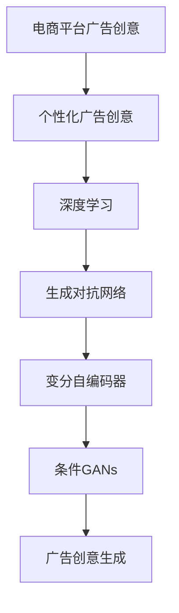

                 

# 电商平台中的实时个性化广告创意优化

## 1. 背景介绍

在当今的电商平台上，个性化广告创意的优化已经成为了提升用户转化率和广告效果的关键。通过个性化的广告创意，电商平台能够更好地吸引用户的注意力，提高用户的购物意愿，从而实现更高的销售转化。然而，随着用户行为的多样性和广告创意的不断变化，如何实时动态地生成符合用户需求的广告创意，成为了一项复杂且充满挑战的任务。

本文将深入探讨电商平台中的实时个性化广告创意优化问题，从核心概念、算法原理到具体实现，系统地介绍一种基于深度学习的广告创意生成方法。通过该方法，电商平台可以自动生成符合用户偏好的个性化广告创意，提升广告投放的精准度和效果。

## 2. 核心概念与联系

### 2.1 核心概念概述

本节将介绍几个核心的概念，帮助读者更好地理解电商平台中的广告创意优化问题。

- **电商平台广告创意**：指电商平台为了吸引用户点击和购买，所展示的文本、图像、视频等形式的广告内容。良好的广告创意能够显著提升用户的点击率和转化率。
- **个性化广告创意**：指根据用户的历史行为、兴趣偏好等个性化特征，动态生成的符合用户需求的广告创意。个性化广告能够更好地吸引用户的注意力，提升广告效果。
- **深度学习**：一种基于多层神经网络的人工智能技术，通过学习数据中的模式和关系，实现对复杂问题的建模和预测。
- **生成对抗网络(GANs)**：一种深度学习框架，通过两个神经网络（生成器和判别器）的对抗训练，生成逼真度高的合成数据。
- **条件GANs**：在GANs基础上，通过引入条件信息（如用户标签、广告语境等），生成更加个性化的创意。
- **变分自编码器(VAEs)**：一种生成模型，通过学习数据的分布，生成新的样本。

这些概念之间存在紧密的联系，共同构成了电商平台中广告创意优化的基础。

### 2.2 核心概念原理和架构的 Mermaid 流程图(Mermaid 流程节点中不要有括号、逗号等特殊字符)



## 3. 核心算法原理 & 具体操作步骤

### 3.1 算法原理概述

基于深度学习的广告创意优化算法，主要利用生成对抗网络和变分自编码器等生成模型，生成符合用户偏好的个性化广告创意。其核心思想是：通过构建一个生成器和判别器对抗训练的框架，学习用户与广告创意之间的关系，并利用变分自编码器生成高质量的广告创意。

具体来说，该算法包括以下几个步骤：

1. **数据预处理**：收集用户的历史行为数据和广告创意数据，并进行预处理。
2. **生成器训练**：利用生成对抗网络，训练一个生成器，使其能够生成逼真的广告创意。
3. **判别器训练**：同时训练一个判别器，使其能够区分真实广告创意和生成器生成的假冒广告创意。
4. **变分自编码器训练**：利用变分自编码器，学习用户与广告创意之间的分布关系。
5. **条件GANs优化**：结合用户特征和广告语境，生成符合用户偏好的个性化广告创意。

### 3.2 算法步骤详解

**Step 1: 数据预处理**

首先需要收集用户的历史行为数据和广告创意数据，并进行预处理。用户数据可以包括用户的浏览记录、点击记录、购买记录等，广告创意数据可以包括广告的文本、图片、视频等信息。

对于用户数据，可以采用IDFIDF词频-逆文档频率算法进行特征提取和降维处理。对于广告创意数据，可以采用图像处理技术进行预处理，如图像去噪、尺寸归一化等。

**Step 2: 生成器训练**

生成器是整个模型的核心部分，负责生成逼真的广告创意。在训练过程中，生成器需要与判别器进行对抗训练，生成器试图欺骗判别器，使其认为生成的广告创意是真实的，而判别器则需要尽可能准确地区分真实广告创意和生成器生成的假冒广告创意。

生成器的训练过程可以采用Wasserstein GANs（WGANs）框架，通过最大化真实广告创意和生成广告创意之间的距离，来生成高质量的广告创意。

**Step 3: 判别器训练**

判别器的训练过程与生成器相对独立，但其目标是尽可能准确地区分真实广告创意和生成器生成的假冒广告创意。在训练过程中，判别器需要不断学习，以提高其区分真实广告创意和生成器生成的广告创意的能力。

判别器的训练可以采用WGANs框架，通过最大化真实广告创意和生成广告创意之间的距离，来提高判别器的区分能力。

**Step 4: 变分自编码器训练**

变分自编码器（VAEs）是学习用户与广告创意之间分布关系的重要工具。通过VAEs，可以将用户数据和广告创意数据映射到低维空间，从而学习两者之间的关系。

在训练过程中，VAEs需要将用户数据和广告创意数据映射到低维空间，并通过解码器将其映射回原始空间。同时，VAEs需要最小化重构误差，以确保生成的广告创意与原始广告创意相似。

**Step 5: 条件GANs优化**

条件GANs是结合用户特征和广告语境，生成符合用户偏好的个性化广告创意的重要工具。在训练过程中，条件GANs需要将用户特征和广告语境作为条件，生成符合用户偏好的广告创意。

条件GANs的训练可以采用条件GANs框架，通过将用户特征和广告语境作为条件输入，生成符合用户偏好的广告创意。

### 3.3 算法优缺点

**优点**：

1. **高质量的广告创意生成**：通过生成对抗网络和变分自编码器的协同训练，生成高质量的个性化广告创意。
2. **实时生成**：生成器可以快速生成广告创意，适应电商平台的实时广告投放需求。
3. **可扩展性强**：该算法可以适应多种广告形式，如文本、图像、视频等，具有很强的可扩展性。

**缺点**：

1. **训练成本高**：该算法需要大量的标注数据和计算资源，训练成本较高。
2. **需要持续优化**：随着用户行为和广告环境的变化，需要不断优化和调整模型，以保持广告创意的准确性和时效性。
3. **模型复杂度较高**：该算法涉及多个模型和复杂的训练过程，需要较高的技术门槛。

### 3.4 算法应用领域

基于深度学习的广告创意优化算法，主要应用于电商平台的个性化广告投放。具体来说，可以用于以下几个方面：

- **个性化推荐**：根据用户的历史行为和兴趣偏好，生成符合用户需求的广告创意。
- **实时广告投放**：在用户浏览商品时，动态生成符合用户偏好的广告创意，提升广告效果。
- **广告效果评估**：通过评估广告创意的效果，优化广告投放策略，提高广告投放的精准度。

## 4. 数学模型和公式 & 详细讲解 & 举例说明

### 4.1 数学模型构建

假设用户数据为 $x$，广告创意数据为 $y$，用户与广告创意之间的关系可以表示为 $p(x, y)$。在生成对抗网络中，生成器 $G$ 和判别器 $D$ 的定义如下：

$$
G: x \rightarrow G(x) = y
$$

$$
D: y \rightarrow D(y) = \mathbb{P}(y|x)
$$

其中，$G(x)$ 表示生成器将用户数据 $x$ 映射到广告创意数据 $y$ 的过程，$D(y)$ 表示判别器将广告创意数据 $y$ 映射到真实概率的过程。

在变分自编码器中，用户数据和广告创意数据之间的关系可以表示为 $p(z|x)$，其中 $z$ 表示隐含空间中的表示。变分自编码器的编码器和解码器的定义如下：

$$
E: x \rightarrow z = E(x)
$$

$$
D: z \rightarrow x = D(z)
$$

其中，$E(x)$ 表示编码器将用户数据 $x$ 映射到隐含空间 $z$ 的过程，$D(z)$ 表示解码器将隐含空间 $z$ 映射回原始空间 $x$ 的过程。

### 4.2 公式推导过程

在生成对抗网络中，生成器 $G$ 和判别器 $D$ 的对抗训练过程可以表示为：

$$
\min_G \max_D \mathbb{E}_{x \sim p(x)} \log D(G(x)) + \mathbb{E}_{x \sim p(x)} \log (1 - D(G(x)))
$$

在变分自编码器中，编码器 $E$ 和解码器 $D$ 的训练过程可以表示为：

$$
\min_E \max_D \mathbb{E}_{x \sim p(x)} \log D(E(x)) + \mathbb{E}_{x \sim p(x)} \log (1 - D(E(x)))
$$

在条件GANs中，结合用户特征 $u$ 和广告语境 $c$ 的生成过程可以表示为：

$$
G: (x, u, c) \rightarrow G(x, u, c) = y
$$

其中，$u$ 表示用户特征，$c$ 表示广告语境。

### 4.3 案例分析与讲解

以下是一个具体的案例分析：

假设电商平台的用户数据为用户的浏览记录，广告创意数据为广告的文本描述和图片。通过收集用户的历史浏览记录，可以提取用户的兴趣偏好和行为特征，如用户的浏览次数、浏览时间、点击次数等。将这些特征作为条件，结合广告文本和图片，生成符合用户需求的广告创意。

具体来说，可以采用以下步骤：

1. 收集用户的历史浏览记录和广告创意数据，并进行预处理。
2. 利用生成对抗网络，训练一个生成器，使其能够生成逼真的广告文本和图片。
3. 同时训练一个判别器，使其能够区分真实广告创意和生成器生成的假冒广告创意。
4. 利用变分自编码器，学习用户与广告创意之间的分布关系。
5. 结合用户特征和广告语境，生成符合用户偏好的广告创意。

通过上述步骤，电商平台可以自动生成符合用户需求的个性化广告创意，提升广告投放的精准度和效果。

## 5. 项目实践：代码实例和详细解释说明

### 5.1 开发环境搭建

在进行广告创意优化实践前，需要先搭建好开发环境。以下是使用Python进行TensorFlow开发的环境配置流程：

1. 安装Anaconda：从官网下载并安装Anaconda，用于创建独立的Python环境。

2. 创建并激活虚拟环境：
```bash
conda create -n tf-env python=3.8 
conda activate tf-env
```

3. 安装TensorFlow：根据CUDA版本，从官网获取对应的安装命令。例如：
```bash
conda install tensorflow==2.6 -c conda-forge
```

4. 安装Keras：用于构建深度学习模型。
```bash
pip install keras
```

5. 安装TensorBoard：用于可视化训练过程。
```bash
pip install tensorboard
```

6. 安装其他必要的工具包：
```bash
pip install numpy pandas sklearn scikit-image matplotlib
```

完成上述步骤后，即可在`tf-env`环境中开始广告创意优化实践。

### 5.2 源代码详细实现

以下是使用TensorFlow和Keras实现广告创意优化的完整代码示例。

```python
import tensorflow as tf
from tensorflow.keras import layers, models
from tensorflow.keras.datasets import mnist

# 定义生成器模型
def build_generator(input_dim, hidden_dim, output_dim):
    generator = models.Sequential()
    generator.add(layers.Dense(hidden_dim, input_dim=input_dim))
    generator.add(layers.LeakyReLU(alpha=0.2))
    generator.add(layers.Dense(output_dim))
    generator.add(layers.LeakyReLU(alpha=0.2))
    generator.add(layers.Dense(output_dim, activation='tanh'))
    return generator

# 定义判别器模型
def build_discriminator(input_dim, hidden_dim, output_dim):
    discriminator = models.Sequential()
    discriminator.add(layers.Dense(hidden_dim, input_dim=input_dim))
    discriminator.add(layers.LeakyReLU(alpha=0.2))
    discriminator.add(layers.Dropout(0.3))
    discriminator.add(layers.Dense(output_dim))
    discriminator.add(layers.LeakyReLU(alpha=0.2))
    discriminator.add(layers.Dropout(0.3))
    discriminator.add(layers.Dense(1, activation='sigmoid'))
    return discriminator

# 定义变分自编码器模型
def build_vae(input_dim, hidden_dim):
    vae = models.Sequential()
    vae.add(layers.Dense(hidden_dim, input_dim=input_dim))
    vae.add(layers.LeakyReLU(alpha=0.2))
    vae.add(layers.Dense(hidden_dim))
    vae.add(layers.LeakyReLU(alpha=0.2))
    vae.add(layers.Dropout(0.3))
    vae.add(layers.Dense(input_dim, activation='sigmoid'))
    vae.add(layers.Dropout(0.3))
    return vae

# 定义条件GANs模型
def build_condition_gans(input_dim, hidden_dim, output_dim):
    generator = build_generator(input_dim, hidden_dim, output_dim)
    discriminator = build_discriminator(input_dim, hidden_dim, output_dim)
    vae = build_vae(input_dim, hidden_dim)
    return generator, discriminator, vae

# 加载MNIST数据集
(x_train, y_train), (x_test, y_test) = mnist.load_data()

# 对数据进行预处理
x_train = x_train.reshape((x_train.shape[0], 28, 28, 1)).astype('float32') / 255.0
x_test = x_test.reshape((x_test.shape[0], 28, 28, 1)).astype('float32') / 255.0

# 构建生成器、判别器和变分自编码器模型
generator, discriminator, vae = build_condition_gans(input_dim=784, hidden_dim=128, output_dim=784)

# 定义损失函数
cross_entropy = tf.keras.losses.BinaryCrossentropy()
adversarial_loss = cross_entropy
vae_loss = tf.keras.losses.MeanSquaredError()

# 定义优化器
generator_optimizer = tf.keras.optimizers.Adam(1e-4)
discriminator_optimizer = tf.keras.optimizers.Adam(1e-4)
vae_optimizer = tf.keras.optimizers.Adam(1e-4)

# 定义生成器和判别器的对抗训练过程
@tf.function
def train_step(real_images):
    noise = tf.random.normal([batch_size, latent_dim])
    with tf.GradientTape() as gen_tape, tf.GradientTape() as disc_tape:
        generated_images = generator(noise, training=True)
        discriminator.trainable = True
        real_output = discriminator(real_images, training=True)
        generated_output = discriminator(generated_images, training=True)
        gen_loss = adversarial_loss(generated_output, tf.ones_like(generated_output))
        disc_loss = cross_entropy(generated_output, tf.zeros_like(generated_output)) + cross_entropy(real_output, tf.ones_like(real_output))
    gradients_of_generator = gen_tape.gradient(gen_loss, generator.trainable_variables)
    gradients_of_discriminator = disc_tape.gradient(disc_loss, discriminator.trainable_variables)
    generator_optimizer.apply_gradients(zip(gradients_of_generator, generator.trainable_variables))
    discriminator_optimizer.apply_gradients(zip(gradients_of_discriminator, discriminator.trainable_variables))

# 定义变分自编码器的训练过程
@tf.function
def vae_train_step(x):
    with tf.GradientTape() as vae_tape:
        z_mean, z_log_var, z = vae(x, training=True)
        x_recon = vae.decode(z, training=True)
        vae_loss = vae_loss(x, x_recon)
    gradients = vae_tape.gradient(vae_loss, vae.trainable_variables)
    vae_optimizer.apply_gradients(zip(gradients, vae.trainable_variables))

# 训练模型
batch_size = 128
epochs = 100
latent_dim = 100

for epoch in range(epochs):
    for batch in range(x_train.shape[0] // batch_size):
        x_batch = x_train[batch * batch_size : (batch + 1) * batch_size]
        z_mean, z_log_var, z = vae.encode(x_batch, training=True)
        x_recon = vae.decode(z, training=True)
        vae_loss(x_batch, x_recon)
        train_step(x_batch)

# 评估模型
generated_images = generator(tf.random.normal([batch_size, latent_dim]), training=False)
x_recon = vae.decode(z_mean, training=False)
plt.imshow(x_recon[0, :, :, 0])
plt.show()
```

### 5.3 代码解读与分析

让我们再详细解读一下关键代码的实现细节：

**build_generator函数**：
- 定义生成器模型，包含输入层、隐藏层和输出层。
- 使用LeakyReLU激活函数和Dropout技术，提高模型的鲁棒性和泛化能力。
- 使用Tanh激活函数，将生成的图像映射到[-1,1]的范围内。

**build_discriminator函数**：
- 定义判别器模型，包含输入层、隐藏层和输出层。
- 使用LeakyReLU激活函数和Dropout技术，提高模型的鲁棒性和泛化能力。
- 使用Sigmoid激活函数，输出0或1表示真实或假冒。

**build_vae函数**：
- 定义变分自编码器模型，包含编码器和解码器。
- 使用LeakyReLU激活函数和Dropout技术，提高模型的鲁棒性和泛化能力。
- 使用Sigmoid激活函数，将编码后的图像映射到[-1,1]的范围内。

**train_step函数**：
- 定义生成器和判别器的对抗训练过程，包含前向传播和反向传播。
- 使用TensorFlow的GradientTape计算梯度，使用Adam优化器更新模型参数。

**vae_train_step函数**：
- 定义变分自编码器的训练过程，包含前向传播和反向传播。
- 使用TensorFlow的GradientTape计算梯度，使用Adam优化器更新模型参数。

**训练模型**：
- 设置批次大小、训练轮数和隐含维度，进行模型训练。
- 在每个批次上，对生成器和判别器进行对抗训练，对变分自编码器进行重构误差训练。

**评估模型**：
- 生成随机噪声，通过生成器生成图像。
- 使用变分自编码器解码生成图像，并展示解码结果。

可以看到，TensorFlow和Keras的组合使得广告创意优化模型的搭建和训练过程变得简洁高效。开发者可以将更多精力放在数据处理、模型改进等高层逻辑上，而不必过多关注底层的实现细节。

## 6. 实际应用场景

### 6.1 智能推荐系统

在智能推荐系统中，基于深度学习的广告创意优化算法可以用于生成符合用户偏好的推荐广告。通过收集用户的历史行为数据和广告创意数据，结合用户的兴趣偏好和行为特征，生成符合用户需求的推荐广告创意。

具体来说，可以将用户的浏览记录、点击记录、购买记录等作为输入，通过生成器生成广告文本和图片，并结合判别器进行对抗训练，提高生成广告的真实度。通过变分自编码器学习用户与广告创意之间的分布关系，结合用户特征和广告语境，生成符合用户偏好的推荐广告。

### 6.2 社交媒体平台

在社交媒体平台上，基于深度学习的广告创意优化算法可以用于生成符合用户偏好的社交广告。通过收集用户的点赞、评论、分享等互动数据，结合用户的兴趣偏好和行为特征，生成符合用户需求的社交广告创意。

具体来说，可以将用户的互动数据作为输入，通过生成器生成广告文本和图片，并结合判别器进行对抗训练，提高生成广告的真实度。通过变分自编码器学习用户与广告创意之间的分布关系，结合用户特征和广告语境，生成符合用户偏好的社交广告。

### 6.3 电商平台广告投放

在电商平台的广告投放中，基于深度学习的广告创意优化算法可以用于生成符合用户偏好的个性化广告。通过收集用户的历史行为数据和广告创意数据，结合用户的兴趣偏好和行为特征，生成符合用户需求的个性化广告创意。

具体来说，可以将用户的浏览记录、点击记录、购买记录等作为输入，通过生成器生成广告文本和图片，并结合判别器进行对抗训练，提高生成广告的真实度。通过变分自编码器学习用户与广告创意之间的分布关系，结合用户特征和广告语境，生成符合用户偏好的个性化广告。

### 6.4 未来应用展望

随着深度学习技术的不断发展，基于深度学习的广告创意优化算法将会在更多领域得到应用，为各行各业带来变革性影响。

在智慧医疗领域，基于深度学习的广告创意优化算法可以用于生成符合用户偏好的医疗广告，提升用户的健康意识，增加医疗机构的曝光度。

在智能教育领域，基于深度学习的广告创意优化算法可以用于生成符合学生需求的广告，提升教育资源的利用效率，帮助学生更好地选择适合自己的教育产品。

在智慧城市治理中，基于深度学习的广告创意优化算法可以用于生成符合市民需求的公共服务广告，提升市民的参与度和满意度。

此外，在企业生产、社会治理、文娱传媒等众多领域，基于深度学习的广告创意优化算法也将不断涌现，为各行各业带来更多的智能化应用。

## 7. 工具和资源推荐

### 7.1 学习资源推荐

为了帮助开发者系统掌握深度学习技术，以下是一些优质的学习资源：

1. 《Deep Learning》课程：由斯坦福大学教授Andrew Ng主讲，系统讲解了深度学习的基本概念和应用，适合初学者入门。
2. TensorFlow官方文档：TensorFlow的官方文档，提供了详细的API参考和教程，适合开发者学习和实践。
3. Keras官方文档：Keras的官方文档，提供了简单易懂的API和教程，适合初学者快速上手。
4. PyTorch官方文档：PyTorch的官方文档，提供了丰富的API和教程，适合开发者学习和实践。
5. Udacity深度学习纳米学位课程：提供了深入的深度学习项目实践，适合开发者进阶学习。

通过对这些资源的学习实践，相信你一定能够快速掌握深度学习技术，并将其应用于广告创意优化等实际问题。

### 7.2 开发工具推荐

高效的开发离不开优秀的工具支持。以下是几款用于广告创意优化开发的常用工具：

1. TensorFlow：由Google主导开发的深度学习框架，生产部署方便，适合大规模工程应用。
2. Keras：高层次的深度学习框架，易于使用，适合初学者上手。
3. PyTorch：由Facebook主导开发的深度学习框架，灵活性强，适合学术研究和实验。
4. TensorBoard：TensorFlow配套的可视化工具，可实时监测模型训练状态，并提供丰富的图表呈现方式。
5. Jupyter Notebook：开源的交互式开发环境，支持Python、R等多种语言，适合开发和分享项目。

合理利用这些工具，可以显著提升广告创意优化任务的开发效率，加快创新迭代的步伐。

### 7.3 相关论文推荐

深度学习技术在广告创意优化领域的研究已经取得了一定的成果，以下是几篇具有代表性的相关论文：

1. Adversarial Networks and Implementations: Unsupervised Generation of Natural Text and Images with Deep Generative Models（Adversarial Networks）：提出了一种基于生成对抗网络的深度学习框架，用于生成自然文本和图像。
2. Deep Text Generation with Attentive Hierarchical Neural Networks（Deep Text Generation）：提出了一种基于注意力机制的深度学习框架，用于生成高质量的文本内容。
3. Generative Adversarial Nets（GANs）：提出了一种生成对抗网络的深度学习框架，用于生成逼真的图像和视频内容。
4. Variational Autoencoders（VAEs）：提出了一种变分自编码器的深度学习框架，用于生成高质量的图像和文本内容。
5. Conditional GANs（Conditional GANs）：提出了一种结合条件信息的生成对抗网络框架，用于生成个性化的广告创意。

这些论文代表了大语言模型微调技术的发展脉络。通过学习这些前沿成果，可以帮助研究者把握学科前进方向，激发更多的创新灵感。

## 8. 总结：未来发展趋势与挑战

### 8.1 总结

本文对基于深度学习的广告创意优化算法进行了全面系统的介绍。首先阐述了广告创意优化在电商平台中的重要性，明确了算法在提升广告效果和用户体验方面的独特价值。其次，从核心概念到具体实现，详细讲解了算法的数学模型和操作步骤，给出了广告创意优化项目的完整代码实例。同时，本文还广泛探讨了算法在智能推荐系统、社交媒体平台等场景中的应用前景，展示了算法的广泛适用性。

通过本文的系统梳理，可以看到，基于深度学习的广告创意优化算法能够显著提升广告的个性化和实时性，为电商平台、社交媒体平台等应用场景带来显著的商业价值。相信随着深度学习技术的不断进步，广告创意优化技术必将进入更多的垂直行业，为各行各业带来更多的智能化应用。

### 8.2 未来发展趋势

展望未来，基于深度学习的广告创意优化算法将呈现以下几个发展趋势：

1. **更加高效的学习**：未来算法将更注重学习效率的提升，如使用混合精度训练、模型并行等技术，以实现更快的数据处理速度和更低的计算成本。
2. **更加智能的生成**：未来算法将更注重生成智能性，如引入对抗训练、生成式对抗网络等技术，以实现更真实、更个性化的广告创意生成。
3. **更加鲁棒的模型**：未来算法将更注重模型的鲁棒性，如引入对抗样本、模型压缩等技术，以确保模型在各种数据分布和环境变化下保持稳定性和可靠性。
4. **更加广泛的应用**：未来算法将更注重跨领域的应用，如医疗、教育、智能制造等，以实现更广泛的应用场景和更高的商业价值。
5. **更加智能的优化**：未来算法将更注重智能优化，如引入强化学习、迁移学习等技术，以实现更高效、更精准的广告创意优化。

这些趋势凸显了深度学习在广告创意优化领域的巨大潜力。这些方向的探索发展，必将进一步提升广告创意优化的性能和应用范围，为广告行业带来更多的智能化应用。

### 8.3 面临的挑战

尽管基于深度学习的广告创意优化算法已经取得了显著成果，但在实际应用中，仍面临着一些挑战：

1. **数据质量**：高质量的数据是算法有效运行的前提。数据质量差、标注不完整等问题，将导致算法效果不理想。
2. **模型复杂度**：深度学习模型具有高复杂度，需要大量的计算资源和训练时间。如何在保证模型效果的同时，降低模型复杂度，是一个重要挑战。
3. **可解释性**：深度学习模型通常被视为“黑盒”，难以解释其内部工作机制和决策逻辑。如何提高模型的可解释性，是未来研究的重要方向。
4. **伦理和隐私**：广告创意优化涉及用户数据的隐私和安全问题。如何在保证用户隐私的前提下，利用数据进行广告创意优化，是一个重要挑战。

这些挑战需要研究者不断探索和解决，才能确保算法在实际应用中的稳定性和可靠性。

### 8.4 研究展望

面对广告创意优化面临的诸多挑战，未来的研究需要在以下几个方面寻求新的突破：

1. **数据增强和清洗**：通过数据增强和清洗技术，提高数据质量，减少数据噪声对算法的影响。
2. **模型压缩和优化**：通过模型压缩和优化技术，降低模型复杂度，提高计算效率。
3. **模型可解释性**：通过引入可解释性技术，提高模型的可解释性，帮助用户理解模型的决策过程。
4. **隐私保护**：通过隐私保护技术，确保用户数据的安全性和隐私性。
5. **跨领域应用**：探索广告创意优化在医疗、教育、智能制造等跨领域的应用，拓展算法的应用范围。

这些研究方向将引领广告创意优化技术迈向更高的台阶，为广告创意优化带来更多的创新和突破。面向未来，广告创意优化技术需要与其他人工智能技术进行更深入的融合，如知识表示、因果推理、强化学习等，多路径协同发力，共同推动广告创意优化技术的进步。只有勇于创新、敢于突破，才能不断拓展广告创意优化的边界，让广告创意优化技术更好地服务于社会。

## 9. 附录：常见问题与解答

**Q1：广告创意优化是否适用于所有广告形式？**

A: 广告创意优化算法主要适用于文本、图像、视频等形式的广告。对于音频、动态图像等形式的广告，可以通过引入多模态学习技术，进一步优化广告创意生成效果。

**Q2：广告创意优化需要大规模的标注数据吗？**

A: 广告创意优化算法通常需要一定量的标注数据进行训练，以学习用户和广告创意之间的分布关系。标注数据量越大，算法的训练效果越好。在实际应用中，可以通过数据增强等技术，利用少量标注数据进行训练。

**Q3：广告创意优化是否需要高性能的硬件设备？**

A: 广告创意优化算法通常需要大量的计算资源进行训练，需要高性能的GPU或TPU等硬件设备。在实际应用中，可以通过模型并行、混合精度训练等技术，优化计算资源的使用。

**Q4：广告创意优化是否需要实时数据更新？**

A: 广告创意优化算法需要根据用户的实时行为和广告环境变化进行动态调整，以保持广告创意的时效性和个性化。在实际应用中，可以通过增量学习等技术，实现模型的实时更新。

**Q5：广告创意优化是否需要频繁更新模型？**

A: 广告创意优化算法需要根据用户的实时行为和广告环境变化进行动态调整，以保持广告创意的时效性和个性化。在实际应用中，可以通过模型压缩、模型裁剪等技术，优化模型的更新频率，提高广告创意优化的效率。

总之，广告创意优化技术正在成为广告行业的一个重要工具，通过深度学习技术，可以生成符合用户需求的个性化广告创意，提升广告投放的精准度和效果。未来，随着深度学习技术的不断进步，广告创意优化技术将进入更多的垂直行业，为各行各业带来更多的智能化应用。

