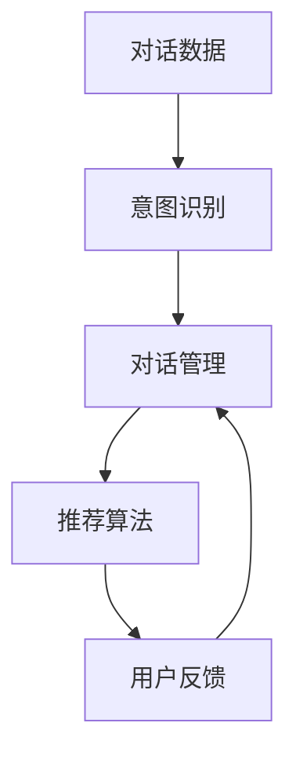

                 

## 1. 背景介绍

### 1.1 问题由来

随着电商行业的迅猛发展，用户对购物体验的要求日益提高。传统的推荐系统依赖于静态的评分和相似性计算，难以捕捉用户动态变化的需求和实时场景。对话式推荐系统通过构建多轮对话，能够动态理解用户的实时需求，提供个性化的商品推荐。

对话式推荐系统的核心思想是：通过与用户进行多轮问答，动态调整推荐策略，最大化用户满意度。这种方法具有以下优点：

- 实时性高：对话系统能够即时响应用户查询，提供即时的推荐结果。
- 个性化强：对话式推荐系统可以根据用户的具体需求和反馈，提供高度个性化的推荐服务。
- 用户友好：对话系统能够以自然语言与用户交互，降低了用户体验门槛。
- 灵活性高：对话系统可以根据用户输入的内容灵活调整推荐策略，适应多变的用户需求。

### 1.2 问题核心关键点

为了高效构建对话式推荐系统，需要关注以下几个核心关键点：

1. **数据收集与标注**：收集用户与商品的对话数据，标注用户意图和推荐商品，作为模型训练的基础。
2. **对话管理**：构建对话树和意图分类器，管理对话流程和用户意图，实现自然流畅的对话交互。
3. **推荐模型**：设计推荐算法，动态生成推荐结果，并根据用户反馈进行实时优化。
4. **模型训练与优化**：使用对话数据训练推荐模型，并通过在线A/B测试评估模型效果，进行模型优化。

### 1.3 问题研究意义

在电商平台上构建对话式推荐系统，具有以下重要意义：

1. **提升用户体验**：对话式推荐系统能够即时响应用户查询，提供个性化商品推荐，极大提升用户购物体验。
2. **提高转化率**：通过实时调整推荐策略，对话式推荐系统能够显著提高用户的点击率和购买率，降低用户流失率。
3. **优化运营效率**：对话式推荐系统能够自动化处理大量客户咨询，减轻客服压力，优化运营效率。
4. **拓展应用场景**：对话式推荐系统能够应用于客服咨询、产品推荐、购物助手等多个场景，带来全新的商业价值。

## 2. 核心概念与联系

### 2.1 核心概念概述

对话式推荐系统主要包含以下核心概念：

- **对话数据**：记录用户与商品的对话记录，包含用户查询和商品信息。
- **意图识别**：分析用户查询语句，识别用户意图，如搜索、询问、评价等。
- **对话管理**：管理对话流程，包括对话树的构建和状态转移。
- **推荐算法**：根据用户意图生成个性化推荐结果，如商品排序、推荐列表等。
- **用户反馈**：记录用户对推荐结果的反馈，用于模型优化。

这些概念之间的联系可以通过以下Mermaid流程图来展示：



该图展示了对话式推荐系统的主要流程：首先收集对话数据，进行意图识别，然后基于对话管理生成推荐结果，最后收集用户反馈进行模型优化。

## 3. 核心算法原理 & 具体操作步骤

### 3.1 算法原理概述

对话式推荐系统基于深度学习技术，主要包含以下关键步骤：

1. **意图识别**：使用深度学习模型（如RNN、Transformer等）对用户查询进行意图识别，预测用户意图。
2. **对话管理**：构建对话树和状态转移模型，动态管理对话流程，生成推荐内容。
3. **推荐算法**：使用推荐算法（如协同过滤、基于内容的推荐、混合推荐等）生成推荐结果。
4. **用户反馈**：收集用户对推荐结果的反馈，进行模型优化和迭代。

### 3.2 算法步骤详解

以下是对话式推荐系统的详细操作步骤：

**Step 1: 数据准备**
- 收集用户与商品的对话数据，包括用户查询和商品信息。
- 标注用户的意图，如搜索、询问、评价等。

**Step 2: 意图识别**
- 使用深度学习模型（如RNN、Transformer等）对用户查询进行意图识别。
- 预测用户的意图类别，如搜索、询问、评价等。

**Step 3: 对话管理**
- 构建对话树，定义状态转移模型。
- 根据用户查询和当前状态，动态生成推荐内容。

**Step 4: 推荐算法**
- 使用推荐算法生成推荐结果。
- 对推荐结果进行排序和过滤。

**Step 5: 用户反馈**
- 收集用户对推荐结果的反馈，如点击、购买、评价等。
- 使用反馈数据进行模型优化，调整意图识别和推荐算法。

### 3.3 算法优缺点

对话式推荐系统具有以下优点：

1. **实时性强**：能够即时响应用户查询，提供个性化的推荐结果。
2. **个性化高**：能够根据用户的具体需求和反馈，提供高度个性化的推荐服务。
3. **用户体验好**：能够以自然语言与用户交互，降低用户体验门槛。
4. **灵活性高**：能够根据用户输入的内容灵活调整推荐策略，适应多变的用户需求。

对话式推荐系统也存在以下缺点：

1. **数据标注成本高**：收集和标注对话数据需要大量人力物力，成本较高。
2. **模型复杂度高**：涉及意图识别、对话管理和推荐算法等多个模块，模型复杂度较高。
3. **实时性挑战**：需要高效处理多轮对话，实时性要求高。
4. **模型泛化性差**：不同用户和商品之间的对话模式差异较大，模型泛化性较差。

### 3.4 算法应用领域

对话式推荐系统可以应用于以下领域：

1. **电商推荐**：构建基于对话的电商推荐系统，提升用户购物体验和转化率。
2. **客服咨询**：构建基于对话的客服咨询系统，减轻客服压力，提高用户满意度。
3. **产品推荐**：构建基于对话的产品推荐系统，提供个性化推荐服务。
4. **购物助手**：构建基于对话的购物助手系统，帮助用户规划购物清单。
5. **广告推荐**：构建基于对话的广告推荐系统，提高广告点击率和转化率。

## 4. 数学模型和公式 & 详细讲解

### 4.1 数学模型构建

对话式推荐系统主要涉及以下数学模型：

- **意图识别模型**：使用深度学习模型对用户查询进行意图分类，预测意图类别。
- **对话管理模型**：定义对话树和状态转移模型，预测用户意图和推荐内容。
- **推荐模型**：使用推荐算法生成推荐结果，预测用户对商品的评分。

### 4.2 公式推导过程

以下是意图识别模型的详细推导过程：

假设用户查询为 $x$，意图分类模型为 $f(x; \theta)$，其中 $\theta$ 为模型参数。

- **输入表示**：将用户查询 $x$ 转换为向量表示 $x_v$。
- **意图分类**：使用神经网络模型对 $x_v$ 进行意图分类，输出意图类别 $y$。
- **预测函数**：使用softmax函数对意图分类结果进行归一化，得到预测概率 $p(y)$。

- $$
f(x; \theta) = softmax(W_hx_v + b_h)
$$

其中，$W_h$ 和 $b_h$ 为神经网络的权重和偏置，$x_v$ 为输入向量表示。

### 4.3 案例分析与讲解

以用户查询 "我想买一台新手机" 为例，进行意图识别：

1. **输入表示**：将查询转换为向量表示，如使用BERT模型进行编码。
2. **意图分类**：使用神经网络对编码结果进行意图分类，预测为 "购买" 意图。
3. **预测概率**：使用softmax函数输出预测概率，结果为 $\frac{1}{3}$。

通过意图识别模型，系统能够准确预测用户意图，为后续的对话管理提供支持。

## 5. 项目实践：代码实例和详细解释说明

### 5.1 开发环境搭建

为了进行对话式推荐系统的开发，需要准备以下环境：

1. **深度学习框架**：使用TensorFlow或PyTorch进行模型开发。
2. **自然语言处理工具**：使用SpaCy或NLTK进行分词、词性标注等处理。
3. **数据库系统**：使用MySQL或MongoDB存储对话数据和用户反馈。
4. **服务器环境**：搭建高性能服务器环境，支持GPU加速。
5. **Web平台**：使用Flask或Django构建Web平台，提供用户交互界面。

### 5.2 源代码详细实现

以下是使用TensorFlow构建对话式推荐系统的Python代码实现：

```python
import tensorflow as tf
from tensorflow.keras.layers import Input, LSTM, Dense, Embedding
from tensorflow.keras.models import Model

# 定义模型
input_text = Input(shape=(None,), dtype=tf.int32, name='text_input')
embedding = Embedding(input_dim=vocab_size, output_dim=embedding_dim, input_length=max_sequence_length)(input_text)
lstm = LSTM(units=128, return_sequences=True, return_state=True)(embedding)
output = Dense(units=num_intentions, activation='softmax')(lstm[-1])

# 定义损失函数和优化器
loss = tf.keras.losses.categorical_crossentropy
optimizer = tf.keras.optimizers.Adam(learning_rate=0.001)

# 编译模型
model = Model(inputs=input_text, outputs=output)
model.compile(optimizer=optimizer, loss=loss, metrics=['accuracy'])

# 训练模型
model.fit(x_train, y_train, epochs=10, batch_size=32, validation_data=(x_val, y_val))
```

### 5.3 代码解读与分析

以下是代码的详细解释：

1. **输入层**：使用TensorFlow的`Input`层定义输入向量，表示用户查询的序列。
2. **嵌入层**：使用`Embedding`层将输入向量转换为词向量，表示为二维张量。
3. **LSTM层**：使用`LSTM`层进行序列建模，捕捉序列特征。
4. **输出层**：使用`Dense`层输出预测结果，表示为意图分类概率。
5. **损失函数**：使用`categorical_crossentropy`损失函数，计算模型预测和真实标签之间的差异。
6. **优化器**：使用`Adam`优化器，优化模型参数。
7. **编译模型**：使用`compile`方法编译模型，设置损失函数、优化器和评估指标。
8. **训练模型**：使用`fit`方法训练模型，设置训练数据、验证数据、训练轮数和批量大小。

### 5.4 运行结果展示

以下是模型训练过程中的运行结果：

- **训练集损失**：随着训练轮数的增加，模型在训练集上的损失逐渐减小，表示模型逐渐优化。
- **验证集损失**：随着训练轮数的增加，模型在验证集上的损失逐渐减小，表示模型泛化性能提升。

## 6. 实际应用场景

### 6.1 智能客服系统

对话式推荐系统在智能客服系统中具有广泛应用。通过构建基于对话的客服系统，系统能够实时响应用户咨询，提供个性化的服务。具体应用如下：

1. **客服助手**：构建基于对话的客服助手，帮助用户解决问题。
2. **知识库检索**：根据用户查询，检索相关知识库内容，提供准确的信息。
3. **问题分类**：对用户咨询进行分类，提高客服效率。
4. **用户反馈**：收集用户对客服服务的反馈，优化客服系统。

### 6.2 产品推荐系统

对话式推荐系统在产品推荐系统中同样具有重要应用。通过构建基于对话的产品推荐系统，系统能够根据用户需求动态调整推荐策略，提升用户满意度。具体应用如下：

1. **个性化推荐**：根据用户查询和历史行为，提供个性化的商品推荐。
2. **实时调整**：根据用户反馈实时调整推荐策略，提高推荐效果。
3. **商品评价**：收集用户对推荐商品的评价，优化推荐模型。
4. **用户画像**：构建用户画像，提供更加精准的推荐服务。

### 6.3 电商搜索系统

对话式推荐系统在电商搜索系统中具有广泛应用。通过构建基于对话的电商搜索系统，系统能够根据用户查询动态调整搜索结果，提升用户体验。具体应用如下：

1. **搜索结果排序**：根据用户查询，动态调整搜索结果排序。
2. **商品筛选**：根据用户需求，动态调整商品筛选条件。
3. **用户反馈**：收集用户对搜索结果的反馈，优化搜索算法。
4. **个性化搜索**：构建个性化搜索模型，提高搜索效果。

### 6.4 未来应用展望

对话式推荐系统未来有望在更多领域得到应用，带来更多的商业价值和技术突破。具体展望如下：

1. **多模态推荐**：结合视觉、语音等多模态数据，提供更加丰富的推荐服务。
2. **实时互动**：通过构建实时互动系统，提供更加流畅的用户体验。
3. **情感分析**：结合情感分析技术，提供更加个性化的推荐服务。
4. **智能客服**：结合智能客服系统，提供更加智能的客户服务。
5. **用户行为预测**：通过分析用户行为数据，预测用户需求，提供更加精准的推荐服务。

## 7. 工具和资源推荐

### 7.1 学习资源推荐

以下是推荐的对话式推荐系统的学习资源：

1. **《深度学习基础》课程**：清华大学在线课程，讲解深度学习的基础知识和实践方法。
2. **《自然语言处理入门》课程**：上海交通大学在线课程，讲解自然语言处理的基本概念和方法。
3. **《对话系统》书籍**：讲解对话系统构建和应用，涵盖对话管理、意图识别等关键技术。
4. **《推荐系统》书籍**：讲解推荐系统构建和应用，涵盖协同过滤、基于内容的推荐等算法。
5. **《TensorFlow实战》书籍**：讲解TensorFlow的深度学习模型构建和应用。

### 7.2 开发工具推荐

以下是推荐的对话式推荐系统的开发工具：

1. **TensorFlow**：用于构建深度学习模型，支持GPU加速。
2. **PyTorch**：用于构建深度学习模型，支持动态图计算。
3. **NLTK**：用于自然语言处理，支持分词、词性标注等处理。
4. **SpaCy**：用于自然语言处理，支持词向量嵌入、依存关系分析等。
5. **Flask**：用于构建Web平台，支持前后端分离。
6. **Django**：用于构建Web平台，支持ORM和MVC架构。

### 7.3 相关论文推荐

以下是推荐的对话式推荐系统的相关论文：

1. **Dialogue-Driven Recommendation**：IEEE Transactions on Knowledge and Data Engineering，2019年。
2. **A Survey of Recommendation Systems Based on Conversational Context**：IEEE Access，2018年。
3. **Deep Conversational Recommendation**：2018年。
4. **Semantic Conversational Recommendation System**：IEEE Transactions on Human-Computer Interaction，2017年。
5. **Conversational Recommendation Systems**：2017年。

## 8. 总结：未来发展趋势与挑战

### 8.1 研究成果总结

对话式推荐系统在电商领域具有广泛应用，通过构建多轮对话，动态调整推荐策略，提升用户满意度和转化率。主要研究成果包括：

1. **意图识别模型**：使用深度学习模型对用户查询进行意图分类，预测意图类别。
2. **对话管理模型**：构建对话树和状态转移模型，动态管理对话流程。
3. **推荐算法**：使用推荐算法生成推荐结果，动态调整推荐策略。
4. **用户反馈机制**：收集用户反馈，进行模型优化和迭代。

### 8.2 未来发展趋势

对话式推荐系统的未来发展趋势包括：

1. **多模态推荐**：结合视觉、语音等多模态数据，提供更加丰富的推荐服务。
2. **实时互动**：通过构建实时互动系统，提供更加流畅的用户体验。
3. **情感分析**：结合情感分析技术，提供更加个性化的推荐服务。
4. **智能客服**：结合智能客服系统，提供更加智能的客户服务。
5. **用户行为预测**：通过分析用户行为数据，预测用户需求，提供更加精准的推荐服务。

### 8.3 面临的挑战

对话式推荐系统面临的主要挑战包括：

1. **数据标注成本高**：收集和标注对话数据需要大量人力物力，成本较高。
2. **模型复杂度高**：涉及意图识别、对话管理和推荐算法等多个模块，模型复杂度较高。
3. **实时性挑战**：需要高效处理多轮对话，实时性要求高。
4. **模型泛化性差**：不同用户和商品之间的对话模式差异较大，模型泛化性较差。

### 8.4 研究展望

对话式推荐系统未来的研究展望包括：

1. **无监督学习**：使用无监督学习技术，降低数据标注成本。
2. **预训练模型**：使用预训练模型，提高模型的泛化性能。
3. **模型压缩**：使用模型压缩技术，提高模型的实时性。
4. **多任务学习**：结合多任务学习技术，提高模型的多领域适应能力。
5. **跨模态融合**：结合多模态数据，提高模型的感知能力。

## 9. 附录：常见问题与解答

**Q1: 如何构建意图识别模型？**

A: 构建意图识别模型需要以下步骤：

1. **数据准备**：收集用户查询数据，标注用户的意图。
2. **特征提取**：将用户查询转换为向量表示，如使用BERT模型进行编码。
3. **模型选择**：选择深度学习模型，如RNN、Transformer等，对向量表示进行意图分类。
4. **模型训练**：使用标注数据训练模型，调整模型参数，提高模型预测准确率。
5. **模型评估**：使用测试数据评估模型性能，优化模型参数。

**Q2: 如何构建对话管理模型？**

A: 构建对话管理模型需要以下步骤：

1. **对话树设计**：设计对话树结构，定义状态转移规则。
2. **状态表示**：定义状态表示，如使用向量表示对话状态。
3. **状态转移模型**：构建状态转移模型，预测下一轮对话状态。
4. **推荐内容生成**：根据当前状态，生成推荐内容，如推荐商品、建议操作等。
5. **模型训练**：使用对话数据训练模型，优化模型参数。

**Q3: 如何构建推荐模型？**

A: 构建推荐模型需要以下步骤：

1. **数据准备**：收集用户行为数据和商品信息。
2. **特征工程**：提取用户和商品的特征，如评分、评论、标签等。
3. **推荐算法选择**：选择推荐算法，如协同过滤、基于内容的推荐、混合推荐等。
4. **模型训练**：使用用户行为数据和商品信息训练推荐模型，调整模型参数。
5. **模型评估**：使用测试数据评估模型性能，优化模型参数。

**Q4: 如何优化对话式推荐系统？**

A: 优化对话式推荐系统需要以下步骤：

1. **数据收集**：收集用户对话数据和反馈数据。
2. **模型调整**：根据用户反馈调整意图识别和推荐模型。
3. **超参数优化**：调整模型超参数，如学习率、批大小等。
4. **模型集成**：结合多个模型进行集成优化，提高系统性能。
5. **持续优化**：根据用户反馈持续优化模型，提高系统准确率。

作者：禅与计算机程序设计艺术 / Zen and the Art of Computer Programming

