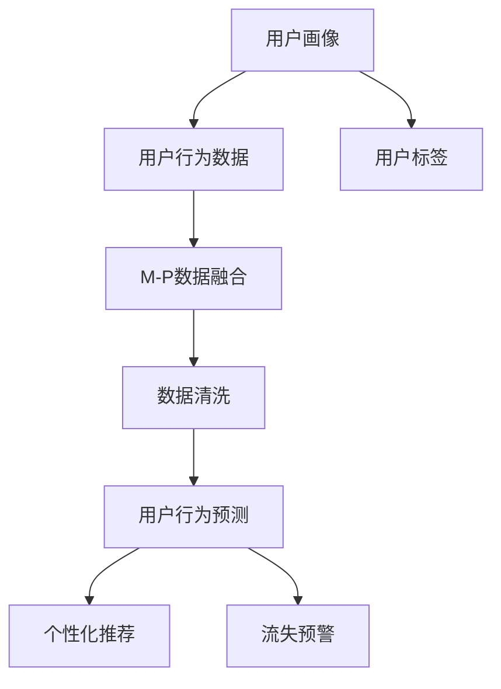

                 

## 1. 背景介绍

### 1.1 问题由来
随着电商市场的快速发展，多平台运营成为电商平台的主要经营策略。然而，用户在多个平台间切换购买行为，会导致用户行为数据在各个平台间分布不均，难以进行统一分析和管理。如何在多平台间整合用户行为数据，进行全面的用户行为分析，成为电商运营中亟待解决的问题。

### 1.2 问题核心关键点
跨平台用户行为分析的核心关键点在于如何处理跨平台用户数据，实现数据的整合、清洗、分析和应用。其中，数据的整合和清洗是基础，数据的分析和应用则是目标。具体问题包括：
- 用户数据的整合：如何将不同平台的用户数据统一到同一分析平台。
- 用户数据的清洗：如何处理数据中的缺失值、异常值、重复值等，保证数据质量。
- 用户行为分析：如何基于整合后的数据，进行用户行为预测、个性化推荐、流失预警等分析，提升用户转化率和满意度。
- 应用实施：如何将分析结果应用于电商运营策略中，实现业务价值最大化。

### 1.3 问题研究意义
跨平台用户行为分析对于电商平台具有重要的意义：

1. **优化用户体验**：通过分析用户在不同平台的行为，电商平台能够了解用户偏好和需求，提供更加个性化和精准的服务，提升用户满意度和忠诚度。
2. **提升运营效率**：通过对用户行为数据的全面分析，电商平台能够优化库存管理、销售策略、广告投放等运营环节，提升运营效率和盈利能力。
3. **推动业务创新**：跨平台数据整合和分析，为电商平台的业务创新提供了丰富的数据支持，如基于用户行为的精准营销、新产品的定向推荐等。

## 2. 核心概念与联系

### 2.1 核心概念概述

为更好地理解跨平台用户行为分析，本节将介绍几个密切相关的核心概念：

- **用户画像(User Profile)**：基于用户行为数据生成的用户特征集合，用于刻画用户的基本信息、兴趣偏好、购买历史等。
- **用户行为数据(User Behavior Data)**：用户在电商平台上的各种行为数据，如浏览记录、点击行为、购买记录等。
- **用户标签(User Label)**：通过对用户行为数据分析，对用户进行自动或手动打标签，如高价值用户、潜在流失用户等。
- **多平台数据融合(Multi-Platform Data Integration)**：将不同平台的用户行为数据进行整合，形成统一的用户行为数据集。
- **数据清洗(Data Cleaning)**：去除数据中的噪声和异常值，保证数据质量。
- **用户行为预测(User Behavior Prediction)**：基于用户历史行为数据，预测用户未来的行为，如购买意向、流失概率等。
- **个性化推荐(Personalized Recommendation)**：根据用户画像和行为数据，为用户提供个性化的商品推荐。
- **流失预警(User Churn Prediction)**：通过分析用户行为数据，识别出可能流失的用户，提前采取措施进行挽留。

这些核心概念之间的逻辑关系可以通过以下Mermaid流程图来展示：



这个流程图展示了这个过程中涉及的关键组件及其之间的关系：

1. 用户画像作为基础，从用户行为数据中生成。
2. 用户行为数据经过多平台数据融合和数据清洗，形成高质量的数据集。
3. 用户行为预测、个性化推荐和流失预警等应用基于整合后的数据集进行。

## 3. 核心算法原理 & 具体操作步骤
### 3.1 算法原理概述

跨平台用户行为分析的核心算法原理包括以下几个方面：

1. **用户画像生成**：通过对用户行为数据的统计和特征提取，生成用户画像。用户画像可以包括用户的兴趣偏好、购买历史、行为周期等。
2. **多平台数据融合**：采用各种技术手段，将不同平台的用户行为数据进行整合，形成统一的用户行为数据集。
3. **数据清洗**：对整合后的数据进行缺失值处理、异常值检测和重复数据去重等，确保数据质量。
4. **用户行为分析**：通过统计分析、机器学习等方法，对用户行为数据进行建模和分析，提取有价值的用户行为特征。
5. **用户行为预测**：基于历史行为数据，通过回归、分类、时序预测等方法，预测用户未来的行为，如购买意向、流失概率等。
6. **个性化推荐**：根据用户画像和行为数据，通过协同过滤、基于内容的推荐、深度学习等方法，提供个性化的商品推荐。
7. **流失预警**：通过分析用户行为数据，识别出可能流失的用户，提前采取措施进行挽留。

### 3.2 算法步骤详解

#### 3.2.1 用户画像生成

用户画像的生成涉及用户行为数据的特征提取和统计分析。具体步骤包括：

1. **特征提取**：从用户行为数据中提取有意义的特征，如浏览记录、点击行为、购买记录等。
2. **统计分析**：对提取的特征进行统计分析，生成用户画像的基本属性，如平均浏览时间、购买频率等。
3. **特征筛选**：通过特征选择算法（如卡方检验、互信息等），筛选出最具代表性的特征，构建用户画像。

#### 3.2.2 多平台数据融合

多平台数据融合是将不同平台的用户行为数据进行整合的过程。具体步骤包括：

1. **数据对齐**：对不同平台的用户行为数据进行对齐，如时间戳对齐、用户ID对齐等。
2. **数据拼接**：将对齐后的数据进行拼接，形成统一的用户行为数据集。
3. **数据标准化**：对拼接后的数据进行标准化处理，如将不同平台的数据单位统一。

#### 3.2.3 数据清洗

数据清洗是确保数据质量的重要步骤。具体步骤包括：

1. **缺失值处理**：对缺失值进行填充或删除，保证数据完整性。
2. **异常值检测**：对异常值进行检测和处理，避免其对分析结果的影响。
3. **重复值去重**：对重复数据进行去重，保证数据的唯一性。

#### 3.2.4 用户行为分析

用户行为分析是通过统计分析和机器学习方法，对用户行为数据进行建模和分析。具体步骤包括：

1. **统计分析**：对用户行为数据进行基本统计分析，如均值、方差、频率等。
2. **建模分析**：采用机器学习算法（如回归、分类、聚类等）对用户行为数据进行建模分析，提取有价值的用户行为特征。
3. **特征提取**：从建模分析中提取用户行为特征，用于后续的预测和推荐。

#### 3.2.5 用户行为预测

用户行为预测是通过历史行为数据，预测用户未来的行为。具体步骤包括：

1. **数据准备**：对用户行为数据进行预处理，包括特征提取、数据标准化等。
2. **模型训练**：采用回归、分类、时序预测等模型对用户行为数据进行训练，生成预测模型。
3. **模型评估**：对训练好的模型进行评估，选择最优模型进行预测。

#### 3.2.6 个性化推荐

个性化推荐是通过用户画像和行为数据，为用户提供个性化的商品推荐。具体步骤包括：

1. **数据准备**：对用户画像和行为数据进行预处理，包括特征提取、数据标准化等。
2. **模型训练**：采用协同过滤、基于内容的推荐、深度学习等模型对用户数据进行训练，生成推荐模型。
3. **推荐生成**：根据训练好的模型，生成个性化的商品推荐结果。

#### 3.2.7 流失预警

流失预警是通过分析用户行为数据，识别出可能流失的用户，提前采取措施进行挽留。具体步骤包括：

1. **数据准备**：对用户行为数据进行预处理，包括特征提取、数据标准化等。
2. **模型训练**：采用分类模型（如逻辑回归、随机森林等）对用户行为数据进行训练，生成流失预警模型。
3. **预警生成**：根据训练好的模型，对新用户进行预测，识别出可能流失的用户。

### 3.3 算法优缺点

跨平台用户行为分析算法具有以下优点：

1. **全面性**：通过整合不同平台的用户行为数据，可以更全面地了解用户行为，提升分析结果的准确性。
2. **个性化**：基于用户画像和行为数据，可以提供个性化的商品推荐和精准营销，提升用户体验。
3. **实时性**：通过实时分析用户行为数据，可以及时发现并应对用户流失等风险，提升运营效率。

同时，该算法也存在以下缺点：

1. **数据隐私问题**：整合不同平台的数据可能涉及用户隐私问题，需要遵守相关法律法规。
2. **数据质量问题**：不同平台的数据质量和格式可能不一致，需要投入大量资源进行数据清洗和标准化。
3. **模型复杂性**：多平台数据的整合和分析需要采用复杂的算法，增加了模型复杂度和维护成本。

尽管存在这些局限性，但就目前而言，跨平台用户行为分析算法在电商运营中仍然具有重要的应用价值。未来相关研究的重点在于如何进一步提高数据整合的效率和精度，同时兼顾用户隐私和数据质量，以及如何简化模型复杂度，降低维护成本。

### 3.4 算法应用领域

跨平台用户行为分析算法已经在多个电商应用场景中得到了广泛的应用，例如：

1. **用户画像生成**：基于多平台的用户行为数据，生成精细化的用户画像，用于精准营销和个性化服务。
2. **商品推荐**：通过整合不同平台的用户行为数据，进行商品推荐系统的优化和升级，提升推荐效果。
3. **流失预警**：通过分析用户在不同平台的行为数据，识别出可能流失的用户，提前采取措施进行挽留。
4. **用户满意度分析**：基于用户行为数据，分析用户的满意度和忠诚度，优化用户体验。
5. **广告投放优化**：通过整合不同平台的用户行为数据，进行广告投放的优化和精准投放，提升广告效果。
6. **库存管理**：基于用户行为数据，进行库存管理的优化和预测，提升库存利用率。

除了上述这些经典场景外，跨平台用户行为分析算法还被创新性地应用到更多领域中，如客户细分、需求预测、营销效果评估等，为电商平台的运营和创新提供了丰富的数据支持。

## 4. 数学模型和公式 & 详细讲解  
### 4.1 数学模型构建

本节将使用数学语言对跨平台用户行为分析过程进行更加严格的刻画。

记用户画像为 $P$，包含用户的基本信息、兴趣偏好、购买历史等特征。记用户行为数据为 $B$，包含用户在电商平台上的一系列行为，如浏览记录、点击行为、购买记录等。记用户标签为 $L$，用于对用户进行自动或手动打标签，如高价值用户、潜在流失用户等。记多平台数据融合后的数据集为 $D$，包含不同平台的用户行为数据。

### 4.2 公式推导过程

#### 4.2.1 用户画像生成

用户画像生成过程中，需要从用户行为数据 $B$ 中提取有意义的特征，并通过统计分析生成用户画像 $P$。具体公式如下：

$$
P = f(B) = \{f_1(B), f_2(B), \dots, f_n(B)\}
$$

其中 $f_i$ 为特征提取函数，$i \in [1, n]$。例如，可以采用均值、方差、频率等统计方法对用户行为数据进行特征提取，生成用户画像。

#### 4.2.2 多平台数据融合

多平台数据融合过程，需要将不同平台的用户行为数据 $B_1, B_2, \dots, B_m$ 进行整合，生成统一的用户行为数据集 $D$。具体公式如下：

$$
D = \bigcup_{i=1}^{m} B_i
$$

其中 $i \in [1, m]$。在进行数据融合时，需要确保不同平台的数据质量和格式一致，并进行必要的对齐和标准化处理。

#### 4.2.3 数据清洗

数据清洗过程中，需要处理数据中的缺失值、异常值和重复值等，确保数据质量。具体公式如下：

$$
D_{clean} = D - \{missing, outliers, duplicates\}
$$

其中 $missing$ 表示缺失值，$outliers$ 表示异常值，$duplicates$ 表示重复值。在进行数据清洗时，需要根据具体情况选择适当的处理方法，如填充、删除、去重等。

#### 4.2.4 用户行为分析

用户行为分析过程中，需要采用统计分析或机器学习算法对用户行为数据 $B$ 进行建模和分析，提取有价值的用户行为特征 $F$。具体公式如下：

$$
F = g(B) = \{g_1(B), g_2(B), \dots, g_k(B)\}
$$

其中 $g_i$ 为建模分析函数，$i \in [1, k]$。例如，可以采用回归、分类、聚类等机器学习算法对用户行为数据进行建模分析，提取用户行为特征。

#### 4.2.5 用户行为预测

用户行为预测过程中，需要采用回归、分类、时序预测等模型对用户行为数据 $B$ 进行预测，生成预测结果 $Y$。具体公式如下：

$$
Y = h(B) = \{h_1(B), h_2(B), \dots, h_m(B)\}
$$

其中 $h_i$ 为预测模型，$i \in [1, m]$。例如，可以采用线性回归、逻辑回归、随机森林等模型对用户行为数据进行预测，生成预测结果。

#### 4.2.6 个性化推荐

个性化推荐过程中，需要采用协同过滤、基于内容的推荐、深度学习等模型对用户数据进行推荐，生成推荐结果 $R$。具体公式如下：

$$
R = r(P, F) = \{r_1(P, F), r_2(P, F), \dots, r_k(P, F)\}
$$

其中 $r_i$ 为推荐模型，$i \in [1, k]$。例如，可以采用协同过滤、基于内容的推荐、深度学习等模型对用户数据进行推荐，生成推荐结果。

#### 4.2.7 流失预警

流失预警过程中，需要采用分类模型对用户行为数据进行预测，生成流失预警结果 $C$。具体公式如下：

$$
C = c(B) = \{c_1(B), c_2(B), \dots, c_n(B)\}
$$

其中 $c_i$ 为流失预警模型，$i \in [1, n]$。例如，可以采用逻辑回归、随机森林等模型对用户行为数据进行预测，生成流失预警结果。

## 5. 项目实践：代码实例和详细解释说明
### 5.1 开发环境搭建

在进行跨平台用户行为分析实践前，我们需要准备好开发环境。以下是使用Python进行Pandas、NumPy、Scikit-Learn等工具包开发的环境配置流程：

1. 安装Anaconda：从官网下载并安装Anaconda，用于创建独立的Python环境。

2. 创建并激活虚拟环境：
```bash
conda create -n cross_platform_env python=3.8 
conda activate cross_platform_env
```

3. 安装相关库：
```bash
pip install pandas numpy scikit-learn matplotlib
```

4. 安装第三方库：
```bash
pip install transformers
```

完成上述步骤后，即可在`cross_platform_env`环境中开始实践。

### 5.2 源代码详细实现

这里我们以用户行为预测为例，给出使用Pandas、NumPy、Scikit-Learn等工具包对跨平台用户行为数据进行预测的Python代码实现。

首先，定义数据处理函数：

```python
import pandas as pd
import numpy as np
from sklearn.model_selection import train_test_split
from sklearn.linear_model import LogisticRegression
from sklearn.metrics import accuracy_score

def load_data(file_path):
    data = pd.read_csv(file_path)
    return data

def preprocess_data(data):
    # 处理缺失值
    data = data.dropna()
    # 处理异常值
    data = data.drop([row for row in data.index if row['avg_browsing_time'] > 60])
    return data

def train_model(data):
    # 特征提取
    X = data[['avg_browsing_time', 'purchase_frequency']]
    y = data['churn']
    # 数据分割
    X_train, X_test, y_train, y_test = train_test_split(X, y, test_size=0.2)
    # 模型训练
    model = LogisticRegression()
    model.fit(X_train, y_train)
    # 模型评估
    y_pred = model.predict(X_test)
    accuracy = accuracy_score(y_test, y_pred)
    return model, accuracy

# 加载数据
data = load_data('user_behavior.csv')

# 预处理数据
data = preprocess_data(data)

# 训练模型
model, accuracy = train_model(data)

# 输出结果
print(f"模型准确率：{accuracy}")
```

然后，定义预测函数：

```python
def predict(model, data):
    X = data[['avg_browsing_time', 'purchase_frequency']]
    y_pred = model.predict(X)
    return y_pred
```

最后，启动预测流程：

```python
# 加载待预测数据
test_data = load_data('test_user_behavior.csv')

# 预处理待预测数据
test_data = preprocess_data(test_data)

# 预测结果
y_pred = predict(model, test_data)
print(y_pred)
```

以上就是使用Pandas、NumPy、Scikit-Learn等工具包对跨平台用户行为数据进行预测的完整代码实现。可以看到，通过Python的Pandas库，我们可以高效地进行数据处理和分析；通过Scikit-Learn库，我们可以方便地进行模型训练和评估。

### 5.3 代码解读与分析

让我们再详细解读一下关键代码的实现细节：

**load_data函数**：
- 使用Pandas的`read_csv`方法读取CSV文件，并将数据转化为DataFrame对象。

**preprocess_data函数**：
- 对数据进行缺失值处理和异常值检测，去除缺失值和异常值。

**train_model函数**：
- 对数据进行特征提取，使用Scikit-Learn的`train_test_split`方法分割数据为训练集和测试集。
- 使用Scikit-Learn的`LogisticRegression`模型进行训练，并计算模型在测试集上的准确率。

**predict函数**：
- 对测试数据进行特征提取，使用训练好的模型进行预测。

**启动预测流程**：
- 加载待预测数据，并进行预处理。
- 使用训练好的模型进行预测，并输出结果。

可以看到，Python的Pandas、NumPy、Scikit-Learn等工具包使得跨平台用户行为分析的代码实现变得简洁高效。开发者可以将更多精力放在数据处理、模型改进等高层逻辑上，而不必过多关注底层的实现细节。

当然，工业级的系统实现还需考虑更多因素，如数据质量控制、模型部署、超参数调优等。但核心的跨平台用户行为分析流程基本与此类似。

## 6. 实际应用场景
### 6.1 智能推荐系统

跨平台用户行为分析在智能推荐系统中的应用非常广泛。通过整合不同平台的用户行为数据，智能推荐系统可以更全面地了解用户偏好和需求，提供更加个性化和精准的商品推荐。

具体而言，智能推荐系统可以通过用户画像和行为数据，生成用户行为预测结果，并根据预测结果进行个性化推荐。例如，电商平台的智能推荐系统可以根据用户的历史浏览和购买记录，预测用户可能感兴趣的商品，并实时推送推荐结果，提升用户转化率和满意度。

### 6.2 流失预警系统

跨平台用户行为分析在流失预警系统中的应用也非常重要。通过分析用户在不同平台的行为数据，流失预警系统可以识别出可能流失的用户，提前采取措施进行挽留。

具体而言，流失预警系统可以通过用户行为数据，生成流失预测结果，并根据预测结果进行预警。例如，电商平台的流失预警系统可以根据用户的浏览和购买行为，预测用户的流失概率，并及时通知运营团队进行挽留。通过流失预警，电商平台可以降低用户流失率，提升用户粘性和忠诚度。

### 6.3 用户满意度分析系统

跨平台用户行为分析在用户满意度分析系统中的应用也非常关键。通过分析用户在不同平台的行为数据，用户满意度分析系统可以了解用户的满意度和忠诚度，优化用户体验。

具体而言，用户满意度分析系统可以通过用户行为数据，生成用户满意度分析结果，并根据分析结果进行优化。例如，电商平台的满意度分析系统可以根据用户的浏览和购买行为，分析用户的满意度，并及时优化产品和服务，提升用户满意度和忠诚度。

### 6.4 未来应用展望

随着数据量的不断增长和技术的不断发展，跨平台用户行为分析将有更广阔的应用前景。

1. **实时分析**：未来的跨平台用户行为分析将更加注重实时性，通过实时分析用户行为数据，及时发现并应对用户流失等风险。
2. **多模态融合**：未来的跨平台用户行为分析将更加注重多模态数据的融合，如文本、图像、语音等多模态数据，提升分析结果的全面性和准确性。
3. **联邦学习**：未来的跨平台用户行为分析将更加注重联邦学习的应用，通过分布式计算和加密技术，保护用户隐私，提升数据安全。
4. **自然语言处理**：未来的跨平台用户行为分析将更加注重自然语言处理技术的应用，提升数据分析的深度和广度。
5. **个性化推荐**：未来的跨平台用户行为分析将更加注重个性化推荐技术的应用，通过用户画像和行为数据，提供更加精准和个性化的推荐结果。
6. **用户行为预测**：未来的跨平台用户行为分析将更加注重用户行为预测技术的应用，通过历史数据预测用户未来行为，提升运营效率和用户满意度。

以上趋势凸显了跨平台用户行为分析技术的广阔前景。这些方向的探索发展，必将进一步提升智能推荐系统和流失预警系统的效果，为用户带来更好的体验。

## 7. 工具和资源推荐
### 7.1 学习资源推荐

为了帮助开发者系统掌握跨平台用户行为分析的理论基础和实践技巧，这里推荐一些优质的学习资源：

1. **《Python数据分析与可视化》书籍**：详细介绍了使用Python进行数据处理、分析和可视化的方法和技巧，是数据分析的入门必读。
2. **《机器学习实战》书籍**：介绍了多种机器学习算法和模型的实现方法和应用场景，是机器学习的经典教材。
3. **《数据科学实战》课程**：由知名数据科学家授课，介绍了数据科学和机器学习的基本概念和实践技巧，适合初学者学习。
4. **Kaggle平台**：提供丰富的数据集和机器学习竞赛，是提升数据分析和机器学习技能的好地方。
5. **Coursera平台**：提供多种数据科学和机器学习课程，由世界顶级大学和公司授课，内容丰富，覆盖面广。

通过对这些资源的学习实践，相信你一定能够快速掌握跨平台用户行为分析的精髓，并用于解决实际的电商运营问题。

### 7.2 开发工具推荐

高效的开发离不开优秀的工具支持。以下是几款用于跨平台用户行为分析开发的常用工具：

1. **Pandas**：Python的数据处理库，提供了丰富的数据清洗和统计分析功能，是数据处理的必备工具。
2. **NumPy**：Python的数值计算库，提供了高效的数值计算和矩阵运算功能，是数据分析和机器学习的核心库。
3. **Scikit-Learn**：Python的机器学习库，提供了多种机器学习算法的实现和评估工具，是机器学习的标准库。
4. **Matplotlib**：Python的绘图库，提供了丰富的数据可视化功能，是数据可视化的首选工具。
5. **TensorFlow**：Google开发的深度学习框架，提供了高效的深度学习模型训练和推理功能，是深度学习开发的重要工具。
6. **Jupyter Notebook**：Python的交互式开发环境，支持代码编写、数据可视化、模型训练等功能，是开发和学习的得力助手。

合理利用这些工具，可以显著提升跨平台用户行为分析的开发效率，加快创新迭代的步伐。

### 7.3 相关论文推荐

跨平台用户行为分析技术的发展源于学界的持续研究。以下是几篇奠基性的相关论文，推荐阅读：

1. **《用户行为数据分析与建模》论文**：介绍了用户行为数据的基本概念和分析方法，是用户行为分析的入门教材。
2. **《协同过滤推荐算法》论文**：介绍了协同过滤推荐算法的基本原理和实现方法，是推荐系统的经典算法。
3. **《基于深度学习的个性化推荐系统》论文**：介绍了深度学习在个性化推荐系统中的应用，展示了深度学习的强大能力。
4. **《联邦学习在用户行为分析中的应用》论文**：介绍了联邦学习技术在用户行为分析中的应用，展示了联邦学习的优势和应用前景。
5. **《多模态用户行为分析》论文**：介绍了多模态用户行为分析的基本方法和应用场景，展示了多模态分析的强大潜力。

这些论文代表了大平台用户行为分析技术的发展脉络。通过学习这些前沿成果，可以帮助研究者把握学科前进方向，激发更多的创新灵感。

## 8. 总结：未来发展趋势与挑战

### 8.1 总结

本文对跨平台用户行为分析进行了全面系统的介绍。首先阐述了跨平台用户行为分析的背景和意义，明确了分析的基础组件和关键步骤。其次，从原理到实践，详细讲解了跨平台用户行为分析的数学模型和操作步骤，给出了完整的数据处理和模型训练代码实现。同时，本文还探讨了跨平台用户行为分析在智能推荐系统、流失预警系统、用户满意度分析系统等多个电商应用场景中的应用前景，展示了跨平台用户行为分析技术的巨大潜力。

通过本文的系统梳理，可以看到，跨平台用户行为分析技术对于电商平台具有重要的应用价值。它可以通过整合不同平台的用户行为数据，全面了解用户行为，提升用户体验和运营效率，优化电商平台的用户留存率和转化率。未来，伴随技术的不断进步，跨平台用户行为分析技术将不断发展和完善，为电商平台的运营和创新带来更大的价值。

### 8.2 未来发展趋势

展望未来，跨平台用户行为分析技术将呈现以下几个发展趋势：

1. **数据质量提升**：随着数据采集和清洗技术的进步，跨平台用户行为分析将更加注重数据质量，确保数据的时效性和完整性。
2. **多模态融合**：未来的跨平台用户行为分析将更加注重多模态数据的融合，提升分析结果的全面性和准确性。
3. **实时性增强**：未来的跨平台用户行为分析将更加注重实时性，通过实时分析用户行为数据，及时发现并应对用户流失等风险。
4. **联邦学习应用**：未来的跨平台用户行为分析将更加注重联邦学习的应用，通过分布式计算和加密技术，保护用户隐私，提升数据安全。
5. **自然语言处理发展**：未来的跨平台用户行为分析将更加注重自然语言处理技术的应用，提升数据分析的深度和广度。
6. **个性化推荐优化**：未来的跨平台用户行为分析将更加注重个性化推荐技术的应用，通过用户画像和行为数据，提供更加精准和个性化的推荐结果。
7. **用户行为预测深化**：未来的跨平台用户行为分析将更加注重用户行为预测技术的应用，通过历史数据预测用户未来行为，提升运营效率和用户满意度。

以上趋势凸显了跨平台用户行为分析技术的广阔前景。这些方向的探索发展，必将进一步提升智能推荐系统和流失预警系统的效果，为用户带来更好的体验。

### 8.3 面临的挑战

尽管跨平台用户行为分析技术已经取得了一定的成果，但在迈向更加智能化、普适化应用的过程中，它仍面临着诸多挑战：

1. **数据隐私问题**：整合不同平台的用户行为数据可能涉及用户隐私问题，需要遵守相关法律法规，并采取相应的数据保护措施。
2. **数据质量问题**：不同平台的数据质量和格式可能不一致，需要投入大量资源进行数据清洗和标准化。
3. **模型复杂性**：多平台数据的整合和分析需要采用复杂的算法，增加了模型复杂度和维护成本。
4. **实时性问题**：实时分析用户行为数据需要高效的计算能力和数据传输速度，对技术要求较高。
5. **个性化推荐问题**：个性化推荐需要解决冷启动、协同过滤等问题，增加技术难度。
6. **联邦学习问题**：联邦学习需要解决数据分布不均、模型同步等问题，增加了技术复杂度。
7. **用户隐私保护问题**：保护用户隐私需要采用匿名化、加密等技术，增加技术难度。

尽管存在这些挑战，但跨平台用户行为分析技术在电商运营中的应用前景广阔，未来仍需不断优化和改进，以应对实际应用中的各种挑战。

### 8.4 研究展望

面对跨平台用户行为分析所面临的挑战，未来的研究需要在以下几个方面寻求新的突破：

1. **数据隐私保护**：在数据整合过程中，采用数据匿名化、加密等技术，保护用户隐私，确保数据的安全性。
2. **数据质量提升**：提高数据采集和清洗技术的自动化和智能化水平，确保数据的时效性和完整性。
3. **模型优化**：开发更加高效和简单的模型，降低模型复杂度和维护成本，提升分析效率。
4. **多模态融合**：探索多模态数据的融合方法，提升分析结果的全面性和准确性。
5. **实时分析技术**：研究实时数据分析和处理技术，提升分析的实时性和响应速度。
6. **个性化推荐算法**：开发更加高效和精准的个性化推荐算法，解决冷启动、协同过滤等问题。
7. **联邦学习技术**：研究联邦学习技术在跨平台用户行为分析中的应用，解决数据分布不均、模型同步等问题。

这些研究方向的探索，必将引领跨平台用户行为分析技术迈向更高的台阶，为电商平台的运营和创新带来更大的价值。面向未来，跨平台用户行为分析技术需要与其他人工智能技术进行更深入的融合，如知识表示、因果推理、强化学习等，多路径协同发力，共同推动自然语言理解和智能交互系统的进步。只有勇于创新、敢于突破，才能不断拓展跨平台用户行为分析的边界，让智能技术更好地造福人类社会。

## 9. 附录：常见问题与解答

**Q1：如何处理多平台数据对齐问题？**

A: 多平台数据对齐是跨平台用户行为分析的基础，可以通过以下步骤处理：

1. 确定不同平台数据的公共属性，如时间戳、用户ID等。
2. 将不同平台数据按公共属性进行对齐，形成统一的数据集。
3. 对对齐后的数据进行清洗和标准化处理。

**Q2：如何提高跨平台数据的质量？**

A: 提高跨平台数据的质量需要从数据采集、数据清洗、数据标准化等多个环节入手，具体方法包括：

1. 数据采集：确保数据采集的全面性和时效性，减少数据缺失和延迟。
2. 数据清洗：对数据中的缺失值、异常值、重复值等进行处理，确保数据完整性。
3. 数据标准化：对不同平台的数据进行标准化处理，如统一数据格式、单位等。

**Q3：如何优化跨平台用户行为分析的实时性？**

A: 提高跨平台用户行为分析的实时性需要从数据处理和模型训练等多个环节入手，具体方法包括：

1. 数据处理：采用分布式数据处理技术，如Spark、Hadoop等，提高数据处理效率。
2. 模型训练：采用分布式训练技术，如TensorFlow分布式训练、Horovod等，提高模型训练效率。
3. 数据存储：采用高效的存储技术，如Hadoop、Kafka等，提高数据传输和访问速度。

**Q4：如何保护跨平台用户行为分析的数据隐私？**

A: 保护跨平台用户行为分析的数据隐私需要从数据匿名化、加密、访问控制等多个环节入手，具体方法包括：

1. 数据匿名化：对用户数据进行去标识化处理，保护用户隐私。
2. 数据加密：对用户数据进行加密存储和传输，保护数据安全。
3. 访问控制：设置严格的数据访问权限，防止数据泄露和滥用。

通过以上方法，可以有效地保护跨平台用户行为分析的数据隐私，确保数据的安全性和合法性。

**Q5：如何提升跨平台用户行为分析的个性化推荐效果？**

A: 提升跨平台用户行为分析的个性化推荐效果需要从特征提取、推荐算法、模型评估等多个环节入手，具体方法包括：

1. 特征提取：从用户行为数据中提取有意义的特征，如浏览记录、点击行为、购买记录等。
2. 推荐算法：采用协同过滤、基于内容的推荐、深度学习等算法，提升推荐效果。
3. 模型评估：采用多种评估指标，如精确率、召回率、F1值等，评估推荐效果，并进行优化。

通过以上方法，可以有效地提升跨平台用户行为分析的个性化推荐效果，提升用户体验和满意度。

---

作者：禅与计算机程序设计艺术 / Zen and the Art of Computer Programming

