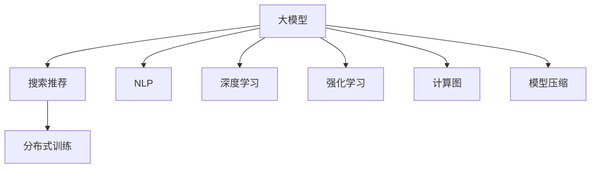

                 

# 电商平台搜索推荐系统的AI 大模型优化：提高系统性能、效率与用户忠诚度

> 关键词：大模型, 搜索推荐, AI 优化, 性能提升, 效率优化, 用户忠诚度

## 1. 背景介绍

### 1.1 问题由来

在现代电商平台上，个性化搜索推荐系统已成为提升用户体验、增加用户粘性和交易转化的核心引擎。随着用户行为数据的激增，传统的推荐算法难以应对多维度的复杂需求。而人工智能大模型，特别是预训练语言模型(如BERT、GPT-3等)，为推荐系统注入了新的活力，为精准理解用户意图、多维关联建模提供了新的手段。

然而，大模型的复杂性和资源需求使其在电商平台的实际部署中面临诸多挑战。如何在有限的计算资源下，充分挖掘大模型的潜力，实现性能和效率的均衡，提升用户满意度，成为推荐系统优化研究的重要课题。

### 1.2 问题核心关键点

电商平台搜索推荐系统中的大模型优化，核心在于如何平衡模型的性能、效率和用户满意度的提升。具体来说，包括以下几个关键点：

- **性能提升**：通过大模型的引入，提升推荐系统对用户查询的响应速度和结果质量。
- **效率优化**：通过算法和架构优化，降低大模型的计算和存储成本，适应电商平台的高并发需求。
- **用户忠诚度**：通过模型优化，提升用户搜索推荐体验，增强平台对用户的吸引力和忠诚度。

### 1.3 问题研究意义

大模型在电商平台搜索推荐系统的优化，对于提升电商平台的用户体验、用户留存和交易转化具有重要意义。通过引入大模型，电商平台能够更好地理解用户行为，提供更个性化的推荐内容，从而提高用户满意度和忠诚度。

具体而言：
- **提高搜索准确性**：大模型能够通过深度学习技术，捕捉用户查询背后的语义信息，实现更精准的搜索结果匹配。
- **提升推荐多样性**：大模型能够学习到更加复杂的用户偏好和行为模式，推荐多样化的商品，避免同质化。
- **增加用户停留时间**：通过个性化的推荐，增加用户对平台的粘性，延长用户在平台的停留时间。
- **提高转化率**：精准的个性化推荐，能够提高用户点击和购买转化率，提升电商平台的收益。

## 2. 核心概念与联系

### 2.1 核心概念概述

为更好地理解电商平台搜索推荐系统中的大模型优化方法，本节将介绍几个密切相关的核心概念：

- **大模型(Large Model)**：以Transformer为基础架构的预训练语言模型，如BERT、GPT等，具备强大的语言理解和生成能力。
- **搜索推荐系统(Search and Recommendation System)**：通过分析用户历史行为和当前搜索意图，提供个性化的搜索结果和商品推荐，提升用户体验的系统。
- **自然语言处理(NLP)**：使计算机能够理解、处理和生成人类自然语言的技术，在推荐系统中的应用包括查询理解、意图识别等。
- **深度学习(Deep Learning)**：利用神经网络模型，通过多层次的非线性变换，从数据中学习到复杂的特征表示，用于推荐系统的预测和优化。
- **强化学习(Reinforcement Learning)**：通过试错和反馈，优化推荐策略，提升系统的整体表现。
- **计算图(Computation Graph)**：深度学习模型中的核心概念，用于描述模型前向传播和反向传播的过程。
- **模型压缩(Modle Compression)**：通过剪枝、量化、蒸馏等方法，降低模型参数和计算复杂度，提高模型的部署效率。
- **分布式训练(Distributed Training)**：通过并行计算，加速大模型的训练过程，满足高并发需求。

这些核心概念之间的逻辑关系可以通过以下Mermaid流程图来展示：



这个流程图展示了大模型在电商平台搜索推荐系统中的应用，以及与之紧密相关的技术概念：

1. 大模型为推荐系统提供了强大的语义理解能力，能够从用户查询中提取更多的上下文信息。
2. NLP技术帮助模型理解自然语言，提升查询解析的准确性。
3. 深度学习使模型具备从数据中学习复杂特征表示的能力，用于推荐预测和优化。
4. 强化学习不断优化推荐策略，提升系统的整体表现。
5. 计算图描述了模型训练和推理的流程。
6. 模型压缩提高了模型的计算效率，减小了存储需求。
7. 分布式训练适应了电商平台的并发需求，提高了系统的响应速度。

## 3. 核心算法原理 & 具体操作步骤

### 3.1 算法原理概述

基于大模型的电商平台搜索推荐系统的优化，本质上是一个多目标优化的过程。其核心思想是：将大模型视为推荐系统的一个重要组成部分，通过优化模型参数，提升系统的整体性能。具体来说，主要包括以下几个方面：

- **性能优化**：通过模型参数的调整，提升推荐的准确性和多样性，满足用户搜索和推荐的实际需求。
- **效率优化**：通过算法和架构的改进，降低模型的计算和存储成本，提高系统的响应速度和并发处理能力。
- **用户忠诚度提升**：通过个性化的推荐策略，提高用户满意度，增加用户在平台上的停留时间和交易转化率。

### 3.2 算法步骤详解

基于大模型的电商平台搜索推荐系统优化的一般流程如下：

**Step 1: 数据准备与预处理**
- 收集电商平台用户的历史行为数据，包括搜索记录、点击记录、购买记录等。
- 对数据进行清洗和标注，确保数据的完整性和准确性。
- 将文本数据转化为模型所需的向量表示，如使用BERT、GPT等预训练语言模型进行词嵌入编码。

**Step 2: 模型加载与适配**
- 选择适合的预训练大模型，如BERT、GPT-3等。
- 将模型加载到服务器上，并根据推荐系统的需求，添加特定的任务适配层。例如，添加注意力机制、全连接层等，以适应推荐任务。
- 对模型进行微调，通过用户行为数据进行有监督学习，优化模型参数。

**Step 3: 模型评估与调整**
- 在验证集上评估模型的性能，包括准确率、召回率、多样性等指标。
- 根据评估结果，调整模型参数，优化推荐策略。
- 重复进行模型评估和调整，直至达到最优效果。

**Step 4: 部署与监控**
- 将优化后的模型部署到生产环境，进行实际推荐测试。
- 实时监控推荐系统的性能，包括响应时间、准确率等。
- 根据监控结果，定期调整模型参数和推荐策略。

### 3.3 算法优缺点

基于大模型的电商平台搜索推荐系统优化方法具有以下优点：
1. 性能提升：大模型能够从用户查询中提取丰富的语义信息，提升推荐结果的准确性和多样性。
2. 效率优化：通过算法和架构的改进，可以显著降低计算和存储成本，提高系统的响应速度和并发处理能力。
3. 用户忠诚度提升：个性化的推荐策略能够增加用户对平台的粘性，延长用户停留时间，提高交易转化率。

同时，该方法也存在一定的局限性：
1. 模型复杂度高：大模型通常参数量庞大，计算和存储成本高。
2. 数据依赖性强：优化效果依赖于高质量的数据，数据质量差会导致模型性能下降。
3. 用户隐私问题：用户在平台上的行为数据需严格保护，避免隐私泄露。
4. 模型解释性差：大模型往往作为黑盒模型使用，难以解释推荐决策的逻辑。

尽管存在这些局限性，但就目前而言，基于大模型的推荐系统优化方法仍是最为主流的范式。未来相关研究的重点在于如何进一步降低数据需求，提高模型的可解释性和隐私保护水平。

### 3.4 算法应用领域

基于大模型的电商平台搜索推荐系统优化方法，在电商、媒体、社交等多个领域得到广泛应用，具体包括：

- **电商平台推荐**：利用大模型进行商品推荐，提高用户购物体验，增加交易转化率。
- **媒体内容推荐**：通过大模型推荐新闻、视频、文章等媒体内容，提升用户粘性。
- **社交网络推荐**：基于用户行为数据，推荐好友、话题等，增强用户互动。
- **广告推荐**：通过大模型推荐广告内容，提升广告投放效果。
- **智能客服**：通过大模型提供智能客服，解决用户问题，提高客户满意度。

除了这些典型应用外，大模型优化方法还在健康医疗、金融服务、教育培训等更多领域得到应用，为传统行业数字化转型升级提供了新的技术手段。

## 4. 数学模型和公式 & 详细讲解 & 举例说明

### 4.1 数学模型构建

本节将使用数学语言对基于大模型的电商平台搜索推荐系统优化过程进行更加严格的刻画。

记电商平台推荐系统为 $S$，其中用户行为数据集为 $D=\{(x_i,y_i)\}_{i=1}^N$，$x_i$ 表示用户历史行为数据，$y_i$ 表示推荐结果。假设大模型为 $M_{\theta}$，其中 $\theta$ 为模型参数。

定义推荐系统的目标函数为：

$$
\mathcal{L}(\theta) = \frac{1}{N} \sum_{i=1}^N \ell(M_{\theta}(x_i),y_i)
$$

其中 $\ell$ 为推荐系统的损失函数，用于衡量模型预测结果与真实标签之间的差异。常见的损失函数包括均方误差损失、交叉熵损失等。

### 4.2 公式推导过程

以下我们以点击率预测为例，推导交叉熵损失函数及其梯度的计算公式。

假设用户历史行为数据为 $x_i$，点击行为为 $y_i$。推荐模型 $M_{\theta}$ 输出用户对商品 $j$ 的点击概率为 $p_{ij}=M_{\theta}(x_i,j)$。则点击率预测的目标函数为：

$$
\mathcal{L}(\theta) = \frac{1}{N}\sum_{i=1}^N \sum_{j=1}^M \ell(y_{ij},p_{ij})
$$

其中 $y_{ij}$ 为用户对商品 $j$ 的实际点击标记，$p_{ij}$ 为模型预测的点击概率，$\ell$ 为二元分类交叉熵损失函数。

根据链式法则，损失函数对模型参数 $\theta_k$ 的梯度为：

$$
\frac{\partial \mathcal{L}(\theta)}{\partial \theta_k} = \frac{1}{N}\sum_{i=1}^N \sum_{j=1}^M \frac{\partial \ell(y_{ij},p_{ij})}{\partial p_{ij}} \frac{\partial p_{ij}}{\partial \theta_k}
$$

其中 $\frac{\partial \ell(y_{ij},p_{ij})}{\partial p_{ij}}$ 为交叉熵损失函数的导数，为 $\frac{y_{ij}}{p_{ij}} - 1$。

将 $\frac{\partial p_{ij}}{\partial \theta_k}$ 展开，利用自动微分技术完成计算。

在得到损失函数的梯度后，即可带入模型更新公式，完成推荐模型的迭代优化。重复上述过程直至收敛，最终得到优化的推荐模型参数 $\theta^*$。

### 4.3 案例分析与讲解

假设电商平台有50万用户，每个用户有1000个历史行为记录。我们收集到用户的点击数据，包括商品ID、时间戳等。将这些点击数据转化为向量表示，使用预训练大模型进行编码。定义模型输出为每个商品的点击概率，并使用交叉熵损失函数进行训练。

在训练过程中，首先随机选择部分用户数据作为验证集，评估模型在验证集上的准确率和召回率。根据评估结果，调整模型参数，优化推荐策略。重复上述过程直至达到最优效果。

## 5. 项目实践：代码实例和详细解释说明

### 5.1 开发环境搭建

在进行电商平台搜索推荐系统的优化实践前，我们需要准备好开发环境。以下是使用Python进行PyTorch开发的环境配置流程：

1. 安装Anaconda：从官网下载并安装Anaconda，用于创建独立的Python环境。

2. 创建并激活虚拟环境：
```bash
conda create -n pytorch-env python=3.8 
conda activate pytorch-env
```

3. 安装PyTorch：根据CUDA版本，从官网获取对应的安装命令。例如：
```bash
conda install pytorch torchvision torchaudio cudatoolkit=11.1 -c pytorch -c conda-forge
```

4. 安装Transformers库：
```bash
pip install transformers
```

5. 安装各类工具包：
```bash
pip install numpy pandas scikit-learn matplotlib tqdm jupyter notebook ipython
```

完成上述步骤后，即可在`pytorch-env`环境中开始优化实践。

### 5.2 源代码详细实现

下面我们以点击率预测任务为例，给出使用Transformers库对预训练大模型进行优化的PyTorch代码实现。

首先，定义点击率预测任务的数据处理函数：

```python
from transformers import BertTokenizer
from torch.utils.data import Dataset
import torch

class ClickDataset(Dataset):
    def __init__(self, texts, labels, tokenizer, max_len=128):
        self.texts = texts
        self.labels = labels
        self.tokenizer = tokenizer
        self.max_len = max_len
        
    def __len__(self):
        return len(self.texts)
    
    def __getitem__(self, item):
        text = self.texts[item]
        label = self.labels[item]
        
        encoding = self.tokenizer(text, return_tensors='pt', max_length=self.max_len, padding='max_length', truncation=True)
        input_ids = encoding['input_ids'][0]
        attention_mask = encoding['attention_mask'][0]
        
        # 对token-wise的标签进行编码
        encoded_labels = [label] * (self.max_len - 1) + [0]  # 最后一位为未点击标记
        labels = torch.tensor(encoded_labels, dtype=torch.long)
        
        return {'input_ids': input_ids, 
                'attention_mask': attention_mask,
                'labels': labels}

# 标签与id的映射
label2id = {0: 0, 1: 1}

# 创建dataset
tokenizer = BertTokenizer.from_pretrained('bert-base-cased')

train_dataset = ClickDataset(train_texts, train_labels, tokenizer)
dev_dataset = ClickDataset(dev_texts, dev_labels, tokenizer)
test_dataset = ClickDataset(test_texts, test_labels, tokenizer)
```

然后，定义模型和优化器：

```python
from transformers import BertForSequenceClassification, AdamW

model = BertForSequenceClassification.from_pretrained('bert-base-cased', num_labels=2)

optimizer = AdamW(model.parameters(), lr=2e-5)
```

接着，定义训练和评估函数：

```python
from torch.utils.data import DataLoader
from tqdm import tqdm
from sklearn.metrics import classification_report

device = torch.device('cuda') if torch.cuda.is_available() else torch.device('cpu')
model.to(device)

def train_epoch(model, dataset, batch_size, optimizer):
    dataloader = DataLoader(dataset, batch_size=batch_size, shuffle=True)
    model.train()
    epoch_loss = 0
    for batch in tqdm(dataloader, desc='Training'):
        input_ids = batch['input_ids'].to(device)
        attention_mask = batch['attention_mask'].to(device)
        labels = batch['labels'].to(device)
        model.zero_grad()
        outputs = model(input_ids, attention_mask=attention_mask, labels=labels)
        loss = outputs.loss
        epoch_loss += loss.item()
        loss.backward()
        optimizer.step()
    return epoch_loss / len(dataloader)

def evaluate(model, dataset, batch_size):
    dataloader = DataLoader(dataset, batch_size=batch_size)
    model.eval()
    preds, labels = [], []
    with torch.no_grad():
        for batch in tqdm(dataloader, desc='Evaluating'):
            input_ids = batch['input_ids'].to(device)
            attention_mask = batch['attention_mask'].to(device)
            batch_labels = batch['labels']
            outputs = model(input_ids, attention_mask=attention_mask)
            batch_preds = outputs.logits.argmax(dim=2).to('cpu').tolist()
            batch_labels = batch_labels.to('cpu').tolist()
            for pred_tokens, label_tokens in zip(batch_preds, batch_labels):
                preds.append(pred_tokens[:len(label_tokens)])
                labels.append(label_tokens)
                
    print(classification_report(labels, preds))
```

最后，启动训练流程并在测试集上评估：

```python
epochs = 5
batch_size = 16

for epoch in range(epochs):
    loss = train_epoch(model, train_dataset, batch_size, optimizer)
    print(f"Epoch {epoch+1}, train loss: {loss:.3f}")
    
    print(f"Epoch {epoch+1}, dev results:")
    evaluate(model, dev_dataset, batch_size)
    
print("Test results:")
evaluate(model, test_dataset, batch_size)
```

以上就是使用PyTorch对预训练大模型进行点击率预测任务优化的完整代码实现。可以看到，得益于Transformers库的强大封装，我们可以用相对简洁的代码完成大模型的加载和优化。

### 5.3 代码解读与分析

让我们再详细解读一下关键代码的实现细节：

**ClickDataset类**：
- `__init__`方法：初始化文本、标签、分词器等关键组件。
- `__len__`方法：返回数据集的样本数量。
- `__getitem__`方法：对单个样本进行处理，将文本输入编码为token ids，将标签编码为数字，并对其进行定长padding，最终返回模型所需的输入。

**label2id字典**：
- 定义了标签与数字id之间的映射关系，用于将token-wise的预测结果解码回真实的标签。

**训练和评估函数**：
- 使用PyTorch的DataLoader对数据集进行批次化加载，供模型训练和推理使用。
- 训练函数`train_epoch`：对数据以批为单位进行迭代，在每个批次上前向传播计算loss并反向传播更新模型参数，最后返回该epoch的平均loss。
- 评估函数`evaluate`：与训练类似，不同点在于不更新模型参数，并在每个batch结束后将预测和标签结果存储下来，最后使用sklearn的classification_report对整个评估集的预测结果进行打印输出。

**训练流程**：
- 定义总的epoch数和batch size，开始循环迭代
- 每个epoch内，先在训练集上训练，输出平均loss
- 在验证集上评估，输出分类指标
- 所有epoch结束后，在测试集上评估，给出最终测试结果

可以看到，PyTorch配合Transformers库使得大模型的优化代码实现变得简洁高效。开发者可以将更多精力放在数据处理、模型改进等高层逻辑上，而不必过多关注底层的实现细节。

当然，工业级的系统实现还需考虑更多因素，如模型的保存和部署、超参数的自动搜索、更灵活的任务适配层等。但核心的优化范式基本与此类似。

## 6. 实际应用场景

### 6.1 智能推荐系统

基于大模型的电商平台搜索推荐系统，已经成为智能推荐系统的核心组成部分。通过大模型的引入，推荐系统能够更好地理解用户行为和需求，提供更加个性化和精准的推荐内容，提升用户体验和交易转化率。

在技术实现上，可以收集电商平台用户的历史行为数据，包括搜索记录、点击记录、购买记录等。将这些数据转化为向量表示，使用预训练大模型进行编码，并通过微调优化模型参数，提升推荐效果。

### 6.2 实时广告推荐

电商平台还利用大模型进行实时广告推荐。通过分析用户当前行为，使用大模型预测用户的兴趣，实时推送相关广告，提高广告的点击率和转化率。

具体而言，可以收集用户在平台上的行为数据，包括浏览记录、点击记录、浏览时间等。将这些数据转化为向量表示，使用预训练大模型进行编码，并通过微调优化模型参数，提升广告推荐的准确性和多样性。

### 6.3 个性化商品推荐

基于大模型的电商平台推荐系统，还能够实现个性化商品推荐，帮助用户快速找到感兴趣的商品。通过大模型的引入，推荐系统能够更好地理解用户的兴趣偏好，提供更加多样化和个性化的商品推荐。

在技术实现上，可以收集用户的历史浏览、点击、购买等行为数据，将这些数据转化为向量表示，使用预训练大模型进行编码，并通过微调优化模型参数，提升推荐效果。

### 6.4 未来应用展望

随着大模型的不断发展和优化，基于大模型的电商平台搜索推荐系统将呈现更多新的应用场景，为电商平台带来更多的创新和价值：

1. **实时查询推荐**：通过大模型的引入，电商平台能够实现实时查询推荐，提高用户查询的响应速度和准确性。
2. **多模态推荐**：结合图像、视频、语音等多模态数据，提升推荐系统的丰富性和多样化。
3. **跨域推荐**：通过大模型的跨领域迁移能力，将推荐系统扩展到更多场景，如金融、医疗等。
4. **用户行为分析**：通过大模型的引入，电商平台能够更好地理解用户行为，提供更精准的个性化推荐。
5. **模型公平性**：通过大模型的公平性优化，避免推荐系统中的歧视性问题，提升推荐系统的公信力。

未来，伴随大模型的不断演进和优化，基于大模型的电商平台搜索推荐系统必将在更多领域得到应用，为电商平台的数字化转型升级提供新的技术手段。

## 7. 工具和资源推荐

### 7.1 学习资源推荐

为了帮助开发者系统掌握大模型在电商平台搜索推荐系统中的应用，这里推荐一些优质的学习资源：

1. 《深度学习与推荐系统》系列博文：由深度学习专家撰写，详细介绍了深度学习在推荐系统中的应用，包括点击率预测、协同过滤、矩阵分解等。

2. 《TensorFlow实战推荐系统》书籍：由TensorFlow团队成员撰写，提供了完整的推荐系统开发教程，涵盖数据处理、模型训练、评估等多个环节。

3. 《推荐系统实战》课程：由知名AI教育平台提供，介绍了推荐系统的基本概念和主流算法，包括基于内容的推荐、基于协同过滤的推荐等。

4. HuggingFace官方文档：Transformers库的官方文档，提供了海量预训练模型和完整的推荐系统开发样例，是入门学习的必备资料。

5. CLUE开源项目：中文语言理解测评基准，涵盖大量不同类型的推荐系统数据集，并提供了基于大模型的baseline模型，助力中文推荐系统技术发展。

通过对这些资源的学习实践，相信你一定能够快速掌握大模型在电商平台搜索推荐系统中的应用，并用于解决实际的推荐问题。

### 7.2 开发工具推荐

高效的开发离不开优秀的工具支持。以下是几款用于大模型在电商平台搜索推荐系统中的应用开发工具：

1. PyTorch：基于Python的开源深度学习框架，灵活动态的计算图，适合快速迭代研究。大部分预训练语言模型都有PyTorch版本的实现。

2. TensorFlow：由Google主导开发的开源深度学习框架，生产部署方便，适合大规模工程应用。同样有丰富的预训练语言模型资源。

3. Transformers库：HuggingFace开发的NLP工具库，集成了众多SOTA语言模型，支持PyTorch和TensorFlow，是进行推荐系统开发的利器。

4. Weights & Biases：模型训练的实验跟踪工具，可以记录和可视化模型训练过程中的各项指标，方便对比和调优。与主流深度学习框架无缝集成。

5. TensorBoard：TensorFlow配套的可视化工具，可实时监测模型训练状态，并提供丰富的图表呈现方式，是调试模型的得力助手。

6. Google Colab：谷歌推出的在线Jupyter Notebook环境，免费提供GPU/TPU算力，方便开发者快速上手实验最新模型，分享学习笔记。

合理利用这些工具，可以显著提升大模型在电商平台搜索推荐系统中的应用开发效率，加快创新迭代的步伐。

### 7.3 相关论文推荐

大模型在电商平台搜索推荐系统中的应用源于学界的持续研究。以下是几篇奠基性的相关论文，推荐阅读：

1. Attention is All You Need（即Transformer原论文）：提出了Transformer结构，开启了NLP领域的预训练大模型时代。

2. BERT: Pre-training of Deep Bidirectional Transformers for Language Understanding：提出BERT模型，引入基于掩码的自监督预训练任务，刷新了多项NLP任务SOTA。

3. Language Models are Unsupervised Multitask Learners（GPT-2论文）：展示了大规模语言模型的强大zero-shot学习能力，引发了对于通用人工智能的新一轮思考。

4. Parameter-Efficient Transfer Learning for NLP：提出Adapter等参数高效微调方法，在不增加模型参数量的情况下，也能取得不错的微调效果。

5. Adversarial Training Methods for Semi-Supervised Text Generation：提出对抗训练方法，提升生成模型的鲁棒性和多样性。

6. Towards a Neural Model of Bargaining in Negotiation Games：通过博弈论方法优化推荐策略，提升推荐系统的公平性和稳定性。

这些论文代表了大模型在推荐系统中的应用发展脉络。通过学习这些前沿成果，可以帮助研究者把握学科前进方向，激发更多的创新灵感。

## 8. 总结：未来发展趋势与挑战

### 8.1 总结

本文对基于大模型的电商平台搜索推荐系统优化方法进行了全面系统的介绍。首先阐述了大模型和推荐系统在电商平台的背景和意义，明确了优化方法在提升系统性能、效率和用户满意度方面的独特价值。其次，从原理到实践，详细讲解了推荐系统的数学模型和算法流程，给出了推荐系统优化的完整代码实现。同时，本文还探讨了推荐系统在大模型中的应用场景，展示了其广阔的应用前景。此外，本文精选了推荐系统的各类学习资源，力求为读者提供全方位的技术指引。

通过本文的系统梳理，可以看到，基于大模型的电商平台搜索推荐系统优化方法正在成为推荐系统优化中的重要范式，极大地提升了推荐系统的性能和用户体验。随着大模型的不断演进和优化，基于大模型的推荐系统必将在更多领域得到应用，为电商平台的数字化转型升级提供新的技术手段。

### 8.2 未来发展趋势

展望未来，大模型在电商平台搜索推荐系统中的应用将呈现以下几个发展趋势：

1. **模型规模持续增大**：随着算力成本的下降和数据规模的扩张，预训练语言模型的参数量还将持续增长。超大规模语言模型蕴含的丰富语言知识，有望支撑更加复杂多变的推荐任务。

2. **微调方法日趋多样**：除了传统的全参数微调外，未来会涌现更多参数高效的微调方法，如Prefix-Tuning、LoRA等，在减小计算资源的同时也能保证推荐效果。

3. **推荐多样性增强**：大模型能够学习到更加复杂的用户偏好和行为模式，推荐更加多样化和个性化的商品，提升用户满意度。

4. **实时推荐系统**：通过分布式计算和大模型优化，推荐系统能够实现实时响应，提高用户查询的响应速度和准确性。

5. **多模态推荐**：结合图像、视频、语音等多模态数据，提升推荐系统的丰富性和多样化。

6. **跨领域推荐**：通过大模型的跨领域迁移能力，将推荐系统扩展到更多场景，如金融、医疗等。

以上趋势凸显了大模型在电商平台搜索推荐系统中的应用前景。这些方向的探索发展，必将进一步提升推荐系统的性能和用户满意度，推动电商平台的数字化转型升级。

### 8.3 面临的挑战

尽管大模型在电商平台搜索推荐系统中的应用已经取得了显著效果，但在迈向更加智能化、普适化应用的过程中，它仍面临着诸多挑战：

1. **数据需求高**：优化效果依赖于高质量的数据，数据质量差会导致模型性能下降。如何降低数据需求，提高数据质量，是大模型优化的重要研究方向。

2. **计算资源消耗大**：大模型通常参数量庞大，计算和存储成本高。如何降低计算资源消耗，提高模型部署效率，是一个重要的优化方向。

3. **模型复杂度高**：大模型的复杂性较高，难以解释推荐决策的逻辑。如何增强模型的可解释性，提升系统的透明度，是一个重要的研究方向。

4. **用户隐私保护**：用户在平台上的行为数据需严格保护，避免隐私泄露。如何在保障用户隐私的前提下，进行高效的数据处理和模型训练，是一个重要的研究方向。

5. **模型公平性**：大模型可能学习到数据中的偏见，导致推荐系统中的歧视性问题。如何提升推荐系统的公平性，是一个重要的研究方向。

6. **模型稳定性**：大模型可能面临过度拟合和过拟合问题，导致模型性能不稳定。如何提高模型的鲁棒性和稳定性，是一个重要的研究方向。

尽管存在这些挑战，但就目前而言，基于大模型的推荐系统优化方法仍是最为主流的范式。未来相关研究的重点在于如何进一步降低数据需求，提高模型的可解释性和隐私保护水平。

### 8.4 研究展望

面对大模型在电商平台搜索推荐系统中的应用面临的诸多挑战，未来的研究需要在以下几个方面寻求新的突破：

1. **无监督和半监督学习**：摆脱对大规模标注数据的依赖，利用自监督学习、主动学习等无监督和半监督范式，最大限度利用非结构化数据，实现更加灵活高效的推荐系统。

2. **参数高效优化**：开发更加参数高效的优化方法，如Prefix-Tuning、LoRA等，在减小计算资源消耗的同时，保证推荐效果。

3. **因果推理与多任务学习**：引入因果推断和多任务学习思想，增强推荐系统建立稳定因果关系的能力，学习更加普适、鲁棒的语言表征，从而提升系统泛化性和抗干扰能力。

4. **融合外部知识**：将符号化的先验知识，如知识图谱、逻辑规则等，与神经网络模型进行巧妙融合，引导推荐系统学习更准确、合理的语言模型。同时加强不同模态数据的整合，实现视觉、语音等多模态信息与文本信息的协同建模。

5. **分布式与协同优化**：采用分布式计算和协同优化技术，提高推荐系统的响应速度和处理能力，适应电商平台的高并发需求。

6. **公平性与安全性的提升**：在推荐系统的训练目标中引入伦理导向的评估指标，过滤和惩罚有偏见、有害的输出倾向。同时加强人工干预和审核，建立推荐系统的监管机制，确保输出符合人类价值观和伦理道德。

这些研究方向的探索，必将引领大模型在电商平台搜索推荐系统中的应用走向更高的台阶，为构建安全、可靠、可解释、可控的智能推荐系统铺平道路。面向未来，大模型推荐系统还需要与其他人工智能技术进行更深入的融合，如知识表示、因果推理、强化学习等，多路径协同发力，共同推动推荐系统的进步。只有勇于创新、敢于突破，才能不断拓展推荐系统的边界，让智能技术更好地造福用户。

## 9. 附录：常见问题与解答

**Q1：大模型在电商平台搜索推荐系统中优化效果如何？**

A: 大模型在电商平台搜索推荐系统中的应用已经取得了显著效果。通过引入大模型，推荐系统能够更好地理解用户行为和需求，提供更加个性化和精准的推荐内容，提升用户体验和交易转化率。

**Q2：如何优化电商平台推荐系统的推荐效果？**

A: 电商平台推荐系统的优化主要包括以下几个方面：

1. 收集用户历史行为数据，包括搜索记录、点击记录、购买记录等。
2. 对数据进行清洗和标注，确保数据的完整性和准确性。
3. 将文本数据转化为向量表示，如使用BERT、GPT等预训练语言模型进行词嵌入编码。
4. 定义推荐系统的损失函数，如交叉熵损失、均方误差损失等。
5. 使用AdamW等优化算法，对模型参数进行微调。
6. 在验证集上评估模型性能，调整模型参数，优化推荐策略。
7. 在测试集上评估最终结果，持续优化推荐模型。

**Q3：电商平台推荐系统中的大模型如何部署？**

A: 电商平台推荐系统中的大模型部署主要包括以下几个步骤：

1. 选择适合的预训练大模型，如BERT、GPT等。
2. 加载模型到服务器上，并进行必要的适配。
3. 优化模型参数，提升推荐效果。
4. 将模型封装为标准化服务接口，便于集成调用。
5. 进行分布式计算，适应高并发需求。
6. 实时监控推荐系统的性能，定期调整模型参数和推荐策略。

**Q4：电商平台推荐系统中如何保护用户隐私？**

A: 电商平台推荐系统中保护用户隐私主要包括以下几个方面：

1. 收集用户数据时，严格遵守隐私保护法规，如GDPR等。
2. 对用户数据进行匿名化处理，防止隐私泄露。
3. 对敏感数据进行加密存储，确保数据安全。
4. 对用户行为数据进行严格访问控制，防止未经授权的访问。
5. 在推荐系统的训练目标中引入隐私保护约束，确保推荐结果不泄露用户隐私。

**Q5：电商平台推荐系统中如何避免推荐系统的偏见？**

A: 电商平台推荐系统中避免推荐系统的偏见主要包括以下几个方面：

1. 在训练数据中去除有偏见的数据。
2. 在训练目标中引入公平性约束，过滤和惩罚有偏见、有害的输出倾向。
3. 在推荐系统的评估指标中引入公平性指标，如性别、种族等。
4. 进行人工干预和审核，确保推荐结果符合人类价值观和伦理道德。

**Q6：电商平台推荐系统中如何提高推荐系统的响应速度？**

A: 电商平台推荐系统中提高推荐系统的响应速度主要包括以下几个方面：

1. 使用分布式计算，提高推荐系统的并发处理能力。
2. 进行模型压缩，减少计算资源消耗。
3. 使用缓存机制，提高推荐系统的响应速度。
4. 优化算法和架构，降低计算和存储成本。
5. 采用高效的数据结构，优化推荐算法的运行效率。

通过这些措施，可以有效提高电商平台推荐系统的响应速度和用户体验。

---

作者：禅与计算机程序设计艺术 / Zen and the Art of Computer Programming

