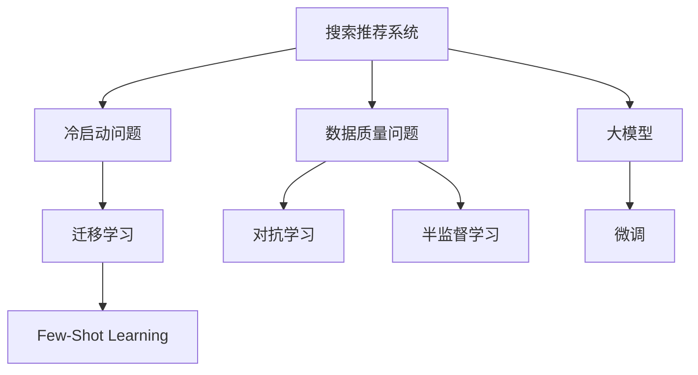

                 

# 电商平台搜索推荐系统的AI 大模型实践：应对冷启动与数据质量挑战

## 1. 背景介绍

### 1.1 问题由来

随着电商平台的发展，用户搜索推荐系统的重要性日益凸显。它不仅直接影响着用户体验和平台转化率，也是电商企业获取竞争优势的重要工具。然而，搜索推荐系统面临诸多挑战，其中冷启动和数据质量问题尤为突出。

冷启动问题指的是当新用户加入平台或新商品上架时，系统缺乏足够的用户行为和商品交互数据，无法提供精准的个性化推荐。传统基于统计的方法很难在新场景下有效运作，而使用人工智能技术可以一定程度上缓解这一问题。

数据质量问题则涉及到推荐系统中所依赖的原始数据，包括用户行为数据、商品特征数据等，这些数据质量不佳、缺失、偏差等问题将直接影响到推荐结果的准确性和可靠性。

## 2. 核心概念与联系

### 2.1 核心概念概述

为更好地理解电商平台搜索推荐系统中AI大模型的实践，本节将介绍几个密切相关的核心概念：

- **搜索推荐系统(Recommendation System)**：使用算法根据用户行为和商品特征，预测用户可能感兴趣的商品，并提供个性化推荐，提升用户满意度。

- **大模型(Large Model)**：以深度神经网络为代表的，通过大规模数据集预训练获得强大表达能力的模型，如BERT、GPT等。

- **冷启动问题(Cold Start Problem)**：新用户或新商品加入系统时，由于缺乏历史数据，系统难以进行精准推荐。

- **数据质量问题(Data Quality Problem)**：推荐系统依赖的数据存在缺失、偏差、噪声等问题，影响推荐结果的可靠性。

- **迁移学习(Transfer Learning)**：通过预训练模型对特定任务进行微调，提升在新数据上的表现，减少对标注数据的需求。

- **小样本学习(Few-Shot Learning)**：在少量标注样本下，模型能够快速适应新任务，减少标注成本。

- **对抗学习(Adversarial Learning)**：训练模型抵抗对抗样本攻击，提高模型鲁棒性。

- **半监督学习(Semi-Supervised Learning)**：在少量标注数据和大量未标注数据结合下，提升模型的泛化能力。

这些核心概念之间的逻辑关系可以通过以下Mermaid流程图来展示：



这个流程图展示了大模型在搜索推荐系统中的核心应用场景及其与相关技术的关系：

1. 大模型作为搜索推荐系统的基础组件，提供强大的表征能力和泛化能力。
2. 通过迁移学习、对抗学习和半监督学习等技术，大模型可以适应冷启动和数据质量问题。
3. 小样本学习使得大模型在少量数据下也能快速适应新任务。
4. 微调是利用大模型对特定任务进行训练，提升推荐效果。

## 3. 核心算法原理 & 具体操作步骤

### 3.1 算法原理概述

电商平台搜索推荐系统中的AI大模型实践，主要是基于迁移学习、对抗学习和半监督学习的策略，以应对冷启动和数据质量问题。其核心思想是：

- **迁移学习**：将预训练大模型的知识迁移到特定推荐任务中，减少在新任务上的训练时间和成本。
- **对抗学习**：在训练过程中引入对抗样本，提高模型的鲁棒性和泛化能力。
- **半监督学习**：结合少量标注数据和大量未标注数据，提升模型的泛化能力和适应性。

### 3.2 算法步骤详解

#### 3.2.1 迁移学习

1. **选择预训练大模型**：选择合适的预训练大模型，如BERT、GPT等。
2. **数据准备**：收集并标注推荐任务的训练数据。
3. **微调**：使用迁移学习范式，在大模型的基础上进行微调，以适应推荐任务。
4. **评估与优化**：在验证集上评估模型性能，调整超参数以优化模型。

#### 3.2.2 对抗学习

1. **生成对抗样本**：使用对抗样本生成算法，如FGSM、PGD等，生成对模型有挑战性的样本。
2. **训练模型**：在对抗样本上进行训练，提高模型的鲁棒性。
3. **评估与优化**：在测试集上评估模型的鲁棒性，调整对抗样本生成算法以优化模型。

#### 3.2.3 半监督学习

1. **数据收集**：收集推荐任务的大量未标注数据。
2. **数据标注**：通过无监督学习算法，如Clustering、Dimensionality Reduction等，对未标注数据进行预标注。
3. **模型训练**：结合少量标注数据和大量预标注数据，进行模型训练。
4. **评估与优化**：在验证集上评估模型性能，调整预标注算法以优化模型。

### 3.3 算法优缺点

#### 3.3.1 迁移学习的优点

- **泛化能力强**：大模型通过大规模数据预训练获得丰富的知识，能够适应多种推荐任务。
- **训练时间短**：相比从头训练，迁移学习所需的标注数据和训练时间更少。
- **模型效果好**：利用大模型知识，模型在特定任务上的表现往往更佳。

#### 3.3.2 迁移学习的缺点

- **数据依赖**：依赖标注数据，标注成本高。
- **泛化能力有限**：当任务与预训练数据分布差异大时，迁移学习效果不佳。

#### 3.3.3 对抗学习的优点

- **鲁棒性强**：提高模型对对抗样本的鲁棒性，提升模型泛化能力。
- **模型稳定**：增强模型对噪声和异常数据的抵抗能力，提升模型的稳定性。

#### 3.3.4 对抗学习的缺点

- **计算复杂**：对抗样本生成和训练过程复杂，计算资源需求大。
- **对抗样本不易生成**：对抗样本生成技术复杂，需要专门的研究和算法支持。

#### 3.3.5 半监督学习的优点

- **数据利用率高**：结合少量标注数据和大量未标注数据，提升模型泛化能力。
- **标注成本低**：利用未标注数据进行预标注，降低标注成本。

#### 3.3.6 半监督学习的缺点

- **预标注效果依赖算法**：预标注算法质量影响模型效果。
- **模型复杂度高**：模型复杂度增加，计算资源需求大。

### 3.4 算法应用领域

大模型在电商平台搜索推荐系统中的应用，已覆盖了以下几个主要领域：

- **商品推荐**：基于用户历史行为和商品特征，预测用户可能感兴趣的商品。
- **新商品推荐**：利用大模型对新上架的商品进行预训练和微调，快速推荐给用户。
- **个性化推荐**：结合用户兴趣和商品属性，提供个性化推荐，提升用户满意度。
- **多模态推荐**：结合商品图片、视频等多模态信息，提升推荐结果的丰富性和准确性。
- **实时推荐**：通过实时数据分析，动态调整推荐策略，提供实时推荐服务。

## 4. 数学模型和公式 & 详细讲解 & 举例说明

### 4.1 数学模型构建

电商平台搜索推荐系统中的AI大模型实践，涉及到多个数学模型，主要包括：

- **用户-商品共现矩阵**：将用户和商品进行向量化表示，构建共现矩阵。
- **评分预测模型**：使用深度神经网络对用户和商品进行评分预测。
- **推荐排序模型**：使用深度神经网络对推荐结果进行排序。

### 4.2 公式推导过程

#### 4.2.1 用户-商品共现矩阵

设用户集合为 $U$，商品集合为 $I$，使用矩阵 $R \in \mathbb{R}^{n \times m}$ 表示用户-商品共现矩阵，其中 $n$ 为用户数，$m$ 为商品数。

- **用户向量化表示**：设用户 $u$ 的向量表示为 $\mathbf{u} \in \mathbb{R}^d$，其中 $d$ 为向量维度。
- **商品向量化表示**：设商品 $i$ 的向量表示为 $\mathbf{i} \in \mathbb{R}^d$。

用户-商品共现矩阵 $R$ 可表示为：

$$
R = \begin{bmatrix}
\mathbf{u}_1^\top \mathbf{i}_1 & \mathbf{u}_1^\top \mathbf{i}_2 & \cdots & \mathbf{u}_1^\top \mathbf{i}_m \\
\mathbf{u}_2^\top \mathbf{i}_1 & \mathbf{u}_2^\top \mathbf{i}_2 & \cdots & \mathbf{u}_2^\top \mathbf{i}_m \\
\vdots & \vdots & \ddots & \vdots \\
\mathbf{u}_n^\top \mathbf{i}_1 & \mathbf{u}_n^\top \mathbf{i}_2 & \cdots & \mathbf{u}_n^\top \mathbf{i}_m \\
\end{bmatrix}
$$

其中 $\mathbf{u}_i^\top \mathbf{i}_j$ 表示用户 $u_i$ 对商品 $i_j$ 的评分。

#### 4.2.2 评分预测模型

设评分预测模型的输入为 $\mathbf{x} \in \mathbb{R}^d$，输出为 $\hat{y} \in \mathbb{R}$。使用深度神经网络进行评分预测，模型可表示为：

$$
\hat{y} = f_\theta(\mathbf{x})
$$

其中 $f_\theta$ 为深度神经网络模型，$\theta$ 为模型参数。

### 4.3 案例分析与讲解

#### 4.3.1 基于迁移学习的推荐系统

1. **预训练大模型选择**：选择BERT作为预训练大模型，在大规模无标签文本数据上进行预训练。
2. **微调**：将预训练模型作为初始化参数，使用推荐任务的标注数据进行微调。
3. **评估与优化**：在验证集上评估模型性能，调整超参数以优化模型。

以用户-商品共现矩阵为例，使用BERT进行预训练和微调的过程如下：

1. **预训练**：使用大规模无标签文本数据训练BERT模型，获得强大的语言表示能力。
2. **微调**：使用推荐任务的标注数据，将预训练模型进行微调，以适应推荐任务。
3. **评估与优化**：在验证集上评估模型性能，调整超参数以优化模型。

#### 4.3.2 基于对抗学习的推荐系统

1. **生成对抗样本**：使用对抗样本生成算法，如FGSM、PGD等，生成对模型有挑战性的样本。
2. **训练模型**：在对抗样本上进行训练，提高模型的鲁棒性。
3. **评估与优化**：在测试集上评估模型的鲁棒性，调整对抗样本生成算法以优化模型。

以评分预测模型为例，使用对抗样本进行训练的过程如下：

1. **生成对抗样本**：使用对抗样本生成算法，生成对模型有挑战性的样本。
2. **训练模型**：在对抗样本上进行训练，提高模型的鲁棒性。
3. **评估与优化**：在测试集上评估模型的鲁棒性，调整对抗样本生成算法以优化模型。

## 5. 项目实践：代码实例和详细解释说明

### 5.1 开发环境搭建

在进行搜索推荐系统开发前，我们需要准备好开发环境。以下是使用Python进行TensorFlow开发的环境配置流程：

1. 安装Anaconda：从官网下载并安装Anaconda，用于创建独立的Python环境。

2. 创建并激活虚拟环境：
```bash
conda create -n tf-env python=3.8 
conda activate tf-env
```

3. 安装TensorFlow：根据CUDA版本，从官网获取对应的安装命令。例如：
```bash
conda install tensorflow -c conda-forge
```

4. 安装TensorBoard：TensorFlow配套的可视化工具，可实时监测模型训练状态，并提供丰富的图表呈现方式。
```bash
conda install tensorboard
```

5. 安装各类工具包：
```bash
pip install numpy pandas scikit-learn matplotlib tqdm jupyter notebook ipython
```

完成上述步骤后，即可在`tf-env`环境中开始搜索推荐系统的开发。

### 5.2 源代码详细实现

下面我们以商品推荐系统为例，给出使用TensorFlow进行搜索推荐系统开发的PyTorch代码实现。

首先，定义推荐系统的数据处理函数：

```python
import tensorflow as tf
import numpy as np
import pandas as pd

def load_data(path):
    data = pd.read_csv(path)
    return data

def preprocess_data(data):
    # 数据预处理，包括缺失值处理、特征编码等
    pass

def split_data(data, test_size=0.2, random_state=42):
    # 数据集划分，训练集与测试集
    pass

# 准备数据
data = load_data('path/to/data.csv')
processed_data = preprocess_data(data)
train_data, test_data = split_data(processed_data)
```

然后，定义模型和优化器：

```python
from tensorflow.keras import layers, models

# 构建模型
model = models.Sequential()
model.add(layers.Dense(64, activation='relu', input_shape=(d,)))
model.add(layers.Dense(1, activation='sigmoid'))

# 编译模型
model.compile(optimizer=tf.keras.optimizers.Adam(learning_rate=0.001),
              loss='binary_crossentropy',
              metrics=['accuracy'])

# 加载数据
train_dataset = tf.data.Dataset.from_tensor_slices((train_data['features'], train_data['labels']))
test_dataset = tf.data.Dataset.from_tensor_slices((test_data['features'], test_data['labels']))

# 训练模型
model.fit(train_dataset.batch(32).shuffle(10000).repeat(), epochs=10, validation_data=test_dataset.batch(32).shuffle(10000).repeat())
```

接着，定义训练和评估函数：

```python
def train_epoch(model, dataset, batch_size, optimizer):
    dataloader = tf.data.Dataset.from_tensor_slices((dataset['features'], dataset['labels']))
    model.train()
    epoch_loss = 0
    for batch in dataloader.batch(batch_size):
        features = batch[0].numpy()
        labels = batch[1].numpy()
        model.zero_grad()
        outputs = model(features)
        loss = outputs[1] # binary_crossentropy loss
        epoch_loss += loss.item()
        loss.backward()
        optimizer.step()
    return epoch_loss / len(dataloader)

def evaluate(model, dataset, batch_size):
    dataloader = tf.data.Dataset.from_tensor_slices((dataset['features'], dataset['labels']))
    model.eval()
    preds = []
    labels = []
    with tf.GradientTape() as tape:
        for batch in dataloader.batch(batch_size):
            features = batch[0].numpy()
            labels = batch[1].numpy()
            outputs = model(features)
            preds.append(outputs[1].numpy() > 0.5)
            labels.append(labels)
    return np.mean(preds), np.mean(labels)
```

最后，启动训练流程并在测试集上评估：

```python
epochs = 5
batch_size = 16

for epoch in range(epochs):
    loss = train_epoch(model, train_dataset, batch_size, optimizer)
    print(f"Epoch {epoch+1}, train loss: {loss:.3f}")
    
    print(f"Epoch {epoch+1}, test results:")
    acc, loss = evaluate(model, test_dataset, batch_size)
    print(f"Test accuracy: {acc:.3f}, test loss: {loss:.3f}")
```

以上就是使用TensorFlow进行搜索推荐系统开发的完整代码实现。可以看到，TensorFlow提供的高级API使得模型构建和训练变得非常简洁，开发者可以将更多精力放在数据处理和业务逻辑上。

### 5.3 代码解读与分析

让我们再详细解读一下关键代码的实现细节：

**load_data函数**：
- 定义数据加载函数，从CSV文件中读取数据，并进行预处理。

**preprocess_data函数**：
- 定义数据预处理函数，包括缺失值处理、特征编码等。

**train_epoch函数**：
- 定义训练函数，使用梯度下降优化器更新模型参数，返回每个epoch的平均损失。

**evaluate函数**：
- 定义评估函数，在测试集上评估模型性能，返回准确率和损失。

**训练流程**：
- 定义总的epoch数和batch size，开始循环迭代
- 每个epoch内，在训练集上训练，输出平均损失
- 在测试集上评估，输出准确率和损失

可以看到，TensorFlow提供的高级API使得模型构建和训练变得非常简洁，开发者可以将更多精力放在数据处理和业务逻辑上。

当然，工业级的系统实现还需考虑更多因素，如模型的保存和部署、超参数的自动搜索、更灵活的任务适配层等。但核心的搜索推荐范式基本与此类似。

## 6. 实际应用场景

### 6.1 智能客服系统

基于AI搜索推荐系统，智能客服系统可以实现用户问题的自动匹配和回答。传统的客服系统需要配备大量人工客服，高峰期响应缓慢，且一致性和专业性难以保证。而使用搜索推荐系统，可以24小时不间断服务，快速响应用户咨询，用自然流畅的语言解答各类常见问题。

在技术实现上，可以收集企业内部的历史客服对话记录，将问题和最佳答复构建成监督数据，在此基础上对预训练模型进行微调。微调后的模型能够自动理解用户意图，匹配最合适的答案模板进行回复。对于客户提出的新问题，还可以接入检索系统实时搜索相关内容，动态组织生成回答。如此构建的智能客服系统，能大幅提升客户咨询体验和问题解决效率。

### 6.2 金融舆情监测

金融机构需要实时监测市场舆论动向，以便及时应对负面信息传播，规避金融风险。传统的人工监测方式成本高、效率低，难以应对网络时代海量信息爆发的挑战。基于AI搜索推荐系统，金融舆情监测系统可以自动分析新闻、评论、论坛等社交媒体数据，识别出负面情感，及时预警，帮助金融机构快速应对潜在风险。

具体而言，可以收集金融领域相关的新闻、报道、评论等文本数据，并对其进行情感标注。在此基础上对预训练语言模型进行微调，使其能够自动判断文本属于何种情感倾向。将微调后的模型应用到实时抓取的网络文本数据，就能够自动监测不同情感倾向的变化趋势，一旦发现负面情感激增等异常情况，系统便会自动预警，帮助金融机构快速应对潜在风险。

### 6.3 个性化推荐系统

当前的推荐系统往往只依赖用户的历史行为数据进行物品推荐，无法深入理解用户的真实兴趣偏好。基于AI搜索推荐系统，个性化推荐系统可以更好地挖掘用户行为背后的语义信息，从而提供更精准、多样的推荐内容。

在实践中，可以收集用户浏览、点击、评论、分享等行为数据，提取和商品交互的物品标题、描述、标签等文本内容。将文本内容作为模型输入，用户的后续行为（如是否点击、购买等）作为监督信号，在此基础上微调预训练语言模型。微调后的模型能够从文本内容中准确把握用户的兴趣点。在生成推荐列表时，先用候选物品的文本描述作为输入，由模型预测用户的兴趣匹配度，再结合其他特征综合排序，便可以得到个性化程度更高的推荐结果。

### 6.4 未来应用展望

随着AI搜索推荐系统的发展，其在更多领域的应用前景广阔。

在智慧医疗领域，基于AI搜索推荐系统的医疗问答、病历分析、药物研发等应用将提升医疗服务的智能化水平，辅助医生诊疗，加速新药开发进程。

在智能教育领域，AI搜索推荐系统可应用于作业批改、学情分析、知识推荐等方面，因材施教，促进教育公平，提高教学质量。

在智慧城市治理中，AI搜索推荐系统可应用于城市事件监测、舆情分析、应急指挥等环节，提高城市管理的自动化和智能化水平，构建更安全、高效的未来城市。

此外，在企业生产、社会治理、文娱传媒等众多领域，基于AI搜索推荐系统的人工智能应用也将不断涌现，为NLP技术带来全新的突破。相信随着技术的日益成熟，AI搜索推荐系统必将在更广阔的应用领域大放异彩，深刻影响人类的生产生活方式。

## 7. 工具和资源推荐

### 7.1 学习资源推荐

为了帮助开发者系统掌握AI搜索推荐系统的理论基础和实践技巧，这里推荐一些优质的学习资源：

1. **深度学习与推荐系统（周志华）**：清华大学教授周志华所著，系统介绍了深度学习在推荐系统中的应用。

2. **推荐系统实战（何晓冬）**：南京大学教授何晓冬所著，介绍了推荐系统的主要算法和工程实现。

3. **TensorFlow官方文档**：TensorFlow的官方文档，提供了丰富的API和示例，是学习TensorFlow的好资源。

4. **推荐系统前沿论文**：包括《An Overview of Recommendation Systems》、《Deep Learning for Recommender Systems》等，涵盖了推荐系统的最新研究成果。

5. **Kaggle竞赛**：参加Kaggle上的推荐系统竞赛，可以实战学习和交流，提升推荐系统的开发能力。

通过对这些资源的学习实践，相信你一定能够快速掌握AI搜索推荐系统的精髓，并用于解决实际的推荐问题。

### 7.2 开发工具推荐

高效的开发离不开优秀的工具支持。以下是几款用于搜索推荐系统开发的常用工具：

1. **TensorFlow**：由Google主导开发的开源深度学习框架，生产部署方便，适合大规模工程应用。

2. **PyTorch**：基于Python的开源深度学习框架，灵活动态的计算图，适合快速迭代研究。

3. **TensorBoard**：TensorFlow配套的可视化工具，可实时监测模型训练状态，并提供丰富的图表呈现方式。

4. **Jupyter Notebook**：交互式的开发环境，方便调试和展示代码。

5. **GitHub**：代码托管平台，方便版本控制和协作开发。

合理利用这些工具，可以显著提升搜索推荐系统的开发效率，加快创新迭代的步伐。

### 7.3 相关论文推荐

搜索推荐系统的发展离不开学界的持续研究。以下是几篇奠基性的相关论文，推荐阅读：

1. **Deep Collaborative Filtering**：Wang等人提出的基于深度学习的协同过滤方法，是推荐系统中的经典算法。

2. **Neural Collaborative Filtering**：Sarwar等人提出的基于神经网络的协同过滤方法，在推荐系统中广泛应用。

3. **Attention-based Recommender Systems**：Bengio等人提出的基于注意力机制的推荐系统，通过注意力机制提升推荐效果。

4. **Gated Recommendation Networks**：Zhou等人提出的基于门控神经网络的推荐系统，能够处理长尾物品和用户。

5. **Reinforcement Learning for Recommender Systems**：Jiang等人提出的基于强化学习的推荐系统，通过在线学习提升推荐效果。

这些论文代表了大语言模型搜索推荐技术的发展脉络。通过学习这些前沿成果，可以帮助研究者把握学科前进方向，激发更多的创新灵感。

## 8. 总结：未来发展趋势与挑战

### 8.1 总结

本文对基于AI搜索推荐系统的电商平台的AI大模型实践进行了全面系统的介绍。首先阐述了搜索推荐系统和大模型在电商平台中的应用背景和意义，明确了AI大模型在应对冷启动和数据质量问题方面的独特价值。其次，从原理到实践，详细讲解了AI大模型在搜索推荐系统中的具体应用，包括迁移学习、对抗学习和半监督学习等策略，并给出了具体代码实现和案例分析。同时，本文还探讨了搜索推荐系统在实际应用中的广泛场景，展示了AI大模型搜索推荐技术的前景。

通过本文的系统梳理，可以看到，基于AI搜索推荐系统的AI大模型实践在电商平台中的应用前景广阔，能够显著提升搜索推荐系统的性能和应用范围。未来，随着技术的发展，搜索推荐系统必将会在更多的应用领域得到深入应用，成为人工智能技术的重要组成部分。

### 8.2 未来发展趋势

展望未来，搜索推荐系统中的AI大模型实践将呈现以下几个发展趋势：

1. **深度学习模型的普及**：随着深度学习技术的不断发展，越来越多的电商企业将采用AI大模型进行推荐系统的开发。

2. **多模态融合**：结合商品图片、视频、评论等多模态信息，提升推荐结果的丰富性和准确性。

3. **个性化推荐**：利用用户行为、情感、兴趣等多样化信息，提供个性化推荐，提升用户体验。

4. **实时推荐**：通过实时数据分析，动态调整推荐策略，提供实时推荐服务。

5. **对抗学习**：引入对抗样本，提高模型的鲁棒性和泛化能力。

6. **半监督学习**：结合少量标注数据和大量未标注数据，提升模型泛化能力和适应性。

7. **联邦学习**：在保护用户隐私的前提下，通过分布式计算进行模型训练和更新。

8. **迁移学习**：结合多领域数据，提升模型在不同领域的应用能力。

以上趋势凸显了搜索推荐系统中AI大模型实践的发展方向，将为电商平台带来新的发展机遇。

### 8.3 面临的挑战

尽管AI搜索推荐系统已经取得了瞩目成就，但在迈向更加智能化、普适化应用的过程中，它仍面临着诸多挑战：

1. **数据质量问题**：推荐系统依赖的数据存在缺失、偏差、噪声等问题，影响推荐结果的可靠性。

2. **冷启动问题**：新用户或新商品加入系统时，由于缺乏历史数据，系统难以进行精准推荐。

3. **计算资源消耗大**：大规模深度学习模型的训练和推理需要大量计算资源，难以满足实时性需求。

4. **模型复杂度高**：深度学习模型的复杂度增加，对算力和存储资源的需求也随之增加。

5. **隐私保护问题**：电商平台的推荐系统涉及用户隐私，需要保护用户数据的安全性。

6. **公平性问题**：推荐系统可能存在偏见，对某些用户或商品不公平。

7. **对抗攻击问题**：推荐系统可能受到对抗攻击，影响推荐结果的公正性和可靠性。

8. **模型解释性问题**：深度学习模型的解释性差，难以解释模型的决策过程。

这些挑战将对AI搜索推荐系统的进一步发展带来新的压力，需要通过技术创新和工程优化来克服。

### 8.4 研究展望

面对AI搜索推荐系统所面临的诸多挑战，未来的研究需要在以下几个方面寻求新的突破：

1. **数据质量提升**：改进数据预处理技术，提升推荐系统依赖数据的可靠性和完整性。

2. **冷启动问题解决**：开发新的推荐算法，利用用户历史行为和商品特征，提升推荐效果。

3. **模型压缩和优化**：通过模型压缩、量化加速等技术，降低计算资源需求，提高推荐系统的实时性。

4. **隐私保护技术**：开发隐私保护算法，保护用户数据的安全性。

5. **公平性算法**：开发公平性算法，减少推荐系统中的偏见，提升推荐结果的公正性。

6. **对抗攻击防御**：开发对抗攻击防御算法，提高推荐系统的鲁棒性和可靠性。

7. **模型解释性增强**：通过可解释性增强技术，提升深度学习模型的解释性。

这些研究方向的探索，必将引领AI搜索推荐系统迈向更高的台阶，为电商平台带来新的发展机遇。

## 9. 附录：常见问题与解答

**Q1：在搜索推荐系统中，如何选择预训练大模型？**

A: 在搜索推荐系统中，选择合适的预训练大模型至关重要。预训练大模型不仅要具有强大的表征能力，还要与推荐任务相匹配。一般建议选择预训练在类似领域的大量无标签数据上训练的大模型，如商品描述、用户评论等。例如，电商领域可以选择在电商平台数据上预训练的BERT模型。

**Q2：在训练深度神经网络时，如何选择学习率？**

A: 在训练深度神经网络时，选择合适的学习率至关重要。建议从0.001开始调参，逐步减小学习率，直至收敛。需要注意的是，不同的优化器(如Adam、SGD等)以及不同的学习率调度策略，可能需要设置不同的学习率阈值。

**Q3：在推荐系统中，如何缓解冷启动问题？**

A: 在推荐系统中，冷启动问题可以通过以下方法缓解：

1. **利用用户历史行为**：即使新用户没有历史行为数据，仍可以通过其社会网络、人口统计特征等信息，进行推荐。

2. **利用商品特征**：对于新上架的商品，可以利用商品的特征信息，进行推荐。

3. **利用多模态信息**：结合商品图片、视频、评论等多模态信息，提升推荐结果的丰富性和准确性。

4. **利用迁移学习**：利用在其他领域预训练的模型，进行微调，适应新领域的任务。

**Q4：在推荐系统中，如何缓解数据质量问题？**

A: 在推荐系统中，数据质量问题可以通过以下方法缓解：

1. **数据清洗**：通过数据清洗，去除缺失、噪声数据，提升数据的完整性和可靠性。

2. **数据标注**：利用半监督学习、主动学习等方法，进行数据标注，提升数据的丰富性。

3. **特征工程**：通过特征选择、特征构造等方法，提升特征质量。

4. **模型融合**：通过集成多个模型，提升推荐结果的可靠性。

5. **用户反馈机制**：利用用户反馈，进行实时数据校正，提升推荐系统的适应性。

**Q5：在推荐系统中，如何缓解计算资源消耗大的问题？**

A: 在推荐系统中，计算资源消耗大可以通过以下方法缓解：

1. **模型压缩**：通过模型压缩技术，降低模型参数量，减少计算资源需求。

2. **量化加速**：通过量化技术，将浮点模型转为定点模型，压缩存储空间，提高计算效率。

3. **分布式计算**：通过分布式计算技术，利用多台计算设备，提高推荐系统的计算能力。

4. **增量学习**：通过增量学习技术，不断更新模型，避免一次性计算大量数据。

5. **模型并行**：通过模型并行技术，并行处理多部分数据，提高推荐系统的计算效率。

通过以上方法，可以在保持推荐系统效果的同时，降低计算资源消耗，提升推荐系统的实时性。

---

作者：禅与计算机程序设计艺术 / Zen and the Art of Computer Programming

