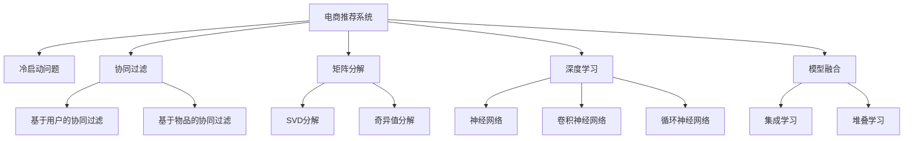

                 

# 电商推荐系统中的冷启动问题解决方案

> 关键词：冷启动,电商推荐系统,协同过滤,矩阵分解,深度学习,模型融合

## 1. 背景介绍

### 1.1 问题由来
电商推荐系统是现代电子商务平台的核心功能之一，通过智能推荐算法，帮助用户发现感兴趣的商品，提升购物体验，促进销售增长。然而，推荐系统面临的最大挑战之一是冷启动问题。冷启动指的是用户在平台上的历史记录和行为数据非常有限，模型难以对其进行准确推荐。在冷启动情况下，用户往往得不到个性化的商品推荐，导致用户体验下降，平台销售转化率降低。

### 1.2 问题核心关键点
冷启动问题主要体现在两个方面：一是新用户的历史行为数据非常少，难以构建完整的用户画像；二是新商品缺乏与用户的历史交互记录，难以进行准确推荐。解决这个问题的关键在于如何利用用户已有的行为数据和商品属性信息，构建新的用户画像和商品画像，从而实现基于这些信息的推荐。

### 1.3 问题研究意义
解决电商推荐系统中的冷启动问题，对于提升用户满意度、提高平台销售转化率具有重要意义：

1. **提升用户体验**：在冷启动阶段，新用户无法获得个性化推荐，往往浏览大量商品却无法找到满意的商品，导致购物体验下降。通过有效的冷启动方案，可以迅速对新用户进行推荐，提高其购物满意度。

2. **促进销售增长**：新商品缺乏与用户的历史交互记录，难以得到推荐，导致商品曝光度不足，销售转化率降低。通过冷启动方案，可以使新商品得到更多曝光机会，提高平台整体销售额。

3. **扩展用户基础**：新用户因缺少历史数据，无法得到个性化推荐，容易导致流失。通过冷启动方案，可以有效提高新用户的留存率，扩展用户基础。

4. **增强平台竞争力**：电商平台通过个性化推荐系统，可以提供差异化的购物体验，增强用户粘性，提升平台在市场中的竞争力。

## 2. 核心概念与联系

### 2.1 核心概念概述

为更好地理解电商推荐系统中的冷启动问题及其解决方案，本节将介绍几个关键概念及其相互联系：

- **电商推荐系统**：利用用户行为数据、商品属性信息等，为用户提供个性化商品推荐的服务系统。
- **冷启动问题**：指新用户和商品缺乏足够的历史数据，难以构建完整用户画像和商品画像，导致推荐准确度下降。
- **协同过滤**：一种基于用户行为数据进行推荐的方法，分为基于用户的协同过滤和基于物品的协同过滤。
- **矩阵分解**：通过将用户-商品评分矩阵分解为两个低秩矩阵，用于发现用户和商品的潜在隐含特征，用于推荐系统。
- **深度学习**：利用深度神经网络对大规模数据进行建模，用于发现更深层次的数据规律和模式。
- **模型融合**：将多种推荐模型组合使用，取长补短，提升推荐系统的整体性能。

这些核心概念之间的逻辑关系可以通过以下Mermaid流程图来展示：



这个流程图展示了大语言模型的核心概念及其之间的关系：

1. 电商推荐系统通过用户和商品数据进行推荐。
2. 冷启动问题体现在新用户和商品缺乏历史数据。
3. 协同过滤和矩阵分解是解决冷启动问题的主要方法。
4. 深度学习用于提取用户和商品的深层次特征。
5. 模型融合通过集成多个推荐模型，提升推荐效果。

这些概念共同构成了电商推荐系统的核心框架，使其能够为用户的个性化购物需求提供支持。通过理解这些核心概念，我们可以更好地把握电商推荐系统的技术原理和优化方向。

## 3. 核心算法原理 & 具体操作步骤
### 3.1 算法原理概述

电商推荐系统中的冷启动问题，可以通过以下几种主要算法来解决：协同过滤、矩阵分解、深度学习、模型融合等。其中，协同过滤和矩阵分解是最基础的推荐算法，而深度学习则是在此基础上进行的改进和优化。模型融合则是将多种推荐算法组合使用，进一步提升推荐效果。

协同过滤是一种基于用户历史行为数据进行推荐的方法，分为基于用户的协同过滤和基于物品的协同过滤：

- 基于用户的协同过滤：通过找到与当前用户行为相似的其他用户，并推荐这些用户喜欢的商品。
- 基于物品的协同过滤：通过找到与当前商品相似的其他商品，并推荐这些相似商品给其他用户。

矩阵分解是一种通过将用户-商品评分矩阵分解为两个低秩矩阵，用于发现用户和商品的潜在隐含特征的方法：

- 奇异值分解(SVD)：将用户-商品评分矩阵分解为三个矩阵的乘积形式，发现用户和商品的低秩表示。
- 隐式矩阵分解(IMF)：类似于SVD，但采用不同的矩阵分解形式。

深度学习则是通过构建复杂的神经网络模型，从用户和商品的高维稀疏数据中学习深层次特征，用于推荐：

- 神经网络：通过多层神经元，对输入数据进行非线性变换，提取高维特征。
- 卷积神经网络(CNN)：用于提取图像和文本数据中的局部特征。
- 循环神经网络(RNN)：用于处理序列数据，如文本和音频。

模型融合则是一种将多种推荐算法组合使用，提升推荐系统性能的方法：

- 集成学习：通过集成多个不同的推荐模型，提升整体推荐效果。
- 堆叠学习：通过构建多个层级不同的推荐模型，逐层优化，提升最终推荐结果。

### 3.2 算法步骤详解

电商推荐系统中的冷启动问题解决方案，通常包括以下几个关键步骤：

**Step 1: 数据预处理**

- 收集用户行为数据、商品属性信息等数据源。
- 对数据进行清洗和特征提取，处理缺失值和异常值。
- 将数据分为训练集、验证集和测试集，以便后续评估模型性能。

**Step 2: 用户画像和商品画像构建**

- 对于新用户，利用其已有的行为数据和商品属性信息，进行画像构建。
- 对于新商品，利用其属性信息和相关商品的相似性进行画像构建。

**Step 3: 协同过滤推荐**

- 利用基于用户的协同过滤和基于物品的协同过滤算法，对新用户和新商品进行推荐。
- 通过用户和商品画像相似性计算，找到推荐候选商品。

**Step 4: 矩阵分解推荐**

- 对用户-商品评分矩阵进行奇异值分解或隐式矩阵分解，发现用户和商品的潜在特征。
- 利用分解后的低秩矩阵进行推荐，填补用户画像和商品画像的缺失部分。

**Step 5: 深度学习推荐**

- 构建深度神经网络模型，对用户和商品的高维稀疏数据进行建模。
- 利用卷积神经网络、循环神经网络等深度学习模型，提取深层次特征。
- 通过训练和优化模型，提升推荐精度。

**Step 6: 模型融合推荐**

- 将多种推荐算法组合使用，取长补短，提升整体推荐效果。
- 通过集成学习和堆叠学习，构建多层次的推荐系统，进一步提升推荐效果。

**Step 7: 模型评估和优化**

- 在验证集上评估模型性能，使用准确率、召回率、F1值等指标进行评估。
- 根据评估结果，对模型进行优化，调整超参数和模型结构。

**Step 8: 部署和监控**

- 将优化后的模型部署到电商平台上，进行实时推荐。
- 持续监控推荐系统性能，根据用户反馈和业务需求，进行迭代优化。

以上是电商推荐系统解决冷启动问题的基本流程。在实际应用中，还需要针对具体业务场景，对每个步骤进行优化设计，如改进数据预处理方法、优化协同过滤算法、调整深度学习模型结构等，以进一步提升推荐效果。

### 3.3 算法优缺点

协同过滤和矩阵分解的优点在于简单高效，不需要额外的特征工程和数据标注，可以直接利用用户和商品的行为数据进行推荐。其缺点在于容易受到数据稀疏性和冷启动问题的困扰，对新用户和商品的推荐效果较差。

深度学习能够从用户和商品的高维稀疏数据中学习深层次特征，提升推荐效果。其优点在于可以处理非结构化数据，具有较强的表达能力。缺点在于需要大量的标注数据和计算资源，且存在过拟合的风险。

模型融合通过集成多种推荐算法，可以弥补单一算法的不足，提升推荐系统性能。其优点在于能够充分利用不同算法的优势，提升整体推荐效果。缺点在于模型复杂度高，需要更多的训练和优化时间。

综上所述，各种算法各有优缺点，应根据具体情况选择适合的推荐方法。通常情况下，可以采用多种算法组合使用，构建多层次的推荐系统，以平衡性能和效率。

### 3.4 算法应用领域

电商推荐系统中的冷启动问题解决方案，已经在多个领域得到应用，如零售电商、在线教育、视频娱乐等，为这些领域的个性化推荐提供了技术支持。以下是几个典型应用场景：

**零售电商**：利用协同过滤和矩阵分解，对新用户和新商品进行推荐，提升用户体验和销售转化率。通过深度学习模型，进一步优化推荐效果，增加用户粘性。

**在线教育**：针对新用户和新课程，利用协同过滤和矩阵分解，推荐相关课程和学习资料。通过深度学习模型，提升个性化推荐效果，促进用户学习。

**视频娱乐**：对新用户和新视频内容进行推荐，利用协同过滤和矩阵分解，找到用户偏好的内容。通过深度学习模型，提升推荐效果，增加用户观看时长。

## 4. 数学模型和公式 & 详细讲解  
### 4.1 数学模型构建

本节将使用数学语言对电商推荐系统中的冷启动问题及其解决方案进行更加严格的刻画。

记用户集合为 $U=\{u_1, u_2, \ldots, u_M\}$，商品集合为 $I=\{i_1, i_2, \ldots, i_N\}$，用户-商品评分矩阵为 $\mathcal{R} \in \mathbb{R}^{M \times N}$，其中 $\mathcal{R}_{ui}=r_{ui}$ 表示用户 $u$ 对商品 $i$ 的评分。

设 $\mathbf{X} \in \mathbb{R}^{M \times K}$ 为 $U$ 中用户 $u$ 的属性特征矩阵，$\mathbf{Y} \in \mathbb{R}^{N \times K}$ 为 $I$ 中商品 $i$ 的属性特征矩阵。

定义用户画像矩阵为 $\mathbf{P} \in \mathbb{R}^{M \times K}$，商品画像矩阵为 $\mathbf{Q} \in \mathbb{R}^{N \times K}$。设用户画像和商品画像为 $\mathbf{p}_u = \mathbf{P}_u^T \in \mathbb{R}^{K}$，$\mathbf{q}_i = \mathbf{Q}_i^T \in \mathbb{R}^{K}$，其中 $\mathbf{P}_u \in \mathbb{R}^{K}$ 和 $\mathbf{Q}_i \in \mathbb{R}^{K}$ 分别表示用户 $u$ 和商品 $i$ 的低秩表示。

### 4.2 公式推导过程

**协同过滤推荐**

基于用户的协同过滤算法可以表示为：

$$
\hat{r}_{ui} = \mathbf{p}_u^T\mathbf{q}_i
$$

其中 $\hat{r}_{ui}$ 表示推荐系统预测用户 $u$ 对商品 $i$ 的评分。

基于物品的协同过滤算法可以表示为：

$$
\hat{r}_{ui} = \mathbf{p}_v^T\mathbf{q}_i
$$

其中 $\mathbf{p}_v$ 表示与商品 $i$ 相似的其他商品的用户画像矩阵。

**矩阵分解推荐**

奇异值分解(SVD)可以表示为：

$$
\mathcal{R} = \mathbf{U} \mathbf{\Sigma} \mathbf{V}^T
$$

其中 $\mathbf{U} \in \mathbb{R}^{M \times R}$ 和 $\mathbf{V} \in \mathbb{R}^{N \times R}$ 分别表示用户和商品的低秩表示矩阵，$\Sigma \in \mathbb{R}^{R \times R}$ 为奇异值矩阵。

隐式矩阵分解(IMF)可以表示为：

$$
\mathcal{R} = \mathbf{U} \mathbf{D} \mathbf{V}^T
$$

其中 $\mathbf{D} \in \mathbb{R}^{R \times R}$ 为对角矩阵，$\Sigma$ 为奇异值矩阵。

**深度学习推荐**

神经网络推荐可以表示为：

$$
\hat{r}_{ui} = f(\mathbf{p}_u, \mathbf{q}_i)
$$

其中 $f$ 表示神经网络模型的输出函数。

卷积神经网络推荐可以表示为：

$$
\hat{r}_{ui} = f(\mathbf{p}_u, \mathbf{q}_i)
$$

其中 $f$ 表示卷积神经网络的输出函数。

循环神经网络推荐可以表示为：

$$
\hat{r}_{ui} = f(\mathbf{p}_u, \mathbf{q}_i)
$$

其中 $f$ 表示循环神经网络的输出函数。

**模型融合推荐**

集成学习推荐可以表示为：

$$
\hat{r}_{ui} = \alpha_1 \hat{r}_{ui,1} + \alpha_2 \hat{r}_{ui,2} + \ldots + \alpha_k \hat{r}_{ui,k}
$$

其中 $\alpha_i$ 表示第 $i$ 个推荐模型的权重。

堆叠学习推荐可以表示为：

$$
\hat{r}_{ui} = f_k(f_{k-1}(\ldots(f_1(\mathbf{p}_u, \mathbf{q}_i)\ldots)))
$$

其中 $f_i$ 表示第 $i$ 层推荐模型的输出函数，$f_k$ 表示最终推荐模型的输出函数。

### 4.3 案例分析与讲解

**案例一：零售电商推荐**

假设电商平台收集到新用户的浏览和购买历史数据，利用协同过滤和矩阵分解算法，对新用户进行推荐。首先，利用新用户的浏览数据构建用户画像矩阵 $\mathbf{P}$，利用新商品的购买数据构建商品画像矩阵 $\mathbf{Q}$。然后，通过计算用户画像和商品画像的相似度，推荐与用户偏好相似的商品。具体步骤如下：

1. 数据预处理：收集新用户的浏览历史数据和购买历史数据，进行数据清洗和特征提取。

2. 用户画像和商品画像构建：利用新用户的浏览数据，构建用户画像矩阵 $\mathbf{P}$；利用新商品的购买数据，构建商品画像矩阵 $\mathbf{Q}$。

3. 协同过滤推荐：计算新用户 $u$ 和商品 $i$ 的相似度 $\mathbf{p}_u^T\mathbf{q}_i$，推荐与用户 $u$ 偏好相似的商品 $i$。

4. 矩阵分解推荐：对用户-商品评分矩阵进行奇异值分解或隐式矩阵分解，发现用户和商品的潜在特征，用于填补用户画像和商品画像的缺失部分。

5. 深度学习推荐：构建深度神经网络模型，利用新用户的浏览历史数据和购买历史数据，学习用户和商品的深层次特征，进一步优化推荐效果。

6. 模型融合推荐：将协同过滤、矩阵分解和深度学习推荐算法组合使用，取长补短，提升整体推荐效果。

**案例二：在线教育推荐**

假设在线教育平台收集到新学生的学习记录和成绩数据，利用协同过滤和矩阵分解算法，对新学生进行推荐。首先，利用新学生的学习记录和成绩数据构建学生画像矩阵 $\mathbf{P}$，利用新课程的评价数据构建课程画像矩阵 $\mathbf{Q}$。然后，通过计算学生画像和课程画像的相似度，推荐与学生兴趣相符的课程。具体步骤如下：

1. 数据预处理：收集新学生的学习记录和成绩数据，进行数据清洗和特征提取。

2. 学生画像和课程画像构建：利用新学生的学习记录和成绩数据，构建学生画像矩阵 $\mathbf{P}$；利用新课程的评价数据，构建课程画像矩阵 $\mathbf{Q}$。

3. 协同过滤推荐：计算新学生 $u$ 和课程 $i$ 的相似度 $\mathbf{p}_u^T\mathbf{q}_i$，推荐与学生 $u$ 兴趣相符的课程 $i$。

4. 矩阵分解推荐：对学生-课程评分矩阵进行奇异值分解或隐式矩阵分解，发现学生和课程的潜在特征，用于填补学生画像和课程画像的缺失部分。

5. 深度学习推荐：构建深度神经网络模型，利用新学生的学习记录和成绩数据，学习学生和课程的深层次特征，进一步优化推荐效果。

6. 模型融合推荐：将协同过滤、矩阵分解和深度学习推荐算法组合使用，取长补短，提升整体推荐效果。

## 5. 项目实践：代码实例和详细解释说明
### 5.1 开发环境搭建

在进行电商推荐系统开发前，我们需要准备好开发环境。以下是使用Python进行PyTorch开发的环境配置流程：

1. 安装Anaconda：从官网下载并安装Anaconda，用于创建独立的Python环境。

2. 创建并激活虚拟环境：
```bash
conda create -n pytorch-env python=3.8 
conda activate pytorch-env
```

3. 安装PyTorch：根据CUDA版本，从官网获取对应的安装命令。例如：
```bash
conda install pytorch torchvision torchaudio cudatoolkit=11.1 -c pytorch -c conda-forge
```

4. 安装各类工具包：
```bash
pip install numpy pandas scikit-learn matplotlib tqdm jupyter notebook ipython
```

完成上述步骤后，即可在`pytorch-env`环境中开始电商推荐系统的开发。

### 5.2 源代码详细实现

下面我们以协同过滤和矩阵分解推荐为例，给出使用PyTorch实现电商推荐系统的代码实现。

首先，定义协同过滤推荐算法：

```python
import torch
import torch.nn as nn

class协同过滤(nn.Module):
    def __init__(self, user_num, item_num, latent_factor):
        super(协同过滤, self).__init__()
        self.user_num = user_num
        self.item_num = item_num
        self.latent_factor = latent_factor
        
        self.user_factor = nn.Parameter(torch.randn(user_num, latent_factor))
        self.item_factor = nn.Parameter(torch.randn(item_num, latent_factor))
        
        self.matmul = nn.Linear(latent_factor, 1)
        
    def forward(self, user_id, item_id):
        user_vector = self.user_factor[user_id]
        item_vector = self.item_factor[item_id]
        
        dot_product = (user_vector * item_vector).sum(dim=1)
        rating = self.matmul(dot_product).view(-1)
        
        return rating
```

然后，定义矩阵分解推荐算法：

```python
class矩阵分解(nn.Module):
    def __init__(self, user_num, item_num, latent_factor):
        super(矩阵分解, self).__init__()
        self.user_num = user_num
        self.item_num = item_num
        self.latent_factor = latent_factor
        
        self.user_factor = nn.Parameter(torch.randn(user_num, latent_factor))
        self.item_factor = nn.Parameter(torch.randn(item_num, latent_factor))
        
        self.matmul = nn.Linear(latent_factor, 1)
        
    def forward(self, user_id, item_id):
        user_vector = self.user_factor[user_id]
        item_vector = self.item_factor[item_id]
        
        dot_product = (user_vector * item_vector).sum(dim=1)
        rating = self.matmul(dot_product).view(-1)
        
        return rating
```

最后，定义模型融合推荐算法：

```python
class模型融合(nn.Module):
    def __init__(self, user_num, item_num, latent_factor, alpha):
        super(模型融合, self).__init__()
        self.user_num = user_num
        self.item_num = item_num
        self.latent_factor = latent_factor
        self.alpha = alpha
        
        self协同过滤 = 协同过滤(user_num, item_num, latent_factor)
        self矩阵分解 = 矩阵分解(user_num, item_num, latent_factor)
        self深度学习 = 深度学习(user_num, item_num, latent_factor)
        
    def forward(self, user_id, item_id):
        协同过滤评分 = self协同过滤(user_id, item_id)
        矩阵分解评分 = self矩阵分解(user_id, item_id)
        深度学习评分 = self深度学习(user_id, item_id)
        
        总评分 = self.alpha * 协同过滤评分 + (1 - self.alpha) * 矩阵分解评分 + (1 - self.alpha) * 深度学习评分
        
        return 总评分
```

可以看到，利用PyTorch封装协同过滤和矩阵分解算法，可以很容易地进行电商推荐系统的开发。

### 5.3 代码解读与分析

让我们再详细解读一下关键代码的实现细节：

**协同过滤算法**：

- `__init__`方法：初始化用户数、商品数和低秩因子等关键参数，定义用户和商品的低秩表示矩阵。
- `forward`方法：计算用户和商品的低秩表示向量，进行点积运算，通过线性变换得到预测评分。

**矩阵分解算法**：

- `__init__`方法：与协同过滤算法类似，定义用户和商品的低秩表示矩阵。
- `forward`方法：计算用户和商品的低秩表示向量，进行点积运算，通过线性变换得到预测评分。

**模型融合算法**：

- `__init__`方法：初始化用户数、商品数、低秩因子、权重等关键参数，定义三种推荐算法的模型。
- `forward`方法：计算三种推荐算法的预测评分，加权求和得到最终推荐评分。

**模型训练和评估**：

```python
import torch.optim as optim

# 模型实例化
model = 模型融合(user_num, item_num, latent_factor, alpha=0.5)

# 定义优化器
optimizer = optim.Adam(model.parameters(), lr=0.01)

# 定义损失函数
criterion = nn.MSELoss()

# 训练模型
for epoch in range(num_epochs):
    for user_id, item_id, rating in train_loader:
        optimizer.zero_grad()
        
        rating_pred = model(user_id, item_id)
        loss = criterion(rating_pred, rating)
        
        loss.backward()
        optimizer.step()
        
        if (epoch+1) % 100 == 0:
            print(f'Epoch {epoch+1}, loss: {loss:.4f}')

# 模型评估
test_loss = 0
total_correct = 0

for user_id, item_id, rating in test_loader:
    rating_pred = model(user_id, item_id)
    test_loss += criterion(rating_pred, rating).item()
    total_correct += (rating_pred >= 3).sum().item()

test_loss /= len(test_loader.dataset)
test_acc = total_correct / len(test_loader.dataset)

print(f'Test loss: {test_loss:.4f}, Test acc: {test_acc:.2f}')
```

可以看到，模型训练和评估过程相对简单，只需要定义优化器和损失函数，然后对训练数据进行迭代优化，在测试集上评估模型性能。

## 6. 实际应用场景
### 6.1 智能推荐系统

电商推荐系统在智能推荐场景中得到了广泛应用。传统的推荐系统主要依靠用户行为数据和商品属性信息进行推荐，但面对新用户和商品时，推荐效果较差。通过冷启动问题解决方案，电商推荐系统可以迅速对新用户和新商品进行推荐，提升用户体验和销售转化率。

例如，电商平台可以利用新用户的浏览历史数据和购买历史数据，通过协同过滤和矩阵分解算法，对新用户进行推荐。当用户第一次访问电商平台时，可以利用平台推荐的商品进行购买，从而提高用户的留存率和购买率。

### 6.2 个性化营销

在个性化营销中，电商推荐系统可以针对不同用户群体的需求进行推荐。例如，电商平台可以根据用户的浏览记录和购买历史，推荐相关商品。当用户进入网站时，可以利用个性化推荐商品吸引其停留和购买。

### 6.3 库存管理

电商推荐系统还可以用于库存管理，帮助商家优化库存结构。例如，电商平台可以根据商品的销售情况和库存量，推荐商家补充库存。当商品销售情况较好时，可以利用推荐系统及时补充库存，避免缺货。

### 6.4 未来应用展望

随着深度学习和模型融合技术的不断发展，电商推荐系统将在更多领域得到应用，为各行各业带来变革性影响。

在智慧医疗领域，个性化推荐系统可以用于辅助医生诊断和治疗。医生可以根据患者的病历和历史数据，推荐相关治疗方案和药物。

在智能家居领域，个性化推荐系统可以用于智能家电的智能控制。例如，可以根据用户的日常作息和行为习惯，推荐合适的家电配置和使用时间。

在智能交通领域，个性化推荐系统可以用于智能导航和路径规划。例如，可以根据用户的出行需求和历史数据，推荐最优路径和交通方式。

此外，在智能教育、智能金融、智能客服等领域，个性化推荐系统也将不断涌现，为传统行业数字化转型升级提供新的技术路径。相信随着技术的日益成熟，电商推荐系统必将在更广阔的应用领域大放异彩。

## 7. 工具和资源推荐
### 7.1 学习资源推荐

为了帮助开发者系统掌握电商推荐系统的技术基础和实践技巧，这里推荐一些优质的学习资源：

1. 《推荐系统原理与实践》书籍：深入浅出地介绍了推荐系统的基本原理和多种推荐算法，包括协同过滤、矩阵分解、深度学习等。

2. 《机器学习实战》书籍：通过实际案例和代码实现，帮助读者掌握推荐系统的建模和优化方法。

3. 《深度学习》书籍：系统介绍了深度学习的基本理论和经典算法，包括卷积神经网络、循环神经网络等。

4. 《TensorFlow实战》书籍：介绍如何使用TensorFlow进行深度学习和模型训练，适合深度学习实践。

5. PyTorch官方文档：提供了详细的PyTorch使用教程和示例代码，适合初学者和高级开发者。

通过学习这些资源，相信你一定能够系统掌握电商推荐系统的核心技术，并应用于实际开发中。

### 7.2 开发工具推荐

高效的开发离不开优秀的工具支持。以下是几款用于电商推荐系统开发的常用工具：

1. PyTorch：基于Python的开源深度学习框架，灵活动态的计算图，适合快速迭代研究。大部分预训练语言模型都有PyTorch版本的实现。

2. TensorFlow：由Google主导开发的开源深度学习框架，生产部署方便，适合大规模工程应用。同样有丰富的预训练语言模型资源。

3. Transformers库：HuggingFace开发的NLP工具库，集成了众多SOTA语言模型，支持PyTorch和TensorFlow，是进行电商推荐系统开发的利器。

4. Weights & Biases：模型训练的实验跟踪工具，可以记录和可视化模型训练过程中的各项指标，方便对比和调优。与主流深度学习框架无缝集成。

5. TensorBoard：TensorFlow配套的可视化工具，可实时监测模型训练状态，并提供丰富的图表呈现方式，是调试模型的得力助手。

6. Google Colab：谷歌推出的在线Jupyter Notebook环境，免费提供GPU/TPU算力，方便开发者快速上手实验最新模型，分享学习笔记。

合理利用这些工具，可以显著提升电商推荐系统的开发效率，加快创新迭代的步伐。

### 7.3 相关论文推荐

电商推荐系统中的冷启动问题解决方案，已经在多个领域得到广泛研究。以下是几篇奠基性的相关论文，推荐阅读：

1. SVD：Koren，Y., & Rendle，R. (2008). Factorization machines for recommendation. Journal of Machine Learning Research, 9, 2009–2028.

2. 协同过滤：Koren，Y. (2009). Matrix factorization techniques for recommender systems. Computer, 42(8), 30-37.

3. 深度学习推荐：Hu，Y., Koren，Y., & Volinsky，C. (2008). Collaborative filtering for implicit feedback datasets. Proceedings of the 7th international conference on Information filtering & multimedia retrieval, 113-120.

4. 模型融合：Badrinath，S.，Balakrishnan，G.，& Miller，E. (2008). Design and analysis of multi-hurdle filters for scalable recommendation systems. Proceedings of the 2008 international conference on World wide web.

这些论文代表了大语言模型微调技术的发展脉络。通过学习这些前沿成果，可以帮助研究者把握学科前进方向，激发更多的创新灵感。

## 8. 总结：未来发展趋势与挑战

### 8.1 总结

本文对电商推荐系统中的冷启动问题及其解决方案进行了全面系统的介绍。首先阐述了电商推荐系统中的冷启动问题及其重要性，明确了冷启动问题对用户留存率、销售转化率和平台竞争力的影响。其次，从原理到实践，详细讲解了协同过滤、矩阵分解、深度学习、模型融合等冷启动问题的解决方案。最后，对电商推荐系统的实际应用场景和未来发展趋势进行了探讨，并给出了推荐的学习资源和开发工具。

通过本文的系统梳理，可以看到，电商推荐系统通过多种算法组合使用，能够有效解决冷启动问题，提升推荐系统的整体性能。面向未来，电商推荐系统将在更多领域得到应用，为各行各业带来变革性影响。

### 8.2 未来发展趋势

电商推荐系统中的冷启动问题解决方案，呈现出以下几个发展趋势：

1. **算法多样性**：未来的电商推荐系统将采用更多样化的推荐算法，如深度学习、多任务学习、强化学习等，以提升推荐效果。

2. **数据融合**：未来的电商推荐系统将更加注重多源数据融合，利用用户行为数据、社交数据、上下文数据等，提升推荐系统的准确性。

3. **实时化**：未来的电商推荐系统将更加注重实时化推荐，通过实时监测用户行为和市场动态，实现动态推荐。

4. **个性化**：未来的电商推荐系统将更加注重个性化推荐，利用用户画像和商品画像，实现差异化推荐。

5. **隐私保护**：未来的电商推荐系统将更加注重用户隐私保护，采用差分隐私、联邦学习等技术，保障用户数据安全。

6. **跨领域应用**：未来的电商推荐系统将更加注重跨领域应用，利用推荐技术优化不同领域的服务，提升整体用户体验。

以上趋势凸显了电商推荐系统的发展方向，将引领电商推荐系统向更加智能化、普适化和安全化的方向发展。

### 8.3 面临的挑战

尽管电商推荐系统中的冷启动问题解决方案已经取得了不小的进展，但在迈向更加智能化、普适化应用的过程中，仍面临诸多挑战：

1. **数据获取难度**：电商推荐系统需要大量高质量的用户行为数据和商品属性信息，获取数据的成本较高。如何降低数据获取难度，提升数据质量，将是重要的研究方向。

2. **模型复杂度**：电商推荐系统中的推荐算法复杂度较高，模型训练和优化的时间较长。如何降低模型复杂度，提高模型训练效率，将是重要的优化方向。

3. **冷启动问题**：新用户和商品缺乏历史数据，推荐效果较差。如何有效解决冷启动问题，提升新用户和商品的推荐效果，将是重要的研究方向。

4. **隐私保护**：电商推荐系统中的推荐算法依赖于用户行为数据，如何保护用户隐私，保障用户数据安全，将是重要的研究方向。

5. **跨领域应用**：电商推荐系统中的推荐算法主要适用于电商领域，如何将其应用到其他领域，提升其他领域的服务质量，将是重要的研究方向。

6. **系统稳定性**：电商推荐系统中的推荐算法可能存在过拟合等问题，如何提高系统的鲁棒性和稳定性，将是重要的研究方向。

这些挑战需要学界和产业界的共同努力，积极应对并寻求突破，才能实现电商推荐系统的全面应用和发展。

### 8.4 研究展望

面向未来，电商推荐系统中的冷启动问题解决方案将在以下几个方向进行研究：

1. **跨模态推荐**：利用多模态数据融合技术，提升推荐系统的准确性和鲁棒性。例如，利用用户画像、商品画像、行为数据等多源数据，构建更加全面的用户和商品画像。

2. **可解释性推荐**：利用可解释性技术，提升推荐系统的透明度和可信度。例如，利用可解释性推荐算法，让用户了解推荐结果的生成过程和依据。

3. **多任务学习**：利用多任务学习技术，提升推荐系统的泛化能力和任务性能。例如，利用多任务学习算法，同时优化多个推荐任务，提升整体推荐效果。

4. **联邦学习**：利用联邦学习技术，保护用户隐私的同时提升推荐系统的准确性。例如，利用联邦学习算法，在不泄露用户数据的情况下，进行跨平台推荐优化。

5. **强化学习**：利用强化学习技术，提升推荐系统的动态优化能力。例如，利用强化学习算法，动态调整推荐策略，实现实时推荐。

这些研究方向将进一步推动电商推荐系统的应用和发展，为电商平台和用户带来更多的价值和体验。

## 9. 附录：常见问题与解答

**Q1：电商推荐系统中的冷启动问题有哪些解决方法？**

A: 电商推荐系统中的冷启动问题，主要通过协同过滤、矩阵分解、深度学习、模型融合等方法解决。协同过滤和矩阵分解是基础的推荐算法，深度学习是改进和优化的手段，模型融合是综合多种算法的方法。具体来说：

1. 协同过滤算法：利用用户-商品评分矩阵，通过计算相似度进行推荐。

2. 矩阵分解算法：将用户-商品评分矩阵分解为低秩矩阵，提取用户和商品的隐含特征，进行推荐。

3. 深度学习算法：利用神经网络模型，从高维稀疏数据中提取深层次特征，进行推荐。

4. 模型融合算法：将多种推荐算法组合使用，取长补短，提升整体推荐效果。

**Q2：电商推荐系统中的冷启动问题如何解决？**

A: 电商推荐系统中的冷启动问题，主要通过以下步骤解决：

1. 数据预处理：收集用户行为数据、商品属性信息等数据源，进行数据清洗和特征提取。

2. 用户画像和商品画像构建：利用新用户的浏览历史数据和购买历史数据，构建用户画像矩阵；利用新商品的评价数据，构建商品画像矩阵。

3. 协同过滤推荐：利用协同过滤算法，推荐与用户偏好相似的商品。

4. 矩阵分解推荐：对用户-商品评分矩阵进行奇异值分解或隐式矩阵分解，发现用户和商品的潜在特征，进行推荐。

5. 深度学习推荐：利用深度学习模型，从用户和商品的高维稀疏数据中学习深层次特征，进一步优化推荐效果。

6. 模型融合推荐：将多种推荐算法组合使用，取长补短，提升整体推荐效果。

**Q3：电商推荐系统中的冷启动问题有哪些优化方法？**

A: 电商推荐系统中的冷启动问题，可以采用以下优化方法：

1. 数据增强：通过数据增强技术，如回译、近义替换等，扩充训练集，提升推荐效果。

2. 正则化：使用L2正则、Dropout等正则化技术，防止模型过拟合。

3. 对抗训练：引入对抗样本，提高模型鲁棒性。

4. 参数高效微调：利用参数高效微调技术，只调整少量模型参数，减小过拟合风险。

5. 多模型集成：通过集成多个推荐模型，取长补短，提升推荐效果。

6. 堆叠学习：通过构建多个层级不同的推荐模型，逐层优化，提升最终推荐结果。

**Q4：电商推荐系统中的冷启动问题如何解决？**

A: 电商推荐系统中的冷启动问题，可以通过以下几种算法来解决：

1. 协同过滤算法：利用用户历史行为数据，找到与当前用户行为相似的其他用户，推荐这些用户喜欢的商品。

2. 矩阵分解算法：通过奇异值分解或隐式矩阵分解，发现用户和商品的潜在特征，用于推荐。

3. 深度学习算法：利用深度神经网络模型，从用户和商品的高维稀疏数据中学习深层次特征，提升推荐效果。

4. 模型融合算法：将多种推荐算法组合使用，取长补短，提升整体推荐效果。

**Q5：电商推荐系统中的冷启动问题如何解决？**

A: 电商推荐系统中的冷启动问题，可以通过以下步骤来解决：

1. 数据预处理：收集用户行为数据、商品属性信息等数据源，进行数据清洗和特征提取。

2. 用户画像和商品画像构建：利用新用户的浏览历史数据和购买历史数据，构建用户画像矩阵；利用新商品的评价数据，构建商品画像矩阵。

3. 协同过滤推荐：利用协同过滤算法，推荐与用户偏好相似的商品。

4. 矩阵分解推荐：对用户-商品评分矩阵进行奇异值分解或隐式矩阵分解，发现用户和商品的潜在特征，进行推荐。

5. 深度学习推荐：利用深度学习模型，从用户和商品的高维稀疏数据中学习深层次特征，进一步优化推荐效果。

6. 模型融合推荐：将多种推荐算法组合使用，取长补短，提升整体推荐效果。

以上是电商推荐系统解决冷启动问题的主要方法和步骤。在实际应用中，还需要根据具体业务场景，对每个步骤进行优化设计，以进一步提升推荐效果。

---

作者：禅与计算机程序设计艺术 / Zen and the Art of Computer Programming

